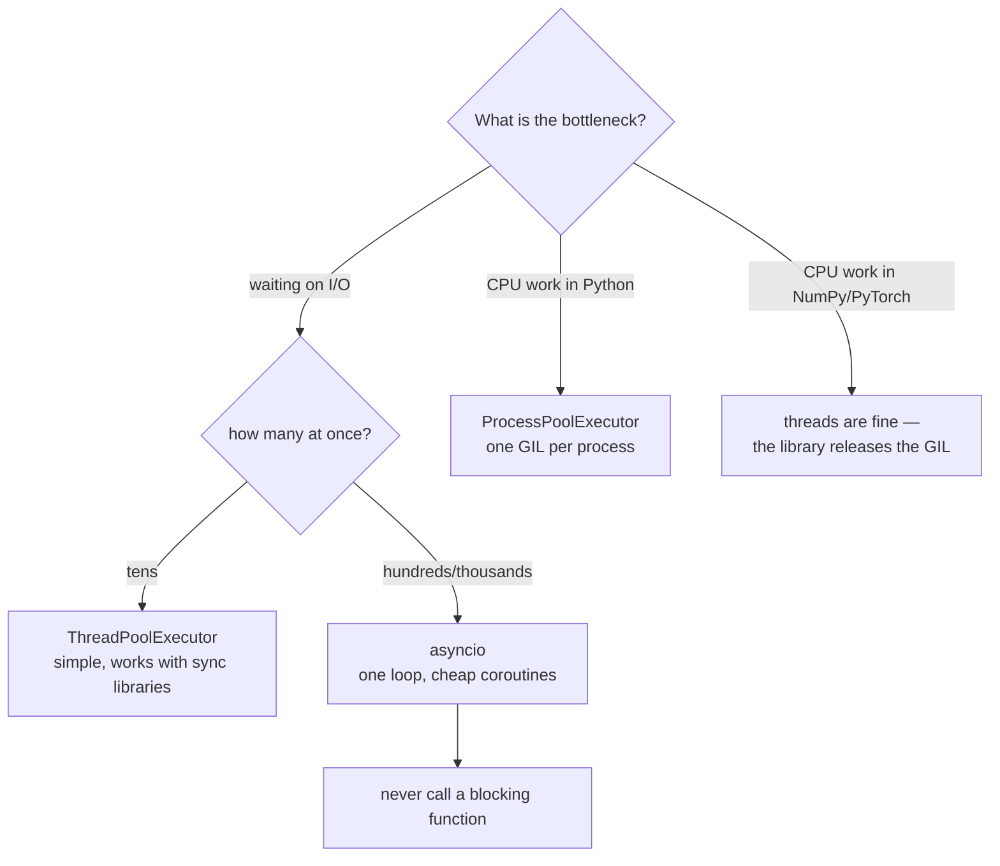

**In one line.** Threads for waiting, processes for computing, asyncio for thousands of simultaneous waits — the GIL decides which.

## The idea in plain words

The **GIL** (global interpreter lock) lets only one thread execute Python bytecode at a time in a process. It does **not** block I/O: a thread waiting on a socket or a file releases the lock. That single fact produces the whole decision table:

- **I/O-bound** (HTTP calls, databases, disk) → **threads** or **asyncio**. Waiting happens in parallel even with the GIL.
- **CPU-bound** (parsing, maths, image work in pure Python) → **processes**. Each has its own interpreter and its own GIL.
- **Thousands of concurrent waits** → **asyncio**. A coroutine costs a few kilobytes; a thread costs megabytes of stack.

`concurrent.futures` gives one interface over the first two: swap `ThreadPoolExecutor` for `ProcessPoolExecutor` and the code is otherwise unchanged.

**asyncio** is cooperative: a coroutine runs until it `await`s, then yields the event loop to another. That makes it very efficient and very unforgiving — **one blocking call freezes the entire loop**. Anything synchronous and slow must go through `asyncio.to_thread`.

Worth knowing: NumPy, pandas and PyTorch release the GIL inside their C code, so threads *do* parallelise there. And free-threaded builds (PEP 703) are landing, which will change the calculus for CPU-bound Python over the next few years.



## How it works

### concurrent.futures: one API, two backends

```python
from concurrent.futures import ThreadPoolExecutor, ProcessPoolExecutor, as_completed

with ThreadPoolExecutor(max_workers=16) as pool:          # I/O bound
    futures = {pool.submit(fetch, url): url for url in urls}
    for fut in as_completed(futures):
        url = futures[fut]
        try:
            handle(fut.result())
        except Exception:
            log.exception("failed: %s", url)
```

Always consume results (or call `.result()`), or exceptions vanish silently. Size thread pools by *waiting* time, not by CPU count — 4× cores is a reasonable start for network work.

### asyncio, the parts you use

```python
import asyncio, httpx

async def fetch(client, url):
    r = await client.get(url, timeout=10)
    return url, r.status_code

async def main(urls):
    async with httpx.AsyncClient() as client:
        async with asyncio.TaskGroup() as tg:              # 3.11+
            tasks = [tg.create_task(fetch(client, u)) for u in urls]
    return [t.result() for t in tasks]
```

`TaskGroup` replaces `gather` for structured concurrency: if one task fails the rest are cancelled and the errors arrive as an `ExceptionGroup`. Use `asyncio.Semaphore` to bound concurrency, `asyncio.timeout` for deadlines, and `asyncio.to_thread(blocking_fn)` for anything synchronous.

### Sharing state without corrupting it

`x += 1` is not atomic — it reads, adds and writes, and a thread switch in the middle loses updates. Options: a `threading.Lock`, or better, do not share at all. `queue.Queue` is thread-safe and turns shared state into message passing, which is far easier to reason about.

For processes, state is not shared at all: arguments and results are pickled. That is why a process pool has real per-task overhead and why the function must be importable at module level.

## A real system that works this way

**Calling twenty APIs to build one response** is the archetypal thread-pool job: ~20× faster wall-clock with sixteen threads, because they are all waiting rather than computing.

**A web scraper or crawler** at thousands of concurrent connections is where asyncio is unbeatable — a thread per connection would exhaust memory long before the network saturates.

**Image or document processing in pure Python** needs processes; with threads the GIL serialises it and you get no speedup at all, which is the classic disappointing first attempt at "making it parallel".

## Code you can run

```python
import asyncio, math, os, time
from concurrent.futures import ProcessPoolExecutor, ThreadPoolExecutor, as_completed

# Everything below module level lives under the __main__ guard: a process pool
# re-imports this module in each child, and unguarded top-level code would run
# again in every one of them.
def io_task(n):
    time.sleep(0.05)                 # stands in for a network call
    return n

def cpu_task(n):
    total = 0.0
    for i in range(1, 400_000):
        total += math.sqrt(i) * n
    return total

if __name__ == "__main__":
    # --- I/O-bound: threads win despite the GIL -----------------------------
    start = time.perf_counter()
    serial = [io_task(i) for i in range(16)]
    serial_time = time.perf_counter() - start

    start = time.perf_counter()
    with ThreadPoolExecutor(max_workers=16) as pool:
        threaded = list(pool.map(io_task, range(16)))
    thread_time = time.perf_counter() - start

    print(f"I/O  serial {serial_time:.2f}s | threads {thread_time:.2f}s "
          f"→ {serial_time/thread_time:.1f}× faster")

    # --- CPU-bound: threads do NOT help; processes do -----------------------
    start = time.perf_counter()
    [cpu_task(i) for i in range(4)]
    cpu_serial = time.perf_counter() - start

    start = time.perf_counter()
    with ThreadPoolExecutor(max_workers=4) as pool:
        list(pool.map(cpu_task, range(4)))
    cpu_threads = time.perf_counter() - start

    start = time.perf_counter()
    with ProcessPoolExecutor(max_workers=min(4, os.cpu_count() or 1)) as pool:
        list(pool.map(cpu_task, range(4)))
    cpu_procs = time.perf_counter() - start

    print(f"CPU  serial {cpu_serial:.2f}s | threads {cpu_threads:.2f}s "
          f"(no gain — the GIL) | processes {cpu_procs:.2f}s")

    # --- asyncio: thousands of concurrent waits -----------------------------
    async def fetch(i, sem):
        async with sem:                       # bound concurrency
            await asyncio.sleep(0.05)
            return i

    async def main():
        sem = asyncio.Semaphore(50)
        started = time.perf_counter()
        async with asyncio.TaskGroup() as tg:  # structured: failures cancel siblings
            tasks = [tg.create_task(fetch(i, sem)) for i in range(500)]
        elapsed = time.perf_counter() - started
        print(f"asyncio: 500 awaits in {elapsed:.2f}s "
              f"(serial would be {500*0.05:.0f}s)")
        return len(tasks)

    asyncio.run(main())

    # --- the classic async mistake ------------------------------------------
    async def blocking_inside_loop():
        started = time.perf_counter()
        await asyncio.gather(*(asyncio.sleep(0.05) for _ in range(5)))
        good = time.perf_counter() - started

        started = time.perf_counter()
        for _ in range(5):
            time.sleep(0.05)          # BLOCKS the whole event loop
        bad = time.perf_counter() - started
        print(f"await sleep {good:.2f}s vs blocking sleep {bad:.2f}s "
              f"— blocking freezes every other task")

    asyncio.run(blocking_inside_loop())

    # --- shared mutable state is not atomic ---------------------------------
    import threading
    counter = 0
    def increment():
        global counter
        for _ in range(100_000):
            counter += 1              # read-modify-write: racy

    threads = [threading.Thread(target=increment) for _ in range(4)]
    [t.start() for t in threads]; [t.join() for t in threads]
    print(f"unsynchronised counter: {counter:,} (expected 400,000)")

    counter = 0
    lock = threading.Lock()
    def safe_increment():
        global counter
        for _ in range(100_000):
            with lock:
                counter += 1

    threads = [threading.Thread(target=safe_increment) for _ in range(4)]
    [t.start() for t in threads]; [t.join() for t in threads]
    print(f"locked counter        : {counter:,}")
```

## Designing with it

**The decision table**

| Workload | Tool | Notes |
| --- | --- | --- |
| Tens of HTTP/DB calls | `ThreadPoolExecutor` | Works with any synchronous client |
| Thousands of connections | `asyncio` + async client | Needs async-native libraries end to end |
| CPU-bound pure Python | `ProcessPoolExecutor` | Pickling overhead; batch the work |
| NumPy/pandas/Torch heavy | Threads, or the library's own parallelism | They release the GIL |
| Cross-machine scale | A task queue (Celery, RQ, Arq) | Concurrency inside one process stops being the answer |

**Rules**

- **Bound everything**: pool sizes, semaphores, queue sizes. Unbounded concurrency turns a dependency's slow day into your outage.
- **Timeouts on every external call**, always. Without them, one hung connection consumes a worker forever.
- **Prefer message passing to shared state.** `queue.Queue` between threads; results returned from processes.
- **Do not mix sync and async casually.** `asyncio.to_thread` for blocking calls; never `time.sleep` or a sync HTTP client inside a coroutine.
- **Test concurrency deliberately** — races reproduce under load, not in a single-threaded unit test.

## Where this stands in 2026

:::info Industry view

- `asyncio` is the default for new network-bound services; FastAPI, httpx, asyncpg and aiokafka are the common stack.
- `TaskGroup` and `ExceptionGroup` (3.11+) made structured concurrency the recommended style over bare `gather`.
- The GIL question remains a standard interview probe; free-threaded builds (PEP 703) are the live development to mention.
- Blocking the event loop is the single most common async production bug — profilers and loop-lag monitors exist precisely for it.

:::

## Practice questions

<details>
<summary><strong>Q1.</strong> Why do threads speed up HTTP calls but not a pure-Python loop?</summary>

A thread waiting on I/O releases the GIL, so other threads run — the waits overlap. CPU-bound bytecode holds the GIL, so only one thread progresses at a time and you gain nothing (and pay for context switching).

</details>

<details>
<summary><strong>Q2.</strong> What breaks when you call `requests.get()` inside a coroutine?</summary>

It blocks the event loop thread, so every other task stops until it returns — including timeouts and heartbeats. Use an async client, or wrap it with `asyncio.to_thread`.

</details>

<details>
<summary><strong>Q3.</strong> Why is `counter += 1` unsafe across threads when the GIL exists?</summary>

The GIL guarantees only that one bytecode runs at a time, and `+=` is several bytecodes: load, add, store. A switch between them loses an update. Use a lock, an atomic structure, or avoid sharing.

</details>

## Further reading

- [asyncio documentation](https://docs.python.org/3/library/asyncio.html) — start with the high-level API and TaskGroup.
- [concurrent.futures](https://docs.python.org/3/library/concurrent.futures.html) — the uniform pool interface.
- [PEP 703 — making the GIL optional](https://peps.python.org/pep-0703/) — where CPython is heading.
- [Real Python: speed up your program with concurrency](https://realpython.com/python-concurrency/) — the same decision table, worked end to end.
