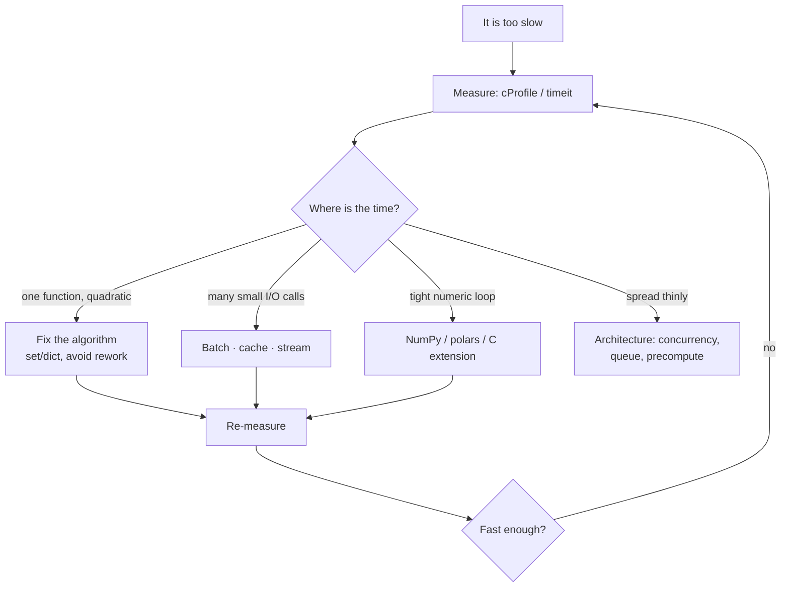

**In one line.** Measure first: nearly every real speedup is an algorithm or a data-structure change, not a micro-optimisation.

## The idea in plain words

The order of attack, and it rarely varies:

1. **Measure.** `timeit` for small snippets, `cProfile` for whole programs, `tracemalloc` for memory. Guessing wastes days.
2. **Fix the algorithm.** O(n²) → O(n) beats every micro-optimisation combined. Usually this means a `set`/`dict` lookup, avoiding repeated work in a loop, or not sorting inside the loop.
3. **Do less I/O.** Batch database calls, cache, stream instead of loading, and stop crossing the network in a loop — the "N+1 query" problem.
4. **Move the hot loop out of Python.** NumPy, pandas/polars, or a compiled extension. Vectorised code is not "faster Python", it is C.
5. **Only then micro-optimise** — local variable lookups, avoiding attribute access in loops, `__slots__`.

For memory: Python objects are large (a small `int` is ~28 bytes; a `dict` has significant overhead). The wins come from `__slots__`, generators instead of lists, arrays (`array`, NumPy) instead of lists of numbers, and simply not holding everything at once.



## How it works

### The measuring tools

```python
import cProfile, pstats, timeit, tracemalloc

timeit.timeit("sum(range(1000))", number=10_000)           # micro-benchmarks

with cProfile.Profile() as pr:
    main()
pstats.Stats(pr).sort_stats("cumulative").print_stats(15)  # where the time goes

tracemalloc.start()
work()
current, peak = tracemalloc.get_traced_memory()            # where the memory goes
```

`cumulative` answers "which call chain costs the most"; `tottime` answers "which function itself is slow". For line-level detail use `line_profiler`; for a low-overhead production view use `py-spy`, which attaches to a running process without restarting it.

### Algorithmic wins, in order of frequency

- Membership test against a list → `set` (O(n) → O(1)).
- Repeated lookup by key → build a `dict` index once instead of scanning.
- Sorting or building the same thing inside a loop → hoist it out.
- String concatenation in a loop → `"".join`.
- N+1 queries → one query with an `IN` clause, or a join.
- Recomputing a pure function → `functools.lru_cache`.

### Memory: what actually costs

```python
import sys
sys.getsizeof(0)            # ~28 bytes for a small int
sys.getsizeof([])           # list overhead before any elements
```

`__slots__` (or `@dataclass(slots=True)`) removes the per-instance `__dict__`, often halving the footprint of many small objects. A generator holds one item; a list holds all of them. `array.array` or NumPy stores numbers unboxed, which is an order of magnitude smaller than a list of Python ints.

Leaks in long-running services are usually **unbounded caches**, module-level accumulating lists, or reference cycles holding large objects — `tracemalloc` snapshots taken minutes apart will show you which.

## A real system that works this way

**The N+1 query** is the most common real-world performance bug in Python services: a loop that fetches one row per iteration. A hundred rows becomes a hundred round trips; batching into a single query turns 2 seconds into 20 milliseconds, and no amount of Python-level tuning gets close.

**Vectorising a numeric loop** is the second: a pure-Python loop over a million floats against the NumPy equivalent is typically 50–100× — because the loop now runs in C, with no per-element object boxing.

## Code you can run

```python
import cProfile, io, pstats, random, sys, time, timeit, tracemalloc
from dataclasses import dataclass
from functools import lru_cache

random.seed(0)

# --- 1. algorithmic: list vs dict index -------------------------------------
users = [{"id": i, "name": f"user{i}"} for i in range(20_000)]
lookup_ids = [random.randrange(20_000) for _ in range(2_000)]

def scan_each_time():
    return sum(1 for uid in lookup_ids
               if next((u for u in users if u["id"] == uid), None))

index = {u["id"]: u for u in users}          # built once
def use_index():
    return sum(1 for uid in lookup_ids if uid in index)

t_scan = timeit.timeit(scan_each_time, number=1)
t_index = timeit.timeit(use_index, number=1)
print(f"linear scan : {t_scan*1000:8.1f} ms")
print(f"dict index  : {t_index*1000:8.1f} ms  → {t_scan/t_index:,.0f}× faster\n")

# --- 2. string building ------------------------------------------------------
def concat():
    out = ""
    for i in range(20_000):
        out += str(i)
    return out

def join():
    return "".join(str(i) for i in range(20_000))

print(f"+= in a loop: {timeit.timeit(concat, number=5)*1000:7.1f} ms")
print(f'"".join     : {timeit.timeit(join, number=5)*1000:7.1f} ms\n')

# --- 3. caching a pure function ---------------------------------------------
def slow_score(n):
    time.sleep(0.001)
    return n * n

@lru_cache(maxsize=1024)
def cached_score(n):
    time.sleep(0.001)
    return n * n

queries = [random.randrange(50) for _ in range(300)]
t0 = time.perf_counter(); [slow_score(q) for q in queries]; t_plain = time.perf_counter() - t0
t0 = time.perf_counter(); [cached_score(q) for q in queries]; t_cached = time.perf_counter() - t0
print(f"uncached: {t_plain*1000:6.1f} ms | cached: {t_cached*1000:6.1f} ms "
      f"({cached_score.cache_info().hits} hits)\n")

# --- 4. profiling shows where the time actually goes ------------------------
def workload():
    scan_each_time()
    join()

buf = io.StringIO()
with cProfile.Profile() as pr:
    workload()
pstats.Stats(pr, stream=buf).sort_stats("cumulative").print_stats(4)
print("profile (top rows):")
print("\n".join(line for line in buf.getvalue().splitlines()[4:9] if line.strip()))

# --- 5. memory: slots and generators ----------------------------------------
@dataclass
class Fat:
    x: int; y: int; z: int

@dataclass(slots=True)
class Lean:
    x: int; y: int; z: int

tracemalloc.start()
fat = [Fat(i, i, i) for i in range(50_000)]
fat_peak = tracemalloc.get_traced_memory()[1]; tracemalloc.stop(); del fat

tracemalloc.start()
lean = [Lean(i, i, i) for i in range(50_000)]
lean_peak = tracemalloc.get_traced_memory()[1]; tracemalloc.stop(); del lean

print(f"\n50k dataclass objects : {fat_peak/1e6:6.2f} MB")
print(f"50k with slots=True   : {lean_peak/1e6:6.2f} MB "
      f"({(1-lean_peak/fat_peak)*100:.0f}% less)")

print(f"one int costs {sys.getsizeof(0)} bytes; an empty list {sys.getsizeof([])} bytes")
```

## Designing with it

**Optimisation checklist**

| Step | Tool | Typical win |
| --- | --- | --- |
| Find the hot path | `cProfile`, `py-spy` | — |
| Wrong data structure | `set`/`dict` | 10–1000× |
| Repeated work | `lru_cache`, hoist out of the loop | 2–100× |
| Chatty I/O | Batch, join, pipeline | 10–100× |
| Numeric loop | NumPy / polars | 20–100× |
| Many small objects | `slots=True`, arrays | 30–60% memory |
| Micro-optimisation | Local variables, fewer attribute lookups | 1.1–1.5× |

**Discipline**

- **Benchmark on realistic data.** Speedups on 100 rows often vanish or reverse at a million.
- **Set a target.** "Fast enough" is a number in a ticket, not a feeling.
- **Re-measure after every change**, and keep the benchmark in the repo so a regression is visible.
- **Prefer clarity until it is proven slow.** Most code is not hot, and unreadable code costs more over a year than a millisecond does.

**Know when to leave Python**: if the hot loop is numeric and cannot be vectorised, the options are Cython, a Rust extension (PyO3/maturin), or Numba. That is a real engineering commitment — make it deliberately, not by accident.

## Where this stands in 2026

:::info Industry view

- Profiling before optimising is the expected professional habit; `py-spy` in particular is standard for live production diagnosis.
- Most "Python is slow" complaints in services turn out to be N+1 queries or unbatched network calls, not interpreter speed.
- polars and DuckDB are increasingly chosen over pandas for large tabular work because they parallelise and stay off the GIL.
- Memory limits in containers make `slots=True`, streaming and bounded caches practical requirements rather than niceties.

:::

## Practice questions

<details>
<summary><strong>Q1.</strong> Your endpoint is slow. What do you do first?</summary>

Measure — profile the request path (cProfile locally, py-spy or APM traces in production) to find where the time actually goes. The bottleneck is very often a database round trip per item, not Python execution.

</details>

<details>
<summary><strong>Q2.</strong> Why does `__slots__` save memory?</summary>

It replaces the per-instance `__dict__` with a fixed array of descriptors, removing a dict per object. The trade is that you cannot add attributes dynamically and multiple inheritance gets restrictive.

</details>

<details>
<summary><strong>Q3.</strong> When is `lru_cache` a bad idea?</summary>

When arguments are unhashable, when the function is not pure, when the key space is unbounded (a memory leak), or when it is applied to a method — which keeps `self` alive for the life of the cache.

</details>

## Further reading

- [timeit](https://docs.python.org/3/library/timeit.html), [cProfile](https://docs.python.org/3/library/profile.html), [tracemalloc](https://docs.python.org/3/library/tracemalloc.html).
- [py-spy](https://github.com/benfred/py-spy) — sampling profiler that attaches to a running process.
- [Python behind the scenes / CPython internals](https://docs.python.org/3/c-api/intro.html) — for when you need to know why an operation costs what it does.
- [High Performance Python (Gorelick & Ozsvald)](https://www.oreilly.com/library/view/high-performance-python/9781492055013/) — the standard book on this topic.
