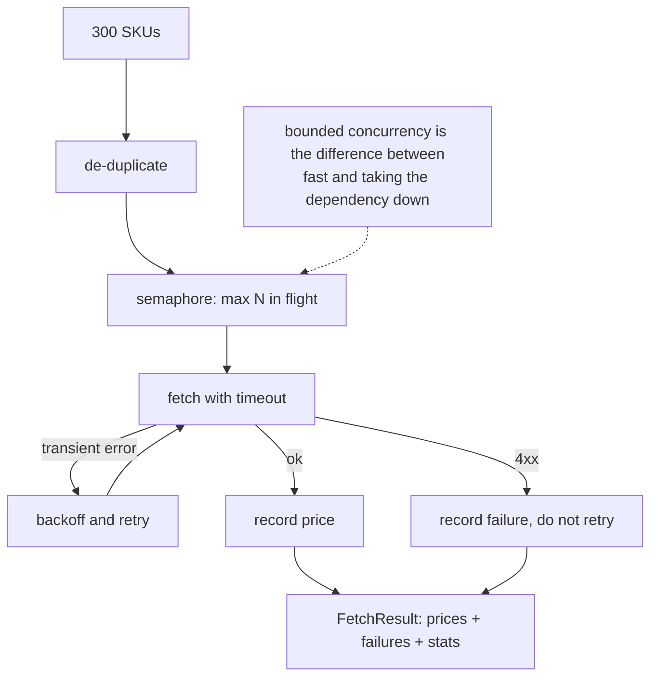

**In one line.** Turn a serial loop over 300 slow lookups into a bounded, typed, retrying async pipeline — and measure the speedup rather than assuming it.

## The brief

A pricing service answers in about 50 ms. You need 300 prices to build one page. Serially that is 15 seconds; the budget is one. Build the concurrent version properly: typed models, a semaphore so you do not open 300 connections, per-call timeouts, retries on transient failures only, and a partial-failure result that the caller can act on.

## Requirements

- [ ] Typed throughout — `mypy --strict` clean, no bare `Any`.
- [ ] Bounded concurrency with a semaphore; the limit is configuration, not a constant buried in a function.
- [ ] A timeout on **every** call; a hung dependency must not hang the job.
- [ ] Retries with exponential backoff on transient errors only — never on a 4xx.
- [ ] **Partial success is a first-class result**: return what succeeded and what failed, with reasons.
- [ ] De-duplicate repeated keys before fetching.
- [ ] Report the measured speedup and the concurrency actually reached.

## What it exercises

| Concept | Where it appears |
| --- | --- |
| [Typing and models](/docs/code/python/typing-and-models) | Dataclasses, `Protocol` for the client seam, generics |
| [Concurrency and asyncio](/docs/code/python/concurrency-and-asyncio) | `TaskGroup`, `Semaphore`, `asyncio.timeout`, `to_thread` |
| [Decorators](/docs/code/python/decorators) | The retry wrapper |
| [Performance](/docs/code/python/performance-and-memory) | Measuring, not guessing |
| [Errors](/docs/code/python/errors-and-exceptions) | Domain exceptions, partial-failure results | ## Design it first



## The solution

```python
"""Bounded, typed, retrying concurrency - with the speedup measured."""
from __future__ import annotations

import asyncio, random, time
from dataclasses import dataclass, field
from decimal import Decimal
from typing import Protocol

# --- domain errors -----------------------------------------------------------
class PricingError(Exception):
    """Base for this module."""

class TransientPricingError(PricingError):
    """Worth retrying: timeout, 5xx, connection reset."""

class PermanentPricingError(PricingError):
    """Not worth retrying: unknown SKU, bad request."""

# --- typed models ------------------------------------------------------------
@dataclass(frozen=True, slots=True)
class Price:
    sku: str
    amount: Decimal
    currency: str = "CHF"

@dataclass
class FetchResult:
    prices: dict[str, Price] = field(default_factory=dict)
    failures: dict[str, str] = field(default_factory=dict)
    attempts: int = 0
    peak_in_flight: int = 0

    @property
    def success_rate(self) -> float:
        total = len(self.prices) + len(self.failures)
        return len(self.prices) / total if total else 0.0

# --- the seam: anything with this shape works, including a fake -------------
class PricingClient(Protocol):
    async def get_price(self, sku: str) -> Decimal: ...

class FlakyClient:
    """Stands in for the real HTTP client: slow, occasionally failing."""

    def __init__(self, latency: float = 0.05, transient_rate: float = 0.25,
                 seed: int = 0) -> None:
        self.latency, self.transient_rate = latency, transient_rate
        self.rng = random.Random(seed)
        self.calls = 0
        self.in_flight = 0
        self.peak_in_flight = 0

    async def get_price(self, sku: str) -> Decimal:
        self.calls += 1
        self.in_flight += 1
        self.peak_in_flight = max(self.peak_in_flight, self.in_flight)
        try:
            await asyncio.sleep(self.latency)
            if sku.startswith("BAD-"):
                raise PermanentPricingError(f"unknown sku {sku}")
            if self.rng.random() < self.transient_rate:
                raise TransientPricingError("upstream timeout")
            return Decimal(str(round(10 + self.rng.random() * 90, 2)))
        finally:
            self.in_flight -= 1

# --- retry, as a decorator on the unit of work ------------------------------
def with_retry(attempts: int = 4, base_delay: float = 0.01):
    def decorator(fn):
        async def wrapper(*args, **kwargs):
            last: Exception | None = None
            for attempt in range(1, attempts + 1):
                try:
                    return await fn(*args, **kwargs)
                except TransientPricingError as exc:
                    last = exc
                    if attempt < attempts:
                        await asyncio.sleep(base_delay * 2 ** (attempt - 1))
                except PermanentPricingError:
                    raise                      # never retry our own mistake
            raise TransientPricingError(f"gave up after {attempts} attempts") from last
        return wrapper
    return decorator

# --- the pipeline ------------------------------------------------------------
async def fetch_prices(client: PricingClient, skus: list[str], *,
                       max_concurrency: int = 20,
                       per_call_timeout: float = 1.0) -> FetchResult:
    result = FetchResult()
    semaphore = asyncio.Semaphore(max_concurrency)

    @with_retry()
    async def fetch_one(sku: str) -> Decimal:
        async with asyncio.timeout(per_call_timeout):     # every call is bounded
            return await client.get_price(sku)

    async def worker(sku: str) -> None:
        async with semaphore:                             # backpressure
            try:
                amount = await fetch_one(sku)
                result.prices[sku] = Price(sku, amount)
            except PricingError as exc:
                result.failures[sku] = str(exc)
            except TimeoutError:
                result.failures[sku] = "timed out"

    unique = list(dict.fromkeys(skus))                    # de-duplicate first
    async with asyncio.TaskGroup() as tg:
        for sku in unique:
            tg.create_task(worker(sku))

    result.attempts = getattr(client, "calls", 0)
    result.peak_in_flight = getattr(client, "peak_in_flight", 0)
    return result

# --- the serial baseline, for an honest comparison -------------------------
async def fetch_serially(client: PricingClient, skus: list[str]) -> FetchResult:
    result = FetchResult()
    for sku in dict.fromkeys(skus):
        try:
            result.prices[sku] = Price(sku, await client.get_price(sku))
        except PricingError as exc:
            result.failures[sku] = str(exc)
    return result

# --- run it ------------------------------------------------------------------
async def main() -> None:
    skus = [f"SKU-{i % 150}" for i in range(300)] + ["BAD-1", "BAD-2"]

    serial_client = FlakyClient(transient_rate=0.0, seed=1)
    start = time.perf_counter()
    serial = await fetch_serially(serial_client, skus)
    serial_time = time.perf_counter() - start

    for limit in (10, 50):
        client = FlakyClient(transient_rate=0.25, seed=1)
        start = time.perf_counter()
        result = await fetch_prices(client, skus, max_concurrency=limit)
        elapsed = time.perf_counter() - start
        print(f"concurrency {limit:3}: {elapsed:5.2f}s  "
              f"speedup {serial_time/elapsed:5.1f}x  "
              f"prices {len(result.prices):3}  failures {len(result.failures)}  "
              f"peak in flight {result.peak_in_flight:3}  "
              f"calls {result.attempts} (retries included)")

    print(f"\nserial baseline : {serial_time:5.2f}s for {len(serial.prices)} prices")
    print(f"success rate    : {result.success_rate:.1%}")
    print(f"failures        : {result.failures}")
    print("\nnote: peak in flight never exceeds the semaphore limit -")
    print("that is what stops a burst from taking the dependency down.")

asyncio.run(main())
```

## How to check yourself

- **Peak in flight never exceeds the limit.** If it does, your semaphore is in the wrong place.
- Raising concurrency from 10 to 50 improves wall-clock but not linearly — find where it stops helping.
- `BAD-*` SKUs fail **once** each; a permanent error must never be retried.
- Total calls exceed unique SKUs by exactly the number of retries.
- `mypy --strict` passes on the file.
- Removing `asyncio.timeout` and making one call hang forever should hang the job — confirm it, then put the timeout back.

## Extensions

1. **Swap `FlakyClient` for httpx** against a real endpoint; the pipeline code should not change — that is what the `Protocol` bought you.
2. **Add a cache** so repeated SKUs within a window skip the network entirely, and measure the new hit rate.
3. **Compare with `ThreadPoolExecutor`** using a synchronous client; explain the difference from the [GIL](/docs/code/python/concurrency-and-asyncio).
4. **Add a circuit breaker**: after N consecutive failures, stop calling for a cool-down instead of retrying.
5. **Profile it** with `py-spy` under load and find where the time actually goes ([Performance](/docs/code/python/performance-and-memory)).
