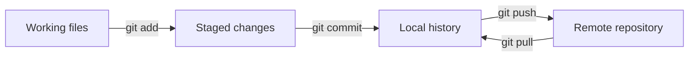

> **Video:** [developer tools from 4:09:44](https://www.youtube.com/watch?v=ygXn5nV5qFc&t=14984s), culminating in the [workflow exercise at 5:09:01](https://www.youtube.com/watch?v=ygXn5nV5qFc&t=18541s).

Create a project that another person can open, install and run from your instructions.

This follows the video's tools sequence. The commands are examples for your own practice project; reading this lesson does not publish anything. **Added practice** includes inspecting staged changes, configuration validation and rebuilding the environment.

## Git and GitHub, step by step

Git records local history. GitHub hosts repositories online. A commit works without a GitHub account or an internet connection; pushing uploads commits to a remote repository.



### Install and identify yourself

Check `git --version`, and use the [official Git installation instructions](https://git-scm.com/book/en/v2/Getting-Started-Installing-Git) if it is missing. Configure the author information you want on commits:

```bash
git config --global user.name "Your Name"
git config --global user.email "your-chosen-commit-email@example.com"
```

These commands set commit attribution, not authentication. For GitHub, create an account and use a supported authentication method. With the GitHub CLI installed, run:

```bash
gh auth login
gh auth status
```

Follow its browser sign-in steps. You can choose HTTPS or SSH according to your setup. Never put a token into a repository URL or a tracked file. The command is `gh auth login`; see the [GitHub CLI manual](https://cli.github.com/manual/gh_auth_login).

### Start a repository and choose what to save

For a new practice folder containing `hello.py`, create `.gitignore` **before staging files**:

```gitignore
.venv/
__pycache__/
*.py[cod]
.env
.env.*
!.env.example
output/
.ipynb_checkpoints/
.ruff_cache/
.DS_Store
```

Then run inside that folder:

```bash
git init -b main
git status
git add .gitignore hello.py
git diff --staged
git commit -m "Add first Python program"
```

`git add` selects the changes for the next snapshot. `git diff --staged` shows exactly that snapshot's changes. Add your dependency files and README when they exist. Avoid staging `.venv`, credentials or generated reports accidentally.

Ignoring a file does not remove it from existing commits. If a real key was committed, revoke or rotate it; deleting the visible file does not invalidate the key. If a tracked, non-secret generated file should stop being tracked, `git rm --cached PATH` removes it from the index while leaving the working copy.

### Connect to GitHub

Create an empty remote repository with the intended visibility. Copy its repository URL, then replace `YOUR_REPOSITORY_URL` in this example:

```bash
git remote add origin YOUR_REPOSITORY_URL
git push -u origin main
```

For daily work, inspect changes, stage named files, commit and push. For someone else's project, copy its clone URL and run `git clone URL`, then open the new folder and read its README before running code. `git pull --ff-only` updates a branch when it can advance without a merge; if it refuses because histories diverged, inspect the situation rather than force-pushing.

| Terminal operation | VS Code Source Control action |
| --- | --- |
| `git diff` | Open a changed file's diff |
| `git add file.py` | Stage the selected file |
| `git diff --staged` | Inspect staged changes |
| `git commit` | Enter a message and commit |
| `git push` | Push to the selected remote |

VS Code's **Publish Branch** can create a remote and asks for visibility. **Sync Changes** can include both pull and push, so read what the UI is about to do. Keep the [Git cheatsheet](../../../cheetsheet/git-master-cheatsheet.md) nearby for later work.

## Configuration and `.env` files

An environment variable belongs to a process environment and is inherited by child processes. Setting one in a terminal affects programs launched from that terminal; it does not update an already-running Jupyter kernel.

**macOS / Linux shell:**

```bash
export REPORT_CITY="Paris"
python -c "import os; print(os.getenv('REPORT_CITY'))"
```

**Windows PowerShell:**

```powershell
$env:REPORT_CITY = "Paris"
python -c "import os; print(os.getenv('REPORT_CITY'))"
```

For local development, install `python-dotenv` and create a local `.env`:

```bash
python -m pip install python-dotenv
```

```dotenv
REPORT_CITY=Paris
REQUEST_TIMEOUT=20
API_KEY=replace-with-your-local-value
```

Commit an `.env.example` with configuration names and non-secret defaults instead. Keep its `API_KEY` empty. A `.env` file is plain text, not encrypted storage, and ordinary Python does not load it automatically.

Save this as `config_check.py` alongside `.env`:

```python
import os
from pathlib import Path
from dotenv import load_dotenv

load_dotenv(Path(__file__).resolve().parent / ".env")

city = os.getenv("REPORT_CITY", "Paris")
timeout = float(os.getenv("REQUEST_TIMEOUT", "20"))
if not 0 < timeout <= 120:
    raise ValueError("REQUEST_TIMEOUT must be greater than 0 and at most 120")

api_key = os.getenv("API_KEY")
print(f"City: {city}; timeout: {timeout}s; key configured: {bool(api_key)}")
```

The [python-dotenv documentation](https://bbc2.github.io/python-dotenv/) explains that `load_dotenv` does not override existing environment values by default. This is useful when deployment supplies configuration externally. Restart a long-running kernel when checking changed configuration. Environment values are strings, so parse numeric values explicitly. Do not use `bool("false")` to parse a boolean setting; that expression is `True`.

For a service that actually requires a key, reject a missing or empty key at startup. The beginner weather API lab does not require one. Inspect key presence without printing its value.

## Format, lint and sort imports

Install the **Ruff** VS Code extension published by Astral. The three actions do different jobs:

| Action | Terminal command | Purpose |
| --- | --- | --- |
| Format | `ruff format .` | Consistent layout, spacing and wrapping |
| Lint | `ruff check .` | Find configured rule violations |
| Sort imports | `ruff check --select I --fix .` | Apply import ordering rules |

Formatting does not run your tests or prove that calculations are correct. Import sorting belongs to lint rules and is not performed by `ruff format` alone.

Merge these Python-specific settings into `.vscode/settings.json`:

```json
{
  "[python]": {
    "editor.defaultFormatter": "charliermarsh.ruff",
    "editor.formatOnSave": true,
    "editor.codeActionsOnSave": {
      "source.fixAll.ruff": "explicit",
      "source.organizeImports.ruff": "explicit"
    }
  }
}
```

These settings follow the [Ruff editor setup guide](https://docs.astral.sh/ruff/editors/setup/). Review changes made by automatic fixes. For a simple starting configuration in `pyproject.toml`:

```toml
[tool.ruff]
line-length = 88

[tool.ruff.lint]
select = ["E4", "E7", "E9", "F", "I"]
```

The existing [quality and CI chapter](./03-quality-and-ci.md) adds type checking, tests and checks on every pull request.

## Start a project with uv

Install uv using the [official instructions](https://docs.astral.sh/uv/getting-started/installation/), reopen your terminal and check `uv --version`. In a parent folder for projects:

```bash
uv init python-report
cd python-report
uv add requests pandas matplotlib python-dotenv
uv add --dev ipykernel ruff
```

The exact generated starter layout can vary by uv version and options. Create a `hello.py` in the project root containing `print("Project ready")`, then run:

```bash
uv run python hello.py
uv run ruff check .
uv run ruff format --check .
```

If the last check reports formatting changes, apply them with `uv run ruff format .` and inspect the result. Select the created `.venv` in VS Code and Jupyter too; editor processes do not automatically follow every terminal command.

| File or folder | Purpose | Usually commit? |
| --- | --- | --- |
| `pyproject.toml` | Project metadata, compatible dependencies and tool settings | Yes |
| `uv.lock` | Resolved dependency versions and sources | Yes for this application |
| `.python-version` | Preferred interpreter for tools that read it | Yes |
| `.venv/` | Installed environment on this machine | No |
| `.env` | Local configuration, possibly secrets | No |
| `.env.example` | Names and safe defaults for configuration | Yes |

`uv add` updates project dependencies, the lockfile and environment. `uv remove PACKAGE` removes a declared dependency. `uv sync` brings the environment into line with the project; `uv run` runs a command in it. To check that a committed lockfile agrees with project metadata, use `uv sync --locked`. See [uv project operations](https://docs.astral.sh/uv/guides/projects/) and [locking and syncing](https://docs.astral.sh/uv/concepts/projects/sync/).

:::note Lockfile precision

`requires-python` declares a compatibility range; it does not itself install or pin an exact interpreter. Libraries can commit a development lockfile while publishing dependency ranges for consumers. Also, `uv sync --frozen` skips checking whether the lockfile is current; it is not synonymous with `--locked` or with pip's `--require-hashes`. The [packaging chapter](./01-environments-and-packaging.md) develops these concepts.

:::

## Added practice: rebuild the complete project

Use either beginner lab as the work you want to preserve:

1. Create a fresh project folder and initialise uv.
2. Copy the lab's source and sample data, then add its runtime dependencies with `uv add`. Add Ruff and `ipykernel` as development dependencies.
3. Run the lab through `uv run python ...`; inspect the CSV and chart or workbook.
4. Add `.gitignore`, `.env.example` if used, and a README with exact commands and expected results.
5. Review `git status` and the staged diff, then commit source, sample input, metadata and lockfile.
6. Clone the repository into another directory, or copy the tracked files into a fresh directory without `.venv`.
7. Run `uv sync --locked`, select the new interpreter, and run the same commands from the README.

Keep real credentials local. The recreation succeeds when the reports contain the expected values without depending on a previous kernel, an absolute path on your machine, or packages installed globally.

- [ ] I can distinguish save, stage, commit and push.
- [ ] I can load configuration without printing credentials.
- [ ] I can distinguish formatting, linting and import sorting.
- [ ] I can rebuild and run the project using committed dependency files.
