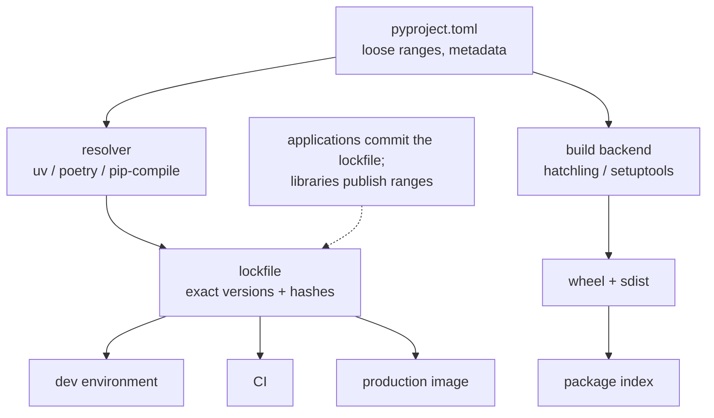

**In one line.** One isolated environment per project, one declared dependency set, one lockfile — that is what makes a build reproducible.

## The idea in plain words

Python installs packages **per environment**. Installing into the system interpreter is how machines break, so every project gets its own virtual environment.

Three files do the work:

- **`pyproject.toml`** — the single source of truth: project name, version, dependencies, and tool configuration. It replaced `setup.py`, `setup.cfg` and `requirements.txt` as the canonical place.
- **A lockfile** (`uv.lock`, `poetry.lock`, or a pinned `requirements.txt` from `pip-compile`) — the exact resolved versions and hashes, so CI, your laptop and production install the same bytes.
- **`.python-version`** or the `requires-python` field — the interpreter version, pinned deliberately.

The distinction that matters: **declare loose, install exact**. `pyproject.toml` says `httpx>=0.27`; the lockfile says `httpx==0.27.2` with a hash. Applications commit the lockfile; libraries do not, because they must stay compatible with a range.

The 2026 default toolchain is **uv** — it replaces pip, virtualenv, pip-tools and pyenv with one fast binary — though pip plus venv remains perfectly viable, and Poetry and PDM are widely used.



## How it works

### A project skeleton that works

```toml
# pyproject.toml
[project]
name = "orderflow"
version = "0.1.0"
requires-python = ">=3.12"
dependencies = ["httpx>=0.27", "pydantic>=2.7"]

[project.optional-dependencies]
dev = ["pytest>=8", "ruff>=0.5", "mypy>=1.10"]

[project.scripts]
orderflow = "orderflow.cli:main"       # installs a real command

[build-system]
requires = ["hatchling"]
build-backend = "hatchling.build"

[tool.ruff]
line-length = 100
```

`[project.scripts]` is how your package becomes a command on the PATH — far better than telling people to run `python src/thing.py`.

### Day-to-day commands

```bash
# uv (fast, current default)
uv venv                       # create .venv
uv add httpx                  # add a dependency and update the lock
uv sync                       # install exactly what the lock says
uv run pytest                 # run inside the environment

# pip + venv (always available)
python -m venv .venv && source .venv/bin/activate
pip install -e ".[dev]"       # editable install with dev extras
pip freeze > requirements.txt # a crude lock; pip-tools does it properly
```

Editable installs (`-e`) point at your source tree, so edits take effect without reinstalling — the standard development setup.

### Reproducibility rules

- **Commit the lockfile** for applications and services; regenerate it deliberately, review the diff.
- **Pin the Python version** — a minor version bump can change behaviour and available wheels.
- **Install with hashes** in production (`--require-hashes`, or `uv sync --frozen`) so a compromised index cannot substitute a package.
- **Separate dev from runtime dependencies** — a slimmer production image is both faster and a smaller attack surface.
- **Use multi-stage Docker builds**: resolve and install in a builder stage, copy only the environment into the runtime image.

## A real system that works this way

**"It works on my machine"** is almost always an unpinned transitive dependency. A lockfile with hashes eliminates that class of problem: CI installs exactly what you tested, and a surprise upstream release cannot break the build overnight.

**Internal libraries** are where `pyproject.toml` pays off: one `pip install -e .` and the package imports the same way everywhere, so no test ever needs `sys.path` surgery.

## Code you can run

```python
"""Inspect the environment the way a debugging session actually does."""
import importlib.metadata as md
import platform, subprocess, sys, sysconfig, tempfile, textwrap
from pathlib import Path

print("interpreter :", sys.executable)
print("version     :", platform.python_version(), "|", sys.version_info[:3])
print("in a venv   :", sys.prefix != sys.base_prefix)
print("site-packages:", sysconfig.get_paths()["purelib"].split("/")[-3:])

# what is installed, and where a given import comes from
installed = sorted(d.metadata["Name"] for d in md.distributions() if d.metadata["Name"])
print(f"\n{len(installed)} distributions installed; first few: {installed[:5]}")

try:
    print("bs4 version:", md.version("beautifulsoup4"))
except md.PackageNotFoundError:
    print("beautifulsoup4 is not installed in this environment")

# build a minimal distributable package and inspect its metadata
root = Path(tempfile.mkdtemp())
(root / "src" / "demopkg").mkdir(parents=True)
(root / "src" / "demopkg" / "__init__.py").write_text('__version__ = "0.1.0"\n')
(root / "src" / "demopkg" / "cli.py").write_text(textwrap.dedent("""
    def main() -> int:
        print("demopkg ran")
        return 0
"""))
(root / "pyproject.toml").write_text(textwrap.dedent("""
    [project]
    name = "demopkg"
    version = "0.1.0"
    requires-python = ">=3.10"
    dependencies = []

    [project.scripts]
    demopkg = "demopkg.cli:main"

    [build-system]
    requires = ["hatchling"]
    build-backend = "hatchling.build"
"""))

print("\nproject layout:")
for p in sorted(root.rglob("*")):
    if p.is_file():
        print("   ", p.relative_to(root))

# a lockfile is just exact versions + hashes; here is the shape of one
lock_example = textwrap.dedent("""
    # uv.lock (excerpt)
    [[package]]
    name = "httpx"
    version = "0.27.2"
    source = { registry = "https://pypi.org/simple" }
    dependencies = [{ name = "httpcore" }, { name = "idna" }]
    sdist = { hash = "sha256:f7c2be1d2f3c3c3a8e1b..." }
""").strip()
print("\n" + lock_example)

# the resolver constraint that trips people up
print("\nranges declared in pyproject describe COMPATIBILITY;")
print("the lockfile records what was RESOLVED — commit it for applications.")
```

## Designing with it

**Choosing a toolchain**

| Tool | Use when |
| --- | --- |
| **uv** | New projects — fastest, replaces pip/venv/pyenv/pip-tools |
| pip + venv | Minimal dependencies, or a constrained environment |
| Poetry / PDM | Teams already standardised on them; good publishing workflows |
| conda / mamba | Non-Python native dependencies (CUDA, GDAL, MKL) |

**Environment discipline**

- **One environment per project**, never the system Python.
- **Never `sudo pip install`.**
- **Regenerate the lock deliberately** (a scheduled dependency-update PR), not accidentally.
- **`requires-python` should be a real constraint** you test in CI, not aspirational.
- **Docker**: multi-stage build, copy the lockfile first so the dependency layer caches, install with `--no-cache-dir`, run as a non-root user.

**Publishing a library:** build with `python -m build`, check with `twine check`, publish to TestPyPI first, and use trusted publishing from CI rather than a long-lived API token.

## Where this stands in 2026

:::info Industry view

- **uv has become the default** for new Python projects — an order-of-magnitude faster resolver and one tool instead of four.
- `pyproject.toml` is now the only file you need; `setup.py` survives only in legacy packages.
- Lockfiles with hashes are a supply-chain security control, not just a convenience — required by many security policies.
- Multi-stage Docker builds with a slim runtime image and a non-root user are the expected production packaging pattern.

:::

## Practice questions

<details>
<summary><strong>Q1.</strong> Why commit a lockfile for an application but not for a library?</summary>

An application controls its own deployment, so pinning exact versions makes builds reproducible. A library is installed alongside other packages, so pinning would force conflicts on its users — it declares compatible ranges instead.

</details>

<details>
<summary><strong>Q2.</strong> What does `pip install -e .` do that `pip install .` does not?</summary>

An editable install links to your source tree rather than copying it, so code changes take effect immediately without reinstalling. It is for development only; production installs the built wheel.

</details>

<details>
<summary><strong>Q3.</strong> Your CI build broke overnight with no code change. What is the likely cause?</summary>

An unpinned transitive dependency released a new version. The fix is a lockfile with hashes so installs are deterministic, plus a scheduled update PR to take new versions deliberately.

</details>

## Further reading

- [Python Packaging User Guide](https://packaging.python.org/) — the authoritative source for pyproject, builds and publishing.
- [uv documentation](https://docs.astral.sh/uv/) — projects, locking, tool installation.
- [PEP 621 — project metadata in pyproject.toml](https://peps.python.org/pep-0621/).
- [Docker: best practices for Python images](https://docs.docker.com/language/python/) — layer caching and slim runtimes.
