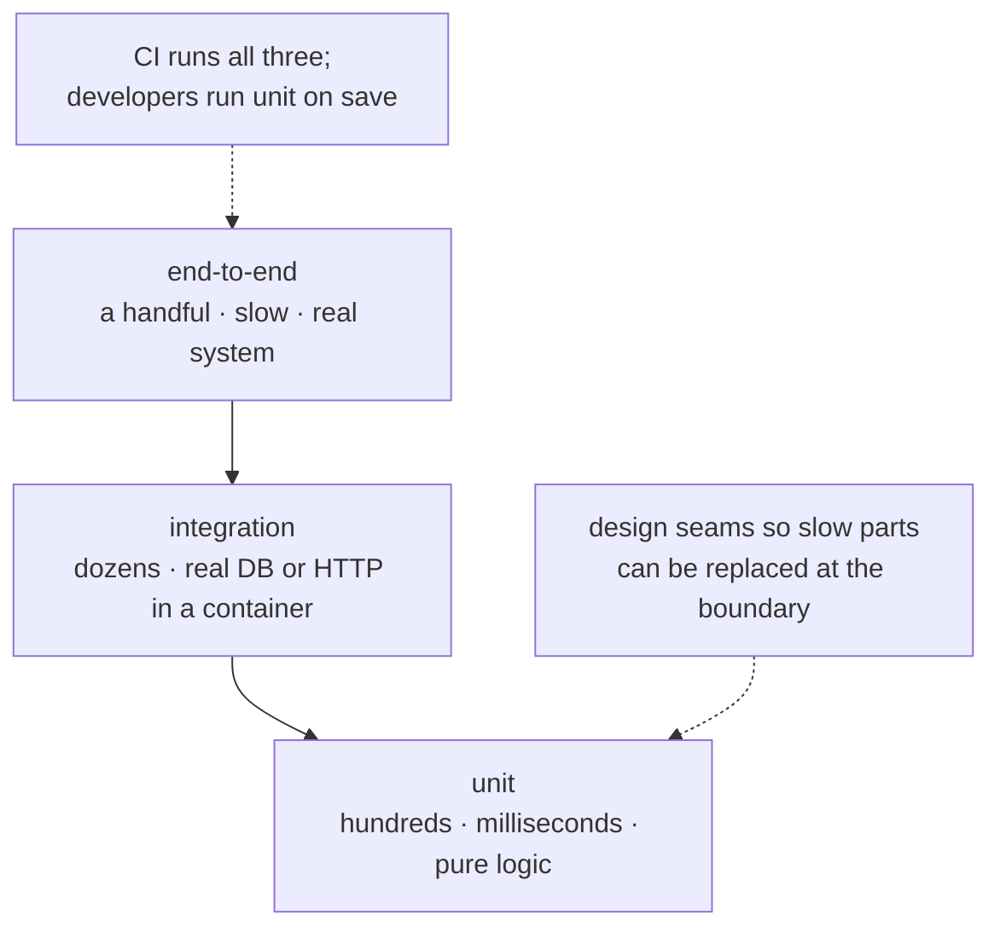

**In one line.** A test suite is a design tool: code that is hard to test almost always has its seams in the wrong place.

## The idea in plain words

pytest needs no ceremony — a function named `test_*` containing a bare `assert`. It rewrites assertions so a failure shows the actual values, which is why nobody writes `assertEqual` any more.

Four features carry most of the value:

- **Fixtures** — reusable setup, requested by naming them as parameters. Scope them (`function`, `module`, `session`) to control how often they run.
- **Parametrisation** — one test, many cases, each reported separately.
- **Monkeypatching** — replace a dependency at a seam. Patch **where it is used**, not where it is defined.
- **`tmp_path`** — a real temporary directory that cleans itself up, so tests never touch your working tree.

The strategy that scales is the pyramid: **many fast unit tests**, fewer integration tests against real infrastructure, a handful of end-to-end tests. Optimise for the feedback loop — a suite that takes ten minutes stops being run.

Coverage is a **signal, not a target**. It tells you what is untested; it says nothing about whether the tests assert anything meaningful.



## How it works

### Fixtures and parametrisation

```python
import pytest

@pytest.fixture
def repo(tmp_path):
    db = Repository(tmp_path / "test.db")
    yield db                    # setup above, teardown below
    db.close()

@pytest.mark.parametrize("amount, expected", [
    (100, "10.00"),
    (0, "0.00"),
], ids=["normal", "zero"])
def test_fee(amount, expected):
    assert format_fee(amount) == expected
```

Fixtures compose — one can request another — and `conftest.py` shares them across a directory without imports. Give parametrised cases `ids`, so a failure names the case instead of printing `test_fee[2]`.

### Mock at the boundary, not in the middle

```python
# GOOD: the seam is an injected client
def test_charge_retries():
    service = PaymentService(gateway=FlakyFakeGateway(fail_times=2))
    assert service.charge("A-1", 10).attempts == 3

# RISKY: patching a deep internal couples the test to the implementation
monkeypatch.setattr("app.services.billing._build_request", fake)
```

Patch where the name is **looked up**. If `app.billing` does `from httpx import get`, you patch `app.billing.get` — not `httpx.get`. Dependency injection removes most of the need for patching, which is why `Protocol`-shaped seams make code testable.

### What to assert

Test **behaviour at the boundary**, not internals. A test that asserts a private method was called breaks every time you tidy the code; a test that asserts the returned receipt survives any refactor.

Cover the shapes that actually fail: empty input, one element, duplicates, wrong types, boundary numbers, timezone edges, and every error path. Property-based testing (Hypothesis) generates those cases for you and finds the ones nobody writes by hand.

## A real system that works this way

**A payment service** is the standard illustration: inject the gateway as a protocol and the unit tests run in milliseconds against a fake that simulates timeouts, declines and duplicates. One integration test then exercises the real client against a sandbox. Without that seam, every test needs the network and the suite becomes unrunnable.

**Flaky tests** are almost always time, randomness, ordering or shared state. Freeze the clock, seed the RNG, isolate the database per test, and never let tests depend on execution order.

## Code you can run

```python
"""A complete pytest suite, written to disk and executed so you can see it pass."""
import subprocess, sys, tempfile, textwrap
from pathlib import Path

project = Path(tempfile.mkdtemp())

# --- the code under test: the seam is an injected gateway -------------------
(project / "billing.py").write_text(textwrap.dedent('''
    from dataclasses import dataclass
    from typing import Protocol

    class Gateway(Protocol):
        def charge(self, order_id: str, amount: float) -> dict: ...

    @dataclass
    class Receipt:
        order_id: str
        amount: float
        attempts: int

    class PaymentService:
        # The gateway is injected, so unit tests never touch the network.
        def __init__(self, gateway: Gateway, retries: int = 3):
            self.gateway, self.retries = gateway, retries

        def charge(self, order_id: str, amount: float) -> Receipt:
            if amount <= 0:
                raise ValueError("amount must be positive")
            last = None
            for attempt in range(1, self.retries + 1):
                try:
                    self.gateway.charge(order_id, amount)
                    return Receipt(order_id, amount, attempt)
                except TimeoutError as exc:
                    last = exc
            raise RuntimeError(f"gateway failed after {self.retries} attempts") from last
'''))

# --- the suite ---------------------------------------------------------------
(project / "test_billing.py").write_text(textwrap.dedent('''
    import pytest
    from billing import PaymentService, Receipt

    class FlakyGateway:
        # A fake with real behaviour, not a mock asserting on calls.
        def __init__(self, fail_times=0):
            self.fail_times, self.calls = fail_times, 0

        def charge(self, order_id, amount):
            self.calls += 1
            if self.calls <= self.fail_times:
                raise TimeoutError("timeout")
            return {"ok": True}

    @pytest.fixture
    def service():
        return PaymentService(FlakyGateway())

    def test_charges_first_time(service):
        assert service.charge("A-1", 10.0) == Receipt("A-1", 10.0, attempts=1)

    def test_retries_then_succeeds():
        service = PaymentService(FlakyGateway(fail_times=2))
        assert service.charge("A-2", 5.0).attempts == 3

    def test_gives_up_after_retries():
        service = PaymentService(FlakyGateway(fail_times=99), retries=2)
        with pytest.raises(RuntimeError, match="after 2 attempts"):
            service.charge("A-3", 5.0)

    @pytest.mark.parametrize("amount", [0, -1, -0.01],
                             ids=["zero", "negative", "tiny"])
    def test_rejects_non_positive(service, amount):
        with pytest.raises(ValueError):
            service.charge("A-4", amount)

    def test_writes_report(tmp_path):
        # tmp_path is a real directory, removed automatically afterwards
        report = tmp_path / "report.txt"
        report.write_text("ok")
        assert report.read_text() == "ok"
'''))

result = subprocess.run(
    [sys.executable, "-m", "pytest", "-q", "--no-header", str(project)],
    capture_output=True, text=True, cwd=project,
)
print(result.stdout[-700:] or result.stderr[-700:])
```

Five shapes that cover most service logic: the happy path, the retry path, the give-up path, input validation as a parametrised case, and a filesystem test.

## Designing with it

**A test strategy that holds up**

| Level | What it proves | Keep it |
| --- | --- | --- |
| Unit | Logic and edge cases | Milliseconds, no I/O, no network |
| Integration | Your code and the real dependency agree | Dockerised DB or sandbox API, in CI |
| End-to-end | The system works together | A few critical journeys only |
| Contract | Services still agree on the interface | Where teams deploy independently |

**Rules**

- **Arrange–Act–Assert**, one behaviour per test, named for the behaviour (`test_rejects_negative_amount`).
- **Prefer fakes to mocks.** A fake with real behaviour survives refactoring; a mock asserting call order pins the implementation in place.
- **Make tests deterministic** — freeze time (`time-machine`, `freezegun`), seed randomness, isolate state.
- **Test the error paths.** Most production incidents happen in code no test ever exercised.
- **Coverage ≥ 80% on the core, and read the diff.** Chasing 100% produces tests that assert nothing.
- **Fail the build on a flaky test** rather than re-running it; quarantine behind a ticket if you must.

## Where this stands in 2026

:::info Industry view

- pytest is the de facto standard; `unittest` survives mainly inside the standard library and older codebases.
- Dependency injection with `Protocol` seams is the expected way to make code testable, replacing heavy `mock.patch` usage.
- testcontainers — a real database in a container — has largely replaced hand-rolled fakes for integration tests.
- Property-based testing with Hypothesis is common in data and parsing code, where handwritten cases miss the interesting inputs.

:::

## Practice questions

<details>
<summary><strong>Q1.</strong> Where do you patch `requests.get` when it is used inside `app.client`?</summary>

At `app.client.requests.get` — or `app.client.get` if the module did `from requests import get`. Patching binds to the name in the module where it is looked up, not where it was originally defined.

</details>

<details>
<summary><strong>Q2.</strong> Why prefer a fake over a mock?</summary>

A fake implements real (simplified) behaviour, so tests assert on outcomes and survive refactoring. Mocks that assert on calls encode the implementation, so they break whenever you restructure code that still works correctly.

</details>

<details>
<summary><strong>Q3.</strong> Your suite passes locally and fails in CI about one run in ten. Where do you look?</summary>

Shared state between tests, execution-order dependence, real time or timezones, unseeded randomness, and concurrency. Run with random ordering and with a single worker to narrow it down, then fix the cause rather than adding a retry.

</details>

## Further reading

- [pytest documentation](https://docs.pytest.org/) — fixtures, parametrize, markers, plugins.
- [unittest.mock — where to patch](https://docs.python.org/3/library/unittest.mock.html#where-to-patch) — the part people get wrong.
- [Hypothesis](https://hypothesis.readthedocs.io/) — property-based testing.
- [testcontainers-python](https://testcontainers-python.readthedocs.io/) — real dependencies in integration tests.
