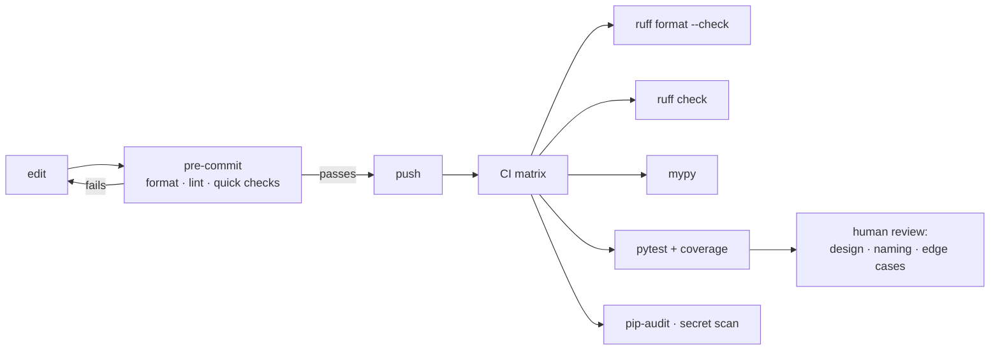

**In one line.** Automate everything a machine can check, so human review can spend its attention on design and correctness.

## The idea in plain words

A professional Python repository runs the same four checks locally and in CI:

1. **Format** — `ruff format` (Black-compatible). Formatting stops being a matter of opinion once it is automatic.
2. **Lint** — `ruff check`. One fast tool that replaced flake8, isort, pyupgrade and a pile of pylint plugins.
3. **Type-check** — `mypy` or `pyright`.
4. **Test** — `pytest`, with coverage.

**pre-commit** runs them on changed files at commit time, so feedback is immediate and CI rarely fails on style. CI then runs the same commands over the whole repository, across every Python version you support.

The point is not tidiness. It is that **review attention is scarce**: if a human is spending it on import order, they are not spending it on the concurrency bug.



## How it works

### Configure it once, in pyproject.toml

```toml
[tool.ruff]
line-length = 100
target-version = "py312"

[tool.ruff.lint]
select = ["E", "F", "I", "UP", "B", "SIM", "C4", "RUF", "S"]
ignore = ["E501"]                 # the formatter owns line length

[tool.mypy]
python_version = "3.12"
warn_return_any = true
warn_unused_ignores = true
disallow_untyped_defs = true      # start on one package, widen later

[tool.pytest.ini_options]
addopts = "-q --strict-markers --cov=src --cov-report=term-missing"
testpaths = ["tests"]
```

Rule families worth enabling early: `E`/`F` (pycodestyle, pyflakes), `I` (import sorting), `UP` (modernise syntax), `B` (bugbear — real bug patterns), `SIM` (simplifications), `C4` (comprehensions), `S` (security, from bandit).

### pre-commit

```yaml
# .pre-commit-config.yaml
repos:
  - repo: https://github.com/astral-sh/ruff-pre-commit
    rev: v0.6.9
    hooks:
      - id: ruff
        args: [--fix]
      - id: ruff-format
  - repo: https://github.com/pre-commit/pre-commit-hooks
    rev: v4.6.0
    hooks:
      - id: end-of-file-fixer
      - id: trailing-whitespace
      - id: check-merge-conflict
      - id: detect-private-key
```

`pre-commit install` wires it into git. Keep hooks fast — anything over a couple of seconds gets bypassed with `--no-verify`, and a bypassed hook protects nothing.

### A CI pipeline worth having

```yaml
name: ci
on: [push, pull_request]

jobs:
  check:
    runs-on: ubuntu-latest
    strategy:
      matrix:
        python-version: ["3.11", "3.12", "3.13"]
    steps:
      - uses: actions/checkout@v4
      - uses: astral-sh/setup-uv@v3
      - run: uv sync --frozen --all-extras
      - run: uv run ruff format --check .
      - run: uv run ruff check .
      - run: uv run mypy src
      - run: uv run pytest --cov=src --cov-report=xml
      - run: uv run pip-audit
```

`--frozen` means "install exactly the lockfile, fail if it is stale" — that is what makes CI reproducible. Cache the environment, and fail the build on any check rather than merely warning.

## A real system that works this way

**Adopting ruff on a legacy codebase**: enable the formatter and the `E`/`F` rules, commit the whole-repo reformat as a single commit, add that commit to `.git-blame-ignore-revs` so blame stays useful, then add one rule family per week. Turning everything on at once produces a thousand-file diff nobody can review.

**Type checking gradually**: run mypy non-strict over everything, strict on one package, and require new files to be typed. Teams that demand strict everywhere on day one usually abandon it within a month.

## Code you can run

```python
"""Show what a linter catches, and the order a CI job runs its checks."""
import subprocess, sys, tempfile, textwrap
from pathlib import Path

sample = Path(tempfile.mkdtemp()) / "messy.py"
sample.write_text(textwrap.dedent('''
    import os, sys
    import json

    def add(a, b):
        result = a+b
        unused = 42
        return result

    def risky(items = []):
        items.append(1)
        return items

    print( add(1,2) )
'''))

proc = subprocess.run([sys.executable, "-m", "ruff", "check", str(sample)],
                      capture_output=True, text=True)
output = (proc.stdout + proc.stderr).strip()
print("=== what ruff reports ===")
print(output if output else "(ruff not installed — pip install ruff to try it)")

print("\n=== the checks a CI job runs, in order ===")
for name, cmd in [
    ("format", "ruff format --check ."),
    ("lint", "ruff check ."),
    ("types", "mypy src"),
    ("tests", "pytest --cov=src"),
    ("deps", "pip-audit"),
]:
    print(f"  {name:7} -> {cmd}")

print("\n=== the split that matters ===")
print("  mechanical (machine decides) : formatting, import order, unused imports")
print("  real bugs (reviewer cares)   : B006 mutable default, shadowed names,")
print("                                 unreachable branches, insecure calls")
```

## Designing with it

**What each tool is for**

| Tool | Catches | Runs in |
| --- | --- | --- |
| `ruff format` | Style — removes the argument entirely | pre-commit, CI |
| `ruff check` | Unused imports, shadowing, mutable defaults, simplifications | pre-commit, CI |
| `mypy` / `pyright` | Type errors, `None` handling, wrong signatures | CI, editor |
| `pytest` | Behaviour | Everywhere |
| `pip-audit` | Known CVEs in dependencies | CI, scheduled |
| ruff `S` rules / `bandit` | Insecure patterns (`shell=True`, weak hashes) | CI |

**What review is for, once the machines have run**

- Is this the right design? Is the seam in the right place?
- Are the names honest? Will this read in six months?
- What happens on failure, at scale, with bad input, concurrently?
- Is there a test for the behaviour that actually matters?

**Keep the loop fast.** Pre-commit under two seconds, CI under ten minutes. Slow checks get skipped, and skipped checks are theatre.

## Where this stands in 2026

:::info Industry view

- **Ruff has consolidated the toolchain** — one binary replacing flake8, isort, pyupgrade and more, fast enough to run on every save.
- pre-commit is close to universal in professional repositories; CI re-runs the same checks so they cannot be bypassed.
- Type checking in CI is standard for services; gradual adoption with a strict core is the pattern that sticks.
- Dependency vulnerability scanning (pip-audit, Dependabot, Renovate) is increasingly a compliance requirement rather than a nicety.

:::

## Practice questions

<details>
<summary><strong>Q1.</strong> Why run the same checks in pre-commit and in CI?</summary>

Pre-commit gives instant feedback on changed files, but it can be bypassed with `--no-verify` and only sees what you staged. CI is the enforcement point: it runs on the whole repository and across every supported version.

</details>

<details>
<summary><strong>Q2.</strong> How do you introduce a formatter to a large codebase without destroying git blame?</summary>

Reformat everything in one dedicated commit that changes nothing else, then add that commit SHA to `.git-blame-ignore-revs` and set `blame.ignoreRevsFile` — blame then skips straight past it.

</details>

<details>
<summary><strong>Q3.</strong> What is the difference between a linter and a type checker?</summary>

A linter inspects syntax and local patterns — unused names, risky constructs, style. A type checker builds a model of types across the whole program and finds interface mismatches, such as passing `None` where a `str` is required.

</details>

## Further reading

- [Ruff documentation](https://docs.astral.sh/ruff/) — rules, formatter, configuration.
- [mypy configuration](https://mypy.readthedocs.io/en/stable/config_file.html) — the gradual-adoption settings.
- [pre-commit](https://pre-commit.com/) — hook configuration and the standard hook set.
- [GitHub Actions for Python](https://docs.github.com/en/actions/automating-builds-and-tests/building-and-testing-python) — matrices, caching, artefacts.
