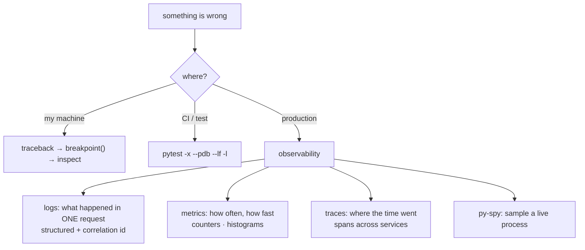

**In one line.** Debugging locally is a debugger; debugging in production is whatever you instrumented beforehand.

## The idea in plain words

Three different situations, three different toolkits.

**It fails on your machine.** Read the traceback properly — bottom-up: the last line is the exception, the frame above it is where it was raised, and the frames above that are how you got there. Then `breakpoint()` on the suspicious frame and inspect state. A debugger beats scattering `print` statements, because you can look at anything, not just what you guessed to print.

**It fails in a test or in CI.** `pytest --pdb` drops you into a debugger at the failure, `-x` stops at the first one, and `--lf` re-runs only what failed last time. `-l` prints local variables in the traceback, which is often enough on its own.

**It fails in production.** You cannot attach a debugger to a container serving traffic, so you rely on what you built in: **structured logs** with a correlation id, **metrics** for rates and latencies, and **traces** that follow one request across services. `py-spy` can sample a live process without stopping it, which is the closest thing to a production debugger.

The three pillars answer different questions. Logs say *what happened* in one request. Metrics say *how often and how fast* across all of them. Traces say *where the time went* through the system.



## How it works

### Read the traceback, then use the debugger

```python
breakpoint()           # drops into pdb at this line (PYTHONBREAKPOINT can disable it)
```

The commands worth memorising: `n` next line, `s` step into, `c` continue, `l` list source, `p expr` print, `pp` pretty-print, `w` where (the stack), `u`/`d` move up and down frames, `b file:line` set a breakpoint, `q` quit.

Two often-missed tricks: `post_mortem` debugging (`import pdb; pdb.post_mortem()` inside an `except`) drops you into the frame where the exception happened, and `pytest --pdb` does that automatically for a failing test.

### Structured logs with a correlation id

```python
import logging, uuid
from contextvars import ContextVar

request_id: ContextVar[str] = ContextVar("request_id", default="-")

class ContextFilter(logging.Filter):
    def filter(self, record):
        record.request_id = request_id.get()
        return True
```

A `ContextVar` follows the logical flow of control — including across `await` — so every log line in a request carries the same id without threading it through every function signature. In production, emit JSON so the aggregator can index those fields.

### Metrics and traces

Metrics are cheap aggregates: a **counter** for events, a **gauge** for current values, a **histogram** for latency (so you can read p95 and p99, which is what users actually feel — an average hides the tail).

Traces record spans: a request enters, each downstream call becomes a child span, and the waterfall shows where the time went. OpenTelemetry is the vendor-neutral standard, with auto-instrumentation for the common frameworks.

The rule for all three: **instrument at the boundaries** — inbound request, outbound call, queue publish and consume, database query. That covers nearly every production question without drowning you in telemetry.

## A real system that works this way

**A latency incident** usually goes: an alert fires on the p99 histogram → the trace waterfall shows one downstream call taking 3 seconds → the logs for that correlation id show a retry loop → the fix is a timeout that was never set. None of those three steps is possible without instrumentation that predates the incident.

**A memory leak** in a long-running service is diagnosed with `tracemalloc` snapshots taken minutes apart, or `py-spy dump` on the live process. The cause is nearly always an unbounded cache or a module-level list that only grows.

## Code you can run

```python
"""Tracebacks, post-mortem debugging, context-aware structured logs, timing."""
import io, json, logging, sys, time, traceback, uuid
from contextlib import contextmanager
from contextvars import ContextVar

# --- 1. read a traceback programmatically -----------------------------------
def inner(x):
    return 10 / x

def middle(x):
    return inner(x)

def outer(x):
    return middle(x)

try:
    outer(0)
except ZeroDivisionError:
    tb = traceback.format_exc().strip().splitlines()
    # 3.11+ adds caret (^~) annotation lines — skip them to find real source lines
    source_lines = [ln.strip() for ln in tb
                    if ln.strip() and not set(ln.strip()) <= set("^~ ")]
    print("=== traceback, bottom-up ===")
    print("  exception :", source_lines[-1])
    print("  raised at :", source_lines[-2])
    print("  call chain:", " -> ".join(
        line.split(", in ")[-1] for line in tb if ", in " in line))

# --- 2. post-mortem: inspect the frame where it actually broke --------------
try:
    outer(0)
except ZeroDivisionError:
    tb_obj = sys.exc_info()[2]
    frame = tb_obj.tb_next.tb_next.tb_next.tb_frame     # innermost frame
    print("\n=== post-mortem locals ===")
    print("  function:", frame.f_code.co_name, "| locals:", frame.f_locals)

# --- 3. structured logs with a correlation id that follows the request -----
request_id: ContextVar[str] = ContextVar("request_id", default="-")

class JsonFormatter(logging.Formatter):
    def format(self, record):
        payload = {
            "level": record.levelname,
            "logger": record.name,
            "msg": record.getMessage(),
            "request_id": request_id.get(),
        }
        if record.exc_info:
            payload["error"] = self.formatException(record.exc_info).splitlines()[-1]
        return json.dumps(payload)

stream = io.StringIO()
handler = logging.StreamHandler(stream)
handler.setFormatter(JsonFormatter())
log = logging.getLogger("checkout")
log.handlers = [handler]
log.setLevel(logging.INFO)
log.propagate = False

def handle_request(order_id):
    request_id.set(uuid.uuid4().hex[:8])      # one id per request
    log.info("received order %s", order_id)
    try:
        if order_id == "BAD":
            raise ValueError("unknown order")
        log.info("charged order %s", order_id)
    except ValueError:
        log.exception("order failed")

handle_request("A-1")
handle_request("BAD")

print("\n=== structured log lines ===")
for line in stream.getvalue().strip().splitlines():
    print(" ", line)

ids = {json.loads(l)["request_id"] for l in stream.getvalue().strip().splitlines()}
print(f"\n{len(ids)} distinct request ids — each request is independently searchable")

# --- 4. a timing span, the smallest useful piece of tracing ----------------
SPANS = []

@contextmanager
def span(name):
    start = time.perf_counter()
    try:
        yield
    finally:
        SPANS.append((name, (time.perf_counter() - start) * 1000))

with span("handle_request"):
    with span("db.query"):
        time.sleep(0.02)
    with span("payment.charge"):
        time.sleep(0.05)

print("\n=== span waterfall ===")
for name, ms in SPANS:
    print(f"  {name:18} {ms:6.1f} ms  {'█' * int(ms / 2)}")
print("  the slowest child is where to look first")
```

## Designing with it

**What to instrument, and where**

| Boundary | Emit |
| --- | --- |
| Inbound request | Span + log with correlation id, status, duration |
| Outbound HTTP/DB call | Span, timeout, retry count, error class |
| Queue publish/consume | Message id, attempt number, lag |
| Background job | Start/finish, records processed, failures |
| Business event | Counter (orders placed, refunds issued) |

**Logging levels that mean something**

- `DEBUG` — developer detail, off in production by default.
- `INFO` — a thing happened that an operator would want to see once per request.
- `WARNING` — recovered from something unexpected (a retry succeeded).
- `ERROR` — the request failed; include the traceback with `log.exception`.
- `CRITICAL` — the process cannot continue.

**Rules**

- **One correlation id per request**, propagated through `ContextVar` and across service calls in a header.
- **Log once, where it is handled.** The same error logged at five layers produces five alerts for one fault.
- **Never log secrets or personal data** — redact at the boundary, and test that redaction.
- **Alert on symptoms, not causes**: user-visible latency and error rate, not CPU.
- **Sample traces** (say 1–10%) but always keep the errors.
- **Budget the cost.** Telemetry is data you pay to store; DEBUG in production is usually a bill, not an insight.

## Where this stands in 2026

:::info Industry view

- **OpenTelemetry is the standard** for traces and increasingly for metrics and logs; vendor-specific SDKs are being replaced by it.
- Structured JSON logging with correlation ids is the norm in services — text logs survive mainly in CLI tools.
- `py-spy` is the standard way to diagnose a live process without restarting it, and appears in most production runbooks.
- Sentry-style error aggregation with release tracking is near-universal; it turns "someone reported a bug" into a grouped, versioned stack trace.

:::

## Practice questions

<details>
<summary><strong>Q1.</strong> How do you read a Python traceback?</summary>

Bottom-up. The last line is the exception type and message; directly above it is the line that raised it; above that, the call chain that led there, oldest call first. In a long chain, look for the last frame inside *your* code rather than inside a library.

</details>

<details>
<summary><strong>Q2.</strong> Why use a `ContextVar` for a request id rather than a global or a parameter?</summary>

A global is shared across concurrent requests and gets overwritten. Threading the id through every function signature pollutes every interface. A `ContextVar` is scoped to the logical flow of control — including across `await` boundaries and separate tasks — so each request sees its own value.

</details>

<details>
<summary><strong>Q3.</strong> Latency rose but CPU and memory look normal. Where do you look?</summary>

Downstream: traces first, to see which span grew. Typical causes are a slow dependency, a missing timeout causing retries to queue, connection-pool exhaustion, or an N+1 query pattern that grew with the data. The average hides this — look at p95 and p99.

</details>

## Further reading

- [pdb](https://docs.python.org/3/library/pdb.html) — the debugger and its commands.
- [Logging cookbook](https://docs.python.org/3/howto/logging-cookbook.html) — filters, context, JSON, and multi-process logging.
- [OpenTelemetry Python](https://opentelemetry.io/docs/languages/python/) — traces, metrics and auto-instrumentation.
- [py-spy](https://github.com/benfred/py-spy) — sampling profiler and `dump` for a live process.
- [Google SRE book: monitoring distributed systems](https://sre.google/sre-book/monitoring-distributed-systems/) — the four golden signals.
