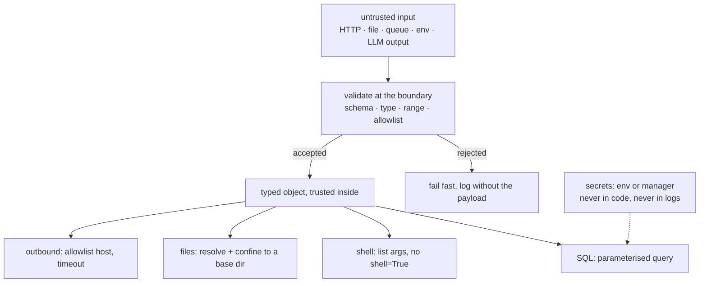

**In one line.** Treat every input as hostile, never build commands or queries by string concatenation, and keep secrets out of your code and your logs.

## The idea in plain words

Most Python security incidents come from a short list, and every item has a boring, well-known fix.

- **Injection** — SQL, shell, or template. The fix is always the same: pass data as **parameters**, never as string fragments. Parameterised queries for SQL, list arguments for `subprocess`, autoescaping for templates.
- **Unsafe deserialisation** — `pickle`, `yaml.load` and `eval` execute arbitrary code by design. Never point them at data you did not create. Use JSON, or `yaml.safe_load`.
- **Secrets in the wrong place** — hard-coded keys, secrets in logs, secrets in error messages, secrets committed to git. They belong in the environment or a secret manager, and never in a log line.
- **Dependency supply chain** — a compromised or typosquatted package runs with your privileges at install time. Lockfiles with hashes and vulnerability scanning are the controls.
- **Weak crypto choices** — hand-rolled password hashing, `random` used for tokens, comparing secrets with `==`. Use `secrets`, `hashlib.scrypt`/argon2, and `hmac.compare_digest`.
- **Path traversal and SSRF** — user input becoming a filesystem path or a URL you fetch. Resolve and validate against an allowlist.

The mindset that makes the difference: **validate at the boundary, then trust inside**. One place parses and checks untrusted input; everything downstream works with typed, validated objects.



## How it works

### Injection: pass data as data

```python
# SQL — the placeholder is the whole defence
cur.execute("SELECT * FROM orders WHERE customer_id = %s", (customer_id,))
# NOT: f"SELECT * FROM orders WHERE customer_id = {customer_id}"

# Shell — a list means no shell parses your data
subprocess.run(["git", "checkout", branch], check=True, timeout=30)
# NOT: subprocess.run(f"git checkout {branch}", shell=True)
```

An ORM parameterises for you, but `text()` fragments and `.raw()` escape hatches do not — those are where injection reappears in otherwise safe codebases.

### Secrets

```python
api_key = os.environ["API_KEY"]          # fail loudly if missing
log.info("calling provider", extra={"key_present": bool(api_key)})   # never the value
```

Rules: no secrets in source, in default arguments, in exception messages, in log lines, or in test fixtures committed to the repo. Rotate on exposure — a key that appeared in a log is burned even if the log is private. `detect-secrets` or `gitleaks` in pre-commit catches the accident before it is public.

### Deserialisation and dynamic execution

`pickle.loads` on untrusted bytes is remote code execution, full stop — the same is true of `yaml.load` without `SafeLoader`, and of `eval`/`exec` on anything user-supplied. If you need a flexible format, use JSON plus a schema. If you need plugins, use an explicit registry rather than importing a name from user input.

### Passwords, tokens and comparisons

```python
import hmac, secrets, hashlib

token = secrets.token_urlsafe(32)                  # not random.random()
digest = hashlib.scrypt(password.encode(), salt=salt, n=2**14, r=8, p=1)
ok = hmac.compare_digest(provided, expected)       # constant time
```

`random` is a predictable PRNG — never use it for tokens, session ids or password resets. `==` on secrets leaks length and prefix information through timing; `hmac.compare_digest` does not.

## A real system that works this way

**A pickle-based cache** is a classic breach path: a service caches objects with `pickle`, an attacker gets write access to the cache (a shared Redis without auth), and now they execute code inside your process. Switching the cache to JSON removes the whole class.

**Dependency confusion** is the modern supply-chain attack: an internal package name is also claimed on the public index, and a misconfigured installer prefers the public one. Pinning with hashes and configuring the index explicitly prevents it.

## Code you can run

```python
"""The safe and unsafe versions, side by side, with the reasoning visible."""
import hashlib, hmac, json, os, secrets, shlex, sqlite3, subprocess, sys, tempfile
from pathlib import Path

# --- 1. SQL injection --------------------------------------------------------
conn = sqlite3.connect(":memory:")
conn.execute("CREATE TABLE orders (id TEXT, customer TEXT, total REAL)")
conn.executemany("INSERT INTO orders VALUES (?, ?, ?)",
                 [("A-1", "ada", 10.0), ("A-2", "grace", 20.0)])

hostile = "ada' OR '1'='1"

unsafe_sql = f"SELECT * FROM orders WHERE customer = '{hostile}'"
print("=== SQL ===")
print("  unsafe query returns:", len(conn.execute(unsafe_sql).fetchall()), "rows (all of them)")
safe_rows = conn.execute("SELECT * FROM orders WHERE customer = ?", (hostile,)).fetchall()
print("  parameterised returns:", len(safe_rows), "rows (correct)")

# --- 2. shell injection ------------------------------------------------------
print("\n=== shell ===")
user_arg = "hello; echo PWNED"
result = subprocess.run([sys.executable, "-c", "import sys; print(sys.argv[1])", user_arg],
                        capture_output=True, text=True)
print("  list args   :", result.stdout.strip(), " <- the semicolon is inert")
print("  shell=True would run:", shlex.split(f"echo {user_arg}"), "then the second command")

# --- 3. path traversal -------------------------------------------------------
print("\n=== paths ===")
base = Path(tempfile.mkdtemp()).resolve()
(base / "public.txt").write_text("safe content")

def read_file(user_path: str) -> str:
    target = (base / user_path).resolve()
    if not target.is_relative_to(base):            # the whole defence
        raise ValueError(f"path escapes the base directory: {user_path}")
    return target.read_text()

print("  normal :", read_file("public.txt"))
try:
    read_file("../../../../etc/passwd")
except ValueError as exc:
    print("  blocked:", exc)

# --- 4. secrets, tokens, comparisons ----------------------------------------
print("\n=== secrets ===")
token = secrets.token_urlsafe(24)
print("  secrets.token_urlsafe :", token[:12] + "…  (cryptographically random)")

salt = secrets.token_bytes(16)
digest = hashlib.scrypt(b"correct horse battery", salt=salt, n=2**14, r=8, p=1)
print("  scrypt digest         :", digest.hex()[:24] + "…  (slow by design)")
print("  constant-time compare :", hmac.compare_digest(digest, digest))

def redact(payload: dict) -> dict:
    SENSITIVE = {"password", "api_key", "token", "secret", "authorization"}
    return {k: ("***" if k.lower() in SENSITIVE else v) for k, v in payload.items()}

event = {"user": "ada", "api_key": "sk-live-123456", "action": "login"}
print("  log line              :", json.dumps(redact(event)))

# --- 5. deserialisation ------------------------------------------------------
print("\n=== deserialisation ===")
print("  pickle.loads(untrusted)  -> arbitrary code execution")
print("  yaml.load(untrusted)     -> arbitrary code execution (use safe_load)")
print("  json.loads(untrusted)    -> data only; validate the shape afterwards")

def parse_event(raw: str) -> dict:
    data = json.loads(raw)                          # data, never code
    if not isinstance(data, dict):
        raise ValueError("expected an object")
    if set(data) - {"type", "amount"}:
        raise ValueError(f"unexpected fields: {sorted(set(data) - {'type', 'amount'})}")
    if not isinstance(data.get("amount"), (int, float)) or data["amount"] < 0:
        raise ValueError("amount must be a non-negative number")
    return data

print("  valid  :", parse_event('{"type": "charge", "amount": 10}'))
for bad in ['{"type": "charge", "amount": -5}', '{"type": "x", "evil": 1}']:
    try:
        parse_event(bad)
    except ValueError as exc:
        print("  blocked:", exc)
```

## Designing with it

**Checklist before a service goes live**

| Area | Control |
| --- | --- |
| Input | Schema validation at the boundary (Pydantic), explicit allowlists, size limits |
| SQL | Parameterised queries only; review every raw-SQL escape hatch |
| Shell/subprocess | List arguments, `timeout`, no `shell=True` |
| Files | Resolve and confine to a base directory; never trust a filename from a user |
| Outbound requests | Host allowlist and timeouts (prevents SSRF and hangs) |
| Secrets | Environment or secret manager, redaction in logs, rotation policy |
| Auth | Established library, argon2/scrypt hashing, constant-time comparison |
| Dependencies | Lockfile with hashes, `pip-audit` in CI, scheduled update PRs |
| Errors | Generic message to the user, detail in the logs — never a stack trace in a response |
| Scanning | ruff `S` rules or bandit, secret scanning in pre-commit |

**Two rules that prevent most of the rest**

1. **Least privilege.** The database user for a read API does not need `DROP`. The container does not need root. The token does not need `admin` scope.
2. **Fail closed.** If validation, authentication or a policy check errors, deny. An exception handler that falls through to "allow" is how outages become breaches.

:::warning LLM-specific surface
Anything an LLM produces is untrusted input. Never `eval` generated code, never pass generated SQL or shell straight through, and treat retrieved documents as data that may contain instructions. Constrain tool permissions per step and require confirmation for irreversible actions — see [LLMs and Agents](/docs/theory/nlp/llms-and-agents).
:::

## Where this stands in 2026

:::info Industry view

- Supply-chain security is now the dominant concern: lockfiles with hashes, SBOMs, signed artefacts and trusted publishing are becoming standard requirements.
- `pip-audit`, Dependabot or Renovate in CI is expected; unpatched known CVEs are a compliance finding, not a preference.
- Secret scanning in pre-commit and in the platform is standard, because a leaked key is exploited within minutes of hitting a public repository.
- Prompt injection and unsafe tool use are the newest category, and the OWASP LLM Top 10 is the reference most teams now review against.

:::

## Practice questions

<details>
<summary><strong>Q1.</strong> Why is `subprocess.run(f"grep {term} file", shell=True)` dangerous, and what is the fix?</summary>

The shell parses the whole string, so a `term` of `x; rm -rf ~` runs a second command. Pass a list — `["grep", term, "file"]` — so the argument can never be reinterpreted as syntax. If you genuinely need shell features, quote every interpolated value with `shlex.quote`.

</details>

<details>
<summary><strong>Q2.</strong> Why never use `pickle` for data that crosses a trust boundary?</summary>

Unpickling constructs arbitrary objects and can call arbitrary code by design — a crafted payload executes as your process. JSON (plus schema validation) carries data only, so the worst case is malformed data rather than code execution.

</details>

<details>
<summary><strong>Q3.</strong> Why compare secrets with `hmac.compare_digest` instead of `==`?</summary>

`==` short-circuits at the first differing byte, so the time it takes leaks how much of the prefix was correct — enough to reconstruct a token with enough attempts. `compare_digest` takes the same time regardless of where the difference is.

</details>

## Further reading

- [OWASP Top 10](https://owasp.org/www-project-top-ten/) and the [OWASP LLM Top 10](https://owasp.org/www-project-top-10-for-large-language-model-applications/).
- [Python security considerations](https://docs.python.org/3/library/security_warnings.html) — the standard library's own list of dangerous functions.
- [secrets](https://docs.python.org/3/library/secrets.html) and [hmac](https://docs.python.org/3/library/hmac.html) — tokens and constant-time comparison.
- [pip-audit](https://pypi.org/project/pip-audit/) and [PyPI trusted publishing](https://docs.pypi.org/trusted-publishers/) — supply-chain controls.
