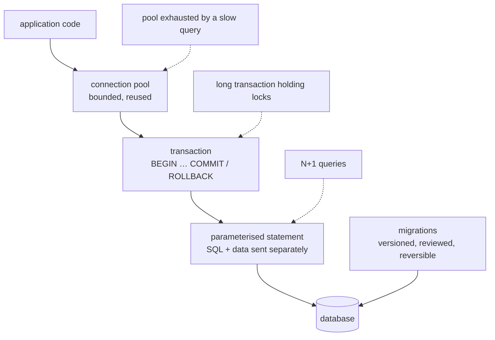

**In one line.** Know what SQL your code sends, wrap writes in transactions, reuse connections, and never build a query by concatenation.

## The idea in plain words

Python talks to relational databases through **DB-API 2.0** — one interface (`connect`, `cursor`, `execute`, `commit`) implemented by every driver: `sqlite3`, `psycopg`, `mysqlclient`, `asyncpg`.

Four things decide whether a database-backed service behaves:

- **Parameterised queries.** `cur.execute("… WHERE id = %s", (value,))`. The driver sends SQL and data separately, so no input can become syntax. This is both the security control and the performance one — the database caches the query plan.
- **Transactions.** A unit of work that either fully happens or does not. Wrap multi-statement writes; commit on success, roll back on exception. Autocommit-per-statement is how half-written state appears.
- **Connections are expensive.** Opening one costs a handshake and, on Postgres, a process. Pool them, size the pool to the database's limit rather than your ambitions, and always return them (a context manager).
- **What SQL is actually sent.** ORMs are productive and hide this; the N+1 query problem — one query for the list, then one per row — is the most common performance bug in ORM code.

Choosing between raw SQL and an ORM is a real decision: raw SQL is explicit and fast to reason about; an ORM gives you models, migrations and relationship handling. A common compromise is an ORM for CRUD and hand-written SQL for reporting queries.



## How it works

### The DB-API, and the one rule

```python
import sqlite3

with sqlite3.connect("app.db") as conn:          # commits on success, rolls back on error
    conn.execute(
        "INSERT INTO orders (id, customer, total) VALUES (?, ?, ?)",
        ("A-1", customer, total),                # data, never string-formatted
    )
```

Placeholder styles differ by driver (`?` for sqlite3, `%s` for psycopg) — check `paramstyle`. Use `executemany` for bulk inserts: one round trip instead of a thousand.

### Transactions and isolation

```python
conn = pool.getconn()
try:
    with conn:                      # BEGIN … COMMIT, or ROLLBACK on exception
        with conn.cursor() as cur:
            cur.execute("UPDATE accounts SET balance = balance - %s WHERE id = %s", (amt, src))
            cur.execute("UPDATE accounts SET balance = balance + %s WHERE id = %s", (amt, dst))
finally:
    pool.putconn(conn)
```

Keep transactions **short**: they hold locks, and a transaction left open across a network call is how a whole service deadlocks. Never do I/O (an HTTP request, a queue publish) inside one.

Know the isolation level you are running at — `READ COMMITTED` is the usual default, and "read the row, decide, write it back" is unsafe under it without `SELECT … FOR UPDATE` or an optimistic version column.

### Pooling

A pool keeps a bounded set of open connections. Size it against the database's `max_connections` divided by the number of instances — not by how much parallelism you would like. When every pooled connection is held by a slow query, new requests queue and the service appears down even though the database is fine. That symptom — rising latency with low CPU — is nearly always pool exhaustion.

### Migrations

Schema changes are code: versioned, reviewed, applied in order, and reversible. Alembic is the standard with SQLAlchemy. The operational rules that prevent outages: make changes **backwards compatible** (add a nullable column, deploy code that writes it, backfill, then enforce `NOT NULL`), never lock a large table during peak, and create indexes concurrently on Postgres.

## A real system that works this way

**The N+1 incident** is universal: a list endpoint renders 100 orders, and the template touches `order.customer.name`, so the ORM issues 1 + 100 queries. Latency is fine in development with 5 rows and awful in production. The fix is eager loading (`selectinload`/`joinedload`) or one explicit join — and the detection is a query-count assertion in the test for that endpoint.

**A refund service** shows why transactions matter: debit one account, credit another, write a ledger row. All three commit or none do, or money is invented.

## Code you can run

```python
"""Parameterised SQL, transactions, bulk inserts, N+1 versus a join — measured."""
import sqlite3, time

conn = sqlite3.connect(":memory:")
conn.row_factory = sqlite3.Row
conn.executescript("""
    CREATE TABLE customers (id INTEGER PRIMARY KEY, name TEXT NOT NULL);
    CREATE TABLE orders (
        id TEXT PRIMARY KEY,
        customer_id INTEGER NOT NULL REFERENCES customers(id),
        total REAL NOT NULL
    );
    CREATE INDEX orders_customer_idx ON orders(customer_id);
""")

# --- bulk insert: one round trip, not N ------------------------------------
customers = [(i, f"customer{i}") for i in range(1, 201)]
orders = [(f"A-{i}", (i % 200) + 1, 10.0 + i % 50) for i in range(1, 2001)]
conn.executemany("INSERT INTO customers VALUES (?, ?)", customers)
conn.executemany("INSERT INTO orders VALUES (?, ?, ?)", orders)
conn.commit()
print(f"inserted {len(customers)} customers and {len(orders)} orders")

# --- parameterised vs concatenated ------------------------------------------
hostile = "customer1' OR '1'='1"
concatenated = f"SELECT COUNT(*) FROM customers WHERE name = '{hostile}'"
print("\nconcatenated returns:", conn.execute(concatenated).fetchone()[0], "rows (injected)")
print("parameterised returns:",
      conn.execute("SELECT COUNT(*) FROM customers WHERE name = ?", (hostile,)).fetchone()[0],
      "rows (correct)")

# --- N+1 versus a single join ------------------------------------------------
def n_plus_one():
    queries = 0
    rows = conn.execute("SELECT * FROM orders LIMIT 200").fetchall(); queries += 1
    out = []
    for row in rows:                       # one extra query per row
        name = conn.execute("SELECT name FROM customers WHERE id = ?",
                            (row["customer_id"],)).fetchone()["name"]
        queries += 1
        out.append((row["id"], name))
    return out, queries

def single_join():
    rows = conn.execute("""
        SELECT o.id, c.name
        FROM orders o JOIN customers c ON c.id = o.customer_id
        LIMIT 200
    """).fetchall()
    return [(r["id"], r["name"]) for r in rows], 1

start = time.perf_counter(); a, qa = n_plus_one(); ta = time.perf_counter() - start
start = time.perf_counter(); b, qb = single_join(); tb = time.perf_counter() - start
assert a == b
print(f"\nN+1   : {qa:3} queries  {ta*1000:6.2f} ms")
print(f"join  : {qb:3} query    {tb*1000:6.2f} ms   -> {ta/tb:.0f}x faster, same result")

# --- transactions: all or nothing -------------------------------------------
def transfer(src, dst, amount, fail=False):
    try:
        with conn:                       # commit on success, rollback on exception
            conn.execute("UPDATE orders SET total = total - ? WHERE id = ?", (amount, src))
            if fail:
                raise RuntimeError("downstream failure")
            conn.execute("UPDATE orders SET total = total + ? WHERE id = ?", (amount, dst))
    except RuntimeError as exc:
        return f"rolled back ({exc})"
    return "committed"

def total_of(order_id):
    return conn.execute("SELECT total FROM orders WHERE id = ?", (order_id,)).fetchone()["total"]

before = (total_of("A-1"), total_of("A-2"))
print("\nbefore        :", before)
print("failed transfer:", transfer("A-1", "A-2", 5.0, fail=True))
print("after rollback :", (total_of("A-1"), total_of("A-2")), "<- unchanged")
print("good transfer  :", transfer("A-1", "A-2", 5.0))
print("after commit   :", (total_of("A-1"), total_of("A-2")))

# --- the index is what makes the join cheap ---------------------------------
plan = conn.execute("EXPLAIN QUERY PLAN SELECT * FROM orders WHERE customer_id = 7").fetchall()
print("\nquery plan:", " | ".join(str(r["detail"]) for r in plan))
```

## Designing with it

**Choosing an access layer**

| Situation | Choice |
| --- | --- |
| Simple service, few tables, full control wanted | Raw SQL via the driver, or SQLAlchemy Core |
| Rich domain model, relationships, lots of CRUD | SQLAlchemy ORM or Django ORM |
| Reporting and analytics queries | Hand-written SQL — ORMs generate poor aggregates |
| Async service | `asyncpg` or SQLAlchemy 2.0 async |
| Tests | The same engine as production, in a container — not SQLite standing in for Postgres |

**Operational checklist**

| Concern | Control |
| --- | --- |
| Injection | Parameterised queries only; audit every raw-SQL escape hatch |
| Long transactions | Keep them short; never do network I/O inside one |
| Pool exhaustion | Bound the pool, set statement timeouts, alert on wait time |
| N+1 | Eager loading, or assert query counts in tests |
| Migrations | Versioned, backwards compatible, reversible, applied in a deploy step |
| Money | `NUMERIC`/`DECIMAL` in the schema, `Decimal` in Python |
| Retries | Only for deadlocks and serialisation failures — and the work must be idempotent |
| Secrets | Connection string from the environment; never in the repository |

**Two rules that prevent most database incidents**

1. **Know the query count and the plan** for every endpoint that matters. `EXPLAIN` is not an expert tool; it is the first thing to look at.
2. **Migrate in expand/contract steps.** Add, backfill, switch reads, then remove — so a rollback never meets a schema it cannot handle.

## Where this stands in 2026

:::info Industry view

- SQLAlchemy 2.0 (typed, async-capable) is the default in non-Django Python services; Alembic is the standard migration tool.
- `asyncpg` and async SQLAlchemy are common in FastAPI stacks, where a blocking driver would stall the event loop.
- Connection poolers such as PgBouncer are standard in front of Postgres once you run many service instances.
- DuckDB has become the default for local analytical work — it reads Parquet and CSV directly and often replaces a pandas pipeline outright.

:::

## Practice questions

<details>
<summary><strong>Q1.</strong> Why are parameterised queries faster as well as safer?</summary>

The SQL text is identical across calls, so the database can reuse the parsed statement and its execution plan. Concatenated queries produce a distinct statement per value, defeating the plan cache — and, of course, allowing injection.

</details>

<details>
<summary><strong>Q2.</strong> Latency is climbing but the database CPU is low. What is the likely cause?</summary>

Pool exhaustion or lock contention — requests are queuing for a connection, or waiting on rows held by a long transaction. Check pool wait time, active connection count and blocked queries before touching indexes.

</details>

<details>
<summary><strong>Q3.</strong> How do you add a `NOT NULL` column to a large, live table safely?</summary>

Expand and contract: add it nullable with a default, deploy code that writes it, backfill in batches, then add the `NOT NULL` constraint (validated separately on Postgres). Doing it in one migration locks the table and takes the service down.

</details>

## Further reading

- [PEP 249 — DB-API 2.0](https://peps.python.org/pep-0249/) — the interface every driver implements.
- [SQLAlchemy 2.0 documentation](https://docs.sqlalchemy.org/en/20/) — Core, ORM and async.
- [Alembic](https://alembic.sqlalchemy.org/) — migrations, autogenerate and their limits.
- [Use the Index, Luke](https://use-the-index-luke.com/) — the best practical guide to SQL indexing.
- [psycopg 3](https://www.psycopg.org/psycopg3/docs/) — the modern Postgres driver, including pooling.
