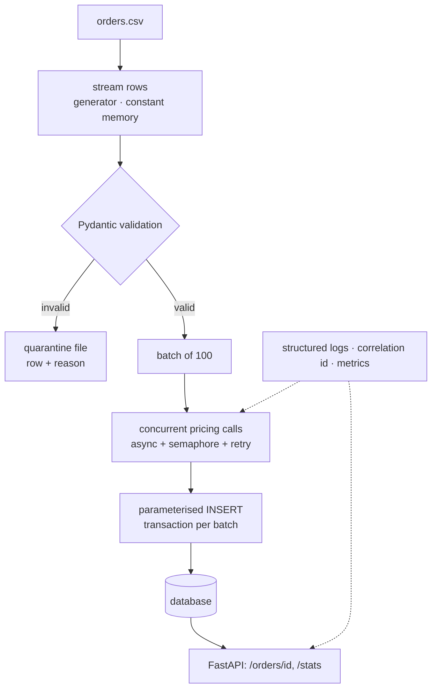

**In one line.** Build a service that ingests a CSV of orders, enriches each one against a pricing API concurrently, stores the result, and serves it over a typed HTTP API — packaged, tested, linted, containerised and observable.

Every concept in this module appears here, in the place a real project would use it. Work top to bottom; each step is runnable.

## What you are building

> A finance team drops a daily CSV of orders. The service validates it, prices every line against an internal API, writes the results to a database, and exposes them to a dashboard. It must never lose a row silently, never leak customer data into logs, and finish 50,000 rows inside the nightly window.

| | |
| --- | --- |
| **Inputs** | A CSV (10k–500k rows) with `order_id, customer_email, sku, quantity, ordered_at` |
| **Enrichment** | `GET /price/{sku}` on an internal service — slow (~50 ms), occasionally flaky |
| **Outputs** | A SQLite/Postgres table, plus `GET /orders/{id}` and `GET /stats` |
| **Constraints** | Constant memory regardless of file size; bad rows quarantined, not dropped; PII never logged |
| **Done means** | `ruff`, `mypy` and `pytest` green in CI; the image runs as non-root; p95 API latency under 100 ms |

## Architecture



## The stack, and why each piece is there

| Library | Role here | Learn it from |
| --- | --- | --- |
| **uv** | Environment, dependency resolution, lockfile, task running | [uv docs](https://docs.astral.sh/uv/) |
| **Pydantic v2** | Validation at the boundary; settings from the environment | [Pydantic](https://docs.pydantic.dev/latest/) |
| **httpx** | Async HTTP client with timeouts and connection pooling | [httpx](https://www.python-httpx.org/) |
| **tenacity** | Retry with exponential backoff and jitter | [tenacity](https://tenacity.readthedocs.io/) |
| **FastAPI + Uvicorn** | Typed HTTP API, OpenAPI schema for free | [FastAPI](https://fastapi.tiangolo.com/) |
| **SQLAlchemy Core** (or `sqlite3`) | Parameterised SQL, connection pooling | [SQLAlchemy](https://docs.sqlalchemy.org/en/20/core/) |
| **structlog** | Structured JSON logs with bound context | [structlog](https://www.structlog.org/) |
| **pytest** + **respx** | Unit tests with a fake gateway; HTTP mocking for the client | [pytest](https://docs.pytest.org/) · [respx](https://lundberg.github.io/respx/) |
| **ruff** + **mypy** | Lint, format, type-check | [Ruff](https://docs.astral.sh/ruff/) · [mypy](https://mypy.readthedocs.io/) |
| **pre-commit** | Run the checks before the commit lands | [pre-commit](https://pre-commit.com/) |
| **Docker** | Reproducible multi-stage image, non-root runtime | [Docker Python guide](https://docs.docker.com/language/python/) |
| **OpenTelemetry** | Traces and metrics when this joins a bigger system | [OTel Python](https://opentelemetry.io/docs/languages/python/) |

## Step 1 — Project skeleton

```text
orderflow/
├── pyproject.toml
├── .pre-commit-config.yaml
├── Dockerfile
├── src/orderflow/
│   ├── __init__.py
│   ├── config.py          # settings from the environment
│   ├── models.py          # Pydantic at the edge, dataclasses inside
│   ├── ingest.py          # streaming reader + validation + quarantine
│   ├── pricing.py         # async client with retry and timeout
│   ├── store.py           # parameterised SQL
│   ├── pipeline.py        # wires it together
│   ├── api.py             # FastAPI app
│   └── cli.py             # argparse entry point
└── tests/
    ├── conftest.py
    ├── test_ingest.py
    ├── test_pricing.py
    └── test_api.py
```

```toml
# pyproject.toml
[project]
name = "orderflow"
version = "0.1.0"
requires-python = ">=3.12"
dependencies = [
    "pydantic>=2.7", "pydantic-settings>=2.3", "httpx>=0.27",
    "tenacity>=8.4", "fastapi>=0.111", "uvicorn>=0.30", "structlog>=24.1",
]

[project.optional-dependencies]
dev = ["pytest>=8", "pytest-asyncio>=0.23", "respx>=0.21", "ruff>=0.5", "mypy>=1.10"]

[project.scripts]
orderflow = "orderflow.cli:main"

[build-system]
requires = ["hatchling"]
build-backend = "hatchling.build"

[tool.ruff.lint]
select = ["E", "F", "I", "UP", "B", "SIM", "C4", "S", "RUF"]

[tool.mypy]
python_version = "3.12"
disallow_untyped_defs = true
warn_return_any = true

[tool.pytest.ini_options]
addopts = "-q --strict-markers"
testpaths = ["tests"]
```

`src` layout plus `uv sync` means tests import the installed package — the same thing production imports. See [Modules and Packages](/docs/code/python/modules-and-packages).

## Step 2 — Configuration and models

```python
# src/orderflow/config.py
from pydantic import Field
from pydantic_settings import BaseSettings, SettingsConfigDict

class Settings(BaseSettings):
    """Twelve-factor config: environment in, validated object out, fail fast."""
    model_config = SettingsConfigDict(env_prefix="ORDERFLOW_", env_file=".env")

    database_url: str = "sqlite:///orderflow.db"
    pricing_url: str = "http://pricing.internal"
    pricing_timeout: float = Field(default=5.0, gt=0)
    max_concurrency: int = Field(default=20, ge=1, le=200)
    batch_size: int = Field(default=100, ge=1)
    log_level: str = "INFO"

settings = Settings()      # raises at import time if the environment is wrong
```

```python
# src/orderflow/models.py
from dataclasses import dataclass
from datetime import datetime
from decimal import Decimal

from pydantic import BaseModel, EmailStr, Field, field_validator

class RawOrder(BaseModel):
    """The boundary: parses and validates one untrusted CSV row."""
    order_id: str = Field(min_length=3, max_length=32)
    customer_email: EmailStr
    sku: str = Field(pattern=r"^[A-Z0-9-]{3,20}$")
    quantity: int = Field(gt=0, le=1000)
    ordered_at: datetime

    @field_validator("ordered_at")
    @classmethod
    def not_in_the_future(cls, v: datetime) -> datetime:
        if v > datetime.now(v.tzinfo):
            raise ValueError("ordered_at is in the future")
        return v

@dataclass(frozen=True, slots=True)
class PricedOrder:
    """The trusted internal model — no validation cost on the hot path."""
    order_id: str
    sku: str
    quantity: int
    unit_price: Decimal
    total: Decimal
    ordered_at: datetime
```

Pydantic at the edge, a frozen dataclass inside — the pattern from [Typing and Models](/docs/code/python/typing-and-models).

## Step 3 — Streaming ingest with a quarantine

```python
# src/orderflow/ingest.py
import csv
from collections.abc import Iterator
from pathlib import Path

import structlog
from pydantic import ValidationError

from .models import RawOrder

log = structlog.get_logger(__name__)

def read_orders(path: Path, quarantine: Path) -> Iterator[RawOrder]:
    """Yield valid orders; write invalid rows to a quarantine file with the reason.

    A generator, so memory stays flat whether the file has 10k rows or 10M.
    """
    quarantine.parent.mkdir(parents=True, exist_ok=True)
    with (
        path.open(newline="", encoding="utf-8") as src,
        quarantine.open("w", newline="", encoding="utf-8") as dead,
    ):
        reader = csv.DictReader(src)
        writer = csv.writer(dead)
        writer.writerow(["line", "reason", "raw"])
        good = bad = 0
        for line_no, row in enumerate(reader, start=2):
            try:
                yield RawOrder.model_validate(row)
                good += 1
            except ValidationError as exc:
                bad += 1
                reason = "; ".join(f"{e['loc'][0]}: {e['msg']}" for e in exc.errors())
                writer.writerow([line_no, reason, row])
                # never log the row itself — it contains an email address
                log.warning("row_quarantined", line=line_no, reason=reason)
        log.info("ingest_complete", valid=good, quarantined=bad)
```

Two decisions worth noting: bad rows are **quarantined with a reason**, never dropped, and the log records the reason but never the payload — that is the PII rule from [Security](/docs/code/python/security).

## Step 4 — Concurrent enrichment with retry and backpressure

```python
# src/orderflow/pricing.py
import asyncio
from decimal import Decimal

import httpx
import structlog
from tenacity import (retry, retry_if_exception_type, stop_after_attempt,
                      wait_exponential_jitter)

from .config import settings

log = structlog.get_logger(__name__)

class PricingUnavailable(RuntimeError):
    """Domain error — callers never see httpx types."""

@retry(
    retry=retry_if_exception_type((httpx.TimeoutException, httpx.NetworkError)),
    wait=wait_exponential_jitter(initial=0.2, max=5),
    stop=stop_after_attempt(4),
    reraise=True,
)
async def _fetch_price(client: httpx.AsyncClient, sku: str) -> Decimal:
    response = await client.get(f"/price/{sku}", timeout=settings.pricing_timeout)
    response.raise_for_status()
    return Decimal(str(response.json()["unit_price"]))

async def price_many(skus: list[str]) -> dict[str, Decimal]:
    """Fetch prices concurrently, bounded by a semaphore."""
    sem = asyncio.Semaphore(settings.max_concurrency)     # backpressure
    out: dict[str, Decimal] = {}

    async with httpx.AsyncClient(base_url=settings.pricing_url) as client:
        async def one(sku: str) -> None:
            async with sem:
                try:
                    out[sku] = await _fetch_price(client, sku)
                except httpx.HTTPError as exc:
                    raise PricingUnavailable(f"pricing failed for {sku}") from exc

        async with asyncio.TaskGroup() as tg:             # structured concurrency
            for sku in dict.fromkeys(skus):               # de-duplicate first
                tg.create_task(one(sku))
    return out
```

Four things that make this production code rather than a demo: a **timeout on every call**, **retry only on transient errors**, a **semaphore** so a slow dependency cannot make you open 50,000 connections, and **domain exceptions** so callers never import `httpx`.

## Step 5 — Storage with parameterised SQL

```python
# src/orderflow/store.py
import sqlite3
from collections.abc import Iterable
from contextlib import contextmanager
from pathlib import Path

from .models import PricedOrder

SCHEMA = """
CREATE TABLE IF NOT EXISTS orders (
    order_id   TEXT PRIMARY KEY,
    sku        TEXT NOT NULL,
    quantity   INTEGER NOT NULL,
    unit_price TEXT NOT NULL,
    total      TEXT NOT NULL,
    ordered_at TEXT NOT NULL
);
CREATE INDEX IF NOT EXISTS orders_sku_idx ON orders (sku);
"""

@contextmanager
def connect(path: Path):
    conn = sqlite3.connect(path)
    conn.row_factory = sqlite3.Row
    try:
        conn.executescript(SCHEMA)
        yield conn
        conn.commit()
    except BaseException:
        conn.rollback()      # a failed batch leaves no half-written state
        raise
    finally:
        conn.close()

def upsert_batch(conn: sqlite3.Connection, orders: Iterable[PricedOrder]) -> int:
    rows = [
        (o.order_id, o.sku, o.quantity, str(o.unit_price), str(o.total),
         o.ordered_at.isoformat())
        for o in orders
    ]
    conn.executemany(                       # parameterised: no injection surface
        """INSERT INTO orders (order_id, sku, quantity, unit_price, total, ordered_at)
           VALUES (?, ?, ?, ?, ?, ?)
           ON CONFLICT(order_id) DO UPDATE SET
               unit_price = excluded.unit_price,
               total      = excluded.total""",
        rows,
    )
    return len(rows)
```

Money is stored as text and handled as `Decimal` — never `float`. The upsert makes a re-run **idempotent**, which is what lets you safely retry a failed nightly job.

## Step 6 — Wire the pipeline together

```python
# src/orderflow/pipeline.py
import asyncio
import itertools
from decimal import Decimal
from pathlib import Path

import structlog

from .config import settings
from .ingest import read_orders
from .models import PricedOrder
from .pricing import price_many
from .store import connect, upsert_batch

log = structlog.get_logger(__name__)

def batched(iterable, n):
    it = iter(iterable)
    while batch := list(itertools.islice(it, n)):
        yield batch

async def run(csv_path: Path, db_path: Path, quarantine: Path) -> dict[str, int]:
    written = failed = 0
    with connect(db_path) as conn:
        for batch in batched(read_orders(csv_path, quarantine), settings.batch_size):
            try:
                prices = await price_many([o.sku for o in batch])
            except Exception:
                failed += len(batch)
                log.exception("batch_pricing_failed", size=len(batch))
                continue                      # one bad batch must not kill the run
            priced = [
                PricedOrder(
                    order_id=o.order_id, sku=o.sku, quantity=o.quantity,
                    unit_price=prices[o.sku],
                    total=prices[o.sku] * Decimal(o.quantity),
                    ordered_at=o.ordered_at,
                )
                for o in batch if o.sku in prices
            ]
            written += upsert_batch(conn, priced)
            log.info("batch_written", size=len(priced), written_total=written)
    return {"written": written, "failed": failed}
```

## Step 7 — The API and the CLI

```python
# src/orderflow/api.py
from decimal import Decimal
from pathlib import Path

from fastapi import FastAPI, HTTPException
from pydantic import BaseModel

from .store import connect

app = FastAPI(title="Orderflow", version="0.1.0")
DB = Path("orderflow.db")

class OrderOut(BaseModel):
    order_id: str
    sku: str
    quantity: int
    unit_price: Decimal
    total: Decimal

@app.get("/orders/{order_id}", response_model=OrderOut)
def get_order(order_id: str) -> OrderOut:
    with connect(DB) as conn:
        row = conn.execute(
            "SELECT * FROM orders WHERE order_id = ?", (order_id,)
        ).fetchone()
    if row is None:
        raise HTTPException(status_code=404, detail="order not found")
    return OrderOut(**dict(row))

@app.get("/stats")
def stats() -> dict[str, object]:
    with connect(DB) as conn:
        row = conn.execute(
            "SELECT COUNT(*) AS n, COALESCE(SUM(CAST(total AS REAL)), 0) AS revenue "
            "FROM orders"
        ).fetchone()
    return {"orders": row["n"], "revenue": round(row["revenue"], 2)}

@app.get("/health")
def health() -> dict[str, str]:
    return {"status": "ok"}
```

```python
# src/orderflow/cli.py
import argparse, asyncio, logging, sys
from pathlib import Path

import structlog

from .pipeline import run

def configure_logging(level: str) -> None:
    logging.basicConfig(format="%(message)s", stream=sys.stdout, level=level)
    structlog.configure(processors=[
        structlog.contextvars.merge_contextvars,
        structlog.processors.add_log_level,
        structlog.processors.TimeStamper(fmt="iso"),
        structlog.processors.JSONRenderer(),        # JSON in production
    ])

def main() -> int:
    parser = argparse.ArgumentParser(prog="orderflow")
    parser.add_argument("csv", type=Path)
    parser.add_argument("--db", type=Path, default=Path("orderflow.db"))
    parser.add_argument("--quarantine", type=Path, default=Path("quarantine.csv"))
    parser.add_argument("--log-level", default="INFO")
    args = parser.parse_args()

    configure_logging(args.log_level)
    result = asyncio.run(run(args.csv, args.db, args.quarantine))
    print(f"written={result['written']} failed={result['failed']}")
    return 0 if result["failed"] == 0 else 1     # exit code drives cron and CI

if __name__ == "__main__":
    raise SystemExit(main())
```

## Step 8 — Tests

```python
# tests/test_ingest.py
import csv
from pathlib import Path

from orderflow.ingest import read_orders

def write_csv(path: Path, rows: list[dict]) -> None:
    with path.open("w", newline="", encoding="utf-8") as f:
        writer = csv.DictWriter(f, fieldnames=list(rows[0]))
        writer.writeheader()
        writer.writerows(rows)

def test_valid_rows_pass_and_bad_rows_are_quarantined(tmp_path):
    src = tmp_path / "orders.csv"
    write_csv(src, [
        {"order_id": "A-1", "customer_email": "a@b.com", "sku": "SKU-1",
         "quantity": "2", "ordered_at": "2026-01-01T10:00:00+00:00"},
        {"order_id": "A-2", "customer_email": "not-an-email", "sku": "SKU-2",
         "quantity": "1", "ordered_at": "2026-01-01T10:00:00+00:00"},
        {"order_id": "A-3", "customer_email": "c@d.com", "sku": "bad sku",
         "quantity": "0", "ordered_at": "2026-01-01T10:00:00+00:00"},
    ])
    quarantine = tmp_path / "dlq.csv"
    orders = list(read_orders(src, quarantine))

    assert [o.order_id for o in orders] == ["A-1"]
    lines = quarantine.read_text().strip().splitlines()
    assert len(lines) == 3                      # header + two rejects
    assert "customer_email" in lines[1]

def test_quarantine_never_contains_a_raw_log_of_pii(tmp_path, caplog):
    src = tmp_path / "orders.csv"
    write_csv(src, [{"order_id": "A-1", "customer_email": "secret@example.com",
                     "sku": "bad sku", "quantity": "1",
                     "ordered_at": "2026-01-01T10:00:00+00:00"}])
    list(read_orders(src, tmp_path / "dlq.csv"))
    assert "secret@example.com" not in caplog.text
```

```python
# tests/test_pricing.py
import httpx, pytest, respx
from decimal import Decimal

from orderflow.pricing import price_many
from orderflow.config import settings

@pytest.mark.asyncio
@respx.mock
async def test_retries_then_succeeds():
    route = respx.get(f"{settings.pricing_url}/price/SKU-1")
    route.side_effect = [
        httpx.TimeoutException("boom"),
        httpx.Response(200, json={"unit_price": "12.50"}),
    ]
    prices = await price_many(["SKU-1"])
    assert prices["SKU-1"] == Decimal("12.50")
    assert route.call_count == 2

@pytest.mark.asyncio
@respx.mock
async def test_deduplicates_skus():
    route = respx.get(f"{settings.pricing_url}/price/SKU-1").mock(
        return_value=httpx.Response(200, json={"unit_price": "1.00"}))
    await price_many(["SKU-1"] * 50)
    assert route.call_count == 1        # one call, not fifty
```

## Step 9 — Package and ship

```dockerfile
# Dockerfile — multi-stage, non-root, lockfile-driven
FROM python:3.12-slim AS builder
COPY --from=ghcr.io/astral-sh/uv:latest /uv /usr/local/bin/uv
WORKDIR /app
COPY pyproject.toml uv.lock ./
RUN uv sync --frozen --no-dev --no-install-project
COPY src/ src/
RUN uv sync --frozen --no-dev

FROM python:3.12-slim AS runtime
RUN useradd --create-home --uid 10001 app
WORKDIR /app
COPY --from=builder --chown=app:app /app/.venv /app/.venv
COPY --chown=app:app src/ src/
ENV PATH="/app/.venv/bin:$PATH" PYTHONUNBUFFERED=1
USER app
EXPOSE 8000
HEALTHCHECK --interval=30s --timeout=3s \
  CMD python -c "import urllib.request;urllib.request.urlopen('http://localhost:8000/health')"
CMD ["uvicorn", "orderflow.api:app", "--host", "0.0.0.0", "--port", "8000"]
```

```yaml
# .github/workflows/ci.yml
name: ci
on: [push, pull_request]
jobs:
  check:
    runs-on: ubuntu-latest
    strategy:
      matrix: {python-version: ["3.12", "3.13"]}
    steps:
      - uses: actions/checkout@v4
      - uses: astral-sh/setup-uv@v3
      - run: uv sync --frozen --all-extras
      - run: uv run ruff format --check .
      - run: uv run ruff check .
      - run: uv run mypy src
      - run: uv run pytest
      - run: uv run pip-audit
```

## Step 10 — Run it end to end

```python
"""A miniature of the whole pipeline: stream, validate, quarantine, enrich, store.

No network and no third-party packages — the shapes are the same as the real
project, so you can see it work before wiring in httpx and Pydantic.
"""
import csv, io, sqlite3, tempfile
from dataclasses import dataclass
from decimal import Decimal
from itertools import islice
from pathlib import Path

work = Path(tempfile.mkdtemp())

# --- a source file with two deliberately bad rows ---------------------------
rows = [
    {"order_id": "A-1", "sku": "SKU-1", "quantity": "2"},
    {"order_id": "A-2", "sku": "SKU-2", "quantity": "0"},      # invalid quantity
    {"order_id": "A-3", "sku": "bad sku", "quantity": "1"},    # invalid sku
    {"order_id": "A-4", "sku": "SKU-1", "quantity": "5"},
]
src = work / "orders.csv"
with src.open("w", newline="") as f:
    w = csv.DictWriter(f, fieldnames=["order_id", "sku", "quantity"])
    w.writeheader(); w.writerows(rows)

@dataclass(frozen=True, slots=True)
class PricedOrder:
    order_id: str
    sku: str
    quantity: int
    unit_price: Decimal
    total: Decimal

def validate(row):
    if not row["sku"].replace("-", "").isalnum() or " " in row["sku"]:
        raise ValueError("sku: invalid format")
    qty = int(row["quantity"])
    if qty <= 0:
        raise ValueError("quantity: must be > 0")
    return row["order_id"], row["sku"], qty

def read_orders(path, quarantine):
    """Generator: constant memory, bad rows quarantined with a reason."""
    with path.open(newline="") as fsrc, quarantine.open("w", newline="") as fdead:
        writer = csv.writer(fdead); writer.writerow(["line", "reason"])
        for line_no, row in enumerate(csv.DictReader(fsrc), start=2):
            try:
                yield validate(row)
            except ValueError as exc:
                writer.writerow([line_no, str(exc)])

def batched(iterable, n):
    it = iter(iterable)
    while batch := list(islice(it, n)):
        yield batch

PRICES = {"SKU-1": Decimal("12.50"), "SKU-2": Decimal("3.00")}
def price_many(skus):                      # stands in for the async client
    return {sku: PRICES[sku] for sku in dict.fromkeys(skus) if sku in PRICES}

# --- run the pipeline --------------------------------------------------------
db = sqlite3.connect(work / "orderflow.db")
db.execute("""CREATE TABLE orders (order_id TEXT PRIMARY KEY, sku TEXT,
              quantity INTEGER, unit_price TEXT, total TEXT)""")

quarantine = work / "quarantine.csv"
written = 0
for batch in batched(read_orders(src, quarantine), 2):
    prices = price_many([sku for _, sku, _ in batch])
    priced = [
        PricedOrder(oid, sku, qty, prices[sku], prices[sku] * Decimal(qty))
        for oid, sku, qty in batch if sku in prices
    ]
    db.executemany(                                  # parameterised, idempotent
        """INSERT INTO orders VALUES (?, ?, ?, ?, ?)
           ON CONFLICT(order_id) DO UPDATE SET total = excluded.total""",
        [(o.order_id, o.sku, o.quantity, str(o.unit_price), str(o.total))
         for o in priced],
    )
    written += len(priced)
db.commit()

print(f"written  : {written}")
print(f"quarantine:\n  " + "\n  ".join(quarantine.read_text().strip().splitlines()))
total = db.execute("SELECT SUM(CAST(total AS REAL)) FROM orders").fetchone()[0]
print(f"revenue  : {total:.2f}")

# re-running must not double-count — that is what makes a retry safe
db.executemany("""INSERT INTO orders VALUES (?, ?, ?, ?, ?)
                  ON CONFLICT(order_id) DO UPDATE SET total = excluded.total""",
               [("A-1", "SKU-1", 2, "12.50", "25.00")])
db.commit()
print("rows after re-run:", db.execute("SELECT COUNT(*) FROM orders").fetchone()[0],
      "(idempotent)")
```

## What "production-grade" means here, concretely

| Concern | Where it is handled | Concept |
| --- | --- | --- |
| Memory on a huge file | `read_orders` is a generator | [Iterators and Generators](/docs/code/python/iterators-and-generators) |
| Bad input | Pydantic at the edge + quarantine file | [Typing and Models](/docs/code/python/typing-and-models) |
| Slow dependency | asyncio + semaphore + timeout | [Concurrency](/docs/code/python/concurrency-and-asyncio) |
| Transient failure | tenacity retry with jitter | [Decorators](/docs/code/python/decorators) |
| Partial writes | transaction per batch, rollback on error | [Files and Context Managers](/docs/code/python/files-and-context-managers) |
| Re-running a failed job | upsert, so the job is idempotent | [Errors and Exceptions](/docs/code/python/errors-and-exceptions) |
| Injection | parameterised SQL everywhere | [Security](/docs/code/python/security) |
| PII | never logged; only the reason is | [Security](/docs/code/python/security) |
| Diagnosis at 3am | structured JSON logs + correlation ids | [Debugging and Observability](/docs/code/python/debugging-and-observability) |
| Reproducible deploy | lockfile + multi-stage image + non-root | [Environments and Packaging](/docs/code/python/environments-and-packaging) |
| Regressions | pytest + ruff + mypy in CI | [Testing](/docs/code/python/testing) · [Quality and CI](/docs/code/python/quality-and-ci) |

## Extensions that make it a portfolio piece

1. **Swap SQLite for Postgres** with SQLAlchemy Core and Alembic migrations.
2. **Add a queue** (Redis + arq, or Celery) so ingestion is triggered by an upload event rather than cron.
3. **Instrument with OpenTelemetry** and export traces; find the slowest span under load.
4. **Add a load test** (Locust or k6) and tune `max_concurrency` and `batch_size` against real numbers.
5. **Publish the package** to an internal index with trusted publishing from CI.

## Further reading

- [FastAPI: bigger applications](https://fastapi.tiangolo.com/tutorial/bigger-applications/) — structuring a service beyond one file.
- [httpx async client](https://www.python-httpx.org/async/) — connection pools, timeouts, limits.
- [tenacity](https://tenacity.readthedocs.io/) — retry policies, jitter and stop conditions.
- [structlog for production logging](https://www.structlog.org/en/stable/getting-started.html) — bound context and JSON output.
- [Docker: build a Python image](https://docs.docker.com/language/python/build-images/) — layer caching and slim runtimes.
- [The Twelve-Factor App](https://12factor.net/) — the checklist this architecture follows.
