## Introduction to Distribution Plots

**Distribution plots** are a crucial class of Seaborn visualizations that help
us **understand how data values are spread** — their shape, skewness, and
central tendency. These plots are often used in **exploratory data analysis
(EDA)** to visualize patterns, detect outliers, and analyze probability
distributions.

Seaborn provides several built-in functions to plot data distributions easily
and beautifully:

- `distplot` _(deprecated, replaced by `displot` or `histplot`)_
- `jointplot`
- `pairplot`
- `rugplot`
- `kdeplot`

---

## Setup

Before diving into each plot type, let’s load Seaborn and one of its built-in
datasets.

```python
import seaborn as sns
import matplotlib.pyplot as plt

# Enable inline plotting for Jupyter Notebooks
%matplotlib inline

# Load the 'tips' dataset
tips = sns.load_dataset('tips')

# Display the first few rows
print(tips.head())
```

**Output:**

```
   total_bill   tip     sex smoker  day    time  size
0       16.99  1.01  Female     No  Sun  Dinner     2
1       10.34  1.66    Male     No  Sun  Dinner     3
2       21.01  3.50    Male     No  Sun  Dinner     3
3       23.68  3.31    Male     No  Sun  Dinner     2
4       24.59  3.61  Female     No  Sun  Dinner     4
```

---

## 1. **Distplot** — Distribution of a Single Variable

The **`distplot`** visualizes the distribution of a single variable by
**combining a histogram** with a **kernel density estimation (KDE)** curve.

```python
sns.distplot(tips['total_bill'])
plt.title("Distribution of Total Bill")
plt.show()
```

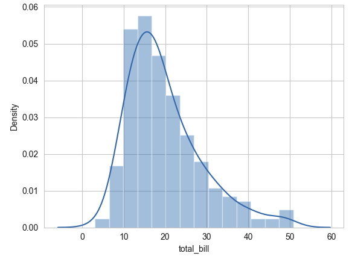

**Output Explanation:**

- The **bars** represent the histogram — counts of observations per bin.
- The **smooth line** is the KDE curve, estimating the probability density.

---

### 1.1 Customize `distplot`

You can remove the KDE curve or adjust bins for finer control.

```python
# Histogram only (no KDE)
sns.distplot(tips['total_bill'], kde=False, bins=20, color='skyblue')
plt.title("Total Bill Histogram")
plt.show()
```

**Output:** A simple histogram of total bills using 20 bins, without the smooth
KDE line. 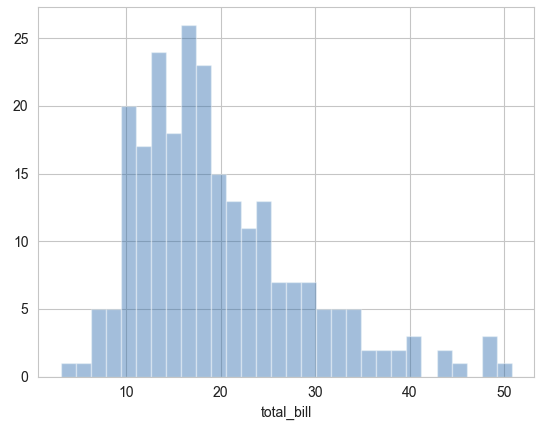

---

### ⚠️ Note:

`distplot` is **deprecated** in newer Seaborn versions. Use either:

- `sns.histplot()` — for histograms, or
- `sns.displot()` — for higher-level figure creation with multiple facets.

---

## 2. **Jointplot** — Relationship Between Two Variables

`jointplot()` allows us to study the relationship between two numerical
variables by combining **two distribution plots** (on the margins) and **a
relationship plot** (in the center).

```python
sns.jointplot(x='total_bill', y='tip', data=tips)
plt.show()
```

**Output:** A **scatterplot** in the center and two **histograms** on the axes,
showing marginal distributions of `total_bill` and `tip`.
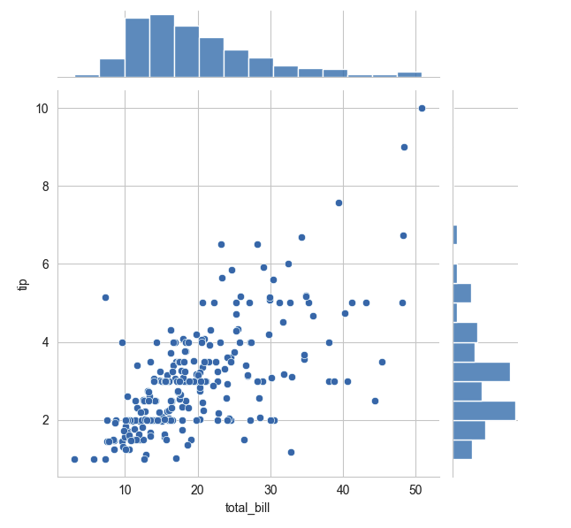

---

### 2.1 Customizing `jointplot` with `kind` Parameter

You can choose how the central plot looks using the `kind` argument.

| `kind` Value | Description                                 |
| ------------ | ------------------------------------------- |
| `'scatter'`  | Default scatterplot                         |
| `'hex'`      | Hexbin plot — hexagons shaded by density    |
| `'reg'`      | Regression plot with fitted regression line |
| `'kde'`      | KDE density contours instead of points      |

#### Examples:

```python
# Hexbin plot
sns.jointplot(x='total_bill', y='tip', data=tips, kind='hex', color='green')
plt.show()

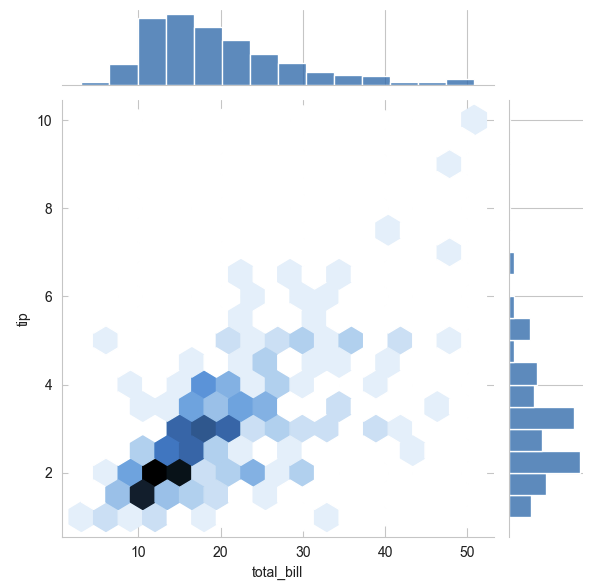

# Regression plot
sns.jointplot(x='total_bill', y='tip', data=tips, kind='reg')
plt.show()
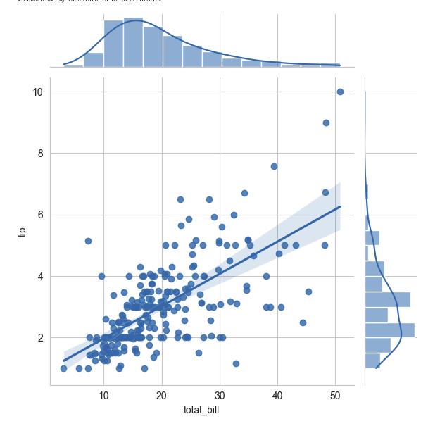
# KDE contour plot
sns.jointplot(x='total_bill', y='tip', data=tips, kind='kde', fill=True, cmap='Blues')
plt.show()
```

Each plot shows the same relationship differently — hex for density, reg for
linear trend, and kde for smoothed density contours.

---

## 3. **Pairplot** — Pairwise Relationships Across All Variables

`pairplot()` creates **scatterplots for every pair of numerical variables** in a
DataFrame, with **histograms or KDEs** on the diagonals. It’s one of the most
powerful ways to quickly inspect relationships across multiple columns.

```python
sns.pairplot(tips)
plt.show()
```

**Output:** A grid of scatterplots showing all numerical variable combinations
(`total_bill`, `tip`, `size`) and histograms on the diagonal.
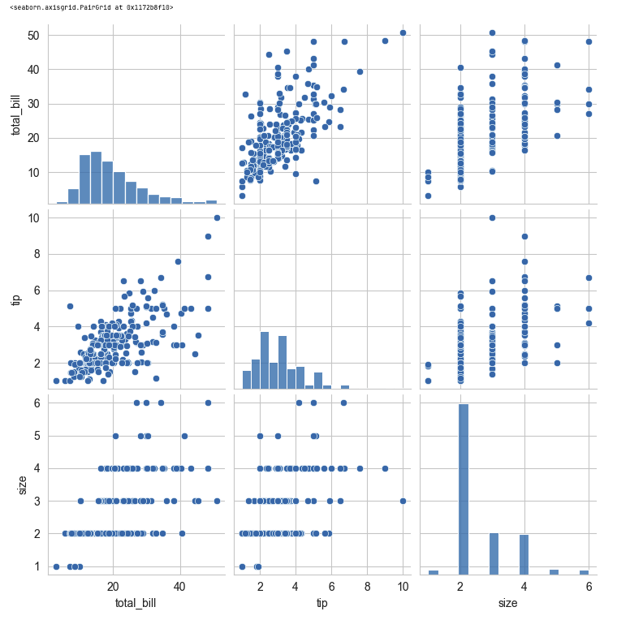

---

### 3.1 Using `hue` to Add Categorical Coloring

You can color the points by a categorical column using `hue`.

```python
sns.pairplot(tips, hue='sex', palette='coolwarm')
plt.show()
```

**Output:** Males and females are shown in distinct colors across all plots,
making category-based trends easier to identify. 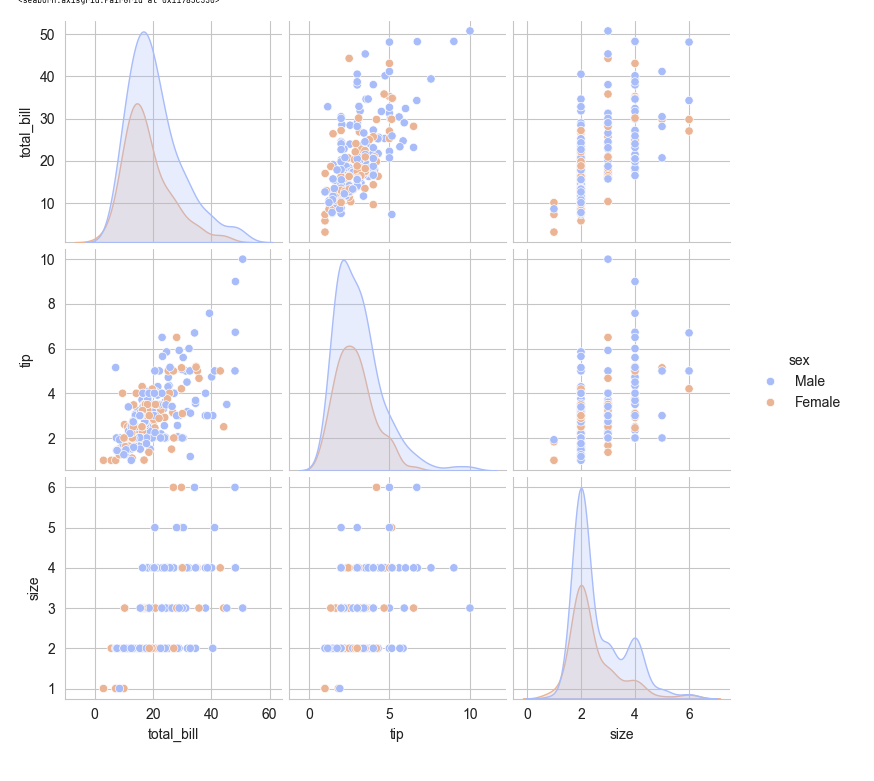

---

## 4. **Rugplot** — Data Point Distribution Along an Axis

A **rug plot** marks each data point as a small tick (dash) along an axis. It
helps visualize raw data density.

```python
sns.rugplot(tips['total_bill'])
plt.title("Rug Plot of Total Bill")
plt.show()
```

**Output:** Short vertical lines along the x-axis, each representing one
observation of `total_bill`.

---

### 4.1 Rugplot + KDE Visualization

A KDE curve is conceptually a **sum of normal distributions** centered at each
rug mark. We can visualize this by combining both:

```python
sns.kdeplot(tips['total_bill'], shade=True, color='skyblue')
sns.rugplot(tips['total_bill'], color='black')
plt.title("KDE + Rug Plot — Total Bill")
plt.show()
```

**Output:** A smooth KDE curve overlaid with short dashes for individual data
points — combining continuous and discrete representations.
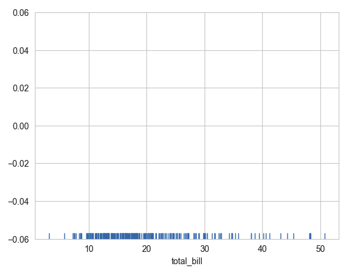

---

## 5. **KDE Plot** — Smooth Probability Density Curve

KDE stands for **Kernel Density Estimation**, a method to estimate a variable’s
probability density by summing small Gaussian (bell-curve) kernels centered at
each observation.

```python
sns.kdeplot(tips['total_bill'], fill=True, color='green', linewidth=2)
plt.title("KDE Plot — Total Bill Distribution")
plt.show()
```

**Output:** A smooth, bell-shaped density curve representing the likelihood of
total bill values.

---

### 5.1 2D KDE Plots

KDE plots can also represent two-variable density in 2D space.

```python
sns.kdeplot(data=tips, x='total_bill', y='tip', fill=True, cmap='Purples')
plt.title("2D KDE Plot — Total Bill vs Tip")
plt.show()
```

**Output:** A filled contour map showing density regions — darker areas indicate
more frequent combinations of total bill and tip. 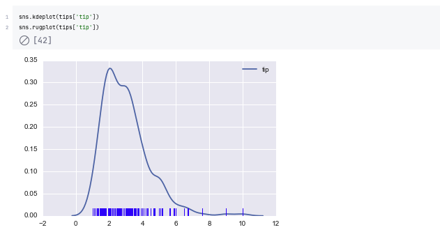
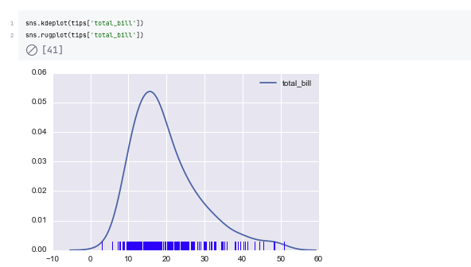 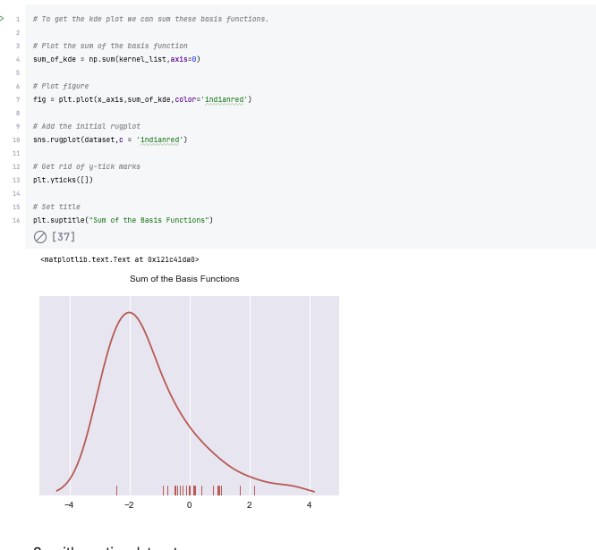

## Advanced example

```python
# Don't worry about understanding this code!
# It's just for the diagram below
import numpy as np
import matplotlib.pyplot as plt
from scipy import stats

#Create dataset
dataset = np.random.randn(25)

# Create another rugplot
sns.rugplot(dataset);

# Set up the x-axis for the plot
x_min = dataset.min() - 2
x_max = dataset.max() + 2

# 100 equally spaced points from x_min to x_max
x_axis = np.linspace(x_min,x_max,100)

# Set up the bandwidth, for info on this:
url = 'http://en.wikipedia.org/wiki/Kernel_density_estimation#Practical_estimation_of_the_bandwidth'

bandwidth = ((4*dataset.std()**5)/(3*len(dataset)))**.2


# Create an empty kernel list
kernel_list = []

# Plot each basis function
for data_point in dataset:

    # Create a kernel for each point and append to list
    kernel = stats.norm(data_point,bandwidth).pdf(x_axis)
    kernel_list.append(kernel)

    #Scale for plotting
    kernel = kernel / kernel.max()
    kernel = kernel * .4
    plt.plot(x_axis,kernel,color = 'grey',alpha=0.5)

plt.ylim(0,1)
```
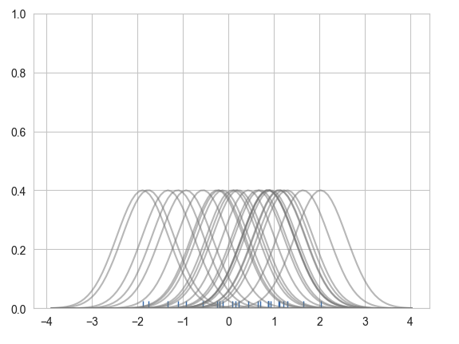
---

## Summary Table of Distribution Plots

| Plot Type                  | Function                        | Use Case                  | Example                             |
| -------------------------- | ------------------------------- | ------------------------- | ----------------------------------- |
| **Histogram + KDE**        | `sns.distplot` / `sns.histplot` | Univariate distribution   | `sns.histplot(data, x="col")`       |
| **Bivariate Distribution** | `sns.jointplot`                 | Two-variable relationship | `sns.jointplot(x, y, data)`         |
| **Pairwise Relationships** | `sns.pairplot`                  | All numerical variables   | `sns.pairplot(df, hue='sex')`       |
| **Rug Plot**               | `sns.rugplot`                   | Individual observations   | `sns.rugplot(df['col'])`            |
| **KDE Plot**               | `sns.kdeplot`                   | Smooth probability curve  | `sns.kdeplot(df['col'], fill=True)` |

---

## Key Concepts and Definitions

| Term                                | Meaning                                                                                |
| ----------------------------------- | -------------------------------------------------------------------------------------- |
| **Histogram**                       | Groups continuous data into intervals (bins) and counts frequency per bin.             |
| **KDE (Kernel Density Estimation)** | Estimates the probability density function (PDF) by summing smooth Gaussian functions. |
| **Rug Plot**                        | Draws small vertical lines for each observation, showing actual data positions.        |
| **Bivariate Distribution**          | Joint distribution of two variables, often visualized as a scatter or density plot.    |
| **Pairwise Comparison**             | Visualization of all possible numeric variable combinations (as in pairplot).          |

---

## Practice Questions

1. What is the difference between a histogram and a KDE plot?
2. How can you create a scatter plot with marginal distributions in Seaborn?
3. What parameter in `jointplot()` changes the central plot to a hexbin
   visualization?
4. How does the `hue` parameter in `pairplot()` enhance data visualization?
5. What is the purpose of a rugplot?
6. How would you visualize the joint distribution of two continuous variables
   using a smooth contour?
7. How does Seaborn estimate KDE curves mathematically?
8. What happens if you set `bins=100` in `distplot()`?
9. Which Seaborn function allows quick exploration of all numerical
   relationships?
10. What’s the conceptual link between a rugplot and a KDE plot?

---

## Answers

1. A **histogram** shows discrete counts per bin; a **KDE** estimates a smooth
   probability density curve.
2. Use `sns.jointplot(x, y, data)` to show scatter + marginal histograms.
3. Set `kind='hex'`.
4. It adds **color coding** based on a categorical variable, improving pattern
   detection.
5. A rugplot marks **each data point** with a tick, showing raw distribution.
6. Use `sns.kdeplot(x, y, data, fill=True)` for 2D KDE contour density.
7. By summing **Gaussian kernels** centered on each data point.
8. The histogram becomes overly segmented (too many bins), reducing clarity.
9. `sns.pairplot()`
10. A **KDE** is the smoothed version of **rugplot** — conceptually built by
    summing small Gaussian bumps at each rug mark.

---

You now understand **Seaborn’s distribution visualization toolkit** — the
foundation for data-driven analysis and EDA. In the next chapter, we’ll explore
**Categorical Plots** (bar, box, violin, and swarm plots) to compare
distributions across groups and categories.
