## Introduction to Categorical Plots

In real-world data, many variables are **categorical** — such as _gender_, _day
of the week_, or _smoker status_. Seaborn offers a suite of categorical plotting
functions that make it easy to compare **distributions and group statistics**.

These plots help us answer questions like:

- How does one group differ from another?
- Are there patterns or outliers in specific categories?
- What is the average or variability across categories?

We’ll use Seaborn’s built-in **`tips`** dataset throughout this section.

```python
import seaborn as sns
import matplotlib.pyplot as plt
import numpy as np

# Enable inline plotting
%matplotlib inline

# Load the dataset
tips = sns.load_dataset('tips')
tips.head()
```

**Output:**

```
   total_bill   tip     sex smoker  day    time  size
0       16.99  1.01  Female     No  Sun  Dinner     2
1       10.34  1.66    Male     No  Sun  Dinner     3
2       21.01  3.50    Male     No  Sun  Dinner     3
3       23.68  3.31    Male     No  Sun  Dinner     2
4       24.59  3.61  Female     No  Sun  Dinner     4
```

---

## 1. Bar Plot

A **bar plot** visualizes **aggregate values** (by default, the mean) across
categories.

```python
sns.barplot(x='sex', y='total_bill', data=tips)
plt.title("Average Total Bill by Gender")
plt.show()
```

**Output Description:** A bar for each gender — showing the _average_ total bill
for males and females. The vertical black line on each bar is a **confidence
interval (CI)** for the mean. 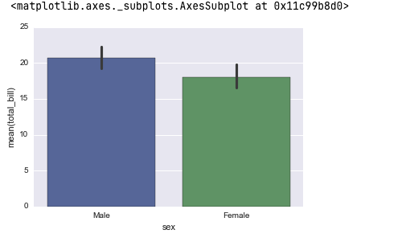

---

### 1.1 Custom Aggregation

By default, Seaborn uses the **mean**. You can change this behavior using the
`estimator` parameter.

```python
sns.barplot(x='sex', y='total_bill', data=tips, estimator=np.std)
plt.title("Standard Deviation of Total Bill by Gender")
plt.show()
```

**Output:** Each bar now represents the **standard deviation** of total bills,
instead of the mean.

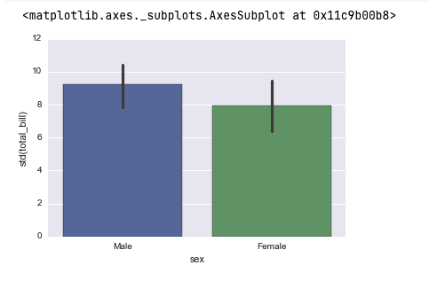

---

## 2. Count Plot

A **count plot** displays the number of observations in each category —
effectively a bar chart of counts.

```python
sns.countplot(x='sex', data=tips)
plt.title("Count of Male and Female Customers")
plt.show()
```

**Output:** Bars representing the count of males and females in the dataset.
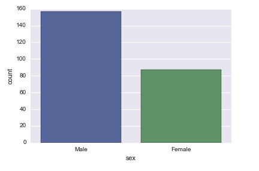

Count plots are extremely useful for understanding **sample balance** across
categorical features.

---

## 3. Box Plot

A **box plot** (or box-and-whisker plot) shows the **distribution** of a numeric
variable for each category — including **quartiles, medians, and outliers**.

```python
sns.boxplot(x='day', y='total_bill', data=tips)
plt.title("Box Plot of Total Bill by Day")
plt.show()
```

**Output Explanation:**

- The **box** shows the interquartile range (middle 50% of data).
- The **line** in the box is the median.
- The **whiskers** extend to typical data ranges.
- **Dots** beyond whiskers are **outliers**.

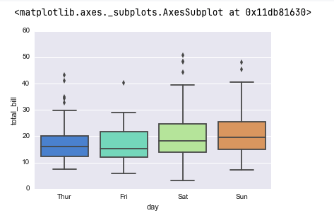

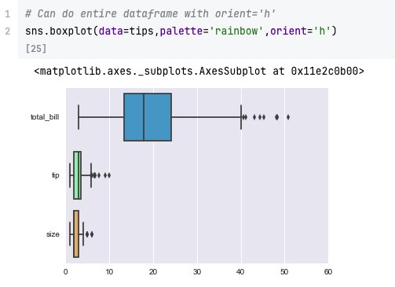

---

### 3.1 Box Plot with Hue (Group Comparison)

You can separate categories within each box using the `hue` parameter.

```python
sns.boxplot(x='day', y='total_bill', hue='smoker', data=tips)
plt.title("Box Plot of Total Bill by Day (Smoker vs Non-Smoker)")
plt.show()
```

**Output:** Each day has two boxes — one for smokers and one for non-smokers —
allowing side-by-side comparison.

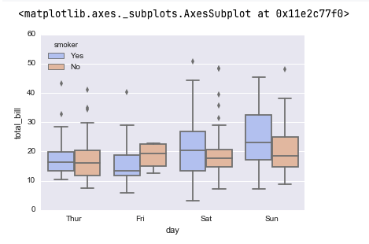

---

## 4. Violin Plot

A **violin plot** combines a **box plot** with a **kernel density estimate
(KDE)**, showing the full data distribution shape.

```python
sns.violinplot(x='day', y='total_bill', data=tips)
plt.title("Violin Plot of Total Bill by Day")
plt.show()
```

**Output:** Each “violin” shows the density of total bill amounts for each day —
the width represents frequency.

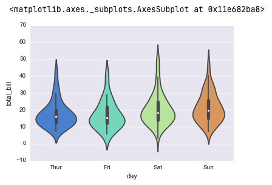

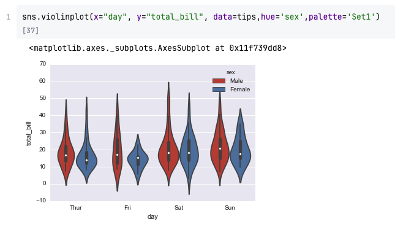

### 4.1 Split Violin Plot

To compare two groups within each category, use `hue` with `split=True`.

```python
sns.violinplot(x='day', y='total_bill', hue='sex', split=True, data=tips)
plt.title("Split Violin Plot of Total Bill by Day and Gender")
plt.show()
```

**Output:** Each day’s violin is split into two halves — left for one gender,
right for the other — revealing overlapping distributions.

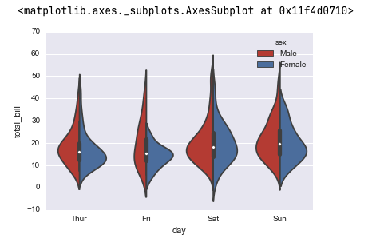

---

## 5. Strip Plot

A **strip plot** displays **individual observations** for each category. It’s
essentially a **scatter plot** for categorical x-values.

```python
sns.stripplot(x='day', y='total_bill', data=tips)
plt.title("Strip Plot of Total Bill by Day")
plt.show()
```

**Output:** Each point represents one data entry, stacked vertically for
visibility.

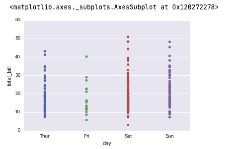

---

### 5.1 Adding Jitter

`jitter=True` adds small random noise to separate overlapping points for
readability.

```python
sns.stripplot(x='day', y='total_bill', data=tips, jitter=True)
plt.title("Strip Plot with Jitter")
plt.show()
```

**Output:** Points are spread horizontally, reducing overlap.
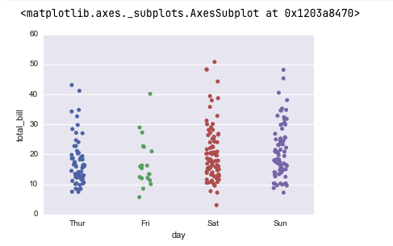

---

### 5.2 Using Hue

Coloring points by another variable helps spot patterns.

```python
sns.stripplot(x='day', y='total_bill', hue='sex', data=tips, jitter=True)
plt.title("Strip Plot of Total Bill by Day (Colored by Gender)")
plt.show()
```

**Output:** Male and female points are colored differently, revealing
group-level trends. 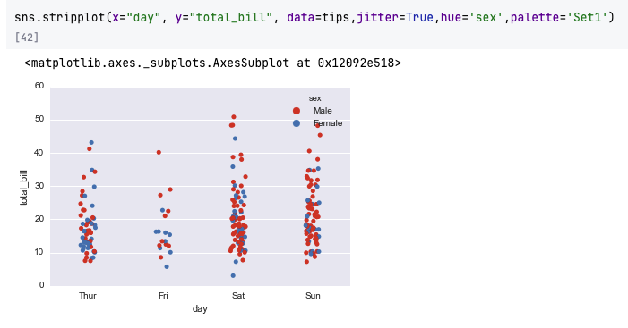 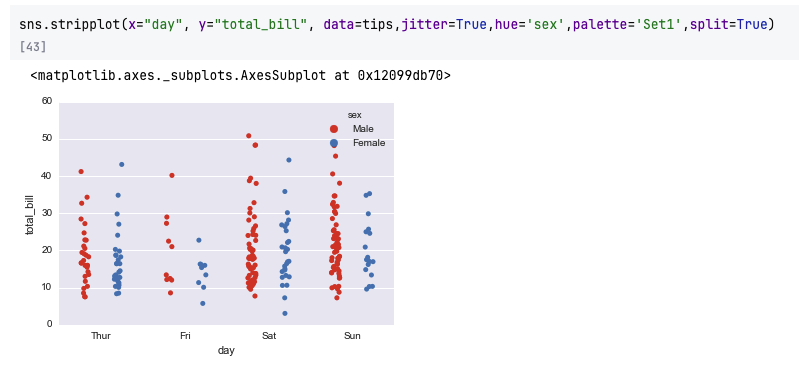

---

## 6. Swarm Plot

A **swarm plot** improves on strip plots by **automatically adjusting** point
positions to prevent overlap.

```python
sns.swarmplot(x='day', y='total_bill', data=tips)
plt.title("Swarm Plot of Total Bill by Day")
plt.show()
```

**Output:** A neatly arranged swarm of points showing distribution shape and
density — no overlapping points.

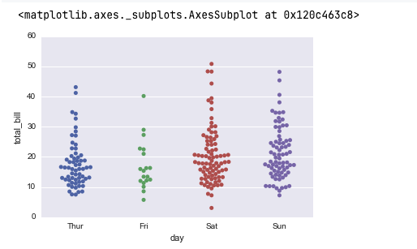

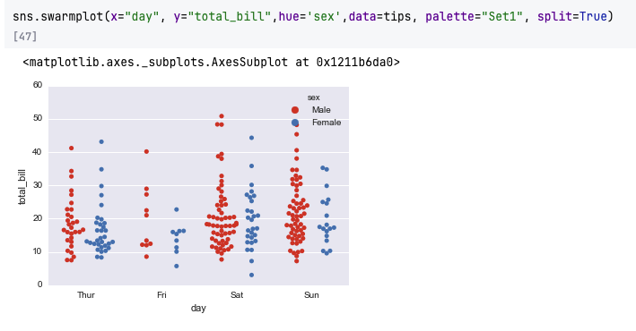

---

### 6.1 Combining Swarm and Violin Plots

Combining **violin** (distribution shape) with **swarm** (individual points)
gives a complete view of the data.

```python
sns.violinplot(x='day', y='total_bill', data=tips, inner=None)
sns.swarmplot(x='day', y='total_bill', data=tips, color='k', alpha=0.6)
plt.title("Violin + Swarm Plot of Total Bill by Day")
plt.show()
```

**Output:** The violins show smooth distribution shapes, while black dots
(swarm) show actual data points — offering both granularity and overview.
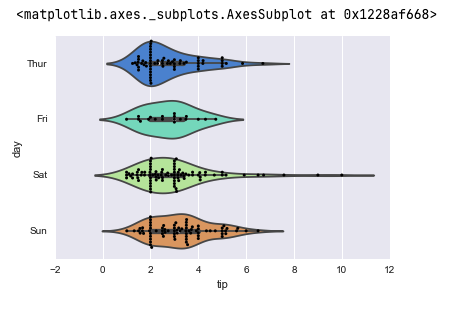
---

## 7. Factor Plot (now called `catplot`)

`catplot` (formerly `factorplot`) is a **general-purpose categorical plotting
function**. It combines the flexibility of different plot types (`bar`, `box`,
`violin`, etc.) with Seaborn’s **facet grid system**.

```python
sns.catplot(x='day', y='total_bill', kind='bar', data=tips)
plt.show()
```

**Output:** Equivalent to a bar plot, but it can also be **faceted** by other
categorical variables.
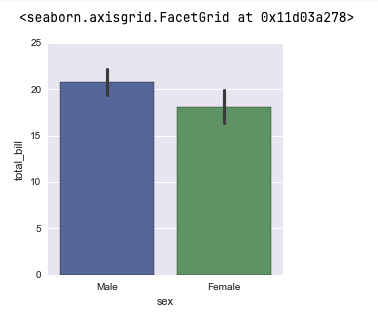
---

### 7.1 Creating a Violin Catplot

```python
sns.catplot(x='day', y='total_bill', kind='violin', data=tips)
plt.show()
```

**Output:** Equivalent to `sns.violinplot`, but allows faceting across
rows/columns.

---

### 7.2 Faceted Example

```python
sns.catplot(x='day', y='total_bill', hue='sex', col='smoker', kind='box', data=tips)
plt.show()
```

**Output:** Two side-by-side boxplots — one for smokers, one for non-smokers —
each split by gender and day.

---

## Summary Table of Categorical Plots

| Plot Type       | Function           | Description                       | Key Use Case                          |
| --------------- | ------------------ | --------------------------------- | ------------------------------------- |
| **Bar Plot**    | `sns.barplot()`    | Aggregates data (mean by default) | Compare average values by category    |
| **Count Plot**  | `sns.countplot()`  | Counts category occurrences       | View frequency distribution           |
| **Box Plot**    | `sns.boxplot()`    | Shows quartiles & outliers        | Compare spread across categories      |
| **Violin Plot** | `sns.violinplot()` | Combines KDE + boxplot            | View distribution shape by category   |
| **Strip Plot**  | `sns.stripplot()`  | Individual data points            | Visualize raw data across groups      |
| **Swarm Plot**  | `sns.swarmplot()`  | Non-overlapping data points       | Clear view of distribution + outliers |
| **Cat Plot**    | `sns.catplot()`    | Flexible faceted interface        | Combine categorical plots with facets |

---

## Advanced Example — Comparing Categories Across Two Dimensions

```python
sns.catplot(
    x='day', y='total_bill', hue='sex',
    col='time', kind='violin', split=True, data=tips
)
plt.show()
```

**Output Description:** Two columns — _Lunch_ and _Dinner_ — each showing split
violins for male and female distributions per day.

---

## Key Takeaways

- **Bar plots** summarize data using aggregation functions (mean, std, median).
- **Count plots** visualize categorical frequencies.
- **Box and Violin plots** show **distribution** and **variability** across
  categories.
- **Strip and Swarm plots** visualize individual observations — swarm plots
  avoid overlap.
- **Catplot** generalizes all categorical plots, allowing **facet grids** and
  multiple dimensions.
- The choice of plot depends on your **audience** and **goal**:

  - **Bar/Count plots** for summaries (e.g., business presentations)
  - **Box/Violin/Swarm plots** for deeper analysis (e.g., data science EDA)

---

## Practice Questions

1. What’s the main difference between `barplot()` and `countplot()`?
2. How can you visualize both KDE shape and raw data points together?
3. Which plot type helps identify outliers easily?
4. How would you visualize the median total bill per day with confidence
   intervals removed?
5. What does the `split=True` parameter do in a violin plot?
6. How can `catplot()` be used to create a faceted grid of boxplots?
7. Why might swarm plots be preferred over strip plots?
8. How do you change the aggregation function in `barplot()`?
9. Which Seaborn plot can show all individual observations without overlap?
10. What are the advantages of using `catplot()` over individual categorical
    plotting functions?

---

## Answers

1. `barplot()` shows **aggregated statistics (mean, std, etc.)**, while
   `countplot()` shows **raw counts** of each category.
2. Overlay a `sns.swarmplot()` on top of a `sns.violinplot()`.
3. `sns.boxplot()` — the points outside whiskers are outliers.
4. Use
   `sns.barplot(x='day', y='total_bill', ci=None, data=tips, estimator=np.median)`.
5. It displays two categories within the same violin side-by-side.
6. `sns.catplot(x='day', y='total_bill', col='time', kind='box', data=tips)`
7. Swarm plots adjust point positions to avoid overlap, improving readability.
8. Pass any NumPy function to `estimator=`, e.g., `estimator=np.median`.
9. `sns.swarmplot()`
10. `catplot()` supports **faceting**, letting you plot multiple categorical
    relationships in one figure.

---

✅ **Next Step:** Proceed to the next section — **Matrix Plots and Heatmaps**,
where you’ll learn how to visualize relationships between multiple variables in
grid form using `sns.heatmap()` and `sns.clustermap()`.
