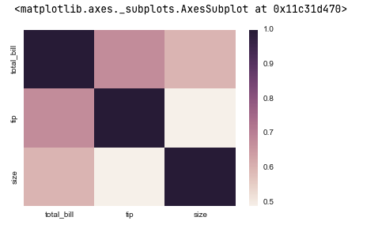
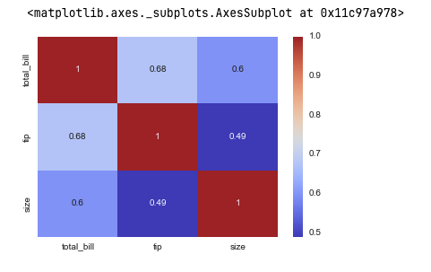
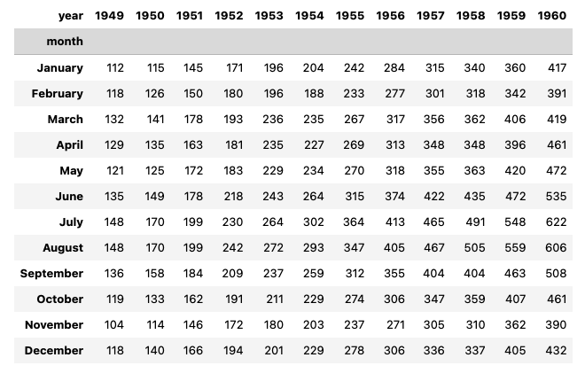
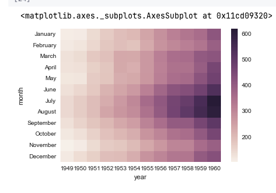
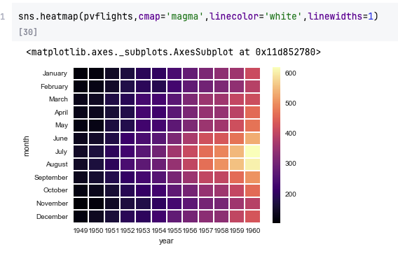
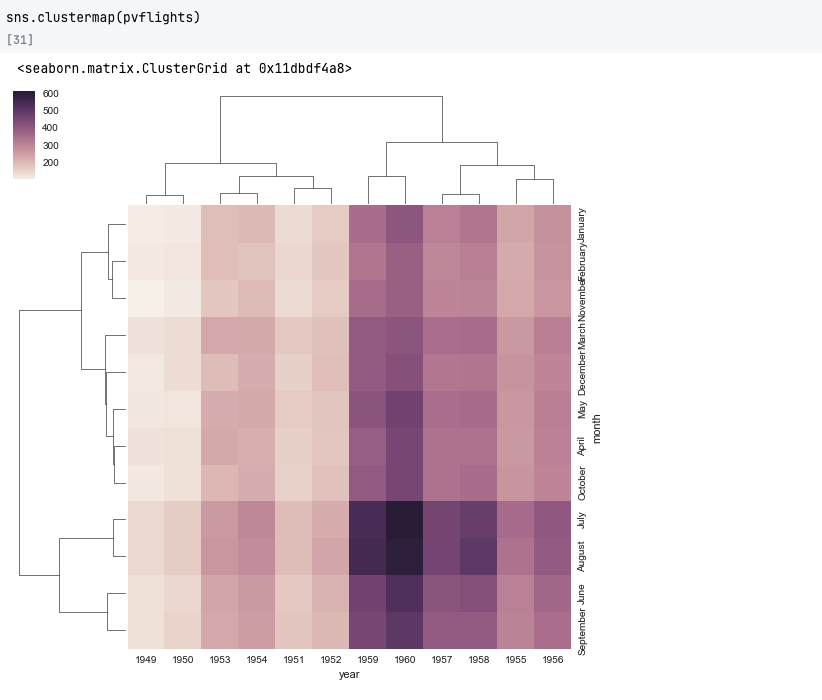
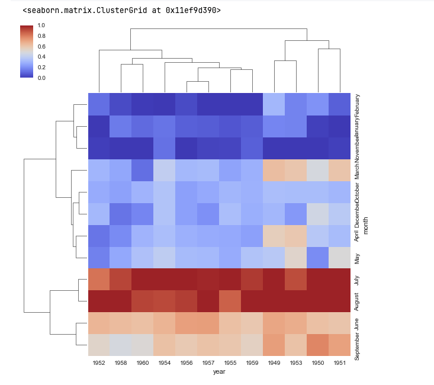

## Introduction to Matrix Plots

Matrix plots are one of Seaborn’s most powerful visualization tools, allowing us
to view **2D data relationships** (rows vs. columns) using **color gradients**.
The most common matrix plots are **heat maps** and **cluster maps**, which help
visualize **patterns, correlations, and hierarchies** in data.

These plots are especially useful for:

- Visualizing **correlations between variables**
- Displaying **aggregated numerical values** across two categorical axes
- Identifying **patterns and trends** in large datasets

---

## Setup

Let’s start by importing the required libraries and datasets.

```python
import seaborn as sns
import matplotlib.pyplot as plt

%matplotlib inline

# Load datasets
tips = sns.load_dataset('tips')
flights = sns.load_dataset('flights')

# Preview datasets
print("Tips dataset:")
print(tips.head())

print("\nFlights dataset:")
print(flights.head())
```

**Output:**

```
Tips dataset:
   total_bill   tip     sex smoker  day    time  size
0       16.99  1.01  Female     No  Sun  Dinner     2
1       10.34  1.66    Male     No  Sun  Dinner     3

Flights dataset:
   year month  passengers
0  1949  Jan         112
1  1949  Feb         118
2  1949  Mar         132
3  1949  Apr         129
4  1949  May         121
```

---

## Understanding Heat Maps

A **heat map** represents numerical values as colors in a matrix format. For
example, a correlation matrix shows how variables are related — where:

- **+1** = perfect positive correlation
- **−1** = perfect negative correlation
- **0** = no correlation

---

### Step 1: Create a Correlation Matrix

```python
corr = tips.corr(numeric_only=True)
corr
```

**Output:**

```
              total_bill       tip      size
total_bill      1.000000  0.675734  0.598316
tip             0.675734  1.000000  0.489299
size            0.598316  0.489299  1.000000
```

---

### Step 2: Plot the Heat Map

```python
sns.heatmap(corr)
plt.title("Correlation Heatmap — Tips Dataset")
plt.show()
```

**Output Description:**

- Cells are shaded by correlation value.
- Darker or lighter colors indicate stronger or weaker relationships.

---

### Step 3: Add Annotations and Custom Colors

We can make our heat map more informative by displaying numerical values and
customizing the color palette.

```python
sns.heatmap(corr, annot=True, cmap='coolwarm', linewidths=0.5)
plt.title("Correlation Heatmap with Annotations")
plt.show()
```

**Output:**

- Each cell displays its correlation coefficient.
- The `'coolwarm'` color palette provides a visually intuitive gradient from
  blue (negative) to red (positive).

---

## Creating Heat Maps from Non-Matrix Data

Many datasets, like `flights`, are not in matrix form initially. To use
`sns.heatmap()`, we first **pivot** the data into a matrix where rows and
columns are variables.

### Step 1: Pivot the Flights Dataset

```python
flights_pivot = flights.pivot_table(index='month', columns='year', values='passengers')
flights_pivot.head()
```

**Output:**

```
year    1949  1950  1951  1952  1953  1954  1955  1956  1957  1958  1959  1960
month
Jan      112   115   145   171   196   204   242   284   315   340   360   417
Feb      118   126   150   180   188   188   233   277   301   318   342   391
...
```

---

### Step 2: Visualize the Pivoted Data

```python
sns.heatmap(flights_pivot, cmap='magma')
plt.title("Passenger Count Heatmap (1949–1960)")
plt.show()
```

**Output Explanation:**

- Rows → Months
- Columns → Years
- Color intensity → Number of passengers You’ll likely observe increasing
  brightness over time, indicating passenger growth over the years.

---

### Step 3: Improve Readability with Lines and Labels

```python
sns.heatmap(flights_pivot, cmap='magma', linewidths=1, linecolor='white', annot=True, fmt="d")
plt.title("Annotated Heatmap — Monthly Passengers (1949–1960)")
plt.show()
```

**Output:** A polished grid-style heatmap with white lines and integer
annotations for passenger counts.

---

## Cluster Maps — Hierarchical Grouping

A **cluster map** extends a heatmap by applying **hierarchical clustering** to
rows and columns. It groups similar rows or columns together based on similarity
in their values.

### Step 1: Create a Cluster Map

```python
sns.clustermap(flights_pivot, cmap='coolwarm')
plt.show()
```

**Output Description:**

- A heatmap with dendrograms (tree structures) on top and left.
- Dendrograms show how rows and columns are hierarchically grouped based on
  similarity.

---

### Step 2: Standardize the Data

Sometimes, values vary across columns. Setting `standard_scale=1` normalizes
each column for better pattern comparison.

```python
sns.clustermap(flights_pivot, cmap='coolwarm', standard_scale=1)
plt.title("Cluster Map with Column Normalization")
plt.show()
```

**Output:** Each column is scaled so that differences reflect **relative**
rather than **absolute** magnitudes.

---

### Step 3: Customize Appearance

```python
sns.clustermap(flights_pivot, cmap='viridis', linewidths=0.5, figsize=(10, 8))
plt.title("Customized Cluster Map — Passenger Trends")
plt.show()
```

**Output:** A visually appealing cluster map using the _viridis_ color palette
and adjusted figure size.

---

## Understanding Hierarchical Clustering

In cluster maps:

- The **dendrograms** represent similarity among data series.
- Each merge in the dendrogram indicates a grouping based on minimum distance.
- Clustering helps reveal **hidden relationships** like:

  - Similar travel months (e.g., June, July, August).
  - Comparable passenger growth patterns across years.

---

## Summary Table

| Plot Type       | Function           | Description                                   | Example Use Case                        |
| --------------- | ------------------ | --------------------------------------------- | --------------------------------------- |
| **Heatmap**     | `sns.heatmap()`    | Displays numerical data using color gradients | Visualize correlation or pivoted values |
| **Cluster Map** | `sns.clustermap()` | Adds hierarchical clustering to a heatmap     | Identify groups of similar rows/columns |

---

## Advanced Example — Flight Trends Over Time

```python
sns.clustermap(
    flights_pivot,
    cmap='coolwarm',
    standard_scale=1,
    linewidths=0.7,
    linecolor='white'
)
plt.title("Hierarchical Clustering of Monthly Passenger Trends (1949–1960)")
plt.show()
```

**Output Insight:** You can see how similar months (e.g., **summer peaks**)
group together, and how early vs. later years cluster differently based on
growth trends.

---

## Key Takeaways

- **Matrix plots** display relationships between variables in 2D form using
  color gradients.
- **Heatmaps** visualize numerical patterns — especially useful for correlation
  or pivoted data.
- **Cluster maps** apply hierarchical clustering to group similar data and
  reveal hidden structures.
- You can **annotate, normalize, and customize** colors for better readability.
- Matrix plots are foundational tools for **EDA**, **feature selection**, and
  **pattern detection** in multivariate datasets.

---

## Practice Questions

1. What type of data structure does a heatmap require?
2. How does `sns.clustermap()` differ from `sns.heatmap()`?
3. What argument adds numerical annotations to each cell in a heatmap?
4. Which parameter in `clustermap()` normalizes the data by column?
5. What is the purpose of a dendrogram?
6. How can you convert a DataFrame into matrix form for a heatmap?
7. What does `linewidths` control in a heatmap?
8. How would you change the color theme of a heatmap?
9. What does setting `standard_scale=1` do?
10. In what scenarios is a cluster map more informative than a simple heatmap?

---

## Answers

1. A **matrix (2D table)** with aligned row and column labels.
2. `clustermap()` performs **hierarchical clustering**, while `heatmap()` only
   visualizes values.
3. Use `annot=True`.
4. `standard_scale=1` normalizes each column independently.
5. A dendrogram visualizes hierarchical similarity between variables.
6. Use `pivot_table(index, columns, values)` to reshape data.
7. It controls **grid line thickness** between cells.
8. Change `cmap='coolwarm'` (or any palette like `'magma'`, `'viridis'`,
   `'YlGnBu'`).
9. It rescales each column to make their ranges comparable.
10. When you want to identify **clusters or patterns** among variables (e.g.,
    months with similar passenger patterns).

---

✅ **Next Step:** Proceed to the next section — **Regression Plots**, where
you’ll learn how to visualize relationships and trends between variables using
Seaborn’s `regplot()` and `lmplot()` functions.
