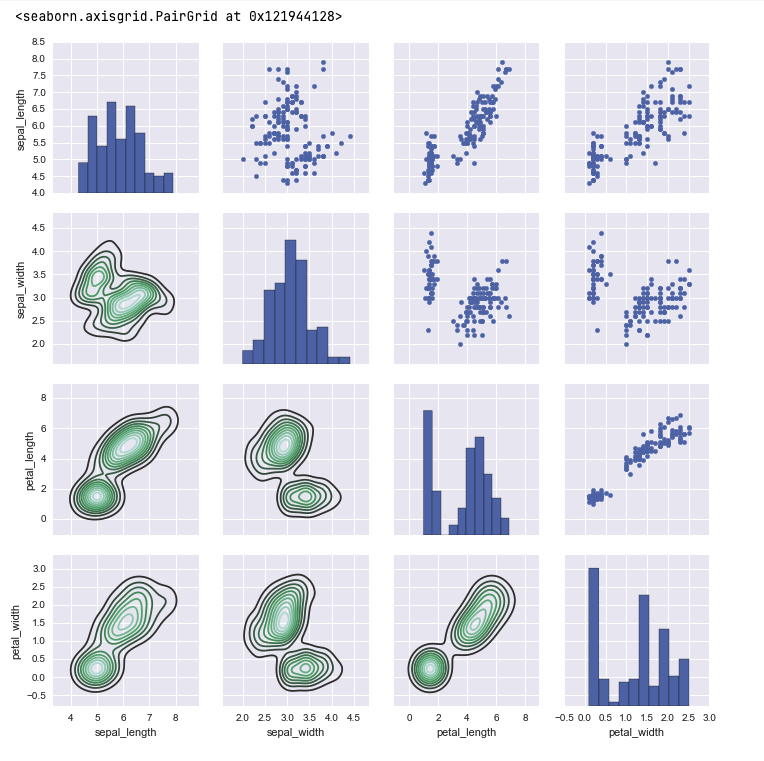
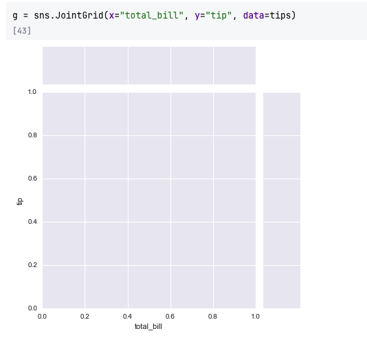

# Introduction to Grids in Seaborn

**Seaborn’s grid system** provides a powerful way to automate and customize
multi-plot visualizations. It helps you **split your data into subsets** and
**display multiple plots simultaneously**, making it easy to compare
relationships across features or categories.

Two key grid classes form the foundation:

- **PairGrid** — focuses on pairwise relationships between numerical features.
- **FacetGrid** — focuses on categorical faceting (row/column-based visual
  separation).

---

## Setting Up the Environment

Let’s start with importing Seaborn and loading sample datasets.

```python
import seaborn as sns
import matplotlib.pyplot as plt

%matplotlib inline
```

We’ll first explore the **Iris** dataset for `PairGrid` examples.

```python
iris = sns.load_dataset('iris')
iris.head()
```

**Output:**

```
   sepal_length  sepal_width  petal_length  petal_width species
0           5.1          3.5           1.4          0.2  setosa
1           4.9          3.0           1.4          0.2  setosa
2           4.7          3.2           1.3          0.2  setosa
3           4.6          3.1           1.5          0.2  setosa
4           5.0          3.6           1.4          0.2  setosa
```

The **`species`** column is categorical (setosa, versicolor, virginica), while
others are numeric features.

---

## 1. Pair Plot — Quick Multi-Variable Visualization

`pairplot()` is the fastest way to generate pairwise scatterplots and histograms
for all numeric columns.

```python
sns.pairplot(iris, hue='species')
plt.show()
```

**Output Description:**

- Each **off-diagonal plot** shows scatter relationships between two features.
- The **diagonal plots** show feature distributions (histograms).
- `hue='species'` colors points by flower type.


---

## 2. PairGrid — Full Control Over Pairwise Grids

While `pairplot()` is convenient, **`PairGrid`** offers **fine-grained
customization** of each grid section (upper, lower, diagonal).

### Step 1: Create a PairGrid

```python
g = sns.PairGrid(iris)
```

This creates a grid layout (4×4 in this case, one for each numerical feature
combination).

---

### Step 2: Map a Common Plot Type to All Sections

You can apply the same plot type everywhere in the grid.

```python
g.map(sns.scatterplot)
plt.show()
```

**Output:** A full grid of scatter plots for all feature combinations.


---

### Step 3: Customize Diagonal, Upper, and Lower Plots Separately

`PairGrid` allows you to assign **different plot functions** to different parts
of the grid.

```python
g = sns.PairGrid(iris, hue='species')
g.map_diag(sns.histplot)      # Histograms on the diagonal
g.map_upper(sns.scatterplot)  # Scatterplots on upper triangle
g.map_lower(sns.kdeplot)      # Density plots on lower triangle
g.add_legend()
plt.show()
```

**Output Explanation:**

- **Diagonal:** Histograms showing the distribution of each feature.
- **Upper:** Scatterplots showing relationships.
- **Lower:** Smoothed **Kernel Density Estimation (KDE)** contours showing
  density regions.
- The legend automatically maps color to species.




---

### Step 4: Styling and Customization

You can further tweak the grid using Matplotlib and Seaborn styling.

```python
sns.set_style("whitegrid")
g = sns.PairGrid(iris, hue='species', diag_sharey=False)
g.map_upper(sns.scatterplot)
g.map_lower(sns.kdeplot, fill=True, alpha=0.7)
g.map_diag(sns.histplot, bins=10, alpha=0.6)
g.add_legend()
plt.show()
```

**Output:** A clean, polished grid layout with semi-transparent density regions
and distinct histograms.

---

## 3. FacetGrid — Plotting Across Categorical Subsets

`FacetGrid` is used to create **grids of plots for subsets of data**, defined by
one or more **categorical variables**.

We’ll use the **Tips** dataset here.

```python
tips = sns.load_dataset('tips')
tips.head()
```

**Output:**

```
   total_bill   tip     sex smoker  day    time  size
0       16.99  1.01  Female     No  Sun  Dinner     2
1       10.34  1.66    Male     No  Sun  Dinner     3
2       21.01  3.50    Male     No  Sun  Dinner     3
...
```

---

### Step 1: Create a FacetGrid

We’ll divide the dataset by `time` (Lunch/Dinner) into columns and `smoker`
(Yes/No) into rows.

```python
g = sns.FacetGrid(tips, col='time', row='smoker')
```

This initializes a **2×2 grid** of subplots.


---

### Step 2: Map a Plot to Each Subset

Now we can map a plot type across all grid sections.

```python
g.map(sns.histplot, 'total_bill')
plt.show()
```

**Output:** Each subplot shows a **histogram of total bills**, separated by time
(columns) and smoker status (rows).


---

### Step 3: Using Multiple Variables

You can map functions that take multiple arguments, like scatterplots.

```python
g = sns.FacetGrid(tips, col='time', row='smoker')
g.map(sns.scatterplot, 'total_bill', 'tip')
plt.show()
```

**Output:** A grid of scatterplots showing **tips vs total bill**, split by meal
time and smoker status.


---

### Step 4: Add Hue for Extra Dimension

You can also color-code within each facet using `hue`.

```python
g = sns.FacetGrid(tips, col='time', row='smoker', hue='sex')
g.map(sns.scatterplot, 'total_bill', 'tip', alpha=0.7)
g.add_legend()
plt.show()
```

**Output:** Each facet now splits by gender (colored points), time, and smoker —
a **three-level data breakdown**.

---

## 4. Customizing FacetGrid Appearance

You can adjust titles, spacing, and size using parameters like `height`,
`aspect`, and `despine()`.

```python
g = sns.FacetGrid(tips, col='day', hue='sex', height=4, aspect=1.2)
g.map(sns.histplot, 'total_bill', bins=10, alpha=0.6)
g.add_legend()
g.set_axis_labels("Total Bill ($)", "Count")
g.set_titles(col_template="{col_name} Day")
sns.despine()
plt.show()
```

**Output:** A clean, visually balanced set of histograms with legends and
labels.

## Joint Grid




---

## Comparison — PairGrid vs FacetGrid

| Feature          | **PairGrid**                                    | **FacetGrid**                                            |
| ---------------- | ----------------------------------------------- | -------------------------------------------------------- |
| Purpose          | Pairwise relationships across numeric variables | Plot subsets of data based on categorical variables      |
| Typical Use      | Compare all numeric features                    | Compare distributions or relationships across categories |
| Grid Definition  | All numeric columns automatically               | User defines rows/columns by categorical features        |
| Plot Mapping     | Diagonal, upper, and lower separately           | Same function mapped to all facets                       |
| Example Function | `sns.PairGrid(iris)`                            | `sns.FacetGrid(tips, col='time', row='smoker')`          |

---

## Advanced Example — Multi-Variable Faceting

```python
g = sns.FacetGrid(tips, col='day', hue='sex', height=4)
g.map(sns.scatterplot, 'total_bill', 'tip', alpha=0.7)
g.add_legend()
plt.show()
```

**Output Insight:**

- Each day’s plot shows male vs female tipping patterns.
- You can observe how the relationship between **total bill** and **tip** varies
  across days.

---

## Key Takeaways

- **PairGrid**:

  - Offers **fine-grained control** over different plot areas (diagonal, upper,
    lower).
  - Ideal for exploring **relationships among numerical features**.

- **FacetGrid**:

  - Automates subplot creation based on **categorical variables**.
  - Enables quick comparison of data subsets.

- Both support `map()` for applying plot functions across grids.
- You can combine with Seaborn themes (`whitegrid`, `darkgrid`) for consistent
  styling.

---

## Practice Questions

1. What is the main difference between `pairplot()` and `PairGrid()`?
2. How can you display histograms on the diagonal and scatterplots elsewhere in
   a PairGrid?
3. Which Seaborn class allows faceting plots by multiple categorical variables?
4. How do you pass multiple variables (x, y) to a grid-mapped function?
5. How do you add a legend to a FacetGrid?
6. What is the purpose of `map_diag`, `map_upper`, and `map_lower`?
7. In a FacetGrid, how would you visualize a distribution per day and gender?
8. What parameter controls grid cell height in FacetGrid?
9. When should you use `FacetGrid` instead of `PairGrid`?
10. How can you color points by a category in a grid visualization?

---

## Answers

1. `pairplot()` is quick and automatic; `PairGrid()` allows detailed
   customization.
2. Use `g.map_diag(sns.histplot)` and `g.map_upper(sns.scatterplot)` on a
   PairGrid.
3. `FacetGrid`
4. Pass both as arguments in `g.map()`, e.g.,
   `g.map(sns.scatterplot, 'x', 'y')`.
5. Call `g.add_legend()`.
6. They define which plots appear on each section of the grid.
7. Use `FacetGrid(tips, col='day', hue='sex')` and
   `map(sns.histplot, 'total_bill')`.
8. The `height` parameter.
9. Use `FacetGrid` when splitting data by categories; use `PairGrid` for
   numerical relationships.
10. Use the `hue` parameter inside the grid constructor or mapping function.

---

✅ **Next Step:** Proceed to **Regression Plots**, where we’ll explore how
Seaborn’s `regplot()` and `lmplot()` visualize relationships, trends, and line
fitting between continuous variables.
