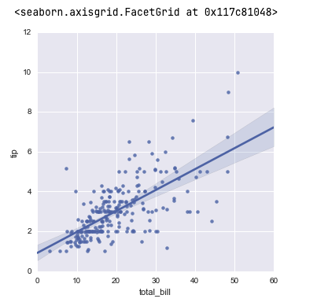
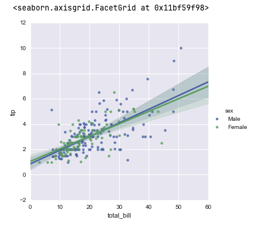
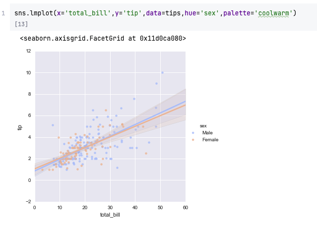
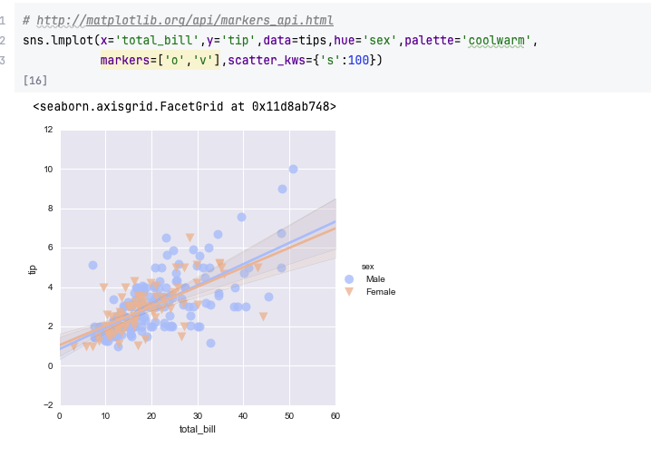
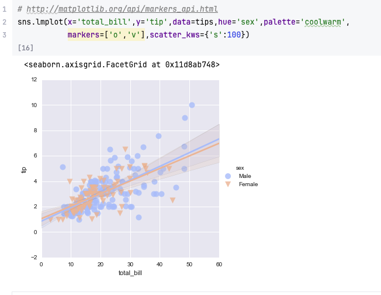
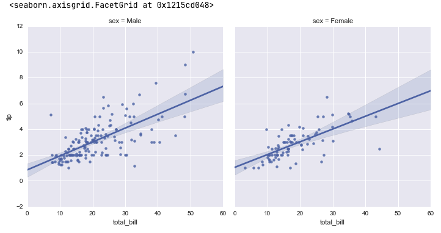
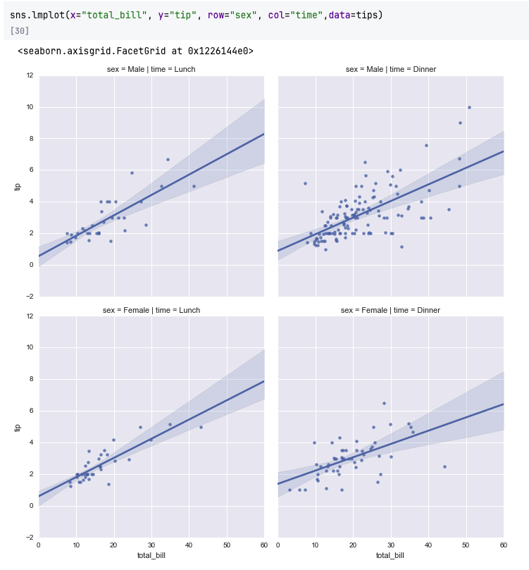
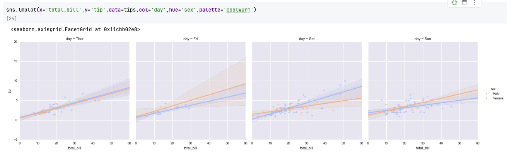
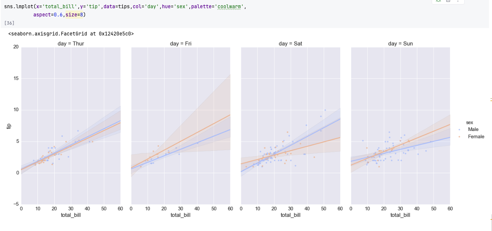

## Introduction to Regression Plots

Regression plots are a powerful way to visualize **relationships between two
continuous variables** and assess how well one variable can be **predicted**
from another. Seaborn simplifies this process with the `lmplot()` function,
which automatically combines a **scatterplot** with a **linear regression model
fit** (and confidence interval).

Although deeper statistical regression analysis will be covered later in the
**Machine Learning** module, this section focuses on using Seaborn’s regression
plotting tools for **exploratory data analysis (EDA)**.

---

## Getting Started with `lmplot()`

Let’s load the **Tips** dataset and create our first regression plot.

```python
import seaborn as sns
import matplotlib.pyplot as plt

%matplotlib inline

# Load sample dataset
tips = sns.load_dataset('tips')

# Simple regression plot
sns.lmplot(x='total_bill', y='tip', data=tips)
plt.title("Simple Linear Regression of Tip vs Total Bill")
plt.show()
```

**Output Explanation:**

- The **scatter points** show individual observations.
- The **blue line** represents the **linear regression fit**.
- The **shaded region** represents the **confidence interval (default 95%)** for
  the regression estimate.

This plot suggests a **positive linear relationship**: as the total bill
increases, the tip amount also tends to increase.



---

## Adding a Categorical Dimension — `hue` Parameter

We can use the `hue` parameter to separate the data by categories (e.g.,
gender).

```python
sns.lmplot(x='total_bill', y='tip', data=tips, hue='sex')
plt.title("Regression of Tip vs Total Bill by Gender")
plt.show()
```

**Output:** Two regression lines (one for each gender) appear in different
colors. This allows easy comparison of relationships across groups.



## 

## Customizing Markers

Seaborn supports Matplotlib marker customization. You can use the `markers`
parameter to define different marker styles for each hue category.

```python
sns.lmplot(
    x='total_bill', y='tip', data=tips,
    hue='sex', markers=['o', 'v']
)
plt.title("Custom Markers for Regression by Gender")
plt.show()
```

**Explanation:**

- `'o'` = circle
- `'v'` = triangle-down Marker symbols follow Matplotlib’s marker conventions.



---

## Adjusting Marker Size with `scatter_kws`

The `scatter_kws` dictionary allows you to pass parameters directly to the
**underlying Matplotlib scatterplot** used inside `lmplot()`.

```python
sns.lmplot(
    x='total_bill', y='tip', data=tips,
    hue='sex', markers=['o', 'v'],
    scatter_kws={'s': 100}   # marker size
)
plt.title("Increased Marker Size in Regression Plot")
plt.show()
```

**Output:** Larger, clearer data points for better visibility — especially
useful for presentations or dense datasets.


---

## Using Facet Grids — `col` and `row` Parameters

Instead of using color (`hue`) for differentiation, you can split data into
**multiple plots** using **facet grids**.

### Separate Columns by Category

```python
sns.lmplot(x='total_bill', y='tip', data=tips, col='sex')
plt.show()
```

**Output:** Two separate regression plots side by side — one for each gender.


---

### Separate by Both Rows and Columns

You can also facet by two categorical variables (e.g., `sex` and `time`):

```python
sns.lmplot(x='total_bill', y='tip', data=tips, col='sex', row='time')
plt.show()
```

**Output:**

- Columns → Gender
- Rows → Meal time (Lunch or Dinner)

Each subplot shows its own regression fit, making multi-level comparisons easy.



---

### Combining `col`, `row`, and `hue`

```python
sns.lmplot(
    x='total_bill', y='tip', data=tips,
    col='day', hue='sex'
)
plt.show()
```

**Output Description:** Each **day of the week** becomes a column, and
**gender** is represented by color. This type of plot can reveal daily
differences in tipping behavior — but beware of clutter when too many facets are
added.



---

## Adjusting Figure Size and Aspect Ratio

You can control the size and shape of each subplot using:

- `height`: Controls subplot **height** in inches.
- `aspect`: Controls the **width-to-height ratio**.

```python
sns.lmplot(
    x='total_bill', y='tip', data=tips,
    col='sex', height=6, aspect=0.8
)
plt.show()
```

**Explanation:**

- `height=6` → each facet is 6 inches tall
- `aspect=0.8` → width is 80% of height Adjusting these helps create readable
  plots for reports or presentations.



---

## Multiple Regression Options

Seaborn’s `lmplot()` supports more complex modeling with additional parameters:

| Parameter  | Description                                         | Example                 |
| ---------- | --------------------------------------------------- | ----------------------- |
| `order`    | Fits polynomial regression of given order           | `order=2` for quadratic |
| `ci`       | Confidence interval for regression line             | `ci=95` (default)       |
| `truncate` | Limits regression line within data range            | `truncate=True`         |
| `logistic` | Fits logistic regression instead of linear          | `logistic=True`         |
| `robust`   | Uses robust regression (less sensitive to outliers) | `robust=True`           |

Example — **Quadratic Regression:**

```python
sns.lmplot(x='total_bill', y='tip', data=tips, order=2)
plt.title("Quadratic Regression Fit")
plt.show()
```

**Output:** A curved regression line fitting non-linear data better than a
straight line.

---

## Understanding What Happens Internally

Under the hood:

- `sns.lmplot()` is a **wrapper** that combines:

  - `sns.regplot()` (for the actual regression and scatter plotting)
  - `FacetGrid` (for splitting data into subplots)

Thus, it offers both the **regression modeling power** of `regplot` and the
**faceting flexibility** of grid-based visualizations.

---

## Example — Multi-Facet Regression Grid

```python
sns.lmplot(
    x='total_bill', y='tip', data=tips,
    col='day', hue='sex',
    height=4, aspect=0.9,
    markers=['o', 's'],
    scatter_kws={'s': 70, 'alpha': 0.7}
)
plt.show()
```

**Output Insight:**

- Each column = Day of the week
- Colors = Gender
- Regression fits are computed separately for each combination.
- Alpha (transparency) helps when points overlap.

---

## Common Use Cases

1. **Visualizing linear relationships** between two variables.
2. **Comparing regression trends** across categorical groups.
3. **Identifying outliers** or deviations from the regression line.
4. **Faceted visualizations** for multi-level categorical comparisons.
5. **Preliminary regression insights** before formal statistical modeling.

---

## Summary

| Concept                 | Description                                                         |
| ----------------------- | ------------------------------------------------------------------- |
| **`sns.lmplot()`**      | Creates scatterplots with regression lines.                         |
| **`hue`**               | Adds color grouping for categorical variables.                      |
| **`markers`**           | Changes point symbols per category.                                 |
| **`scatter_kws`**       | Customizes marker size, transparency, and edge color.               |
| **`col` / `row`**       | Facets data into multiple plots.                                    |
| **`height` / `aspect`** | Adjusts subplot dimensions.                                         |
| **Advanced Fits**       | `order`, `logistic`, `robust`, and `truncate` control fit behavior. |

---

## Practice Questions

1. What is the main purpose of `sns.lmplot()`?
2. How can you visualize linear relationships for different categories (like
   gender)?
3. What’s the difference between `hue` and `col` in `lmplot()`?
4. How do you increase marker size in Seaborn’s regression plot?
5. What parameters would you use to create a 2×2 grid of regression plots for
   `sex` and `time`?
6. How do you make a curved regression line instead of a straight one?
7. What do `height` and `aspect` control?
8. How can you perform logistic regression using `lmplot()`?
9. Which parameter would you set to make regression less sensitive to outliers?
10. Which underlying Seaborn classes does `lmplot()` combine internally?

---

## Answers

1. To plot **scatterplots with regression fits** for exploring relationships
   between variables.
2. Use the `hue` parameter, e.g., `hue='sex'`.
3. `hue` colors points within the same plot; `col` creates separate subplots.
4. Use `scatter_kws={'s': size_value}`.
5. Use `col='sex', row='time'`.
6. Add `order=2` for quadratic regression.
7. `height` controls plot height; `aspect` controls width-to-height ratio.
8. Use `logistic=True`.
9. Use `robust=True`.
10. `lmplot()` combines **`regplot()`** and **`FacetGrid()`**.

---

✅ **Next Step:** Proceed to **Seaborn Style and Color Customization**, where
you’ll learn how to enhance the appearance of your plots using themes, color
palettes, and contextual scaling for professional-quality visualizations.
