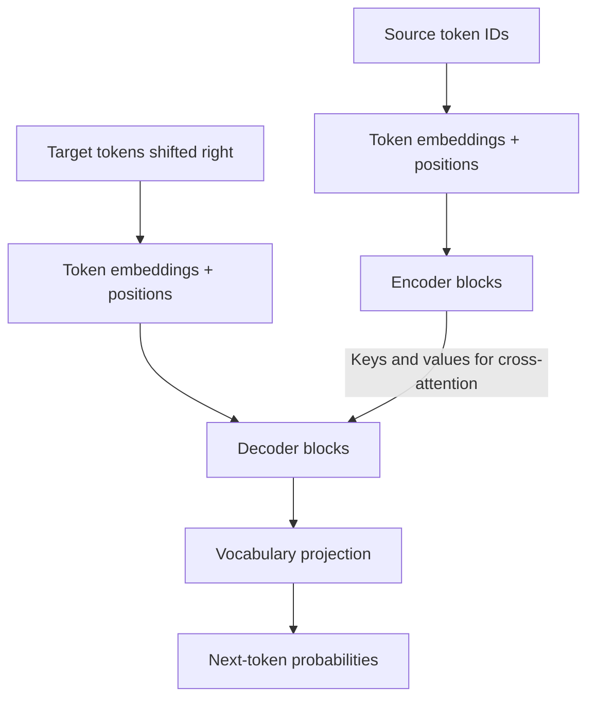
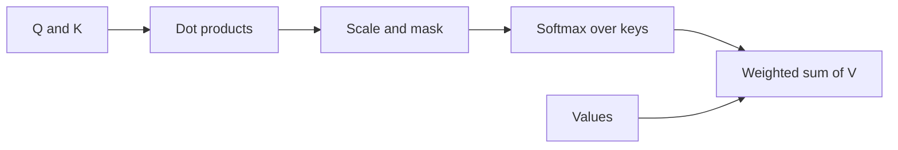
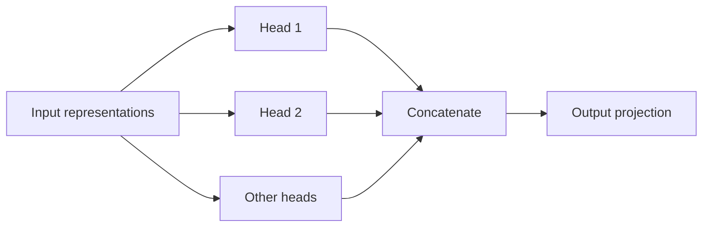
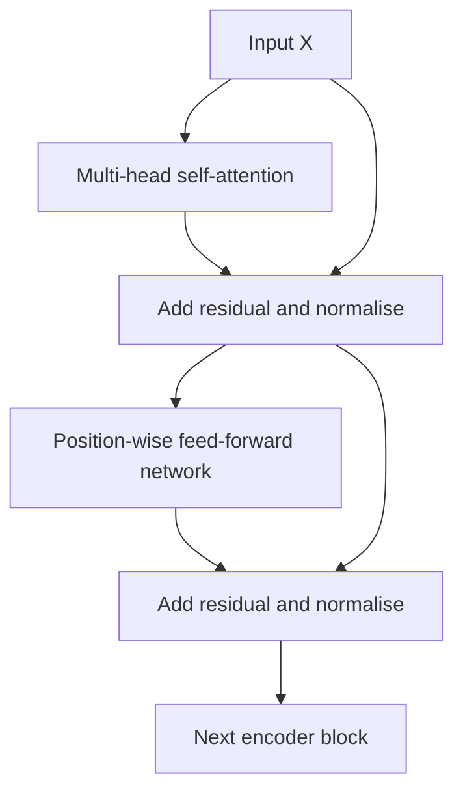
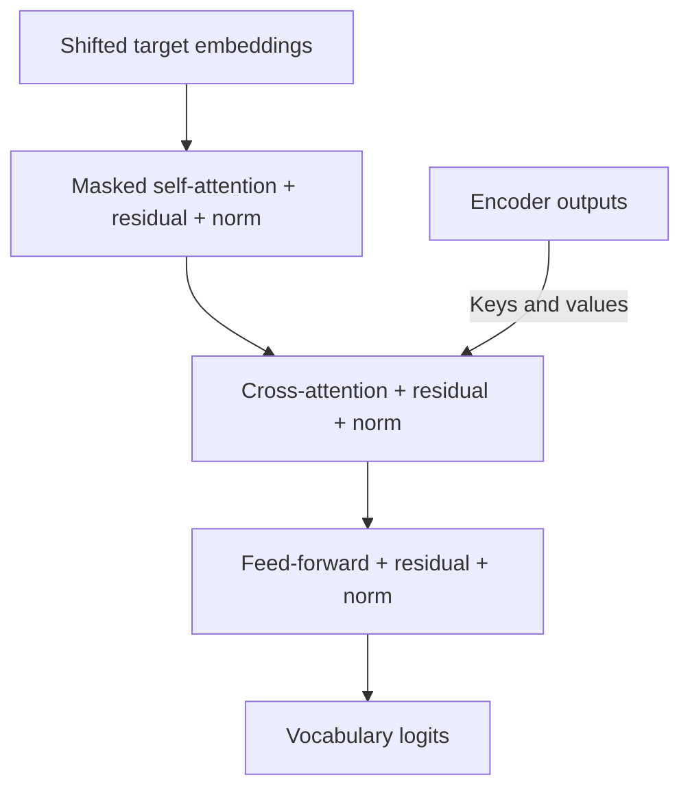

> **Source:** the supplied *TRANSFORMERS MASTERNOTE.pdf*, credited in the document to **@techyy_bandaa**. [Read the original PDF](#original-pdf) · <a href="/papers/daily/transformers-masternote.pdf" download>Download the original PDF</a>.

Study how tokens become contextual representations, how a Transformer generates text, and what changes when training or serving a large model.

This readable companion follows the document’s topic order. The PDF contains a cover and **15 numbered pages**; the numbered pages below refer to those printed numbers, so printed page 1 is PDF page 2. The original PDF is preserved in full. Notes marked **Correction** explain places where the scan simplifies a concept too far or contains an error.

## 1. Introduction to Transformers

*Source: printed page 1.*

A Transformer builds representations of a sequence using attention and feed-forward layers. In language tasks, the sequence consists of tokens representing words, word fragments, characters, or bytes. Attention lets one position use information from other positions without passing it through a chain of recurrent states.

The source uses “The cat sat on the mat” to illustrate context: predicting “mat” depends on the preceding words, and attention can connect the prediction position directly to those earlier positions.

### Why move beyond recurrent models?

| Model | How information moves | Main trade-off |
| --- | --- | --- |
| RNN | A hidden state is updated one step at a time | Long paths between distant tokens and difficult gradient propagation |
| LSTM | A recurrent state uses gates to retain or forget information | Better control of memory, but processing still depends on earlier steps |
| Transformer | Attention connects positions directly | Parallel computation during training, with substantial attention cost for long sequences |

Transformers are used for translation, summarisation, question answering, text and code generation, vision, speech, and multimodal tasks.

:::note Correction: parallel training versus sequential generation

Processing a known sequence can be parallelised across positions. Autoregressive generation still produces new tokens sequentially because the next token depends on the tokens already generated. A causal mask prevents a training position from accessing future tokens.
:::

## 2. Transformer architecture

*Source: printed page 2.*

The original Transformer has an **encoder** that reads the source sequence and a **decoder** that generates the target sequence. For example, the source’s translation illustration maps “The cat sits” to “Le chat est assis”.

The principal components are embeddings, positional information, multi-head attention, feed-forward networks, residual connections, and normalisation. Blocks are stacked to increase depth; the original base model uses six encoder blocks and six decoder blocks.

:::note Correction: block structure

The architecture sketch on printed page 2 is inconsistent with the later encoder explanation. An original encoder block has **two** main sublayers: self-attention and a feed-forward network. An original decoder block has **three**: masked self-attention, encoder–decoder cross-attention, and a feed-forward network. The diagrams below use that structure. See the [original Transformer paper](https://arxiv.org/abs/1706.03762).
:::

## 3. Tokenisation and input representation

*Source: printed page 3.*

Tokenisation maps text to a sequence of vocabulary entries. Each entry has an integer ID; an embedding table then maps those IDs to vectors.

| Representation | Example or role |
| --- | --- |
| Word tokens | “The cat is on the mat” becomes six word-level tokens |
| Subword tokens | A word such as “unbelievable” can be split into smaller vocabulary pieces; the exact split depends on the tokenizer |
| Character tokens | Each character is a token, producing longer sequences |
| Special tokens | Padding, unknown-token, sequence-boundary, or task markers, depending on the tokenizer |
| Token IDs | Integers used for embedding lookup; their numerical distance does not encode meaning |

BPE and WordPiece are subword approaches. SentencePiece is a tokenisation toolkit that can use different algorithms. The vocabulary and token-to-ID mapping must stay consistent between training and use; IDs such as `PAD = 0` are examples, not universal assignments.

An embedding table has shape $|V| \times d_{\text{model}}$. For a batch of $B$ sequences, each padded to length $n$, the embedded input has shape:

$$
X \in \mathbb{R}^{B \times n \times d_{\text{model}}}.
$$

With additive positional encoding:

$$
X = \operatorname{TokenEmbedding}(\text{IDs}) + \operatorname{PositionEncoding}.
$$

:::note Correction: vocabulary size and context

Character tokenisation normally has a **smaller vocabulary and longer sequences**, not the very large vocabulary shown in the source table. Also, a basic embedding lookup gives the same vector for the same token ID; the attention layers make representations depend on context.
:::

## 4. Positional encoding

*Source: printed page 4.*

Token order changes meaning: “dog bites man” and “man bites dog” contain the same words but describe different events. Positional information lets attention distinguish those orders.

The original sinusoidal encoding uses different frequencies across feature pairs:

$$
\operatorname{PE}(p,2i)=\sin\left(\frac{p}{10000^{2i/d_{\text{model}}}}\right),
\qquad
\operatorname{PE}(p,2i+1)=\cos\left(\frac{p}{10000^{2i/d_{\text{model}}}}\right).
$$

Here $p$ is the token position and $i$ indexes a sine/cosine pair. For $d_{\text{model}}=6$, the values are:

| Position | Dim 0 | Dim 1 | Dim 2 | Dim 3 | Dim 4 | Dim 5 |
| --- | --- | --- | --- | --- | --- | --- |
| 0 | 0.000 | 1.000 | 0.000 | 1.000 | 0.000 | 1.000 |
| 1 | 0.841 | 0.540 | 0.046 | 0.999 | 0.002 | 1.000 |
| 2 | 0.909 | −0.416 | 0.093 | 0.996 | 0.004 | 1.000 |
| 3 | 0.141 | −0.990 | 0.139 | 0.990 | 0.006 | 1.000 |

These values are recalculated from the formula; several entries in the source’s example table differ.

**Learned position embeddings** use a trainable lookup vector for each supported position. Relative-position methods instead represent relationships between positions; the notes name Transformer-XL and T5 as examples.

:::note Correction: what attention preserves

Unmasked self-attention without positional information is **permutation equivariant**: rearranging the input tokens rearranges the outputs correspondingly. It is not, by itself, permutation invariant. Sinusoidal encodings can be evaluated at new positions, but that does not guarantee accurate generalisation beyond the lengths used in training.
:::

## 5. Self-attention: queries, keys, and values

*Source: printed page 5.*

For each token representation, three learned projections produce a query, a key, and a value:

$$
Q=XW_Q,\qquad K=XW_K,\qquad V=XW_V.
$$

| Quantity | Purpose |
| --- | --- |
| Query, $Q$ | The information a position is looking for |
| Key, $K$ | The representation compared with queries to calculate relevance |
| Value, $V$ | The information combined using the attention weights |

In self-attention, all three come from the same sequence. A token can attend to itself as well as other permitted tokens. A causal or padding mask changes which positions are permitted.

For one head, $Q$ and $K$ have shape $n \times d_k$, and $V$ has shape $n \times d_v$, omitting the batch dimension. The source often writes $n \times d_{\text{model}}$; that is a simplified full-width example rather than the general per-head shape.

## 6. Scaled dot-product attention

*Source: printed page 6.*

$$
\operatorname{Attention}(Q,K,V)=
\operatorname{softmax}\left(\frac{QK^\top}{\sqrt{d_k}}+M\right)V.
$$

The source presents the unmasked case. Here $M$ makes the masking used later in the decoder explicit; it is zero for allowed positions and negative infinity for blocked positions.

1. Multiply $QK^\top$ to obtain pairwise scores.
2. Divide by $\sqrt{d_k}$ to control the scale of those scores.
3. Apply any mask before softmax.
4. Apply softmax over the **key positions** for each query.
5. Multiply the resulting weights by $V$.

Softmax is defined by:

$$
\operatorname{softmax}(s)_j=\frac{e^{s_j}}{\sum_k e^{s_k}}.
$$

Scaling matters because larger dot products can push softmax towards saturated probabilities and small gradients.

**The source’s one-key example:** let $Q=[1,0]$, $K=[1,0]$, $V=[2,3]$, and $d_k=2$. The score is $1/\sqrt{2}\approx0.707$. With only one available key, its softmax weight is 1, so the output is $[2,3]$. With multiple keys, the weights form a distribution across them.

## 7. Multi-head attention

*Source: printed page 7.*

Each head uses its own learned projections. Multiple heads let the model combine relationships from different representation subspaces.

$$
\operatorname{head}_i=\operatorname{Attention}(XW_i^Q,XW_i^K,XW_i^V),
$$

$$
\operatorname{MultiHead}(X)=\operatorname{Concat}(\operatorname{head}_1,\ldots,\operatorname{head}_h)W^O.
$$

The notes illustrate syntactic, local, long-range, and coreference relationships using a sentence about a cat chasing a mouse. These are possible learned behaviours, not fixed jobs assigned to particular heads. After concatenation, the output projection combines the head outputs into the model’s representation width.

## 8. Transformer encoder

*Source: printed page 8.*

An encoder returns one contextual representation for each input position. Its self-attention can use both earlier and later non-padding tokens.

The original post-normalisation block follows this flow:

“Identical layers” means repeated block structure; the layers generally have different learned parameters. Each block keeps the outer representation width $d_{\text{model}}$ unchanged, even though its feed-forward network expands the hidden dimension internally.

## 9. Transformer decoder

*Source: printed page 9.*

The original encoder–decoder model has three decoder sublayers:

1. **Masked self-attention:** uses the target prefix without looking ahead.
2. **Cross-attention:** uses queries from the decoder and keys/values from the encoder outputs.
3. **Feed-forward network:** transforms each position independently.

Each sublayer has a residual path and normalisation. A four-position causal mask is:

$$
M=\begin{bmatrix}
0 & -\infty & -\infty & -\infty\\
0 & 0 & -\infty & -\infty\\
0 & 0 & 0 & -\infty\\
0 & 0 & 0 & 0
\end{bmatrix}.
$$

During generation, start from the prompt or a beginning-of-sequence token, predict the next token, append it, and repeat until an ending condition is met. The notes illustrate this with `BOS → I → love → NLP → EOS`.

:::note Decoder-only models

A GPT-style decoder-only language model normally omits encoder–decoder cross-attention because it has no separate encoder. Its causal self-attention still sees both the prompt and the generated prefix.
:::

## 10. Feed-forward networks and normalisation

*Source: printed page 10.*

The original position-wise feed-forward network uses the same weights at every position:

$$
\operatorname{FFN}(x)=\max(0,xW_1+b_1)W_2+b_2.
$$

It expands from $d_{\text{model}}$ to $d_{\text{ff}}$, applies a nonlinearity, and projects back. The source’s example is $512\rightarrow2048\rightarrow512$.

| Component | What to remember |
| --- | --- |
| ReLU | $\max(0,x)$; used in the original Transformer FFN |
| GELU | $x\Phi(x)$; a smooth activation used in models such as BERT |
| Tanh | Outputs values between −1 and 1; not the original Transformer FFN activation |
| Residual connection | Adds the sublayer input to its output, providing a direct path for information and gradients |
| Layer normalisation | Normalises a token’s feature vector, with learned scale and shift |

$$
\operatorname{LN}(x)=\gamma\odot\frac{x-\mu}{\sqrt{\sigma^2+\epsilon}}+\beta.
$$

The mean and variance are computed across the token’s features. The source describes **post-norm**, where normalisation follows the residual addition. Pre-norm architectures place normalisation before a sublayer instead. Residual connections help optimisation; they do not guarantee that gradient problems disappear.

## 11. Training Transformers

*Source: printed page 11.*

### Forward pass, loss, and backpropagation

The forward pass maps tokens through embeddings and Transformer blocks to vocabulary logits. For next-token training, the target at each position is the following token. Cross-entropy rewards probability assigned to the correct targets:

$$
\mathcal{L}=-\frac{1}{N}\sum_{i=1}^{N}\sum_{v=1}^{|V|}y_{i,v}\log p_{i,v}.
$$

Here $N$ counts the training targets included in the loss; padding positions should be excluded. Backpropagation computes gradients through the projection, attention, feed-forward, and embedding layers.

### Optimisers and learning-rate schedules

The notes discuss Adam, AdamW, and SGD. Adam tracks running estimates of the gradient and its squared magnitude:

$$
m_t=\beta_1m_{t-1}+(1-\beta_1)g_t,\qquad
v_t=\beta_2v_{t-1}+(1-\beta_2)g_t^2.
$$

After bias correction, an Adam step is:

$$
\theta_t=\theta_{t-1}-\alpha\frac{\hat m_t}{\sqrt{\hat v_t}+\epsilon}.
$$

AdamW separates weight decay from the adaptive gradient update. Learning-rate warmup gradually raises the rate at the beginning; a decay schedule lowers it later. For the cosine-decay phase:

$$
\eta(t)=\eta_{\min}+\frac{\eta_{\max}-\eta_{\min}}{2}\left(1+\cos\frac{\pi t}{T}\right).
$$

Here $t$ starts at the beginning of the decay phase and $T$ is its duration. The source also mentions label smoothing as a regularisation option. Neither cosine decay nor label smoothing is a universal requirement.

### Teacher forcing

During teacher-forced training, the decoder receives the correct preceding target tokens, shifted right. During ordinary generation, it receives its own generated prefix. The causal mask permits parallel training on the known target sequence without leaking the token being predicted.

## 12. Pre-training and fine-tuning

*Source: printed page 12.*

| Concept | Role |
| --- | --- |
| Pre-training | Learns broadly useful representations or prediction behaviour from a large corpus |
| Self-supervised learning | Derives training targets from the data, such as hidden words or subsequent tokens |
| Fine-tuning | Adapts a pre-trained model to a task or domain by updating some or all trainable parameters |
| Transfer learning | Reuses knowledge or representations learned on one task for another |
| Parameter-efficient tuning | Adapts a limited set of parameters, for example with LoRA or adapters |

The source’s masked-language example is “The `[MASK]` is great”, with “cat” as the hidden training target. BERT-style masked prediction and GPT-style next-token prediction construct supervision differently.

A task-specific model might classify text, answer questions, translate, or summarise. Fine-tuning often uses labelled examples, but continued pre-training on domain text can also be self-supervised. Pre-training need not happen only once in a model’s lifetime.

## 13. BERT, GPT, and Transformer variants

*Source: printed page 13.*

| Family | Architecture | Main learning idea | Typical use |
| --- | --- | --- | --- |
| BERT | Encoder-only | Masked-token prediction using left and right context | Classification, extraction, and contextual representations |
| GPT | Decoder-only | Causal next-token prediction | Text and code generation |
| T5 | Encoder–decoder | Text-to-text training, including a denoising objective | Translation, summarisation, and other text-to-text tasks |
| RoBERTa | Encoder-only | Revises the BERT training recipe, including dynamic masking and removing next-sentence prediction | Language understanding tasks |
| ALBERT | Encoder-only | Parameter sharing and factorised embeddings | Reducing parameter requirements |
| DistilBERT | Encoder-only | Knowledge distillation | A smaller model for language understanding |
| ELECTRA | Encoder-only discriminator | Detects replaced tokens | Learning representations from a different pre-training objective |
| DeBERTa | Encoder-only | Disentangled content and position attention | Language understanding |

Architecture is a starting point for choosing a model; task performance, training data, inference cost, and evaluation still matter. These examples describe model families rather than a ranking of current products.

## 14. Transformers in LLMs and generative AI

*Source: printed page 14.*

The notes connect Transformer layers to a language-model head that produces next-token logits. Generation repeatedly turns those logits into a token choice and extends the sequence.

- **Temperature** changes how concentrated the sampling distribution is.
- **Top-k sampling** limits the candidate set to the highest-probability tokens.
- **Top-p sampling** uses a candidate set whose cumulative probability reaches a threshold.
- **Zero-shot prompting** supplies a task without examples; **few-shot prompting** adds examples.
- **System instructions** set application behaviour. The source also lists prompts requesting step-by-step explanations.

Applications include chat, summarisation, translation, question answering, code generation, search, retrieval-augmented generation, and creative writing.

### Context windows

The context window limits how many tokens the model can process in a request. For many decoder-only systems, the prompt and generated output must fit the model’s supported budget, with separate output limits possible.

The PDF lists example context lengths for GPT-3.5, GPT-4, Claude, and Llama 3. Treat those as examples from the document, not current product specifications; limits depend on the exact model version and serving configuration.

:::note Correction: retrieval does not enlarge the context window

RAG selects external information to place into the available context. It does not change the model’s architectural token limit. A longer supported context also does not guarantee that the model will reliably use every detail in that context.
:::

## 15. Advanced Transformers and interview concepts

*Source: printed page 15.*

### KV cache

A decoder can store previous tokens’ keys and values for each layer and reuse them while generating the next token. This avoids recomputing those projections for the entire prefix.

:::note Correction: the cache trades memory for computation

The PDF says the KV cache saves memory and compute. Caching saves repeated computation but **consumes memory**, and that memory grows with sequence length, batch size, layer count, and the number and size of cached heads. It is different from storing the full attention-score matrix.
:::

### Attention complexity and FlashAttention

For dense attention, the pairwise computation costs $O(n^2d)$, and materialising the attention matrix takes $O(n^2)$ space per head. Projection and feed-forward costs are separate.

| Approach | Main idea | Important qualification |
| --- | --- | --- |
| Standard dense attention | Computes every permitted query–key interaction | Pairwise cost grows quadratically with sequence length |
| FlashAttention | Tiles the exact computation and reduces transfers to and from GPU memory | Avoids storing the full attention matrix, but dense pairwise computation remains quadratic |
| Sparse or sliding-window attention | Restricts which positions attend to which others | Reduces connections and changes the attention pattern |
| Linear-attention methods | Reformulate or approximate attention to avoid the full pairwise matrix | Not generally identical to ordinary softmax attention |

The source’s “2–4× faster” statement for FlashAttention is a performance example, not a guarantee across hardware, sequence lengths, or implementations.

### Long context, experts, and quantisation

The notes introduce RoPE, ALiBi, sparse/sliding attention, and scaling approaches such as LongRoPE and YaRN. These are different techniques for representing position or handling longer sequences; extending usable context requires evaluation beyond simply accepting a longer input.

In a **mixture-of-experts** model, a router selects a subset of expert networks for each token. Sparse activation can increase total parameter capacity without activating every expert on every token. Routing, load balancing, and communication introduce their own costs.

**Quantisation** stores or computes selected tensors at reduced precision. Nominal weight-storage ratios relative to FP32 are:

| Format | Bytes per weight, before overhead | Nominal reduction |
| --- | --- | --- |
| FP32 | 4 | 1× |
| FP16 | 2 | 2× |
| INT8 | 1 | 4× |
| INT4 | 0.5 | 8× |

These ratios do not describe total application memory or guaranteed speedups. Scales, higher-precision tensors, activations, and caches also use memory. The notes list post-training quantisation, quantisation-aware training, GPTQ, and AWQ; accuracy and speed need to be measured for the chosen method.

Other optimisation topics in the source are mixed precision, gradient accumulation, gradient checkpointing, optimiser choice, and efficient attention. Gradient accumulation increases the effective batch size across steps; checkpointing saves activation memory by recomputing some forward operations during backpropagation.

### Revision checklist

Use the source’s interview prompts to check whether you can explain:

- [ ] Why token order needs positional information.
- [ ] How queries, keys, values, scaling, softmax, and masking fit together.
- [ ] Why an encoder, an encoder–decoder decoder, and a decoder-only model differ.
- [ ] What feed-forward layers, residual connections, and layer normalisation contribute.
- [ ] How teacher-forced training differs from autoregressive generation.
- [ ] When BERT-style, GPT-style, and T5-style architectures are useful.
- [ ] Why KV caching uses memory while saving computation.
- [ ] How FlashAttention improves memory efficiency without eliminating dense attention’s quadratic pairwise work.
- [ ] What sparse experts, quantisation, and long-context methods trade off.
- [ ] How to verify a claimed optimisation with memory, latency, and quality measurements.

For a deeper treatment, see the existing [Attention Is All You Need notes](/docs/research-papers/transformer).

## Original PDF

The complete 16-page scan is available below, including the cover, original diagrams, examples, and handwritten notes.

<a href="/papers/daily/transformers-masternote.pdf" target="_blank" rel="noreferrer">Open the original PDF in a new tab</a>{' · '}<a href="/papers/daily/transformers-masternote.pdf" download>Download PDF</a>

<iframe src="/papers/daily/transformers-masternote.pdf#view=FitH" title="Transformers Masternote original PDF" loading="lazy" style={{width: '100%', height: '75vh', minHeight: 380, border: '1px solid var(--border-subtle)', borderRadius: 12}} />

If the PDF viewer is unavailable on your device, use the open or download link above.
