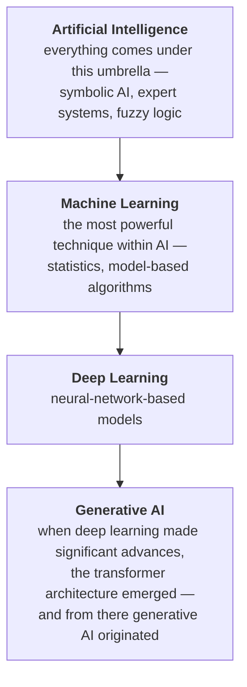
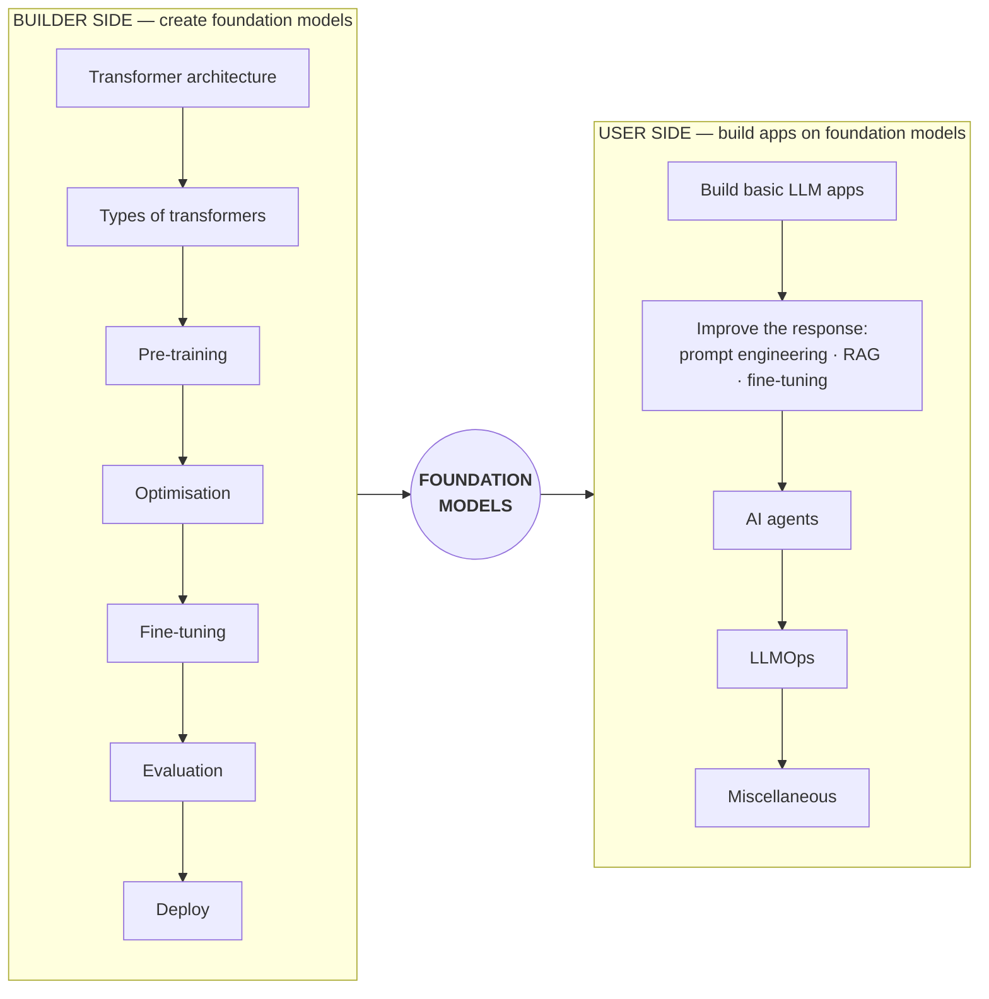

> **Video 1 of 21** · [Watch on YouTube](https://www.youtube.com/watch?v=pSVk-5WemQ0)
> Notes follow the video section by section.

## Why this video exists

Generative AI is a rapidly evolving technology. Every day brings a new model, a new research paper, a new tool. That makes curriculum design genuinely hard for a teacher — what you plan today is stale next month.

This video is the output of three months of research and planning. It is not an announcement video. It shares the whole thought process: how the plan was made, what the curriculum looks like, and the reasoning behind it.

## Why you should study generative AI

### What is generative AI

> Generative AI is a type of AI that creates new content — such as text, images, music and even code — by learning patterns from existing data, mimicking human creativity.

Some background makes that definition land better.

Work on AI has been going on for 60–70 years. Generations of brilliant people have given their all to the field, and many techniques emerged along the way:

- **Symbolic AI** — very popular in the 1980s, used to build expert systems
- **Fuzzy logic**
- **Evolutionary algorithms**
- **NLP** — worked on as its own field
- **Computer vision** — worked on as its own field

But the technique that created the most impact was **machine learning**.

In machine learning you feed a mathematical or statistical system a lot of data, and the goal is to extract statistics so that when you give it new data it can make predictions. That simple idea was so powerful that it is still relevant — ML jobs are still very much in the market today.

With ML you could build three or four kinds of model:

- **Regression** — predict a number. For example, the stock price of a company tomorrow.
- **Classification** — predict one of a given set of categories. Show the model a photo, it predicts cat or dog.
- **Ranking** — given a product, rank the most similar products and show them. Recommendation systems.

But machine learning was **never** used for problem statements where human creativity was required. That is what generative AI changed.

**The biggest differentiator of generative AI:** it can create new text, new images, videos, even code.

Two or three years ago people used to say that no matter how strong the systems you build, AI is not going to replace human creativity — at least not yet. Within two years of generative AI arriving, that statement has become completely false. Human creativity can now be mimicked very easily. That is the superpower.

### Where generative AI fits in the AI landscape

You have probably seen this diagram somewhere. It is a very good mental model for tracking the whole history.

AI at the outermost, machine learning within it, deep learning within that, and finally generative AI within that.

## Impact areas

There are many areas where generative AI has contributed, but four stand out.

### 1. Customer support

Customer handling was a big challenge for every large company. More customers means more queries and more complaints. The old solution was to set up call centres and have employees handle queries over phone or chat. That is a very costly model — businesses invested a lot of money there unnecessarily.

Now the first level is a chatbot, and human executives handle what the chatbot cannot. Where you used to need ten people for customer handling, two or three may now be enough. Gradually the entire industry is adopting this model: a first layer of chatbots, then a customer support team behind it.

### 2. Content creation

It was said AI would not be coming here. But it was obvious generative AI would make inroads, because generating content is exactly what it does.

Take content in any form — text-based like blogs and websites, or video-based. Generative AI tools have arrived and are helping a lot. Today, if you read an article on Medium, you cannot be 100% sure whether a human or an AI wrote it. The output is that good.

### 3. Education

The way you study has changed in the last two years, since tools like ChatGPT arrived. Planning a curriculum, getting unstuck on a problem, generating practice questions on a topic — it is like having a personal tutor with you all the time.

Even schools are having to think about how they should implement educational methods going forward.

### 4. Software development

Until now software development was considered a job requiring very intelligent people, because writing code takes creativity and intelligence. But apparently generative AI models are really, really good at writing code — and not just code, but good, production-ready code.

Where you used to need five programmers, there is a good chance two or three can handle the task.

## Is generative AI a successful technology?

Before you spend time on any technology, you should be sure it is worth studying.

For reference, compare against two other technologies from the same lifetime. One is **the internet** — probably the most successful technology of the era. The other is **blockchain and crypto** — a technology that has not yet reached its full potential.

Where does generative AI fall on that spectrum? If it leans toward the internet side, it is on its way to success. If it leans toward the crypto side, it is not.

Here is the series of questions. If the answers are yes, the technology is successful.

### 1. Is it solving real-world problems?

**Internet:** yes. Earlier we wrote letters to relatives with a turnaround time of 15 days. We physically went to the bank to transact, to the railway station for tickets, to shops for goods. After the internet you do all of it from your phone, sitting at home.

**Crypto:** no concrete, popular example comes to mind.

**Generative AI:** yes. Customer support at scale is a problem companies across the world were troubled by, and it is getting solved. Education — everyone has easily got their own personal tutor.

### 2. Is it useful on a daily basis?

Yes. The tools exist, you will use them daily, and you will benefit.

### 3. Is it impacting world economics?

Consider the news the day this was recorded: a new AI model arrived from China — **DeepSeek R1** — and just because of its arrival, roughly **a trillion dollars** was wiped off the stock value of US-based tech companies. That is roughly 80 lakh crores.

If the arrival of a single AI model can create that impact on another country's stock market, the answer does not need arguing.

### 4. Is it creating new jobs?

This is slightly controversial, because it will occur to you that many jobs will be lost. That is not the point being discussed — this is strictly a technical view.

After generative AI arrived, a completely new job emerged: the **AI Engineer**. The number of these roles increases every day. Check job sites over time and you will see demand for this role rising. There is a good chance that within five years it will be as common a role as software developer or web developer.

### 5. Is it accessible?

Yes. You can operate these tools easily — and so can your parents, because you do not need to write code. You generate responses by speaking in English or Hindi.

**All five answers are yes.** Generative AI is on its way to becoming a successful technology. It is on the internet's path, not crypto's. And since it has only just arrived and has not yet reached its full potential, those working with it when it does will benefit greatly.

## Why the videos were delayed

Three reasons.

1. **Doubts about the technology.** It is new — it became very popular within two years. Was it a really powerful technology, or a bubble everyone was hyping?
2. **Time commitment.** Other things were going on, so time could not be allocated.
3. **Intimidation by the pace.** Every day something new: a new model, a new tool, a new paper, a new term. Development was happening so fast it was unclear what to study and where.

Problems 1 and 2 got solved — the doubts went away after a lot of reading, and time freed up. Problem 3 remained.

### Problem 3, in detail

- The technology grows very fast, so a lot of advancements happen daily, and tracking them and extracting meaning from them is challenging.
- People constantly create a **FOMO environment** — *"if you have not studied GenAI, what are you doing?"* — which is demotivating.
- There is no single source of truth, because the technology is still new.

To teach GenAI effectively, the first step is a good curriculum. Because of these reasons, even a good curriculum was hard to create. So the problem had to be solved first: build a mental model that eases the information overload, then design the curriculum from it.

## The mental model

The first step in building the model was finding **one term to place at the centre**. Among all the terms and tools in generative AI, is there one that everything else can be organised around?

The answer is yes: **foundation models**.

### What foundation models are

Foundation models are a type of AI model that is:

- **Very large scale.** To train them you need a huge amount of data — literally as much data as there is on the internet.
- **Expensive to train.** A lot of hardware, many GPUs. It costs crores of rupees.
- **Generalised, not specialised.** This is the biggest feature.

That last point is the key. If you have built models in machine learning, you know they are **task-specific**. A model that predicts a company's stock price on a future date can only do that. It will not also predict cricket scores.

Foundation models are generalised — they can do more than one thing, solve more than one task. This happens because the architecture is very large with a great many parameters, and because you give it a lot of data. Basically you are teaching a lot of books to a person with a very intelligent mind, so obviously he can solve problems in more than one domain.

**LLMs are a very good example.** Pick up any LLM today and you can make it solve many kinds of problem: text generation, sentiment analysis, summarisation, question answering. All because in the process of training it — a very large model with many parameters, given the entire internet's data — it not only learned to predict the next word, it simultaneously learned sentiment analysis, question answering and summarisation.

Foundation models are not only LLMs. They also include **LMMs** — large multimodal models — which work not just with text but with images, videos and sound. That is why the centre says "foundation models" rather than "LLMs". If you want to simplify, you can read LLM instead.

### The two sides

With foundation models at the centre, the whole of generative AI divides into two parts. You are doing one of two things:

- **Using** foundation models — the user perspective. You take a ready-made foundation model and build your work on it.
- **Building** foundation models — the builder perspective. As a large company you create these models and deploy them.

Any term you hear, any tool, any terminology, will be from one of these two perspectives.

### The sorting game

After building the model, the habit became a game. Whenever a new term appeared, the first question was: does this go to the user side or the builder side? Go and ask ChatGPT what it is, then decide from the description.

Try it:

| Term | What it is | Side |
|---|---|---|
| **Prompt engineering** | You have an LLM, you talk to it in English, and you refine your question so you get a better answer | **User** — you are using a pre-built LLM |
| **RLHF** | Reinforcement learning with human feedback; modifies an LLM's behaviour and safeguards it so it does not say anything absurd | **Builder** — used in the process of building LLMs |
| **RAG** | Have a given LLM answer questions on your own documents | **User** — again using a pre-built LLM |
| **Pre-training** | Take a foundation model and train it by feeding it data from all over the world on big hardware | **Builder** — it is the process of creating an LLM |
| **Quantisation** | Optimise a model so you can run it in different environments | **Builder** |
| **AI agents** | Use an LLM to create software that not only answers questions but performs tasks, like booking tickets | **User** — something you create with the help of LLMs |
| **Vector databases** | Useful when implementing RAG | **User** |
| **Fine-tuning** | Adapting a model to a task or domain | **Both** — you fine-tune both while creating an LLM and while using one |

Doing this for six to eight months produced a curriculum with two aspects, each with its own path.

## The builder-side curriculum

This side is more technical, and will feel more relevant if you have come from machine learning and deep learning.

**Prerequisites.** Before starting you should know:

- Fundamentals of machine learning
- Fundamentals of deep learning
- A deep learning framework — TensorFlow or PyTorch both work, **PyTorch preferred**

### 1. Transformer architecture

Any foundation model today is based on the transformer architecture, so this is where it starts. You should know it very well:

- What happens on the encoder side
- What happens on the decoder side
- What embeddings are
- How self-attention works
- How layer normalisation works
- The concept of language modelling

### 2. Types of transformers

Multiple types exist and you should have an idea of each:

- **Encoder-only** transformers — you should know BERT's architecture
- **Decoder-only** transformers — you should know GPT's architecture
- **Encoder-decoder** transformers
- Some other famous transformers

### 3. Pre-training

The part where you actually train foundation models. A lot to study here:

- **Training objectives** — different foundation models are trained with different objectives
- **Tokenisation strategies** — especially if you are working with LLMs
- **Training strategies** — training on your own machine, on the cloud, on a single machine, distributed training across multiple machines
- **Challenges** — there can be thousands of challenges in training a model at this scale, and you should know them and their solutions

Then **evaluation** — once pre-training is done, you evaluate the model to check how well it went.

### 4. Optimisation

Foundation models are very large and mostly cannot run on normal hardware, so you optimise them:

- Optimisations within the training process
- Compressing the final model — **quantisation**, **knowledge distillation**
- Reducing the time it takes to get predictions — inference optimisation

### 5. Fine-tuning

A foundation model is trained on a large dataset and is generalised — it can do many tasks. Then, according to your need, you fine-tune it for a particular task or type of task so its performance there is enhanced.

- **Task-specific tuning**
- **Instruction tuning**
- **Continued pre-training** — pre-train a little more in a particular domain
- **RLHF**
- **PEFT** — a very famous technique

### 6. Evaluation

Once fine-tuned, apply thorough evaluation techniques before implementing in a domain. This is where LLM leaderboards come from — when you hear that one model beat another, this module is where that decision-making happens, evaluating on different metrics.

### 7. Deploy

The last but very important step. If you cannot deploy them, the rest does not matter.

## The user-side curriculum

**Disclaimer in advance:** this side feels less technical and easier. Creating foundation models is obviously harder than using them. This side will also probably be more fun, because you get to create a lot of interesting things.

### 1. Build basic apps using LLMs

First learn what types of foundation model are available:

- **Closed source** — learn to use them through **APIs**
- **Open source** — learn to use them through different tools. **Hugging Face** is a library you can use to load and run an LLM on your machine; **Ollama** lets you run an LLM on your machine or your server

Then learn a framework like **LangChain** to create LLM-based applications.

### 2. Improve the response from the LLM

Three techniques:

- **Prompt engineering** — the art and science of writing prompts. The input you send to a foundation model is a prompt. Handle prompts correctly and you improve the response. A lot of work has been done here.
- **RAG** — LLMs train on their own data and know nothing about yours. With RAG you can show your private data to an LLM and have it answer questions from it. RAG is itself a huge field of study.
- **Fine-tuning** — happens here as well as on the builder side. What you study on the builder side is more technically advanced, going into deeper layers. Here you do it at a shallower level.

### 3. AI agents

A huge field of study emerging right now. Mostly LLM applications are used to build chatbots — with agents you can create chatbots that also perform tasks.

For example: you are having a conversation asking about the best tourist destinations in India, and the chatbot says Goa. You can then say *"book a hotel for me there"* and it will. That is the difference between a chatbot and an AI agent. What you are doing is providing the agent with **tools** so it can access them and get work done.

### 4. LLMOps

You are building applications for customers and clients, so you need to deploy them. Everything you do in deployment — evaluations, improvements, technical handling — is combined under the umbrella term **LLMOps**. Many libraries now exist to help here, and it is emerging as an important field.

### 5. Miscellaneous

Working with multimodal foundation models — most of the discussion so far revolves around LLMs, but what if the model works on audio input, or gives you video input and output? **Stable diffusion** and diffusion-based models also go here.

## Who works on which side

**Builder side** — building a foundation model and deploying it is the work of a **research scientist** or **data scientist**, with some **machine learning engineering** and **LLMOps** skills needed.

**User side** — anyone can do this. If you know even a little software development, you can operate at 80–85%. You are given a foundation model and you build an application on top of it.

But the person you should want to be has a good idea of the builder side too — they know how foundation models are built. That knowledge matters, because with it you operate better on the user side.

A software developer can easily build AI applications today. Someone who has knowledge of **both** fields will always be able to demand a better salary.

It depends on your goal: focus more on the user side if you want to build, more on the builder side if you want to be a research scientist. But **if you want to become an AI Engineer, you have to work on both fields in parallel.**

## How the curriculum will be covered

Both sides in parallel, since there is not much overlap.

**Builder side plan.** The transformer architecture is already covered in detail in the deep learning playlist. Next: encoder-only, decoder-only and encoder-decoder transformers. Then a separate playlist on pre-training, another on fine-tuning, another on deployment. The idea is not one big playlist but small playlists covering modules one by one.

**User side plan.** Similar. First a playlist on building basic LLM applications, then gradually prompt engineering, RAG and fine-tuning.

## Why not a paid course

An honest answer. Over the last year there have been countless messages, emails and comments asking for a generative AI course, and several ed-tech companies have made approaches. It was a huge earning opportunity.

The reason for declining: the technology has not been mastered 100% yet. Launching a paid course without that would not justify its price, and would give a subpar experience. YouTube reaches a wide audience, feedback comes in, and improvement follows. The goal right now is to understand this technology in and out, learn it, and teach it. A paid course may come in the future.

## Timeline

Hard to estimate, because the content does not exist yet — so it is flexible. The goal is **two to three videos a week**, with one being a long video covering a lot.

A rough timeline for the entire curriculum, both sides: **about a year**. That is not a lot, by the way — it would take at least a year for anyone to master this whole thing.

## Checklist

- [ ] I can state the definition of generative AI and what makes it different from classical ML
- [ ] I can draw the AI → ML → DL → GenAI diagram
- [ ] I can name the four impact areas
- [ ] I can run the five-question test for whether a technology is successful
- [ ] I can explain what a foundation model is and why it sits at the centre
- [ ] I can sort a new term into builder side or user side
- [ ] I can list the seven builder-side modules and the five user-side modules
- [ ] I know which side I am optimising for, and the prerequisites for it
