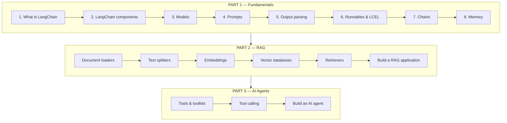

> **Video 2 of 21** · [Watch on YouTube](https://www.youtube.com/watch?v=_3ezSpJw2E8)
> Notes follow the video section by section.

## Recap of the previous video

The previous video covered the generative AI curriculum. The whole of generative AI divides into two parts:

- **Builder side** — you develop foundation models
- **User side** — you use those foundation models to build your applications

Both curricula were shown. On the builder side: transformer architecture, types of transformers, pre-training, fine-tuning, optimisation. On the user side: first learn to build LLM-based applications, then three methods to improve the response from an LLM — prompt engineering, RAG and fine-tuning — then agentic AI, LLMOps and some miscellaneous topics.

**LangChain falls under the user side**, in that first block: learning to build LLM-based applications. That is the starting point in the user-side curriculum, and the rest gets covered gradually afterwards.

## What is LangChain

In very simple words, LangChain is a framework with which you can build any LLM-based application — chatbots, agents and so on.

> LangChain is an open-source framework that helps in building LLM-based applications. It provides modular components and end-to-end tools that help developers build complex systems like chatbots, question-answering systems, RAG-based applications, autonomous agents and much more.

## Five core features

These are the reasons LangChain became so popular, and why you should learn it.

### 1. Supports all major LLMs

Whether open source or closed source, it does not matter. LangChain has integrations for every LLM — OpenAI's GPT models, Anthropic's Claude models, Google's models, and more.

### 2. Simplifies developing LLM-based applications

There are some very interesting things in LangChain that make building easy. For example, the concept of **chains**, with which you can create very complex applications.

### 3. Integrations available

While building an LLM-based application you have to connect with many tools — your database, a remote data source, a deployed service. LangChain has written wrappers for these, so you can connect easily without writing a lot of boilerplate code.

### 4. Free and open source

A big reason behind the adoption. LangChain is a free, open-source package and is being actively developed. Within one or two years three different versions have been released, and new components are added regularly.

### 5. Supports all major GenAI use cases

LangChain helps you create all kinds of applications — chatbots, agents, RAG-based applications. It is an all-rounder.

## Why LangChain is taught first

Looking at the whole user-side curriculum, there are many things to learn. LangChain is a good starting point because **studying it gives you a taste of everything else**:

- You can work with both open-source and closed-source LLMs
- You can work with LLM APIs, integrate with Hugging Face, integrate with Ollama
- You get a taste of prompt engineering
- You can develop RAG applications
- You can build AI agents
- You even get a flavour of LLMOps

So by learning LangChain you get a complete, holistic view of the entire user-side landscape — you learn to work a little on everything.

Once LangChain is complete, the plan is to revisit these topics in depth: a full playlist on prompt engineering, then a full playlist on RAG and advanced RAG techniques. Take a holistic view first, then cover each thing in detail separately.

## The playlist curriculum

The playlist divides into three parts.

**Part 1 — Fundamentals.** The most important part; without it the rest will not make sense.

**Part 2 — Building RAG applications.**

**Part 3 — Building AI agents.**

The plan is around **17 videos**, though one or two may be added over time.

## Focus areas for the playlist

Four things this playlist tries to do.

### 1. The most up-to-date information

LangChain currently has three versions, and they are quite different from each other. If you learn v0.1 it is possible you will not understand many things in v0.3. The goal is to deliver the latest — **the entire playlist is based on LangChain v0.3** — with some guidance about the earlier versions along the way.

### 2. Clarity

A lot of LangChain content online has a common problem: you can code along, copy it, and your application will run — but you have no conceptual clarity about how the thing is actually working. This playlist tries to give a behind-the-scenes look. That is why, even though there are 17 videos, each is likely to run 30–40 minutes.

### 3. Conceptual understanding

LangChain is a practical thing — a framework that helps you build applications. But it also has concepts, like runnables and chains. Explaining those matters, because tomorrow if v0.4 arrives instead of v0.3, you will not have much trouble learning it.

### 4. Around 80% coverage

Not 100%, because not all of it is useful. The focus is the most useful 80%. If something else becomes important later, the playlist gets updated.

## Timeline

Starting within a day or two. **Two videos per week**, 17 videos total — so roughly **eight weeks**, about two months.

It will not be faster than that, because the PyTorch playlist continues on the channel and the builder side has to be covered too. Two videos a week also gives you some time to practise.

## Checklist

- [ ] I know where LangChain sits in the user-side curriculum
- [ ] I can state the definition of LangChain
- [ ] I can name the five core features
- [ ] I can explain why LangChain is a good first topic
- [ ] I know the three parts of the playlist and what each covers
- [ ] I know the playlist targets LangChain v0.3
