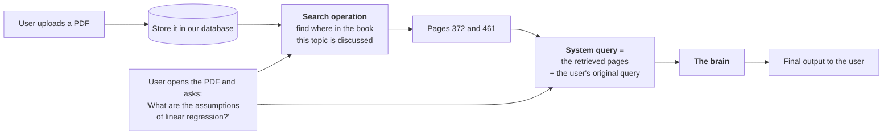
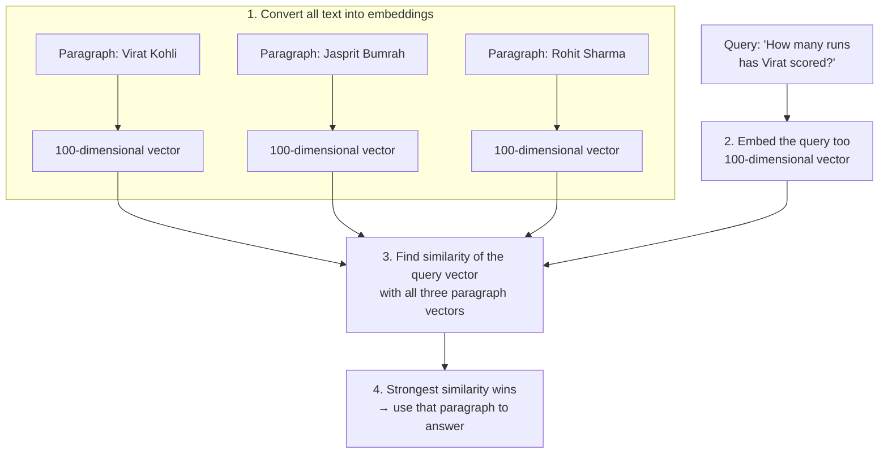
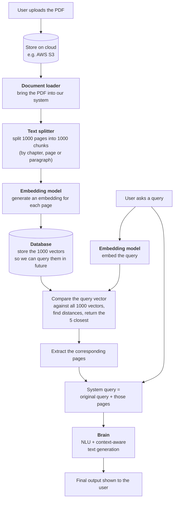

> **Video 3 of 21** (playlist video 1) · [Watch on YouTube](https://www.youtube.com/watch?v=nlz9j-r0U9U)
> Notes follow the video section by section.

## What is LangChain

> LangChain is an open-source framework for developing applications powered by LLMs.

If you want to build any LLM-based application, the framework that helps you build it is LangChain.

You will not understand its importance from that single sentence. Whenever you study anything, you should first understand **why that thing was needed**. If you want to study what X is, you should know why X was needed in the first place. So the rest of this video takes a long way round to prove the point — and by the end you will have a deep perspective on how important LangChain really is.

## Why do we need LangChain?

### The idea, from 2014

Around 2014–2015 smartphones had become common and people had started reading PDFs a lot, where earlier they read more books. That led to an idea: what if you build an application where anyone can upload their PDFs and read them — and not only read them, but **talk** to them?

Say you upload a machine learning book covering all of machine learning. You could:

- Ask *"explain page number five as if I am a 5-year-old child"* and get a very simplified version
- Ask *"generate some true/false questions on the linear regression we just read, so I can practise"*
- Ask *"generate notes on this decision tree chapter"*

Incredibly useful, because you are not only reading — you are able to talk to your book.

## High-level design

Let us discuss at a high level how such an application would work.

### Two kinds of search

**Keyword search.** You take the words — "assumptions", "linear regression" — and search for them throughout the book. Wherever those words appear, you pull up those pages.

This is inefficient. You need contextual results about the assumptions of linear regression, but what happens is that many more pages come up. The word "assumptions" may appear on many pages, so you get pages you did not want.

**Semantic search.** You try to understand the **meaning** of the query. You search for the assumptions of linear regression, and you automatically get the pages where that is actually discussed. Fewer pages, more meaningful results.

So we take the user's query, perform semantic search over the document, and find two pages — 372 and 461.

### The brain

We take those retrieved pages plus the user's original query, form a system query, and send it to the most important component, which we will call **the brain**.

The brain has two purposes:

1. **Natural language understanding (NLU).** It should understand the query well — if asked in English it should understand English, if in Hindi it should understand Hindi — so it knows what to do.
2. **Context-aware text generation.** It was given the query and a two-page document and asked to answer from that document. Having understood the query, it must find the relevant answer in those pages and generate the response.

So it reads the pages, extracts the assumptions of linear regression, generates text from them, and that is the final output.

### Why not just send the whole book?

A fair question. If the brain understands the query and can search within whatever it is given, why perform semantic search at all? If the book is a thousand pages, why not send all of it and say *"the user asked this, answer it by reading this book"*?

**The school analogy.** Imagine you study in a school and have a maths book. If you have a doubt you go to your teacher and say *"Sir, take this book, I have a doubt in algebra."* That is scenario one. Scenario two is going to your teacher and saying *"Sir, I have a doubt on page number 155."*

In which scenario will the teacher give you a quick and good response? Obviously the second, because you gave a single page instead of the whole book.

Same here. Giving the whole book is **computationally more expensive**, and the results you get may not be as good. That is why we have the semantic search step.

## How semantic search works

To understand the system at a lower level, we first have to understand semantic search exactly.

Suppose you have three paragraphs about three cricketers — Virat Kohli, Jasprit Bumrah, Rohit Sharma. You are asked a question and have to answer from within these three paragraphs, so you must find which paragraph hides the answer.

The question is *"How many runs has Virat scored?"* We know the answer is in the Virat Kohli paragraph. But how will our code understand this?

**Converting to an embedding** means converting text into a vector — a set of numbers. You want to represent the semantic meaning of the whole paragraph in numbers. Many techniques exist — Word2Vec, Doc2Vec, BERT embeddings — but the idea is the same.

Assume the vectors are 100-dimensional. Now we have four vectors in a 100-dimensional space: three paragraph vectors and one query vector. Find the similarity of the query vector with all three; whichever is strongest tells you that is the related paragraph, and you use it to answer.

## The low-level design

Now the whole system in exact detail.

## Challenge 1 — building the brain

Think about it: we have to develop a component such that if we send any query to it, it completely understands that query — a very challenging task in itself. Then, having understood it, it must generate relevant text — again very challenging.

Honestly, a lot of work was done in NLP on both of these. The breakthrough finally came in **2017 when the transformer paper came out**. After transformers came the BERT and GPT papers, and then the whole LLM episode started, and finally this problem was cracked.

So, guess what — we do not have to work hard to develop this brain. **LLMs are already available** with both capabilities: natural language understanding, and generating context-aware text. We simply have to use an LLM.

This was a big challenge in 2015. It is not a big challenge today.

## Challenge 2 — running the LLM

If you want to use an LLM as your brain, you have to install it somewhere in your system — on your server.

You probably know the scale of LLMs. They are very heavy deep learning models, trained on data from the entire internet. Installing such a large model on your servers and getting results from it means:

- A lot of engineering, and a lot of computational problems to solve — keeping and running such large systems on your servers is not easy
- **Very high cost**

So: how do I bring an LLM onto my system or my cloud, how do I run it, and how do I manage the cost?

**This challenge has also been solved.** Big companies like OpenAI and Anthropic put the models on **their** servers and created an **API** around them. Anyone can talk to the LLM through the API — you ask a question, the question goes to the LLM, the LLM replies, and the reply returns to the user.

You do not need to keep the entire LLM on your server. You simply access these APIs. And another advantage: **you pay as much as you use.** If usage is less, payment is less.

So the two big challenges — natural language understanding plus text generation, and the computation around LLMs — have already been solved as of today.

## Challenge 3 — orchestration

Challenge three is **orchestrating this entire system** — being able to run all these components together.

Look at how many moving components there are:

1. **AWS S3** — where you store your document
2. **Text splitter** — decides how the splitting happens based on the document
3. **Embedding model** — does the embedding
4. **Database** — where you store your embeddings
5. **LLM**

And the tasks between them:

1. Loading the document
2. Splitting the text
3. Embedding
4. Managing the database
5. Retrieval
6. Talking to the LLM

Five or six tasks that have to be executed through a pipeline. This system is made of many moving components, and between those components you must execute many tasks — which is very challenging in itself.

If you were to write all this code from scratch it would be very difficult. And then consider: tomorrow you find out you no longer want to use OpenAI's API because it is costly. Or you move from S3 to GCP. Or you want a different embedding model. So many moving parts, so much interaction between them, so much complexity. Coding all of it by hand is very, very challenging.

**And this is where LangChain comes into the picture.** LangChain gives you built-in functionality where you can make all these components interact in a **plug-and-play** manner. You do not need to write a lot of boilerplate code, because LangChain handles it behind the scenes.

To summarise: if you want to build an LLM-powered application, the LLM does a lot of the heavy lifting — but running that application end to end with all its moving components is very difficult, especially right now because the technology is new. LangChain says: *just focus on your idea, I will do the interfacing and orchestration.*

## The benefits of LangChain

### 1. Concept of chains

LangChain is literally named after this. With chains you can give different components and different tasks the form of a chain — a pipeline structure of any complexity.

In our example you have to execute multiple tasks across multiple components: load a document, split the text, embed it, store it in a database, retrieve, then send to the LLM. That is a series of tasks, and you can convert the whole pipeline into a chain.

**The best feature of a chain:** the output of one component automatically becomes the input of the next. You do not write that code manually.

And it is not limited to straight lines — you can form **parallel chains** and **conditional chains**. No matter how complex or how many tasks, you can express the pipeline very expressively.

### 2. Model-agnostic development

You can use any model; it does not matter. Use OpenAI here, or Google's models — **two lines of code** and your entire codebase shifts to a different component.

You focus on your core logic, your business logic. You can move components around and it does not matter.

### 3. A complete ecosystem

Every type of document loader is available — you can bring data from the cloud, load a single file, load a PDF, load almost anything. You have around 50 kinds of splitter in text splitters. Many embedding models. Many databases.

Whatever product or component your company wants to work with, its interface is available. It will never happen that a component cannot be implemented in LangChain.

### 4. Memory and state handling

Suppose our user asked *"what are the assumptions of linear regression?"* and our system answered. Then they immediately ask *"also give me a few interview questions on this machine learning algorithm."*

But **which** algorithm? We do not remember what the previous query was. LangChain solves this with a **memory** concept — you can use in-conversation memory, so even without mentioning linear regression again, the model understands that is the subject.

## What you can build using LangChain

### 1. Conversational chatbots

The most popular use case. We live in the internet era and most companies around us are internet-based, and their biggest problem is **scale** — dealing with many customers simultaneously.

One way to interact with customers is to set up your own call centre, which means hiring a lot of people — a big challenge. But what if you had a chatbot that could talk like a call-centre executive, understand user queries and provide solutions? Many companies have built exactly that. The first layer of communication with the customer is handled by chatbots; when the chatbot cannot handle it, the query is forwarded to a human.

### 2. AI knowledge assistants

Basically a chatbot, but one that also has access to **your** data.

Example: a website where courses run. You want to integrate a chatbot into the courses so that when a student is watching a lecture and has a doubt, they can immediately ask it. It is a chatbot, but it also knows about your data and the lecture that is going on.

### 3. AI agents

A very popular term. Agents are **chatbots on steroids** — they cannot just talk, they can also do work.

Take a travel website. People book hotels, train tickets and flight tickets there. Generally, people who are a little older — in their 60s — are not that fluent at working with such websites. So you place an AI agent there which will not only talk like a human but also **do things for you**. A senior citizen can literally say *"book me a flight ticket from this place to this place on this date, and get me the cheapest one"*, and the agent has the tools and the power to execute the entire task on its own.

It is being said that AI agents are the next big thing in the AI world.

### 4. Workflow automation

Any kind of workflow automation at personal, professional or company level.

### 5. Summarisation and research helpers

You can simplify research papers or books. You already know you cannot upload very large books to ChatGPT because of the text-length issue. Second, sometimes you cannot upload your company's private data to ChatGPT — your company has refused.

So your company can use LangChain and create a ChatGPT-like tool that processes any large document and answers questions on it. And since it is your company's own chatbot, you can upload private data and talk to it.

Just as there was a boom in websites and a boom in apps, it seems there is going to be a boom in LLM-based applications — and LangChain is going to play a huge role there.

## Alternatives to LangChain

LangChain is not the only framework that helps you build LLM applications. Two others you will probably hear about:

- **LlamaIndex**
- **Haystack**

Both are quite popular and many companies use them. The decision usually comes down to where you get better pricing and which tool suits you. A comparative study would be premature before studying LangChain properly, but for now you should know it is not the only framework.

## Checklist

- [ ] I can explain why retrieval beats sending the whole document
- [ ] I can explain keyword search vs semantic search
- [ ] I can explain how semantic search works with embeddings and similarity
- [ ] I can draw the low-level design of the chat-with-PDF system
- [ ] I can name the three challenges and what solved each
- [ ] I can name the four benefits of LangChain
- [ ] I can name five things people build with LangChain
- [ ] I know the two main alternatives
