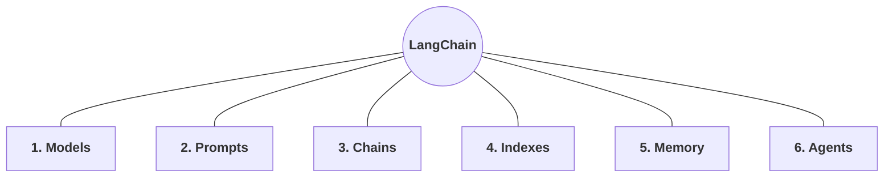
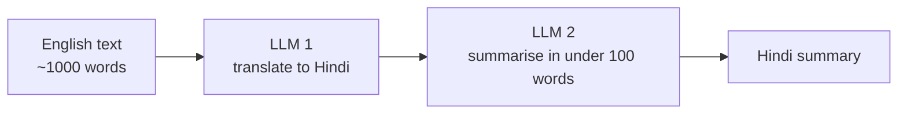
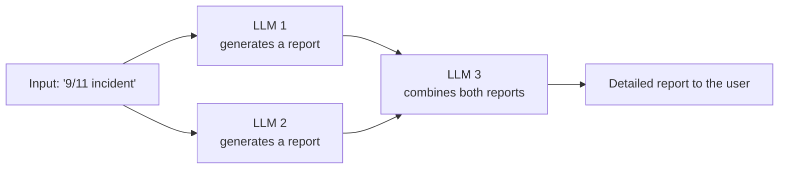
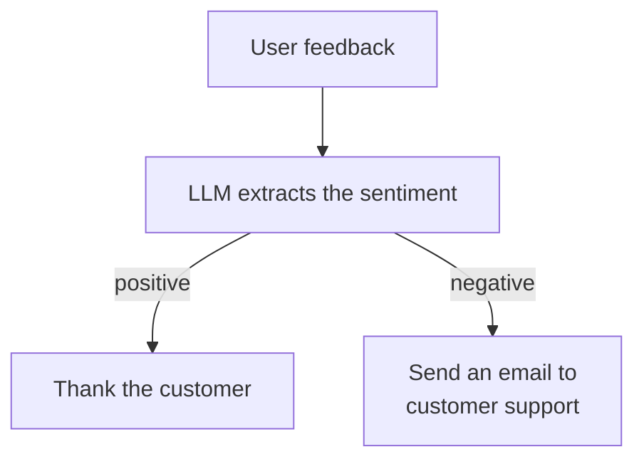
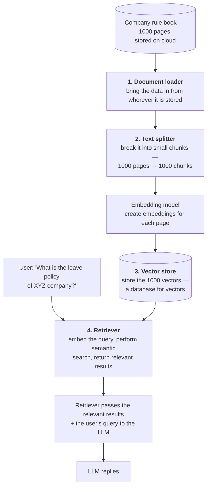
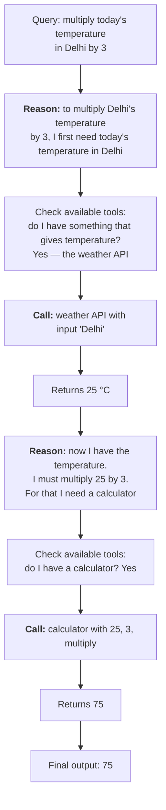

> **Video 4 of 21** (playlist video 2) · [Watch on YouTube](https://www.youtube.com/watch?v=-xSJA8-o6Eg)
> Notes follow the video section by section.

## Two benefits of this video

First, you get deep insight into how LangChain as a framework is organised — you understand the thought process of the people who built the library. Second, every later video in the playlist is built on this one: the components discussed here each get their own detailed video later. So this doubles as a road map.

**Disclaimer:** no code in this video. Most online LangChain resources start building projects before giving the foundation, and that is not the right way to learn the library. The right way is to take a conceptual overview first, then start coding. The first two videos are theory; code starts in the next one.

To keep it from being dry, every component is explained with relevant industrial examples.

## Recap of the previous video

The previous video explained in detail what LangChain is and why it is needed. LangChain is an open-source framework for building LLM-powered applications. The need was shown through an example: an application where anyone can interact with a PDF. A system design showed how many components would be required and how much interaction there would be between them — and that coding such a system from scratch means working very hard.

LangChain enables efficient orchestration between all those components, letting you build pipelines and get maximum output with minimal code. Chains let you string components together, and the output of one automatically becomes the input of the next. LangChain is also model-agnostic — swapping GPT for Google's models takes one or two lines.

## The six components

In total LangChain has six components. Read these six and you understand the majority of the concept of LangChain.



## 1. Models

> LangChain models are the core interface through which you interact with AI models.

You will not understand much from that definition, so here is the back story.

### The back story

In the entire history of NLP, everyone wanted to create one particular application: a **chatbot**. Probably the most popular application in the world of NLP — everyone wants to create their own.

But there were two major problems.

**Problem 1 — making the chatbot understand the user's query.** You type something and the chatbot has to understand what you mean. We call this **NLU**, natural language understanding.

**Problem 2 — replying.** Even if the chatbot understands, generating a good reply is also a big challenge. **Context-aware text generation** is hard.

A lot of effort went into both. Then **LLMs arrived and solved both problems together.** Because LLMs were trained on data from almost the entire internet, not only did they develop an understanding of natural language, they simultaneously gained context-aware text generation.

**But a new problem appeared.** Since LLMs were trained on all that data, they have billions of parameters, so their size is huge — in many cases greater than 100 GB. No normal person can run such large files on their computer. For that matter, small companies cannot run them on their servers, because the cloud bill would be unpayable.

**That was solved by APIs.** Big companies created APIs — anyone in the world can hit them, send their query, the API talks to the LLM, the LLM gives its response, and the user receives it. You do not run the LLM on your own machine or cloud; you send queries and pay for what you use.

**Then a third problem appeared: implementation.** The APIs written by different LLM providers are written in different ways. If you are an application developer and want to talk to two different LLM APIs in your application, you have to write two different kinds of code.

Or suppose you built an application with OpenAI, and later you do not want to use OpenAI because it is costly and you want to use Claude's API instead. You have to change your codebase and convert it — a laborious task.

So **standardisation** becomes the challenge. Gemini's APIs behave differently from OpenAI's. Claude's behave differently again. Even the responses you get back are of different types.

### What LangChain does

LangChain identified this problem so that anyone can talk to any company's API in a **standardised fashion**. You do not have to make many changes to talk to OpenAI, and with a small change you can talk to Gemini instead.

Look at what changes between the two pieces of code: you call a different package, and that is essentially it. The method of making the call is exactly the same, the method of printing the result is exactly the same. You literally change one line — in fact two — and you can instantly switch from OpenAI to Claude. And the answers you get after switching are very similar, so parsing them is easy.

**In short, the models component standardises the entire interface for communicating with AI models.**

### Two types of model

In LangChain you can communicate with two types of model.

**Language models.** You give a text input like *"how are you today"* and they give a text output like *"I'm good, how about you."* LLMs are language models working on the text-in-text-out philosophy. With them you build chatbots and AI agents.

**Embedding models.** You give text as input, but they give you a **vector** as output. Their main use case is **semantic search**.

### Where to look

Go to the LangChain documentation, open the **Chat Models** section, and you will find every provider you can talk to: Anthropic, Mistral AI, Azure, OpenAI, Vertex AI, Bedrock (from AWS), Hugging Face and more.

Not only that — it also tells you which features each supports:

- Is tool calling available? (useful when you create an agent)
- Do you get structured output?
- Does it give output in JSON mode?
- Can you run that model locally on your machine?
- Can you provide multimodal input?

A second page tells you which **embedding models** are available — OpenAI, Mistral AI, IBM and more. Go through both lists once; it builds your perspective.

## 2. Prompts

If you are working with an LLM, the inputs you send are called **prompts**. Ask ChatGPT *"What is CampusX?"* and that string is a prompt.

Prompts are very, very important in the world of LLMs. **The output depends heavily on the prompt — it is very sensitive.** Change the prompt slightly and the output changes significantly.

For example, ask an LLM to *"explain linear regression in an academic tone"*, then ask the same LLM to *"explain linear regression in a fun tone"*. You changed one word, but the output will be very different.

In the last two years a field of study has emerged around prompts, with real jobs attached: **prompt engineering**, and the role of **prompt engineer**. It has become slightly infamous on social media, but it is an important field of study.

LangChain identified that LLMs rely heavily on prompts, so a good component was needed to handle them. It gives you a lot of flexibility — you can create many different and powerful types of prompt.

### Dynamic and reusable prompts

You do not know in advance which topic the user will ask you to summarise, or in which tone. So you create a dynamic prompt:

> *Summarise this **\{topic\}** in **\{tone\}** tone.*

You put placeholders where the topic and the tone go. The user says *"tell me about cricket in a fun tone"*, so you replace the placeholders with `cricket` and `fun`, and send that prompt to your LLM. Tomorrow another user comes and uses the same prompt for, say, biology in a serious tone.

### Role-based prompts

First create a **system-level** prompt with a placeholder for a profession, then a **user-level** prompt for the topic:

```text
System: Hi, you are an experienced {profession}.
User:   Tell me about {topic}.
```

A user comes and says *"you are an experienced doctor"*, so that fills the profession, and *"viral fever"* fills the topic. You are guiding your LLM that it is an experienced doctor, and now it can answer as one. Tomorrow another user says *"you are an experienced engineer, tell me about developing a bridge."*

### Few-shot prompting

You first show some examples to your LLM, then ask it a question.

Suppose you are creating a chatbot for customer support. You show some previous messages and what type each is:

| Message | Category |
|---|---|
| I was charged twice for my subscription this month | Billing Issue |
| The app crashes every time I try to log in | Technical Problem |
| Can you explain how to upgrade my plan? | General Enquiry |

Then you create a template where you ask the question in the same format — here is the ticket, here is the query, and in the output tell me the category. You build a few-shot prompt template with your example prompt and example template, send a new query, and ask which category this new example falls into.

So the prompt becomes: *convert the following customer support ticket into one of the following categories — billing issue, technical problem, general enquiry* — followed by your examples, followed by the user's new query. The LLM prints the category.

## 3. Chains

So important that LangChain is named after it.

Chains are the component with which you build **pipelines**. If you create any LLM application you can give it the shape of a pipeline, and you create that pipeline with chains.

### An example

Suppose you have to create an application where the user gives you a large English text of around 1000 words as input, and in the output you give its **Hindi summary in under 100 words**.

You decide the flow: first send the input to an LLM whose job is to translate it into Hindi. Then send the translated text to a second LLM, which generates the Hindi summary in under 100 words.



**Without chains**, you design this pipeline manually: take input from the user, call the first LLM, tell it to translate into Hindi, get the Hindi translation, take it to another LLM, tell it to generate a summary, then get your final output. You have to extract the output from each stage and manually insert it into the input of the next.

**Chains solve this.** The biggest feature: they automatically convert the output of one stage into the input of the next, and you do not write any code manually. You simply provide the English text and call the chain. Behind the scenes the whole task executes and you get your result.

### Beyond straight lines

The chain above is a **simple sequential chain**, one stage after another. But you can build more.

**Parallel chains.** Suppose you want an application where the user gives an input and you print a detailed report — say the user writes *"9/11 incident"*. You want to combine the output of multiple LLMs. You send the input to LLM 1, which generates a report on that topic. In parallel you send the same input to LLM 2, which also generates a report. Then you send both to a third LLM and ask it to combine the two reports, and you show the combined result.



**Conditional chains.** Different processing based on a condition.

Suppose you are building an AI agent that receives feedback from the user. You ask the user how they liked your service. You process this feedback with an LLM. If the feedback is good, you thank them and the work is done. If the feedback is bad, you immediately send an email to your customer support team.



## 4. Indexes

> Indexes connect your application to external knowledge — such as PDFs, websites and databases.

Four things come under indexes:

1. **Document loader**
2. **Text splitter**
3. **Vector store**
4. **Retrievers**

### Why they are needed

You use ChatGPT for all your queries, and it mostly answers, because it is trained on the data of the entire internet. But there are scenarios where it will not be able to answer.

Suppose I work in a company called XYZ. If I go and ask ChatGPT *"what is the leave policy of my company XYZ?"* or *"what is the notice period policy?"* — will it be able to answer? **No.** Those questions are about my company's private data, which ChatGPT never saw during training.

This is the problem all of us face: we cannot ask ChatGPT questions related to the things we do in our personal and professional lives, because it does not know about them.

**The solution:** connect your LLM to an **external knowledge source**. Take the LLM and provide it with the complete rule book of XYZ company. Now if you ask a normal question — *"who is the Prime Minister of India?"* — it answers from training. And if you ask *"what is the leave policy of XYZ company?"* it also answers, because it now has the external knowledge source.

### How such a system is implemented



Since we are storing vectors in this database, the special database is called a **vector database** or **vector store**.

**In simple terms, indexes are how you build LLM applications that have access to external knowledge sources** — and that source can be anything: a PDF, a website, even a company's database.

## 5. Memory

> LLM API calls are stateless.

This is a big problem when you build LLM-based applications. What does stateless mean?

Suppose you are using an LLM API and you send the query *"Who is Narendra Modi?"* The model replies: *"Narendra Modi is an Indian politician who is the current Prime Minister of India."*

Then you change your query to *"How old is he?"* — asking about his age. Hit the same API and the result reads something like: *"As an AI, I do not have access to personal data about individuals unless it has been shared with me."*

It does not remember. The previous question was about Narendra Modi, so here it cannot decode who "he" is.

**Every request is independent** — it has no memory of the previous request. Think about it: if you create a chatbot on such a system, how frustrating will it be to talk to, because it has no memory of the conversation and you have to remind it every time what you were talking about.

LangChain solves this with the **memory** component. There are several types.

### Types of memory

**Conversation buffer memory.** The most frequently used. You store all the conversation that has taken place so far, and when making the next API call you send the entire chat history along with it, so the model understands what is being discussed.

The only problem: if your chat becomes very big, the chat history becomes very big too, so processing time and cost increase.

**Conversation buffer window memory.** You store the last *N* interactions — say the last 100 messages. It updates continuously; at any point you keep the last 100 and send those in the next API call.

**Summary-based memory.** You generate a summary of your entire chat history so far and send that summary in your API call. This saves text and costs less.

**Custom memory.** You store very specialised pieces of information for more advanced use cases — user preferences, facts and figures about them. You always keep this in memory, which makes it easier to continue the conversation.

## 6. Agents

The component with which you can easily build AI agents.

In the last six months you must have heard about AI agents somewhere. Everyone says AI agents are going to be the next big thing — which may well be true. Let us understand fundamentally what they are.

### Chatbot vs agent

We have discussed that LLMs have two big features: NLU, and text generation. The LLM understands language, and after understanding it can generate correct text. So the most obvious use case was creating chatbots — and people created a lot of them. Today's most popular AI application, ChatGPT, is itself a chatbot.

Gradually people thought: if my chatbot can understand me well and reply, then it can also **do** some work.

Suppose you are talking to a chatbot on a travel website. You ask *"which is the best travel destination in India during summer?"* Since the chatbot is based on an LLM trained on internet data, its training contains the information that hill stations are the best tourist spots in summer, so it replies that you can go to Shimla or Manali.

Now if instead of a chatbot there were an **AI agent**, you could get it to do work. You could ask *"which is the cheapest flight on 24 January between Delhi and Shimla?"* The agent would hit an API and return: *"the Indigo flight is the cheapest on 24 January from Delhi to Shimla."*

Then you take it a step further: *"can you book the flight?"* And since it has that capability, it goes and books your flight on the travel website.

**That is the main difference between a chatbot and an AI agent.** An AI agent is a chatbot with superpowers — it can talk, and it can do the work for you.

### How this happens

An AI agent has two things a chatbot does not:

1. **Reasoning capability**
2. **Access to tools** — for example, hitting an API to find the cheapest flight

### A worked example

Suppose we have created an AI agent and given it two tools:

- A **calculator**, so that any time during a conversation it has to do a mathematical calculation, it can use it
- A **weather API**, so it can find the weather condition of any city in the world on any date

A user comes and asks: *"Can you multiply today's temperature in Delhi by 3?"*

Since it has reasoning capability, it can reason about what exactly it has to do. Reasoning happens through different techniques — one popular one is **chain-of-thought prompting**, where the agent breaks your query down step by step and reasons through it.



**To summarise:** the only difference between an AI agent and a chatbot is that the agent has reasoning capability and access to tools. An AI agent is an evolved chatbot where you can perform some action.

Right now it seems all the big companies and all the good research in the AI world are converging on this topic, and there is going to be a lot of progress on this front.

## Checklist

- [ ] I can name all six components
- [ ] I can tell the models back story: NLU + generation → LLMs → size → APIs → standardisation → LangChain
- [ ] I can name the two types of model and what each outputs
- [ ] I can explain dynamic, role-based and few-shot prompts
- [ ] I can explain sequential, parallel and conditional chains
- [ ] I can list the four sub-components of indexes in order
- [ ] I can explain statelessness and name the four memory types
- [ ] I can trace the temperature-times-3 example through an agent
