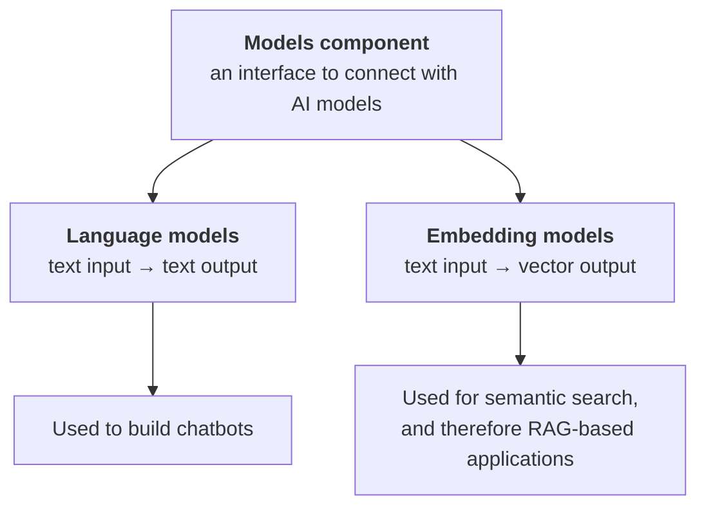

> **Video 5 of 21** (playlist video 3) · [Watch on YouTube](https://www.youtube.com/watch?v=HdcLE8JuMrA)
> Notes follow the video section by section. This is the first code-heavy video.

## Recap

Two videos so far. The first gave a detailed introduction to LangChain — what it is, why it is needed, what you can build, and what the alternatives are. The second covered the components present in LangChain — models, prompts, agents, chains and the rest — explaining what each is needed for with relevant examples.

Today is a deep dive into the first of those components: **models**.

## What the models component is

> The model component in LangChain is a crucial part of the framework, designed to facilitate interactions with various language models and embedding models.

In very simple words: many different AI models exist, and the problem is that when you write code against them, different companies' models behave differently. The models component provides a **common interface** so you can connect easily with any kind of AI model.

Remember this diagram — there are two types of model in LangChain.



**Language models.** You give a text input like *"what is the capital of India?"*. The model understands, processes and interprets the text and returns text — *"New Delhi"*.

**Embedding models.** You give a text input, but this time it does not return text. It returns a series of numbers, which we call **embeddings**. Embeddings are nothing but vectors — sets of numbers that represent or contextualise that text. They help you conduct semantic search, and that is why with their help you can build RAG-based applications.

## Plan of action

The video is completely coding-based.

1. Work with **language models** — first closed-source (paid): OpenAI's GPT models, Anthropic's Claude, Google's Gemini. Then open-source models.
2. Work with **embedding models** — first closed-source (OpenAI's embedding models), then an open-source embedding model downloaded from Hugging Face and run on your machine.
3. Build a small **document similarity** application that generates a similarity score between documents.

## Language models: LLMs vs chat models

Language models come in two types, and the distinction is simple.

**LLMs** are general-purpose models. You can use them in any kind of NLP application — text generation, text summarisation, code generation, question answering. Their speciality is that you give a string in plain text and they give you a string back in plain text.

There is not much point reading about LLMs any more, because they are older, and in LangChain their support is gradually ending. The new version tells you that if you are starting a new codebase or a new project, please do not work on LLMs.

**Chat models** are replacing them.

> Chat models are language models that are specialised for conversational tasks. They take a sequence of messages as input and return chat messages as output.

You can send multiple messages at once, the chat model understands the entire conversation, and it can reply with a series of messages.

**The most important difference:** LLMs are general-purpose models applicable to any NLP application; chat models are specialised models with more use in conversational tasks. If you want to build chatbots, agents or coding assistants, chat models are the answer.

### The comparison

| | **LLMs** | **Chat models** |
|---|---|---|
| Purpose | free-form text generation | multi-turn conversation between user and AI |
| Training | very general training on lots of text — books, articles, Wikipedia | that training, **plus** fine-tuning on chat datasets where conversations between multiple people take place |
| Memory | no concept of memory — it will not remember the past | supports conversation history |
| Role awareness | cannot assign roles | you can assign a role via a system-level message, and it understands who the user is and who the AI is |
| Example models | older completion models | GPT-4o, Claude, Gemini |
| Use when | text generation, summarisation, translation, code generation | conversational AI, chatbots, virtual assistants, customer support bots, AI tutors |

Mostly, the AI applications being developed today fall into the second category. That is why the whole GenAI industry is shifting towards chat models, and LLM support is slowly fading. You can still build using LLMs, but it is not recommended in the latest versions of LangChain.

**This video focuses on chat models**, but LLMs are shown first so the difference is clear.

## Setup

Create a folder — call it `langchain-models` — and open it in VS Code. Then create a virtual environment:

```bash
python -m venv venv
venv/Scripts/activate        # Windows
source venv/bin/activate     # macOS / Linux
```

Create a `requirements.txt` with every library needed for the lecture, then install:

```bash
pip install -r requirements.txt
```

Check that LangChain installed correctly:

```python
# test.py
import langchain
print(langchain.__version__)
```

Then create three folders for the work: `llms`, `chat_models` and `embedding_models`.

## LLM demo with OpenAI

Since we are going to use OpenAI's API, we first need an API key.

Go to the OpenAI platform and create an account. The catch: you can access API keys only if you have some credit in your account, minimum **$5**. Up to about a year ago free credits were given to new users; now they are not. **$5 is more than sufficient** to do quite a lot. If you are a student, two or three of you can contribute together.

The reason for becoming a paid user: most companies use OpenAI's APIs for their LLM applications, so if you work as an AI engineer there is a good chance you will have to work on OpenAI. Free options using Hugging Face are shown later in the video.

Once topped up, go to **Settings → API Keys → Create new secret key**, give it a name, select a project, set permissions, and copy the key.

**Never write the key directly in your code.** Create a `.env` file in your project:

```bash
OPENAI_API_KEY="sk-..."
```

Then the demo:

```python
# llms/llm_demo.py
from langchain_openai import OpenAI
from dotenv import load_dotenv

load_dotenv()

llm = OpenAI(model="gpt-3.5-turbo-instruct")

result = llm.invoke("What is the capital of India?")

print(result)
```

`langchain_openai` is the integration package between LangChain and OpenAI — the code that knows how to talk to OpenAI's API lives there. `dotenv` loads the secret keys from the environment file into your current file, which is why `load_dotenv()` is invoked first.

`invoke` is a very important function in LangChain. You will see it later on models, chains and prompts — all the core components have it. Behind the scenes, `invoke` hits the model with your prompt, the model processes it and generates a reply, and that reply comes back.

Notice: you sent a **string** and got a **string** back. That confirms this is an LLM.

## Chat model interface

The good thing about LangChain is that the interface is consistent — fewer changes to make between one model and the next.

```python
# chat_models/chat_model_openai.py
from langchain_openai import ChatOpenAI
from dotenv import load_dotenv

load_dotenv()

model = ChatOpenAI(model="gpt-4")

result = model.invoke("What is the capital of India?")

print(result)
print(result.content)
```

Instead of `OpenAI` you import `ChatOpenAI`. The difference between the two is in the source: **`OpenAI` inherits from `BaseLLM`**, while **`ChatOpenAI` inherits from `BaseChatModel`**. That single fact is the main technical difference between an LLM and a chat model in LangChain.

### The output is different

Unlike last time, the result is not simple plain text. You see `content`, inside which the actual answer is hidden, and along with it a lot of additional keyword arguments and metadata — how many completion tokens were used, how many prompt tokens, and more.

So normally, if you just want the answer, you print `result.content` rather than `result`.

### Which models are available

Go to the OpenAI website's **models** section and you will see every available model. It gives you not only the model name but also the **context window** and **max output tokens**, so you can decide which to use.

## Parameters

### `temperature`

A very interesting parameter, with a value roughly from 0 to 2. In very simple words, it is the **creativity** parameter.

> Temperature is a parameter that controls the randomness of a language model's output. It affects how creative or deterministic the responses are.

**Low values** (around 0 to 0.3) make responses more deterministic and predictable. **Higher values** (around 1.5) make them random, creative and diverse.

| Use case | Recommended temperature |
|---|---|
| Factual answers — maths, code | 0.0 – 0.3 |
| General question answering, explanation | 0.5 – 0.7 |
| Creative writing, storytelling, jokes | 0.9 – 1.2 |
| Maximum randomness, brainstorming | 1.5+ |

```python
model = ChatOpenAI(model="gpt-4", temperature=1.5)
result = model.invoke("Write a 5-line poem on cricket")
```

:::note A correction issued in the next video
The demonstration of temperature in this video was explained incorrectly, and a student pointed it out in the comments. The correction is given at the start of video 6 and is worth stating here.

**Temperature controls randomness, not "creativity level" as a quality dial.** At temperature 0, sending the **same input** always gives you the **same output** — run the same poem prompt twice and you get identical text. As you raise it, the same input starts producing different output each time; at 1.5 the two runs will be quite different.

So: if you are building an application where the same input should always give the same output, keep temperature near 0. If you want variety on every call, keep it around 1.5.
:::

### `max_completion_tokens`

Tells the model how many tokens you need in the output. For now you can consider tokens as roughly words.

```python
model = ChatOpenAI(model="gpt-4", temperature=1.5, max_completion_tokens=10)
```

Why is this helpful? Because when you talk to a paid language model you pay per token. Look at the pricing section on the OpenAI website — pricing is per million tokens. So you pay based on the number of tokens you ask for.

Sometimes, as a developer, you want a restriction so you do not get more tokens in the output than you need.

Roughly you can assume tokens equal words, but not exactly — tokenisation is a big topic in itself.

## Anthropic's Claude

Claude is a very popular language model. In many places you will hear that it has beaten GPT models on performance, and it is used in many places — so there is a chance the company you work for uses Claude's API instead of OpenAI's.

The process is exactly the same. You need an API key from Anthropic, which is also a paid service. Go to **Get API Keys → Create Key**, and add it to your environment file:

```bash
ANTHROPIC_API_KEY="sk-ant-..."
```

:::warning Environment variable names are fixed
You have to write **exactly** this name. Just as `OPENAI_API_KEY` is written with that exact spelling, `ANTHROPIC_API_KEY` must be exact too. If you change it, the load function will not find it correctly and your code will not work.
:::

```python
# chat_models/chat_model_anthropic.py
from langchain_anthropic import ChatAnthropic
from dotenv import load_dotenv

load_dotenv()

model = ChatAnthropic(model="claude-3-5-sonnet-20241022")

result = model.invoke("What is the capital of India?")

print(result.content)
```

This is the main power of LangChain. Compare the code for talking to Claude's API with the code for talking to OpenAI's — there is a very minimal difference. That consistency helps you a lot.

## Google's Gemini

Go to Google's AI developer site, get an API key, and add it to your environment file:

```bash
GOOGLE_API_KEY="..."
```

```python
# chat_models/chat_model_google.py
from langchain_google_genai import ChatGoogleGenerativeAI
from dotenv import load_dotenv

load_dotenv()

model = ChatGoogleGenerativeAI(model="gemini-1.5-pro")

result = model.invoke("What is the capital of India?")

print(result.content)
```

That is three different API calls implemented — the three most famous closed-source language models.

## Open-source models

The three models so far were closed-source: proprietary models of some company. The AI model sits on the company's server, the company creates an API, and the world uses the model through that API.

There are two flaws in that setup:

1. **You have to pay** to use the API.
2. **The model is on someone else's server** and you can only talk to it through the API — you have no control, and things change.

Open-source models solve both.

> Open-source models are freely available AI models that can be downloaded, modified, fine-tuned and deployed without restrictions from a central provider. Unlike closed-source models such as GPT, Claude and Gemini, open-source models allow full control and customisation.

Some company or organisation trains the model properly and leaves it on the internet. As a user you download it, run the trained model on your machine, and then you have the freedom to do whatever you want with it. There is no cost because you are not using an API, and since it is on your machine you can fine-tune it, modify it, and deploy it.

### The comparison

| | **Open source** | **Closed source** |
|---|---|---|
| Cost | free — run them locally, no API payment | pay to use the API |
| Control | it is on your machine, so fine-tune or reposition it as you like | you can only use the provider's infrastructure — zero control |
| Data privacy | you download the model and process everything on your own machine, so you can integrate an LLM even with confidential documents | you have to send your data to their servers |
| Customisation | fine-tune it on your own datasets | some providers give this feature, but it is very limited |
| Deployment | deploy on your own servers or cloud | not applicable |

The data privacy row is a very big selling point.

### Famous open-source models

The most famous open-source language model is **Llama**. Apart from that: **Mistral**, **Falcon**, and some very domain-specific models like **BLOOM**.

### Where to get them

**Hugging Face** — the largest repository of open-source LLMs. Go to their website, click **Models**, and you will find thousands of AI models: multimodal models where you can send audio, video, text or speech input; vision-specific models for image classification and object detection; and NLP models. Under **text generation** you will find famous names like DeepSeek, Llama, and newer ones like Qwen.

### Two ways to use them

1. **Download them to your machine** and run them locally — the most popular way.
2. **Use Hugging Face's Inference API** — just like OpenAI, though after a limit you have to pay. As a student or for small projects it will not matter much, and the best part is that you can use thousands of models through the API.

Both are shown below.

## Open-source model via the Hugging Face Inference API

The model is **not** downloaded — it stays on Hugging Face's servers and we talk to it through an API. So we need an API key.

Create an account on Hugging Face, go to your account → **Access Tokens** → **Create new token**. Choose fine-grained read/write as needed, name it, and create it. Then add to your environment file:

```bash
HUGGINGFACEHUB_ACCESS_TOKEN="hf_..."
```

```python
# chat_models/chat_model_hf_api.py
from langchain_huggingface import ChatHuggingFace, HuggingFaceEndpoint
from dotenv import load_dotenv

load_dotenv()

llm = HuggingFaceEndpoint(
    repo_id="TinyLlama/TinyLlama-1.1B-Chat-v1.0",
    task="text-generation",
)

model = ChatHuggingFace(llm=llm)

result = model.invoke("What is the capital of India?")

print(result.content)
```

Two classes are imported here. `ChatHuggingFace` is the chat model wrapper — analogous to `ChatOpenAI`. `HuggingFaceEndpoint` is what you use when you want to use Hugging Face's **API**, and it becomes the `llm` parameter of the chat model.

For `HuggingFaceEndpoint` you tell it two things:

- **`repo_id`** — which model you want to use. Go to Hugging Face → Models → Text Generation, pick one, and copy its path. The model used here is **TinyLlama**, a smaller model with 1.1 billion parameters — a fine-tuned version of the Llama model with fewer parameters, chosen for the demo.
- **`task`** — what you want the model to perform, here `text-generation`.

## Open-source model downloaded and run locally

This will truly give you the flavour of open source.

```python
# chat_models/chat_model_hf_local.py
import os
from langchain_huggingface import ChatHuggingFace, HuggingFacePipeline

os.environ["HF_HOME"] = "D:/huggingface_cache"

llm = HuggingFacePipeline.from_model_id(
    model_id="TinyLlama/TinyLlama-1.1B-Chat-v1.0",
    task="text-generation",
    pipeline_kwargs={
        "temperature": 0.5,
        "max_new_tokens": 100,
    },
)

model = ChatHuggingFace(llm=llm)

result = model.invoke("What is the capital of India?")

print(result.content)
```

The difference from last time: instead of `HuggingFaceEndpoint` you use **`HuggingFacePipeline`**, and instead of constructing it directly you call `from_model_id`. You pass the same model ID, the same task, and optionally `pipeline_kwargs` where you can set the temperature and `max_new_tokens`.

As soon as you run this, the model, its config files and its tokenisers are downloaded to your machine — around 500 MB of files for this model — and then loaded into your RAM.

**The `HF_HOME` line is optional.** By default everything downloads to your system drive. If that drive is full you can set `HF_HOME` explicitly to store the cache elsewhere. In your case you probably do not need it.

:::danger Local inference is heavy
On a machine with 8 GB RAM and a small SSD, running even this small model took around **10 minutes**, made the machine unusable, and required a restart. It helps a lot if your machine has a GPU; on CPU, inference is slow.

Also note: the **first** run downloads the model; the second run is faster because of caching.
:::

### Disadvantages of open-source models

1. **They require solid hardware.** Bigger models need very expensive GPUs, which individuals generally do not have.
2. **Setup is more complicated.** Bringing the model in and running it takes a bit of hectic work.
3. **Less refinement.** The technical reason is that open-source models have less fine-tuning on human feedback — **RLHF**. So in comparison to closed-source models, the responses feel a little less refined. You can fix this yourself, because you have the option of fine-tuning.
4. **Mostly limited multimodal capabilities**, at least at this point. Mostly text; models that work with images and audio are rare.

## Embedding models

Embedding models convert a text into a vector, so that the context of that text is captured inside the vector.

### A single query

```python
# embedding_models/embedding_openai_query.py
from langchain_openai import OpenAIEmbeddings
from dotenv import load_dotenv

load_dotenv()

embedding = OpenAIEmbeddings(model="text-embedding-3-large", dimensions=32)

result = embedding.embed_query("Delhi is the capital of India")

print(str(result))
```

Multiple embedding models are available — check the OpenAI website's models page. `dimensions` tells it how many dimensions you want in the output vector. Here we request 32.

**A bigger vector captures more context; a smaller vector captures less.** The advantage of a smaller vector is that the cost is lower.

The default lengths are **1536** for the small model and **3072** for the large model — quite large vectors.

### Multiple documents

```python
# embedding_models/embedding_openai_docs.py
from langchain_openai import OpenAIEmbeddings
from dotenv import load_dotenv

load_dotenv()

embedding = OpenAIEmbeddings(model="text-embedding-3-large", dimensions=32)

documents = [
    "Delhi is the capital of India",
    "Kolkata is the capital of West Bengal",
    "Paris is the capital of France",
]

result = embedding.embed_documents(documents)

print(str(result))
```

The replacement for `embed_query` is **`embed_documents`**, which can handle multiple documents at once. You get back a 2-D list — three lists, each an embedding vector for one document.

### An open-source embedding model

The model used is **`all-MiniLM-L6-v2`** — a sentence-transformer model that maps sentences and paragraphs to a 384-dimensional dense vector space, usable for clustering and semantic search. It is small, around 90 MB.

```python
# embedding_models/embedding_hf_local.py
from langchain_huggingface import HuggingFaceEmbeddings

embedding = HuggingFaceEmbeddings(model_name="sentence-transformers/all-MiniLM-L6-v2")

text = "Delhi is the capital of India"

vector = embedding.embed_query(text)

print(str(vector))
```

The first run downloads the model and the tokeniser to your machine. The output is a **384-dimensional** vector.

To embed several documents, replace `text` with a list and use `embed_documents` instead of `embed_query` — everything else stays the same.

:::tip Embeddings are cheap
Processing 1 million tokens costs very little, because the model gives very little output in numbers. Since it is so cheap, you can use OpenAI's embeddings, and they generally produce much better context. The free model is generally a little less accurate and gives slightly less good results.
:::

## Document similarity application

A small, complete application. We have a set of five documents. A user asks a question related to one of them, and we have to find out which document it relates to.

**How the process works.** We generate embeddings for all five documents and keep them. When the question comes, we generate an embedding for the question too. Now we have five vectors and one query vector, all of the same dimension. We find out which of the five the new vector is closest to — using **cosine similarity**, essentially finding the angle between the red query vector and all the black document vectors. The highest similarity score is our answer.

You will notice this is exactly the idea used when you build RAG-based applications.

```python
# document_similarity.py
from langchain_openai import OpenAIEmbeddings
from sklearn.metrics.pairwise import cosine_similarity
from dotenv import load_dotenv
import numpy as np

load_dotenv()

embedding = OpenAIEmbeddings(model="text-embedding-3-large", dimensions=300)

documents = [
    "Virat Kohli is an Indian cricketer known for his aggressive batting and leadership.",
    "MS Dhoni is a former Indian captain famous for his calm demeanour and finishing ability.",
    "Sachin Tendulkar, also known as the 'God of Cricket', holds many batting records.",
    "Rohit Sharma is known for his elegant batting and record-breaking double centuries.",
    "Jasprit Bumrah is an Indian fast bowler known for his unorthodox action and yorkers.",
]

query = "tell me about Bumrah"

doc_embeddings = embedding.embed_documents(documents)
query_embedding = embedding.embed_query(query)

scores = cosine_similarity([query_embedding], doc_embeddings)[0]

index, score = sorted(list(enumerate(scores)), key=lambda x: x[1])[-1]

print(query)
print(documents[index])
print("similarity score is:", score)
```

Two details in this code are worth internalising, because they recur throughout RAG.

**Why `enumerate`.** The similarity scores come back as a plain list, and the highest one is what you want — but sorting destroys the position, and the position is how you map back to the original document. So you wrap the list in `enumerate` first, which attaches an index number to every score. Now sorting cannot lose track of which document a score belongs to. You sort on the second item of each pair using `key=lambda x: x[1]`, which sorts in ascending order, so the largest lands at the end — hence `[-1]`.

**Why the extra brackets.** Both arguments passed to `cosine_similarity` must be 2-D lists. `doc_embeddings` is already 2-D; `query_embedding` is a single vector, so it is wrapped as `[query_embedding]`.

Change the query from *"tell me about Virat Kohli"* to *"tell me about Bumrah"* and the matching document changes accordingly.

### What is wrong with this code

Every time you run it, the document embeddings are generated again by asking the model — and that is a **costly operation**. A better approach is to generate the document embeddings once and **store** them. For that you need a database, and that database is what we will study later as a **vector database**. Then later, when a new question comes, you generate its embedding on the fly, ask the model, and calculate the similarity score. That process is called **retrieval**.

## Checklist

- [ ] I can explain why chat models replaced LLMs, and the base-class difference
- [ ] I can talk to OpenAI, Anthropic and Gemini by changing one or two lines
- [ ] I can explain what temperature actually controls, including the correction
- [ ] I can explain why `max_completion_tokens` matters for cost
- [ ] I can name five differences between open-source and closed-source models
- [ ] I can run an open-source model through the HF API and locally
- [ ] I can generate embeddings for a query and for documents
- [ ] I can write the document similarity app and explain `enumerate` and the 2-D requirement
- [ ] I can say why re-embedding documents on every run is wrong
