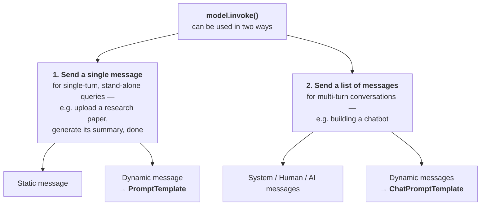
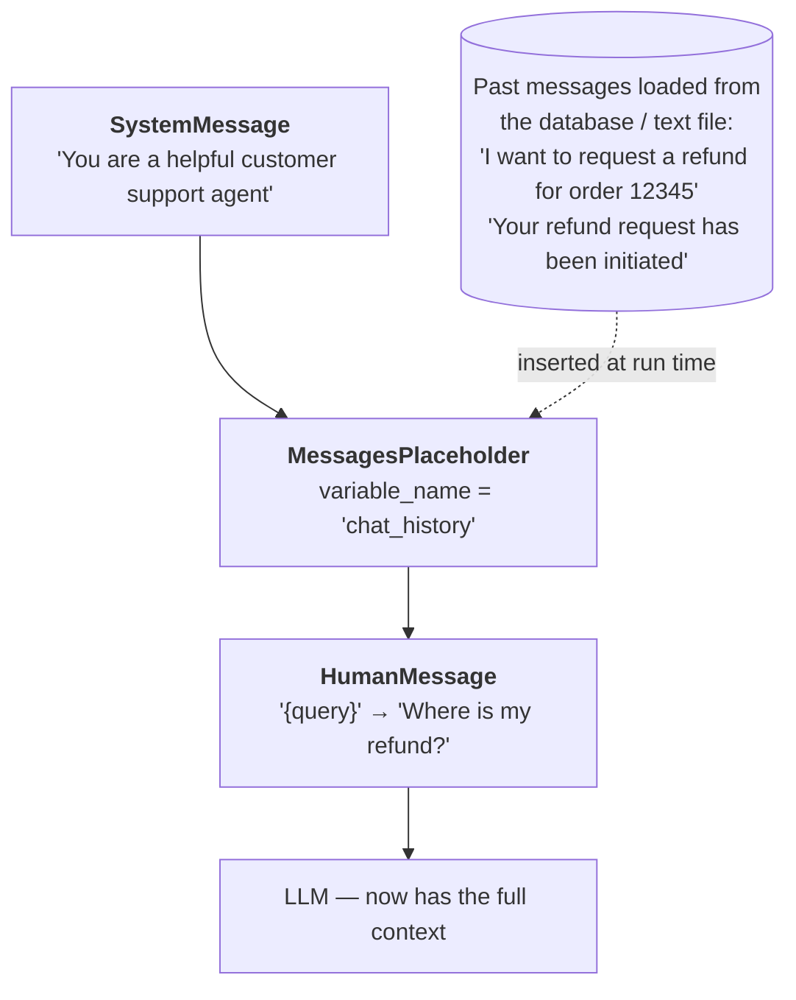
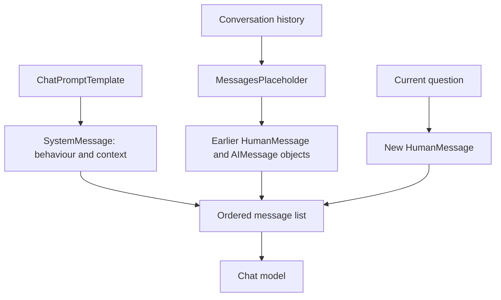

> **Video 6 of 21** (playlist video 4) · [Watch on YouTube](https://www.youtube.com/watch?v=3TGqlQxpuU0)
> Notes follow the video section by section.

## A correction from the previous video

Before the topic begins, a mistake from the models video is corrected — a student pointed it out in the comments.

In the previous video temperature was explained as: keep it near 0 and the output is deterministic, keep it near 2 and the output is creative. **That explanation was not right.**

Here is the correct usage, demonstrated with the same code — writing a five-line poem on cricket.

**At temperature 0**, the benefit is that **every time you send the same input, you get the same output**. Run the code once, get a poem. Run it again with exactly the same input and you get exactly the same poem.

**As you increase it** — say to 0.5 — the response starts differing slightly from last time, with the same input unchanged. At **1.5** the output can be quite different each run.

So:

- Building an application where the **same input should always give the same output**? Keep temperature around 0.
- Want **different output for the same input** each time? Keep it around 1.5.

## What a prompt is

When you interact with an LLM, the message you send is called a **prompt**. Prompts are not new here — they were used throughout the last video. In that code, when you called `model.invoke()` and sent *"write a five-line poem on cricket"*, that message was a prompt.

Prompts can be multimodal. With ChatGPT you can upload an image and then ask questions about it, or upload a song and ask who the singer is, or upload a video and ask questions about it. Those are multimodal prompts.

**This video focuses entirely on text-based prompts**, because 99% of the time you work with textual prompts — at least today. Multimodal prompts may become more prominent in future.

Prompts are so important that the output of an LLM depends heavily on them. Change the prompt slightly and the LLM's output can change significantly. That is why multiple techniques exist for composing prompts, and why a whole job profile — **prompt engineering** — has appeared.

## Static vs dynamic prompts

### Static prompts

So far, prompts have been written **as the programmer**. You wanted a poem on cricket, so you called `model.invoke()` and put the prompt directly inside.

Is that the right way? No. When you make a real-world application, you as a programmer are not going to write the prompts. Ideally your **user** sends the prompt, and you pick it up and send it to the LLM.

Imagine you are building a **research assistant tool** where any user can come and get a research paper summarised. Your application looks like a website with an input box where the user types their prompt — for example *"summarise the Attention Is All You Need paper in a simple fashion"*. They click a button, you fetch the text from the box, send it to the LLM, and display the response.

Let us build that flow with **Streamlit**.

```python
# prompt_ui.py
from langchain_openai import ChatOpenAI
from dotenv import load_dotenv
import streamlit as st

load_dotenv()

model = ChatOpenAI(model="gpt-4")

st.header("Research Tool")

user_input = st.text_input("Enter your prompt")

if st.button("Summarize"):
    result = model.invoke(user_input)
    st.write(result.content)
```

Run it with:

```bash
streamlit run prompt_ui.py
```

Streamlit creates a server behind the scenes and you access the website there.

**This is a static prompt.** Every time the user wants a new response, they have to write a whole new prompt.

### The problem with static prompts

Honestly, static prompts are not used much. The reason: when you ask the user to write the whole prompt, **you give the user a lot of control** — and as established, the output of an LLM is very sensitive to the prompt.

Imagine a scenario where your user does not even know the exact name of the research paper. They type some wrong name, you send it as the prompt, and now your LLM has to give some output — it may give garbage, or something undesirable.

Or the user writes *"maths heavy"* instead of *"in five lines"*, or writes *"code heavy"*. Small changes, and the output changes a lot.

Ideally, when building an LLM application, you want **all your users to get a consistent experience**. You might want your research tool's speciality to be that whenever it reviews a research paper it gives very good analogies and examples. **If you ask the user for the full prompt, you cannot ensure this.** That is the main problem with static prompts.

### Dynamic prompts

Instead, you prepare a **template**. Here is a template written for the research assistant tool:

```text
Please summarise the research paper titled "{paper_input}" with the following
specifications:

Explanation style: {style_input}
Explanation length: {length_input}

1. Mathematical Details:
   - Include relevant mathematical equations if present in the paper.
   - Explain the mathematical concepts using simple, intuitive code snippets
     where applicable.
2. Analogies:
   - Use relatable analogies to simplify complex ideas.

If certain information is not available in the paper, respond with
"Insufficient information available" instead of guessing.

Ensure the summary is clear, accurate and aligned with the provided style
and length.
```

You ask the user for certain things: which paper, in which style, and what length. Then you fill those into the template.

In the UI you replace the single text box with **three dropdowns**:

- A dropdown listing available papers — so there is no scope for spelling mistakes
- A dropdown for explanation style — code-heavy, maths-heavy, simple and intuitive
- A dropdown for length — long, medium, short

You extract one value from each dropdown, fill them into the prompt, and **that** is a dynamic prompt. Because you place values inside the prompt, this single prompt template can serve any style and any length.

```python
# prompt_ui.py
from langchain_openai import ChatOpenAI
from langchain_core.prompts import PromptTemplate
from dotenv import load_dotenv
import streamlit as st

load_dotenv()

model = ChatOpenAI(model="gpt-4")

st.header("Research Tool")

paper_input = st.selectbox(
    "Select Research Paper Name",
    ["Attention Is All You Need",
     "BERT: Pre-training of Deep Bidirectional Transformers",
     "GPT-3: Language Models are Few-Shot Learners",
     "Diffusion Models Beat GANs on Image Synthesis"],
)

style_input = st.selectbox(
    "Select Explanation Style",
    ["Beginner-Friendly", "Technical", "Code-Oriented", "Mathematical"],
)

length_input = st.selectbox(
    "Select Explanation Length",
    ["Short (1-2 paragraphs)", "Medium (3-5 paragraphs)", "Long (detailed explanation)"],
)

template = PromptTemplate(
    template="""Please summarise the research paper titled "{paper_input}" with the
following specifications:

Explanation style: {style_input}
Explanation length: {length_input}

1. Mathematical Details:
   - Include relevant mathematical equations if present in the paper.
   - Explain the mathematical concepts using simple, intuitive code snippets
     where applicable.
2. Analogies:
   - Use relatable analogies to simplify complex ideas.

If certain information is not available in the paper, respond with
"Insufficient information available" instead of guessing.

Ensure the summary is clear, accurate and aligned with the provided style and length.""",
    input_variables=["paper_input", "style_input", "length_input"],
    validate_template=True,
)

if st.button("Summarize"):
    chain = template | model
    result = chain.invoke({
        "paper_input": paper_input,
        "style_input": style_input,
        "length_input": length_input,
    })
    st.write(result.content)
```

## Why `PromptTemplate` and not an f-string?

A doubt that comes up immediately, and a valid one: this whole thing could be written with an f-string — dynamically inserting placeholders into a big string, with values sent at run time. That would work, so why use the `PromptTemplate` class?

Three strong reasons.

### 1. Default validation

With `validate_template=True`, LangChain automatically checks that the number of placeholders in your template matches the names listed in `input_variables`.

Suppose you use three placeholders but forget to declare one of them in `input_variables`. As you run the code, an error is **automatically triggered** and the code will not run. Or suppose you add an extra name in `input_variables` that has no matching placeholder — your code breaks again and tells you.

The benefit is clearly visible: it does not burst at run time after going to the server, it bursts at **development time**, before you, so you can rectify it. You will not find this in an f-string.

### 2. Reusability

You can save your prompt templates and reuse them.

As it stands, a big template sits in the middle of your code and makes it bulky. This is a small template — there can be bigger ones — and you may want to use the same template on multiple web pages.

So you save the template separately as a JSON file and load it wherever it is needed:

```python
# prompt_generator.py
from langchain_core.prompts import PromptTemplate

template = PromptTemplate(
    template="""...your big template...""",
    input_variables=["paper_input", "style_input", "length_input"],
    validate_template=True,
)

template.save("template.json")
```

Then in your application:

```python
from langchain_core.prompts import load_prompt

template = load_prompt("template.json")
```

Now the template is not in your application file at all — it is generated by a separate file and loaded. Tomorrow, if someone else wants to use this template, they simply import it. **Reusability.**

### 3. Tight coupling with the LangChain ecosystem

`PromptTemplate` is tightly coupled with the rest of LangChain. It works very easily with **chains**.

Notice what happens without a chain: you call `invoke` **twice** — once for the prompt and once for the model:

```python
prompt = template.invoke({...})
result = model.invoke(prompt)
st.write(result.content)
```

With a chain you do the whole thing in a **single** call:

```python
chain = template | model
result = chain.invoke({...})
st.write(result.content)
```

You tie two steps together — the prompt template you built, and the model you created — and form a chain. Then you invoke the chain, passing the dictionary, and you get your result directly.

**If you had used an f-string instead of a prompt template, you could not put it into a chain.** That is the third benefit.

**In a nutshell:** you *can* use f-strings, but you *should* use `PromptTemplate`, because there are many benefits you will not find in f-strings.

## Building a chatbot

Let us build a small chat bot. No GUI — it runs in the console. You type something, the AI's message appears, you type again, and so on.

### Attempt 1 — the basic loop

```python
# chatbot.py
from langchain_openai import ChatOpenAI
from dotenv import load_dotenv

load_dotenv()

model = ChatOpenAI()

while True:
    user_input = input("You: ")
    if user_input == "exit":
        break
    result = model.invoke(user_input)
    print("AI:", result.content)
```

An infinite loop runs while the user does not type `exit`. We take the user's input, break out if it is `exit`, otherwise send it to the model and print the result.

This is a **static prompt** — we are not making anything dynamic, we are taking the user's input and sending it forward as is.

### The problem

Run it and try:

```text
You: which is greater, 1 or 2?
AI:  2 is greater than 1.
You: multiply the bigger number by 10
AI:  If the bigger number is x, multiplying x by 10 gives 10x.
```

Ideally the bigger number of 1 and 2 was 2, so multiplying by 10 should give **20**. But the chatbot did not even know which number we were talking about.

**This chatbot has no context.** It does not remember the previous messages, because we have not coded that.

### Attempt 2 — maintain a chat history

We maintain a list, keep appending to it, and send the entire history to the LLM. Then if we ask something related to an older message, it understands by looking at the history.

```python
chat_history = []

while True:
    user_input = input("You: ")
    chat_history.append(user_input)
    if user_input == "exit":
        break
    result = model.invoke(chat_history)
    chat_history.append(result.content)
    print("AI:", result.content)

print(chat_history)
```

The `invoke` function is flexible enough that you can send either a single message **or** a list of messages. We append the user's message, send the whole history, and append the model's reply as well.

Now it works:

```text
You: which is greater, 1 or 2?
AI:  2 is greater than 1.
You: multiply the bigger number by 10
AI:  2 multiplied by 10 is equal to 20.
```

### The remaining problem

Print the chat history at the end and count — say there are seven messages. But look at them: *"Hello, how can I assist you today?"* — **who sent this**, the AI or the user? We have no information.

All the messages are stored in one place, but **who sent each message is not stored**. That is a problem: as your chat history grows longer it becomes difficult for the LLM to understand whether a particular message was written by itself or sent by the user, and confusion creeps into future conversations.

So it is recommended that whenever you talk with an LLM and maintain a chat history, you store not only the messages but also **who sent them**.

Ideally you would maintain something like a dictionary — user wrote this, AI wrote that, user wrote this. But implementing all that role storage manually is work. **LangChain solved this problem.**

## The three message types

There are three types of message in LangChain.

| Type | Who sends it | What it is |
|---|---|---|
| **SystemMessage** | you, the developer | a system-level message sent at the beginning of a conversation — *"you are a helpful assistant, answer all my queries patiently"*, or *"you are a very knowledgeable doctor, answer all medical queries efficiently"*. Always at the top. |
| **HumanMessage** | the user | the message the user sends to the LLM — *"tell me the capital of India"* |
| **AIMessage** | the model | the message the AI sends back — *"the capital of India is New Delhi"* |

```python
# messages.py
from langchain_core.messages import SystemMessage, HumanMessage, AIMessage
from langchain_openai import ChatOpenAI
from dotenv import load_dotenv

load_dotenv()

model = ChatOpenAI()

messages = [
    SystemMessage(content="You are a helpful assistant"),
    HumanMessage(content="Tell me about LangChain"),
]

result = model.invoke(messages)

messages.append(AIMessage(content=result.content))

print(messages)
```

The flow: we put the inputs to be sent into a list, send them to the model, take the result, convert it into an `AIMessage`, and append it to the chat history. Then we print the whole history.

The output is a list of three items: a `SystemMessage` with its content, a `HumanMessage` with its content plus additional keyword arguments and response metadata, and an `AIMessage` with its content plus metadata.

### Integrating this into the chatbot

```python
# chatbot.py
from langchain_openai import ChatOpenAI
from langchain_core.messages import SystemMessage, HumanMessage, AIMessage
from dotenv import load_dotenv

load_dotenv()

model = ChatOpenAI()

chat_history = [
    SystemMessage(content="You are a helpful AI assistant"),
]

while True:
    user_input = input("You: ")
    chat_history.append(HumanMessage(content=user_input))
    if user_input == "exit":
        break
    result = model.invoke(chat_history)
    chat_history.append(AIMessage(content=result.content))
    print("AI:", result.content)

print(chat_history)
```

We add a system message at the top, convert the user's input into a `HumanMessage` before appending, and convert the result into an `AIMessage`.

Now every message in the chat history is **labelled**. In future conversations, no matter how much the chat grows, the LLM will always be able to understand who said what. That is the benefit of using these messages.

## Where we are: a recap diagram



For single messages we learned to send static ones and dynamic ones via `PromptTemplate`. For a list of messages we have learned the three message types — but **not yet how to send dynamic messages in a list**. For that LangChain has another class: **`ChatPromptTemplate`**.

## `ChatPromptTemplate`

You use `ChatPromptTemplate` when you are working with a **list of messages** and you need dynamic messages inside that list.

For example, suppose you want your **system message** to be dynamic — *"you are a helpful \{domain\} expert"*, where you do not want to decide the domain in advance. And you want your **human message** to be dynamic too — *"explain in simple terms what is \{topic\}"*. Both dynamic, so you use `ChatPromptTemplate`.

```python
# chat_prompt_template.py
from langchain_core.prompts import ChatPromptTemplate

chat_template = ChatPromptTemplate([
    ("system", "You are a helpful {domain} expert"),
    ("human", "Explain in simple terms, what is {topic}"),
])

prompt = chat_template.invoke({"domain": "cricket", "topic": "Dusra"})

print(prompt)
```

:::warning A slightly weird behaviour
If you build the template by passing `SystemMessage(content="You are a helpful {domain} expert")` and `HumanMessage(...)` objects, **the placeholders do not get filled.** The output prints `{domain}` and `{topic}` literally.

This is a little weird about LangChain — it is not exactly the same behaviour you get from `PromptTemplate`. It is mostly because the library is still not very mature, so you will notice odd behaviour in some places.

To get this code working correctly, create the messages as **tuples** instead: send two items, first the role and then the string. That is the form shown above, and it works.

You will also see the `ChatPromptTemplate.from_messages()` syntax in some places, which gives the same output. The tuple form shown here is what the most recent version of the documentation uses.
:::

`ChatPromptTemplate` does exactly the same job as `PromptTemplate` — creating dynamic templates. **The only difference:** `PromptTemplate` is for a **single-turn** message, `ChatPromptTemplate` is for **multi-turn** conversations where you need to fit placeholders into multiple messages.

## `MessagesPlaceholder`

> A `MessagesPlaceholder` in LangChain is a special placeholder used inside a `ChatPromptTemplate` to dynamically insert chat history or a list of messages at run time.

So far you can send a list of messages, and you can make them dynamic with `ChatPromptTemplate`. But if you need to insert **a whole set of messages** at a position, you use a `MessagesPlaceholder`.

### The example

Suppose a company is creating a chatbot for customer support. A user says *"I want to request a refund for order 12345."* The chatbot generates a refund message: *"your refund will be processed in three to five business days."*

Two days later, the user comes back and asks: *"where is my refund?"*

Now, when this new chat starts, we have to keep track of the previous chat as well — only then can we answer. Generally, when you create chatbots you maintain a chat history, store it in a database, and later, when a new chat session starts, you load the previous history back.

**That is the problem `MessagesPlaceholder` solves.** You create a placeholder for all your chat history so far.

```python
# message_placeholder.py
from langchain_core.prompts import ChatPromptTemplate, MessagesPlaceholder

chat_template = ChatPromptTemplate([
    ("system", "You are a helpful customer support agent"),
    MessagesPlaceholder(variable_name="chat_history"),
    ("human", "{query}"),
])

# load chat history from storage
chat_history = []
with open("chat_history.txt") as f:
    chat_history.extend(f.readlines())

print(chat_history)

prompt = chat_template.invoke({
    "chat_history": chat_history,
    "query": "Where is my refund?",
})

print(prompt)
```



Without the placeholder, *"where is my refund?"* means nothing to the LLM, because it has no access to past messages and no context. With the history loaded into the placeholder, the LLM can understand the full context.

Print the final prompt and you see: the system message, then the chat history, then today's human message.

**Generally you use `MessagesPlaceholder` to retrieve and insert stored chat history.**

### How chat history becomes a model prompt

The placeholder inserts the saved messages between the system instruction and the current question. It does not store conversation history by itself.



## What comes next

Prompting techniques are a large topic, and a dedicated **prompt engineering playlist** is planned, covering techniques like chain-of-thought prompting in more depth. Everything required within LangChain is covered in this video.

## Checklist

- [ ] I can state correctly what temperature controls
- [ ] I can explain why static prompts are a product risk
- [ ] I can build a dynamic prompt with `PromptTemplate` and dropdowns
- [ ] I can give three reasons `PromptTemplate` beats an f-string
- [ ] I can save and load a prompt template as JSON
- [ ] I can name the three message types and who sends each
- [ ] I can build a chatbot that answers follow-up questions correctly
- [ ] I know when to use `ChatPromptTemplate` vs `PromptTemplate`
- [ ] I can explain what `MessagesPlaceholder` is for
