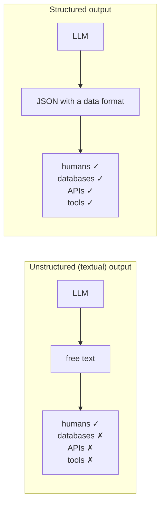

> **Video 7 of 21** (playlist video 5) · [Watch on YouTube](https://www.youtube.com/watch?v=y5EmRr1O1h4)
> Notes follow the video section by section.

## The goal

So far we have learned how to give **input** to an LLM. Today's video, and the next one, are about processing the **output** coming from an LLM.

Until now LLMs have been used to interact with **humans** — humans send messages, the LLM sends messages back, and both understand each other. Today we learn how to make an LLM talk to **other machines** — databases and APIs.

## Unstructured vs structured output

Whenever you talk to an LLM, you send a text input — a prompt — and the LLM processes it and generates a response. That response is generally **text**. Since text has no structure, we call it **unstructured output**.

Ask *"what is the capital of India?"* and you get *"New Delhi is the capital of India."* Unstructured.

Now suppose you give this prompt: *"Can you create a one-day travel itinerary for Paris?"* Generally you get something like:

> Here is a suggested itinerary. In the morning, visit the Eiffel Tower. In the afternoon, visit the Louvre. In the evening, have dinner at a bistro.

Text, so unstructured. **But what if the model gave you output like this instead?**

```json
[
  {"time": "morning",   "activity": "Visit the Eiffel Tower"},
  {"time": "afternoon", "activity": "Visit the Louvre"},
  {"time": "evening",   "activity": "Have dinner at a bistro"}
]
```

Three items stored in three dictionaries, each containing a time and an activity. **That is structured output** — it has a structure.

> Structured output refers to the practice of having language models return responses in a well-defined data format, rather than free-form text. This makes the model output easier to parse and work with programmatically.

The biggest benefit: **you can integrate the LLM with other systems very easily.**

## Three use cases

### 1. Data extraction

You are building a system where the output from the LLM has to be stored somewhere — say a database.

For example, you are building a job portal. People come and upload their résumés, and you want to extract information from each: the candidate's name, their last company, their marks in 10th and 12th, their college marks. You want to store all of it in a database.

The flow: the candidate uploads a résumé, you extract all the text from it, send that text to the LLM, and the LLM extracts the information for you in JSON format. Then you write code on that JSON and insert everything into a database, for every candidate.

### 2. API building

Suppose you run an e-commerce site. Reviews there are quite long and textual — unstructured. You write code that takes an entire review and generates information from it:

- What **topics** is this review talking about? If it is a phone review, maybe battery, display and processor — you extract all those topics.
- The **pros** of the review in one place, and the **cons** in another.
- The overall **sentiment**.

Then, having built an API around this with something like Flask or FastAPI, anyone in the world can access the output.

### 3. Building agents

If you remember, in the second video of the playlist agents were described as chatbots on steroids — chatbots can only talk, agents can perform tasks. Agents need **tools** to do their work.

Suppose we create a maths-based agent with a **calculator** tool. If you tell the agent to find the square root of two, you **cannot** directly send the text *"find the square root of two"* to the calculator, because the calculator expects numbers.

So you run structured output on the message the agent receives and fetch those numbers. Now you send that information to the calculator, the calculator does its work, and gives it to you.

**All the tools you use with agents require structured output; they cannot work with textual data.** Later, when you learn to create agents, you will remember this video a lot.



## Two types of LLM

Before coding, one distinction to be clear about.

- Some LLMs **can** generate structured output by default — they are trained such that if you talk to them, they can produce it. OpenAI's GPT models, for example.
- Some LLMs **cannot** — many open-source models.

In LangChain you can work with both:

| | Can produce structured output | Cannot |
|---|---|---|
| Approach | the **`with_structured_output`** function | **output parsers** |
| Covered in | this video | the next video |

**Output parsers** are classes written in LangChain with which you can structure the unstructured output of any LLM.

## `with_structured_output`

The flow you have seen so far, with one small change. Before invoking the model, you call `with_structured_output` and specify your data format.

```python
structured_model = model.with_structured_output(Schema)
result = structured_model.invoke(text)
```

There are three ways to specify the data format: **TypedDict**, **Pydantic** and **JSON Schema**. All three are covered, along with when to use which.

## Way 1 — TypedDict

### What a TypedDict is

> A TypedDict is a way to define a dictionary in Python where you specify what keys and values should exist. It helps ensure that your dictionary follows a specific structure.

Until now in Python you created a dictionary on the go — the name of the person is this, the age is that. The problem: tomorrow, if two programmers collaborate on the same file, the other programmer might treat age as a string instead of a number, which could cause issues at run time.

With a TypedDict you first define how your dictionary will look. You create a class specifying in advance that this dictionary contains a name whose value is a string, and an age whose value is an integer.

```python
from typing import TypedDict

class Person(TypedDict):
    name: str
    age: int

new_person: Person = {"name": "Nitesh", "age": 35}

print(new_person)
```

Now your code editor will keep telling you that the value in `name` should be a string and the value in `age` should be an integer. It communicates the data type of the different keys of your dictionary.

:::warning There is no validation
There is **only one problem**: if you do not believe what you are being told, nothing stops you. You are told age is an integer, yet you can still put a string in it. Nobody stops you, your code runs, and **no error is generated**.

So remember: a TypedDict only **tells** you it should be an integer. If you give it a string, it does not stop you.
:::

### Using it for structured output

The problem statement: we have some phone reviews. We send a review to the LLM and want a dictionary back with a `summary` key and a `sentiment` key.

```python
# with_structured_output_typeddict.py
from langchain_openai import ChatOpenAI
from typing import TypedDict
from dotenv import load_dotenv

load_dotenv()

model = ChatOpenAI()

# schema
class Review(TypedDict):
    summary: str
    sentiment: str

structured_model = model.with_structured_output(Review)

result = structured_model.invoke("""The hardware is great, but the software feels
bloated. There are too many pre-installed apps that I can't remove. Also, the UI
looks outdated compared to other brands. Hoping for a software update to fix this.""")

print(result)
print(result["summary"])
print(result["sentiment"])
```

You get a **dictionary** back, so you can fetch things from it systematically.

### What is happening behind the scenes

It seems like magic, because nowhere in the prompt did we write that a summary or a sentiment should be generated — yet the model understands.

When you call `with_structured_output` and provide a schema, **a system prompt is generated behind the scenes**, something like:

> You are an AI assistant that extracts structured insights from text. Given a product review, extract a summary — a brief overview of the main points — and the sentiment — the overall tone of the review: positive, neutral or negative. Return the response in JSON format.

That prompt is generated, the review is attached to it, and the whole thing goes to your LLM. Since the LLM returns JSON output, you get something that appears as a dictionary in Python.

It is simple for us, but there is a lot of engineering behind the scenes.

### Annotations — guiding the model

So far we simply ask for a summary and a sentiment, and the LLM is trained on so much data that it understands. But it is possible that sometimes, after reading a single word, it does not understand what to generate.

So you guide it — attach a line which, after reading, tells it exactly what to do. That is an **annotation**.

```python
from typing import TypedDict, Annotated

class Review(TypedDict):
    summary:   Annotated[str, "A brief summary of the review"]
    sentiment: Annotated[str, "Return sentiment of the review, either negative, positive or neutral"]
```

Now it is not only the type going to the model — the **description** goes too. This is done so as not to take a chance: all the information reaches the LLM and it never has to guess.

### A more complex schema

Now take a bigger review. Beyond summary and sentiment we want the **topics** discussed — charging, processor, whatever ideas appear — extracted into a list. And we want all the **pros** in one place and all the **cons** in another. And if pros or cons are not present in the review, they should not be included — so they are **optional**.

```python
from typing import TypedDict, Annotated, Optional, Literal

class Review(TypedDict):
    key_themes: Annotated[list[str], "Write down all the key themes discussed in the review in a list"]
    summary:    Annotated[str, "A brief summary of the review"]
    sentiment:  Annotated[Literal["pos", "neg"], "Return sentiment of the review, either negative (neg) or positive (pos)"]
    pros:       Annotated[Optional[list[str]], "Write down all the pros inside a list"]
    cons:       Annotated[Optional[list[str]], "Write down all the cons inside a list"]
    name:       Annotated[Optional[str], "Write the name of the reviewer"]
```

Three new ideas here:

- **`list[str]`** — because there can be multiple themes, so a list of strings.
- **`Optional[...]`** — because some reviews may not mention pros or cons at all.
- **`Literal["pos", "neg"]`** — suppose you want `POS` or `NEG` entered in your database rather than the full word. With `Literal` you decide between some options, and the LLM will return one of them.

:::note `Optional` is a hint, not a guarantee
Remove the cons from a review and run it — it may still generate cons, because it saw something faintly negative in the text. You would have to prompt better: tell it explicitly that unless cons are mentioned it should not write them.
:::

### The limitation of TypedDict

This method works correctly. There is only one problem: **there is no guarantee**. If you say `summary` should be a string, it is possible your LLM makes a mistake and returns a different data type. Or you say *"show me the rating only if it is more than three"*, and it still shows you the response.

**If you want to apply data validation, you cannot do it here.** A TypedDict is for representation purposes only. For validation there is another option: **Pydantic**.

## Way 2 — Pydantic

### What Pydantic is

> Pydantic is a data validation and data parsing library for Python.

In simple words: if you want to apply certain checks on incoming data, you use Pydantic. That is why, when you use FastAPI to build an API, you use Pydantic there — at the time of creating an API it is very important that the data you process is in the correct type and format, because security matters a lot.

The syntax is very similar to TypedDict; Pydantic is just more powerful.

```python
# pydantic_demo.py
from pydantic import BaseModel, EmailStr, Field
from typing import Optional

class Student(BaseModel):
    name:  str = "Nitesh"
    age:   Optional[int] = None
    email: EmailStr
    cgpa:  float = Field(gt=0, lt=10, default=5, description="A decimal value representing the CGPA of the student")

new_student = {"age": "32", "email": "abc@gmail.com", "cgpa": 5}

student = Student(**new_student)

print(student)
print(student.name)

student_dict = dict(student)
print(student_dict["age"])

student_json = student.model_dump_json()
```

Walking through what Pydantic adds over TypedDict:

**Validation.** If you declare `name: str` and pass an integer, it raises — *"input should be a valid string"*. The data does not agree with us, so we throw an error and stop the code. You could not do this with a TypedDict.

**Default values.** Write `name: str = "Nitesh"` and if no value is passed, the default is set.

**Optional fields.** Import `Optional` from typing. `age: Optional[int] = None` means the value may be absent; you **must** specify the default, otherwise it will not work.

**Type coercion.** Pydantic tries to understand what data you sent it. If `age` should be an integer but arrives as the string `"32"`, Pydantic is smart enough to understand it is a number in string format and does implicit type conversion behind the scenes — you get an integer. In Python this is called **type coercing**.

**Built-in validation.** `EmailStr` is a data type built into Pydantic. Send `abc` and it immediately raises — *"this value is not a valid email address"*. Change it to `abc@gmail.com` and it validates, so your object is created.

**The `field` function.** With it you can do many things:

- **Constraints** — `Field(gt=0, lt=10)` means CGPA must be greater than 0 and less than 10. Pass 12 and it throws an error.
- **Default values** — via the `default` parameter.
- **Descriptions** — `description="A decimal value representing the CGPA of the student"`. This does exactly the same thing as the annotation in TypedDict: when sent to the LLM, the description goes along and makes its work easier.
- **Regular expressions** — for something like a phone number, attach a regex so that if the pattern is not followed the value is not accepted.

**Conversion.** When the object is created it is a Pydantic object, but you can convert it to a Python dictionary with `dict(student)` or to JSON with `model_dump_json()`. It is up to you whether you want JSON, a dictionary, or to work with Pydantic objects.

### Using it for structured output

Take the same code from the TypedDict example and replace the schema.

```python
# with_structured_output_pydantic.py
from langchain_openai import ChatOpenAI
from typing import Optional, Literal
from pydantic import BaseModel, Field
from dotenv import load_dotenv

load_dotenv()

model = ChatOpenAI()

class Review(BaseModel):
    key_themes: list[str] = Field(description="Write down all the key themes discussed in the review in a list")
    summary:    str       = Field(description="A brief summary of the review")
    sentiment:  Literal["pos", "neg"] = Field(description="Return sentiment of the review, either negative (neg) or positive (pos)")
    pros: Optional[list[str]] = Field(default=None, description="Write down all the pros inside a list")
    cons: Optional[list[str]] = Field(default=None, description="Write down all the cons inside a list")
    name: Optional[str]       = Field(default=None, description="Write the name of the reviewer")

structured_model = model.with_structured_output(Review)

result = structured_model.invoke("""...the review text...""")

print(result.name)
print(result.model_dump())
```

:::warning Attribute access, not a dictionary subscript
What comes back is a **Pydantic object**, not a dictionary. So `result["name"]` produces an error — you have to use `result.name`, the syntax you use in object-oriented programming. If you want dictionary syntax, convert it to a dictionary first.
:::

This is more powerful than a TypedDict, and most likely you will use it more later.

## Way 3 — JSON Schema

You use JSON Schema when your project is **not being built in just one language** — you have multiple languages. For example, Python for your backend and JavaScript for your frontend, and you need the schema in both places. You cannot use Pydantic or TypedDict there, so you use JSON Schema, because JSON is a universal data format any language can understand.

A JSON schema needs a few important things:

1. **`title`** of the schema
2. **`description`** — optional, but useful for the work we are doing
3. **`type`** — which data type the whole schema is. Since it will appear as a Python dictionary, in JSON it is called `object`
4. **`properties`** — all your attributes
5. **`required`** — the names of attributes that must be included

```python
json_schema = {
  "title": "Review",
  "type": "object",
  "properties": {
    "key_themes": {
      "type": "array",
      "items": {"type": "string"},
      "description": "Write down all the key themes discussed in the review in a list",
    },
    "summary": {
      "type": "string",
      "description": "A brief summary of the review",
    },
    "sentiment": {
      "type": "string",
      "enum": ["pos", "neg"],
      "description": "Return sentiment of the review, either negative (neg) or positive (pos)",
    },
    "pros": {
      "type": ["array", "null"],
      "items": {"type": "string"},
      "description": "Write down all the pros inside a list",
    },
    "cons": {
      "type": ["array", "null"],
      "items": {"type": "string"},
      "description": "Write down all the cons inside a list",
    },
    "name": {
      "type": ["string", "null"],
      "description": "Write the name of the reviewer",
    },
  },
  "required": ["key_themes", "summary", "sentiment"],
}

structured_model = model.with_structured_output(json_schema)
```

Note the vocabulary differences from Pydantic: **`array`** instead of list, **`enum`** instead of `Literal`, and **`"type": ["array", "null"]`** for optional fields.

The object you get here is a **Python dictionary**, just like with a TypedDict.

## Which to use when

| | **TypedDict** | **Pydantic** | **JSON Schema** |
|---|---|---|---|
| Type hints | ✅ | ✅ | ✅ |
| Data validation | ❌ | ✅ | ❌ |
| Automatic type conversion | ❌ | ✅ | ❌ |
| Default values | ❌ | ✅ | ✅ |
| Cross-language compatibility | ❌ | ❌ | ✅ |
| Returns | dict | object | dict |

**Use TypedDict** when you can use Python across the whole project and you do not have to share your schema with anyone in another language — you only need type hints. Generally, this rarely happens.

**Use Pydantic** when you need data validation, or default values because the LLM may refuse to send a value, or automatic type conversion. In real-world scenarios this is the common case.

**Use JSON Schema** when you need cross-language compatibility.

Since we mostly work in the Python universe, **Pydantic is the go-to format** whenever we need to define a schema.

## The `method` parameter

In `with_structured_output` there is a **`method`** parameter that tells the model how you want the structured output. It takes two values:

- **`json_mode`** — when you want the structured output in JSON format. True most of the time.
- **`function_calling`** — when you want the structured output in JSON because you want to **call a function**. This is what you use when you create agents whose agent calls a tool like a calculator.

**Rule of thumb:** if you are working with OpenAI models, `function_calling` is recommended and is in fact the default. If you are working with other models like Claude or Gemini, you can use `json_mode`, because those models support JSON for structured output.

## When a model cannot do this at all

Some models support neither mode. Take the code we wrote to extract JSON from a review, replace `ChatOpenAI` with `ChatHuggingFace`, and use the open-source **TinyLlama** model. When you run it and call `with_structured_output`, **the code throws an error**.

The reason: TinyLlama does not support structured output — neither JSON mode nor function calling. For such models you have to add **output parsers** yourself, which is the topic of the next video.

## Checklist

- [ ] I can explain why unstructured output blocks database, API and tool integration
- [ ] I can name the three use cases for structured output
- [ ] I can write a schema three ways
- [ ] I know why TypedDict does not validate, and what Pydantic adds
- [ ] I know what `Annotated`, `Literal` and `Optional` each contribute
- [ ] I know the difference between accessing a Pydantic result and a dict result
- [ ] I can pick the right approach for a given project
- [ ] I know what happens when a model cannot produce structured output
