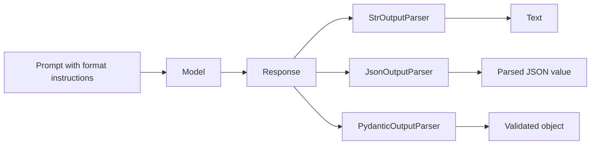

> **Video 8 of 21** (playlist video 6) ·
> [Watch on YouTube](https://www.youtube.com/watch?v=Op6PbJZ5b2Q) Notes follow
> the video section by section. This video is deeply connected to the previous
> one — watch that first.

## Recap of the previous video

The previous video covered structured output. Whenever you talk to an LLM the
response is textual, and textual means unstructured. Since it is unstructured,
you cannot send it to another system such as a database or an API.

That is where structured output comes in: you force your LLM to give structured
output instead of textual output — output with some kind of structure or schema,
for example JSON. Once you have JSON you can send it very easily to a database
or an API.

It was also explained that you get two types of LLM:

- Models that **can** give structured output — fine-tuned such that if you ask
  for it, you get it. For these we used **`with_structured_output`** and worked
  with GPT models.
- Models that **cannot** — generally the open-source models, which are not
  fine-tuned to give structured output in response.

**Today's video is about working with models that cannot produce structured
output on their own.** What helps us there are **output parsers**.

## What output parsers are

> Output parsers in LangChain help convert raw LLM responses into structured
> formats like JSON, CSV, Pydantic models and more. They ensure consistency,
> validation and ease of use in applications.

The basic concept: output parsers are classes written in LangChain that let you
work with **any** type of LLM and derive structured output from it.

:::note Do not get confused
You can make output parsers work with **both** kinds of model — those that provide structured output by default, and those that do not. Both are shown in this video, with GPT models and with open-source models, and you will see how seamlessly parsers work with both.
:::

Although LangChain has many output parsers, four are the most commonly used:

1. **StringOutputParser**
2. **JSONOutputParser**
3. **StructuredOutputParser**
4. **PydanticOutputParser**

Others exist — CSV output parser, list output parser, and different parsers for
different data formats — but in most use cases you will use one of these four.

### How the parser changes the model response

These branches are alternative parser choices. Reading valid JSON and validating its values against a schema are separate operations.



## 1. StringOutputParser

The simplest output parser. Its function is very simple: it takes the response
of the LLM, converts it to a string, and gives it to you. That is it.

You have seen in past videos that whenever we interact with a chat model we get
not just a textual response but a lot of metadata — token usage, completion
tokens, audio tokens. That is why we always print `result.content` to see the
actual textual response.

With the StringOutputParser you do not need to print `result.content` separately
— you get the textual response in string format directly.

### But why bother?

A fair objection: _if I can print `result.content` very easily, why do I need a
separate output parser?_ It is important to understand why it is useful and in
what scenarios.

**The use case.** We want to talk to our LLM twice:

1. Give the LLM a topic and have it create a **detailed report** on it.
2. Send that detailed report **back** to the same LLM and have it summarise the
   report **in five lines**.

Let us build it both ways and compare side by side.

### Without a parser

```python
# without_parser.py
from langchain_huggingface import ChatHuggingFace, HuggingFaceEndpoint
from langchain_core.prompts import PromptTemplate
from dotenv import load_dotenv

load_dotenv()

llm = HuggingFaceEndpoint(
    repo_id="TinyLlama/TinyLlama-1.1B-Chat-v1.0",
    task="text-generation",
)
model = ChatHuggingFace(llm=llm)

# 1st prompt -> detailed report
template1 = PromptTemplate(
    template="Write a detailed report on {topic}",
    input_variables=["topic"],
)

# 2nd prompt -> summary
template2 = PromptTemplate(
    template="Write a 5 line summary on the following text. /n {text}",
    input_variables=["text"],
)

prompt1 = template1.invoke({"topic": "black hole"})
result = model.invoke(prompt1)

prompt2 = template2.invoke({"text": result.content})
result1 = model.invoke(prompt2)

print(result1.content)
```

:::warning Free APIs are not reliable
Running this against the Hugging Face API can produce a **read timeout error** — the API does not respond. That is the problem with free APIs. The code itself is fine; if it fails for you, run it on your machine or switch to `ChatOpenAI`, which is what the rest of the demo uses. Another open-source model on the API may also work.
:::

Notice what you have to do: invoke the template, extract the prompt, invoke the
model, **extract `result.content` manually**, invoke the second template, invoke
the model again, extract content again.

### With StringOutputParser

```python
# string_output_parser.py
from langchain_openai import ChatOpenAI
from langchain_core.prompts import PromptTemplate
from langchain_core.output_parsers import StrOutputParser
from dotenv import load_dotenv

load_dotenv()

model = ChatOpenAI()

template1 = PromptTemplate(
    template="Write a detailed report on {topic}",
    input_variables=["topic"],
)

template2 = PromptTemplate(
    template="Write a 5 line summary on the following text. /n {text}",
    input_variables=["text"],
)

parser = StrOutputParser()

chain = template1 | model | parser | template2 | model | parser

result = chain.invoke({"topic": "black hole"})

print(result)
```

The most common usage of StringOutputParser is **with chains**. Follow the flow:

1. Template 1 receives the topic — _black hole_ — and produces a prompt.
2. That prompt goes to the model, which processes it and gives a result. There
   is a lot of metadata in that result; we only need the text.
3. **The parser** extracts the detailed report as a string.
4. That string goes into template 2, producing the second prompt.
5. The model generates a five-line summary, again with metadata.
6. **The parser** extracts just the summary.

Compare the two codes side by side and you realise this is a much easier way to
build this application.

**Why was this possible? Because of the parser.** Without parsers you could not
create this chain — you would have to extract the result from the model and then
create a second chain separately. The parser sits in between, extracts the
string output, and passes it to the next step.

And remember: this code works not only with `ChatOpenAI` but with the Hugging
Face API, and even with a model downloaded locally.

## 2. JSONOutputParser

From the name you understand what it does: it **forces an LLM to send its output
in JSON format**. If you are expecting JSON, this is the quickest possible way
to get it.

```python
# json_output_parser.py
from langchain_openai import ChatOpenAI
from langchain_core.prompts import PromptTemplate
from langchain_core.output_parsers import JsonOutputParser
from dotenv import load_dotenv

load_dotenv()

model = ChatOpenAI()

parser = JsonOutputParser()

template = PromptTemplate(
    template="Give me the name, age and city of a fictional person \n {format_instruction}",
    input_variables=[],
    partial_variables={"format_instruction": parser.get_format_instructions()},
)

prompt = template.format()
print(prompt)

result = model.invoke(prompt)

final_result = parser.parse(result.content)

print(final_result)
print(type(final_result))
```

Two new ideas here, and both recur in the parsers that follow.

**`get_format_instructions()`.** Whenever you use the JSON output parser — or
the two we read next — you send **additional instructions** in the prompt about
what kind of output you would like from your LLM. Those instructions are told to
you by the parser itself, through this function.

Print the prompt and you see: _"give me the name, age and city of a fictional
person"_, then a line break, then the format instruction — _"return a JSON
object"_. That came from the function call.

You could have written _"we need a JSON object in return"_ yourself, but this is
a better way, because going forward the parsers we read next use exactly this
same code format.

**`partial_variables`.** We call the format instruction a partial variable
because it is **not** filled at run time — the user does not tell us. It gets
filled **before** run time, with this function call.

### The shorter way — using a chain

You do not need to write so much code. Instead of the three lines for prompt,
model and parse:

```python
chain = template | model | parser

result = chain.invoke({})

print(result)
```

All the work happens automatically: the template is created, the prompt is
formed, it is passed to the model, the result comes back, and it is parsed —
when you use this syntax the `parse` method is called automatically behind the
scenes.

:::warning `invoke` always needs a dictionary
There is an error you will hit here: *missing one positional argument: input*. Even though we have no input variables, when you call `.invoke()` you **have** to send a dictionary. Either send some value inside it, or — if you have no input variables — send a **blank dictionary**. Then the error does not appear.
:::

### The biggest problem with JSONOutputParser

**You cannot enforce a schema.** You get a JSON object, but you cannot tell it
what the structure of that object will be — the LLM decides.

For example, change the template to _"give me five facts about \{topic\}"_ and
send `black holes`. The output is a JSON object, but structured as a single item
— `facts about black holes` — with all the facts in a list underneath.

But what if you wanted a structure like `fact_1`, `fact_2`, `fact_3` as keys
with the respective facts as values? **That cannot work.** The JSON output
parser does not give you that flexibility. You can specify a little in the
template, but there is no guarantee you get the format you want.

For that you need another output parser.

## 3. StructuredOutputParser

> StructuredOutputParser is an output parser in LangChain that helps extract
> structured JSON data from LLM responses based on predefined field schemas.

The only difference from the JSON output parser is that **here you provide a
schema**. You tell the LLM in advance that you want a response according to this
particular schema, and it responds accordingly. **This is the biggest benefit.**

```python
# structured_output_parser.py
from langchain_openai import ChatOpenAI
from langchain_core.prompts import PromptTemplate
from langchain.output_parsers import StructuredOutputParser, ResponseSchema
from dotenv import load_dotenv

load_dotenv()

model = ChatOpenAI()

schema = [
    ResponseSchema(name="fact_1", description="Fact 1 about the topic"),
    ResponseSchema(name="fact_2", description="Fact 2 about the topic"),
    ResponseSchema(name="fact_3", description="Fact 3 about the topic"),
]

parser = StructuredOutputParser.from_response_schemas(schema)

template = PromptTemplate(
    template="Give 3 facts about {topic} \n {format_instruction}",
    input_variables=["topic"],
    partial_variables={"format_instruction": parser.get_format_instructions()},
)

chain = template | model | parser

result = chain.invoke({"topic": "black hole"})

print(result)
```

You build the schema with the **`ResponseSchema`** class, sending a list of
schema objects — each with a name and a description.

:::note A different import path
If you look for `StructuredOutputParser` inside `langchain_core`, you will **not** find it. It is in **`langchain`**, the main umbrella library.

Why? Because `langchain_core` holds the most important, most-used components of LangChain. `StructuredOutputParser` was not considered as important as the JSON output parser, so it was kept in the wider library. Always remember: `langchain_core` is the small library holding the most-used components of the overall big library.
:::

### The downside of StructuredOutputParser

**You cannot perform data validation.** You can only specify the structure in
which you want the JSON.

Suppose your schema says: give me the name of a person, the city of a person,
and the age of a person. You wanted name and city to be strings and age to be an
**integer**. But in the response you get, age says `"35 years"` — obviously a
string. You have no way to stop this. You can write it in the prompt, but if the
LLM still sends that output you have to accept it or process it manually
yourself.

So its biggest feature is that it **enforces the schema** and forces the LLM to
give a structure — but no data validation. And that is why we use the fourth
output parser.

## 4. PydanticOutputParser

> PydanticOutputParser is a structured output parser in LangChain that uses
> Pydantic models to enforce schema validation when processing LLM responses.

Here, when forming a schema, you pass a **Pydantic object** in place of the
schema. Since it is a Pydantic object you can not only enforce the schema but
also **validate your data**. That is the best part.

Core features:

- **Strict schema enforcement** — you can strictly specify which data type and
  what constraints there should be, and all of it is followed
- **Type safety** — if the data type comes out a little wrong from the LLM, type
  constraints can fix it
- **Easy validation**
- **Seamless integration** with other components

The example: ask for a person's name, age and city in JSON format, with the
constraint that **age must always be an integer and greater than 18**.

```python
# pydantic_output_parser.py
from langchain_openai import ChatOpenAI
from langchain_core.prompts import PromptTemplate
from langchain_core.output_parsers import PydanticOutputParser
from pydantic import BaseModel, Field
from dotenv import load_dotenv

load_dotenv()

model = ChatOpenAI()

class Person(BaseModel):
    name: str = Field(description="Name of the person")
    age:  int = Field(gt=18, description="Age of the person")
    city: str = Field(description="Name of the city the person belongs to")

parser = PydanticOutputParser(pydantic_object=Person)

template = PromptTemplate(
    template="Generate the name, age and city of a fictional {place} person \n {format_instruction}",
    input_variables=["place"],
    partial_variables={"format_instruction": parser.get_format_instructions()},
)

chain = template | model | parser

final_result = chain.invoke({"place": "Sri Lankan"})

print(final_result)
```

`PydanticOutputParser` is available in **`langchain_core`**, because it is a
very reusable component.

### What the prompt actually looks like

Print the assembled prompt and you understand what is going on behind the
scenes. First comes _"Generate the name, age and city of a fictional Indian
person"_. Then everything beyond that is **the parser's format instruction** —
telling the LLM that the output should be formatted as a JSON instance
conforming to the JSON schema below, followed by the schema derived from your
Pydantic class, some technical explanation, and an example.

That whole thing goes to the LLM, the response comes back, we parse it, and we
get the output. **This is how a model with no native JSON support still produces
conforming output.**

### A valid JSON object can still fail validation

Suppose a review must have a rating from 1 to 5, but the model returns 9. The
response can be perfectly valid JSON while still being unusable by our
application. This small example isolates that difference without making a model
call.

```python
from pydantic import BaseModel, Field
from langchain_core.output_parsers import JsonOutputParser, PydanticOutputParser
from langchain_core.exceptions import OutputParserException

class Review(BaseModel):
    summary: str
    rating: int = Field(ge=1, le=5)

raw_response = '{"summary": "Good camera", "rating": 9}'

# Valid JSON: the parser can read it as a dictionary.
print(JsonOutputParser().invoke(raw_response))

# Invalid review: rating 9 breaks the schema's upper limit.
parser = PydanticOutputParser(pydantic_object=Review)
try:
    review = parser.invoke(raw_response)
    print(review)
except OutputParserException:
    print("The rating must be between 1 and 5.")
```

The first parser accepts the object because it checks the representation. The
second rejects it because the Pydantic schema checks the allowed values.
**Parsing successfully and validating successfully are two different outcomes.**
This is an additional practice example of the distinction explained above.

## Summary of the four parsers

| Parser                     | Use it when                                                       | The problem with it       |
| -------------------------- | ----------------------------------------------------------------- | ------------------------- |
| **StringOutputParser**     | you need string output from your LLM — generally used with chains | nothing structured        |
| **JSONOutputParser**       | you need JSON output                                              | does not enforce a schema |
| **StructuredOutputParser** | you need structured JSON following a schema you specify           | no data validation        |
| **PydanticOutputParser**   | you need structured JSON **and** validation                       | Python-only schemas       |

One more thing to remember: **you can run all this code with any LLM.** The
demos here used the Hugging Face API and `ChatOpenAI`, but you can also use
Claude or Gemini. It is applicable in both places.

## Other parsers

There are many other parsers. Look inside `langchain.output_parsers` and you
will find a comma-separated list parser, a CSV one, a list output parser, a
Markdown one, a numbered list parser, an XML output parser, an enum output
parser, a datetime parser, and an **output fixing parser** — for when the
response does not come correctly in one go and you want to fix it.

Go and study the documentation a little. The main idea is covered here; the goal
was not to teach every output parser. Once you understand the basic concept,
self-study fills in the rest.

## Checklist

- [ ] I can explain why `StrOutputParser` earns its keep despite
      `result.content`
- [ ] I can build a two-call chain with a parser between the steps
- [ ] I can explain `get_format_instructions()` and `partial_variables`
- [ ] I know to pass `{}` to `invoke` when there are no input variables
- [ ] I can name each parser's limitation
- [ ] I know why `StructuredOutputParser` lives in `langchain` and not
      `langchain_core`
- [ ] I can print the assembled prompt and explain what the parser injected
