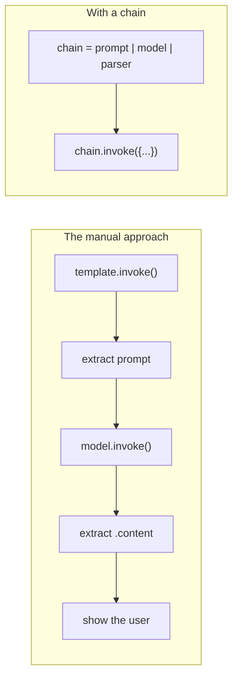
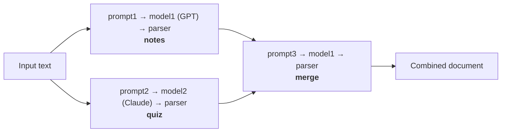

> **Video 9 of 21** (playlist video 7) · [Watch on YouTube](https://www.youtube.com/watch?v=5hjrPILA3-8)
> Notes follow the video section by section.

## Recap

So far this playlist has covered two important components. First **models**, where we discussed how to interact with different types of AI model. Then **prompts**, where we learned how to send different types of input to the LLM. Apart from that we learned how to generate **structured output**, and in the process, the concept of **output parsers**.

Today and the next video are both on the **chains** component. Today: the fundamentals of chains — what they are, why they are needed, and how to create three different types. The next video covers the working behind chains, which requires the concept of **runnables**.

## What chains are and why they are needed

If you are building applications using LLMs, you will notice that your application is made up of **small steps**.

Take a very simple application: you take a prompt from the user, send it to the LLM, then show the response to the user. Three steps:

1. Ask for a prompt from the user
2. Send that prompt to the LLM
3. When the response comes back, process it and show it in the output

Whenever you create any LLM-based application there will be multiple smaller steps that you combine.

**The problem:** executing all these steps individually takes a lot of effort — as we have been doing until now. We design the prompt with a prompt template, ask for input from the user, call `invoke` to get our prompt, then call the LLM's `invoke` and manually insert the prompt, then the LLM sends us output, then we extract the content part and show it.

That is a very **manual** approach, where we create and handle each component ourselves. This becomes a problem if you are building a large and complex application.

**This is where chains come into the picture.**

Chains are a method that allows you to create **pipelines**. You connect all the small steps in your application and create a pipeline. The biggest feature of that pipeline: **the output of the first step automatically serves as input for the second step**, and the output of the second step serves as input for the third, and so on.

Once you have created the pipeline, you simply provide input at the first step and **trigger** it. The first step executes automatically, its output becomes the input of the second step, the second is triggered, and so on. In the end you get your output. You do not need to work manually with all these components.



And that is not even the best thing. That was just one way to create a pipeline — a **linear, sequential** one. You can create pipelines of different structures:

- **Parallel chains** — execute things in parallel
- **Conditional chains** — put a condition on the input and execute different chains based on it

Very complex structures are possible. Today we build all three: **sequential**, **parallel** and **conditional**. Learn these three and you can build any complexity quickly.

## Common chain types

The following table captures the chain types in the supplied reference image.

| Chain name | Description |
| --- | --- |
| `LLMChain` | Calls an LLM with a prompt template. For example, take a topic and generate an explanation. |
| `SequentialChain` | Runs multiple chains in a defined sequence, passing named outputs into later steps. Supports multiple input and output variables. |
| `SimpleSequentialChain` | A simpler sequential pipeline where each step has one input and one output. For example, topic → outline → explanation. |
| `ConversationalRetrievalChain` | Combines conversation history with document retrieval to answer follow-up questions using relevant context. |
| `RetrievalQA` | Retrieves relevant documents and passes their content to an LLM to answer a question. |
| `RouterChain` | Selects a destination chain based on the input, such as routing a question to billing or technical support. |
| `MultiPromptChain` | Routes an input to one of several prompt-specific chains, such as a maths tutor or a writing assistant. |
| HyDE chain — Hypothetical Document Embeddings | Generates a hypothetical answer or document, embeds it, and uses that embedding to retrieve real documents. The generated text is a retrieval aid, not verified evidence. |
| Agent executor chain | Runs an agent's decision-and-tool loop, executing selected tools and returning their results to the agent until it finishes. |
| `SQLDatabaseChain` | Converts a natural-language question into SQL, queries a database, and uses the results to produce an answer. |

:::note Names and versions
The image uses `HydeChain` and `AgentExecutorChain` as labels. The corresponding LangChain API names are [`HypotheticalDocumentEmbedder`](https://reference.langchain.com/python/langchain-classic/chains/hyde/base/HypotheticalDocumentEmbedder) and [`AgentExecutor`](https://reference.langchain.com/python/langchain-classic/agents/agent/AgentExecutor).

Several names in this table belong to older LangChain APIs. For example, `LLMChain` is deprecated in favour of runnable composition such as `prompt | model | parser`. The examples below teach that LCEL approach. See the [LangChain classic API reference](https://reference.langchain.com/python/langchain-classic/agents/agent).
:::

## A very simple chain

Three steps: ask the user for a prompt, send it to an LLM, display the response properly.

```python
# simple_chain.py
from langchain_openai import ChatOpenAI
from langchain_core.prompts import PromptTemplate
from langchain_core.output_parsers import StrOutputParser
from dotenv import load_dotenv

load_dotenv()

prompt = PromptTemplate(
    template="Generate 5 interesting facts about {topic}",
    input_variables=["topic"],
)

model = ChatOpenAI()

parser = StrOutputParser()

chain = prompt | model | parser

result = chain.invoke({"topic": "cricket"})

print(result)
```

The `|` is the **pipe operator**. This method of forming a chain — connecting components with the pipe operator — is called **LCEL**, the **LangChain Expression Language**. It is a very declarative syntax for showing that your pipeline starts with the prompt, then comes the model, then comes the parser.

Once you have created your chain, you simply **invoke** it — trigger it — and you provide only the input required at the **first** step, which here is the topic.

What happens behind the scenes: the input goes to the prompt, the prompt's `invoke` is called automatically and we get our prompt — *"generate five interesting facts about cricket"*. That prompt goes to the model, the model's `invoke` is called automatically, and a response comes back with a lot of metadata. All of that goes to the parser, whose `invoke` (or `parse`) is called, and in return we get just a string.

If you have seen the previous lectures you can appreciate how simple this has become. Earlier we invoked the prompt separately, invoked the model separately, and extracted the content separately. Now everything executes through a single line.

### Visualising the chain

You can also visualise your chain:

```python
chain.get_graph().print_ascii()
```

You will be able to see the steps: prompt input came, it filled the prompt template, from there the model was called, and whatever output came after sending the prompt went to the string output parser — and the output of the string output parser is what we see.

## A longer sequential chain

Now something a little more complex, calling the LLM **twice**.

The application: ask the user for a topic — say cricket. Send that topic to an LLM with a prompt saying we need a **detailed report** on that topic. Then send the detailed report back to the same LLM with a second prompt saying we need the **five most important points** extracted — in a way, summarising the report.

```python
# sequential_chain.py
from langchain_openai import ChatOpenAI
from langchain_core.prompts import PromptTemplate
from langchain_core.output_parsers import StrOutputParser
from dotenv import load_dotenv

load_dotenv()

prompt1 = PromptTemplate(
    template="Generate a detailed report on {topic}",
    input_variables=["topic"],
)

prompt2 = PromptTemplate(
    template="Generate a 5 pointer summary from the following text \n {text}",
    input_variables=["text"],
)

model = ChatOpenAI()

parser = StrOutputParser()

chain = prompt1 | model | parser | prompt2 | model | parser

result = chain.invoke({"topic": "Unemployment in India"})

print(result)

chain.get_graph().print_ascii()
```

Everything executes step by step, one after the other — your chain is simply a little longer than the first.

## A parallel chain

Now something more interesting. The user gives us some text — imagine a big document on a topic in the machine learning domain, say a detailed explanation of linear regression. We take this document and generate **two** things from it:

1. **Notes** from the document
2. A **quiz** from the document

Then we combine the two and show them to the user.

To build this we use parallel chains. The user provides a large document. We send the text to **model 1** — OpenAI's GPT — which generates notes. At the same time, in parallel, we take a **second model** — Claude — which generates the quiz. Then we send both to a third model, merge them, and display the result.



```python
# parallel_chain.py
from langchain_openai import ChatOpenAI
from langchain_anthropic import ChatAnthropic
from langchain_core.prompts import PromptTemplate
from langchain_core.output_parsers import StrOutputParser
from langchain.schema.runnable import RunnableParallel
from dotenv import load_dotenv

load_dotenv()

model1 = ChatOpenAI()
model2 = ChatAnthropic(model="claude-3-5-sonnet-20241022")

prompt1 = PromptTemplate(
    template="Generate short and simple notes from the following text \n {text}",
    input_variables=["text"],
)

prompt2 = PromptTemplate(
    template="Generate 5 short question answers from the following text \n {text}",
    input_variables=["text"],
)

prompt3 = PromptTemplate(
    template="Merge the provided notes and quiz into a single document \n notes -> {notes} \n quiz -> {quiz}",
    input_variables=["notes", "quiz"],
)

parser = StrOutputParser()

parallel_chain = RunnableParallel({
    "notes": prompt1 | model1 | parser,
    "quiz":  prompt2 | model2 | parser,
})

merge_chain = prompt3 | model1 | parser

chain = parallel_chain | merge_chain

text = """...your long document..."""

result = chain.invoke({"text": text})

print(result)

chain.get_graph().print_ascii()
```

We develop the chain in **two parts**: first the parallel part, then the merging part, and then we join them.

To make a parallel chain you need **`RunnableParallel`**. In it you can execute any number of parallel chains simultaneously — you provide a **dictionary** and put your chains inside it, giving each a name. Here the first chain is called `notes` and the second `quiz`.

Then the merge chain is simple, because it is sequential. And by combining the parallel chain and the merge chain you create the final chain.

**Now you can see the power of chains** — you are able to create bigger chains by joining chains. That is the main power: you can connect multiple chains.

:::tip A note on model names
When running this, an error appeared because the Claude model name was wrong. Model names change; go to the provider's website, check the current model list and copy the exact name from there.
:::

## A conditional chain

The application: a user gives us **feedback** about one of our products — imagine we are an e-commerce company. We want to find out whether it is positive or negative sentiment. If positive, we respond in kind — *"thank you for your kind words."* If negative, we generate an appropriate response.

This is not a very special application on its own, but it becomes a good one if you develop it like an agent. If the sentiment is positive, the agent could give the customer a feedback form asking for a five-star rating — instantly increasing your reviews. If negative, it could immediately send an email to customer support, who then contact the consumer.

Since we have not learned agents or tools yet, we keep it simple. The main idea here is showing how to create **conditional chains**.

```mermaid
flowchart TB
    F["User feedback"] --> C["prompt1 → model → PydanticOutputParser<br/>classify sentiment"]
    C -->|positive| P["prompt2 → model → parser<br/>positive response"]
    C -->|negative| N["prompt3 → model → parser<br/>negative response"]
    C -->|neither| D["default: 'could not find sentiment'"]
```



Two important things: only **one** of the two paths executes — never both together, as in a parallel chain.

### Part 1 — classification

```python
from langchain_openai import ChatOpenAI
from langchain_core.prompts import PromptTemplate
from langchain_core.output_parsers import StrOutputParser, PydanticOutputParser
from pydantic import BaseModel, Field
from typing import Literal
from dotenv import load_dotenv

load_dotenv()

model = ChatOpenAI()
parser = StrOutputParser()

prompt1 = PromptTemplate(
    template="Classify the sentiment of the following feedback text into positive or negative \n {feedback}",
    input_variables=["feedback"],
)

classifier_chain = prompt1 | model | parser

print(classifier_chain.invoke({"feedback": "This is a terrible smartphone"}))
```

Run it and you get `negative`. So the classification is happening. **There is only one problem.**

### The problem, and why structured output is needed

There is **no guarantee** that the LLM will return exactly `negative` here. It is possible it returns a sentence — *"the sentiment is negative"*, or *"this is a positive sentiment"*, or something else entirely. We have no control over the output of an LLM.

Right now it is classifying correctly, but in some scenario it may give some other output. **And our next branch depends on this thing.**

So we have to ensure the output here is **consistent**: positive always means `positive` — not sometimes lowercase, sometimes capitalised, sometimes a full sentence. Same for negative.

For that we structure the output, using a **Pydantic output parser**:

```python
class Feedback(BaseModel):
    sentiment: Literal["positive", "negative"] = Field(description="Give the sentiment of the feedback")

parser2 = PydanticOutputParser(pydantic_object=Feedback)

prompt1 = PromptTemplate(
    template="Classify the sentiment of the following feedback text into positive or negative \n {feedback} \n {format_instruction}",
    input_variables=["feedback"],
    partial_variables={"format_instruction": parser2.get_format_instructions()},
)

classifier_chain = prompt1 | model | parser2

result = classifier_chain.invoke({"feedback": "This is a terrible phone"}).sentiment
print(result)
```

Now it always gives structured output, and the value of sentiment is **either** `positive` **or** `negative`. Nothing else can come.

### Part 2 — branching

To create branching we need one more thing: **`RunnableBranch`**. Just as `RunnableParallel` lets you execute chains in parallel, `RunnableBranch` lets you execute chains using if/else logic.

**What you do in a `RunnableBranch`:** you send multiple **tuples**. In each tuple you pass two things — first the **condition**, second **which chain to execute when that condition is true**. Then, finally, if none of your conditions are met, you provide a **default chain**. It is like `if / elif / else`.

```python
from langchain.schema.runnable import RunnableBranch, RunnableLambda

prompt2 = PromptTemplate(
    template="Write an appropriate response to this positive feedback \n {feedback}",
    input_variables=["feedback"],
)

prompt3 = PromptTemplate(
    template="Write an appropriate response to this negative feedback \n {feedback}",
    input_variables=["feedback"],
)

branch_chain = RunnableBranch(
    (lambda x: x.sentiment == "positive", prompt2 | model | parser),
    (lambda x: x.sentiment == "negative", prompt3 | model | parser),
    RunnableLambda(lambda x: "could not find sentiment"),
)

chain = classifier_chain | branch_chain

print(chain.invoke({"feedback": "This is a beautiful phone"}))

chain.get_graph().print_ascii()
```

Understanding the lambda: we run a function that receives an input `x`, and **`x` is the output that came from the classifier chain** — the Pydantic object with the sentiment attribute. So we say: if `x.sentiment` is positive, execute this chain; if negative, execute that one.

:::note Why `RunnableLambda` on the default
We also have to provide a default chain. For the default we just run a simple lambda function that returns *"could not find sentiment"* — no processing, input in, output out.

**There is only one problem: that is not a chain.** You have to execute a chain here. So we convert the lambda function into a **runnable** using `RunnableLambda`. Just as `RunnableParallel` and `RunnableBranch` are runnables, `RunnableLambda` is one too — and its speciality is that it converts a lambda function into a runnable. Once converted, you can use it as a chain.
:::

Run it and, for a terrible phone, you get an apologetic response; for a beautiful phone, a thank-you. Print the graph and you see the branching, with only one branch executed.

## What comes next

We have learned what chains are, why they are needed, and how to make three types — sequential, parallel and conditional. You will use these in many places in future, including when you make agents.

The one thing that must be bothering you is the concept of **runnables** — what a runnable is, how it is connected to chains, how chains work behind the scenes, and what the whole idea of LangChain Expression Language is. All of that is decoded in the next video, and you will appreciate today's video more afterwards.

## Checklist

- [ ] I can explain why the manual approach does not scale
- [ ] I can build a simple chain with the pipe operator and name that syntax
- [ ] I can build a longer sequential chain with two LLM calls
- [ ] I can build a parallel chain with `RunnableParallel` and merge the branches
- [ ] I can explain why conditional chains need structured output
- [ ] I can build a conditional chain with `RunnableBranch` and a default
- [ ] I know why the default needs `RunnableLambda`
- [ ] I can visualise any chain with `get_graph().print_ascii()`
