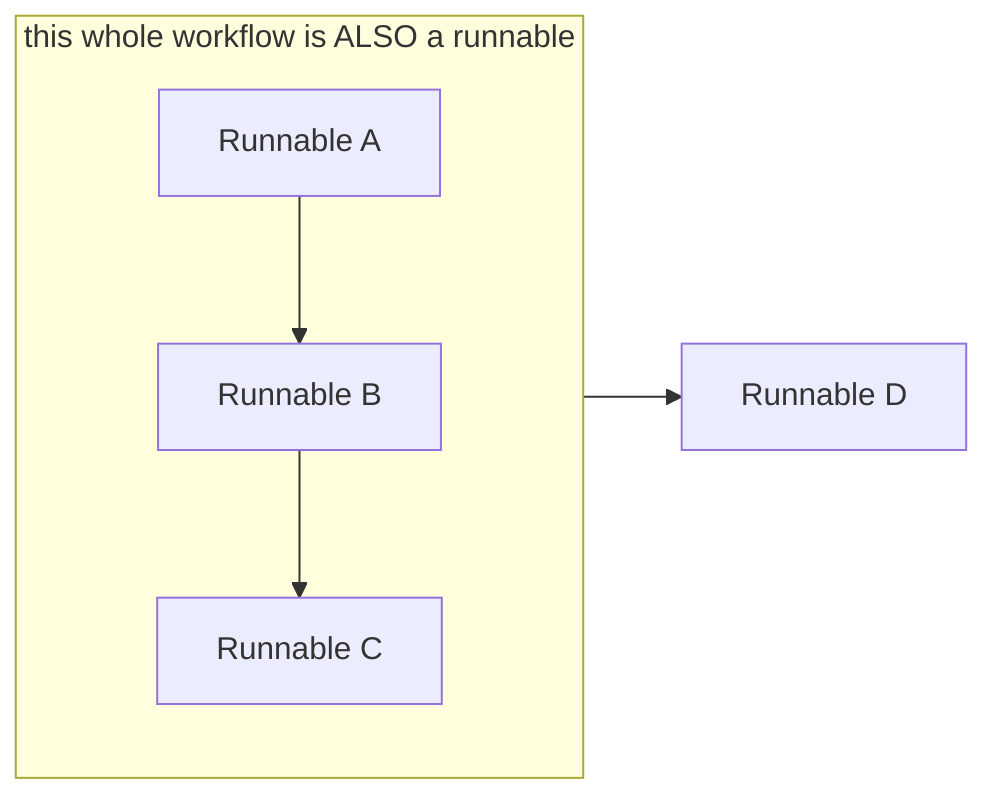

> **Video 10 of 21** (playlist video 8) · [Watch on YouTube](https://www.youtube.com/watch?v=u3b-W1NgYa4)
> Notes follow the video section by section. This is a technical video; understanding it gives you a much deeper understanding of LangChain.

## Recap

The last video covered chains inside LangChain — what they are, why they are needed, and how to make three different types: sequential, parallel and conditional.

Today we read a concept called **runnables**. Runnables matter because chains work behind the scenes precisely *because* they are made with the help of runnables. If you do not know the concept of runnables, you cannot understand chains as well, and you will not be able to use them properly.

## Why runnables exist — the flashback

To understand what runnables are and why they exist, we have to go into a little history.

### 2022 — the opportunity

Around November 2022 ChatGPT released, and around the same time OpenAI opened its API to the general public, so you could interact with it and create your own LLM-based applications.

Around this time the LangChain team realised that in the future, LLM-based applications were going to be in great demand — because LLMs are powerful, they can understand text and give relevant replies, and many applications would use them.

And that turned out to be right. Today every company has its own chatbot, which is really an LLM-based application. Many PDF readers exist where you can not only read a PDF but ask questions of it. Many AI agents have come to market doing their work with LLMs.

So the LangChain team felt: if demand for building such applications is going to increase, a **framework** should be created that makes building LLM-based applications easier.

### Problem 1 — every API is different

The team observed that OpenAI is just one company making LLMs. There were others — Anthropic, Google, Mistral — gradually coming to market with their own LLMs.

The problem: **each company's API behaves differently.**

So the team thought: what if we create a framework that can talk to any company's LLM API? They built LangChain, and inside it they built classes so you could talk to any company's LLM API with **minimal code changes**.

**First problem solved.** LangChain became popular and people started using it to build LLM-based applications.

### Problem 2 — talking to an LLM is only a small part

Then the team identified another problem. When people build LLM-based applications, they interact with LLMs through APIs — but **interacting with the LLM is a small part of building the entire application**. There is a lot of other work.

Take a PDF reader. You execute many tasks:

- Load the PDF — it may be on the cloud, so you bring it in
- Split it into small parts — by chapter, by page, by paragraph
- Generate the embedding of each part
- Store those embeddings in a database — a vector database
- Use a retriever for future searches, performing semantic search to extract the most relevant chunk
- Send the most relevant chunk to the LLM, get the response back
- Parse it and show it to the user

Talking to the LLM is only **one** component. There are many other important components.

So the team realised: what if we help developers with the rest as well? Then LangChain becomes a more powerful framework and more people adopt it.

That is what they did. They reviewed different kinds of LLM application, broke them down into individual components, and wrote helper classes for all of them:

- **Document loaders** for loading documents
- **Text splitters** for splitting data
- Different **embedding model** components
- **Vector database** and **retriever** components
- **Parsers** for parsing output
- A **memory** component

Now LangChain had support not only for talking to an LLM but for everything else required to build an LLM application. That made it a very powerful library.

As a developer you could pick up all these components, put them together, and create any type of LLM-based application.

**Two code examples show how easy this made things:** a simple LLM application using just the LLM component and the prompt template component, and a full PDF reader — text loader, recursive character text splitter, vector store, retriever, LLM — built in roughly 36 lines of code. Such a complex application, that little code.

So far the story goes very smoothly. The LangChain team created individual components, and AI engineers connect them in different ways to build different applications.

### The Eureka moment — chains

Then the LangChain team noticed something interesting. When AI engineers connect components in different ways, **some things are common** across every kind of LLM application.

A common thing: you create a prompt, and then you send that prompt to an LLM. That task appears in **all** types of LLM application — whether you are building a chatbot, a PDF reader, or an AI agent. You will definitely make a prompt and send it to an LLM.

And the idea came: **this is being done manually by AI engineers.** You create a prompt template, create an LLM, call `format` on the template to generate the actual prompt, then send that prompt to the LLM's `predict` function, then get the result. All of it hand-coded.

**What if we automate this task?** What if there is a built-in function where you just send your LLM and your prompt template, and behind the scenes the function generates the prompt from the template, sends it to the LLM, and brings the result directly? Then the work of AI engineers becomes easier, because another level of abstraction has arrived.

That is where **chains** came from. You are connecting two or more components and giving them the form of a pipeline. The simplest of these was named **`LLMChain`** — you provide an LLM and a prompt, the prompt gets generated and sent to the LLM.

Using the chain, the manual work disappeared. You do not call `format` manually, you do not call `predict` manually. You simply run the chain, tell it your topic, and behind the scenes everything is generated and the result comes back.

**And this was a big Eureka moment.** That is a very simple chain — but the team saw that much more complex tasks are also reused across different kinds of LLM application. What if those complex tasks also became built-in chain functions?

**Take the PDF reader task** — essentially implementing RAG. In any RAG application you definitely perform **retrieval**: a user gives you a query, you search that query across your entire vector database, and find out which chunk it relates to.

For example, an entire machine learning book covered page by page, with page embeddings stored in a vector database. A query comes: *"what are the five assumptions of linear regression?"* Clearly this relates to linear regression. So rather than searching the whole book, you first search which part the query applies to, and it turns out to be the linear regression chapter.

That is retrieval. You have a query, you have a vector database with your documents, you extract relevant text, and then you combine the relevant text and the query into a new prompt saying *"from these relevant documents, answer this query"*, and send it to the LLM.

**That task appears in every RAG application.** So the team made a chain for it too: **`RetrieverQAChain`**. You call the function and tell it just two things — your LLM and your retriever — and all the work happens automatically behind the scenes. Where you needed 36 lines, now you need 32.

This idea made LangChain very popular. And the team did not stop at `LLMChain` and `RetrievalQAChain` — they analysed many more use cases, and wherever they felt a task was used everywhere, they built a chain function for it.

Ten of the most-used chains, and this is not the complete list:

- **`SimpleSequentialChain`** — you combine two or more `LLMChain`s into one big chain. For example, generate a joke from a topic, then generate an explanation of that joke — talking to the LLM twice.
- **`SequentialChain`** — again combining multiple LLM chains, but here you can work with multiple inputs and multiple outputs.
- A separate chain for working with **SQL databases**
- An **API chain** for working with APIs
- An **LLMMathChain** for maths-problem-based work

### Problem 3 — the chain explosion

What the team did not anticipate is that they were walking into a big problem.

Over time they created **too many chains**. Many use cases kept appearing and they made a chain to solve every one. Go to LangChain's documentation and you will see how many chains there are.

Having so many chain functions has **two major disadvantages**:

1. **The codebase became very large.** A very large codebase is problematic, because now you have to actively maintain it.
2. **The learning curve became very steep.** New AI engineers learning LangChain could not figure out which chain existed for which use case. With 50 kinds of chain available, you have to know when to use each — and that takes a long time to learn.

So where the team felt chains were a very powerful concept that would make LangChain a very powerful library, after some time the whole thing turned upside down. The codebase became heavy, and learning LangChain became difficult for new AI engineers.

It is a bit funny: the team wanted to help AI engineers, but in the process of helping they dropped an axe on their own feet and made learning LangChain harder.

### The diagnosis — the components were never standardised

Why did this happen?

The team had created many components — a separate component for LLMs, a separate one for prompts, and many more. They wanted AI engineers to plug these components into each other seamlessly and create flexible workflows of any type. **Like Lego blocks:** each component is treated as a block, and you combine blocks in any way to form any structure.

That was the goal. But to achieve it they resorted to chains, and then a lot of chains, which made the code heavy and the learning curve steep.

**The real reason they had to make so many chains:** all these components — LLMs, prompts, parsers, retrievers — **were not standardised**. They did not follow the same set of rules. They were developed independently and behaved in different ways.

| Component | Method used to interact with it |
|---|---|
| LLM | `predict()` |
| Prompt template | `format()` |
| Retriever | `get_relevant_documents()` |
| Parser | `parse()` |

The components were never designed so that they connect seamlessly with each other. So when the team was under pressure to connect two or more components, they had to write **manual functions** for it. Connect an LLM and a prompt? Write custom code — a function called `LLMChain`. Connect retrieval-related things? Write a `RetrievalQAChain`.

Since the components were not compatible with each other, the team had to write custom code to create compatibility — and that code took the shape of a function. And they had to do this repeatedly, writing new custom code and a new function for every new use case.

**Ideally**, all the components would follow the same standards, and following the same standards you could connect them seamlessly without writing custom code. Then there would be no need to write custom functions like this.

**That was the big mistake:** when they created these components, they did not make them standardised. And that is why, when it later came to making chains, a lot of custom code and custom functions had to be written.

Finally the team realised the mistake and understood that all these components would have to be rebuilt, this time ensuring they are standardised and connect seamlessly with others.

**And how is that possible? With the help of runnables.**

## What runnables are

In very simple words, you can call a runnable **a unit of work**.

Every runnable in LangChain has a purpose — it does one job. You give it an input, it processes that input, and it returns an output. That is the **first** characteristic.

**The second characteristic:** every runnable follows a **common interface**, which means every runnable has the same set of methods. The most popular is **`invoke`** — you pass an input and it gives an output. Similarly there is **`batch`**, with which runnables can process multiple inputs simultaneously and give multiple outputs. And **`stream`**, with which you can get streaming output.

**The third:** since all runnables are made from a common interface, **you can connect runnables together** and get any complexity of workflow executed. If you have runnable R1 and runnable R2, they are designed so you can connect them — and the biggest advantage is that **automatically the output of R1 acts as the input for R2**. Add R3, and the output of R2 acts as the input for R3.

**The fourth:** when you connect runnables and create a workflow, **that workflow is itself a runnable**. Make one workflow from R1, R2 and R3, and another from R4 and R5 — both workflows are runnables, which means **you can connect those two as well**. And that is the best part of the whole concept: you can form a structure of any size by connecting things.



### The Lego analogy

If you want to understand runnables visually, imagine **Lego blocks**. They follow exactly these four principles.

1. **A unit of work.** In one Lego kit you get different blocks — a single one, a wedge one, a U-shaped one, an L-shaped one. Each block has its own purpose, just like a runnable.
2. **A common interface.** Lego blocks may have different structures, but they follow the same interface — those connecting studs on top appear on all of them.
3. **Connectable.** The way you connect runnables to each other is the way you connect Lego blocks.
4. **Closed under composition.** When you connect Lego blocks and form a structure, **that resultant structure is itself a Lego block**, because it also has the interfaces. So you can connect two structures and create something more complex.

Exactly the same things happen in the runnables universe of LangChain.

## Building it from scratch

The best way to get the real feel is to code it by hand.

### Step 1 — two unstandardised components

First we create a dummy LLM component that AI engineers would use to interact with any LLM. It is not a real-world component — it is a dummy.

```python
import random
from abc import ABC, abstractmethod


class NakliLLM:
    def __init__(self):
        print("LLM created")

    def predict(self, prompt):
        response_list = [
            "Delhi is the capital of India",
            "IPL is a cricket league",
            "AI stands for Artificial Intelligence",
        ]
        return {"response": random.choice(response_list)}
```

A real LLM class will not look like this, but it behaves in the same shape: you call `predict`, you get a response back. (Randomly chosen here, so do not expect the logical answer.)

Now the second component, a prompt template:

```python
class NakliPromptTemplate:
    def __init__(self, template, input_variables):
        self.template = template
        self.input_variables = input_variables

    def format(self, input_dict):
        return self.template.format(**input_dict)
```

Using both together:

```python
template = NakliPromptTemplate(
    template="Write a {length} poem about {topic}",
    input_variables=["length", "topic"],
)

prompt = template.format({"length": "short", "topic": "India"})

llm = NakliLLM()

print(llm.predict(prompt))
```

**This is the initial step we discussed:** we have some components, and AI engineers connect them manually by writing code and building their application.

### Step 2 — a chain class

Now put yourself in the shoes of the LangChain team. Create an `LLMChain` class that connects these two components so the AI engineer's work becomes easier.

```python
class NakliLLMChain:
    def __init__(self, llm, prompt):
        self.llm = llm
        self.prompt = prompt

    def run(self, input_dict):
        final_prompt = self.prompt.format(input_dict)
        result = self.llm.predict(final_prompt)
        return result["response"]


template = NakliPromptTemplate(
    template="Write a {length} poem about {topic}",
    input_variables=["length", "topic"],
)

llm = NakliLLM()

chain = NakliLLMChain(llm, template)

print(chain.run({"length": "short", "topic": "India"}))
```

Now you do not need to create the prompt separately, format it separately, and call `predict` separately. Both are handled automatically in this single function call.

**But here is where the team realised this was not the right way.** This chain class is **not flexible**.

Believe it: this chain only makes a **two-step** chain. Suppose you had to generate a joke first and then generate an explanation of the joke — two calls to the LLM. **You cannot make those two calls with the help of this chain.**

Think for yourself what code you would write inside `run` so that your code is flexible enough to make any number of calls to the LLM. If you think about it, you will realise it is very difficult.

**And that is why this chain is not flexible enough to create any kind of workflow.**

**The problem comes from the fact** that the way to interact with your prompt template class is `format`, and the way to interact with the LLM class is `predict`. We have to **standardise** these two classes — only then can we make flexible chains.

### Step 3 — the Runnable abstraction

We need standardised components, so that all of them have the same methods, and the most important of those is `invoke`.

There is a very solid way to make sure of that in object-oriented programming: **abstraction**. We create an abstract class called `Runnable`, and all our component classes inherit it. Automatically all our component classes become runnables. And in the abstract class there will be methods we are **forced** to implement in the component classes. That is how we make sure everyone has a common structure.

```python
from abc import ABC, abstractmethod


class Runnable(ABC):
    @abstractmethod
    def invoke(self, input_data):
        pass
```

Now make `NakliLLM` inherit from it:

```python
class NakliLLM(Runnable):
    def __init__(self):
        print("LLM created")

    def invoke(self, prompt):
        response_list = [
            "Delhi is the capital of India",
            "IPL is a cricket league",
            "AI stands for Artificial Intelligence",
        ]
        return {"response": random.choice(response_list)}

    def predict(self, prompt):
        print("WARNING: this method is deprecated and will be removed. Use invoke instead.")
        return self.invoke(prompt)
```

:::note Try it without `invoke` first
If you inherit `Runnable` but do **not** implement `invoke`, Python throws an error: *cannot instantiate abstract class with abstract method invoke*. That is the enforcement mechanism at work.
:::

**Should `predict` be removed?** Not exactly. It is possible that older AI engineers are still using `predict` in their code, and removing it directly would break their code. So ideally you print a message saying the method is going to be deprecated and they should call `invoke` instead. The output still appears correctly, but with a warning.

Do the same with the prompt template:

```python
class NakliPromptTemplate(Runnable):
    def __init__(self, template, input_variables):
        self.template = template
        self.input_variables = input_variables

    def invoke(self, input_dict):
        return self.template.format(**input_dict)

    def format(self, input_dict):
        print("WARNING: this method is deprecated and will be removed. Use invoke instead.")
        return self.invoke(input_dict)
```

Both components are now standardised, both are runnables, and the way to talk to them is `invoke`.

### Step 4 — one connector for all of them

Now, to connect them, we create another class whose purpose is to chain two or more components together.

```python
class RunnableConnector(Runnable):
    def __init__(self, runnable_list):
        self.runnable_list = runnable_list

    def invoke(self, input_data):
        for runnable in self.runnable_list:
            input_data = runnable.invoke(input_data)
        return input_data
```

Understand what happens. Suppose you create an object of this class with your prompt template and your LLM — so the list has two runnables. We run a loop over the list. The first time, we take the first runnable — the prompt — and call its `invoke`, giving it the input data. The prompt does its work and generates the final prompt, and we **store that output back into `input_data`**.

The loop runs again. The next runnable is the LLM, so we call its `invoke` — and what does it receive as input data? **The output of the previous step.** That is how, very smartly, we form a chain: we put the output of the previous step into the input of the next step. When the loop ends we return the final output.

```python
template = NakliPromptTemplate(
    template="Write a {length} poem about {topic}",
    input_variables=["length", "topic"],
)

llm = NakliLLM()

chain = RunnableConnector([template, llm])

print(chain.invoke({"length": "long", "topic": "India"}))
```

### Adding a third component

The interesting thing: you can chain **any number** of components with this same code. Add a string output parser:

```python
class NakliStrOutputParser(Runnable):
    def __init__(self):
        pass

    def invoke(self, input_data):
        return input_data["response"]


parser = NakliStrOutputParser()

chain = RunnableConnector([template, llm, parser])

print(chain.invoke({"length": "long", "topic": "India"}))
```

Now instead of the entire dictionary, only the string comes back. Step one formed the prompt, it went to the LLM, the LLM predicted in dictionary form, and the parser extracted the string.

**In this way you can make a chain of any length. You do not need to create custom functions.**

### Connecting chains to chains

Now the fourth principle. We connect two chains and make a bigger chain.

A simple application. **Chain one** generates a joke about a topic — a prompt template with the topic, sent to the LLM, which generates the joke. **Chain two** takes that joke as input and generates its explanation. Then we connect the two.

```python
template1 = NakliPromptTemplate(
    template="Write a joke about {topic}",
    input_variables=["topic"],
)

template2 = NakliPromptTemplate(
    template="Explain the following joke {response}",
    input_variables=["response"],
)

llm = NakliLLM()
parser = NakliStrOutputParser()

chain1 = RunnableConnector([template1, llm])
chain2 = RunnableConnector([template2, llm, parser])

final_chain = RunnableConnector([chain1, chain2])

print(final_chain.invoke({"topic": "cricket"}))
```

Nothing new was needed. The code already existed. **We just coded from scratch a very powerful idea:** we created the components, standardised them with the runnable interface, and now we can form chains of any length — and multiple chains can be exchanged among themselves.

## This is not a toy

Open LangChain's actual code and look at the `ChatOpenAI` class we have been using all along. You will find the inheritance chain:

```text
ChatOpenAI
  → BaseChatOpenAI
    → BaseChatModel
      → BaseLanguageModel
        → RunnableSerializable
          → Runnable      ← our abstract class
```

And if you scroll down inside `Runnable`, you will see an **`invoke` method** that is an **abstract method**, just like ours — with no code written inside it. Any class inheriting `Runnable` has to implement that `invoke` method, which is why it appears inside every class.

LangChain demonstrates the same work in a more complex way, but **the whole story is the same** as the one told here.

## What comes next

The next video explores runnables a bit more — the actual runnable classes and the primitives built on top of them.

## Checklist

- [ ] I can tell the history: components → chains → chain explosion → diagnosis → runnables
- [ ] I can explain why the components were not standardised, with the four method names
- [ ] I can state the four properties of a runnable
- [ ] I can explain the Lego analogy against all four properties
- [ ] I can implement a `Runnable` abstract class and a connector from scratch
- [ ] I can explain why a hand-written `LLMChain` class is not flexible
- [ ] I can trace the `ChatOpenAI` inheritance down to `Runnable`
