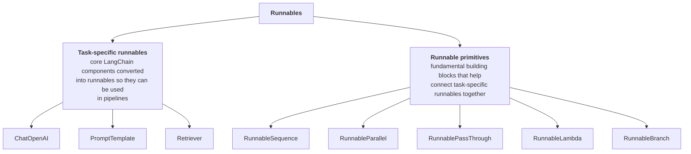
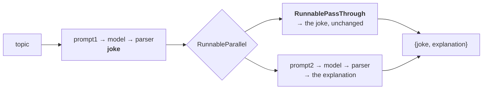
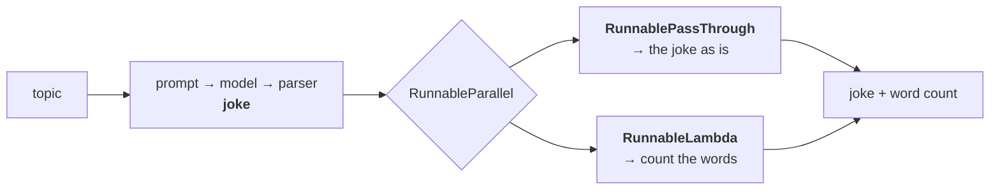

> **Video 11 of 21** (playlist video 9) · [Watch on YouTube](https://www.youtube.com/watch?v=47nc0n-e4_w)
> Notes follow the video section by section. Part 2 of the runnables topic.

## Recap

The previous video told the whole journey of LangChain. When it started, the team built all the components needed for LLM applications — prompt templates for designing prompts, an LLM component for talking to any LLM, parsers for parsing output, retrievers, and many more. AI engineers could plug and play these components to create different LLM-based applications.

But there was a big problem: **the components were not standardised.** They did not follow the same set of rules, and the way of talking to them was different — `format` for prompt templates, `predict` for LLMs, `parse` for parsers, `get_relevant_documents` for retrievers. Because of that it was difficult to connect them together, and AI engineers had trouble creating flexible workflows.

The LangChain team identified this and decided to standardise everything. They implemented a rule that the function used to talk to all these components would be named **`invoke`**. The technique used to bring that standardisation is called **runnables**: an abstract class was created, all the component classes inherit it, and since they inherit it they have to implement `invoke` and the other methods. Automatically all components became standardised — and the advantage is that you can connect them in any way and create any number of flexible workflows.

## Two categories of runnable

Before today's topic, you need to understand that runnables divide into two categories.



### Task-specific runnables

> These are core LangChain components that have been converted into runnables so that they can be used in pipelines.

In very simple words: the components of LangChain — prompt templates, LLMs, retrievers, parsers — were standardised with the help of runnables. Basically, we **converted these components into runnables**.

These components have a purpose of their own. The purpose of the prompt template is to help design prompts. The purpose of the LLM component is to help interact with LLMs. We converted them into runnables so we can connect them well with each other. **That type of runnable is a task-specific runnable.**

Examples: `ChatOpenAI`, which we have been using a lot — it is a component, and at the same time a task-specific runnable. `PromptTemplate` likewise. Retrievers, which we will read about going forward, likewise.

### Runnable primitives

> These are fundamental building blocks for structuring execution logic in AI workflows. They help orchestrate execution by defining how different runnables interact — sequentially, in parallel, or conditionally.

Runnable primitives are **runnables that help connect other task-specific runnables together**, so you can create complex AI workflows.

If you remember the previous video, we created our own runnables — a fake LLM component, a fake prompt template, a fake string output parser. Those classes are all runnables, and all **task-specific**, because each has its own purpose.

Then, later in that video, we created a new runnable called the **`RunnableConnector`**, whose purpose was to connect all those task-specific runnables sequentially. Any number of them, in a sequence. **That `RunnableConnector` is a runnable primitive** — it helps you create the workflow.

LangChain has a lot of primitives like this: `RunnableSequence`, `RunnableParallel`, `RunnableBranch`, `RunnableLambda`, `RunnablePassThrough`. Their job is to let you create very complex AI workflows by orchestrating different types of task-specific runnable.

**Today's video is completely about runnable primitives** — all five, one by one, with what they are for and actual code use cases.

## 1. RunnableSequence

A very important primitive, because with it you can connect two or more runnables **sequentially**.

Suppose you have runnables R1 and R2 — say R1 is your prompt runnable and R2 your LLM runnable. Connect them with `RunnableSequence` and it forms a chain, and automatically the output of the first runnable acts as the input for the second. There is **no restriction** on how many runnables you can connect this way.

This should look familiar — it is exactly what we built ourselves in the last video as the `RunnableConnector`. The same thing exists in LangChain under a different name, and since it is a built-in class you do not need to write that code.

```python
# runnable_sequence.py
from langchain_openai import ChatOpenAI
from langchain_core.prompts import PromptTemplate
from langchain_core.output_parsers import StrOutputParser
from langchain.schema.runnable import RunnableSequence
from dotenv import load_dotenv

load_dotenv()

prompt = PromptTemplate(
    template="Write a joke about {topic}",
    input_variables=["topic"],
)

model = ChatOpenAI()

parser = StrOutputParser()

chain = RunnableSequence(prompt, model, parser)

print(chain.invoke({"topic": "AI"}))
```

You just pass all the runnables in the sequence you want them connected.

### A longer sequential chain

Suppose we go further and want to **explain** the joke as well.

```python
prompt1 = PromptTemplate(
    template="Write a joke about {topic}",
    input_variables=["topic"],
)

prompt2 = PromptTemplate(
    template="Explain the following joke - {text}",
    input_variables=["text"],
)

chain = RunnableSequence(prompt1, model, parser, prompt2, model, parser)

print(chain.invoke({"topic": "AI"}))
```

Six runnables. The final output shows the **explanation** of the joke. The joke itself may have been printed somewhere in between, but we only see the final output.

## 2. RunnableParallel

Just as `RunnableSequence` helps you create sequential chains, `RunnableParallel` helps you create parallel ones.

Suppose you want to take a topic — say AI — and send it to two different LLMs. LLM 1's job is to generate a **tweet** on the topic; LLM 2's job is to generate a **LinkedIn post**. Perhaps LLM 1 is trained on Twitter data and LLM 2 on LinkedIn data. Finally you get both outputs — the tweet in string format and the LinkedIn post in string format — and you post one to X and the other to LinkedIn.

> `RunnableParallel` is a runnable primitive that allows multiple runnables to execute in parallel. Each runnable receives the same input and processes it independently, producing a dictionary of outputs.

**Three things to always remember:**

1. Execution of the chains or runnables happens **in parallel**, independently.
2. Both receive the **same input**.
3. You get the outputs back **in the form of a dictionary**.

```python
# runnable_parallel.py
from langchain_openai import ChatOpenAI
from langchain_core.prompts import PromptTemplate
from langchain_core.output_parsers import StrOutputParser
from langchain.schema.runnable import RunnableSequence, RunnableParallel
from dotenv import load_dotenv

load_dotenv()

prompt1 = PromptTemplate(
    template="Generate a tweet about {topic}",
    input_variables=["topic"],
)

prompt2 = PromptTemplate(
    template="Generate a LinkedIn post about {topic}",
    input_variables=["topic"],
)

model = ChatOpenAI()
parser = StrOutputParser()

parallel_chain = RunnableParallel({
    "tweet":    RunnableSequence(prompt1, model, parser),
    "linkedin": RunnableSequence(prompt2, model, parser),
})

result = parallel_chain.invoke({"topic": "AI"})

print(result["tweet"])
print(result["linkedin"])
```

You initialise `RunnableParallel` in the format of a **dictionary**. The first task is generating the tweet, and to do that you use a `RunnableSequence` — prompt, model, parser. The second is the LinkedIn post, another sequential chain.

So: we created a parallel chain, and inside each branch we created another sequential chain. **And a `RunnableSequence` is itself a runnable**, which is why this nesting works.

Both sequences execute in parallel, and the result comes back as a dictionary with a `tweet` key and a `linkedin` key.

## 3. RunnablePassThrough

Perhaps you can understand a little from the name. This is a special primitive: **whatever input you give it, it gives you the same output in return, as is.** It does not change the input at all and no processing is done on it.

```python
from langchain.schema.runnable import RunnablePassthrough

passthrough = RunnablePassthrough()

print(passthrough.invoke(2))                    # 2
print(passthrough.invoke({"name": "Nitesh"}))   # {'name': 'Nitesh'}
```

**What is the need for such a runnable?** It is useful in certain scenarios.

### The scenario

Remember the `RunnableSequence` example: ask the user for a topic, generate a joke, then send that joke back to the LLM and generate its explanation.

When we ran that entire chain, in the final output **we only saw the explanation.** The joke was not visible — because it was a sequential chain whose last step was to print the explanation.

**Now what if the requirement is to print the joke as well as the explanation?**



First, a **joke generator chain** — prompt, LLM, parser — which produces the joke. Then a **parallel chain** with two paths. On one path, another sequential chain whose job is to generate the explanation from the joke. On the other path, a **`RunnablePassThrough`**.

So: the topic came in, the prompt formed, it went to the LLM, the LLM generated a joke. We send the joke to **both** paths. One asks for an explanation; the other does nothing, so you get the joke printed as it is. **Now you have both outputs.**

```python
# runnable_passthrough.py
from langchain_openai import ChatOpenAI
from langchain_core.prompts import PromptTemplate
from langchain_core.output_parsers import StrOutputParser
from langchain.schema.runnable import RunnableSequence, RunnableParallel, RunnablePassthrough
from dotenv import load_dotenv

load_dotenv()

prompt1 = PromptTemplate(
    template="Write a joke about {topic}",
    input_variables=["topic"],
)

prompt2 = PromptTemplate(
    template="Explain the following joke - {text}",
    input_variables=["text"],
)

model = ChatOpenAI()
parser = StrOutputParser()

joke_gen_chain = RunnableSequence(prompt1, model, parser)

parallel_chain = RunnableParallel({
    "joke":        RunnablePassthrough(),
    "explanation": RunnableSequence(prompt2, model, parser),
})

final_chain = RunnableSequence(joke_gen_chain, parallel_chain)

result = final_chain.invoke({"topic": "cricket"})

print(result["joke"])
print(result["explanation"])
```

A dictionary comes back with the joke first and the explanation second, and you can take each out separately.

## 4. RunnableLambda

A very useful primitive, because with it you can **convert any Python function into a runnable**. And once it is a runnable, it can connect with other runnables to form a chain.

### The scenario

Suppose you are loading customer reviews from your company's database, sending them to an LLM, and the LLM tells you the sentiment of each review. But you realise the reviews in your database are **not clean** — there are HTML tags, punctuation, smileys and emojis — and your LLM is not performing well on that data.

Ideally you should send clean data to the LLM. So you create a function whose job is **pre-processing**: converting to lowercase, removing punctuation, performing lemmatisation — whatever you learned in NLP.

Then you convert it into a runnable with `RunnableLambda`. Since it is now a runnable, you can connect its output directly to your LLM runnable, which is connected to the parser. **Your pre-processing automatically becomes part of the entire workflow** — all because it is no longer a normal Python function, but a runnable.

```python
from langchain.schema.runnable import RunnableLambda

def word_counter(text):
    return len(text.split())

runnable_word_counter = RunnableLambda(word_counter)

print(runnable_word_counter.invoke("hello how are you"))   # 4
```

### A worked example

Take the same joke example: ask for a topic and generate a joke. But at printing time we want not only the content of the joke, but also the **total number of words** in it — and we do not want to ask an LLM for the word count, because LLMs are generally not very good at that work.



```python
# runnable_lambda.py
from langchain_openai import ChatOpenAI
from langchain_core.prompts import PromptTemplate
from langchain_core.output_parsers import StrOutputParser
from langchain.schema.runnable import (
    RunnableSequence, RunnableParallel, RunnablePassthrough, RunnableLambda
)
from dotenv import load_dotenv

load_dotenv()

def word_count(text):
    return len(text.split())

prompt = PromptTemplate(
    template="Write a joke about {topic}",
    input_variables=["topic"],
)

model = ChatOpenAI()
parser = StrOutputParser()

joke_gen_chain = RunnableSequence(prompt, model, parser)

parallel_chain = RunnableParallel({
    "joke":       RunnablePassthrough(),
    "word_count": RunnableLambda(word_count),
})

final_chain = RunnableSequence(joke_gen_chain, parallel_chain)

result = final_chain.invoke({"topic": "AI"})

final_result = """{} \n word count - {}""".format(result["joke"], result["word_count"])

print(final_result)
```

:::tip Two equivalent ways
You can send a named function, as above, or send a lambda function directly:

```python
"word_count": RunnableLambda(lambda x: len(x.split()))
```

Both give exactly the same result. It is called `RunnableLambda` because you can send lambda functions here. The lambda form is cleaner and a little quicker.
:::

**Whenever you feel you need to add custom logic inside a chain, that is where you use `RunnableLambda`.** It is a very powerful thing.

## 5. RunnableBranch

We saw this two videos ago in the chains video: `RunnableBranch` is used to create **conditional chains**. You can consider it the **if/else statement of LangChain's universe**.

### The scenario

Suppose you get an email or a message from a customer, and that email could be feedback, a complaint, or a refund request. You want to process each differently:

- A **complaint** → forward it to your customer support team
- A **refund** request → trigger it on your database
- A **general query** → let your chatbot reply

You receive the email, make a prompt saying *"analyse the content of this email and put it in a category — complaint, general query or refund request"*, and send it to the LLM. The LLM tells you which. Then you add a `RunnableBranch` with three branches, one for each category, and depending on the LLM's classification, one of them triggers.

**The basic principle in a nutshell:** if you ever have conditional logic, where something happens and the next thing depends on it, you use `RunnableBranch`.

### The example

Ask the user for a topic and have the LLM generate a report on it. If the report is **more than 500 words**, ask the LLM to summarise it. If it is less, print it as is.

```python
# runnable_branch.py
from langchain_openai import ChatOpenAI
from langchain_core.prompts import PromptTemplate
from langchain_core.output_parsers import StrOutputParser
from langchain.schema.runnable import (
    RunnableSequence, RunnableBranch, RunnablePassthrough
)
from dotenv import load_dotenv

load_dotenv()

prompt1 = PromptTemplate(
    template="Write a detailed report on {topic}",
    input_variables=["topic"],
)

prompt2 = PromptTemplate(
    template="Summarize the following text \n {text}",
    input_variables=["text"],
)

model = ChatOpenAI()
parser = StrOutputParser()

report_gen_chain = RunnableSequence(prompt1, model, parser)

branch_chain = RunnableBranch(
    (lambda x: len(x.split()) > 300, RunnableSequence(prompt2, model, parser)),
    RunnablePassthrough(),
)

final_chain = RunnableSequence(report_gen_chain, branch_chain)

print(final_chain.invoke({"topic": "Russia vs Ukraine"}))
```

**The syntax of `RunnableBranch`:** you send **tuples** — as many tuples as you have conditions. Inside each tuple are two things: first the **condition**, second a **runnable that will execute if the condition is true**. Finally, when all your conditions are over, there is a **default condition** at the end, which you can call the else condition.

Understanding the condition: `x` is whatever you are getting from the parser — a complete report as a string. We split it, get a list, find the length, and get the number of words. If that is more than the threshold, we trigger the summarising chain. The default behaviour is a `RunnablePassthrough` that takes its input from the parser and passes it on as is.

Run it with a threshold of 500 and the report may be shorter, so the **else** condition triggers and the whole report prints as is. Lower it to 300 and the **if** condition triggers, so the report is summarised first.

## LCEL — LangChain Expression Language

A question based on the whole video: out of these five primitives — Sequence, Parallel, PassThrough, Lambda and Branch — **which do you think is used most?**

You can answer very easily: the **`RunnableSequence`**. It was already being used on its own, it is used inside parallel chains, it appears inside pass-through flows, it is used in branches, it is used with lambdas. It is everywhere.

The creators of LangChain observed the same thing: creating sequential chains with `RunnableSequence` is a very typical use case you see everywhere. So they thought — rather than this syntax, where you create an instance and put `runnable1, runnable2, runnable3` inside it, **what if we replace it with a simpler syntax?**

```python
# Verbose
chain = RunnableSequence(runnable1, runnable2, runnable3)

# Declarative — the same thing
chain = runnable1 | runnable2 | runnable3
```

They made the change, and now you can use this **pipe operator** to create sequential chains. **That is what LCEL is: a declarative way of defining chains.**

:::note LCEL is still growing
Right now the only thing that has happened is that a declarative method has been created for **`RunnableSequence`**. There is a good chance future versions will include a declarative way to define parallel chains as well — and something different for `RunnableBranch`.

This is a nascent stage of the concept, where only sequences are catered for by the pipe operator. Going forward, expect declarative syntax for the rest of the primitives too.
:::

You can go back to the `RunnableBranch` code and replace the `RunnableSequence` calls with the pipe syntax — it works and gives the same output.

**Going forward we will never create chains by calling `RunnableSequence`. We will use the LCEL expression.**

## Checklist

- [ ] I can distinguish task-specific runnables from runnable primitives
- [ ] I can name all five primitives and what each is for
- [ ] I can build sequential and parallel chains with the primitives
- [ ] I can explain the three rules of `RunnableParallel`
- [ ] I can explain why `RunnablePassThrough` is not pointless
- [ ] I can convert any Python function into a runnable
- [ ] I can build a conditional chain and explain the tuple syntax
- [ ] I know what LCEL is and what it currently covers
