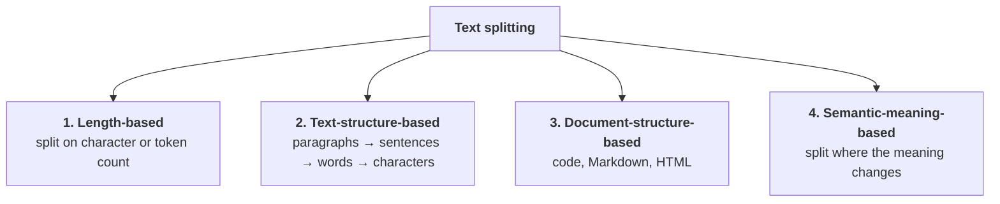
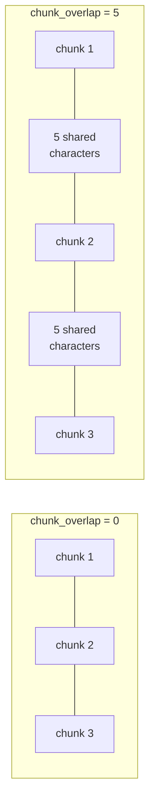
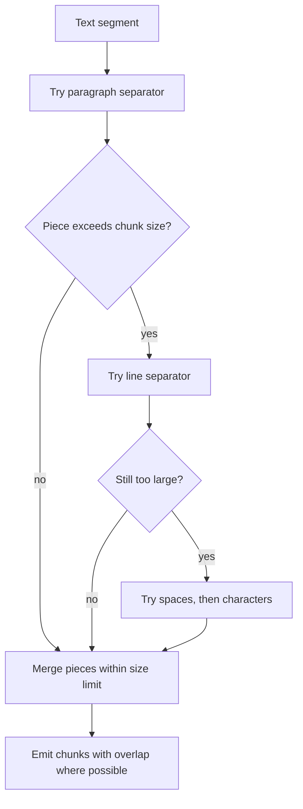
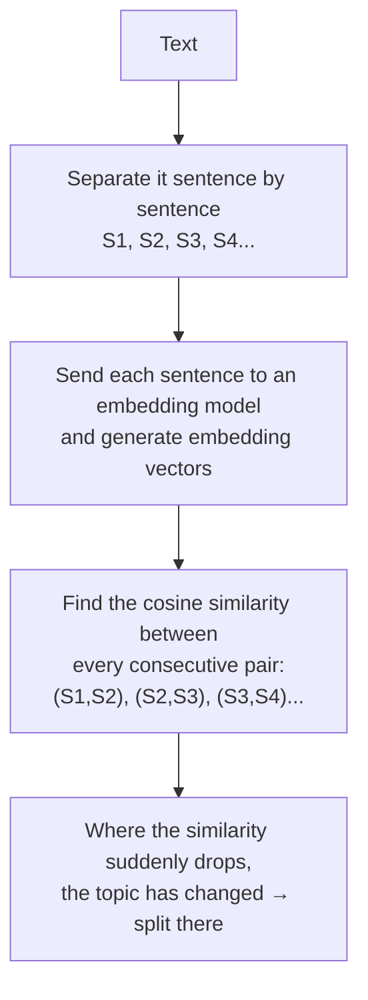

> **Video 13 of 21** (playlist video 11) · [Watch on YouTube](https://www.youtube.com/watch?v=SEWS9P4ODmc)
> Notes follow the video section by section.

## What text splitting is

Suppose you have a very large text file or PDF — thousands of pages — and you have to do some processing on it. Obviously it will be very difficult to process such a large document all at once.

The obvious solution: **divide the whole thing into small chunks.** Perhaps page one becomes one chunk, page two another, and so on. Or use another strategy, such as creating chunks based on paragraphs.

> Text splitting is the process of breaking large chunks of text — like articles, PDFs, HTML pages and books — into smaller, manageable pieces that an LLM can handle effectively.

The code that performs this operation is called a **text splitter**.

It is a big fact in the world of LLMs that **if you want to create any LLM-powered application, you should never try to deal with very large text at once.** In such situations the quality of the output is not that good. It is always recommended to split large text into smaller chunks and feed those to the LLM, which greatly improves output quality.

## Why text splitting is important

Three major reasons.

### 1. It overcomes model limitations

Your LLMs have a **context length limit** — there is a limit on how much text an LLM can receive as input at one time.

Say the context length of a particular LLM is 50,000 tokens. (For this discussion we will treat tokens and words as the same thing, to simplify.) Now you want to send a PDF to this LLM and get it summarised. The problem is that the PDF is very large — thousands of pages, more than 100,000 words. You cannot send it, because you are breaching the context length threshold, and so you cannot summarise your PDF.

> Many embedding models and language models have maximum input size constraints. Splitting allows us to process documents that would otherwise exceed these limits.

### 2. Downstream tasks get better results

When you create an LLM-powered application you perform many kinds of task — embedding, semantic search, text summarisation. **Text splitting gives you better results in all of them.**

**Embedding.** You take text and convert it into numbers or vectors using an embedding model. If you try to embed a very large text, the quality of the embedding is not that good — the vector cannot capture the semantic meaning of the whole text well, because you are trying to capture the meaning of a very large text in a few numbers.

An example: a text about the IPL where every paragraph is about one team — CSK in one, Mumbai in the next, RCB in the next. Generate the embedding of the whole thing together and the vector cannot represent all that meaning well. But divide it — a separate paragraph for CSK, for RCB, for MI — and generate separate embeddings for each. **Those separate embeddings capture the semantic meaning much better.**

**Semantic search.** You have some documents, you generate their embeddings, a query arrives, you embed it and compare. It has been observed again that if you do chunking first and then semantic search, **the quality of your search is much improved** compared to doing semantic search on one large text.

**Summarisation.** It has been noticed that LLMs are not that great with bigger text — sometimes they **drift**, meaning they start talking about something else, or sometimes they say something that is not in the document at all. Again, it is amply proven that with text splitting you get better results in summarisation.

### 3. It optimises computational resources

Processing smaller text needs **less memory**, and you can execute things in **parallel**.

> Working with smaller chunks of text can be more memory-efficient and allow for better parallelisation of processing tasks.

## Four techniques



## 1. Length-based splitting

Honestly the **simplest and fastest** way to split text. You decide in advance what the size of your chunks will be. You can define the size in any unit — characters or tokens.

Say each chunk will be 100 characters. You start traversing the text from the beginning, go up to 100 characters, and create your first chunk there. Then you resume from where you stopped, count 100 more characters, stop again — that becomes chunk two. And so on until whatever is left becomes the final chunk.

```python
# length_based.py
from langchain.text_splitter import CharacterTextSplitter

text = """...your long text..."""

splitter = CharacterTextSplitter(
    chunk_size=100,
    chunk_overlap=0,
    separator="",
)

result = splitter.split_text(text)

print(result)
```

The separator is empty, which means that as soon as we reach 100 characters we split the chunk.

**Its biggest advantage:** conceptually very simple, very easy to implement, and it works very fast.

**Its biggest disadvantage:** while splitting, it looks at **neither the linguistic structure of your text, nor the grammar, nor the semantic meaning**. If it has to stop at 100 characters, it stops at 100 characters — it will not even see that a word is incomplete.

Many times you will notice your text gets cut in the middle of a word, a sentence or a paragraph. That is problematic: you decided on chunks of 400 characters, but the paragraph explaining a particular topic gets cut in the middle. Now, if you generate an embedding from it, it cannot capture the complete semantic meaning, because you have half the information in one chunk and half in another.

**For that reason this method is very fast, but not used much.**

### Working with Documents

```python
from langchain_community.document_loaders import PyPDFLoader

loader = PyPDFLoader("dl-curriculum.pdf")
docs = loader.load()

result = splitter.split_documents(docs)

print(result[0].page_content)
```

Instead of `split_text` you use **`split_documents`**, whose job is to split Document objects. If your PDF had five pages, five Document objects were created, and you send those in. **Every chunk you get back is itself a Document object**, so it has a `page_content` attribute.

This connects the workflows of document loaders and text splitters: you are not only able to load documents, you are able to perform text splitting on them.

## Chunk overlap

There is another important parameter: **`chunk_overlap`**. It tells you **how many characters will overlap between two chunks.**



Raise it from 0 to 5 and you will notice an overlapping region between the two chunks of five characters — those five characters appear in both. Increase it further and the overlapping region grows.

**What is the benefit?** Remember the biggest disadvantage of the character splitter: your text gets cut abruptly, sometimes in the middle of a word, so you **lose context** midway — which is harmful for embedding.

With chunk overlap you can **retain that context**. You are starting the next chunk a little behind, so you save the information that was cut. The main idea is to keep some information similar between two chunks, so the context you were losing by abruptly cutting gets passed on to the next chunk.

**The trade-off:** increase chunk overlap a lot and you have a lot of similar context between chunks, which is good — but then **more chunks are created**, so you have to perform more computation.

**What is a good number?** For text-based applications, **10 to 20 percent** is said to be good. So with a chunk size of 100, a chunk overlap between 10 and 20. As your chunk size increases, your chunk overlap increases accordingly.

## 2. Text-structure-based splitting

This technique considers that any text **inherently follows a structure**. You organise text into paragraphs, within paragraphs into sentences, within sentences into words.

The splitter is called **`RecursiveCharacterTextSplitter`**, and it is one of the most commonly used techniques — you will see a lot of people using it.

You define separators in advance:

| Separator | Represents |
|---|---|
| `"\n\n"` | paragraphs |
| `"\n"` | lines or sentences |
| `" "` | words |
| `""` | characters |

It **first tries to create chunks based on paragraphs.** If a chunk cannot be created on paragraphs, it tries sentences. If not sentences, words. And if not words either, finally at the character level.

**So this algorithm keeps trying all the time to ensure your text does not get split abruptly midway.**

### How recursive splitting chooses a boundary

The splitter tries progressively smaller separators for oversized pieces, then merges pieces within the size limit. Chunk overlap is a target, not a guarantee that every pair shares an identical number of characters.



### A worked trace

Take this text, with character counts written beside each line:

```text
My name is Nitesh.      (17)
I am 35 years old.      (17)

I live in Gurgaon.      (17)
How are you?            (11)
```

Assume **chunk size 10** — none of our chunks should be longer than 10 characters.

**Step 1 — split on paragraphs.** Look for `\n\n`, which denotes the paragraph. The algorithm divides the text into two paragraphs. The first has 34 characters, the second 28. Our allowed chunk size is 10, so both are too big. **We have to break them again.**

**Step 2 — split on sentences.** Now we break on `\n`. From the first paragraph we get two sentences: *"My name is Nitesh"* (17) and *"I am 35 years old"* (17). Both are still greater than the allowed limit, so we must break again.

**Step 3 — split on words.** Going below the sentence, we split on spaces. From *"My name is Nitesh"* we get `My`(2), `name`(4), `is`(2), `Nitesh`(6). Now all four are less than 10.

**Step 4 — optimise by merging.** The splitter sees it was allowed up to 10, but the chunks are 2, 4, 2. So it tries to merge some chunks into a bigger one. It combines `My` and `name` — now 7 characters. It sees `is` and asks whether it can get closer to 10: `My name is` is exactly 10. Then it tries to combine `Nitesh` too — but 10 + 6 = 16, greater than 10, **so it does not do that merging.**

From this branch you finally get two chunks: `My name is` and `Nitesh`.

**The same happens with the next sentence.** *"I am 35 years old"* breaks at word level into `I`(1), `am`(2), `35`(2), `years`(5), `old`(3). Five very small chunks, so it merges: `I am 35` is 5 + 2 white spaces = 7 characters. `years` cannot be added because 7 + 5 = 12. But `years` and `old` can combine — 5 + 3 plus one space = 9. So you get `I am 35` and `years old`.

Repeat for the second paragraph: `I live in` and `Gurgaon`; `How are` and `you?`.

**Final chunks at size 10:** `My name is` / `Nitesh` / `I am 35` / `years old` / `I live in` / `Gurgaon` / `How are` / `you?`

Notice: right to the end, the technique tried to ensure things were **not cut in the middle of a word**. It had to cut midway through sentences because the chunk size was small, but it kept trying — which is better than character splitting.

### Chunk size changes the granularity

**At chunk size 25.** First it breaks on paragraphs, giving 34 and 28 — both greater than 25, so break again. On sentences we get 17, 17 and 17, 11. All below the allowed size, so no further breaking needed. Can we merge? 17 + 17 = 34, not allowed. 17 + 11 = 28, not allowed. **So you get four chunks, one per sentence.**

**At chunk size 50.** Break on paragraphs and you get 34 and 28. Since the chunk size is 50, there is allowance — no need to break further. Can we merge them? 34 + 28 = 62, so no. **You get two chunks, one per paragraph.**

| `chunk_size` | Result |
|---|---|
| 10 | word-level fragments |
| 25 | four chunks — one per sentence |
| 50 | two chunks — one per paragraph |

**The more you increase the chunk size, the more it tries to split on paragraphs. Decrease it and it splits on sentences, then words, then characters.** Make it 1 and it must split on every character; make it 100 and the whole text appears as a single chunk. Use the correct number and it splits the text very well — which is why you will see this technique used the most.

```python
# text_structure_based.py
from langchain.text_splitter import RecursiveCharacterTextSplitter

text = """...your text..."""

splitter = RecursiveCharacterTextSplitter(
    chunk_size=300,
    chunk_overlap=0,
)

chunks = splitter.split_text(text)

print(len(chunks))
print(chunks)
```

:::tip Try it visually
LangChain's documentation hosts an interactive **chunk visualiser**. Paste your text, select which splitter to use, and change the chunk size and chunk overlap to watch the boundaries move. Chunks are colour-coded, so it is immediately obvious what is happening — and you can see the overlap regions directly.
:::

## 3. Document-structure-based splitting

What if you have a document that is **not plain text** — not written in English or Hindi, but in some other format? For example, a piece of code you have to process using an LLM.

Code is text, but it is not normal plain text. It is not organised in paragraphs or sentences — it is organised with **certain keywords**. Python has the `class` construct for class definitions, `def` for functions, loops, and so on.

So we apply the same idea we learned for plain text, but with **different separators**. Here too we use the recursive character text splitter; the only big difference is the separator list. For Python code we use `class` to split classes, `def` to split functions, and when all that is done, the normal text splitting separators at paragraph, line, word and character level.

**So this technique is just an extension of the previous one for special kinds of document.**

You can apply the same thing to **Markdown** — actually a markup language, with which you organise text into headings and lists. Regular text splitting will not work on it either; it has its own separators.

```python
# code_splitting.py
from langchain.text_splitter import RecursiveCharacterTextSplitter, Language

python_code = """...your python code..."""

splitter = RecursiveCharacterTextSplitter.from_language(
    language=Language.PYTHON,
    chunk_size=300,
    chunk_overlap=0,
)

chunks = splitter.split_text(python_code)

print(len(chunks))
print(chunks[0])
```

The only difference: you do not create the object directly — you call **`from_language`**, telling it which language you are using, then chunk size and chunk overlap. The rest is exactly the same.

**In the visualiser**, select Python and a chunk size around 175 and you see good results: the class up to the constructor becomes a chunk, the methods become separate chunks, object creation becomes a separate chunk, and the if/else becomes a separate chunk. At 350, the entire class becomes one chunk.

Do the same with **Markdown** by passing `Language.MARKDOWN`. In the visualiser, a Markdown document with four parts produces 64 chunks at a very small chunk size — not logical. Increase it gradually to 50, 100, 150, and by 175 it is absolutely correct: four chunks matching the four sections.

Many languages are supported — JavaScript, Java, PHP, HTML, Markdown and more.

## 4. Semantic-meaning-based splitting

There are scenarios where **both** the previous methods fail. Consider this text:

```text
Farmers were working hard in the fields, preparing the soil and sowing seeds.
The sun was bright and the air smelled of earth and fresh grass. Meanwhile,
in the IPL, the crowd erupted as the batsman hit a six...

Terrorism poses a serious threat to global stability...
```

Read it and it is clear there are two paragraphs. The second is very clearly about terrorism — fine. **But there is a problem with the first paragraph:** it contains two completely different things. Part of it talks about agriculture and farmers; the rest talks about the IPL. A completely different topic.

Use a text-structure-based technique with a decent chunk size and it divides the text into **two** chunks, the upper paragraph and the lower one. But the upper paragraph discusses two very different things, so when its embedding is generated the quality will not be good.

**Ideally you should have created three chunks:** a separate one for agriculture, a separate one for IPL, and a separate one for terrorism.

**That is what semantic-meaning-based text splitters help with.** You are not making the decision on the basis of the length or the structure of the text — you are making it on the basis of **semantic meaning**. They try to understand the meaning of the text, and where they see that the meaning between two pieces of text is very different, they split.

### How it works



If two sentences are talking about the same topic, the similarity between them will be high. If they are talking about very different topics, the similarity will be low. A **sliding window** approach keeps comparing the similarity between one sentence and the next, and where it feels the similarity has suddenly decreased abruptly, it understands the meaning has changed and a splitting can be performed there.

```python
# semantic_meaning_based.py
from langchain_experimental.text_splitter import SemanticChunker
from langchain_openai import OpenAIEmbeddings
from dotenv import load_dotenv

load_dotenv()

text_splitter = SemanticChunker(
    OpenAIEmbeddings(),
    breakpoint_threshold_type="standard_deviation",
    breakpoint_threshold_amount=1,
)

sample = """...the farming / IPL / terrorism text..."""

docs = text_splitter.create_documents([sample])

print(len(docs))
print(docs)
```

Notice the import: **`langchain_experimental`**, not the main library — this is an experimental text splitter.

**The threshold type.** If the similarity suddenly becomes very low you understand the context has changed — but how low is low enough? There are different criteria: **percentile**, **interquartile**, **standard deviation** and **gradient**.

With standard deviation: you calculate the similarity of S1 and S2, of S2 and S3, and so on, then calculate the standard deviation of all those numbers. If you set the breakpoint threshold amount to 1, it means that if any distance between two sentences is more than **one standard deviation**, we consider it a breaking point and split there.

:::warning It is experimental, and it shows
Run it on the example and **three chunks** are created, as expected. But look carefully and the chunks are a little messed up. The agriculture section is fine, but in the IPL section the line *"the sun was bright and the air smelled of earth and fresh grass"* has been added — that should have been in the agriculture section.

Change the threshold to three standard deviations and you are bringing more tolerance for context change — now a **single chunk** is created, because you have set the tolerance very high, so everything is treated as the same context.

You can experiment, and you will see different results. But honestly the results have not been very satisfactory. **This concept is very promising, and these splitters are kind of experimental right now** — they are not used that much. As embedding models become more powerful you will see this technique more in future.
:::

## Which to use

Of the four options, **the best one is the recursive character text splitter, and that is the one you will use the most.**

## Checklist

- [ ] I can give three reasons text splitting matters
- [ ] I can explain the disadvantage of length-based splitting
- [ ] I can trace `RecursiveCharacterTextSplitter` through the worked example
- [ ] I can predict how chunk size changes the granularity
- [ ] I can explain chunk overlap, its benefit and its trade-off
- [ ] I know the recommended overlap percentage
- [ ] I know when to use document-structure-based splitting
- [ ] I can explain what semantic chunking fixes and why it is not the default
- [ ] I know the difference between `split_text` and `split_documents`
