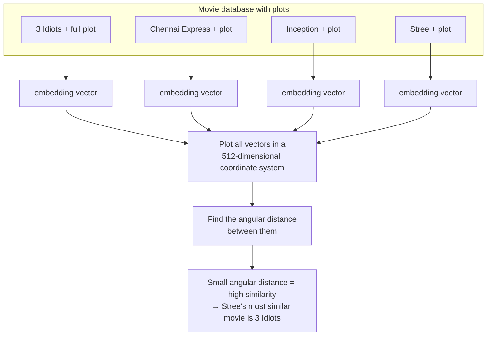
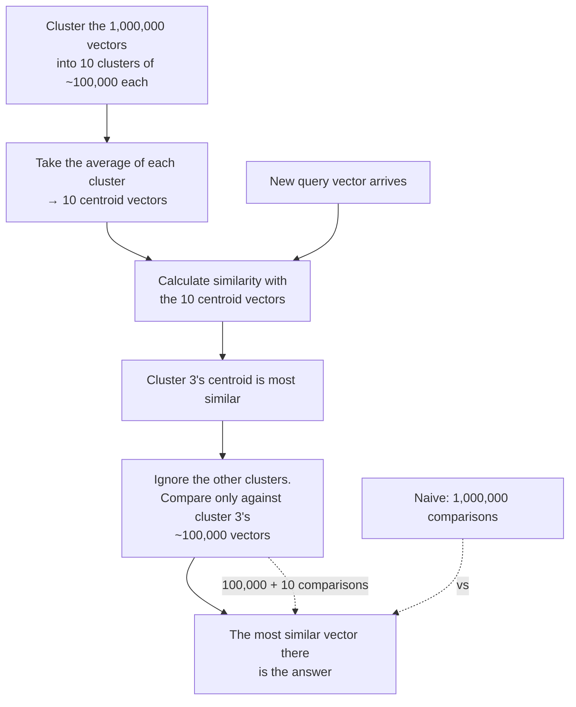
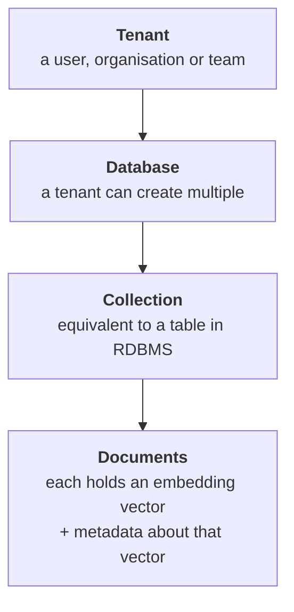

> **Video 14 of 21** (playlist video 12) · [Watch on YouTube](https://www.youtube.com/watch?v=k13WK0bxQP0)
> Notes follow the video section by section.

## Recap

So far in the RAG section we have covered **document loaders** and **text splitters**. Today: **vector stores**, a very important component of RAG.

The plan: first what vector stores are, then the different types, then why they are needed through a real-world example, and finally how to use them in LangChain with code.

## Why vector stores are needed — a movie catalogue

To explain this, take an interesting use case: **movies**.

Suppose you want to create a website listing every movie in the world, like IMDb — a movie catalogue system where a user can search any movie and get all the information about it.

**Step by step, how would you build it?**

First you need a **database** with the data of all the movies: movie ID, movie name, director name, actor name, genre, release date, whether the movie was a hit or a flop, and more. Where does that information come from? You fetch it from a public API, or through web scraping.

Once you have the database you create a **back end** — say in Python — to pull data from the database and send it to your **front end**, which displays it. Roughly speaking, that is how you create a website: a database, a back end and a front end.

## Improvement 1 — a movie recommender

Now you want improvements. The first idea: **what if we add a movie recommender system?**

If a user is on a particular movie's page — say they open the Spider-Man page — then at the bottom of the page we suggest more movies similar to Spider-Man. We list Iron Man. We list Captain America.

**The benefit:** if the recommender works well, **user engagement increases.** They are watching Spider-Man, they suddenly see Iron Man, and since they are in the same thought process they click it and read about Iron Man. Then they see Captain America below. They spend more time on your website, and in turn you earn more by showing more ads.

### The simple solution — keyword matching

A very simple approach. You have two movies M1 and M2 and you compare them on different parameters:

- Who is the **director**?
- Who is the **actor**?
- What **genre** is it?
- Are their **release dates** near each other?

If all these keywords match — same director, same actor, same genre — the two movies are very similar, and if the user is watching one you recommend the other. If very few keywords match, the movies are dissimilar and showing them together will not be beneficial.

Using this simple idea you have created your movie recommender. And it works — it recommends movies, and users use it.

### But there is a big flaw

Sometimes the recommendations are **not completely logical.**

**Example 1 — a bad recommendation.** Say a user has just watched *My Name Is Khan*, liked it, and wants to see more movies like it. The top recommendation is *Kabhi Alvida Naa Kehna*.

That is not a good recommendation, because that movie is completely different — a very different type of story line. **So why did our system declare them similar?** Because you are matching keywords. The director of both is the same. The lead actor is the same. They came at roughly the same time. And drama is a common genre in both. Since a lot of keywords matched, the system thought the most similar movie must be that one.

**But are they really similar? No.**

**Example 2 — a missed recommendation.** Some movies will be very similar but our system will **never** identify them as similar, because there are no common keywords.

Take *Taare Zameen Par* and *A Beautiful Mind*. Both have a central character battling some illness or problem, while at the same time being brilliant in another aspect, and then their story is told. In that sense they are quite similar. But the keywords are completely different — different directors, different actors, released at different times. **Since keywords are not matching, our algorithm will never mark these two as similar.**

**In a nutshell:** the system we created is very simple and will work in some scenarios, but most of the time you cannot expect quality recommendations from it, because the underlying principle — keyword matching — is too simple.

## Improvement 2 — compare plots

So your user engagement is decreasing instead of increasing, and you start thinking about a better approach.

A simple answer comes to mind: to tell whether two movies are similar, the best way is to **compare the plot and story** of the two movies. If the stories are very similar, the movies are very similar. If the stories are very dissimilar, the movies are too.

**The basic idea: rather than matching keywords, compare the plots.**

To execute this you must first have the plot of every movie, which is not currently in your database. So you do some hard work — search for APIs, or do web scraping — and extract the plot of every movie and put it in your database. Now you have the name, ID and **plot** of each movie, where the plot may look like one paragraph but is really a complete text of 2000–3000 words.

**The challenge:** create a system that can compare the plots of any two movies and generate a **similarity score**. The higher the score, the more similar the movies, and we can recommend them.

### Embeddings

The plan sounds simple but is not easy to execute. Ask any computer science student — **comparing the semantic meaning between two pieces of text is a very difficult NLP task.**

But with the advent of deep learning, this problem has also been solved. **Embeddings** are a technique with which you can represent the semantic meaning of any piece of text in the form of numbers.

You take a piece of text and send it to a neural network. The network tries to understand the meaning hidden inside the text, and once it understands, it represents that meaning as numbers — a **vector**. It can be of any number of dimensions: 512, 784, or more. **Hidden inside those numbers is the meaning of the text.**



Assume all the vectors are 512-dimensional. Plot them all in a 512-dimensional coordinate system, where each arrow represents one movie.

Now suppose someone asks: *"M4 is Stree — which movie is the most similar to Stree in your database?"* You find the similarity — the **angular distance** — of your current vector with all the other vectors. The angular distance of M4 with M3 is very high, with M2 a bit more in common, but with M1 it is **very small**. A small angular distance means very high similarity. So you immediately say the most similar movie to Stree is 3 Idiots.

**Step by step:** you arranged the plot of every movie, created embedding vectors for all the plots, calculated **cosine similarity** between those vectors, and the movies with the highest similarity are similar.

## Three challenges

Conceptually we understand it. But when you go to build this system, you face three or four problems.

**Challenge 1 — generating the embedding vectors.** You probably have data for millions of movies, and you have to generate an embedding vector for each.

**Challenge 2 — storage.** You generate the vectors once and use them again and again to calculate similarity, so you have to store them properly somewhere and retrieve them whenever needed.

**The only problem:** you **do not** store embedding vectors inside normal relational databases such as MySQL or Oracle. Once you store them there, you **cannot calculate similarity** between them — relational databases do not give you that feature. So you need a different type of database.

**Challenge 3 — semantic search.** You have to go through the vectors and find which is most similar to a given query vector, using cosine similarity.

But imagine you have to find the five most similar movies to a particular movie, and you have **one million** embedding vectors. You would have to calculate the similarity of that one vector with a million others. Computing that one by one is computationally very heavy and takes a lot of time — your application becomes very slow and the user experience is spoiled.

So we need a smart way where we do **not** need to compare every movie, and can still find out, with very few comparisons, which movie is most similar.

**Who helps you solve these three challenges? The vector store.**

## What a vector store is

> A vector store is a system designed to store and retrieve data represented as numerical vectors.

If you are ever building an application where you need to store and retrieve vectors, the system that handles it is a vector store.

### Feature 1 — Storage

The most primary feature. Whatever kind of application you build, if there are vectors, you can store them.

> Ensures that vectors and their associated metadata are retained, either in memory for quick lookups or on disk for durability and large-scale use.

**Associated metadata.** Apart from storing the vectors you can store other things too. If you want to store the movie ID, you can. If you want the movie name, you can. **Anything related to that vector, you can store in the vector store.**

**Two storage options.** You can store your vectors **in memory** (in RAM) or **on disk** (on your hard drive or in a database). In memory means that if you close the application, those vectors disappear. On disk means they are **persistent** — close the application, open it again, and the vectors are still there.

If you are making a small application you use in-memory. For a proper enterprise-level application you use on-disk.

### Feature 2 — Similarity search

Any vector store gives you this: you can generate a similarity score by comparing a query vector with all the vectors available there, and extract the most similar vector for a given query vector.

> It helps retrieve the vectors most similar to a query vector.

### Feature 3 — Indexing

The most interesting feature. Indexing is generally used to **speed up the searching process**, and you get the concept in vector stores too.

> Vector stores provide a data structure and a method that enables fast similarity searches on high-dimensional vectors.

**An example using clustering.** Suppose there are one million vectors stored, each of dimension 784, and a new query vector of 784 dimensions arrives. You have to find the closest vector.

The naive way requires **one million computations** — linear searching, of order n. Very, very slow: a million comparisons, calculating similarity scores, sorting.

Instead, use indexing:



Instead of a million comparisons you did 100,000 plus 10. **But you still extracted roughly your best result.** That technique is indexing.

That is one way. There are many others — a very famous one is **Approximate Nearest Neighbour** lookup, a famous research topic in itself. The idea is that vector stores smartly implement such algorithms so your similarity searches become very fast, which makes your application faster.

### Feature 4 — CRUD operations

A very regular feature: you can add new vectors to a vector store, retrieve them, update existing vectors and delete outdated ones — the same features other databases provide.

**In a nutshell, the four most important features:** storage, similarity search, indexing for fast similarity searches, and CRUD operations.

### Use cases

- **Recommender systems** — as above
- **Semantic search** in any application
- **RAG** — used a lot, covered in the next videos
- **Image or multimedia search**

In a nutshell, if your application is using vectors in any shape or form — storing them, retrieving them — you use a vector store there, and it will perform much better than a traditional relational database.

## Vector store vs vector database

Go to YouTube or read anywhere and you will see these two terms used interchangeably. Some people say vector store, some say vector database for the same thing. Here is the clarification.

Although the concepts are almost the same, the biggest difference is this. A **vector store** is a system that does two main tasks for you: **storage**, where you can store vectors, and **retrieval**, where you can perform semantic search on them. If you are getting those two features, you can call the system a vector store.

But if you **add more features** — the kind you normally find in databases:

- **Distributed architecture**, so you can scale your system as much as you want
- **Backup and restore**, so if data is lost tomorrow you already have a backup
- **ACID transactions**, again a feature you find in relational databases
- **Concurrency control**, so multiple users can communicate with it simultaneously
- **Authentication**, so it sits behind a security system and no one can access it

— then the overall system formed is called a **vector database**.

> **Vector store + database-like features = vector database.**

| | **Vector store** | **Vector database** |
|---|---|---|
| What it is | typically a lightweight library or service focused on storing vectors and performing similarity searches | a full-fledged database system designed to store and query vectors |
| Includes transactions, rich query language, role-based access control | may not | yes |
| Distributed architecture, durability, persistence, backup and restore | no | yes |
| Metadata handling, ACID or near-ACID guarantees | limited | yes |
| Authentication and authorisation | no | yes |
| Ideal for | prototyping and smaller-scale applications | production environments needing significant scaling or very large datasets |
| Examples | **FAISS** — a library from Facebook | **Milvus**, **Qdrant**, **Weaviate**, **Pinecone** |

**If you have to remember one thing:** a vector database is effectively a vector store with extra database features. **Every vector database is a vector store, but the reverse is not true** — not every vector store is a vector database, because not every vector store has database-like features.

## Vector stores in LangChain

When LangChain was created, its creators understood very early that in future, when LLM-based applications are created, there would be a lot of work with embedding vectors — which is true. Whatever RAG-based application you create, you work with vector embeddings, and then vector databases and vector stores come into the picture.

So LangChain has had a lot of support for different types of vector store from early on. You will find components for all the famous ones: **FAISS**, **Pinecone**, **Chroma**, **Qdrant**, **Weaviate**.

**The main idea:** LangChain developed these wrappers so that all of them **share the same method signatures**. The names of the functions are the same, and you can apply the same function to Pinecone, to Qdrant, to Weaviate.

Common methods across every vector store:

- **`from_documents` / `from_texts`** — create a vector store
- **`add_documents` / `add_texts`** — add new vectors
- **`similarity_search`** — conduct semantic search
- Options for **metadata-based filtering**

**The core philosophy:** if yesterday you built an application with FAISS and tomorrow you decide to use Pinecone because your application has grown, you can quickly replace FAISS with Pinecone and **you will not have to change much of your existing code**, because the same functions work exactly the same way.

## Chroma

> Chroma is a lightweight, open-source vector database that is especially suited for local development and small to medium-scale production needs.

Chroma's biggest feature is that it **is** a database — you get many features present in a normal vector database — but at the same time it is very **lightweight**, unlike some others such as Pinecone.

In that sense you could say Chroma **comes between a vector store and a vector database**. It is not a full-fledged vector database, because it is lightweight; and it is not a simple vector store, because some database features exist in it. It gives you the flavour of both.

### How data is organised



Once you understand Chroma you can easily switch to FAISS or Pinecone — **the basic concept remains the same.**

## Hands on with Chroma

This code is written in Google Colab rather than VS Code.

First install the necessary libraries, then:

```python
from langchain_openai import OpenAIEmbeddings
from langchain_chroma import Chroma
from langchain_core.documents import Document
```

You can import any other vector store in exactly the same way — FAISS, Pinecone, Weaviate.

### Creating documents

```python
doc1 = Document(
    page_content="Virat Kohli is one of the most successful and consistent batsmen in IPL history. Known for his aggressive batting style and fitness, he has led the Royal Challengers Bangalore in multiple seasons.",
    metadata={"team": "Royal Challengers Bangalore"},
)

doc2 = Document(
    page_content="Rohit Sharma is the most successful captain in IPL history, leading Mumbai Indians to five titles. He is known for his calm demeanour and ability to play big innings.",
    metadata={"team": "Mumbai Indians"},
)

doc3 = Document(
    page_content="MS Dhoni, famous for his captaincy and finishing ability, has led Chennai Super Kings to multiple IPL titles.",
    metadata={"team": "Chennai Super Kings"},
)

doc4 = Document(
    page_content="Jasprit Bumrah is considered one of the best fast bowlers in T20 cricket. Playing for Mumbai Indians, he is known for his yorkers and death-over bowling.",
    metadata={"team": "Mumbai Indians"},
)

doc5 = Document(
    page_content="Ravindra Jadeja is a world-class all-rounder who contributes with both bat and ball. He plays for Chennai Super Kings.",
    metadata={"team": "Chennai Super Kings"},
)

docs = [doc1, doc2, doc3, doc4, doc5]
```

Five documents, each about a cricket player, with the player's IPL team in the metadata.

### Creating the vector store

```python
vector_store = Chroma(
    embedding_function=OpenAIEmbeddings(),
    persist_directory="my_chroma_db",
    collection_name="sample",
)
```

Three things to tell it:

1. **The embedding function.** When you insert Document objects, they first have to be converted into embeddings — which model does that work? Here, OpenAI embeddings.
2. **The persist directory.** In which location the documents will be stored in vector form.
3. **The collection name.** Here we create a collection called `sample`.

:::note Chroma stores to SQLite
Run this and a folder appears with a **SQLite** file inside. A very interesting thing about Chroma: the vector database you are storing is actually stored in a SQLite database format — which means you could download it and try running it in any SQL client. There is no need to, but it is worth knowing.
:::

### Adding documents

```python
ids = vector_store.add_documents(docs)
print(ids)
```

A simple function that lets you add any number of documents simultaneously.

The interesting thing: when you run this, not only are your documents added, but **every document gets assigned a unique ID**, so later you can retrieve that document by holding that ID. These IDs are generated automatically by default, but you can also pass your own.

### Viewing what is stored

```python
vector_store.get(include=["embeddings", "documents", "metadatas"])
```

You tell it what you want to see about each document. Run it and you see five documents with their five IDs, the embedding of each, all five documents, and the metadata for each.

### Searching

```python
results = vector_store.similarity_search(
    query="Who among these are a bowler?",
    k=2,
)

for doc in results:
    print(doc.page_content)
```

`k` means **how many similar objects you want shown** in the result.

With `k=1` you get only the most similar vector and its document — **Jasprit Bumrah**, because among the five our model felt he could be called the best bowler.

With `k=2` you get two documents: Jasprit Bumrah, and **Ravindra Jadeja** — because his text says all-rounder, and the semantic meaning of all-rounder is that he can do both batting and bowling.

**It really is that simple to search in your vector database:** call `similarity_search`, provide your query, and tell it how many top results to see.

### Searching with scores

```python
results = vector_store.similarity_search_with_score(
    query="Who among these are a bowler?",
    k=2,
)
```

You get the same results, but you also see a **score** against each.

:::warning The lower the score, the better
The score represents **distance**. Less distance means the vector is closer and more similar.
:::

### Filtering on metadata

```python
results = vector_store.similarity_search_with_score(
    query="",
    filter={"team": "Chennai Super Kings"},
)
```

Suppose you want to filter out which of the five players are from Chennai Super Kings. Keep the query empty and send the team in the filter dictionary. You get two documents: **MS Dhoni**, because he plays for Chennai Super Kings, and **Ravindra Jadeja**, who again plays for Chennai Super Kings.

This is a very useful feature — later, when building a project, you will see how much it can help.

### Updating a document

```python
updated_doc1 = Document(
    page_content="Virat Kohli, the former captain of Royal Challengers Bangalore, is renowned for his aggressive leadership and consistency with the bat.",
    metadata={"team": "Royal Challengers Bangalore"},
)

vector_store.update_document(document_id=ids[0], document=updated_doc1)
```

You call `update_document`, provide the **document ID** of the Virat Kohli document, and provide the updated document. Run `get` again and you see the document updated.

### Deleting a document

```python
vector_store.delete(ids=[ids[0]])
```

You can provide any number of IDs. Run `get` again and now only four documents remain — Rohit Sharma, MS Dhoni, Jasprit Bumrah, Ravindra Jadeja. The Virat Kohli document is out.

## Homework

Go and re-implement this same code for **another vector store** — say FAISS or Pinecone. Honestly it will be very easy, because the interface is the same and you will use exactly the same set of functions.

## Checklist

- [ ] I can explain why keyword matching fails for recommendations, in both directions
- [ ] I can explain what embeddings solve in the movie problem
- [ ] I can name the three challenges a vector store solves
- [ ] I can name the four features of a vector store
- [ ] I can explain clustering-based indexing and its trade-off
- [ ] I can state the vector store vs vector database distinction
- [ ] I can draw Chroma's tenant → database → collection → document hierarchy
- [ ] I can create a Chroma store and add, view, search, filter, update and delete
- [ ] I know which direction Chroma's score runs
