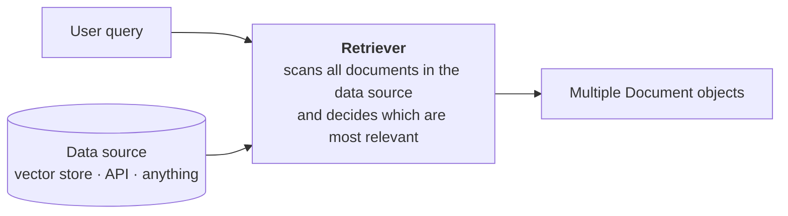
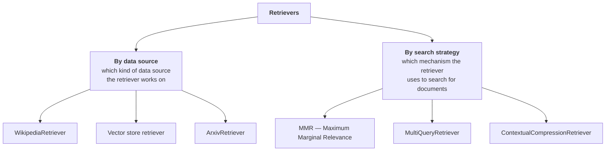
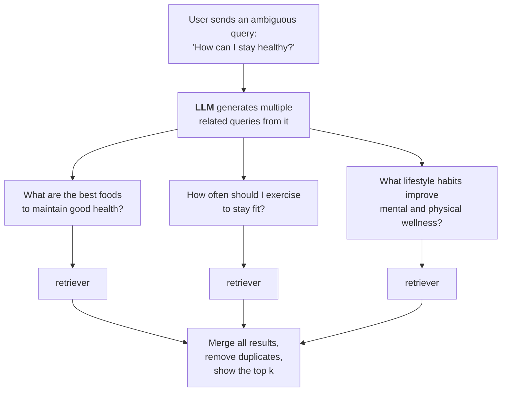
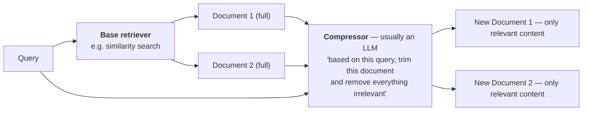

> **Video 15 of 21** (playlist video 13) · [Watch on YouTube](https://www.youtube.com/watch?v=pJdMxwXBsk0)
> Notes follow the video section by section.

## Recap

In this playlist we first covered the fundamentals of LangChain, then started on RAG-based applications. So far three core RAG components are done: **document loaders**, **text splitters** and **vector stores**. Today is the fourth: **retrievers**. Once these four are covered, we are ready to study RAG itself.

Retrievers are very important. In future, when you create more advanced RAG systems, you will work with different types of retriever.

## What retrievers are

> A retriever is a component in LangChain that fetches relevant documents from a data source in response to a user's query.



You have a data source where all your data is stored — it could be a vector store, an API, or anything. A user comes and asks a query. The query reaches the retriever. Internally, the retriever goes into the data source, scans your documents, and tries to understand which are most relevant for that query. As soon as it finds them, it fetches them and gives them to you.

**In very simple words**, a retriever is a function that takes the user's query as input and gives you multiple Document objects as output. In between, it enters a data source and searches — **it is like a search engine** that gives you relevant results.

Two more things to be clear about:

**There is not just one retriever.** LangChain has multiple retrievers for different use cases.

**All retrievers are Runnables**, just like models and prompts. Which means you can form chains using retrievers, or plug retrievers into existing chains. That greatly enhances the flexibility of your system — later, when building RAG applications, you will be able to plug retrievers directly into your chains because they are themselves runnables.

## Types of retriever

There are two ways to categorise them.



**By data source.** Different retrievers work with different data sources. The `WikipediaRetriever` takes your query, goes to Wikipedia and searches — so all the articles on Wikipedia become your data source. A vector store retriever searches data you have stored in a vector store. An `ArxivRetriever` goes to that website, scans all the research papers, and gives you relevant results.

**By search strategy.** Different retrievers use different mechanisms to search. MMR, MultiQuery and Contextual Compression all search in different ways.

So if someone asks you what the different types of retriever are, you just have to think: **which data source is it working with, and what strategy is it using for searching?**

LangChain has a lot of retrievers — probably 20, 25, 30 or more. It is not possible to cover them all, so the most relevant and useful ones are covered here, and the documentation link is given for the rest.

## WikipediaRetriever

> A retriever that queries the Wikipedia API to fetch relevant content for a given query.

**How it works:**

1. You give it a query — for example *Albert Einstein*
2. It sends the query to the **Wikipedia API**
3. It retrieves the most relevant articles
4. It returns them as **LangChain Document objects**

Internally, **keyword matching** happens — there is no semantic search here. A keyword-based match is performed and, based on the number of keywords matching, it decides which is the most relevant document.

```python
# wikipedia_retriever.py
from langchain_community.retrievers import WikipediaRetriever

retriever = WikipediaRetriever(top_k_results=2, lang="en")

query = "the geopolitical history of India and Pakistan from the perspective of a Chinese"

docs = retriever.invoke(query)

for i, doc in enumerate(docs):
    print(f"\n--- Result {i + 1} ---")
    print(f"Content:\n{doc.page_content}...")
```

Two things to tell it: **`top_k_results`** — how many documents you need back — and **`lang`** — which language you want the results in. The default is English, but you can try different ones.

Notice you use the **`invoke`** function, which means the retriever object is a runnable.

:::note A doubt worth addressing
The first time you read about this retriever, a doubt may come: *"this seems more like a document loader, with which we load Wikipedia articles."*

That is wrong. **It is a retriever** because it does not load all Wikipedia articles. In between, it is performing a kind of searching — deciding which documents are relevant based on a search query. It means it is a search engine working as a retriever. There is some logic implemented to perform this activity, and that is why it is not a document loader — **it has some form of intelligence inside it.**
:::

## Vector store retriever

> A vector store retriever in LangChain is the most common type of retriever. It lets you search and fetch documents from a vector store based on semantic similarity using vector embeddings.

**How it works, point by point:**

1. You store your documents in a vector store like FAISS, Chroma or Weaviate
2. Each document is converted into a **dense vector** using an embedding model
3. The user enters a query, and you convert that query into a vector too
4. You compare the query vector with all your document vectors — **semantic search** — and fetch the top results most similar to yours

```python
# vector_store_retriever.py
from langchain_chroma import Chroma
from langchain_openai import OpenAIEmbeddings
from langchain_core.documents import Document
from dotenv import load_dotenv

load_dotenv()

documents = [
    Document(page_content="LangChain helps developers build LLM applications easily."),
    Document(page_content="Chroma is a vector database optimised for LLM-based search."),
    Document(page_content="Embeddings convert text into high-dimensional vectors."),
    Document(page_content="OpenAI provides powerful embedding models."),
]

vectorstore = Chroma.from_documents(
    documents=documents,
    embedding=OpenAIEmbeddings(),
    collection_name="my_collection",
)

retriever = vectorstore.as_retriever(search_kwargs={"k": 2})

query = "What is Chroma used for?"
results = retriever.invoke(query)

for i, doc in enumerate(results):
    print(f"\n--- Result {i + 1} ---")
    print(doc.page_content)
```

Note `Chroma.from_documents` — the vector store is created **and** documents are added to it simultaneously. Then **`as_retriever`** creates a retriever from the vector store; all you have to tell it is how many relevant results you want returned.

Behind the scenes, the retriever converts the query to a vector, performs a semantic search, and returns the top results in Document format.

### A doubt worth addressing

You may have this doubt. **The work we just did with a retriever, we did directly from the vector store in the previous video.** You could write:

```python
results = vectorstore.similarity_search(query, k=2)
```

and get the same result. **So why make a retriever?**

**The answer:** yes, the vector store has the capability to do a similarity search. But it can only do it using **one strategy**, where it compares all the vectors based on some metric and gives you the top documents. If you want to use a **different strategy**, you cannot do that with that function — but if you have created a retriever, you can try out different search strategies.

The retriever shown here is the **most vanilla** retriever, which does the most basic similarity search. You can use it or use the vector store directly — it is the same thing. The only benefit here is that since this is a retriever object, it is a **runnable object**, so you can integrate it into a chain.

**But the main benefit of retrievers is that you can implement very advanced search strategies** by connecting advanced retrievers to your vector stores.

## MMR — Maximum Marginal Relevance

Before explaining what it is, here is a problem many retrievers face.

Say you have five documents about **climate change** and its impact on Earth and the ecosystem:

1. Climate change is causing glaciers to melt rapidly in the Arctic region
2. Glaciers in the Arctic are melting at an alarming rate due to rising temperatures
3. Deforestation is accelerating
4. Wildfires are increasing
5. Coastal cities are being submerged

Documents 1 and 2 have a **very similar meaning**. Documents 3, 4 and 5 are each different.

Now use a normal retriever with the query *"What are the adverse effects of climate change?"* and ask for three results. You get documents 1, 2 and 3, because their relevance was highest.

**The problem:** the first two results are saying exactly the same thing about glaciers melting. Only the third shows a different perspective. **Two out of three are saying the same thing.**

**Ideally** you would want document 1 (glaciers), document 4 (wildfires) and document 5 (coastal cities) — **more diverse perspectives.**

You need not only **relevant** content from your system, but content that is **not redundant**. If you fetch five documents and three say roughly the same thing, that is a waste — it would have been better to ask for three.

**MMR solves this.**

> The core philosophy of MMR: how can we pick results that are not only relevant to the query, but also different from each other?

> MMR is an information retrieval algorithm used to reduce redundancy in retrieved results while maintaining high relevance to the query.

**How it works:** first it picks the **most relevant** document. Then the next pick is a document that is not only relevant but **very dissimilar to the previous one**. It continues that way.

```python
# mmr_retriever.py
from langchain_community.vectorstores import FAISS
from langchain_openai import OpenAIEmbeddings
from langchain_core.documents import Document
from dotenv import load_dotenv

load_dotenv()

docs = [
    Document(page_content="LangChain makes it easy to work with LLMs."),
    Document(page_content="LangChain is used to build LLM-based applications."),
    Document(page_content="Chroma is used to store and search document embeddings."),
    Document(page_content="Embeddings are vector representations of text."),
    Document(page_content="MMR helps you get diverse results when doing similarity search."),
    Document(page_content="LangChain supports Chroma, FAISS, Pinecone and more."),
]

vectorstore = FAISS.from_documents(
    documents=docs,
    embedding=OpenAIEmbeddings(),
)

retriever = vectorstore.as_retriever(
    search_type="mmr",
    search_kwargs={"k": 3, "lambda_mult": 0.5},
)

results = retriever.invoke("What is LangChain?")

for i, doc in enumerate(results):
    print(f"\n--- Result {i + 1} ---")
    print(doc.page_content)
```

Note this time we import **FAISS** from the community package rather than Chroma, just to show how to work with a different vector store. It is another vector store, from Facebook, and works exactly like Chroma — you will not feel any difference.

This time, when calling `as_retriever`, we tell it not only how many documents we need but **what the search type should be** — here `mmr` rather than the normal similarity search.

**`lambda_mult`** varies from 0 to 1:

- Set it to **1** and MMR behaves **exactly like a normal similarity search**
- Set it to **0** and you get **very diverse** results
- You want something in between

With `lambda_mult=1` you see three results, all talking about LangChain — and the first two are quite similar. Reduce it to **0.5** and MMR comes into the picture: the first result is still about LangChain, but the second is now about embeddings — the very similar result was removed.

## MultiQueryRetriever

**The problem it solves:** sometimes the query sent by the user is **very ambiguous** — its meaning is not clear. And if the meaning is not clear, the quality of the search and the relevant documents returned will not be good.

Suppose your vector store holds a lot of health and nutrition documents, and the user asks a very broad question: *"How can I stay healthy?"*

That can have many meanings:

- What should I eat?
- How often should I exercise?
- How can I manage stress?

The relevant documents for all three are different from each other. **Retrieving the correct documents for such ambiguous queries is difficult.**

**The core philosophy of the MultiQueryRetriever:** it tries to **eliminate the ambiguity** in the user's query.



You send the query to an LLM, whose job is to **generate multiple, less ambiguous queries** from it that cover the same point. Now you have several queries from one. You send all of them to your normal retriever, each searches for its own question in the same document store, then you **merge** all the results, remove any duplicates, and show the top results.

```python
# multiquery_retriever.py
from langchain_community.vectorstores import FAISS
from langchain_openai import OpenAIEmbeddings, ChatOpenAI
from langchain.retrievers.multi_query import MultiQueryRetriever
from langchain_core.documents import Document
from dotenv import load_dotenv

load_dotenv()

all_docs = [
    Document(page_content="Regular walking boosts heart health and can reduce symptoms of depression."),
    Document(page_content="Consuming leafy greens and fruits helps detox the body and improve metabolism."),
    Document(page_content="Deep sleep is crucial for cellular repair and emotional regulation."),
    Document(page_content="Mindfulness and controlled breathing lower cortisol and improve mental clarity."),
    Document(page_content="Drinking sufficient water throughout the day helps maintain metabolism."),
    # ...plus some deliberately unrelated documents
    Document(page_content="The solar energy system in modern homes helps balance electricity demand."),
    Document(page_content="Python balances readability with power, making it a popular system design language."),
    Document(page_content="Photosynthesis enables plants to produce energy by converting sunlight."),
]

vectorstore = FAISS.from_documents(documents=all_docs, embedding=OpenAIEmbeddings())

similarity_retriever = vectorstore.as_retriever(
    search_type="similarity",
    search_kwargs={"k": 5},
)

multiquery_retriever = MultiQueryRetriever.from_llm(
    retriever=vectorstore.as_retriever(search_kwargs={"k": 5}),
    llm=ChatOpenAI(model="gpt-3.5-turbo"),
)

query = "How to improve energy levels and maintain balance?"

similarity_results = similarity_retriever.invoke(query)
multiquery_results = multiquery_retriever.invoke(query)
```

Note the documents: the first five are health and lifestyle related, but the ones after are **a bit random** — the solar system, the Python language, photosynthesis, the FIFA World Cup. But they are written in such a way that they can **seem related** to the search mechanism. The words *"energy system"* and *"balance"* can make them feel related to health and nutrition. We are trying to confuse our system a little.

To create a MultiQueryRetriever you use **`from_llm`** and tell it two things:

1. **Which LLM** you want to use internally to generate the different versions of the query
2. **Which retriever** does the retrieval work — here the similarity search retriever, though you could use MMR

### Comparing the results

**The normal retriever** mostly understands we are talking about health and nutrition, and fetches similar results. But at the end it gets a little confused and returns *"the solar energy system in modern homes helps balance electricity demand."* It saw *energy system* here and *balance* here, and since there was ambiguity in the query, it felt this might be relevant.

**The MultiQueryRetriever** returns all five results talking only about health and nutrition — because it understands there is ambiguity in the query but that the subject is health and nutrition, so the results should be around that, not the solar system.

**That is the biggest benefit of using a multi-query retriever.**

## ContextualCompressionRetriever

> A contextual compression retriever in LangChain is an advanced retriever that improves retrieval quality by **compressing documents after retrieval**, keeping only the relevant content based on the user's query.

**The problem.** Suppose you have this document in your vector store:

```text
The Grand Canyon is one of the most famous natural landmarks.
Photosynthesis is the process by which green plants convert sunlight into energy.
Millions of tourists visit the Grand Canyon every year.
```

In this **single document** two different things are being discussed: the Grand Canyon, and photosynthesis.

A query comes: *"What is photosynthesis?"* When the retriever searches the vector store, it sees this document talks about photosynthesis, so it must be shown in the result.

**The only problem:** the result talks about photosynthesis **but also about a completely different topic.** When you show this answer to the user, they got their answer — but you are also giving them completely irrelevant things, which can spoil the experience.

**With this retriever**, instead of returning the entire document, it returns **only the relevant line** and ignores the rest.

### "But why would I have such a document?"

A question that may come to mind. The answer: **this is possible.** You will be working with very large documents. When you apply a text splitter to very large text, you do not get full control over exactly how the text is split. Sometimes the split occurs **in the middle of a paragraph** — half a paragraph in one chunk, half in another. In that situation you will have documents where more than one thing is discussed.

### How it works



This retriever has **two parts**:

1. **A base retriever** — a normal retriever with similarity search, which fetches some documents
2. **A compressor** — usually an LLM, applied to every document. It keeps only the parts relevant to the query, and irrelevant content is discarded

**That is why the algorithm is called contextual compression.**

**When should you use it?** When the documents you have are very long and might contain mixed information. Or you want to reduce the context length sent to the LLM. Or you want to improve the answer accuracy of your RAG pipeline.

```python
# contextual_compression_retriever.py
from langchain_community.vectorstores import FAISS
from langchain_openai import OpenAIEmbeddings, ChatOpenAI
from langchain.retrievers.contextual_compression import ContextualCompressionRetriever
from langchain.retrievers.document_compressors import LLMChainExtractor
from langchain_core.documents import Document
from dotenv import load_dotenv

load_dotenv()

docs = [
    Document(page_content="""The Grand Canyon is one of the most visited natural wonders in the world.
Photosynthesis is the process by which green plants convert sunlight into energy.
Millions of tourists travel to see it every year."""),
    Document(page_content="""In medieval Europe, castles were built primarily for defence.
The chlorophyll in plant cells captures sunlight during photosynthesis.
Knights wore armour made of steel."""),
    Document(page_content="""Basketball was invented in 1891. The NBA now has 30 teams."""),
]

vectorstore = FAISS.from_documents(documents=docs, embedding=OpenAIEmbeddings())

base_retriever = vectorstore.as_retriever(search_kwargs={"k": 5})

compressor = LLMChainExtractor.from_llm(ChatOpenAI(model="gpt-3.5-turbo"))

compression_retriever = ContextualCompressionRetriever(
    base_compressor=compressor,
    base_retriever=base_retriever,
)

query = "What is photosynthesis?"
compressed_results = compression_retriever.invoke(query)

for i, doc in enumerate(compressed_results):
    print(f"\n--- Result {i + 1} ---")
    print(doc.page_content)
```

Two things you need before building it: **what your base retriever will be**, and **a compressor**, built with the **`LLMChainExtractor`** class. You can use this code as it is — you just have to enter your model.

**The result:** even though all the documents are a paragraph long, the answers coming back are **very short, one-sentence answers** — because only one line around photosynthesis exists in the documents, and that line is extracted and shown. You will not see any sentence about the Grand Canyon or basketball, because the contextual compression retriever does all that work behind the scenes.

## Other retrievers

Apart from these, many others exist: **ParentDocumentRetriever**, **TimeWeightedVectorStoreRetriever**, **SelfQueryRetriever**, **EnsembleRetriever**, **MultiVectorRetriever** and more. The LangChain documentation lists them all, and clicking any one gives you its description and sample code.

It is not possible to cover them all, and it did not seem logical to try. Going forward, when we create projects, if a particular retriever is needed it will be taught then.

## Why so many retrievers exist

You may still be wondering why. Different retrievers were created to solve different small problems — but what is the **primary** reason?

Mainly, you use retrievers to build **RAG-based systems**. And what happens is: if you make a simple RAG system, its **performance is not good at times**. The retrieved results you get may not be that good.

So what do you have to do? **You have to improve your RAG system.** And the most common thing used for improvement is to **remove your existing retriever and install one of these advanced retrievers**, in the hope that your system starts working better.

So in the near future, when you build RAG-based applications, you will try out different retrievers to improve them.

:::tip This is what "Advanced RAG" means
If you ever see someone teaching a topic called **Advanced RAG**, understand that you will be taught all these retrievers there, and with their help you will be taught how a RAG system is built.
:::

## Checklist

- [ ] I can explain what a retriever is and why it is a runnable
- [ ] I can categorise retrievers by data source and by search strategy
- [ ] I can explain why `WikipediaRetriever` is a retriever and not a loader
- [ ] I can explain why a retriever is worth creating over `similarity_search`
- [ ] I can explain the exact failure MMR, MultiQuery and compression each fix
- [ ] I can tune `lambda_mult` deliberately
- [ ] I know retrieval is the first place to look when RAG answers are poor
