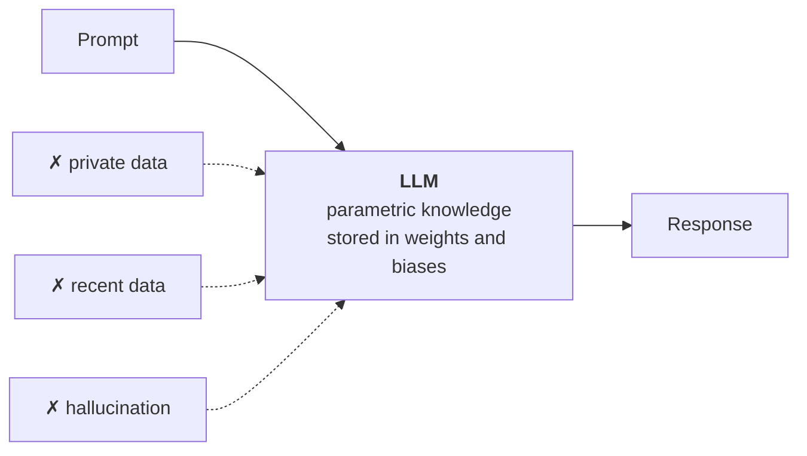
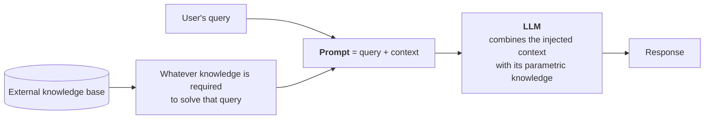
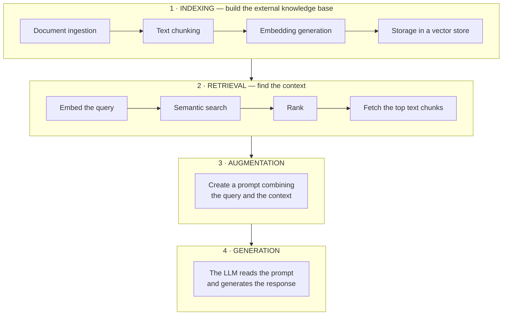

> **Video 16 of 21** (playlist video 14) · [Watch on YouTube](https://www.youtube.com/watch?v=X0btK9X0Xnk)
> Notes follow the video section by section. This video is mostly theory; the next one builds the system.

## Recap

Four videos ago we started on RAG, and in those videos we covered the four most important components: **document loaders** for loading data from any source, **text splitters** for dividing large text into chunks, **vector stores** for converting text into embeddings and storing them, and **retrievers** for performing semantic search over the store.

Now it is a good time to read about RAG itself. This video covers the conceptual part using a **why → what → how** flow. The next video builds a RAG system from scratch in LangChain.

## Why RAG was needed

### How LLMs work

Technically speaking, LLMs are transformer-based neural network architectures with a lot of parameters — a lot of weights and biases. We **pre-train** them on huge amounts of data — literally data on the scale of the internet. The result is that the LLM acquires knowledge from all over the world.

**Where do LLMs store that knowledge?** In the **parameters** — the weights and biases. The knowledge is stored in those numbers, and that is why it is called **parametric knowledge**.

That is also why it is said that the more parameters a model has, the more powerful it is. A 13-billion-parameter model is more powerful than a 7-billion one; a 70-billion one more than the 13-billion.

**How do you access that knowledge as a user?** By prompting. You send a query — a prompt — to the LLM. The LLM tries to understand it, and then, using its parametric knowledge, it prints the correct answer word by word.

In most situations this flow works correctly. **But there are certain situations where it does not.**

### Problem 1 — private data

Suppose you run a website with courses, and while watching a video you have a doubt at some point. You open ChatGPT and ask *"tell me what has been explained at this point in this video."*

Obviously ChatGPT cannot answer, because it never accessed your video data during pre-training.

**In simple words:** if you want to ask questions about your **private data**, the LLM cannot answer, for the obvious reason that during pre-training the model has not seen that data.

### Problem 2 — the knowledge cutoff

Go to an LLM and ask *"what was the biggest news in India today?"* Most likely it cannot answer, because **every LLM has a knowledge cutoff date**. If a model was last pre-trained on 1 January and then released, it has no current affairs or recent information after that date.

You may think you can ask ChatGPT this — and you can, but only because ChatGPT has access to **search the internet**. Download any open-source model from Hugging Face and try asking a recent question; most likely it cannot answer, because its knowledge cutoff is in the past.

### Problem 3 — hallucination

Many people have observed that if you send a prompt and try to access the parametric knowledge, your LLM sometimes gives you **factually incorrect information — with a lot of confidence.** That is called **hallucination**.

For example, ask a question about Einstein and the model might very confidently say he played football for Germany in his early years. **Totally made up** — it was never true. But the way an LLM works is very **probabilistic**, so instead of giving factually correct information it may imagine something and tell you.

The chances of hallucination are high, and if hallucinations are happening, the user is not getting the right answer.



## Solution attempt 1 — fine-tuning

Is there a method to solve these three problems? Yes, at least at a small level: **fine-tuning**.

> In fine-tuning you take a pre-trained LLM and **retrain it on a smaller, domain-specific dataset.**

The idea is simple. You have an LLM pre-trained on a huge dataset, so it has general knowledge about a lot of things. But you want it to have knowledge of **your** domain or your task. So you curate a small dataset from your domain and train the LLM on it. After that training, the LLM has knowledge of the entire world **and** of your domain, and can answer even difficult questions in it.

### The student analogy

Take an engineering student who has completed their degree. In engineering they studied many things — English, chemistry, physics, plus engineering subjects like computer science and electronics.

But when they get a job in a company, they do not start working just on the basis of that education. Generally they undergo **two to three months of training** in the company. The idea: *even though you learned a lot in engineering, we will teach you how to work in this company.*

In this example:

| Analogy | Reality |
|---|---|
| The student | your LLM |
| Engineering studies | **pre-training** |
| Two to three months of company training | **fine-tuning** |

### Ways to fine-tune

**Supervised fine-tuning.** The most popular. You provide a **labelled dataset** in the format of prompts and desired outputs. In the prompt you tell the model what a user can ask; in the desired output you tell it how to answer. You provide anywhere between a thousand and a million such pairs and train on them.

**Continued pre-training.** An **unsupervised** way. You provide a dataset with no labels. For example, to create a chatbot for your website so students can ask doubts about your lectures, you take the transcripts of your lectures — the subtitle files — and feed them to your LLM. Training happens in the same manner as the pre-training stage. It is called continued pre-training because in a way you are continuing your pre-training, but on a smaller, domain-specific dataset.

**RLHF.** Combining reinforcement learning and human feedback to explain to the model how it should behave in real-world scenarios.

Apart from these you may have heard of **LoRA** and **QLoRA** — they all come down to fine-tuning.

### The four steps of supervised fine-tuning

1. **Collect data** about your domain. Since this is supervised, you need labelled data in the format of prompts and desired outputs — a lot of such question-answer pairs.
2. **Choose a method.** Full-parameter fine-tuning, or parameter-efficient methods like LoRA and QLoRA.
3. **Train** for a few epochs — not more, because it is computationally very expensive. If you chose full-parameter fine-tuning you retrain all your weights; if you chose LoRA or QLoRA you **freeze** your base weights and train the remaining ones.
4. **Evaluate.** Apply safety tests and other techniques — **exact match** (I provided this prompt, this should have been the desired output, this is what the model gave), **factuality**, **hallucination rate**.

### How fine-tuning solves the three problems

**Private data.** Very obviously. As soon as you train your LLM on private data, that data becomes part of its parametric knowledge, so it can answer questions about it.

**Recent data.** A little trickier, but you can solve it for your specific problem and domain. If you fine-tuned on your courses and a new course arrives, you fine-tune again with the new course data. If you update your courses frequently, you fine-tune frequently — but whenever you do, your model has updated information.

**Hallucination.** You can add examples to your training dataset showing tricky prompts where the model used to get confused, and tell it that since this is a tricky prompt it does not need to answer — it can just say *"I don't know."* In this way you are explicitly training your LLM to **stick to the facts** and not create new ones.

### The major problems with fine-tuning

**1. Computationally expensive.** Even though you are training on a small dataset, you are training a very large model. You will have to pay for this.

**2. Strong technical expertise required.** Fine-tuning is not everyone's cup of tea. You need proper AI engineers and data scientists to do the process for you.

**3. Terrible for frequently-changing knowledge.** Every time you update your course catalogue and add new courses, you have to perform fine-tuning again — and pay for it again. And if tomorrow you **remove** a course because it has become outdated, you have to fine-tune again to remove that course from the parametric knowledge of your model.

**If you are working in a domain where new information arrives at a very fast frequency, fine-tuning is not a suitable technique.**

## Solution attempt 2 — in-context learning

Is there another technique? Yes: **in-context learning.**

> In-context learning is a core capability of large language models like GPT-3, Claude and Llama, where the model learns to solve a task purely by **seeing examples in the prompt**, without updating its weights.

What we have learned so far is that whatever knowledge an LLM has is parametric — stored in its parameters — and when you send a prompt the LLM enters that parametric knowledge and finds the answer.

But with big models it has been observed that **if you explain, within the prompt itself, how to solve a task through examples, the LLM learns from those examples how to solve it.**

For example, you send this prompt:

```text
Below are examples of text labelled with their sentiment.
Use the examples to determine the sentiment of the final text.

Text: I love this phone, it's so smooth.   Sentiment: positive
Text: This app crashes a lot.              Sentiment: negative
Text: The camera is amazing.               Sentiment: positive

Text: I hate the battery life.             Sentiment: ?
```

Your LLM learns how to do sentiment analysis by looking at the examples, and then applies that learning to the question, answering **negative**.

**That is in-context learning.** You can do the same for named entity recognition — label the named entities in a couple of sentences, then ask about a new one. Or teach it to solve maths problems, or any problem in your domain. These prompts are called **few-shot prompts**.

### An emergent property

A very interesting thing about in-context learning: **it is an emergent property of LLMs.**

> An emergent property is a behaviour or ability that **suddenly appears** in a system when it reaches a certain scale and complexity, even if it was not explicitly programmed and expected from the individual components.

When people were training these LLMs, they **did not plan** for the LLM to have in-context learning. But as LLMs were made bigger — more parameters, larger datasets — this feature started appearing **automatically**.

The whole story: until GPT-1 and GPT-2, which are not such big language models, in-context learning did not happen. Give them examples of solving two tasks and there was no guarantee they would learn from them. But as soon as **GPT-3** came out, with around **175 billion parameters** — a very large-scale model — it was automatically observed that it **can** learn from the examples given in the prompt and solve the task.

Then came a very important paper: **"Language Models are Few-Shot Learners."** For the first time, in-context learning was discussed there.

:::tip Read at least the abstract
Even reading just the abstract gives you a good idea of what in-context learning is.

The authors wrote that until then, to solve NLP tasks, you pre-train an LLM and then perform fine-tuning for a particular task. That gives good results, but the problem is that even for fine-tuning you need a dataset with at least ten thousand to a million data points, and generating such a dataset is costly.

They then compared this with humans: *"by contrast, humans can generally perform a new language task from only a few examples and a few simple instructions."* Give a human a task with five or six examples and they automatically solve it.

So: can language models do the same work? They took GPT-3 with its 175 billion parameters, gave it prompts with examples of how to solve the task, and observed that a model at that scale **can** actually solve a task by learning from the examples in the prompt. **That was the biggest learning from the paper**, and it is a landmark paper worth reading.
:::

**One more thing.** In-context learning is an emergent property, but it is **not necessary that it gives you good results on every type of task.** To solve that, after this paper, data scientists applied different **alignment techniques** — supervised fine-tuning and RLHF — so the property gets enhanced. That is why later models were really very good at in-context learning.

## From in-context learning to RAG

So far in in-context learning, few-shot prompting means explaining to the model, through examples inside the prompt, how to solve a given task.

**Now what if, instead of giving examples, I send the entire *context* for solving the task inside my prompt?**

Take the example. We have a website where long videos play — two- to three-hour lectures. We want a chatbot to help students with doubts. Say it is a two-hour lecture on linear regression, and a student has a doubt in a specific part — the **gradient descent** part.

They ask the LLM their doubt. What do we do? We send the LLM **not only the student's question**, but at the same time **that part of the lecture where gradient descent is taught.** Suppose it is taught from minute 5 to minute 25 — the transcript of that part goes in as **context**.

So at prompting time we send two things: the student's doubt, and the transcript of the gradient descent portion. That transcript acts as the context, looking at which our model tries to solve the query.

**Here we are not sending an example of how to solve the task — we are injecting whatever context is required to solve the question.** Because of that, the knowledge of our model is enhanced beyond its parametric knowledge.

**That is precisely RAG — Retrieval-Augmented Generation.**

> RAG is a way to make a language model smarter by giving it extra information at the time you ask your question.



What a RAG prompt looks like:

```text
You are a helpful assistant.
Answer the question ONLY from the provided context.
If the context is insufficient, just say you don't know.

{context}

Question: {question}
```

The line about insufficient context is what stops it hallucinating.

**To summarise the long discussion:** we started with why RAG is needed — three problems. The way to solve them was fine-tuning. Then we discussed fine-tuning's problems, and to solve those we discussed **in-context learning**. Then we enhanced in-context learning by putting **context** instead of examples. **And that is RAG.**

## How RAG works

At a very high level, RAG is made of two concepts: **information retrieval**, a very old topic in computer science, and **text generation**, which became famous after LLMs. **RAG is essentially a marriage of these two.**

Broadly, RAG divides into **four steps**.



### Step 1 — Indexing

> Indexing is the process of preparing your knowledge base so that it can be efficiently searched at query time.

The context you provide in the prompt comes from an external knowledge base, and indexing is where you **create** that knowledge base. It has four steps.

**1a. Document ingestion.** Load your source knowledge into memory. Whatever data you have to answer from is lying somewhere — if the transcript is on your server, you fetch it from there; if your company's documents are on Google Drive or AWS S3, you fetch them from there. **Here you use tools like LangChain's built-in document loaders** — the PDF loader, the YouTube loader, the web base loader.

**1b. Text chunking.** Convert the huge document into small documents.

Why? **Two reasons.** First, the **context length** of your LLM will not allow you to send such a large document in the prompt — there is a limit on how many tokens an LLM can process. Second, we have to perform **semantic search** later, and the quality of semantic search is not very good if you apply it on a very large document.

You just have to make sure the chunks you create are **meaningful** — the first chunk about a single topic, the second about another. **There should be no abrupt chunking.** To do this you use LangChain's text splitters; the most famous is the recursive character text splitter, and you also have the semantic chunker, plus splitters for HTML and Markdown.

**1c. Embedding generation.** Convert each chunk into a **dense vector** that captures its meaning. We do this because in future we have to search these documents to find which part matches the user's question.

> Convert each chunk into a dense vector that captures its meaning.

You can use any embedding model — OpenAI embeddings, sentence transformers. After this you have a dense vector against each chunk.

**1d. Storage.** Save all these vectors in a **vector store**, because in future we have to perform semantic search on them. You store the **original chunk text plus the vector plus metadata**.

Your options: **FAISS** and **Chroma** as local vector stores, or cloud-based ones — **Pinecone**, **Weaviate**, **Milvus**, **Qdrant**.

**After this step you have all the chunks and their corresponding embedding vectors stored in one place.** You can now use this vector store as your external knowledge base.

### Step 2 — Retrieval

> Retrieval is the real-time process of finding the most relevant pieces of information from a pre-built index, based on the user's query.

It is like asking: *from all the knowledge that I have, which three to five chunks are most helpful to answer this query?*

Take the example. The user asks *"how do we perform the optimisation step in gradient descent?"* Our vector store contains chunks — one about OLS, one about multiple linear regression, two about gradient descent. **The decision making happens at the retrieval step:** since the query asks about gradient descent, we will not use the OLS chunk or the multiple-regression chunk; we combine the two gradient descent chunks to create the context.

The retriever does three or four things:

1. **Generate an embedding vector for your query** — using **exactly the same embedding model** with which you created the chunk embeddings
2. **Find the closest vectors** in your vector store. Here you can do a simple semantic search, or more advanced searches — MMR, contextual compression — as discussed in the retrievers video
3. **Rank** them — bring them in order of which is closest. This can be a simple similarity search based on cosine similarity, or you can use more advanced **re-ranking** algorithms
4. **Fetch the text chunks** of your top results — **that is your context**

### Step 3 — Augmentation

You take the most relevant chunks the retriever found, take the query as it is, and **combine them into a prompt**.

**This is augmentation** because you are adding extra knowledge on top of the parametric knowledge of your LLM, so it can give you a proper answer.

### Step 4 — Generation

You take an LLM and send your prompt there, so the LLM can generate the correct response by reading the question and the context. The LLM uses its **text generation capabilities** and **in-context learning** to answer, and generates a response based on its parametric knowledge **plus** this additional knowledge.

**And that is how a RAG pipeline works.**

## How RAG solves the three problems

**Problem 1 — private data.** Solved very obviously. The external knowledge base you created **is made up of your own data**. So whatever context is derived comes from your own data, and whatever answers come from the LLM come from your own data.

**Problem 2 — the knowledge cutoff.** You do not have to do anything special. You put the recent articles, news, or whatever current-affairs information you have **into your external knowledge base**, and automatically, when you ask questions, your LLM can answer around that too.

**The benefit over fine-tuning:** in fine-tuning, as soon as new information arrived you had to fine-tune again, which was costly. **That is not a problem here.** You simply bring the new documents, generate their embeddings, and put them into the vector store. **You do not need to retrain the model.** In that sense it is much less costly.

**Problem 3 — hallucination.** We provide the **exact context** around the query, and we explicitly tell the model that whatever answer it gives, it should give **only from the provided context** — and if the information is insufficient, it has to say *"I don't know."*

In a way you are **grounding** the response of your LLM against the context. Because of that step, the chances of hallucination from a RAG-based system are **greatly reduced.**

## RAG vs fine-tuning

Compared to fine-tuning, **RAG is a cheaper solution** — you do not have to train the model, and you do not have to bring a proper labelled dataset. You simply bring your company documents as they are and put them in a vector store.

It is also **less complex**. In fine-tuning you are providing proper training to your model; there is no training going on here.

**So it is a cheaper and simpler alternative to fine-tuning** for these problems.

## Checklist

- [ ] I can explain parametric knowledge and where it is stored
- [ ] I can name the three problems with plain prompting
- [ ] I can explain fine-tuning with the student analogy, and name its methods
- [ ] I can name the four steps of supervised fine-tuning
- [ ] I can name fine-tuning's three major problems
- [ ] I can explain in-context learning and why it is an emergent property
- [ ] I can explain how RAG differs from few-shot prompting
- [ ] I can name the four RAG stages and everything inside indexing
- [ ] I can explain how RAG solves each of the three problems
- [ ] I can say when RAG is cheaper and simpler than fine-tuning
