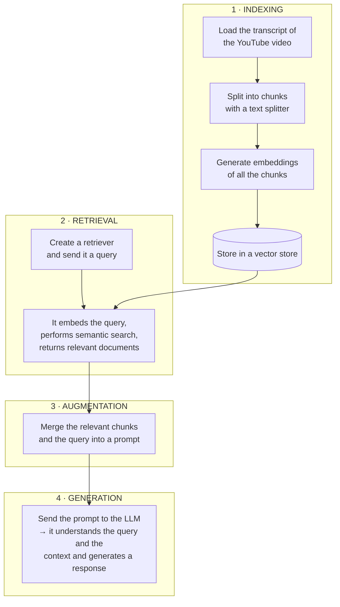
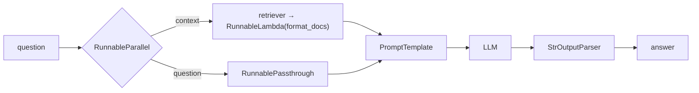

> **Video 17 of 21** (playlist video 15) · [Watch on YouTube](https://www.youtube.com/watch?v=J5_-l7WIO_w)
> Notes follow the video section by section. The previous video covered RAG theory; this one builds it.

## The problem statement

We are going to build a RAG-based system that lets you **chat in real time with any YouTube video**. Call it **YouTube Chat**.

We all watch videos on YouTube, and some are very long — especially podcasts, which run two to three hours. **The problem:** to understand the entire content of that video, you have to watch the whole thing.

Our solution fixes that. Say you are watching a three-hour podcast and have a question: *"is there any discussion about AI in this podcast?"* You enter the question and the system replies that yes, AI has been discussed, and here are the key pointers. Or you ask: *"can you summarise this entire video in five bullet points?"* — and it does.

Tomorrow, if you are watching a data science lecture and suddenly have a doubt in some part, you enter that doubt and the system solves it.

### What the final product could look like

There are several options:

- **A Chrome plugin.** The user installs it, and while the video is playing they click it, a chat interface opens, and they chat while watching. This is the best solution if you can build it — but you need HTML, CSS and JavaScript knowledge.
- **A Streamlit website.** You paste the link of the YouTube video, click submit, and a chat window opens. No HTML/CSS/JS needed, but you should know how to work with Streamlit.

**Today the focus is RAG, not the UI**, so everything is built inside a Google Colab notebook. But it is recommended that after trying it in Colab you build a UI around the project — it will look better and be more usable.

## The plan of action

We use exactly the same flow discussed in the previous video.



We first do all this **step by step, broken down**. Then, once the whole thing works, we **convert it into a chain**, so that the output of one component automatically becomes the input of the next and a single `invoke` call executes everything.

## Setup

You need your OpenAI key, and some libraries installed.

```bash
pip install youtube-transcript-api langchain-community langchain-openai \
            faiss-cpu tiktoken python-dotenv
```

## Step 1a — Load the transcript

A transcript is a file where whatever is said in a YouTube video is recorded sentence by sentence in one place. Our first goal is to fetch it and bring it into our project.

There are two ways. One is LangChain's **`YoutubeLoader`**. The other is YouTube's own API.

:::note Why the API, not the loader
`YoutubeLoader` is a bit buggy — for some videos it worked properly, for others the code broke. YouTube's own API gave accurate results for all types of video, so that is what is used here.
:::

```python
from youtube_transcript_api import YouTubeTranscriptApi, TranscriptsDisabled

video_id = "Gfr50f6ZBvo"     # only the ID, not the full URL

try:
    transcript_list = YouTubeTranscriptApi.get_transcript(video_id, languages=["en"])

    # flatten it to plain text
    transcript = " ".join(chunk["text"] for chunk in transcript_list)
    print(transcript)

except TranscriptsDisabled:
    print("No captions available for this video.")
```

**Two things to tell it:** the **ID** of your video, and **which language** you want the transcript in.

:::warning Two gotchas
**Use the ID, not the URL.** From `youtube.com/watch?v=Gfr50f6ZBvo`, paste only `Gfr50f6ZBvo`.

**Match the language.** Run this on a Hindi video with `languages=["en"]` and you get an error saying there is no English transcript — a logical thing, since the video is in Hindi. Change it to `["hi"]` and the Hindi transcript loads, exactly as you see in the captions.
:::

**What the API returns.** Print the variable before joining and you see a **list of dictionaries**, showing what text is on screen, at what **timestamp**, and for how long it will be visible. The transcript is loaded sentence by sentence — which sentence appears next in the subtitles.

So we run a loop over it, call **`join`**, and concatenate the whole thing into one big string containing the complete transcript of the entire video.

## Step 1b — Split into chunks

The transcript of a two-hour video will obviously be very long, so we divide it into small chunks.

```python
from langchain.text_splitter import RecursiveCharacterTextSplitter

splitter = RecursiveCharacterTextSplitter(chunk_size=1000, chunk_overlap=200)

chunks = splitter.create_documents([transcript])

print(len(chunks))     # around 168 for a two-hour video
print(chunks[100])
```

We use the **recursive character text splitter**, with `chunk_size=1000` and `chunk_overlap=200`. You can experiment with different chunk sizes; these values gave correct results here.

## Step 1c — Embed and store

```python
from langchain_openai import OpenAIEmbeddings
from langchain_community.vectorstores import FAISS

embeddings = OpenAIEmbeddings(model="text-embedding-3-small")

vector_store = FAISS.from_documents(chunks, embeddings)

print(vector_store.index_to_docstore_id)
print(vector_store.get_by_ids(["..."]))
```

We choose an embedding model from OpenAI and use the **FAISS** vector store, providing all our chunks and the embedding model.

At this point an ID has been generated against each chunk, and with that ID the chunks have been embedded and stored. In total there are 168 chunks; enter an ID into the function and you can check how that chunk looks.

**The indexing part is complete.** We have loaded the document, split the text, embedded it and stored it in the vector store.

## Step 2 — Retrieval

For retrieval we create a retriever and send it a query. The retriever embeds the query, brings it into vector form, searches the vector store for the closest vectors, and brings back the corresponding chunks.

```python
retriever = vector_store.as_retriever(
    search_type="similarity",
    search_kwargs={"k": 4},
)

print(retriever)

result = retriever.invoke("What is deepmind")
print(result)
```

A very simple retriever whose search type is **similarity search**, returning the **four** most similar vectors.

Since the retriever is itself a runnable, it has an `invoke` function. Ask *"what is deepmind?"* and the retriever gives four documents, because we told it to.

**Always remember: the retriever gets a query as input, and the output is a list of documents.**

## Step 3 — Augmentation

Now we create a prompt merging these relevant documents and the query.

```python
from langchain_openai import ChatOpenAI
from langchain_core.prompts import PromptTemplate

llm = ChatOpenAI(model="gpt-4o-mini", temperature=0.2)

prompt = PromptTemplate(
    template="""
      You are a helpful assistant.
      Answer ONLY from the provided transcript context.
      If the context is insufficient, just say you don't know.

      {context}
      Question: {question}
    """,
    input_variables=["context", "question"],
)
```

Two input variables: `context` and `question`.

Now we perform retrieval again with the actual question:

```python
question = "is the topic of nuclear fusion discussed in this video? if yes then what was discussed"

retrieved_docs = retriever.invoke(question)
```

The retriever gives back the retrieved documents. **But we cannot send four different documents in our prompt** — we have to **concatenate** the page content inside those four documents into one big string:

```python
context_text = "\n\n".join(doc.page_content for doc in retrieved_docs)

final_prompt = prompt.invoke({"context": context_text, "question": question})

print(final_prompt)
```

Print the final prompt and you see: *"You are a helpful assistant, answer only from the provided transcript context…"*, then the context, and finally the question.

## Step 4 — Generation

```python
answer = llm.invoke(final_prompt)

print(answer.content)
```

Ask *"is the topic of aliens discussed in this video? if yes, what was discussed"* and you get a proper answer. Ask about nuclear fusion — since these topics were discussed in the video — and you get the points explained.

**Our RAG pipeline is working.** Indexing done, retrieval done, augmentation done, generation done.

**There is only one problem.** All these steps are working separately — we have to call each step manually. We invoked the retriever separately, invoked the prompt separately, and finally invoked the LLM separately. **That is not a good thing.**

## Step 5 — Building a chain

What we can do is form a chain where a **single** `invoke` call triggers the entire pipeline, every step executes automatically, the output of each step serves as the input for the next, and you see the final result directly.

### Understanding the structure

Go back to the RAG architecture and you can see how the chain will look. It is made by joining **two** chains.

One is very simple: a prompt, an LLM and a parser — a straightforward linear flow.

**The problem:** the prompt template requires **two inputs**, `context` and `question`.

- **The question** is easy — the user gives it to us directly, so we can send it straight to the prompt.
- **The context** is the tricky part. To get it you need a **retriever**: you send the query to the retriever, and the retriever processes it and retrieves the context from the vector store.

So one part of the chain works in a simple linear flow, and the other part is actually **two parallel chains**. Both have to be made and connected together.



### The parallel chain

```python
from langchain_core.runnables import RunnableParallel, RunnablePassthrough, RunnableLambda

def format_docs(retrieved_docs):
    return "\n\n".join(doc.page_content for doc in retrieved_docs)

parallel_chain = RunnableParallel({
    "context":  retriever | RunnableLambda(format_docs),
    "question": RunnablePassthrough(),
})
```

Note what happened to the merging code from earlier — we put it inside a **function** called `format_docs`, which takes the retrieved documents, extracts the strings, concatenates them and returns a single large string.

We create a chain called `parallel_chain` with **`RunnableParallel`**, defining a dictionary with two keys: `context` and `question`.

**The context branch** is made of the retriever and `format_docs`. The retriever receives the query and returns a list of documents — but we cannot send a list of documents into the prompt, we have to do some processing on them, and that processing is done by this function. **But the function can only become part of a chain if it is itself a runnable**, which is why we put it inside a **`RunnableLambda`**.

So as soon as a question arrives, it goes to the retriever, the retriever performs a semantic search and gives a list of documents, we put that list into the function, and it returns a big string. **The output of this entire branch is a big context string.**

**The question branch** is very simple: we get the question as input and we want the question itself as output — so we use **`RunnablePassthrough`**.

Test it:

```python
result = parallel_chain.invoke("who is Demis")
print(result)
```

You get a **dictionary** back with two keys: `context`, a big string that will serve as our context, and `question`, the original question.

### The main chain

```python
from langchain_core.output_parsers import StrOutputParser

parser = StrOutputParser()

main_chain = parallel_chain | prompt | llm | parser

print(main_chain.invoke("Can you summarize the video?"))

main_chain.get_graph().print_ascii()
```

The two inputs coming out of the parallel chain — context and question — go to the prompt; the output from the prompt goes to the LLM; the LLM generates an output; and the parser receives it.

**We have simplified the entire flow.** On one hand we perform indexing; on the other, with this chain, we perform retrieval plus augmentation plus generation. This is much cleaner code, which you can manage very easily in future.

:::tip Try it yourself
The best way to learn is to run this code yourself. Enter the ID of some other video and try chatting with it.
:::

## How to improve this system — optional but worth reading

What we built is a **basic-level** RAG system. RAG systems implemented in industry are quite complex and use a variety of techniques. Here is a taste of how simple RAG systems are improved to industry grade, organised by category.

### UI-based enhancements

At this point the program runs in a Colab notebook, where the user has to manually give the video ID and run all the cells. Obviously a finished product does not work that way.

- Improve the code so the final product looks like a **website** — use Streamlit, so the user enters the URL of the video and chats
- Or build a **Chrome plugin** that activates when the user opens YouTube, so they watch and chat in the same place

### Evaluation

We learned how to build a RAG-based system, but **we did not talk about evaluating it** — how will we know whether it is working properly? **Because if you do not know this, you cannot improve it.** That is why any industry-grade RAG system is highly evaluated.

Many evaluation strategies now exist. The most popular library is **RAGAS**, which evaluates your RAG system on several metrics:

| Metric | What it measures |
|---|---|
| **Faithfulness** | Was the answer you finally generated related to your context? |
| **Answer relevance** | Was the answer correctly related to the question? |
| **Context precision** | How useful was the context you retrieved in actually answering the question? |
| **Context recall** | Were we able to retrieve all the useful information stored in the vector store? |

There is also **LangSmith**, which you use for **tracing** — you install tracers at every step of your RAG system to check whether your entire pipeline is working properly.

**Evaluation is one more thing you should do if you are building an industry-grade RAG system.**

### Improving indexing

**Document ingestion.** The transcript we fetch from YouTube is auto-generated, so it contains **many kinds of error**. Fixing those errors is one thing you can do. And when a transcript is in Hindi or another language, you can **translate it into English** first. All this preparatory work happens at the document ingestion stage.

**Text splitting.** We used the recursive character text splitter, but the problem is that two chunks may get divided in the middle of a paragraph. Here you can use the **semantic chunker** discussed in the text splitter video.

**Vector store.** We used FAISS, a very basic-level vector store. If you are building a RAG system for a proper company you will need a cloud-based solution — something like **Pinecone** instead.

### Improving retrieval

Work happens in three stages.

**Pre-retrieval**, just before retrieval:

- **Query rewriting** using an LLM. Many times the user's query is short or not that meaningful, so you improve it by putting an LLM in between — which also improves your retrieval
- **Multi-query generation** — generate multiple queries from a single one, so they capture different perspectives
- **Domain-aware routing** — if you have a complex RAG system with multiple retrievers, routing triggers one retriever for one kind of query and a different one for another

**During retrieval:**

- Use a search strategy like **MMR**, so you get good results that are also different from each other
- **Hybrid retrieval** — right now we have only done semantic search; you can also do keyword search, merge both sets of results and give them to the user
- **Re-ranking** — at present we arrange the most similar results by similarity score. In re-ranking you create a new ranking of all the retrieved documents with the help of an LLM, which also improves retrieval performance

**Post-retrieval:**

- **Contextual compression** — text appearing unnecessarily in your documents is not useful. Remember the photosynthesis example from the retrievers video. Keep only the meaningful part and remove the rest, so there is no wastage of space in the prompt

### Improving augmentation

- **Prompt templating.** Explain properly to the LLM: this is the question, this is the context, answer this question from this context. You can explain by giving examples
- **Answer grounding.** A very important concept — you very explicitly tell your LLM that whatever answer it gives, it should give it **only from the context**. Do not create answers yourself. Do not create facts yourself. **Do not hallucinate**
- **Context window optimisation.** LLMs can only process a certain number of tokens in the input. If the context you send becomes too large, your context window limit will be crossed. So at prompt-design time you **trim** the context coming from the retriever so only the useful part remains

### Improving generation

- **Answer with citation.** You tell your LLM that whenever it gives an answer it should also say **from which part of the context** it took that answer
- **Guardrailing.** You prevent your LLM from giving any wrong output. You do not want your LLM saying anything wrong to your users — that could be very bad

### Different kinds of RAG system

- **Multimodal RAG.** The system we created only works on text — text in, text out. A multimodal RAG system can process images, text and videos. The RAG systems you see in many companies are multimodal
- **Agentic RAG.** A RAG system that does not just operate as a chatbot but as an **AI agent**. When you ask a question, it not only answers but, if it needs to do some other work in the process, it does that work. For example, if answering needs both context and a web search, agentic RAG connects to a web application, browses, brings the results, merges them with your context and gives you the answer
- **Memory-based RAG.** A personalised RAG that remembers what you talked about a week ago, and answers taking that into account

:::note Advanced RAG is its own field
Everything we studied in the last video and this one is just the **surface** of RAG. When you build a proper industry-grade RAG system you will face many kinds of problem, and many techniques exist to solve them. A completely new field has emerged in the industry called **Advanced RAG**.

These techniques are not covered in the LangChain playlist — the plan is a **separate playlist on advanced RAG** once this one is complete.
:::

## Checklist

- [ ] I can fetch and join a YouTube transcript, and handle the language correctly
- [ ] I can build the full indexing pipeline
- [ ] I can create a retriever and explain what it takes in and gives out
- [ ] I can explain why `RunnableParallel` is needed here
- [ ] I can explain the roles of `RunnablePassthrough` and `RunnableLambda`
- [ ] I can name the four RAGAS metrics
- [ ] I can name at least one improvement for each RAG stage
- [ ] I know what multimodal, agentic and memory-based RAG are
