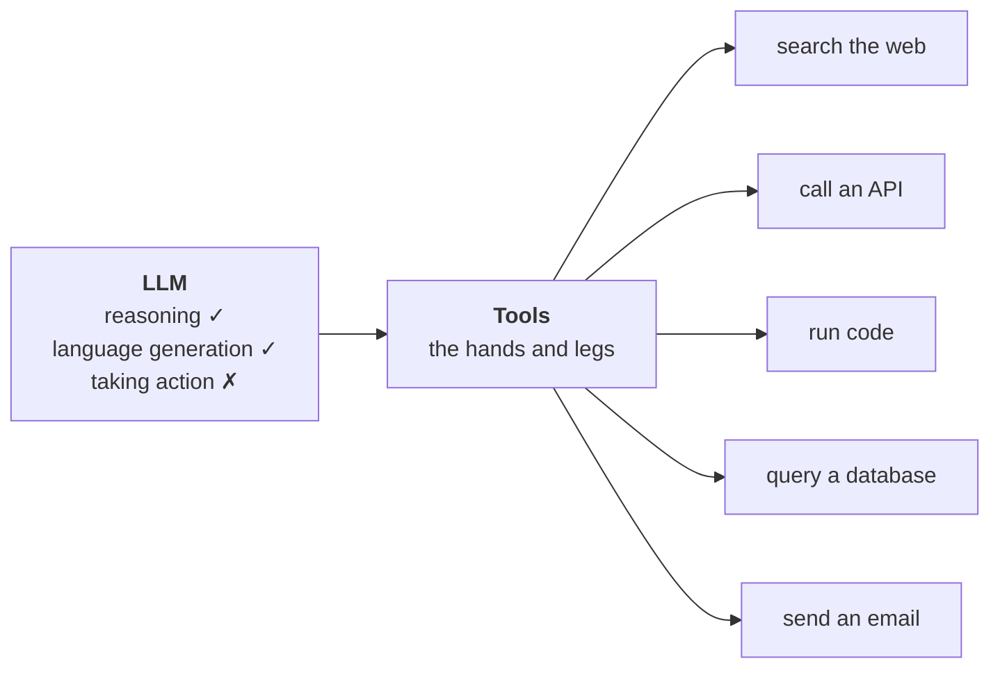
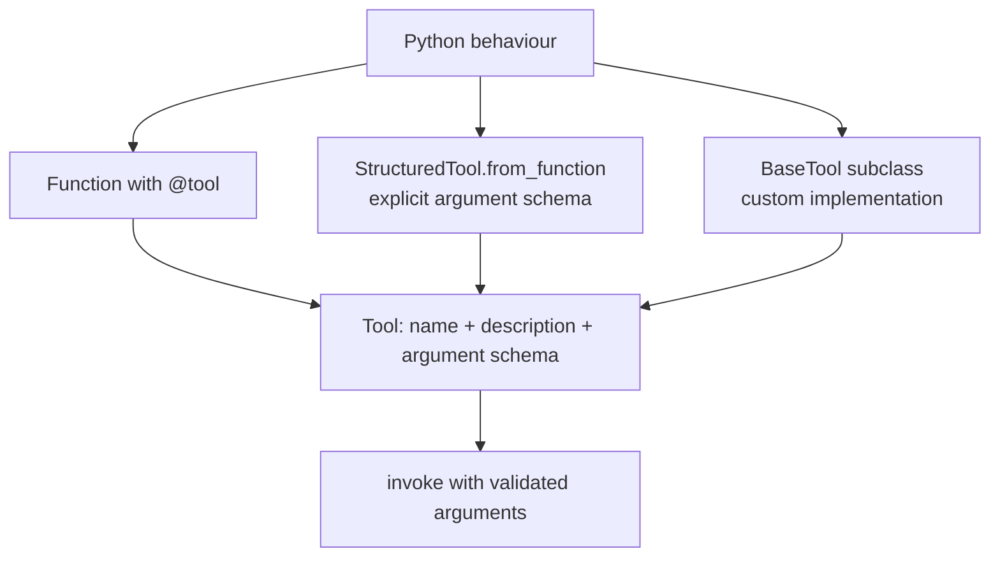

> **Video 18 of 21** (playlist video 16) · [Watch on YouTube](https://www.youtube.com/watch?v=etnLX7m2MiA)
> Notes follow the video section by section. This begins the third part of the playlist: agents.

## Where we are in the playlist

Fifteen videos so far, divided into two parts. **Part one** covered the fundamentals of LangChain — what components exist, then each one in detail: models, prompts, chains. **Part two** covered building RAG systems — document loaders, text splitters, vector stores, retrievers, and finally a RAG-based system.

**From this video the third part starts: building agents using LangChain.** Three or four videos are planned:

1. **Tools** — today
2. **Tool calling** — connecting the tool you created with your LLM so they work together
3. **Agents** — where everything you have read so far comes together

If you want to learn to create agents using LangChain **or** LangGraph, in both cases you need good knowledge of tools.

## What LLMs can and cannot do

To understand tools we have to talk about LLMs first.

If asked what the biggest power of LLMs is, you would probably say two things:

1. **Reasoning capability.** Provide a question and the LLM understands it and breaks down how to answer. **The LLM can think.**
2. **Language generation.** Once it understands how to answer, it generates the answer word by word. **The LLM can speak.**

So today's LLMs have two core capabilities: **to think, and to speak.** But that is it — apart from this, LLMs do not have any other power.

Ask an LLM *"what is the best way to go from Delhi to Bombay?"* and after thinking it tells you: flight is one option, train is one option, bus is another. But if you tell it *"okay then, book my train ticket"* — **can an LLM book you onto a train? No.** An LLM does not have the power to perform any task for you.

**In a way, an LLM is like a human body with a brain — it can think and speak — but without hands and legs.** It cannot execute any task on its own.

There are many tasks today's computer systems can perform that LLMs cannot:

- **Fetching live weather data**
- **Doing maths reliably.** Basic addition and subtraction it will perform, but give it a complex maths problem and there is a good chance the answer is not reliable — because LLMs have not learned how to solve maths, they have learned language generation
- **Calling an external API**
- **Running code**
- **Interacting with databases**
- Posting on social media on your behalf

## What tools are

**Tools are mechanisms that give your LLM hands and legs.** You create a tool to perform a given task and connect that tool with your LLM. Once that connection is performed, when that task is given to the LLM, the LLM executes it with the help of that tool.

Technically speaking, **tools are nothing but functions** in which you have written the logic to execute a task. You then **package** that function in a way that lets it interact with the LLM.

For example, you create a function that can perform train booking by visiting a ticketing website, and package it so LLMs can talk to it. Now, as soon as you tell the LLM to book you a ticket, since it has access to this function, it books the ticket for you. **That is the power of tools — the more tools you add to your LLM, the more types of task it can perform.**

> A tool is just a Python function that is packaged in a way the LLM can understand and call when needed.

The LLM thinks on its own about when it needs which tool, then calls that tool and provides inputs to it. The tool executes its work and reports back to the LLM, and the LLM tells you the work is done.



## Two types of tool

LangChain gives you **built-in tools** and **custom tools**.

The LangChain team identified that many tasks are needed by everyone — searching Google, searching the internet, searching Wikipedia, running command-line tools. So they **already created built-in tools** for these popular use cases. Anyone can use them without writing any code.

And it may be that you are building a system for your company and come across a use case **specific to your company** — there you create your own **custom tools**.

## How tools relate to agents

A big question: how is the concept of tools related to agents?

> An AI agent is an LLM-powered system that can autonomously think, decide and take actions using external tools and APIs to achieve a goal.

So an agent has **two capabilities**:

1. **Reasoning and decision making** — given a problem, it can think step by step about how to solve it
2. **Action taking** — once it has thought, it can actually perform the task

**The reasoning and decision-making part comes from the LLM. The action-taking part comes from tools.**

> **In a nutshell, the marriage of LLMs and tools is what we call an agent.**

And that is why, for building agents, the concept of tools is as important as the concept of LLMs.

## Built-in tools

> A built-in tool is a tool that LangChain already provides for you. It is pre-built, production-ready, and requires minimal or no setup.

You do not have to write the function logic yourself — you just import and use it.

Some popular built-in tools:

| Tool | What it does |
|---|---|
| `DuckDuckGoSearchRun` | search the web |
| `WikipediaQueryRun` | search any topic on Wikipedia and get a summarised version |
| `PythonREPLTool` | run raw Python code |
| `ShellTool` | run shell commands |
| `RequestsGetTool` | make HTTP requests |
| `GmailSendMessageTool` | send email using Gmail |
| `SlackSendMessageTool` | post to Slack |
| `QuerySQLDatabaseTool` | run SQL queries |

### DuckDuckGo search

It may happen that you are building an agentic application where you need to search the web in real time. A user asks *"tell me what is the most important news of today?"* — the LLM will not have this knowledge, because it has a knowledge cutoff date. So you go and search, fetch the results, and give them to the LLM, which prepares an answer.

```python
from langchain_community.tools import DuckDuckGoSearchRun

search_tool = DuckDuckGoSearchRun()

results = search_tool.invoke("top news in india today")

print(results)
```

:::note Tools are runnables
Notice you use the **`invoke`** function. Tools are also runnables, which means they have their own `invoke` method.
:::

Behind the scenes the query goes directly to a search engine, is searched there, and the results are returned to you.

### The shell tool

With it you can go to the command line and execute commands on whichever machine the code is running on.

```python
from langchain_community.tools import ShellTool

shell_tool = ShellTool()

results = shell_tool.invoke("whoami")

print(results)
```

:::tip A dependency to install
The shell tool does not work without **`langchain_experimental`** installed. Install that dependency and the code runs.
:::

Running it on Colab returns the current user — `root`. You can also run `ls` to list all the files in the current directory, and you will see the sample data folder. Whatever command line you have learned, you can run those commands here.

:::danger This tool is risky
Although it is useful, it is also a bit risky. Be careful, especially in a production setup, because if you are executing command-line commands with arguments, **some files may get deleted.**
:::

### The full list

To see the complete list of built-in tools, visit the LangChain documentation. You will find tools related to search — Bing has its own, Brave has its own, Google has its own, apart from DuckDuckGo. Then tools to run your code. Productivity-related tools — GitHub, Jira, Office, Slack, Trello. Tools for web browsing, for databases, for finance.

Go to any of them and you get a complete description and working code, so you can learn to operate that tool. In some places you are shown not only how to work with the tool but **how to build an agent using it**. The documentation is very good — go through the tools you find interesting.

## Custom tools

You create a custom tool when no built-in tool exists for your use case. The most popular situations:

**1. You want to call your own API.** Suppose you have a large travel booking application and you want to create an agent for your website — users come, talk to the agent, and get bookings done. For the agent to enter your database and perform bookings, all of that happens through APIs. So your agent has to connect to your API, and for that you create custom tools.

**2. You want to encapsulate your business logic**, which is unique to your application. You will not get a built-in tool for that.

**3. You want your LLM to interact with your own database, product or app.**

**In a nutshell:** if you already have an application and want to create an agent for it, whatever tools that agent needs to interact with your existing infrastructure, **you have to create those tools yourself** — LangChain cannot provide them.

### Three ways to turn Python behaviour into a tool

Each route produces a tool description and argument schema around executable Python behaviour. The next sections implement these routes individually.



## Way 1 — the `@tool` decorator

The simplest and most straightforward method. **Making a tool is a three-step process.**

```python
from langchain_core.tools import tool

# Step 3: add the decorator
@tool
# Step 2: add type hinting
def multiply(a: int, b: int) -> int:
    """Multiply two numbers"""    # Step 1 (part of it): the docstring
    return a * b


result = multiply.invoke({"a": 3, "b": 5})

print(result)
```

**Step 1 — create the function for your tool.** Suppose our LLM does not know how to do multiplication because it does not know mathematics. So we build an external function which, given two numbers, returns their product. Just like the simple Python functions you have created in the past.

**The only different thing:** we added a **docstring** telling what this function does. The docstring does not necessarily have to be in the function, **but it is highly recommended** — because with the help of this docstring, our LLM will understand what this function or tool does.

**Step 2 — add type hinting.** If you want `a` and `b` in the input, tell it what type they are going to be. If your function returns an integer, say so. Again not a necessary step, but **highly recommended**, because it helps the LLM understand what kind of data it needs to input and what kind it can expect in return.

**Step 3 — put the `@tool` decorator on top.** This is what makes it a special function — one that can communicate with an LLM. **All the magic is hidden in this decorator.**

Going forward, if you want to create any tool of your own, you have to do only three things: write the logic, add type hinting, and put the `@tool` decorator on its head.

### Using the tool

You call it by the name of the function. Since this is a tool, it is also a runnable, so it has the `invoke` function — and inside `invoke` you pass a **dictionary** telling it the value for each input.

Nothing special happened — we are simply using a function. **But this function is not a normal function. This is a tool**, and an LLM can interact with it.

### The three attributes

This tool has some more capabilities:

```python
print(multiply.name)          # multiply
print(multiply.description)   # Multiply two numbers
print(multiply.args)          # {'a': {'title': 'A', 'type': 'integer'}, ...}
```

- **`name`** — generally the same as the name of your function
- **`description`** — exactly the docstring you provided
- **`args`** — all the arguments required for this tool to do its work, with their types, which came from the type hinting

**You will find these three attributes with any tool at any time**, including built-in ones. Replace `multiply` with `search_tool` and you see the name `duckduckgo_search`, its description — *"a wrapper around DuckDuckGo Search, useful when you need an answer to a question about current events, the input should be a search query"* — and its arguments.

## What the LLM actually sees

One more thing worth showing. When you send this tool to the LLM, **what does the LLM see?**

**LLMs do not see the tool. They see this:**

```python
print(multiply.args_schema.model_json_schema())
```

Run it and you get a complete, large **JSON schema**:

```json
{
  "description": "Multiply two numbers",
  "properties": {
    "a": {"title": "A", "type": "integer"},
    "b": {"title": "B", "type": "integer"}
  },
  "required": ["a", "b"],
  "title": "multiply",
  "type": "object"
}
```

**When we connect our tool and LLM, the LLM actually sees this thing — not the function logic.**

> Whenever you connect a tool and an LLM, you do not send the tool to the LLM. **You send the schema of the tool.**

It is very readable: the description is written, properties `a` and `b` are described, both are required, the title is `multiply` and the type is `object`. You can generate the schema of your built-in tools the same way and see exactly what information goes to the LLM about them.

## Way 2 — `StructuredTool` with Pydantic

> A structured tool in LangChain is a special type of tool where the input to the tool follows a **structured schema**, typically defined using a Pydantic model.

**The basic idea:** this is a slightly **more strict** method. With `@tool`, in the input we sent to our function, we were just telling it through type hinting that this will be an integer and the output will be an integer. **But that is a very loose method.** You can enforce these constraints more strictly using a Pydantic model.

You create the function in the same way, but you strictly enforce the input types of the arguments with a Pydantic model.

```python
from langchain_core.tools import StructuredTool
from pydantic import BaseModel, Field

class MultiplyInput(BaseModel):
    a: int = Field(required=True, description="The first number to add")
    b: int = Field(required=True, description="The second number to add")


def multiply_func(a: int, b: int) -> int:
    return a * b


multiply_tool = StructuredTool.from_function(
    func=multiply_func,
    name="multiply",
    description="Multiply two numbers",
    args_schema=MultiplyInput,
)

result = multiply_tool.invoke({"a": 3, "b": 3})

print(result)
print(multiply_tool.name)
print(multiply_tool.description)
print(multiply_tool.args)
```

You create the Pydantic class, which inherits from `BaseModel`, with two attributes `a` and `b`, both integer inputs, both required, and with descriptions added.

Then the main work: you call **`StructuredTool.from_function`** and specify:

1. **`func`** — the function with which to create the tool
2. **`name`** — the name you give that tool
3. **`description`** — the description you give it
4. **`args_schema`** — the most important step, where you provide your Pydantic class

**Notice you are not doing all the work in just one function.** You tell it which function to use, give the tool a name and a description, and enforce the argument schema separately using a Pydantic model.

**This is a slightly more mature approach.** If you want to create production-ready agents, this method will help you a lot. But again, in most cases the decorator method is used and will do the job.

Everything else works exactly the same way — you can invoke it, and you get the description, name and args. You may also see additional things like `required: true`, which comes from the Pydantic model.

## Way 3 — subclassing `BaseTool`

To understand this you should know what the base tool class is.

> `BaseTool` is the **abstract base class for all tools** in LangChain. It defines the core structure and interface that any tool must follow, whether it is a simple one-liner or a fully customised function. All other tool types, like `@tool` and `StructuredTool`, are built on top of `BaseTool`.

**The basic idea:** an abstract class called `BaseTool` exists in LangChain. Whenever you create any tool — your own, or a built-in one — all these tools are **forced to inherit the `BaseTool` class**, because `BaseTool` describes how a tool will behave in LangChain.

So the tools you created with the `@tool` decorator, and the tools created with `StructuredTool`, **all inherit `BaseTool` by default.**

Now, rather than using those methods, we create our own tool by **directly inheriting** `BaseTool`.

```python
from langchain.tools import BaseTool
from typing import Type
from pydantic import BaseModel, Field


class MultiplyInput(BaseModel):
    a: int = Field(required=True, description="The first number to add")
    b: int = Field(required=True, description="The second number to add")


class MultiplyTool(BaseTool):
    name: str = "multiply"
    description: str = "Multiply two numbers"
    args_schema: Type[BaseModel] = MultiplyInput

    def _run(self, a: int, b: int) -> int:
        return a * b


multiply_tool = MultiplyTool()

result = multiply_tool.invoke({"a": 3, "b": 3})

print(result)
print(multiply_tool.name)
print(multiply_tool.description)
print(multiply_tool.args)
```

You create your own class, `MultiplyTool`, inheriting `BaseTool` — so your class is a **child** of `BaseTool`. Then you define your own attributes: **`name`**, where you specify the name of your tool; **`description`**, where you describe what it does; and **`args_schema`**, where you send your argument schema, defined separately using Pydantic exactly as above.

Then you define the most important method: **`_run`**. **This is exactly what its name should be — you cannot write anything else here.**

Create its object, call `invoke`, and you get the answer. As before, you can print the name, description and arguments.

### Why bother with this method

**This method gives you many benefits.** You get to do customisations at a much deeper level. In fact, you can also create an **async version** of your tool — a feature you do **not** get with the `@tool` decorator, and which is not available in `StructuredTool` either.

**So if you are building an application where you need to handle concurrency, you use this method.**

But again, for experimenting at the basic level, `@tool` is sufficient, and **in 80–90% of scenarios your work will get done with the first method.** There will be certain scenarios — a production-level application — where you may need the other two.

## Toolkits

> A toolkit is simply a **collection of related tools** that serve a common purpose, packaged together for convenience and reusability.

If you are creating multiple tools for your application and those tools are related to each other, you can club them into a toolkit.

For example, suppose you are creating multiple tools related to Google Drive: one to upload a file, one to search files, one to read a file. All are related to Google Drive, so you club them into a **Google Drive toolkit**.

LangChain has built-in toolkits, and you can create your own custom ones.

**The biggest benefit of creating toolkits is reusability.** You prepare the toolkit once and can use it in one application and in any other application too.

```python
from langchain_core.tools import tool


@tool
def add(a: int, b: int) -> int:
    """Add two numbers"""
    return a + b


@tool
def multiply(a: int, b: int) -> int:
    """Multiply two numbers"""
    return a * b


class MathToolkit:
    def get_tools(self):
        return [add, multiply]


toolkit = MathToolkit()
tools = toolkit.get_tools()

for tool_ in tools:
    print(tool_.name, "=>", tool_.description)
```

**First you need two or more related tools.** Here we create two — one to add, one to multiply — and both are related, because both do arithmetic operations. We use the `@tool` decorator method, though you could use another.

**Then you create a class** for whatever toolkit you want, named after the toolkit — here `MathToolkit`. Inside it you define a method called **`get_tools`**, which simply returns the names of the tools you want to be part of this toolkit.

Now you create an object of your toolkit, and calling `get_tools` gives you all the tools inside it. You can access all of them by running a loop, run them, and check their name, description and args.

**That is the main benefit of using toolkits** — you are able to access everything together, plus the reusability point.

## What comes next

You may feel a bit incomplete — we have learned to make tools but not how to **connect** them with an LLM. That is the topic of the next video: **tool calling**.

## Checklist

- [ ] I can explain what LLMs cannot do and why tools exist
- [ ] I can state the agent equation: LLM + tools
- [ ] I can use a built-in tool, and I know the shell tool is risky
- [ ] I can write a custom tool with `@tool` and name the three steps
- [ ] I know why the docstring and type hints matter
- [ ] I know the three attributes every tool has
- [ ] I know the LLM sees the **schema**, not the function
- [ ] I can name all three creation approaches and when each applies
- [ ] I know which approach supports async
- [ ] I can bundle related tools into a toolkit
