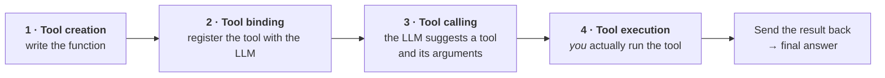
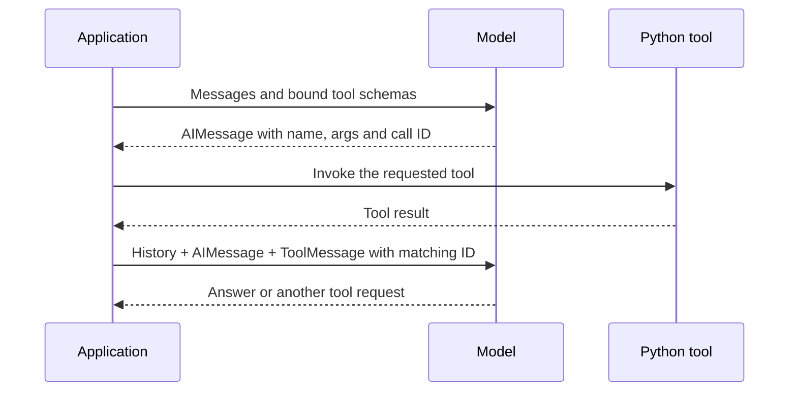
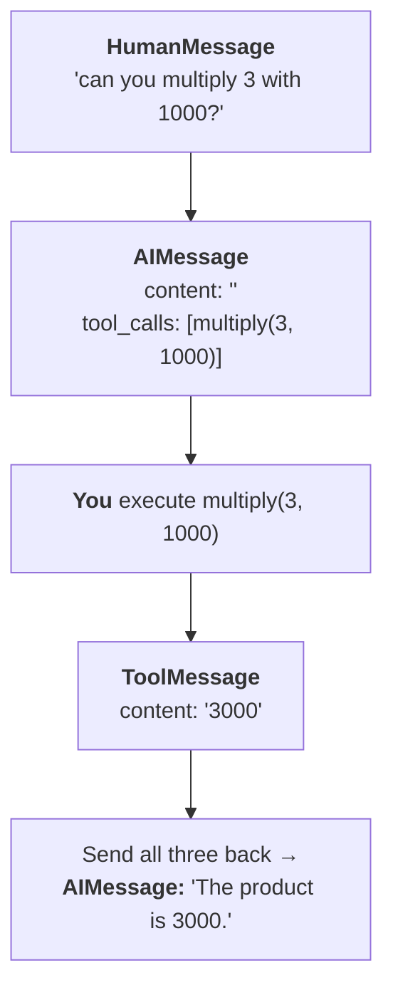
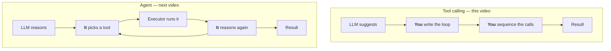

> **Video 19 of 21** (playlist video 17) · [Watch on YouTube](https://www.youtube.com/watch?v=EzYaFF7ahKw)
> Notes follow the video section by section. A continuation of the tools video.

## Recap

The last video discussed that LLMs have two very big powers. First, **reasoning** — give a question to an LLM and it can break the question down and understand what is being asked. Second, **output generation** — based on the question it accesses its parametric knowledge and generates an answer.

So you can take an LLM as a human being who is **good at thinking and good at speaking**.

**But the biggest problem:** LLMs cannot **do** things for you. Tell it to go to your database and make changes — it cannot. Tell it to post on LinkedIn or Twitter on your behalf — it cannot. Tell it to hit an API and find the current weather in Delhi — it cannot. Going by that human analogy, **LLMs are like humans who can think and speak but have no arms and legs.**

The solution was **tools**. You create tools, and the job of each tool is to carry out a task. The last video showed the DuckDuckGo search tool, the shell tool, and how to create custom tools — built-in tools, custom tools and toolkits.

**But we did not discuss how to connect a tool and an LLM**, or how an LLM calls a tool when needed. That is today's topic.

## The four steps



## Step 1 — Tool creation

We make the same simple multiplication tool, because right now we are just understanding the concept.

```python
from langchain_core.tools import tool

@tool
def multiply(a: int, b: int) -> int:
    """Given 2 numbers a and b this tool returns their product"""
    return a * b


print(multiply.invoke({"a": 3, "b": 4}))   # 12
print(multiply.name)
print(multiply.description)
print(multiply.args)
```

Since this is a runnable, you can invoke it. Fetch `name`, `description` and `args` and you get the tool's name, its description, and the schema of what input format it expects.

## Step 2 — Tool binding

> Tool binding is the step where you **register tools with a large language model** so that the LLM knows what tools are available, what each tool does, and what input format to use.

In the last video we said that while making every tool you have to tell it some things: the **name** of the tool; a **description**, so the LLM can understand what it does; and an **input schema**, so the LLM knows what format the tool expects.

When you do tool binding, three things happen:

1. Your LLM learns **what tools** it can use
2. It understands **the function of every tool**, because it has the description
3. It understands **how to invoke** each tool — in which format each tool expects its input

Once the LLM understands this, when it later calls that tool it sends the input in the exact format the tool expects.

```python
from langchain_openai import ChatOpenAI
from dotenv import load_dotenv

load_dotenv()

llm = ChatOpenAI()

llm_with_tools = llm.bind_tools([multiply])
```

Inside **`bind_tools`** you can bind any number of tools in a list. Right now there is only one, but you could add more with a comma.

:::warning Store the result in a new variable
You have to store the result in a new variable — here `llm_with_tools`. It is just an LLM, but now it also has the multiply tool. In future, whenever this LLM feels it has to do multiplication, it can call that tool.
:::

:::note Not every LLM supports tool binding
Only some LLMs have this capability. LangChain's chat model documentation lists which providers support tool calling.
:::

## Step 3 — Tool calling

> Tool calling is the process where the LLM decides, during a conversation or task, that it needs to use a specific tool, and generates a **structured output** with the name of the tool and the arguments to call it with.

Take a scenario where we are talking to an LLM and have given it access to a multiplication tool.

**A normal question.** Ask *"Hi, how are you?"* At this point the LLM will not call any tool, because it knows it can do this work without one. It simply replies.

```python
result = llm_with_tools.invoke("Hi how are you?")
print(result.content)      # "Hello! I'm here to help you with whatever..."
print(result.tool_calls)   # []
```

**A question needing the tool.** Ask *"can you multiply 3 with 10?"*

```python
result = llm_with_tools.invoke("can you multiply 3 with 10?")

print(result.content)       # '' — empty!
print(result.tool_calls)
# [{'name': 'multiply', 'args': {'a': 3, 'b': 10},
#   'id': 'call_...', 'type': 'tool_call'}]
```

Notice: the **content is empty**. But you see something new — **`tool_calls`**.

The LLM went and checked which tools it had available. It found the multiply tool. So it generated a structured output printing the **name of the tool** and a schema telling **what to send as input** — the value of `a` is 3 and the value of `b` is 10.

`tool_calls` is a **list**, because there may be multiple tool calls. Right now there is one, so you can fetch `result.tool_calls[0]`.

Apart from name and args you may see an **`id`** of the tool call — a unique ID for every tool call — and the type. You can ignore those two for now.

### The most important misconception

A doubt will come to mind: *we thought tool calling means the LLM will turn around and call this tool — invoke it and bring back the answer.*

**It is not like that.**

> The LLM does **not** actually run the tool. It just **suggests** the tool and the input arguments. The actual execution is handled by LangChain or the programmer.

**And this is logical too.** Think about it: if the LLM starts calling and executing tools on your behalf, that can be **very risky**, because you cannot trust LLMs too much. It is possible it calls a tool which is completely wrong and then brings the result to you. **You would like to keep this control with yourself.**

You are just asking for advice from the LLM: *on the basis of this query, tell me which tool you think would be right, and tell me the input, so I can send that input to that tool and bring back the result.*

**Tool execution is not done by the LLM.** This is a big confusion among beginners.

## Step 4 — Tool execution

> Tool execution is the step where the actual Python function is run using the input arguments that the LLM suggested during tool calling.

Once the LLM suggests you can use this tool with these inputs, **you as the programmer call that tool yourself**, sending the same inputs the LLM told you. The tool executes and you get the result.

Two ways to do it:

```python
# Send just the arguments -> the raw return value
print(multiply.invoke(result.tool_calls[0]["args"]))   # 30

# Send the entire tool call -> a ToolMessage
tool_result = multiply.invoke(result.tool_calls[0])
print(tool_result)
# ToolMessage(content='30', name='multiply', tool_call_id='call_...')
```

**If you send only the arguments you get the result.** But if you send the **entire tool call**, you get the result wrapped in a very nice package called a **`ToolMessage`**.

Messages were taught earlier — `SystemMessage`, `HumanMessage`, `AIMessage`. There is one type not covered then, and this is it: a **tool message** is a special message you get when you execute a tool with the help of a tool call.

**The biggest feature of a tool message:** you can **send it back to your LLM** and tell it *"look, when I executed the tool, my tool gave me this result."* After seeing that, the LLM generates its reply.

So rather than sending just the arguments, send the entire tool call and get back a tool message.

### The complete tool-call round trip

The model selects a tool and its arguments. Your application executes it, attaches a ToolMessage with the matching call ID, and sends the updated conversation back to the model.



## Putting the loop together

We organise the whole thing by maintaining a **messages list**.

```python
from langchain_core.messages import HumanMessage

query = HumanMessage("can you multiply 3 with 1000?")

messages = [query]

# 1. The LLM suggests a tool
result = llm_with_tools.invoke(messages)
messages.append(result)

# 2. We execute it
tool_result = multiply.invoke(result.tool_calls[0])
messages.append(tool_result)

# 3. The LLM sees the result and answers
print(llm_with_tools.invoke(messages).content)
# "The product of 3 and 1000 is 3000."
```



**We are maintaining a conversation history:** first a human message came, then an AI message, then a tool message. Finally we send the entire history to the LLM, so it has the complete context from beginning to end — and now we get our final output.

:::tip A mistake made in the video, worth avoiding
When invoking the LLM the first time, the query was sent **hard-coded** instead of sending `messages`. You should send `messages`, so the model sees the full list.
:::

## A real application — live currency conversion

Now something more meaningful: give our LLM the power to do **currency conversion in real time**.

Every country has its own currency, and the conversion factor between currencies changes dynamically — daily, hourly, even by the minute. The factor between the Indian rupee and the US dollar is around 85, and it fluctuates many times throughout the day.

**If you ask an LLM how much 80 USD is in INR**, you get an answer — but the LLM has a conversion factor from some old date, and answers from historical data. **It is not a real-time answer**, because the LLM does not have real-time conversion factors.

So we create tools. We will use an **exchange rate API**: enter your source currency and your target currency, and it returns the conversion factor at that point.

We need **two tools**: one to fetch the conversion factor by hitting the API, and one to do the multiplication. Understand why — if someone asks to convert 80 USD into INR, we do it in two steps. First fetch the conversion factor, say 85. Then multiply 85 by 80, and that answer is your result in INR.

### The two tools

```python
from langchain_core.tools import tool
import requests
import json

@tool
def get_conversion_factor(base_currency: str, target_currency: str) -> float:
    """
    This function fetches the currency conversion factor between a given
    base currency and a target currency
    """
    url = (f"https://v6.exchangerate-api.com/v6/YOUR_API_KEY/pair/"
           f"{base_currency}/{target_currency}")
    response = requests.get(url)
    return response.json()


@tool
def convert(base_currency_value: int, conversion_rate: float) -> float:
    """
    Given a currency conversion rate this function calculates the target
    currency value from a given base currency value
    """
    return base_currency_value * conversion_rate


print(get_conversion_factor.invoke({"base_currency": "USD", "target_currency": "INR"}))
print(convert.invoke({"base_currency_value": 10, "conversion_rate": 85.16}))
```

For the API you have to register and generate your own API key. The URL takes your base currency, your target currency and your key, and returns the conversion rate along with other information, including when the factor was last updated.

Since these are tools, you invoke them with a dictionary rather than calling them like normal functions.

### Binding both tools

```python
from langchain_openai import ChatOpenAI
from langchain_core.messages import HumanMessage
from dotenv import load_dotenv

load_dotenv()

llm = ChatOpenAI()

llm_with_tools = llm.bind_tools([get_conversion_factor, convert])

messages = [HumanMessage(
    "What is the conversion factor between USD and INR, and based on that "
    "can you convert 10 USD to INR"
)]

ai_message = llm_with_tools.invoke(messages)
messages.append(ai_message)

print(ai_message.tool_calls)
```

### The bug this exposes

Look at the tool calls and you see **two** of them:

```python
[
  {'name': 'get_conversion_factor',
   'args': {'base_currency': 'USD', 'target_currency': 'INR'}},
  {'name': 'convert',
   'args': {'base_currency_value': 10, 'conversion_rate': 74.53}},
]
```

The first is fine — base currency USD, target currency INR.

**But in the second there is a problem.** The base currency value is 10, and the conversion rate is set to **74.53**. Where did that come from?

**Why this happened:** we asked our LLM **two questions simultaneously** — what is the conversion rate between USD and INR, and convert 10 USD into INR. Behind the scenes the LLM tried to tackle both questions **together** instead of sequentially.

For the first question it called `get_conversion_factor` with the right arguments. But it also had to call a tool for the second question, and to call `convert` it must specify the input arguments — `base_currency_value` **and** `conversion_rate`.

**It had not yet received the conversion rate from the previous tool.** So it went into its training data, accessed its parametric knowledge, and from whatever its last cutoff date was, produced the number 74.53.

**Our entire logic failed.** Our logic was that the first tool would execute, give us the convert factor, and we would pass that factor into the second tool call. Since the LLM supplied a different conversion rate, that chain broke.

### The fix — `InjectedToolArg`

To handle this kind of scenario LangChain has **injected tool arguments**.

```python
from typing import Annotated
from langchain_core.tools import InjectedToolArg

@tool
def convert(base_currency_value: int,
            conversion_rate: Annotated[float, InjectedToolArg]) -> float:
    """
    Given a currency conversion rate this function calculates the target
    currency value from a given base currency value
    """
    return base_currency_value * conversion_rate
```

**What this code means:** when our LLM calls this tool, it will **not** set the conversion rate. In a way we are telling the LLM: *do not try to fill this argument — the developer will inject this value after running the earlier tools.*

> If you make any argument an injected tool argument inside your tool, the LLM does not set its value at the time of tool calling. **You** set it.

Run it again and look at the second tool call: **only `base_currency_value` is set.** The conversion rate is left empty, and now you as the programmer have the power to set it when you get the value.

### Executing the dependent tools in order

```python
for tool_call in ai_message.tool_calls:
    # execute the first tool and get the value of conversion rate
    if tool_call["name"] == "get_conversion_factor":
        tool_message1 = get_conversion_factor.invoke(tool_call)
        # fetch this conversion rate
        conversion_rate = json.loads(tool_message1.content)["conversion_rate"]
        # append this tool message to messages list
        messages.append(tool_message1)

    # execute the second tool using the conversion rate from tool 1
    if tool_call["name"] == "convert":
        # fetch the current arg and inject the missing one
        tool_call["args"]["conversion_rate"] = conversion_rate
        tool_message2 = convert.invoke(tool_call)
        messages.append(tool_message2)

print(llm_with_tools.invoke(messages).content)
```

Walking through it: we enter the tool calls inside our AI message and run a loop. We check whether the current tool call's name is `get_conversion_factor` — if so, we invoke that tool, passing the **entire tool call**, which gives us a tool message. From that message we extract the conversion rate, and we also append the message to our list.

Then, for the second tool, before executing we must fetch its arguments and **add one more argument** — the conversion rate. `tool_call["args"]` is a dictionary, so we simply add a new key-value pair. Then we execute it exactly like the first.

:::warning `ToolMessage.content` is a string, not a dictionary
Try `tool_message1.content["conversion_rate"]` and you get an error, because what you are seeing is **JSON**, not a Python dictionary. You have to explicitly convert it first: fetch the content and put it into **`json.loads`**. Then you can read the conversion rate.
:::

Run everything and print the messages: there is a human message, an AI message, and then **two tool messages**. Now the LLM has all the context available, so we pass it the whole thing and get the final answer — the conversion factor between USD and INR, and based on it, 10 USD converted to INR.

**The best part:** you can do real-time conversion between any two currencies with this code, and get today's rate. Try the reverse too — INR to USD.

## Was that an AI agent?

A question may come to mind: the application we just created used the concept of tools and tool calling, which are used to build agentic applications. **So was it really an AI agent?**

**The answer is no.**

**The biggest reason:** when you create an AI agent, its biggest characteristic is that it is **autonomous** — it breaks down a problem on its own and solves it step by step, without needing help in between.

In the application we built, **we as the programmer did a lot of the code and decision making ourselves.** We wrote the loop, we checked tool names, we sequenced the calls, we injected the rate.

**If an agent were to solve this same problem**, it would work like this: the user gives a query to convert 10 USD to INR. The agent thinks *"I do not know the conversion rate, so first I have to get it"*, and calls `get_conversion_factor`. From there it gets the rate. As soon as it has it, it thinks *"now I know the rate, next I should call convert with 10 and 85.34"*, calls the next tool, gets the result, and gives you the final answer.

**Unlike us, it does not need everything executed manually.** That entire system works autonomously — and that is the next video.



## Checklist

- [ ] I can name the four steps of tool calling
- [ ] I can explain what tool binding tells the LLM
- [ ] I can explain why the LLM does not execute tools, and why that is correct
- [ ] I can read `tool_calls` and execute a suggested tool
- [ ] I can explain what a `ToolMessage` is and why you send the whole tool call
- [ ] I can spot and fix the dependent-argument bug with `InjectedToolArg`
- [ ] I know `ToolMessage.content` needs `json.loads`
- [ ] I can explain why this is not yet an agent
