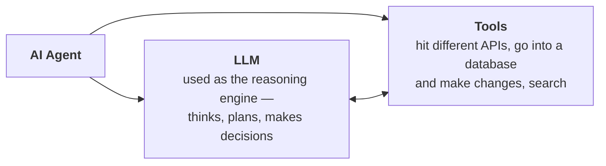
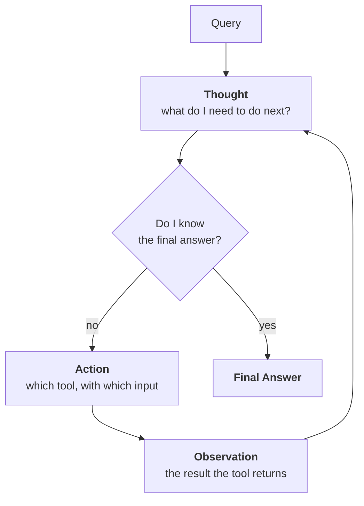
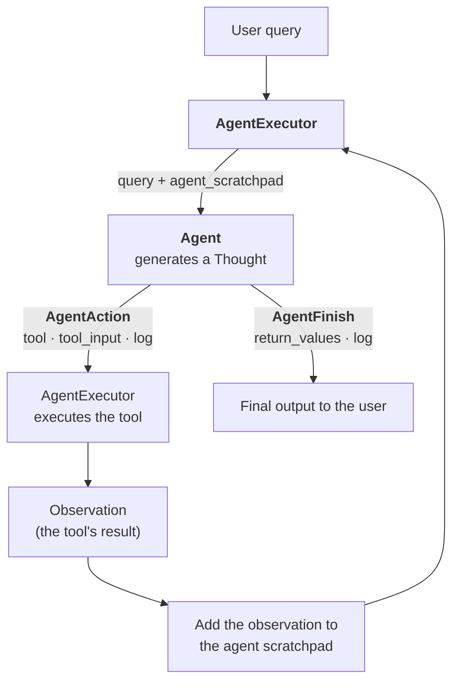

> **Video 20 of 21** (playlist video 18) · [Watch on YouTube](https://www.youtube.com/watch?v=gm_lQG8fYjI)
> Notes follow the video section by section. This was the last video of the original playlist plan.

The video divides into two parts: a conceptual introduction to AI agents through a use case, then building a basic AI agent in LangChain.

## The problem agents solve

Assume you have to plan and execute a trip from Delhi to Goa, 1 to 7 May. Several kinds of work are involved.

**Booking travel.** You go to a travel website or a railway site. You are given a form: where you board, where you go, what date, which class. You search, you get a list of options, you see where seats are vacant, and if you like the train you book it. **And you do this for both directions** — Delhi to Goa, then Goa back to Delhi.

One aspect covered. **Is the work finished? No.**

**Booking a stay.** Back to the website, into the hotel section. You say you have to stay in Goa, this is the check-in date, this the check-out date, this many people — **another form**. You search, many hotel options appear, and for each you check the reviews, the price, whether breakfast is included. After figuring all that out you select a hotel, pay, and finish the booking.

Second aspect covered. **Still not finished.**

**Planning what to do.** What do you want to do in these seven days? Maybe a spot, a beach, a party. So you search the internet for the top attractions in Goa and build a travel itinerary according to your personality: first day here, second day there, third day somewhere else. And obviously, to go to all those places you have to book cabs, and sometimes buy tickets. **You do all that planning too.**

Finally you can say you have planned your Goa trip.

**If you have ever planned a trip like this, you know it often takes several days.** There is a lot of decision making, a lot of research, data to gather from many places before deciding, payments to make, hotels to clarify with by mail or phone. **It is a very hectic process.**

**And it is not in everyone's control.** Imagine a person over 60 being told to do all this. Do you think they could figure it all out and plan the trip themselves?

**The point:** today's websites have a very unnatural way of interacting with them. As a human you have to figure out a lot of things. **AI agents make this task easier.**

## The same trip, with an agent

Now assume you are a 60-year-old who wants to plan a Goa trip. A travel website has an agent installed, so you talk to it directly through a chat interface.

**You state your goal as clearly as you can:** *"Can you create a budget travel itinerary from Delhi to Goa, 1 to 7 May?"*

Then the agent starts working. Step by step:

**1. It understands the intent.** It understands you want to start from Delhi, go to Goa, travel on these dates, stay for this duration. Your preference is to travel on a **budget** — you do not want to spend too much.

**2. It creates an internal goal for itself:** *plan a complete itinerary and optimise cost.* It tells itself it needs to plan affordable travel, stay, local movement and activities over seven days.

**3. It plans travel options.** It has tools — it can go to a train API and search which trains are available on a given date, and it can check flight APIs for flight options between two cities. It goes to both, brings the options back, and **compares internally**: prices, duration, availability. It surfaces the cheapest and fastest option.

You see a message like: *the cheapest and most available option is a train from Delhi on 30 April night; sleeper class is available at ₹800, 3AC at ₹1500; it reaches Goa on 1 May.*

**4. You reply:** *"book me a ticket in 3AC."* The agent takes that input and moves to the next step.

**5. Booking a stay.** It hits hotel APIs, or uses scripted data about hotels. It filters: since you want budget travel, under a certain price, near popular beaches, with good reviews. It brings you an option or two — *I found a dorm room at a hostel at ₹650 per night. Shall I book it for the entire duration?* You agree.

**6. Local travel.** It suggests that for budget travel in Goa, a scooter rental is most cost effective: *shall I pre-book a scooter at ₹300 per day?* — ₹1800 for six days. You say yes.

**7. The day-by-day plan.** It hits an API or knowledge base, brings out the popular options, and plans your days: these beaches on Monday, this fort, churches on 3 May, South Goa on 4 May. You say yes, finalise it.

**8. The return journey.** Options again: train at ₹800 and ₹1500, or an early-morning flight at ₹2800. You select the train.

**Throughout, the agent explains your planning step by step, executes each step, takes your preferences and keeps them in its memory.**

**9. A budget summary.** *Train ₹3000, stay this much, scooter plus fuel this much, food this much, sightseeing this much — total around ₹14,000.* You say it looks good, finalise it, book the tickets.

**10. It executes the bookings.** Since it has your data, possibly your saved cards, and access to a payment API, it goes behind the scenes and does all the bookings automatically. Obviously in some places you have to enter numbers or passwords yourself.

**11. Afterwards** it sends all the invoices to your mail, adds all the main events to your calendar — when to catch the train, when to check in — and **sets reminders**, so you do not miss anything.

All you had to do was keep saying yes, and if you did not like something, give input — and it would readjust its approach completely.

**Which experience would you prefer?** The one where the user individually does all these things, or the one where an agent asks what you need and then executes the entire task accurately, step by step? **The second — because the entire experience is seamless and your effort is reduced a lot.**

That is why AI agents are becoming so popular. And this was just one domain — imagine customer support, education, any other domain. **There are a lot of customers who are older, or younger, or less comfortable with devices, for whom accessing these websites is very difficult. AI agents solve that problem.**

## The technical definition

> An AI agent is an intelligent system that receives a **high-level goal** from a user and **autonomously plans, decides and executes** a sequence of actions by using external tools, APIs and knowledge sources — all while **maintaining context**, reasoning over multiple steps, **adapting to new information** and optimising for the intended outcome.

In simple words: you give it a high-level goal. In our example the goal was *"I want to go from Delhi to Goa for 7 days, on a budget — plan this trip for me."*

**We did not tell it how to achieve the goal.** The agent has a mind of its own: it can plan and execute things step by step, because it has support for some external tools. When it had to decide the cheapest way to travel from Delhi to Goa, it had access to train APIs and flight APIs, so it quickly fetched the information, compared, and suggested the best option.

**And the biggest thing:** when it works in multiple steps it is able to **maintain context** — it always knows what its end goal is.

And if new information comes in between, it can **re-plan** around it. For example, suppose it discovers that 5 May is a public holiday, so many public spots will be closed. That is new information it learned while working, and it can re-plan around it.

## LLM vs agent

At a technical level, what is the difference?



An AI agent has **two things**: an LLM, and some tools. **Combining these two makes an AI agent.**

The agent uses the **LLM as its reasoning engine**. Whenever it has to think or make decisions, it takes help from the LLM, because the LLM understands natural language — so with its help the agent understands how a given task has to be executed.

And it has **access to tools**, which is why an AI agent can actually **perform some kind of action**. An LLM does not have this power. LLMs are good at reasoning and at giving output, but they do not have access to tools, so you cannot get anything done through an LLM alone — you cannot book tickets with one.

> **In a nutshell, an AI agent is a combination of an LLM — which acts as the reasoning engine — and tools, with which you can perform actions.**

## Five characteristics of an agent

1. **Goal-driven.** You just tell it what task has to be done. Telling it **how** is not required — the agent figures it out.
2. **Planning.** A very big aspect. It can plan on its own, break down the problem, and execute step by step.
3. **Tool awareness.** It has awareness of which tools it has — and not only that, **in which situation to use each one**.
4. **Context maintenance.** The context always remains. While doing any work it maintains a memory: *this much work has been executed so far, I am talking to this user, I have these details about them, these are their preferences, and this is what I have to do next.*
5. **Adaptive.** If something goes wrong in the middle of its plan, it can readjust and make a new plan. If it suddenly finds that the train API is not working, it quickly uses some other tool where it can get train data, or suggests *"the train API is not working, shall I suggest bus travel instead?"*

## Building a basic AI agent

The plan: keep it very simple at first. We provide **one tool** — the agent can search the internet. If a user enters a query and our agent thinks the answer is on the internet, it searches, brings back information, and generates its response.

The reason for keeping it simple: first see **how an agent is made in LangChain**. When you look at this code initially you will feel like an alien and not understand what is happening — so first look at the code, then the explanation of what is going on behind the scenes, then we improve the agent.

```python
from langchain_community.tools import DuckDuckGoSearchRun
from langchain_openai import ChatOpenAI
from langchain.agents import create_react_agent, AgentExecutor
from langchain import hub
from dotenv import load_dotenv

load_dotenv()

# 1. The tool
search_tool = DuckDuckGoSearchRun()

# 2. The LLM, which gives the agent its reasoning capability
llm = ChatOpenAI()

# 3. A pre-built ReAct prompt from LangChain Hub
prompt = hub.pull("hwchase17/react")

# 4. Create the agent
agent = create_react_agent(
    llm=llm,
    tools=[search_tool],
    prompt=prompt,
)

# 5. Wrap it in an executor
agent_executor = AgentExecutor(
    agent=agent,
    tools=[search_tool],
    verbose=True,
)

# 6. Run it
response = agent_executor.invoke({"input": "3 ways to reach Goa from Delhi"})

print(response)
print(response["output"])
```

**Two functions are imported from `langchain.agents`:** `create_react_agent` and `AgentExecutor`. And **`hub`** is imported from LangChain — LangChain has a hub where you get many types of prompt, so if you need a predefined prompt you can import it from there.

**The prompt we pull is called `react`.** Why? Because the agent we are going to make is a **ReAct agent**. **ReAct** stands for **Reasoning + Action**. There are many types of AI agent, and every agent has a design pattern behind it — the one we are using is called ReAct. This particular prompt was written by the creator of LangChain for ReAct agents, and we use it to build ours.

**To create a ReAct agent you tell it three things:** which **LLM** the agent will use for its reasoning capabilities, which **tools** it has access to, and a **prompt**.

Then you create an **`AgentExecutor`** object from that agent.

:::note Two different things: Agent and AgentExecutor
This can be confusing for a beginner.

**The agent** is the main one who does all the planning, breaks down problems and decides who will do what and when — and which tool to use.

**The agent executor** is the one who **obeys** the agent and actually executes the steps.

Say you ask *"whatever the temperature of Delhi is right now, multiply it by 10."* The agent starts to think: *to solve this I first need to fetch the temperature of Delhi, and to do that I have to hit a weather API.* That is the agent thinking. **Now who does the work? The agent executor.** It hits the weather API and brings the temperature back. The agent starts thinking again: *now I have Delhi's temperature, I have to multiply it by 10, so I need a multiplication tool.* Again the work goes to the agent executor, which gets the multiplication done and returns the result.

**The agent's job is to think and plan. The agent executor executes what has been thought.**
:::

To create the agent executor you tell it two things: **who your agent is**, and **what tools that agent has available**.

:::tip Why are tools specified twice?
It may seem confusing that you specify the tools both when creating the agent and when creating the executor. They are needed for two different jobs: `create_react_agent` needs them to **describe** the tools in the prompt, and `AgentExecutor` needs them to **execute** them.
:::

Since the agent executor is itself a runnable, it has an `invoke` function. And because we set **`verbose=True`**, whatever the agent is thinking, you get to see.

**Running it.** Ask *"what are the three ways to reach Goa from Delhi?"* and you see the trace: *entering new AgentExecutor chain* — the agent thinks *"I should search for the most common ways to reach Goa from Delhi to provide accurate information."* The action it plans: use the DuckDuckGo search tool, with that query as the action input. The agent executor goes and uses the tool, the response comes back, and you get your final answer: the three common ways are by air, train and road.

## How ReAct works

> ReAct is a design pattern used in AI agents that stands for **Reasoning + Acting**. It allows a language model to **interleave internal reasoning with external actions** in a structured, multi-step process.

Until now your experience with LLMs has been that you send a query and the LLM turns around and gives you a response — a **single-turn interaction**.

**ReAct is different.** You implement a **multi-step process** to solve the given problem in a structured manner, and throughout you do two things together: apply **reasoning** so you can solve the problem step by step, and wherever you feel you have to perform an action, you perform that action **with the help of a tool**.

**So in ReAct you are combining two philosophies:** reasoning, and acting with tools.

### The loop

In ReAct you do precisely three things — **Thought**, **Action** and **Observation** — repeatedly inside a **loop**, until you get your final answer.



### A concrete example

You ask a ReAct agent: *"Can you tell me the population of the capital of France?"*

**Iteration 1**
- **Thought:** to answer this, first I need to find the capital of France.
- **Action:** the agent decides it has to search. It has a search tool, so it sends the input *"capital of France"*.
- **Observation:** the tool performs the search and returns **Paris**.

**Iteration 2**
- **Thought:** now I have the capital of France, which is Paris. So now I need to find the population of Paris.
- **Action:** search again, this time with the input *"population of Paris"*.
- **Observation:** the tool returns **2.1 million**.

**Iteration 3**
- **Thought:** I now know the final answer. I know the capital of France, and I know its population. So now I am in a position where I can answer.
- Instead of triggering an action, the agent generates a **Final Answer**: *Paris is the capital of France and it has a population of 2.1 million.*

**The loop breaks right there** and the user gets the answer.

**Notice the agent does two things throughout:** it is **reasoning** through Thought, and **using tools** through Action. The marriage of those two philosophies is ReAct.

**And the best part about this design pattern:** whatever the agent thinks and does is **visible to you** as a user. The entire **thought trace** is shown, so you always understand what the agent is thinking and doing.

### When ReAct is useful

- **Multi-step problems** — like the one above, where you first need the capital and then the population
- Tasks where **tools need to be used** — web search, database lookup, APIs
- It keeps its reasoning **transparent and auditable** — the user can always see what the agent is thinking and doing

ReAct was introduced to the AI world through the 2022 paper **"ReAct: Synergizing Reasoning and Acting in Language Models."** Reading the abstract and introduction gives you more perspective on how it works as an architecture.

## How Agent and AgentExecutor implement ReAct

The **AgentExecutor** is the more important person here — it does more of the heavy lifting.

In ReAct you have to run the Thought–Action–Observation loop continuously until the final answer comes. **Who orchestrates this? The AgentExecutor.** It takes the responsibility of running the loop.

**Step 1.** When the loop starts, the AgentExecutor sends the agent **two things**:

1. **The user's query** — for example *"tell me the population of the capital of France."*
2. **The thought trace so far** — the sequence of Thought, Action and Observation that has happened up to now. Obviously, when the loop starts, this is **empty**.

This is a very important part of the AgentExecutor's work: during **each iteration** of the loop it sends the agent the user's query and the thought trace so far.

**Step 2.** As soon as the agent has the query and the thought trace, it **begins to think** — it executes the Thought step. On the basis of that thought it makes an **action plan**: this tool must be used, with this input. It returns that to the AgentExecutor.

**Step 3.** The AgentExecutor goes to that tool, passes the action input, the tool does its job and returns the result to the AgentExecutor. That result becomes the **Observation**.

**Step 4.** The AgentExecutor **adds the observation to the thought trace**. The trace is updated, the iteration is over, and the next one begins: the AgentExecutor again gives the agent the user query and the **updated** thought trace. The agent generates another thought, plans another action, and so on.

**And this is how ReAct is implemented.**



### The two objects the agent returns

**`AgentAction`** has three attributes: **`tool`** — which tool to execute; **`tool_input`** — what input to give that tool; and **`log`** — the agent scratchpad so far. When this comes back, the loop **continues**.

**`AgentFinish`** has two attributes: **`return_values`**, which holds your final output, and **`log`**. When this comes back, the loop **closes** and the user gets the output.

### How the agent is created

`create_react_agent` mainly needs two things: an **LLM**, and a **prompt**. The prompt guides the LLM on how it can work as a ReAct agent.

You could write the prompt yourself, but it is recommended to use a pre-built one that already works well — which is why we pull it from **LangChain Hub**.

> LangChain Hub is a place where people have created and hosted their own prompts. It is basically a GitHub for prompts.

Go there and you will find all kinds: separate prompts for RAG, separate prompts for agents.

### What is inside the ReAct prompt

Read it and the whole mechanism becomes concrete. In essence it says:

```text
Answer the following questions as best you can. You have access to the
following tools:

{tools}

Use the following format:

Question: the input question you must answer
Thought: you should always think about what to do
Action: the action to take, should be one of [{tool_names}]
Action Input: the input to the action
Observation: the result of the action
... (this Thought/Action/Action Input/Observation can repeat N times)
Thought: I now know the final answer
Final Answer: the final answer to the original input question

Begin!

Question: {input}
Thought: {agent_scratchpad}
```

So we send our tools list, telling it what tools are available. Then we say: use the following format. **Thought / Action / Action Input / Observation is a loop that can run N times.** And when does it stop? When the thought becomes *"I now know the final answer"* — then you print the Final Answer.

At the end, **`input`** is where the user's query goes, and **`agent_scratchpad`** is where the complete thought trace so far goes.

**The scratchpad gets bigger every loop** — after the first loop it holds one iteration, after the second it holds two. **You send the whole thing every time.** In a way this maintains a kind of memory of what the agent has done so far and what the results were.

**To summarise:** `create_react_agent` needs an LLM and a prompt, and for the prompt to do its job it needs a list of tools. Once done, it returns an **agent object**. Give that agent object two things — the **user query** and the **thought trace so far** — and internally it generates a thought and gives you one of two answers: either an **action**, or a **final output**. If it gives an action, you go and execute the tool, bring the observation, and repeat. If it gives the final output, you break the loop and show it to the user.

## Adding a second tool

Now we improve the agent by giving it another tool — a **custom** tool that, given the name of a city, returns the current weather conditions: temperature, humidity, wind speed and more. It works by hitting a weather API, wrapped with the `@tool` decorator.

```python
import requests
from langchain_core.tools import tool
from langchain_community.tools import DuckDuckGoSearchRun
from langchain_openai import ChatOpenAI
from langchain.agents import create_react_agent, AgentExecutor
from langchain import hub
from dotenv import load_dotenv

load_dotenv()

search_tool = DuckDuckGoSearchRun()


@tool
def get_weather_data(city: str) -> str:
    """
    This function fetches the current weather data for a given city
    """
    url = f"https://api.weatherstack.com/current?access_key=YOUR_KEY&query={city}"
    response = requests.get(url)
    return response.json()


llm = ChatOpenAI()

prompt = hub.pull("hwchase17/react")

agent = create_react_agent(
    llm=llm,
    tools=[search_tool, get_weather_data],
    prompt=prompt,
)

agent_executor = AgentExecutor(
    agent=agent,
    tools=[search_tool, get_weather_data],
    verbose=True,
)

response = agent_executor.invoke({
    "input": "Find the capital of Madhya Pradesh, then find its current weather condition"
})

print(response["output"])
```

Everything else is the same — the LLM, the ReAct prompt. **The only change:** the new tool is added when creating the agent, and also in the executor's tools.

**Watching it run.** The trace shows:

- **First thought:** *I should first find out the capital of Madhya Pradesh, and then check the current weather conditions for the city.* Action: DuckDuckGo search. The tool is called and returns a large observation.
- The whole thing goes back to the agent. **Second thought:** *now I know the capital of Madhya Pradesh is Bhopal. I can use the `get_weather_data` function to check its current weather condition.* Action: that tool, with the input Bhopal. The second tool's output comes back as the second observation.
- Back to the agent. **Third thought:** *the current weather condition in Bhopal, Madhya Pradesh is partly cloudy with a temperature of 40 °C.* No next action is needed — everything is already there. So it generates a **final answer**: the capital of Madhya Pradesh is Bhopal and the current weather condition is partly cloudy.

**After all that discussion, this code should now feel much more accessible.** And honestly, if you understand the whole thing, **you could write this code from scratch in Python** — you would not strictly need `create_react_agent` or the `AgentExecutor` class.

## A twist at the end — use LangGraph for real agents

There is one piece of bad news. **The method just shown for making agents is now kind of old.**

Today, if you want to create an **industry-grade AI agent, you do not use LangChain for that.** Go to LangChain's own website and they have written that if you want to build very scalable AI agents, their methods and library are **not capable** of it.

They suggest you should study **LangGraph**, which is a library by the LangChain team. **You should read LangGraph if you want to build really solid, scalable AI agents.**

**So why was this taught?** To show you that it **is** possible in LangChain — currently possible, and nothing stops you. It is just that it is **not recommended**. The goal was to show that you can create agents using LangChain, and to give you a flavour of what AI agents are, how they are made, and how they work.

Going forward, discussions around AI agents will use libraries that really help you create very powerful ones.

## Checklist

- [ ] I can explain the problem agents solve, with the trip-planning example
- [ ] I can state the technical definition of an AI agent
- [ ] I can state the agent equation: LLM (reasoning) + tools (action)
- [ ] I can name the five characteristics of an agent
- [ ] I can explain ReAct and trace the France population example
- [ ] I can state the Agent / AgentExecutor split
- [ ] I can explain what `agent_scratchpad` holds and why it grows
- [ ] I can name the two objects an agent returns and what each triggers
- [ ] I can read the ReAct prompt and map it to the loop
- [ ] I can build a ReAct agent with multiple tools
- [ ] I know why LangGraph is recommended for production agents
