> **Video 20 of 21** (playlist video 18) · [Watch on YouTube](https://www.youtube.com/watch?v=gm_lQG8fYjI)
> The concepts follow the video; the code and API explanations below are updated for LangChain v1. This was the last video of the original playlist plan.

The video divides into two parts: a conceptual introduction to AI agents through a use case, then building a basic AI agent in LangChain.

## The problem agents solve

Assume you have to plan and execute a trip from Delhi to Goa, 1 to 7 May. Several kinds of work are involved.

**Booking travel.** You go to a travel website or a railway site. You are given a form: where you board, where you go, what date, which class. You search, you get a list of options, you see where seats are vacant, and if you like the train you book it. **And you do this for both directions** — Delhi to Goa, then Goa back to Delhi.

One aspect covered. **Is the work finished? No.**

**Booking a stay.** Back to the website, into the hotel section. You say you have to stay in Goa, this is the check-in date, this the check-out date, this many people — **another form**. You search, many hotel options appear, and for each you check the reviews, the price, whether breakfast is included. After figuring all that out you select a hotel, pay, and finish the booking.

Second aspect covered. **Still not finished.**

**Planning what to do.** What do you want to do in these seven days? Maybe a spot, a beach, a party. So you search the internet for the top attractions in Goa and build a travel itinerary according to your personality: first day here, second day there, third day somewhere else. And obviously, to go to all those places you have to book cabs, and sometimes buy tickets. **You do all that planning too.**

Finally you can say you have planned your Goa trip.

**If you have ever planned a trip like this, you know it often takes several days.** There is a lot of decision making, a lot of research, data to gather from many places before deciding, payments to make, hotels to clarify with by mail or phone. **It is a very hectic process.**

**And it is not in everyone's control.** Imagine a person over 60 being told to do all this. Do you think they could figure it all out and plan the trip themselves?

**The point:** today's websites have a very unnatural way of interacting with them. As a human you have to figure out a lot of things. **AI agents make this task easier.**

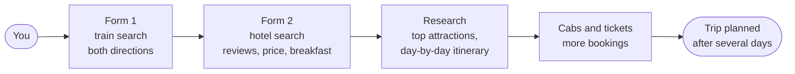
```mermaid
flowchart LR
    U(["You"]) --> F1["Form 1<br/>train search<br/>both directions"]
    F1 --> F2["Form 2<br/>hotel search<br/>reviews, price, breakfast"]
    F2 --> R["Research<br/>top attractions,<br/>day-by-day itinerary"]
    R --> F3["Cabs and tickets<br/>more bookings"]
    F3 --> D(["Trip planned<br/>after several days"])
```

Every box is a separate website, form or decision, and **you** are the one carrying the context between them.

## The same trip, with an agent

Now assume you are a 60-year-old who wants to plan a Goa trip. A travel website has an agent installed, so you talk to it directly through a chat interface.

**You state your goal as clearly as you can:** *"Can you create a budget travel itinerary from Delhi to Goa, 1 to 7 May?"*

Then the agent starts working. Step by step:

**1. It understands the intent.** It understands you want to start from Delhi, go to Goa, travel on these dates, stay for this duration. Your preference is to travel on a **budget** — you do not want to spend too much.

**2. It creates an internal goal for itself:** *plan a complete itinerary and optimise cost.* It tells itself it needs to plan affordable travel, stay, local movement and activities over seven days.

**3. It plans travel options.** It has tools — it can go to a train API and search which trains are available on a given date, and it can check flight APIs for flight options between two cities. It goes to both, brings the options back, and **compares internally**: prices, duration, availability. It surfaces the cheapest and fastest option.

You see a message like: *the cheapest and most available option is a train from Delhi on 30 April night; sleeper class is available at ₹800, 3AC at ₹1500; it reaches Goa on 1 May.*

**4. You reply:** *"book me a ticket in 3AC."* The agent takes that input and moves to the next step.

**5. Booking a stay.** It hits hotel APIs, or uses scripted data about hotels. It filters: since you want budget travel, under a certain price, near popular beaches, with good reviews. It brings you an option or two — *I found a dorm room at a hostel at ₹650 per night. Shall I book it for the entire duration?* You agree.

**6. Local travel.** It suggests that for budget travel in Goa, a scooter rental is most cost effective: *shall I pre-book a scooter at ₹300 per day?* — ₹1800 for six days. You say yes.

**7. The day-by-day plan.** It hits an API or knowledge base, brings out the popular options, and plans your days: these beaches on Monday, this fort, churches on 3 May, South Goa on 4 May. You say yes, finalise it.

**8. The return journey.** Options again: train at ₹800 and ₹1500, or an early-morning flight at ₹2800. You select the train.

**Throughout, the agent explains your planning step by step, executes each step, takes your preferences and keeps them in its memory.**

**9. A budget summary.** *Train ₹3000, stay this much, scooter plus fuel this much, food this much, sightseeing this much — total around ₹14,000.* You say it looks good, finalise it, book the tickets.

**10. It executes the bookings.** Since it has your data, possibly your saved cards, and access to a payment API, it goes behind the scenes and does all the bookings automatically. Obviously in some places you have to enter numbers or passwords yourself.

**11. Afterwards** it sends all the invoices to your mail, adds all the main events to your calendar — when to catch the train, when to check in — and **sets reminders**, so you do not miss anything.

All you had to do was keep saying yes, and if you did not like something, give input — and it would readjust its approach completely.

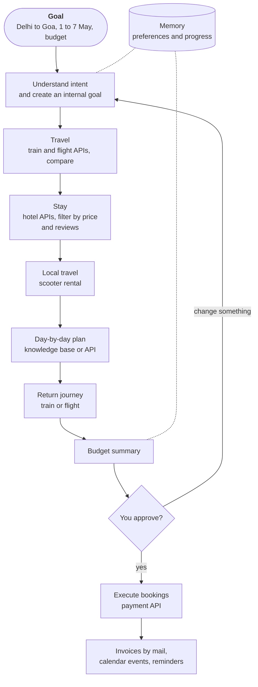
```mermaid
flowchart TB
    G(["<b>Goal</b><br/>Delhi to Goa, 1 to 7 May, budget"]) --> I["Understand intent<br/>and create an internal goal"]
    I --> TR["Travel<br/>train and flight APIs, compare"]
    TR --> ST["Stay<br/>hotel APIs, filter by price<br/>and reviews"]
    ST --> LC["Local travel<br/>scooter rental"]
    LC --> IT["Day-by-day plan<br/>knowledge base or API"]
    IT --> RT["Return journey<br/>train or flight"]
    RT --> BS["Budget summary"]
    BS --> OK{"You approve?"}
    OK -->|"change something"| I
    OK -->|yes| BK["Execute bookings<br/>payment API"]
    BK --> AF["Invoices by mail,<br/>calendar events, reminders"]
    M[("Memory<br/>preferences and progress")] -.- I
    M -.- BS
```

The same eleven steps as a table, showing which agent ability each one relies on:

| Step | What the agent did | Ability it relies on |
| --- | --- | --- |
| 1 to 2 | Understood the intent and set an internal goal | LLM reasoning, **planning** |
| 3, 5, 7, 8 | Searched trains, flights, hotels and attractions, then compared | **Tool use** (train, flight, hotel APIs, knowledge base) |
| 4, 6, 9 | Asked you to confirm, kept your budget preference | **Context** and memory |
| 10 | Booked and paid | Tool use (payment API), with you entering secrets |
| 11 | Mailed invoices, set calendar events and reminders | Tool use (mail and calendar APIs) |
| Any | Re-planned when you disagreed or something failed | **Adaptation** |

**Which experience would you prefer?** The one where the user individually does all these things, or the one where an agent asks what you need and then executes the entire task accurately, step by step? **The second — because the entire experience is seamless and your effort is reduced a lot.**

That is why AI agents are becoming so popular. And this was just one domain — imagine customer support, education, any other domain. **There are a lot of customers who are older, or younger, or less comfortable with devices, for whom accessing these websites is very difficult. AI agents solve that problem.**

## The technical definition

> An AI agent is an intelligent system that receives a **high-level goal** from a user and **autonomously plans, decides and executes** a sequence of actions by using external tools, APIs and knowledge sources — all while **maintaining context**, reasoning over multiple steps, **adapting to new information** and optimising for the intended outcome.

In simple words: you give it a high-level goal. In our example the goal was *"I want to go from Delhi to Goa for 7 days, on a budget — plan this trip for me."*

**We did not tell it how to achieve the goal.** The agent has a mind of its own: it can plan and execute things step by step, because it has support for some external tools. When it had to decide the cheapest way to travel from Delhi to Goa, it had access to train APIs and flight APIs, so it quickly fetched the information, compared, and suggested the best option.

**And the biggest thing:** when it works in multiple steps it is able to **maintain context** — it always knows what its end goal is.

And if new information comes in between, it can **re-plan** around it. For example, suppose it discovers that 5 May is a public holiday, so many public spots will be closed. That is new information it learned while working, and it can re-plan around it.

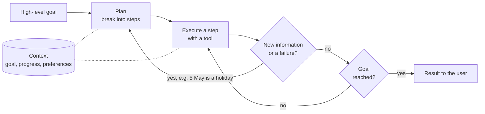
```mermaid
flowchart LR
    G["High-level goal"] --> P["Plan<br/>break into steps"]
    P --> E["Execute a step<br/>with a tool"]
    E --> N{"New information<br/>or a failure?"}
    N -->|"yes, e.g. 5 May is a holiday"| P
    N -->|no| C{"Goal<br/>reached?"}
    C -->|no| E
    C -->|yes| R["Result to the user"]
    CTX[("Context<br/>goal, progress, preferences")] -.- P
    CTX -.- E
```

## LLM vs agent

At a technical level, what is the difference?

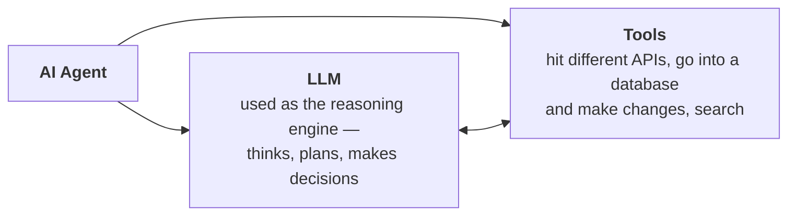
```mermaid
flowchart LR
    A["<b>AI Agent</b>"] --> L["<b>LLM</b><br/>used as the reasoning engine —<br/>thinks, plans, makes decisions"]
    A --> T["<b>Tools</b><br/>hit different APIs, go into a database<br/>and make changes, search"]
    L <--> T
```

An AI agent has **two things**: an LLM, and some tools. **Combining these two makes an AI agent.**

The agent uses the **LLM as its reasoning engine**. Whenever it has to think or make decisions, it takes help from the LLM, because the LLM understands natural language — so with its help the agent understands how a given task has to be executed.

And it has **access to tools**, which is why an AI agent can actually **perform some kind of action**. An LLM does not have this power. LLMs are good at reasoning and at giving output, but they do not have access to tools, so you cannot get anything done through an LLM alone — you cannot book tickets with one.

> **In a nutshell, an AI agent is a combination of an LLM — which acts as the reasoning engine — and tools, with which you can perform actions.**

| | Plain LLM call | Agent |
| --- | --- | --- |
| Interaction | One prompt, one response | Many steps in a loop, until the goal is met |
| Can it act? | No, it only produces text | Yes, through tools such as APIs, search, databases |
| Fresh data | Only what is in its training data and the prompt | Fetched on demand by a tool |
| Who decides the steps? | You, in how you write the prompt | The model, at run time |
| Trip example | Describes how one could plan a Goa trip | Searches trains, compares and books them |

## Five characteristics of an agent

| # | Characteristic | What it means | In the Goa trip |
| --- | --- | --- | --- |
| 1 | **Goal-driven** | You say **what** has to be done. Telling it **how** is not required, the agent figures it out. | "Budget itinerary, Delhi to Goa" |
| 2 | **Planning** | A very big aspect. It breaks the problem down on its own and executes step by step. | Travel, then stay, then local movement, then days |
| 3 | **Tool awareness** | It knows which tools it has and **in which situation to use each one**. | Train API for trains, hotel API for stays |
| 4 | **Context maintenance** | While working it keeps a memory: work done so far, who the user is, their preferences, what comes next. | Remembers the budget limit at every step |
| 5 | **Adaptive** | If something goes wrong mid-plan it readjusts and makes a new plan. | Train API down, so it suggests *"shall I suggest bus travel instead?"* |

## Building a basic AI agent

The plan: provide **one tool** for internet search. The model decides whether to use it, reads the result and produces an answer.

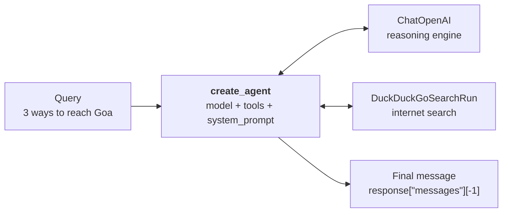
```mermaid
flowchart LR
    Q["Query<br/>3 ways to reach Goa"] --> AG["<b>create_agent</b><br/>model + tools + system_prompt"]
    AG <--> LLM["ChatOpenAI<br/>reasoning engine"]
    AG <--> TL["DuckDuckGoSearchRun<br/>internet search"]
    AG --> ANS["Final message<br/>response[&quot;messages&quot;][-1]"]
```

:::note LangChain v1 API update
The video uses the legacy `langchain.agents.create_react_agent` + `AgentExecutor` pattern. These APIs now live in `langchain-classic`; use **`from langchain.agents import create_agent`** for new code. The similarly named **`langgraph.prebuilt.create_react_agent`** is deprecated too, in favour of `create_agent`.

See the [LangChain v1 migration guide](https://docs.langchain.com/oss/python/migrate/langchain-v1) and the [legacy ReAct API warning](https://reference.langchain.com/python/langchain-classic/agents/react/agent/create_react_agent).
:::

### Setup

Use **Python 3.10+** and install the dependencies:

```bash
pip install -U "langchain>=1,<2" langchain-openai langchain-community ddgs python-dotenv requests
```

Put `OPENAI_API_KEY` in your environment or a local `.env` file. The weather example also needs `WEATHERSTACK_API_KEY`.

### Create and run the agent

```python
from dotenv import load_dotenv
from langchain.agents import create_agent
from langchain_community.tools import DuckDuckGoSearchRun
from langchain_openai import ChatOpenAI

load_dotenv()

# 1. The tool
search_tool = DuckDuckGoSearchRun()

# 2. A chat model that supports tool calling
llm = ChatOpenAI(model="gpt-4.1-mini", temperature=0)

# 3. Create the agent and its execution loop together
agent = create_agent(
    model=llm,
    tools=[search_tool],
    system_prompt="You are a travel assistant. Search when you need current information.",
)

# 4. Run it with message-based input
response = agent.invoke({
    "messages": [{"role": "user", "content": "3 ways to reach Goa from Delhi"}]
})

# The returned state contains the conversation, including tool messages
print(response["messages"][-1].content)
```

**`create_agent` returns a runnable graph.** Call `invoke` directly on it; the graph handles model calls and tool execution. Provide tools once. The returned state has a `messages` list, with the final assistant response at the end. See the [agent API reference](https://reference.langchain.com/python/langchain/agents/factory/create_agent).

**`system_prompt` sets the agent's instructions.** This example uses the model's structured tool-calling interface, so it does not need the Hub `hwchase17/react` text template or an explicit `agent_scratchpad`.

| Argument | Role | Notes |
| --- | --- | --- |
| `model` | The reasoning engine | A chat model that supports tool calling, or a model string (shown below). |
| `tools` | Actions the agent can take | Supplied **once**, as a list. |
| `system_prompt` | Standing instructions | Replaces the Hub ReAct prompt from the video. |
| Input | `{"messages": [...]}` | Replaces `{"input": ...}`. |
| Output | `response["messages"]` | Full conversation, final answer last. |

The model can also be passed as a `provider:model` string, which skips the `ChatOpenAI` import:

```python
agent = create_agent(
    model="openai:gpt-4.1-mini",
    tools=[search_tool],
    system_prompt="You are a travel assistant. Search when you need current information.",
)
```

To see which tools the run actually used, walk the returned messages:

```python
for message in response["messages"]:
    message.pretty_print()

for message in response["messages"]:
    if message.type == "ai" and message.tool_calls:
        for call in message.tool_calls:
            print(call["name"], call["args"])
```

`pretty_print()` shows the whole conversation: your message, the model's tool request, the tool result and the final answer. The second loop prints only the tool requests, for example `duckduckgo_search {'query': 'ways to reach Goa from Delhi'}`.

The old `agent_scratchpad` was a text log of Action and Observation steps. The message list now holds the same information, and you can print it in that shape:

```python
for message in response["messages"]:
    if message.type == "ai" and message.tool_calls:
        for call in message.tool_calls:
            print(f"Action: {call['name']}({call['args']})")
    elif message.type == "tool":
        print(f"Observation: {message.content[:200]}")
    elif message.type == "ai":
        print(f"Final Answer: {message.content}")
```

There is no `Thought:` line to print. The model's reasoning isn't exposed as text unless you use a model and setting that return reasoning content.

:::tip Put a ceiling on the loop
An agent keeps looping while the model keeps requesting tools. While experimenting, cap the number of graph steps so a confused run cannot spin for long:

```python
response = agent.invoke(
    {"messages": [{"role": "user", "content": "3 ways to reach Goa from Delhi"}]},
    config={"recursion_limit": 10},
)
```

When the limit is hit, LangGraph raises a `GraphRecursionError` instead of looping on.

For a limit on model calls rather than graph steps, use the built-in middleware:

```python
from langchain.agents.middleware import ModelCallLimitMiddleware

agent = create_agent(
    model=llm,
    tools=[search_tool],
    middleware=[ModelCallLimitMiddleware(run_limit=5, exit_behavior="end")],
)
```
:::

### Inspecting the run

For a simple view of the model/tool steps, use streaming **instead of** the `invoke` call above:

```python
for update in agent.stream(
    {"messages": [{"role": "user", "content": "3 ways to reach Goa from Delhi"}]},
    stream_mode="updates",
):
    print(update)
```

This shows message updates, including tool requests and results. It does **not** guarantee access to the model's private reasoning. See the [streaming documentation](https://docs.langchain.com/oss/python/langchain/streaming).

What the stream typically yields for one search, in order:

| Update from | Message added | What it tells you |
| --- | --- | --- |
| `model` | `AIMessage` with `tool_calls` | The model asked for the search tool and gave its input |
| `tools` | `ToolMessage` | The search result, linked back by `tool_call_id` |
| `model` | `AIMessage` without `tool_calls` | The final answer, so the loop ends |

The exact node names can differ between versions, so print one update before relying on them.

## How ReAct works

> ReAct is a design pattern used in AI agents that stands for **Reasoning + Acting**. It allows a language model to **interleave internal reasoning with external actions** in a structured, multi-step process.

Until now your experience with LLMs has been that you send a query and the LLM turns around and gives you a response — a **single-turn interaction**.

**ReAct is different.** You implement a **multi-step process** to solve the given problem in a structured manner, and throughout you do two things together: apply **reasoning** so you can solve the problem step by step, and wherever you feel you have to perform an action, you perform that action **with the help of a tool**.

**So in ReAct you are combining two philosophies:** reasoning, and acting with tools.

### The loop

In ReAct you do precisely three things — **Thought**, **Action** and **Observation** — repeatedly inside a **loop**, until you get your final answer.

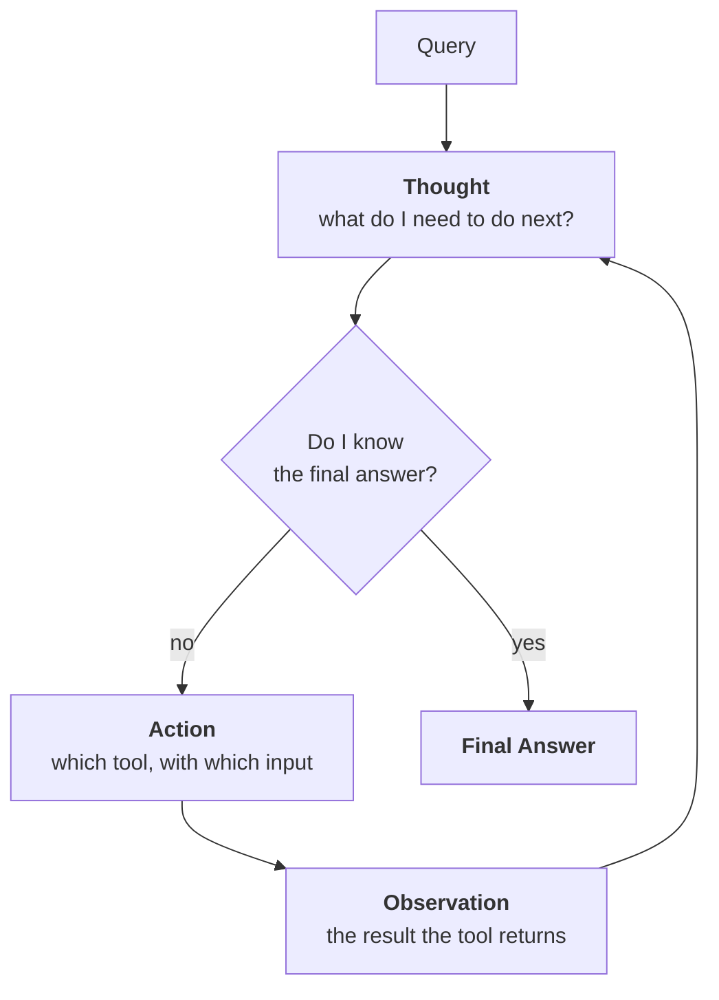
```mermaid
flowchart TB
    Q["Query"] --> T["<b>Thought</b><br/>what do I need to do next?"]
    T --> D{"Do I know<br/>the final answer?"}
    D -->|no| A["<b>Action</b><br/>which tool, with which input"]
    A --> O["<b>Observation</b><br/>the result the tool returns"]
    O --> T
    D -->|yes| F["<b>Final Answer</b>"]
```

### A concrete example

You ask a ReAct agent: *"Can you tell me the population of the capital of France?"*

**Iteration 1**
- **Thought:** to answer this, first I need to find the capital of France.
- **Action:** the agent decides it has to search. It has a search tool, so it sends the input *"capital of France"*.
- **Observation:** the tool performs the search and returns **Paris**.

**Iteration 2**
- **Thought:** now I have the capital of France, which is Paris. So now I need to find the population of Paris.
- **Action:** search again, this time with the input *"population of Paris"*.
- **Observation:** the tool returns **2.1 million**.

**Iteration 3**
- **Thought:** I now know the final answer. I know the capital of France, and I know its population. So now I am in a position where I can answer.
- Instead of triggering an action, the agent generates a **Final Answer**: *Paris is the capital of France and it has a population of 2.1 million.*

**The loop breaks right there** and the user gets the answer.

**Notice the agent does two things throughout:** it is **reasoning** through Thought, and **using tools** through Action. The marriage of those two philosophies is ReAct.

**The Thought steps above are an illustrative explanation of the decisions.** A modern tool-calling agent exposes tool requests, tool results and responses; it does not necessarily emit a literal `Thought:` trace or reveal private reasoning.

The same example as a sequence between the three parties:

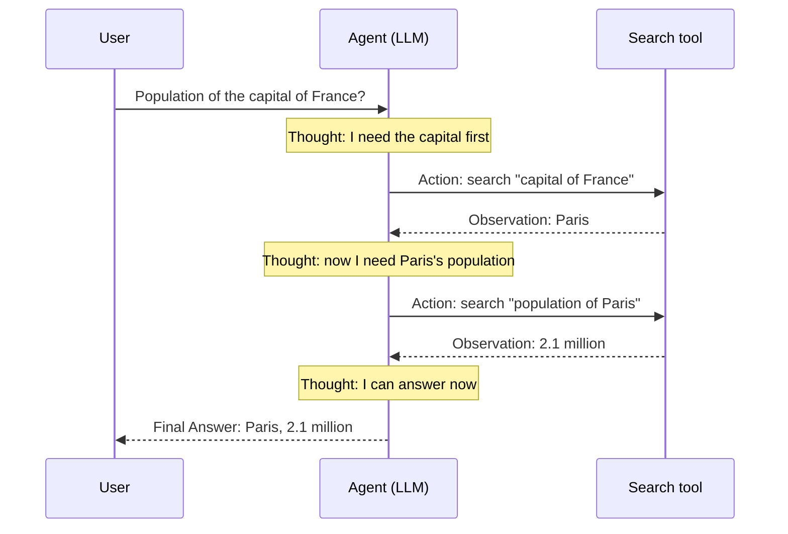
```mermaid
sequenceDiagram
    participant U as User
    participant A as Agent (LLM)
    participant S as Search tool
    U->>A: Population of the capital of France?
    Note over A: Thought: I need the capital first
    A->>S: Action: search "capital of France"
    S-->>A: Observation: Paris
    Note over A: Thought: now I need Paris's population
    A->>S: Action: search "population of Paris"
    S-->>A: Observation: 2.1 million
    Note over A: Thought: I can answer now
    A-->>U: Final Answer: Paris, 2.1 million
```

### When ReAct is useful

| Use ReAct when | Example |
| --- | --- |
| The problem is **multi-step** and later steps depend on earlier results | First the capital, then its population |
| **Tools need to be used** | Web search, database lookup, APIs |
| Actions should be **auditable** | Tool calls and results can be logged |

| Avoid it when | Why |
| --- | --- |
| The answer is a single fixed lookup or transformation | A plain chain is cheaper, faster and more predictable |
| The steps are known in advance and never change | Hard-code the workflow instead of paying for a model to rediscover it |

ReAct was introduced to the AI world through the 2022 paper **"ReAct: Synergizing Reasoning and Acting in Language Models."** Reading the abstract and introduction gives you more perspective on how it works as an architecture.

## How create_agent runs the tool loop

`create_agent` uses LangGraph to orchestrate the run. The model selects actions; the graph executes tools and passes their results back to the model. See the [LangChain agents guide](https://docs.langchain.com/oss/python/langchain/agents).

1. The graph passes the current messages and tool definitions to the model.
2. The model returns an **`AIMessage`**. If it contains **`tool_calls`**, each call identifies a tool and its arguments.
3. The tools run, and their results are appended as **`ToolMessage`** objects.
4. The model receives the updated conversation and can request more tools.
5. When the model returns a response without tool calls, the loop finishes.

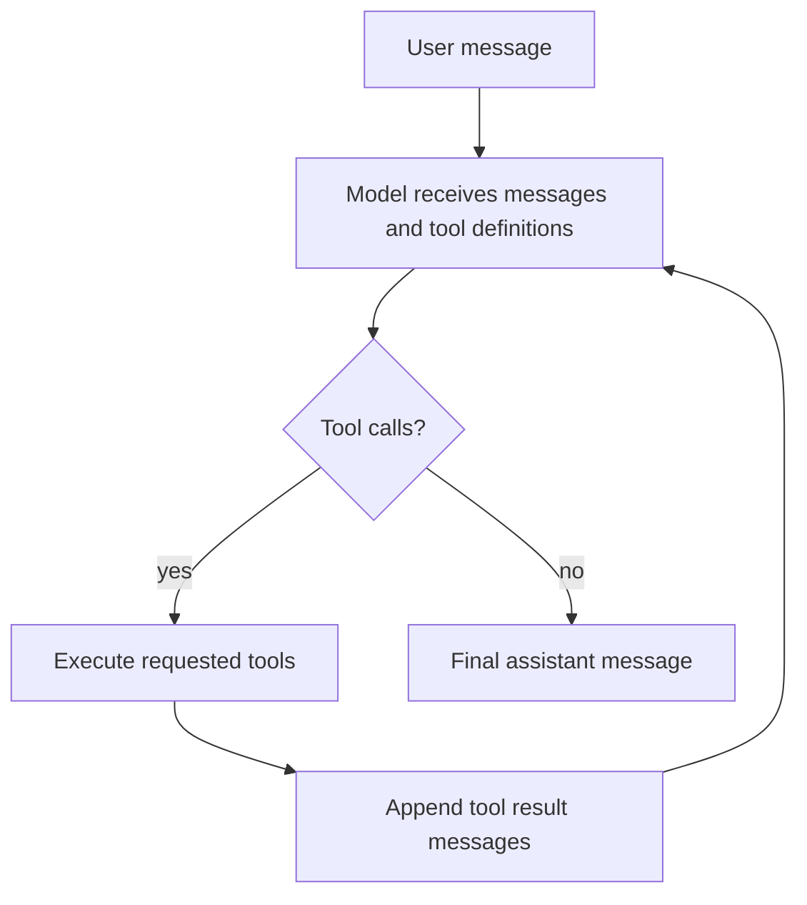
```mermaid
flowchart TB
    U["User message"] --> M["Model receives messages and tool definitions"]
    M --> D{"Tool calls?"}
    D -->|yes| T["Execute requested tools"]
    T --> O["Append tool result messages"]
    O --> M
    D -->|no| F["Final assistant message"]
```

The messages hold context **within the run**. To retain conversation state across separate calls, supply earlier messages yourself or configure a checkpointer and a thread ID:

```python
from langchain.agents import create_agent
from langgraph.checkpoint.memory import InMemorySaver

agent = create_agent(
    model=llm,
    tools=[search_tool],
    system_prompt="You are a travel assistant. Search when you need current information.",
    checkpointer=InMemorySaver(),
)

config = {"configurable": {"thread_id": "goa-trip"}}

agent.invoke(
    {"messages": [{"role": "user", "content": "I want a budget trip from Delhi to Goa"}]},
    config,
)
response = agent.invoke(
    {"messages": [{"role": "user", "content": "What was my budget preference?"}]},
    config,
)
print(response["messages"][-1].content)
```

Calls sharing a `thread_id` share history. `InMemorySaver` forgets everything when the process exits; use a database-backed checkpointer for anything real.

The same loop as a message trace for *"3 ways to reach Goa from Delhi"*:

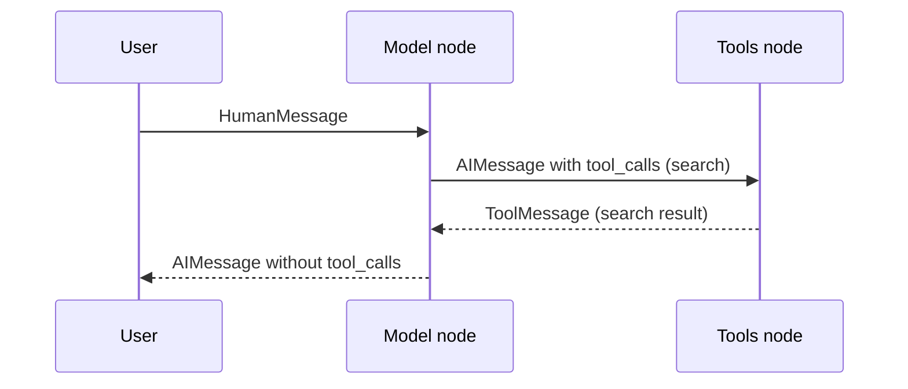
```mermaid
sequenceDiagram
    participant U as User
    participant M as Model node
    participant T as Tools node
    U->>M: HumanMessage
    M->>T: AIMessage with tool_calls (search)
    T-->>M: ToolMessage (search result)
    M-->>U: AIMessage without tool_calls
```

| Message type | Written by | Purpose |
| --- | --- | --- |
| `HumanMessage` | You | The request |
| `AIMessage` | The model | Either `tool_calls` to run, or the final answer |
| `ToolMessage` | The tools node | The result of one tool call |

### Mapping the video's legacy API to the current API

| Video / legacy pattern | LangChain v1 pattern |
| --- | --- |
| `create_react_agent(llm=..., tools=..., prompt=...)` + `AgentExecutor(...)` | `create_agent(model=..., tools=..., system_prompt=...)` |
| Tools supplied to both agent and executor | Tools supplied once to `create_agent` |
| `hub.pull("hwchase17/react")` | Instructions in `system_prompt`; structured tool calls |
| `agent_executor.invoke({"input": query})` | `agent.invoke({"messages": [{"role": "user", "content": query}]})` |
| `response["output"]` | `response["messages"][-1].content` |
| `verbose=True` | Stream message updates or inspect a trace |
| Text `agent_scratchpad` with intermediate steps | Message state containing assistant tool calls and tool results |
| `AgentAction` / `AgentFinish` | Assistant messages with / without tool calls |

<details>
<summary><b>Historical context: how the video's legacy loop worked</b></summary>

The video's agent selected an `AgentAction` (tool + input) or an `AgentFinish` (final result). `AgentExecutor` executed actions, accumulated intermediate steps and repeated the loop. The ReAct prompt formatted those steps into `agent_scratchpad`. That explains the video, but those objects and prompt placeholders are not the interface used by the examples here.

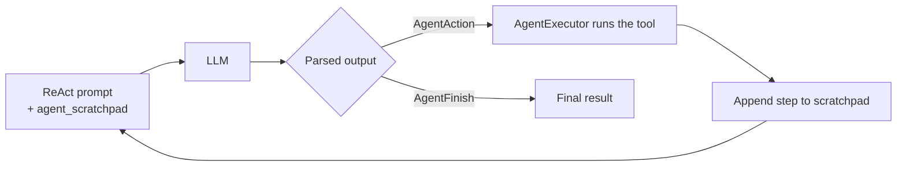
```mermaid
flowchart LR
    P["ReAct prompt<br/>+ agent_scratchpad"] --> L["LLM"]
    L --> X{"Parsed output"}
    X -->|AgentAction| E["AgentExecutor runs the tool"]
    E --> S["Append step to scratchpad"]
    S --> P
    X -->|AgentFinish| R["Final result"]
```

</details>

## Adding a second tool

Now we improve the agent by giving it another tool — a **custom** tool that, given the name of a city, returns the current weather conditions: temperature, humidity, wind speed and more. It works by hitting a weather API, wrapped with the `@tool` decorator.

```python
import os

import requests
from dotenv import load_dotenv
from langchain.agents import create_agent
from langchain.tools import tool
from langchain_community.tools import DuckDuckGoSearchRun
from langchain_openai import ChatOpenAI

load_dotenv()

search_tool = DuckDuckGoSearchRun()


@tool
def get_weather_data(city: str) -> dict:
    """Fetch current weather conditions for a city using Weatherstack."""
    response = requests.get(
        "https://api.weatherstack.com/current",
        params={
            "access_key": os.environ["WEATHERSTACK_API_KEY"],
            "query": city,
        },
        timeout=15,
    )
    response.raise_for_status()
    data = response.json()
    if not data.get("success", True) or "error" in data:
        raise ValueError(f"Weatherstack API error: {data.get('error', data)}")
    return data


llm = ChatOpenAI(model="gpt-4.1-mini", temperature=0)

agent = create_agent(
    model=llm,
    tools=[search_tool, get_weather_data],
    system_prompt=(
        "You are a helpful assistant. Use search to look up facts and "
        "get_weather_data for current weather."
    ),
)

response = agent.invoke({
    "messages": [{
        "role": "user",
        "content": "Find the capital of Madhya Pradesh, then find its current weather condition",
    }]
})

print(response["messages"][-1].content)
```

**The new tool is added once**, to the `tools` list. Its type hints define its input schema, and its docstring explains when to use it. The return annotation is `dict` because the tool returns parsed JSON.

| Part of the tool | What the model sees |
| --- | --- |
| Function name `get_weather_data` | The tool's name |
| Docstring | The description it uses to decide **when** to call the tool |
| `city: str` | The argument schema, so it knows to pass a city name |
| Raised exception | A failure it can read and recover from |

:::tip Write the docstring for the model
The docstring is the only thing telling the model when this tool applies. A vague one such as "weather stuff" leads to the tool being skipped or misused.
:::

**A possible execution sequence:** search for the capital, receive Bhopal, call `get_weather_data(city="Bhopal")`, then answer using the live result. The model may already know the capital and call the weather tool directly. Tool choice and the number of steps are not fixed.

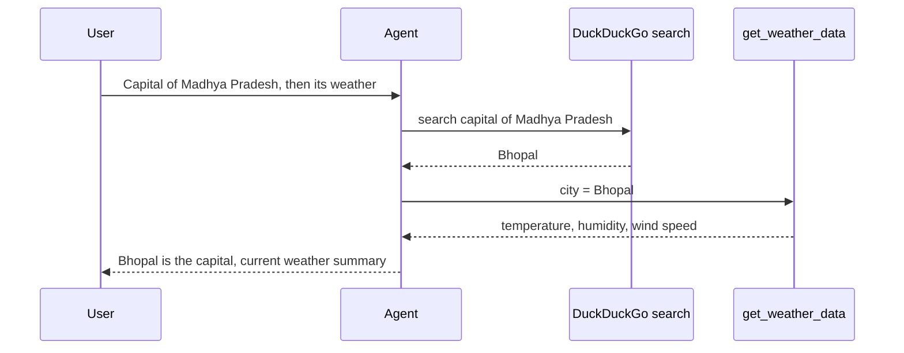
```mermaid
sequenceDiagram
    participant U as User
    participant A as Agent
    participant S as DuckDuckGo search
    participant W as get_weather_data
    U->>A: Capital of Madhya Pradesh, then its weather
    A->>S: search capital of Madhya Pradesh
    S-->>A: Bhopal
    A->>W: city = Bhopal
    W-->>A: temperature, humidity, wind speed
    A-->>U: Bhopal is the capital, current weather summary
```

:::warning Free-tier API keys
Weatherstack's free plan has historically served the `current` endpoint over plain HTTP only, and an HTTPS request can come back as an error. If you hit that, check your plan before assuming the code is wrong. Never commit the key; keep it in `.env`.
:::

## LangChain and LangGraph today

The video's closing advice reflects the older agent APIs. **LangChain v1 agents are built on LangGraph**, and `create_agent` is the recommended starting point for a standard model/tool loop. Use LangGraph directly when you need custom workflow control, branching or orchestration beyond that loop. See the [LangChain overview](https://docs.langchain.com/oss/python/langchain/overview).

You can still implement the loop yourself to understand it. For most applications, start with `create_agent` and customise as needed.

This is the whole of what `create_agent` automates, written by hand:

```python
from dotenv import load_dotenv
from langchain.messages import HumanMessage, ToolMessage
from langchain_community.tools import DuckDuckGoSearchRun
from langchain_openai import ChatOpenAI

load_dotenv()

search_tool = DuckDuckGoSearchRun()
tools_by_name = {search_tool.name: search_tool}
llm_with_tools = ChatOpenAI(model="gpt-4.1-mini", temperature=0).bind_tools([search_tool])

messages = [HumanMessage("What is the population of the capital of France?")]

while True:
    ai_message = llm_with_tools.invoke(messages)
    messages.append(ai_message)
    if not ai_message.tool_calls:
        break
    for call in ai_message.tool_calls:
        result = tools_by_name[call["name"]].invoke(call["args"])
        messages.append(ToolMessage(content=str(result), tool_call_id=call["id"]))

print(messages[-1].content)
```

The `while` loop is the ReAct loop: ask the model, run any requested tools, append the results, ask again, stop when no tool is requested.

| Need | Reach for |
| --- | --- |
| A standard model and tools loop | `create_agent` |
| Hooks around model or tool calls, such as limits, retries or guardrails | `create_agent` with middleware |
| Custom branching, parallel branches or multiple cooperating agents | LangGraph directly |
| Memory across separate calls | A checkpointer plus a thread ID |

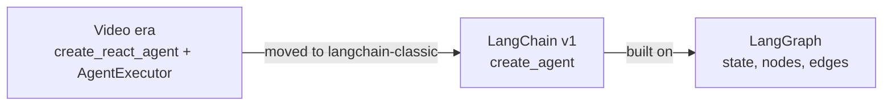
```mermaid
flowchart LR
    A["Video era<br/>create_react_agent + AgentExecutor"] -->|moved to langchain-classic| B["LangChain v1<br/>create_agent"]
    B -->|built on| C["LangGraph<br/>state, nodes, edges"]
```

## Checklist

- [ ] I can explain the problem agents solve, with the trip-planning example
- [ ] I can state the technical definition of an AI agent
- [ ] I can state the agent equation: LLM (reasoning) + tools (action)
- [ ] I can name the five characteristics of an agent
- [ ] I can explain ReAct and trace the France population example
- [ ] I can create and invoke an agent using `langchain.agents.create_agent`
- [ ] I can explain `AIMessage.tool_calls` and `ToolMessage` results
- [ ] I can read the final response from message state and inspect streamed updates
- [ ] I can map the video's AgentExecutor and scratchpad concepts to the current API
- [ ] I can build an agent with multiple tools
- [ ] I know when to use `create_agent` and when to use LangGraph directly

## Summary table

| Topic | Summary |
| --- | --- |
| Agent | A model chooses steps and uses tools to pursue a goal rather than following one fixed chain. |
| Reasoning loop | ReAct alternates tool decisions and observations until the agent finishes. |
| Implementation | Use `create_agent` to create a LangGraph-backed model/tool loop. |
| Trip example | An agent can choose flights and other actions as a request unfolds. |
| Definition | An agent combines an LLM that selects steps with tools that observe or act. |
| Characteristics | It works toward a goal, chooses actions, uses observations and can revise a plan. |
| ReAct | Interleave reasoning, action requests and tool observations until a final response. |
| Legacy APIs | `AgentExecutor` and the older ReAct factory belong to `langchain-classic`; new examples use `create_agent`. |
| Message state | User messages, assistant tool calls and tool results carry context through the run. |
| State graph | LangGraph provides explicit state and control for more robust agent workflows. |
