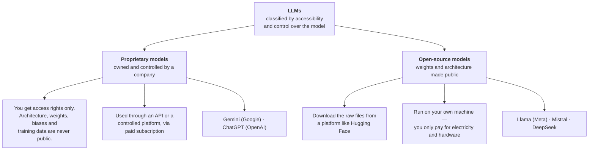
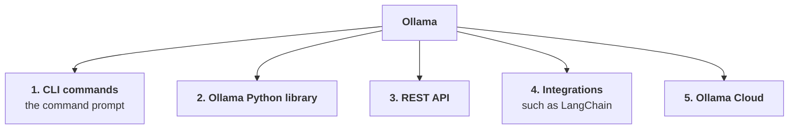
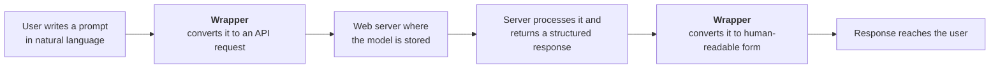
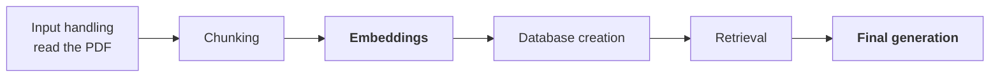

> **Video 21 of 21** · [Watch on YouTube](https://www.youtube.com/watch?v=YcAYmIFtA0o)
> Notes follow the video section by section. Roughly 2 hours 50 minutes.

## Why this video exists

Study the GenAI videos on the channel and a common pattern shows up: whenever a proof of concept or a small project was built, the LLM used was **OpenAI's GPT models**. Those models are strong and reliable, but they have one big drawback — **they are proprietary**, so you have to pay OpenAI to use them.

The amount is not large, but a big proportion of the channel's audience are **students without access to a credit card or an international debit card**, and international payment is a real obstacle. Feedback kept arriving asking to be taught some alternative LLMs.

The good news is that over the last year or two, a parallel field matured alongside GenAI: **open-source LLMs**. Many mature open-source models arrived, especially from China — **DeepSeek**, **Qwen**, **GLM**. Today you have very powerful open-source models that you can use much as you use a proprietary model.

:::note What this video is
This is an **introductory / trailer video** for a paid course on open-source models, created and taught by a colleague, Ajay. It is released for two reasons: so people considering the course can judge the teaching quality first, and so that anyone who cannot buy the course still gets two to three hours of solid grounding in Ollama and open-source models.

It is not a typical surface-level 15-minute Ollama video — it takes a detailed route.
:::

**What gets covered:** the whole open-source model landscape, their requirements, how they compare with proprietary models, why a tool like Ollama is needed, and then the **five modes** in which you can use Ollama — **CLI**, **REST API**, **the Ollama Python library**, **LangChain**, and **Ollama Cloud**.

## What an LLM is, briefly

LLMs are **complex neural networks** — many layers, many connections. At a lower level, an LLM is basically a **collection of numbers**, and those numbers are your **model weights and biases**. Everything the model learned during training is stored inside them.

## Classifying LLMs by accessibility and control

Based on how much control you have over the model you are using, LLMs split into two groups.



### Proprietary models

These are owned and controlled by a company, and **complete ownership sits with that company**. They generally give users the **access right only** — architecture information, weights and biases, training data, none of it is public. All of it stays with the company.

You use them **through an API** or through a **controlled platform**. For general purposes you open the chat application; for development and coding you use the API key.

And mostly you use them through a **paid subscription**. The free tier gives very limited access; for the advanced capabilities you have to pay.

**Summarised crisply:** with proprietary models you only have the right to *use* the model. Most of the time you do not have information about it.

### Open-source models

Exactly the opposite. A company develops and trains a model, and then makes it **public** — the architecture, the weights, the biases, the training data. Now anyone around the globe can download those things and use the model.

You can download all of it from a common platform like **Hugging Face** and run it on your local system. **You only pay for electricity and hardware.**

**The biggest speciality:** since you have all the raw files, you can **further fine-tune** these models and customise them however you like.

:::tip The cloth analogy
Think of it as having a full length of cloth. You can cut that cloth into any shape and make a dress for yourself. That is what is possible with an open-source model — and not with a proprietary one.
:::

## So why do people still pay for proprietary models?

A fair question. If open-source models give you the complete raw files, and you do not have to pay anyone, why do people go for subscriptions?

**Because having many open-source models in the market does not mean using them is easy.** Using an open-source model is itself the **biggest pain point**.

When a company releases a model, it releases it as **raw model weights** — numbers, in an architecture. Downloading that and running it on your PC is a very big friction:

- **Storage.** How do you store these raw model weights on your local system? They have to be optimised so the LLM works well there. Do you know how to store them? Where would you store them?
- **Working memory.** Suppose you stored the model. Now you have to *use* it. How do you configure your working memory — your RAM and VRAM — to run it? The model has to run, calculations happen over the weights and biases, so working memory is needed. How do you optimise and configure it?
- **Compatibility.** Many times these raw weights and biases are **not compatible** with direct use on your local system.

And the list is long. **This is why open-source models, although free, are used much less.** Theoretically they are free; practically, using them means solving many other problems first.

**And this is exactly where Ollama comes in.**

## What Ollama is

> Ollama is a tool that helps you run large language models on your own computer.

In short: a tool with which you can **download, run and manage** open-source models — all on your local PC.

Every pain point of running an open-source model — storage, optimisation, how to use working memory, compatibility issues — **Ollama handles all of it for you**. You only focus on using the model. How to download it, where to store it, which memory to load it into, how the request reaches the model, how the response comes back — **you do not need to worry about any of it**.

:::tip The WhatsApp analogy
Think of Ollama as WhatsApp for open-source models. When you use WhatsApp you only focus on **sending and receiving** — text messages, images, audio, video. How those messages are actually passed in the backend, how your privacy is maintained, how images travel — each and every thing is handled by WhatsApp for you.

Ollama is the same thing for open-source models.
:::

Another way to put it: **Ollama is a consultant** who handles, on your behalf, every technical aspect related to the model.

## The benefits of Ollama

### 1. Privacy and data control

You bring the open-source LLM onto your own PC and run it there. **Whatever data you pass to that LLM never leaves your local machine.** In fact, with Ollama you can use an LLM **even without internet**.

### 2. Low latency and offline access

You can download models and use them without any connection to the internet. Yes, you need internet **initially**, while downloading. After that you can use the model as many times as you like with no connection at all, and latency is not an issue.

### 3. Cost predictability and potential savings

The model sits on your local PC and you are using it, so **you do not need to pay anyone**.

With cloud or proprietary models, the model lives in a cloud, and you pay to interact with it — because the weights, biases and architecture responsible for generating output are all sitting there. With Ollama you have downloaded all of it locally.

### 4. Simple installation and setup

Installing Ollama is extremely easy — **one click** and it is set up on your local system. And it is not only Ollama that is easy to set up: downloading models locally and running them is also very easy, through simple commands.

**You do not need to be an ML engineer** to run an LLM locally. Anyone with a laptop of decent configuration can use Ollama.

### 5. A prebuilt model library

Ollama already has many models you can download and use, from the big companies — DeepSeek, Meta's Llama models, Qwen, and many more. Ollama has **already converted these models** into a format you can easily download, store and use.

Go to the **Models** section on the Ollama site and you will find a huge list, spanning many families — **Qwen**, **Mistral**, **Llama**, **Gemma**, **Llava**, **DeepSeek**.

Not only is the variety wide, the repository also lets you filter **by capability**:

| Filter | Gives you models that |
|---|---|
| **Vision** | can read your images |
| **Thinking** | have reasoning capabilities |
| **Tools** | support tool calling |
| **Embedding** | generate embeddings |
| **Cloud** | can run on Ollama Cloud |

And the **same model comes in different sizes**. Take Qwen 3 — it exists at many parameter counts, so you can download a size that matches your system's configuration.

### 6. Customisation

With Ollama you can also **customise** your model — instruction-tune it, change its parameters, shape the whole model to your custom requirement.

### 7. No vendor lock-in

When you download a model through Ollama there is **no vendor lock-in problem and no IP protection problem**. You do not have to follow any company's rules about how you may use their model. Whatever model you downloaded, you use it however you want.

### 8. Easy to run and manage

Simple commands do everything. To bring a model onto your local system, `ollama pull`. To remove it, `ollama rm`. When you write `ollama pull`, Ollama does all the work on your behalf — which files to fetch, how many, where to store them. Removal is the same in reverse.

## Requirements

Since you are downloading and running models locally, there are some system requirements.

Ollama runs on **macOS, Windows and Linux**. But the main thing when using Ollama is **hardware**.

| Requirement | Guidance |
|---|---|
| **RAM** | at least **8 GB** — more RAM, more smooth |
| **Processor** | an **i5 13th gen** or above runs models very smoothly. It works below that too, but this is the minimum for a smooth experience |
| **Storage** | you need room for the model files. Qwen 3-VL at 2 billion parameters needs roughly **2 GB**; the 8-billion version roughly **6.2 GB** |
| **Internet** | **first time only** — while downloading Ollama and the models |
| **Command line** | very basic knowledge; you can manage with little |
| **GPU** | **optional** — cherry on the cake, makes the experience much smoother |

## Installing Ollama

Search for Ollama, open the first link, and click **Download**. You get a setup file. Click it, then click **Install**. That is it — Ollama is on your local system.

## The five ways to use Ollama



:::note Ollama is not the model
A point worth being clear about. Whether a model gives good output, poor output, or cannot read images — **that depends on the model, not on Ollama**. Ollama downloads, runs and manages models for you. How well any given model answers your prompt is nothing to do with Ollama. It is used for those three tasks only.
:::

## Mode 1 — CLI

```bash
# check Ollama is installed
ollama --version

# bring a model from Ollama's repository onto your machine
ollama pull mistral:8b

# see which models are on your local system
ollama ls          # or: ollama list

# load a model into working memory and talk to it
ollama run llama3.2:1b

# delete a model
ollama rm llama3.2:1b
```

**What `ollama run` actually does.** Right now the model sits in your **storage**. This command takes all the files related to that model, lifts them out of storage and brings them into your **working memory** — your RAM or VRAM. As soon as the model is in working memory, you can use it.

Then you can ask it anything — *"what is photosynthesis?"*, *"what fundamental rights does the Indian constitution give?"* — and it answers.

:::tip Try it offline
While using the model, **disconnect yourself from the internet** and then give it a prompt. It will still answer, with no error. Worth doing once, because it makes the point concrete.
:::

### Passing an image

Copy the path to an image and pass it with your prompt. But it may fail — try it with `llama3.2` and you get *"I cannot summarise the image file."*

**Why?** Because that model **does not have vision capabilities**; it only has tool calling. To have your image read you need a model with vision capability, such as **Gemma 3**. Load that instead, pass the same image, and it describes what is in it correctly.

### In-session commands

| Command | Does |
|---|---|
| `/bye` | exit the model and return to your shell |
| `/show` | list what you can inspect |
| `/show info` | architecture, parameters, context length, quantisation, capabilities |
| `/show parameters` | the model's default parameters |
| `/show system` | the current system instruction |
| `/set parameter top_p 0.9` | override a parameter |
| `/set system "You are a helpful assistant"` | set a system instruction |

Once you set a parameter, it **overrides** the model-defined one, and every output afterwards follows your system instruction and your parameter set.

:::note CLI is for experimentation
Command-line usage is mainly for **testing and experimentation** — developers try different prompts, different system instructions, different model behaviours. Once satisfied that a particular set of instructions and parameters gives the right output, they **integrate** that model into a real application, coded in Python or JavaScript.

That is why it is so easy here to pass a new system instruction or change a parameter.
:::

## Mode 2 — the Ollama Python library

If you want to build a chatbot with memory and an interface, the command line cannot do it. **You need to code.**

```bash
pip install ollama
```

### The `generate` method

```python
import ollama

response = ollama.generate(
    model="llama3.2:1b",
    prompt="Why does the moon glow?",
)

print(response)            # lots of metadata: model, created_at, eval_duration, eval_count...
print(response.response)   # just the text
```

The first run takes time, because the model has to move from storage into working memory.

### Streaming

```python
response = ollama.generate(
    model="llama3.2:1b",
    prompt="Why does the moon glow?",
    stream=True,
)

for chunk in response:
    print(chunk.response, end="")
```

With `stream=False` you only see output once the whole thing is generated. With `stream=True` the output arrives **in chunks**, as it is generated.

### Passing images

:::warning Images must be base64 encoded
You cannot pass a normal image to the `images` parameter. It has to be **base64 encoded** first.
:::

```python
import base64
import ollama

with open("chart.png", "rb") as f:
    image_64 = base64.b64encode(f.read()).decode("utf-8")

response = ollama.generate(
    model="gemma3:4b",          # a model with vision capability
    prompt="Give a caption to the image",
    images=[image_64],
)

print(response.response)
```

To pass **multiple** images, encode each one and pass them all as a list. Then a prompt like *"generate a story based on the images"* produces a story drawing details from both.

### System instructions and parameters

```python
response = ollama.generate(
    model="llama3.2:1b",
    prompt="Why do we dream?",
    system="You are a funny assistant. Answer everything in a humorous way.",
    options={
        "temperature": 0.9,
        "top_p": 0.95,
        "top_k": 40,
    },
)
```

The **`system`** parameter carries your system instruction — set it to a funny assistant and the phrasing of the output changes accordingly. The **`options`** parameter takes a dictionary of parameters to tune: temperature, top_k, top_p, min_p, stop and more.

### The limitation of `generate`

**`generate` does not maintain context awareness.** It is built for *one prompt, one output*. Ask a simple question, get an answer — but it does **not** maintain history the way ChatGPT or Gemini do.

To maintain history and context, Ollama has another method: **`chat`**, which is used to have a conversation, where the whole context is maintained.

### Other methods

Everything you can do from the CLI has a matching method:

```python
ollama.list()          # list models
ollama.pull("...")     # pull a model
ollama.delete("...")   # delete a model
ollama.show("...")     # show a model's details
ollama.push("...")     # push a model
```

`ollama.list()` returns model information; iterate over it if you only want names and sizes. `ollama.show()` gives you the date, the template showing how your input reaches the model, the Modelfile, licensing details, and the capabilities — for example, that Qwen 3 has completion, tool calling and thinking.

## Tool calling

> Tool calling is a method that allows an LLM to use external tools or systems to perform tasks it cannot do by itself.

In simple words: a way to get an LLM to do the work it is **not initially capable of**.

We all know LLMs are very good at **generation** and very good at **understanding language**. But there are tasks where they fail:

- *"Go and fetch data from my database"* — it cannot
- *"Give me the current temperature of Chandigarh"* — it cannot
- *"Give me the news of today"* — it cannot

**Why?** Because of the LLM's own limitations. The biggest is the **knowledge cutoff date** — it is trained on data up to some date, and beyond that it may not answer. The other is that **the LLM cannot interact with the outside world**.

With tool calling you give the LLM **additional capabilities** by giving it tools. The LLM is already very good at generation, reasoning, writing code and solving problems; tools extend that set.

*(This is the same concept covered in depth in the [tools](/docs/genai/tools) and [tool calling](/docs/genai/tool-calling) chapters.)*

## Modelfiles — building a customised LLM

You can create your own customised model from an existing one, using a **Modelfile** — which is just a text file.

```bash
ollama create sentiment:latest -f Modelfile
```

`ollama create` takes the name you want for your new model (with a tag), and `-f` points at the Modelfile it should build from. Ollama reads the existing model, applies the instructions from the file, and produces a **new customised LLM**.

Run `ollama ls` afterwards and your new model is there. Then:

```bash
ollama run sentiment:latest "I love the course"
```

If the Modelfile instructed JSON-only output, you get back a JSON object with a score and a label. Try *"I love the course but this course is expensive"* and it returns negative with a score.

**The point:** simply by writing a text file, you built a customised LLM that works exactly to your requirement.

You can also do this through the Python library — the API reference has a **create a model** method — but the command-line route is simpler.

## Mode 3 — REST API

So far we have used Ollama two ways: CLI commands and the Python library. Now an important fact:

> **Internally, Ollama works using REST API only.** The CLI commands and the Python library are just **wrappers** around the API endpoints.

### How proprietary models work, for comparison

A company trains a model and stores it on the **web**. As a user you interact with it through **API requests**.



The whole flow happens through API calls. And whichever method you use — the chatbot, or their libraries — **those methods are wrappers**: they turn your natural-language prompt into an API request, and turn the structured response back into something readable.

### Ollama follows exactly the same flow

**The only difference:** the brain — your LLM — is **not hosted on the web**. It is hosted **locally**.

Whenever you call a model through Ollama, it creates a server on your local system at:

```text
http://localhost:11434
```

When you `ollama run` a model, it moves from storage into working memory and **creates a server at that address**. Then, whether you interact through CLI commands or through the Python library, in the backend **every request goes to that local server** and the response comes back from it.

### Seeing the endpoints

In the Ollama documentation, under **API references**, every method you have been using is really an **endpoint**:

| Method | Endpoint | Verb |
|---|---|---|
| `generate` | `/api/generate` | POST |
| `list` | `/api/tags` | GET |
| `push` | `/api/push` | POST |

**Which endpoint to hit, and which request to send — you do not need to worry about it.** Ollama handles that for you and interacts with the server on your behalf.

### Hitting the endpoint directly

```python
import requests
import json

url = "http://localhost:11434/api/generate"

payload = {
    "model": "llama3.2:1b",
    "prompt": "What are black holes?",
}

response = requests.post(url, json=payload)

# the output arrives as multiple JSON lines, so iterate and join
output = ""
for line in response.iter_lines():
    if line:
        output += json.loads(line).get("response", "")

print(output)
```

And for a GET endpoint:

```python
r = requests.get("http://localhost:11434/api/tags")
data = r.json()

for model in data["models"]:
    print(model["name"])
```

**Both approaches work and give the same output.** But notice: hitting the endpoint directly means writing these **extra lines of code**, and it gets a little more complex. Because the library is just a wrapper, it makes coding easy for you.

## Mode 4 — LangChain

### What LangChain is, briefly

> LangChain is an open-source framework with which you can build advanced-level LLM applications.

When you build an industry-level LLM application, frameworks like LangChain act as an **orchestrator layer**. You do not only give input to an LLM and generate output — you handle many components: memory, a web search, creating embeddings, and more. Your whole application is made of those components working together.

**LangChain coordinates between all those parts.**

### The RAG example

Say you need a chatbot over your company's policy, which exists as a PDF — so you need a RAG-based system. Look at how many components that means handling:



Of those, **only embedding and final generation** are done by the AI / the LLM. **All the other components have nothing to do with AI.**

So you have two options. **One:** code each individual component from scratch — write how a PDF is read, how chunks are made, how databases are created. **Two:** use a framework like LangChain, where those components are **already written**. You just use them and build your flow.

Build the whole flow that way and you get a **chain**, where the output of one component automatically becomes the input of the next, and the task executes smoothly.

### Three ways to use Ollama in LangChain

```bash
pip install langchain-ollama
```

**1. Chat**

```python
from langchain_ollama import ChatOllama

llm = ChatOllama(model="llama3.2:1b")

response = llm.invoke("Explain the concept of quantum entanglement in one sentence")

print(response.content)
```

Make sure the model is **already downloaded** on your local system, and that **Ollama is installed**. You can pass model parameters here too.

**2. Plain generation (non-chat)**

```python
from langchain_ollama import OllamaLLM

llm = OllamaLLM(model="llama3.2:1b")

response = llm.invoke("What is the capital of France?")

print(response)
```

**3. Embeddings**

```python
from langchain_ollama import OllamaEmbeddings

embeddings = OllamaEmbeddings(model="nomic-embed-text")

# a single text
query_result = embeddings.embed_query("What is LangChain?")

# multiple texts
doc_result = embeddings.embed_documents([
    "Document one content",
    "Document two content",
])

print(len(doc_result))     # 2 embeddings
```

### Why use LangChain rather than the Ollama library directly?

A fair question — these simple tasks could be done straight from the Ollama library, so why bring LangChain in?

Go back to the RAG diagram. **The embedding task and the generation task you can do with Ollama.** But what about the other components — input handling, chunking, database creation, retrieval? **Those cannot be done with Ollama.**

So say you build component one with LangChain, component two with LangChain, and this one with Ollama. **Then you cannot build a proper chain — your chain breaks right there.**

But if you build **all** the components with LangChain, you can build a proper chain in which your task executes very smoothly.

*(The [LangChain playlist chapters](/docs/genai/intro-to-langchain) cover this framework in depth.)*

## Mode 5 — Ollama Cloud

Around **September 2025**, Ollama launched a new feature: **Ollama Cloud**.

### The problem it solves

The same model comes in different sizes. Qwen 3-VL exists at 2B, 4B, 8B, 30B, 32B and 235B parameters. And **we all know the more parameters a model has, the better the output quality.**

Still, you cannot download and use the large-parameter models locally. **Ollama is not what stops you — your hardware is.**

When you run an LLM locally, all its computation happens in your **working memory** — RAM or VRAM. And that working memory is **limited**. Download a 100-billion-parameter model, try to run it, and your working memory simply does not have the capability to handle that computation. **Your whole system crashes.**

### What Ollama Cloud is

> Ollama Cloud is a cloud-based extension of the Ollama platform that allows you to run large language models without needing powerful local hardware.

Instead of running those large models on your local system, you run them on **powerful data-centre-grade hardware that Ollama manages**. The computation that would have happened on your local system now happens on Ollama Cloud instead.

:::warning Not every model can run on Ollama Cloud
You can only run LLMs that have **cloud capabilities**. In the Ollama model list, click the **Cloud** filter to see exactly which models those are.
:::

### Using it

```bash
# 1. Sign in on the website first (ollama.com), then:
ollama signin
```

That gives you a URL. Copy it, paste it into your browser, and click **Connect**. You are now signed in for Ollama Cloud. Run `ollama signin` again and it confirms which user you are signed in as.

Then run a cloud model:

```bash
ollama run deepseek-v3.1:671b-cloud
```

It reports that you are connected to a **671-billion-parameter model** — and that the connection is on **Ollama Cloud**, not your local system. Running a 671B model locally is unimaginable; you can use it only because of this feature.

Ask it anything and it answers. You can also use cloud models **through the Python library** — the code is exactly the same as for any model. **The one condition:** you must be signed in to your Ollama account.

## Checklist

- [ ] I can explain the difference between proprietary and open-source models across ownership, access and cost
- [ ] I can name the friction points that make raw open-source weights hard to use
- [ ] I can explain what Ollama is, using the WhatsApp or consultant analogy
- [ ] I can name at least five benefits of Ollama
- [ ] I know the hardware requirements and why they matter
- [ ] I can pull, list, run, inspect, tune and delete a model from the CLI
- [ ] I know why a model fails on an image, and how to fix it
- [ ] I can use the Python library for generation, streaming, images, system instructions and options
- [ ] I know why `generate` cannot hold a conversation and what to use instead
- [ ] I can explain that CLI and the library are wrappers over a local REST API at port 11434
- [ ] I can hit an Ollama endpoint directly with `requests`
- [ ] I can use Ollama in LangChain three ways, and say why LangChain is worth it
- [ ] I can explain what Ollama Cloud solves and how to sign in and use it
