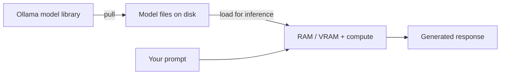
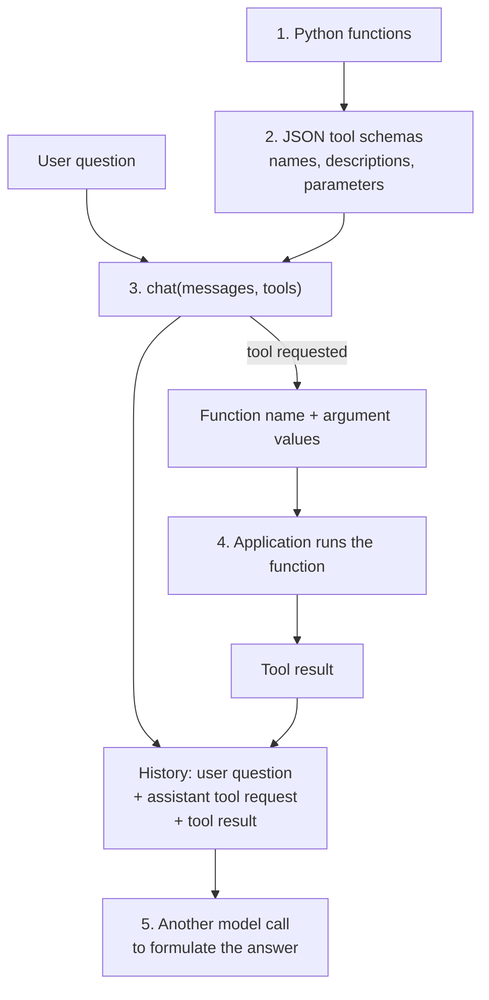
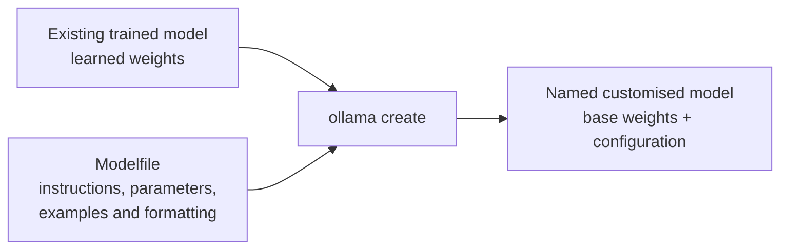
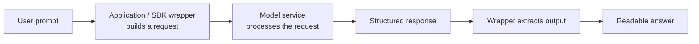
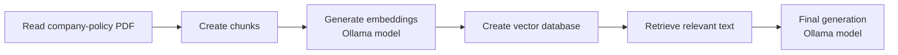

import Infographic from '@site/src/components/Infographic';
import OllamaShopLab from '@site/src/components/viz/OllamaShopLab';

> **Video 21 of 21** · [Watch on YouTube](https://www.youtube.com/watch?v=YcAYmIFtA0o). Notes follow the source's teaching order.

**In one line.** Download and run language models with Ollama, then connect them to Python applications and tools.

:::tip Before you start
You should know how to write a Python function and how to send a prompt to a model.

- Review [model interfaces](/docs/genai/models) if prompts and responses are new to you.
- Review [tools and tool calling](/docs/genai/tool-calling) for the function-call idea.

**Time.** Allow about an hour to read, then work through the examples at your own pace.

**After this chapter you can** run a local model, connect it to Python, and trace a tool request through to a real result.
:::

## In 30 seconds

You want to build a chatbot, but paid model access is a hurdle. Ollama gives you another route: download a supported model and run it on your computer. Think of WhatsApp. You deal with sending and receiving; the application handles the machinery behind it.

Running the model is only the first step. To answer the shop's price question, the model must ask your Python code for stock and a discount. You will follow that whole exchange, including the point where a plausible answer can hide a missing calculation.

## Words you will meet

| Term | Plain meaning | Example |
| --- | --- | --- |
| Large language model (LLM) | A trained network that works with language | Llama answers the moon question |
| Weights | Numbers learned during training | The model files you download |
| Inference | Using a trained model to produce an output | Generating a caption |
| Runtime | Software that loads and executes a model | Ollama handles running the local package |
| Command-line interface (CLI) | Commands typed into a terminal | `ollama run llama3.2:1b` |
| Application programming interface (API) | A defined way for code to request work | `POST /api/generate` |
| Random-access memory (RAM) | Working memory used while software runs | The model needs memory beyond its disk space |
| Video RAM (VRAM) | Working memory on a graphics processor | A GPU can hold model data there |
| Tool schema | A description of a function and its inputs | Stock lookup takes a product name |
| Modelfile | A text configuration for model behaviour | The sentiment model's instructions |

:::note How these notes use the source
Prompts, model tags, settings and shop data follow the source. The boards redraw the flows in our own form. The interactive lab and live validation experiment are labelled additions that explain the same shop example.
:::

## Why this masterclass exists

Suppose you have written the chatbot, but cannot pay for its model API. The code may be ready; access to the model still blocks you. This is the problem behind the masterclass: students without a suitable payment method need another way to run their projects.

Downloadable models such as DeepSeek, Qwen and GLM offer that route. You can obtain model files and run supported versions on hardware you control. The work moves from buying API access to choosing and running a model your machine can handle.

Start with model access and the hardware needed for local inference. Then use Ollama through **CLI, Python, REST API, LangChain and cloud**. The desktop app supplies a chat interface when you want to interact without writing code.

## What an LLM contains

A chatbot window is the interface you see. Under it is a neural network: layers of calculations using numbers learned during training. Those learned parameters are the model's weights, with biases where the architecture uses them.

When you download weights, you obtain the numbers needed to run that trained network. You still need software that knows the architecture and can perform the calculations. Having the file and being able to ask it a question are separate steps.

The useful distinction is **accessibility and control**: what can you obtain, and where can you use it?

| Question | Proprietary model | Downloadable model |
| --- | --- | --- |
| Who controls access? | The provider, such as OpenAI or Google | You can obtain the released model files |
| How do you use it? | A hosted application or API | Download and run it on your own computer |
| What do you obtain? | Permission to use a service | Weights and the other materials included in the release |
| Where does inference happen? | On the provider's infrastructure | On your hardware in the local examples |
| What do you pay for? | The provider's subscription or API usage | Local hardware, storage and electricity |
| Examples named | Gemini and ChatGPT/GPT | Meta Llama, Mistral and DeepSeek |

Platforms such as Hugging Face distribute model components. Access to the weights can enable fine-tuning, a further training process that changes those learned numbers.

**The cloth analogy:** access to the material gives you the opportunity to shape it to your requirements, like cutting a length of cloth into a garment.

:::note Terminology correction
Availability differs by release. Downloadable weights do not establish that the training data and code are public. Check what a release includes before calling it fully open source. Also, downloading a model does not remove its licence restrictions. The [Llama 3.2 page](https://ollama.com/library/llama3.2:1b) links its licence and acceptable-use policy.
:::

## Why free model files are still difficult to use

A free download sounds like the end of the problem. Then you open the files and face three questions: where should they live, how do they fit in memory, and what software will run them? A hosted service handles that work for you. With raw weights, you must arrange it yourself.

1. **Storage:** obtain the right files and store them in a usable format.
2. **Working memory:** load the model and arrange the RAM or VRAM needed for inference.
3. **Compatibility:** use software that can execute those weights on your machine.

Follow the path: **files on disk → data loaded into memory → calculations → generated text**. Disk keeps the downloaded package between sessions. Working memory holds the data the processor needs during inference. Ollama manages the path between them, which is why a few commands can replace much of the setup work.

## What Ollama does

Ollama lets you **download, run and manage supported models** on your own computer. You select the model and provide input; Ollama handles the model package and runtime interaction.

**The WhatsApp analogy:** a user concentrates on sending and receiving messages while the application handles delivery. Likewise, an Ollama user concentrates on model input and output while Ollama handles the mechanics underneath.

Think of a **consultant** who handles model management for you. You choose what you want to use; the consultant handles fetching and running it. Your hardware still sets the size of model you can run.


```mermaid
flowchart LR
    L["Ollama model library"] -->|pull| D["Model files on disk"]
    D -->|load for inference| R["RAM / VRAM + compute"]
    P["Your prompt"] --> R
    R --> O["Generated response"]
```

<Infographic src="/img/genai/ollama/interfaces-and-service.svg" alt="A request goes from CLI, Python, REST, LangChain or desktop through the local Ollama service to a model in memory. Downloaded files remain on disk. Cloud inference uses remote hardware." caption="Read left to right. The interfaces change; the local service is the same. The lower-right box separates files on disk from a model being used." />

## Benefits, followed by the model-library tour

Once the model is downloaded, a local prompt can be processed without sending it to a hosted inference service. That changes the cost and data flow of your application. Each benefit comes from taking control of where the model runs.

| Benefit | Point being taught |
| --- | --- |
| Privacy and data control | A downloaded model can process data locally |
| Offline access and latency | Local inference does not require a network request to a hosted model |
| Cost predictability | No hosted per-request inference fee for running a local model |
| Simple setup | Install Ollama and manage models through short commands |
| Prebuilt model library | Find ready-to-use packages rather than assembling raw files yourself |
| Customisation | Change instructions and generation settings |
| Reduced provider dependence | Choose and run downloaded models yourself |
| Easy management | Pull, run and remove models through Ollama |

:::note Clarifications to the benefit claims
Local privacy and offline access apply to **local inference**. Cloud calls and external tools have other data flows. Local execution avoids a cloud round trip, but generation still takes time. Model size and hardware still matter. Changing instructions or sampling parameters does not fine-tune weights.
:::

### Choose by capability as well as model family

Start with the task you need the model to perform. If you need an image caption, search for vision support. If you need the model to select a Python function, search for tool support. Families such as Qwen, Mistral, Llama, Gemma, LLaVA and DeepSeek contain different releases, so the family name alone is not enough.

| Filter | What it finds |
| --- | --- |
| Vision | Models that can interpret image input |
| Thinking | Models with reasoning support |
| Tools | Models supporting tool calls |
| Embedding | Models producing text vectors |
| Cloud | Models available through Ollama Cloud |

A small correction happens during the tour: he initially sees no thinking models because **Vision and Thinking are both selected**. Clearing Vision shows Thinking results. The empty list was caused by combined filters.

**Qwen3-VL** provides the size example: about 2 GB for the 2B package and 6.2 GB for the 8B package in the source. Package size is separate from all the memory needed for inference. Check three things separately: supported inputs, model size and available hardware.

## Requirements for local models

| Item | Starting guidance from the source |
| --- | --- |
| Operating system | Windows, macOS or Linux |
| RAM | At least 8 GB as a starting recommendation; more helps |
| Processor | An i5 13th-generation processor or above is the source recommendation; slower machines may still run models |
| Disk space | Space for the model package: the Qwen3-VL examples are about 2 GB for 2B and 6.2 GB for 8B |
| Internet | Required to download Ollama and local models initially |
| Command line | Basic terminal knowledge |
| GPU | Optional in this introduction; useful for faster inference |

These are **starting examples**, not universal minimum requirements. Enough disk space to download a model does not establish that you have enough working memory to run it.

## Install Ollama, then select an interface

On Windows, visit Ollama's website, choose **Download**, open the setup file and select **Install**. Use the download for your own operating system.

Keep **Ollama and the model** separate. Ollama manages running the model. The model determines which inputs it supports and what answers it can produce.

## CLI: download, list and run

First check that the terminal can find Ollama. Then download a model, list the packages on disk and run one. The chat examples use the smaller Llama, Gemma and Qwen packages.

```bash
ollama --version
ollama pull ministral-3:8b
ollama ls
ollama list
ollama run llama3.2:1b
```

**Reading the output.** The version check prints the installed version. Listing prints model tags, IDs and package sizes. `run` opens a prompt when the selected model is ready. A successful list shows which packages are available locally.

**Line by line.** `pull` obtains files, `ls` and `list` inspect local packages, and `run` starts interaction with a selected model. The colon in a tag separates the model name from its chosen variant.

A started download is not yet an available package. Check for completion before using it. The examples use `qwen3:8b`, `gemma3:4b` and `llama3.2:1b`.

`pull` obtains the package on disk. `run` makes the model available for inference, loading it into working memory as needed. A mistyped tag can select the wrong package or fail; use the full name consistently.

Once the session opens, type a greeting, then try the source's questions about photosynthesis and fundamental rights in the Indian Constitution. These prompts test text generation. They do not prove that every factual statement in the answer is correct.

Try disconnecting from the internet after downloading a local model. If it can still answer, the inference is running locally. This does not apply to a cloud tag.

### The image failure and model switch

Ask `llama3.2:1b` to summarise the image and it cannot read it. The request contains an image, but the selected model lacks vision support. Repeating the request cannot add a capability the model does not have.

Exit with `/bye` and switch to `gemma3:4b`, the vision model used in the video. Now the same infographic can become model input. Its subject is AI's electricity and water use; the model describes the chart instead of rejecting the file.

:::note Path adjustment for your machine
Supply the path to your own copy of the image. An absolute path from another computer will not locate your file.
:::

## CLI: inspect and change a session

Before changing a model, inspect its supported operations and configuration. `/show` lists the inspection commands. Llama and Gemma can have different default parameters and system instructions.

| In-session command | What to inspect |
| --- | --- |
| `/show` | Available inspection commands |
| `/show info` | Architecture, parameter count, context length, quantisation and capabilities |
| `/show parameters` | Default and user-defined generation settings |
| `/show system` | System instructions |
| `/show modelfile` | Model configuration |
| `/show template` | Prompt formatting |
| `/show license` | Licence text |

The absence of an explicit system message or model-defined parameter list in one model is itself part of the demo. Another model can supply those defaults.

Use `/set` and `/set parameter` to inspect the available settings, then override the session:

```text
/set
/set parameter
/set parameter top_p 0.99
/show parameters
/set system "You are an helpful assistant"
/bye
```

`/show parameters` then displays the new `top_p` value under user-defined settings. This overrides the corresponding default for that session. This command sets the override to **0.99**.

Use the CLI for **experimentation**: try prompts, instructions and parameters; then carry the successful configuration into an application written in Python or JavaScript.

## Python library: generate and stream

The Python examples use the Ollama client library. Install it in your Python environment, keep the Ollama service running, and download the model selected for local inference.

```bash
pip install ollama
```

**Reading the output.** Installation should complete or report that the package is already installed. An import error afterwards often means the notebook is using a different Python environment.

**Line by line.** This command installs the Python client that talks to the running Ollama service. It does not download a language model.

Start with the source's moon question. The call returns both the generated text and information about the request; print both so you can see the difference.

```python
import ollama

response = ollama.generate(
    model="llama3.2:1b",
    prompt="why does moon glow ?",
)

print(response)
print(response.response)
```

**Reading the output.** The first print shows a response object with model identity, time and token counts. The second shows only the answer text. A long object full of metadata is therefore expected; it does not mean the answer is missing.

**Line by line.**

- `model` selects a downloaded model by its full tag.
- `prompt` supplies the text to answer.
- `response.response` selects the answer field from the response object.

The first call may include loading time. Later calls can reuse a model already in memory.

A chat interface should not wait for the whole answer before showing anything. Enable streaming so the program can print each piece as it arrives.

```python
import ollama

response = ollama.generate(
    model="llama3.2:1b",
    prompt="why does moon glow ?",
    stream=True,
)

for i in response:
    print(i["response"], end="")
```

**Reading the output.** Text builds up on one line as the loop prints successive pieces. You are still receiving one generated answer, divided into chunks. This changes when text is displayed, not how trustworthy it is.

**Line by line.**

- `stream=True` returns an iterator rather than a completed response object.
- `i["response"]` selects the current chunk's text.
- `end=""` keeps consecutive chunks together instead of adding a newline after each one.

:::note The model answer contains an error
The notebook's moon response confuses ordinary moonlight with eclipses. The demonstration establishes that text was generated; it does not validate the explanation. The Moon's ordinary visible light is reflected sunlight. Do not learn astronomy from this source model response.
:::

## Images and generation settings in Python

The generation request accepts model, prompt, suffix, images, system, stream and options. The next examples use those fields to send images, change tone and change sampling.

### Encode one image and request a caption

Read the file into `image_bytes`, then encode it as `image_64`. This example uses `Linkedin.jpg`.

```python
import base64
import ollama

image_path = "Linkedin.jpg"

with open(image_path, "rb") as f:
    image_bytes = f.read()
image_64 = base64.b64encode(image_bytes).decode("utf-8")

response = ollama.generate(
    model="gemma3:4b",
    images=[image_64],
    prompt="Give caption for the image.",
)
print(response.response)
```

**Reading the output.** The example response offers captions for the infographic. That is the requested task, so `response.response` should contain caption text. A refusal to read the image points first to the model's vision support or the image input.

**Line by line.**

- `"rb"` reads the image as bytes. Reading it as ordinary text would not preserve the image data.
- `b64encode(...).decode("utf-8")` turns those bytes into base64 text that can travel inside JSON.
- `images=[image_64]` is a list even when there is only one image.
- `gemma3:4b` supplies the vision capability needed for this call.

:::note File names and image encoding
The linked repository names the files `Linkedin (1).jpg` and `Green AI (1).png`. Rename your downloaded copies to the notebook names, or adjust the paths. The lecture's explicit base64 conversion works; it is required for image data in REST JSON. The Python SDK also accepts paths and bytes, as documented in [Ollama's vision reference](https://docs.ollama.com/capabilities/vision).
:::

### Encode two images and generate a story

The second example adds `Green AI.png`. It asks the model to use context from **both** images.

```python
import base64
import ollama

image_paths = ["Linkedin.jpg", "Green AI.png"]
images_base64 = []

for i in image_paths:
    with open(i, "rb") as f:
        image_bytes = f.read()
        images_base64.append(base64.b64encode(image_bytes).decode("utf-8"))

response = ollama.generate(
    model="gemma3:4b",
    images=images_base64,
    prompt="Generate an story based on these images, make sure you take context from each and every image.",
)
print(response.response)
```

**Reading the output.** The recorded story uses a Green AI theme and details from the infographics. Check that it draws on both images. A fluent story that ignores one input has not met the prompt, and numbers in the story still need comparison with the charts.

**Line by line.**

- `images_base64` collects one encoded item per source image.
- The file loop reads and encodes each image separately.
- `images=images_base64` sends the whole list in one request. The prompt asks for context from every image.

### Change the tone through `system`

Keep the moon question and add a funny-assistant instruction to isolate the change in tone:

```python
import ollama

response = ollama.generate(
    model="llama3.2:1b",
    prompt="why does moon glow ?",
    system="You are an funny assistant , you explain things in funny way",
)
print(response.response)
```

**Reading the output.** Look for the humorous phrasing requested by the system instruction. The example answer changes tone, but it also contains factual problems. Style and accuracy must be checked separately.

**Line by line.**

- `system` supplies an instruction about how to respond.
- The moon question stays the same, making the style change easy to notice.
- The call changes the prompt context, not the learned model weights.

### Change sampling through `options`

This is a separate call, using the ocean question and the notebook's actual settings:

```python
import ollama

response = ollama.generate(
    model="llama3.2:1b",
    prompt="why is the ocean blue",
    options={
        "temperature": 0.3,
        "top_p": 0.5,
        "top_k": 45,
    },
)
print(response.response)
```

**Reading the output.** You still receive ordinary answer text. The options affect how it is sampled; they do not appear as a new output format. These settings illustrate the API; they are not established as an optimal combination.

**Line by line.**

- `options` groups the settings for this request.
- `temperature` adjusts sampling randomness.
- `top_p` limits candidates by cumulative probability; `top_k` limits their count.

These affect candidate tokens, the pieces from which text is generated. They do not force correctness. The documentation tour also names `min_p` and `stop` as available settings.

## Conversation history and other Python methods

A follow-up such as “what does that cost?” only makes sense if the earlier product question is available. `generate` takes the single prompt used in the preceding examples. `chat` lets your application supply a list of turns, so the earlier question and answer can be included.

This is why history belongs in a list. Each turn records who spoke and what they said. The video introduces that structure through the chat API documentation; the shop example will use it in working code.

| Message field | Purpose |
| --- | --- |
| `role` | Identifies the user, assistant, system or tool |
| `content` | Carries that turn's text |
| `messages` | Supplies the sequence of turns to `chat` |

:::note Clarification: the application supplies history
To retain context, your application sends the history in `messages`; separate calls do not automatically share memory. The SDK examples show this request structure. The electronic-shop demonstration below provides the source's concrete history example.
:::

### Remove a local model

To remove a local model, compare the packages before and after removal:

```bash
ollama ls
ollama rm llama3.2:1b
ollama ls
```

**Reading the output.** Compare the two lists: the removed tag should be absent from the second. If it remains, inspect the removal command's result and the exact tag.

**Line by line.** The first `ls` establishes what is present. `rm` removes that package. The final `ls` verifies the changed inventory.

The model disappears from the list. If you reproduce that deletion, download it again before the later Llama examples.

### List model names and sizes

Returning to Python, he uses the wrapper methods corresponding to CLI operations. The list demonstration prints the whole response, then selects names and sizes:

```python
import ollama

local_models = ollama.list()
print(local_models)

for i in local_models["models"]:
    print(i["model"])
    print(i["size"])
```

**Reading the output.** The loop prints each model's tag and package size. The size is reported in bytes. It describes stored model data; an active request can need more working memory for its context and other state.

**Line by line.**

- `local_models["models"]` selects the entries from the list response.
- `i["model"]` selects the tag you use in later calls.
- `i["size"]` selects the stored size, keeping it distinct from model identity.

### Pull with progress

```python
import ollama

model_name = "deepseek-r1"
progess = ollama.pull(model_name, stream=True)

for i in progess:
    print(i)
```

**Reading the output.** The iterator prints download status objects, including the manifest and file progress. These are package-transfer updates, not generated answers. A stopped download is not a completed local package.

**Line by line.**

- `pull` downloads files instead of asking the model a question.
- `stream=True` exposes the progress events.
- `progess` is the notebook's spelling. It still works because the loop uses the same name.

### Inspect a model

```python
import ollama

models_details = ollama.show("qwen3:8b")
print(models_details.model_dump())

model_dict = models_details.model_dump()
print(model_dict["capabilities"])
print(model_dict["parameters"])
```

**Reading the output.** The Qwen model in the source lists `completion`, `tools` and `thinking`. These describe supported operations, not a quality score. The parameter text shows its defaults, while the full dump also includes template, Modelfile and licence information.

**Line by line.**

- `show` inspects one named model rather than listing every downloaded package.
- `model_dump()` turns the response into a dictionary for field selection.
- `capabilities` and `parameters` answer different questions: what the model supports and how it is configured.

The notebook calls `.dict()` and prints a deprecation warning. `.model_dump()` is the equivalent current form used here.

He mentions `delete` and `push` as other library methods. The underlying lesson is that model management can be done from application code as well as the terminal.

## Tool calling: give the model access to a task

Ask for Chandigarh's current temperature. A model can generate a plausible number, but its training does not tell it today's reading. The same problem applies to today's news and the shop's current stock: the required facts live outside the model.

A tool gives your application a way to obtain those facts. The model selects the function and its arguments; Python performs the lookup and returns the result. That result can then support the final answer.

For a database, the function contains the connection and query code. The schema tells the model when to request it and what inputs to supply. The model never gains database access merely because you mention the database in a prompt.

**Check model support first.** The lecture opens the **Tools** filter in Ollama's library. Tool calling requires a model supporting that capability; the upcoming example uses `qwen3:8b`.

### The workflow

1. **Create tools:** write functions that perform the required tasks.
2. **Create tool schemas:** describe each function's name, purpose, parameters, parameter types and required inputs.
3. **Call the model:** send the user's question and those schemas. The model can answer directly or request a tool with arguments.
4. **Execute the request:** application code selects and runs the real Python function.
5. **Call the model again:** send the original question, assistant tool request and tool result as history, allowing it to formulate an answer.

In the weather example, a question about Dehradun supplies the city name for the function. A schema tells the model what argument it needs; the user's message supplies its value.


```mermaid
flowchart TB
    F["1. Python functions"] --> S["2. JSON tool schemas<br/>names, descriptions, parameters"]
    U["User question"] --> C["3. chat(messages, tools)"]
    S --> C
    C -->|tool requested| J["Function name + argument values"]
    J --> X["4. Application runs the function"]
    X --> T["Tool result"]
    C --> H["History: user question<br/>+ assistant tool request<br/>+ tool result"]
    T --> H
    H --> A["5. Another model call<br/>to formulate the answer"]
```

Keep track of two separate events: the model **requests** a function, then the application **executes** it. Only the second produces a result from your actual data or business rule. This distinction will explain the price failure in the shop demonstration.

:::note Schema clarification
The video passes explicit JSON-style schemas, so this chapter does too. Its statement that functions cannot be passed directly is too broad: the Python SDK can also derive schemas from supported Python callables. The underlying model still receives a tool description. See [Ollama's tool-calling documentation](https://docs.ollama.com/capabilities/tool-calling).
:::

## A worked example: the electronic shop

A customer asks for the price of a laptop after five years with the shop. Two facts are needed: the laptop's base price and the discount rule. The model has neither until the application supplies them.

The source's shop uses a Python dictionary as its small database. Its laptop entry holds five units at a base price of 1200. This keeps the example small enough to follow by hand without setting up a database server.

Run these blocks in sequence in one notebook or script. Each step uses the definitions created above it.

:::note Two different shop examples in the repository
`Ollama.ipynb` also contains a shop example, with a **25%** cap and a three-year prompt. The separate `Tool Calling.ipynb` shown in this video uses a **30%** cap and eventually a five-year prompt. These notes follow the recorded version rather than combining the two.
:::

### Work out the five-year price before calling a model

1. **Look up the laptop.** The dictionary returns stock **5** and base price **1200**.
2. **Find the discount.** Five years at 5% a year gives `5 × 0.05 = 0.25`, or **25%**.
3. **Apply the cap.** `min(0.25, 0.30) = 0.25`, so the cap does not change this case.
4. **Subtract the discount.** `1200 × (1 - 0.25) = 1200 × 0.75 = 900`.
5. **Give the result back.** The model can now explain a price that was actually computed.

In words: inventory supplies the price, the Python rule supplies the discount, and the model explains those results. This is the required result of the rule. It is **not** the number printed by the source's final model response.

<Infographic src="/img/genai/ollama/shop-tool-results.svg" alt="The laptop lookup returns five units and a base price of 1200. A second tool request calculates a 25 percent five-year discount and returns 900. Stopping after inventory leaves the discount unexecuted." caption="Follow the top row to the discount request, then down and back left. The red branch marks what is missing when the application stops after inventory." />

:::note Added learning lab
The lab follows the source's inventory and discount rule. It makes the required steps visible; it does not predict a model's choices or execute a language model.
:::

<OllamaShopLab />

**What each control does**

- **Product** selects a row from the shop dictionary, or the absent iPhone.
- **Customer years** changes the input to the 5%-per-year rule.
- **Continue after inventory** controls whether the discount is executed after the lookup.

**Try it yourself**

1. Keep the laptop and set years to **10**. The discount stops at **30%** and the price becomes **840**. The cap prevents a 50% discount.
2. Return to **5** years and clear **Continue after inventory**. The price becomes **not available**. The program has stock and base price but has not executed the discount.
3. Select **iPhone** and enable continuation. The result still has no computed price, because the lookup supplies no base price. The model cannot repair missing inventory by sounding confident.

### Step 1: inventory and functions

```python
import ollama

inventory_db = {
    "laptop": {"stock": 5, "base_price": 1200},
    "monitor": {"stock": 0, "base_price": 300},
    "keyboard": {"stock": 25, "base_price": 80},
}


def check_inventory(product_name):
    product_name = product_name.lower()

    if product_name in inventory_db:
        return inventory_db[product_name]

    return {"stock": 0, "base_price": None}


def calculate_loyalty_discount(base_price, years_as_customer):
    discount = min(years_as_customer * 0.05, 0.30)
    final_price = base_price * (1 - discount)
    return round(final_price, 2)
```

**Reading the output.** These lines define functions; they do not print an answer yet. A laptop lookup returns stock 5 and price 1200. An iPhone lookup returns stock 0 and no price, because no iPhone entry exists.

**Line by line.**

- `.lower()` lets a capitalised product name match the dictionary's lowercase keys.
- The fallback returns `None` for price. Treating that as zero would invent a free product.
- `min(..., 0.30)` stops the discount growing after it reaches 30%.
- `round(..., 2)` returns the price to two decimal places.

The model will return a function name as text. Build a lookup that turns that name into the Python function to run.

```python
available_functions = {
    "check_inventory": check_inventory,
    "calculate_loyalty_discount": calculate_loyalty_discount,
}
```

**Reading the output.** Nothing runs yet. The dictionary stores functions so a later tool request can select one by name.

**Line by line.** The key is the name the model returns; the value is the Python callable. Using the callable without parentheses stores it instead of executing it immediately.

### Step 2: describe both tools

```python
tools = [
    {
        "type": "function",
        "function": {
            "name": "check_inventory",
            "description": "Get stock and price for a product",
            "parameters": {
                "type": "object",
                "properties": {
                    "product_name": {"type": "string"},
                },
                "required": ["product_name"],
            },
        },
    },
    {
        "type": "function",
        "function": {
            "name": "calculate_loyalty_discount",
            "description": "Calculate final price based on loyalty years",
            "parameters": {
                "type": "object",
                "properties": {
                    "base_price": {"type": "number"},
                    "years_as_customer": {"type": "integer"},
                },
                "required": ["base_price", "years_as_customer"],
            },
        },
    },
]
```

**Reading the output.** Defining the list produces no model answer. The list is the description sent with the later chat request. It describes two tools, not two executed operations.

**Line by line.**

- `name` must match a key in `available_functions`, so a returned name can be dispatched.
- `properties` describes each input. `base_price` is a number; customer years are an integer.
- `required` says which inputs the request needs. It does not validate the arguments returned by a model.

A schema helps the model choose and form a call. Your Python code still has to check and execute it.

### Step 3: ask about an iPhone

Ask about an iPhone first, then change the product to a laptop. The conversation list is called **`message`**, singular.

```python
message = [
    {"role": "user", "content": "I want to buy an iPhone. Can you check stock?"},
]

response = ollama.chat(
    model="qwen3:8b",
    messages=message,
    tools=tools,
)

print(response)
print(response["message"])
```

**Reading the output.** The first print shows the full response; the second isolates the assistant message. In the iPhone example, the text content is empty and `tool_calls` contains the stock request. Empty text is normal when the model is asking for a tool.

**Line by line.**

- `chat` accepts `tools`; the earlier `generate` call does not.
- `message` holds the question and will later hold the returned turns.
- `tools=tools` sends descriptions. It does not run either Python function.

The assistant message has empty text content and a structured tool request for `check_inventory`, with the product argument set to iPhone. Read that request for the selected name and arguments. The relevant execution field is **`tool_calls`**, rather than the model's explanatory text.

### Step 4: dispatch and execute the requested function

This is the notebook's execution block. It reads the generated request instead of manually hard-coding a product lookup.

```python
tool_calls = response["message"].get("tool_calls")

if tool_calls:
    for tool_call in tool_calls:
        tool_name = tool_call["function"]["name"]
        tool_args = tool_call["function"]["arguments"]

        function_to_call = available_functions[tool_name]
        result = function_to_call(**tool_args)

        message.append(response["message"])
        message.append({
            "role": "tool",
            "content": str(result),
        })

print(message)
```

**Reading the output.** The printed list should contain the user's question, the assistant's tool request and the tool's returned dictionary. If the tool turn is absent, the next model call cannot see the lookup result. If its price is `None`, the product was not found.

**Line by line.**

- `tool_name` and `tool_args` come from the structured response, not the assistant's ordinary text.
- `available_functions[tool_name]` selects the actual Python function.
- `**tool_args` supplies named arguments from the dictionary.
- The two `append` calls retain the request and result as separate turns.

For the one-tool request shown, `message` now has three turns:

| Order | Role | What it carries |
| --- | --- | --- |
| 1 | user | The stock question |
| 2 | assistant | The request to run `check_inventory` |
| 3 | tool | The dictionary returned by the Python function |

### Step 5: send that history back

```python
final_response = ollama.chat(
    model="qwen3:8b",
    messages=message,
)

print(final_response["message"]["content"])
```

**Reading the output.** For the iPhone, the example answer says none is available. For the laptop, it describes five units at 1200. Both answers use the inventory result added to history.

**Line by line.**

- `messages=message` resends the full exchange, including the tool result.
- This second call supplies no `tools`, so it has not offered another structured operation.
- `content` is the generated explanation; the underlying facts came from the tool turn.

The iPhone is absent from the dictionary, so the lookup returns zero stock and no base price. The model describes it as unavailable. Change the original question to a laptop stock request and rerun the blocks. The lookup now returns **5 units and a base price of 1200**.

Reset `message` when rerunning a new question, as the first block does. Otherwise, earlier tool turns remain in the list.

### The five-year prompt needs an executed discount

Now ask the question that needs both inventory and discount:

```text
I am a customer for 5 years. What will be the final price of a laptop?
```

The model first requests `check_inventory`, because the discount function needs a base price. The application executes that lookup and makes the same final call above.

A reply might print text that looks like a discount call and attach a price. That is not enough: trace which functions actually executed and where their results were added to history.

:::note A second tool request needs a second execution step
The dispatch block processes only the **first** model response. That response requests inventory. The later call neither supplies tool schemas nor dispatches another response, so a discount call printed in its text is not executed by this code.

The function gives `min(5 * 0.05, 0.30) = 0.25`, then `1200 * (1 - 0.25) = 900`. In words: five years gives 25% off the retrieved base price. To complete dependent tools, keep providing schemas, execute each structured request and send its result back until the model can answer from those results.
:::

## Code you can run: a live check of the shop flow

:::note Addition, tested on 7 October 2026
This experiment keeps the source's inventory, functions and schemas, then adds a bounded tool loop and argument validation. It used an already downloaded `llama3.1:latest`, with Ollama server 0.30.8 and Python SDK 0.6.3. The source's `qwen3:8b` example above is kept unchanged.

The run **did not complete the discount**. Its failure is part of the lesson: schema text and a loop alone do not guarantee that a model returns usable tool calls.
:::

[Download the complete experiment](/examples/genai/ollama-shop/verify_shop.py). To run the blocks below, first execute the inventory, functions, mapping and schemas from the worked example.

### Check the arguments before executing them

A schema says customer years should be an integer. In the live run, the model supplied a string instead. Pydantic, the validation library used here, lets the application reject that input before it reaches the function.

Define strict input models, then set up the same five-year question:

```python
from pydantic import BaseModel, ConfigDict, ValidationError

class InventoryArguments(BaseModel):
    model_config = ConfigDict(strict=True)
    product_name: str


class DiscountArguments(BaseModel):
    model_config = ConfigDict(strict=True)
    base_price: float
    years_as_customer: int


argument_models = {
    "check_inventory": InventoryArguments,
    "calculate_loyalty_discount": DiscountArguments,
}


model = "llama3.1:latest"
client = ollama.Client(timeout=120)
message = [
    {"role": "system", "content": "Look up the laptop with check_inventory, then call calculate_loyalty_discount using its base price and the customer years. Do not calculate the discount yourself. Answer after both tool results."},
    {"role": "user", "content": "I am a customer for 5 years. What will be the final price of a laptop?"},
]
executed = []
print("model:", model, flush=True)
print("capabilities:", client.show(model).capabilities, flush=True)
```

**Reading the output.** The two prints identify the local model and its `completion` and `tools` capabilities. The classes themselves print nothing. Their job is to reject arguments with the wrong Python types.

**Line by line.**

- `ConfigDict(strict=True)` rejects the string `"5"` where an integer is required, rather than quietly converting it.
- `argument_models` connects each function name to its validator.
- The system message asks for the two tool results. It remains an instruction, not an execution guarantee.

### Keep asking while structured calls arrive

The application checks `tool_calls`, executes validated functions, and returns errors as tool results when validation fails.

```python
for turn in range(5):
    response = client.chat(
        model=model,
        messages=message,
        tools=tools,
        options={"temperature": 0, "num_ctx": 2048, "num_predict": 256},
    )
    message.append(response.message)
    calls = response.message.tool_calls or []
    print(f"request {turn + 1}: {len(calls)} tool calls", flush=True)
    if not calls:
        print("answer:", response.message.content, flush=True)
        break
    for call in calls:
        name = call.function.name
        args = call.function.arguments
        print("requested:", name, args, flush=True)
        try:
            checked = argument_models[name].model_validate(args).model_dump()
            result = available_functions[name](**checked)
            executed.append((name, result))
        except ValidationError:
            result = {"error": "Use JSON numbers for base_price and years_as_customer, not strings. Retry the function with numeric values."}
        print("returned:", result, flush=True)
        message.append({"role": "tool", "tool_name": name, "content": str(result)})
else:
    print("Stopped: no final answer within five requests.", flush=True)
```

**Reading the output.** Here is the relevant part of the actual run, with the long error sentence omitted:

```text
request 1: 2 tool calls
requested: check_inventory {'product_name': 'laptop'}
returned: {'stock': 5, 'base_price': 1200}
requested: calculate_loyalty_discount {'base_price': '0', 'years_as_customer': '5'}
request 2: 0 tool calls
```

The first request batched two calls. Inventory ran successfully; the discount had a guessed base price and string arguments, so validation rejected it. In the next response, the model wrote a retry as ordinary text. It did **not** put that retry in `tool_calls`, so this application did not execute it.

**Line by line.**

- `message.append(response.message)` keeps one assistant turn per response, outside the per-tool loop.
- `model_validate` checks argument types before dispatch.
- A validation error returns an error message to the model instead of crashing the application.
- `if not calls` ends the loop on a text response. Text alone does not prove the required business operation succeeded.

### Compare execution evidence with the business rule

Finally, print what really ran and check the discount function directly:

```python
print("executed tool results:", executed, flush=True)
print("rule for 5 years:", calculate_loyalty_discount(1200, 5), flush=True)
print("rule for 10 years:", calculate_loyalty_discount(1200, 10), flush=True)
client.generate(model=model, keep_alive=0)
```

**Reading the output.** The live execution list contains only the inventory lookup. The direct rule checks print:

```text
rule for 5 years: 900.0
rule for 10 years: 840.0
```

Those numbers establish the Python rule. They do not turn the model's incomplete exchange into a successful price quote. Before presenting a price, check that a validated discount call used the retrieved base price and that its result reached history.

**Line by line.** `executed` records successful function executions. The two direct calls check arithmetic independently of the model. `keep_alive=0` releases this experiment's loaded model when the check ends.

:::warning What was tested
The live experiment used the existing local Llama 3.1 package. The source's other model calls were checked against their source and parsed, but were not all rerun: the matching packages were not installed, and cloud access was not used. The original tool flow and Modelfile were also checked with the real SDK and CLI against mocked endpoints. Recorded video outputs are labelled separately from this live run.
:::

## Modelfiles: specialised behaviour around an existing model

The next problem is different: a general-purpose model may need to behave as a polite support assistant, an honest code reviewer, a legal assistant with boundaries, or a casual Gen Z chatbot.

A support assistant and a code reviewer can use the same trained model but need different behaviour. One needs a helpful tone; the other needs to focus on problems in code. A **trained base model plus an instruction file** lets you reuse the learned capability while changing the requested behaviour.

**The student analogy:** a student already knows how to solve a difficult maths problem. Teaching a shortcut changes the way the student approaches the solution without rebuilding all that prior learning. Likewise, this Modelfile demo guides a trained model without changing its weights.


```mermaid
flowchart LR
    B["Existing trained model<br/>learned weights"] --> C["ollama create"]
    M["Modelfile<br/>instructions, parameters,<br/>examples and formatting"] --> C
    C --> N["Named customised model<br/>base weights + configuration"]
```

A Modelfile is a text configuration. It is not the large weight package itself. Its directives define the configuration used for the sentiment model.

| Directive | What it specifies |
| --- | --- |
| `FROM` | The base model; required |
| `PARAMETER` | Generation and runtime settings |
| `SYSTEM` | Instructions governing the requested behaviour |
| `TEMPLATE` | The prompt's formatting |
| `MESSAGE` | Example/history turns |
| `LICENSE` | Licence text; listed in the reference tour |

### The sentiment configuration

The intended task is to read text and return **only a JSON score and a sentiment label**. The model is `llama3.2:1b`, with the actual settings from the file.

Save this as **`Modelfile`** in the directory from which you run the next commands. The repository offers the source as `Modelfile.txt`; rename it or adjust the `-f` argument.

```text
FROM llama3.2:1b

PARAMETER temperature 0.1
PARAMETER num_ctx 1024
PARAMETER num_predict 20
PARAMETER top_k 10

SYSTEM """
You are a sentiment analysis API.
You ONLY output JSON in the following schema: {"score": float, "label": "string"}.
Labels allowed: [POSITIVE, NEGATIVE, NEUTRAL].
Scores range from 0.0 to 1.0.
"""

MESSAGE user "This product is okay, but the shipping was slow."
MESSAGE assistant {"score": 0.4, "label": "NEUTRAL"}

MESSAGE user "Absolutely amazing experience, highly recommend!"
MESSAGE assistant {"score": 0.95, "label": "POSITIVE"}
```

**Reading the output.** Saving this file produces no classification. It defines the behaviour that `ollama create` will package. Its two examples contain scores 0.4 and 0.95, paired with neutral and positive labels.

**Line by line.**

- `FROM` reuses the trained base instead of training a new model.
- `num_ctx` sets the context budget; `num_predict` limits the output tokens.
- `SYSTEM` requests the output fields and allowed labels.
- `MESSAGE` supplies examples of that format. They are prompt context, not new training data applied to the weights.

:::note Corrections to the file's comments
The repository escapes JSON inside quoted assistant `MESSAGE` values. The assistant lines above use unquoted JSON: the installed Ollama CLI preserves the source backslashes in message content, whereas these adjusted lines send plain JSON examples. The demonstrated scores and labels are unchanged.

The source calls these examples “few-shot training”. Here they are **prompt examples**, not weight training. Its comment also says `top_k` narrows vocabulary to essential characters; it actually limits the candidate tokens considered during sampling. It does not enforce a JSON alphabet or schema. The [Modelfile reference](https://docs.ollama.com/modelfile#valid-parameters-and-values) defines the directives and parameters.
:::

### Create, list and try the model

Open a terminal in the folder containing the file. Create `sentiment:latest`, then check that it appears in the local list.

```bash
ollama create sentiment:latest -f Modelfile
ollama ls
ollama run sentiment:latest "I love the course"
ollama run sentiment:latest "I love the course but this course is expensive"
```

**Reading the output.** Creation reports progress, then `ollama ls` should include `sentiment:latest`. The two run commands should return the requested JSON-shaped sentiment responses. If creation cannot find the file, check the current directory and the filename given after `-f`.

**Line by line.**

- `create` packages the selected base and configuration under a new name.
- `-f Modelfile` points to the instruction file.
- `run sentiment:latest` reuses those settings, so you need not repeat the system instruction with each prompt.

The demonstration shows JSON-shaped outputs: **NEUTRAL** for the first statement and **NEGATIVE** for the mixed statement.

:::note Formatting success does not prove correct sentiment
“I love the course” expresses positive sentiment, so a neutral label is a classification failure. The configuration demonstrates packaged behaviour; it does not guarantee correct labels or valid, complete JSON. A 20-token output budget can also truncate a result. Validate the returned JSON and check the sentiment separately; increase the output budget if the JSON is cut off.
:::

The create-model API also supports programmatic configuration. The command-line route is sufficient for this sentiment example.

## REST API: what the wrappers are doing

The CLI and Python library make requests to the same Ollama HTTP service. A wrapper builds the request and extracts the useful output. Calling the API directly exposes that work.

He first draws the hosted-model flow: a user prompt becomes an API request, the remote model service processes it, and the wrapper extracts a readable answer from the structured response.


```mermaid
flowchart LR
    U["User prompt"] --> W["Application / SDK wrapper<br/>builds a request"]
    W --> S["Model service<br/>processes the request"]
    S --> J["Structured response"]
    J --> R["Wrapper extracts output"]
    R --> A["Readable answer"]
```

For a downloaded model, the same interaction goes to a **local** Ollama service:

```text
http://localhost:11434
```

:::note Correction to the server explanation
The Ollama service persists and handles requests; `run` loads and interacts with a model through that service. It does not create a separate HTTP server for every request. Ollama's [FAQ](https://docs.ollama.com/faq#how-can-i-expose-ollama-on-my-network) documents the default local binding and port.
:::

An endpoint is the address for one operation. These requests correspond to the library methods:

| Operation | HTTP request |
| --- | --- |
| Generate | `POST /api/generate` |
| Chat | `POST /api/chat` |
| List downloaded models | `GET /api/tags` |
| Push | `POST /api/push` |

### First use the library, then call generation directly

This follows `Ollama using Rest API.ipynb`. The same prompt is used in both requests.

```python
import ollama

response = ollama.generate(
    model="llama3.2:1b",
    prompt="Explain black holes simply",
)
print(response.response)
```

**Reading the output.** This selects the generated explanation of black holes. The SDK hides the HTTP parsing, so the code can work directly with the text field.

**Line by line.** `generate` builds the request for the local service. The prompt is unchanged in the direct request below, letting you compare the two interfaces.

For the direct version, the `requests` package sends the HTTP request. Install it if your environment does not already include it; that is a setup clarification for running the notebook.

```bash
pip install requests
```

**Reading the output.** Installation should complete or report that the package is already installed. An import error afterwards often means the notebook is using a different Python environment.

**Line by line.** This command installs the HTTP client used for direct endpoint calls. It does not download a language model.

```python
import requests
import json

url = "http://localhost:11434/api/generate"
payload = {
    "model": "llama3.2:1b",
    "prompt": "Explain black holes simply",
}

response = requests.post(url, json=payload)

for i in response.iter_lines():
    print(i)
```

**Reading the output.** The recorded printout contains byte strings, each holding a JSON object. Their `response` fields contain pieces of text; `done` is false while more output follows. This is a sequence of JSON records, not one dictionary containing the complete answer.

**Line by line.**

- `url` names the endpoint that performs generation.
- `json=payload` sends the model tag and prompt as JSON.
- `requests.post` sends the request directly, without the Ollama SDK wrapper.
- `iter_lines` exposes one returned record at a time.

Collect the text fields into one string so the direct call gives a readable answer:

```python
output = ""

for i in response.iter_lines():
    if i:
        data = json.loads(i.decode("utf-8"))
        if "response" in data:
            output += data["response"]
        if data.get("done"):
            break

print(output)
```

**Reading the output.** The pieces now form one readable answer. An empty string would mean no `response` text was collected; a JSON parsing error would point to the line format. Two separate generation requests can produce different wording even when the prompt is the same.

**Line by line.**

- `decode("utf-8")` converts each byte line to text.
- `json.loads` parses that line into a dictionary.
- Checking for `response` skips records without generated text.
- `done` marks the last record, so the loop can stop.

:::note Streaming clarification
The `requests.post` call does not set `stream=True`, so Requests buffers the HTTP response before the iteration. Ollama still returns newline-delimited JSON. To display chunks while they arrive, client-side HTTP streaming would also need to be enabled. The code above preserves the example call and its two inspection passes over the buffered response.
:::

### Compare listing through the wrapper and through HTTP

First ask the SDK for local model names:

```python
import ollama

models = ollama.list()

for model in models["models"]:
    print(model["model"])
```

**Reading the output.** The loop prints tags for the downloaded packages. It should describe the same local inventory as the REST request that follows.

**Line by line.** `models["models"]` selects the list inside the SDK response. The inner `model` field supplies the tag for each entry.

Now request the same list over HTTP:

```python
import requests

url = "http://localhost:11434/api/tags"
r = requests.get(url)
data = r.json()

for model in data["models"]:
    print(model["name"])
```

**Reading the output.** Both examples print downloaded model names. The source's list includes the sentiment model created earlier. A model missing from the list has not become a local package merely because its name appears in the public library.

**Line by line.**

- `GET /api/tags` requests the list, without a generation prompt.
- `r.json()` parses one complete JSON response. Listing does not use generation's line-by-line format.
- The raw response selects `name`; the SDK loop above selects `model`. Check the response shape before choosing a field.

## LangChain: compose the surrounding application

You want a chatbot to answer from the company's policy PDF. Calling the model alone does not read that PDF, split it or find the relevant passage. Those are separate pieces of the application.

LangChain helps connect those pieces. The source's company-policy example follows this path:


```mermaid
flowchart LR
    P["Read company-policy PDF"] --> C["Create chunks"]
    C --> E["Generate embeddings<br/>Ollama model"]
    E --> D["Create vector database"]
    D --> R["Retrieve relevant text"]
    R --> G["Final generation<br/>Ollama model"]
```

Embeddings and generation are the model-driven steps here. A PDF reader and a vector store such as FAISS handle other parts of the flow. This diagram explains how the components fit together; the adapter examples below cover the model calls.

The actual notebook demonstration covers three Ollama adapters. It follows `Ollama Using LangChain.ipynb`.

```bash
pip install langchain-ollama
```

**Reading the output.** Installation should complete or report that the package is already installed. An import error afterwards often means the notebook is using a different Python environment.

**Line by line.** This command installs LangChain's Ollama adapters. It does not download a language model.

### Chat: `ChatOllama`

```python
from langchain_ollama import ChatOllama

llm = ChatOllama(
    model="llama3.2:1b",
    temperature=0,
)

response = llm.invoke(
    "Explain the concept of quantum entanglement in one sentence."
)
print(response.content)
```

**Reading the output.** The example result is a sentence explaining quantum entanglement. The answer lives in a message object, so printing `.content` selects its text. A missing-model error would mean the local prerequisite has not been met.

**Line by line.**

- `ChatOllama` adapts Ollama to LangChain's chat interface.
- `temperature=0` keeps the source's requested sampling setting.
- `invoke` runs the component with this prompt; it does not install or download the model.

### Plain text generation: `OllamaLLM`

```python
from langchain_ollama import OllamaLLM

llm = OllamaLLM(model="llama3.2:1b")
response = llm.invoke("The capital of France is")
print(response)
```

**Reading the output.** The example completion identifies Paris. This adapter returns a string, so `print(response)` is enough. Trying to read `.content` would confuse this output type with the chat-message type above.

**Line by line.**

- `OllamaLLM` exposes the plain-generation interface.
- The prompt is a sentence prefix to complete.
- `invoke` looks similar in both adapters, but their returned types differ.

### Embeddings: `OllamaEmbeddings`

The source model is **`embeddinggemma:latest`**, not `nomic-embed-text`. Download it before reproducing this local call. The pull below is a setup step, added to make that prerequisite explicit.

```bash
ollama pull embeddinggemma:latest
```

**Reading the output.** The command reports package-download progress. A completed pull makes this local embedding model available; it does not generate a vector yet.

**Line by line.** The full `embeddinggemma:latest` tag matches the adapter call below. Choose the same embedding model for all texts that need comparable vectors.

```python
from langchain_ollama import OllamaEmbeddings

embeddings = OllamaEmbeddings(model="embeddinggemma:latest")

query_result = embeddings.embed_query("What is LangChain?")
print(query_result)

doc_results = embeddings.embed_documents([
    "Document 1 content",
    "Document 2 content",
])
print(f"Embedding length: {len(doc_results)}")

print(doc_results[0])
```

**Reading the output.** `query_result` is one vector, a list of numbers representing the input text. `doc_results` holds two such vectors. The printed **2** counts input documents, not coordinates in a vector.

**Line by line.**

- `embeddinggemma:latest` is the source's embedding model.
- `embed_query` handles one string; `embed_documents` handles a list.
- `doc_results[0]` selects the first document's vector. It does not select the first coordinate of every vector.

### Why bring in LangChain for these simple calls?

Return to the company-policy flow: Ollama can generate embeddings and answers, while the wider application still needs document reading, chunking, storage and retrieval. LangChain's adapters give the model steps the interfaces used by the surrounding components.

:::note Correction to the “broken chain” claim
A chain needs matching interfaces and input/output types; direct Python operations can be wrapped or composed with framework components. Using the adapters simplifies this composition. See LangChain's [runnable interface](https://reference.langchain.com/python/langchain-core/runnables/).
:::

## Ollama Cloud: move inference to larger hardware

Qwen3-VL offers sizes such as 2B, 4B, 8B, 30B, 32B and 235B in the source. A package can be downloadable while still being too large for your machine. Cloud inference addresses that hardware limit.

His constraint is hardware: weights and inference working data need memory, and the machine has finite resources. Cloud execution puts the workload on hardware managed by Ollama instead.

:::note Hardware and size clarifications
RAM/VRAM hold data; CPU/GPU perform computation. Insufficient memory can prevent loading or cause severe slowdown, rather than guaranteeing a system crash. Also, a larger parameter count alone does not guarantee a better answer to every task.
:::

Only models offered for cloud execution are available through this route. Use the library's **Cloud** filter; choosing a local-only model does not move it to cloud automatically.

### Sign in, connect and run the cloud model

Sign in on `ollama.com`, run the CLI sign-in command, open the returned URL, and select **Connect**. Running sign-in again confirms the connected account.

```bash
ollama signin
ollama run deepseek-v3.1:671b-cloud
```

**Reading the output.** The session identifies a **671B cloud model**. Try a greeting or the rainbow-colours question. That response is produced remotely, despite the local terminal window.

**Line by line.** `signin` connects the local service to the account. The `-cloud` model tag selects cloud inference; it does not download a 671B package to the laptop.

### Use the same Python interface

The cloud notebook repeats the familiar generation shape, changing the model tag:

```python
import ollama

response = ollama.generate(
    model="deepseek-v3.1:671b-cloud",
    prompt="Why do stars twinkle?",
)
print(response["response"])
```

**Reading the output.** The example response explains why stars twinkle. This looks like the earlier Python generation result, but the work happened on cloud hardware. Losing the signed-in session prevents this route from working.

**Line by line.** The familiar `generate` shape remains. `model` now names a cloud tag, and `response["response"]` selects the answer text.

This follows `Ollama Cloud.ipynb`. Through the local Ollama service, it uses the account connected above.

Sign out, then retry the cloud call to see why the account connection matters:

```bash
ollama signout
```

**Reading the output.** Sign-out confirms the account is disconnected. Repeating the Python cloud request then gives the recorded **unauthorised** error. Local-model generation does not need that cloud account connection.

**Line by line.** `signout` changes the local service's cloud authentication state. A model tag ending in `-cloud` still points to remote inference, even when the call comes from Python on your laptop.

### Usage limits and the privacy trade-off

Cloud has usage allowances and paid tiers. Check the [current cloud documentation](https://docs.ollama.com/cloud#usage) before relying on an allowance or price.

Cloud prompts leave your computer. A provider's retention policy addresses what happens remotely; it does not make cloud execution local.

:::note Provider policy versus local execution
Ollama's [current FAQ](https://docs.ollama.com/faq#does-ollama-send-my-prompts-and-answers-back-to-ollamacom) says cloud prompt/response content is processed without being stored, logged or used for training, while limited account and usage metadata is collected. This is a service policy, not local inference. The [cloud reference](https://docs.ollama.com/cloud) also distinguishes signed-in local-service access from direct `ollama.com` API access using an API key; use the authentication route that matches your endpoint.
:::

## Desktop app: the final demonstration

The desktop app supplies a chat interface. Use this sequence to explore its model controls:

1. **New chat and Settings:** the upper-left controls start a chat and expose settings. He recommends account sign-in when cloud access is needed.
2. **Local text model:** choose `llama3.2:1b`, type a greeting and receive a reply.
3. **Vision model:** start another chat, choose `gemma3:4b`, attach the same resource-use infographic and ask for a summary.
4. **Model requiring a download:** select `deepseek-r1:8b`. A download starts before it can be used. Wait for completion before expecting local inference; starting the transfer alone is not enough.
5. **Search the picker:** use a library model name if the model is absent from the list.
6. **Cloud model:** select `gpt-oss:120b-cloud` and request a response while signed in.

The picker distinguishes models that are downloaded from those requiring a download. Image input still depends on the selected model's capabilities.

Use the app for ordinary chat and exploration. Use CLI or code for deliberate instruction and parameter control. Desktop features can change between versions.

## Putting the pieces together

These examples supply the building blocks for larger applications: model calls, conversation history, tools and configuration.

The next step is to connect those pieces into a project, then check that its answers are supported by data and executed operations.

## Common mistakes

1. **Choosing a model by name alone.** A familiar family name feels like enough information. Check the exact tag's capabilities and size; the source's Llama image failure shows why.
2. **Treating generated function text as execution.** It looks like a real call, especially when it is formatted as JSON. Inspect `tool_calls` and the actual execution log before accepting a tool-dependent answer.
3. **Trusting a schema to validate returned arguments.** The schema asks for integers, so it is tempting to assume integers will arrive. The live run returned strings. Validate the arguments and check that prices come from the lookup.
4. **Equating JSON shape with a correct result.** The sentiment response had the requested fields but labelled a positive sentence neutral. Check the task result as well as its format.
5. **Assuming local code means local inference.** A cloud call uses the same Python shape. Read the model tag and trace where the request goes; cloud inference leaves your computer.

## Practice questions

<details>
<summary>Easy · Why did the same image fail on Llama and work on Gemma?</summary>

The selected Llama package lacked vision support. The Gemma package supported image input. Ollama ran both, but the model capability determined whether the image could be interpreted. Changing a prompt cannot add missing vision support.

</details>

<details>
<summary>Medium · A ten-year customer wants a laptop. Why is the price 840 rather than 600?</summary>

Ten years at 5% would give 50%, but the function caps the discount at 30%. The calculation is `min(10 × 0.05, 0.30) = 0.30`, then `1200 × 0.70 = 840`. In words: the yearly rate stops accumulating once the cap is reached.

</details>

<details>
<summary>Stretch · The assistant prints a discount function call, but tool_calls is empty. What should the application do?</summary>

Do not count that text as an executed call. Check the successful execution log and refuse to present a tool-derived price if the required calculation is missing. The live experiment demonstrates exactly this failure after a validation error. A complete application also checks that the discount used the price retrieved from inventory.

</details>

## Designing with it

Use the terminal to explore a model's behaviour. Use Python or REST when your application must own the history and run tools. Use the LangChain adapters when those calls need to fit into a wider document or retrieval flow.

For the shop, keep a clear record of the question, requested operation, validated arguments and returned value. When an answer is wrong, that record tells you whether the failure came from the lookup, calculation or generated explanation.

## Where this stands in 2026

The source model tags and settings are preserved. The added live experiment was run on 7 October 2026 with the installed server and SDK versions stated above. Treat the model library, desktop controls and cloud allowance as version-dependent; the request and execution distinctions remain useful across versions.

## Go deeper

- [Ollama's tool-calling guide](https://docs.ollama.com/capabilities/tool-calling), for structured requests and tool-result history.
- [Modelfile reference](https://docs.ollama.com/modelfile), for configuration directives.
- [REST streaming guide](https://docs.ollama.com/api/streaming), for newline-delimited responses.

## Check yourself

- [ ] I can distinguish access to a hosted model from obtaining its weights.
- [ ] I can explain the storage, memory and compatibility problems Ollama manages.
- [ ] I can select a model by capability and hardware fit.
- [ ] I can pull, list, run, inspect and change a CLI session.
- [ ] I can explain the failed Llama image request and the switch to Gemma.
- [ ] I can reproduce the moon generation, streaming and two-image examples.
- [ ] I can pass the source's system instruction and sampling settings in Python.
- [ ] I know that the application supplies conversation history.
- [ ] I can read a tool schema, dispatch its structured request and return a result.
- [ ] I can trace the five-year price of 900 from the inventory and discount function.
- [ ] I can create the sentiment configuration and separate output format from label accuracy.
- [ ] I can call generation and listing through the REST endpoints.
- [ ] I can use ChatOllama, OllamaLLM and embeddinggemma through LangChain.
- [ ] I can explain cloud authentication, hardware benefits and the remote data flow.
- [ ] I can reproduce the app's chat and image steps and identify the cancelled downloads.


## Where to go next

Use [the tool-calling chapter](/docs/genai/tool-calling) to extend the request-and-execution flow. Then work through [the Research Copilot capstone](/docs/genai/capstone), which connects models to a larger application and checks the resulting answers.
