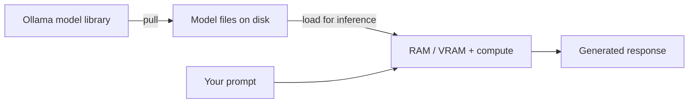
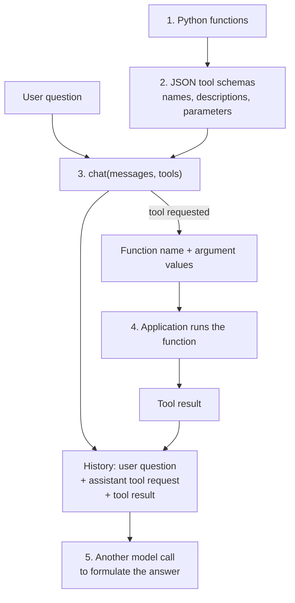
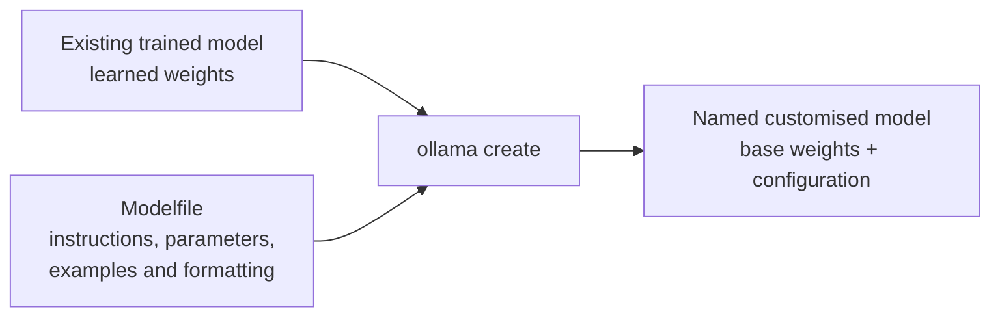
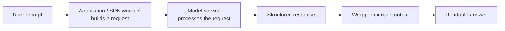
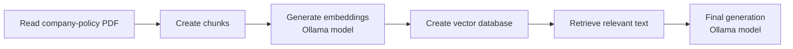

> **Video 21 of 21** · [Watch on YouTube](https://www.youtube.com/watch?v=YcAYmIFtA0o). Notes follow the video's teaching order. Hindi captions were translated into English, then checked against video frames and the instructor's notebooks.

**In one line.** Ollama handles downloading and running models; this lecture shows how to use those models from a terminal, Python and applications.

**Source code:** [CampusX's Ollama-Youtube repository](https://github.com/campusx-official/Ollama-Youtube/tree/06244ad032b3ef982e1d4d8b9f514d3c9be60dba). Code below follows the displayed examples. Extra imports, file-name adjustments and corrections are identified where needed. Recorded model outputs are observations, not promises about a new run.

| Video section | Start |
| --- | --- |
| Motivation and scope | [00:00](https://www.youtube.com/watch?v=YcAYmIFtA0o&t=0s) |
| LLMs and proprietary versus downloadable models | [04:57](https://www.youtube.com/watch?v=YcAYmIFtA0o&t=297s) |
| Why raw weights are difficult to use | [11:54](https://www.youtube.com/watch?v=YcAYmIFtA0o&t=714s) |
| Ollama and its benefits | [15:17](https://www.youtube.com/watch?v=YcAYmIFtA0o&t=917s) |
| Model library | [22:43](https://www.youtube.com/watch?v=YcAYmIFtA0o&t=1363s) |
| Hardware requirements and installation | [28:37](https://www.youtube.com/watch?v=YcAYmIFtA0o&t=1717s) |
| Basic and advanced CLI | [34:31](https://www.youtube.com/watch?v=YcAYmIFtA0o&t=2071s) |
| Python library | [51:41](https://www.youtube.com/watch?v=YcAYmIFtA0o&t=3101s) |
| Images, system instructions and parameters | [56:38](https://www.youtube.com/watch?v=YcAYmIFtA0o&t=3398s) |
| Conversation history and model management | [1:04:14](https://www.youtube.com/watch?v=YcAYmIFtA0o&t=3854s) |
| Tool-calling concept and workflow | [1:10:21](https://www.youtube.com/watch?v=YcAYmIFtA0o&t=4221s) |
| Electronic-shop code demonstration | [1:26:55](https://www.youtube.com/watch?v=YcAYmIFtA0o&t=5215s) |
| Modelfile demonstration | [1:44:02](https://www.youtube.com/watch?v=YcAYmIFtA0o&t=6242s) |
| REST API | [1:59:04](https://www.youtube.com/watch?v=YcAYmIFtA0o&t=7144s) |
| LangChain | [2:14:11](https://www.youtube.com/watch?v=YcAYmIFtA0o&t=8051s) |
| Ollama Cloud | [2:28:14](https://www.youtube.com/watch?v=YcAYmIFtA0o&t=8894s) |
| Desktop app | [2:43:16](https://www.youtube.com/watch?v=YcAYmIFtA0o&t=9796s) |
| Closing recap and course overview | [2:47:51](https://www.youtube.com/watch?v=YcAYmIFtA0o&t=10071s) |

## 00:00 · Why this masterclass exists

Earlier CampusX GenAI projects commonly used OpenAI's GPT models. The opening problem is practical: students may be able to write the application but lack a payment method for accessing a paid API. The instructor introduces DeepSeek, Qwen and GLM as examples of increasingly capable downloadable models.

The video has two purposes: introduce the team's longer course and give viewers enough grounding to start using Ollama themselves. Nitish introduces the course; Ajay teaches the demonstrations. The promised route is model accessibility, Ollama's role, hardware and installation, then five ways of using it: **CLI, Python library, REST API, LangChain and cloud**. A desktop-app demonstration follows at the end.

## 04:57 · What an LLM contains

The lecture starts with a neural-network view. An LLM has many layers and connections; its learned numerical parameters, described here as weights and biases, hold what training has learned. This matters because obtaining those model files is different from obtaining access to a hosted chatbot.

At [06:23](https://www.youtube.com/watch?v=YcAYmIFtA0o&t=383s), the instructor classifies models by **accessibility and control**.

| Question | Proprietary model in the lecture | Downloadable model in the lecture |
| --- | --- | --- |
| Who controls access? | The provider, such as OpenAI or Google | You can obtain the released model files |
| How do you use it? | A hosted application or API | Download and run it on your own computer |
| What do you obtain? | Permission to use a service | Weights and the other materials included in the release |
| Where does inference happen? | On the provider's infrastructure | On your hardware in the local examples |
| What do you pay for? | The provider's subscription or API usage | Local hardware, storage and electricity |
| Examples named | Gemini and ChatGPT/GPT | Meta Llama, Mistral and DeepSeek |

At [09:54](https://www.youtube.com/watch?v=YcAYmIFtA0o&t=594s), Ajay explains downloading model components from platforms such as Hugging Face. Having access to weights can also make further fine-tuning possible.

**The cloth analogy:** access to the material gives you the opportunity to shape it to your requirements, like cutting a length of cloth into a garment.

:::note Terminology correction
The lecture uses “open source” broadly and says model architecture, weights and training data become public. Availability differs by release: downloadable weights do not establish that the training data and code are public. Also, downloading a model does not remove its licence restrictions. The [Llama 3.2 page](https://ollama.com/library/llama3.2:1b) links its licence and acceptable-use policy.
:::

## 11:54 · Why free model files are still difficult to use

The instructor's question is: if downloadable models are available, why do people still pay for hosted ones? His answer centres on the work required to use raw weights.

1. **Storage:** obtain the right files and store them in a usable format.
2. **Working memory:** load the model and arrange the RAM or VRAM needed for inference.
3. **Compatibility:** use software that can execute those weights on your machine.

The teaching sequence is **downloaded numerical files → storage → memory → computation**, rather than “download a file and it automatically behaves like ChatGPT”. Ollama is introduced as the tool that manages this practical gap.

## 15:17 · What Ollama does

Ollama lets you **download, run and manage supported models** on your own computer. You select the model and provide input; Ollama handles the model package and runtime interaction.

**The WhatsApp analogy:** a user concentrates on sending and receiving messages while the application handles delivery. Likewise, an Ollama user concentrates on model input and output while Ollama handles the mechanics underneath.

The instructor later calls it a **consultant**: it does the model-management work on your behalf. This is an explanation of its role, not a claim that every model fits every computer.


```mermaid
flowchart LR
    L["Ollama model library"] -->|pull| D["Model files on disk"]
    D -->|load for inference| R["RAM / VRAM + compute"]
    P["Your prompt"] --> R
    R --> O["Generated response"]
```

## 18:51 · Benefits, followed by the model-library tour

The lecture presents the benefits in this order:

| Benefit | Point being taught |
| --- | --- |
| Privacy and data control | A downloaded model can process data locally |
| Offline access and latency | Local inference does not require a network request to a hosted model |
| Cost predictability | No hosted per-request inference fee for running a local model |
| Simple setup | Install Ollama and manage models through short commands |
| Prebuilt model library | Find ready-to-use packages rather than assembling raw files yourself |
| Customisation | Change instructions and generation settings |
| Reduced provider dependence | Choose and run downloaded models yourself |
| Easy management | Pull, run and remove models through Ollama |

:::note Clarifications to the benefit claims
Local privacy and offline access apply to **local inference**. Cloud calls and external tools have other data flows. Local execution also takes time; the lecture's “no latency issue” means avoiding the cloud round trip, not instantaneous generation. Model size and hardware still matter. Changing instructions or sampling parameters does not fine-tune weights.
:::

### 22:43 · Choose by capability as well as model family

The instructor opens Ollama's model library and explores families including Qwen, Mistral, Llama, Gemma, LLaVA and DeepSeek. He then uses its capability filters.

| Filter | What the lecture uses it to find |
| --- | --- |
| Vision | Models that can interpret image input |
| Thinking | Models with reasoning support |
| Tools | Models supporting tool calls |
| Embedding | Models producing text vectors |
| Cloud | Models available through Ollama Cloud |

A small correction happens during the tour: he initially sees no thinking models because **Vision and Thinking are both selected**. Clearing Vision shows Thinking results. The empty list was caused by combined filters.

He opens **Qwen3-VL** to show that one family has multiple sizes. The choice must match both your task and your machine. Model family, parameter count and supported inputs are separate things to check.

## 28:37 · Requirements for local models

| Item | What Ajay recommends or demonstrates |
| --- | --- |
| Operating system | Windows, macOS or Linux |
| RAM | At least 8 GB as the lecture's starting recommendation; more helps |
| Processor | He recommends an i5 13th-generation processor or above for a smoother experience; slower machines may still run models |
| Disk space | Space for the model package: the displayed Qwen3-VL examples are about 2 GB for 2B and 6.2 GB for 8B |
| Internet | Required to download Ollama and local models initially |
| Command line | Basic terminal knowledge |
| GPU | Optional in this introduction; useful for faster inference |

These are the **lecture's examples**, not universal minimum requirements. Enough disk space to download a model does not establish that you have enough working memory to run it.

## 32:22 · Install Ollama, then select an interface

The recorded demonstration is on Windows. Ajay visits Ollama's website, selects **Download**, opens the setup file and clicks **Install**. Use the download for your own operating system; the Windows installer is what the video shows.

Once installed, he introduces the command line and the library/API/framework routes. Before demonstrating commands, he distinguishes **Ollama from the model**: model quality and capability determine whether an answer is useful or an image can be read. Ollama manages running that model.

## 34:31 · CLI: download, list and run

The terminal demonstration checks the installation, starts a model download and then uses models already present on the instructor's machine.

```bash
ollama --version
ollama pull ministral-3:8b
ollama ls
ollama list
ollama run llama3.2:1b
```

The Ministral download is **cancelled during the recording**. Do not read the subsequent list as proof that it completed. The listed local models are `qwen3:8b`, `gemma3:4b` and `llama3.2:1b`.

`pull` obtains the package on disk. `run` makes the model available for inference, loading it into working memory as needed. The instructor corrects a mistyped model name and reruns the command.

Inside the session he tries a greeting, asks what photosynthesis is, then asks about fundamental rights in the Indian Constitution. He asks viewers to test a downloaded local model while disconnected from the internet; he does not disconnect during his recording.

### The image failure and model switch

Ajay copies an image path and asks the model to summarise the image. **`llama3.2:1b` cannot interpret it**, because that model lacks vision capability.

He exits with `/bye`, checks the library and switches to `gemma3:4b`. That model accepts the image and describes the infographic about AI's electricity and water use. The fix is choosing a vision-capable model, rather than changing the spelling of the prompt.

:::note Path adjustment for your machine
The video pastes a Windows image path. Supply the path to your own copy of the image in that prompt. Copying the instructor's absolute path will not find a file on your computer.
:::

## 44:26 · CLI: inspect and change a session

Ajay returns to the small Llama model, types `/show` and inspects its information. He switches to Gemma to show a model with default parameters and system instructions.

| In-session command | What to inspect |
| --- | --- |
| `/show` | Available inspection commands |
| `/show info` | Architecture, parameter count, context length, quantisation and capabilities |
| `/show parameters` | Default and user-defined generation settings |
| `/show system` | System instructions |
| `/show modelfile` | Model configuration |
| `/show template` | Prompt formatting |
| `/show license` | Licence text |

The absence of an explicit system message or model-defined parameter list in one model is itself part of the demo. Another model can supply those defaults.

Next he opens `/set`, then `/set parameter`, to see the settings he can change. The terminal frame shows these commands:

```text
/set
/set parameter
/set parameter top_p 0.99
/show parameters
/set system "You are an helpful assistant"
/bye
```

`/show parameters` then displays the new `top_p` value under user-defined settings. This overrides the corresponding default for that session. The value on screen is **0.99**, despite the spoken caption also mentioning 0.90.

The lecture's reason for using the CLI is **experimentation**: try prompts, instructions and parameters; then carry the successful configuration into an application written in Python or JavaScript.

## 51:41 · Python library: generate and stream

Ajay opens `Ollama.ipynb`, installs the library and imports it. Ollama itself must also be installed and running, and the local model must be downloaded.

```bash
pip install ollama
```

The first example uses the moon question, not a substituted topic:

```python
import ollama

response = ollama.generate(
    model="llama3.2:1b",
    prompt="why does moon glow ?",
)

print(response)
print(response.response)
```

The response object includes model identity, creation time, durations and token counts. `response.response` selects the generated text. The first call can take longer because loading the model also takes time.

He then enables streaming:

```python
import ollama

response = ollama.generate(
    model="llama3.2:1b",
    prompt="why does moon glow ?",
    stream=True,
)

for i in response:
    print(i["response"], end="")
```

With streaming, `response` is iterable: text arrives in successive chunks. Without it, the application receives the complete generated result before printing it.

:::note The displayed model answer contains an error
The notebook's moon response confuses ordinary moonlight with eclipses. The demonstration establishes that text was generated; it does not validate the explanation. The Moon's ordinary visible light is reflected sunlight. Do not learn astronomy from this recorded model response.
:::

## 56:38 · Images and generation settings in Python

Before coding images, Ajay tours the generation API fields: model, prompt, suffix, images, system, stream and options. He then returns to the same infographic used in the CLI demonstration.

### Encode one image and request a caption

This follows the notebook's `image_path`, `image_bytes` and `image_64` steps. `Linkedin.jpg` is the filename used while recording.

```python
import base64
import ollama

image_path = "Linkedin.jpg"

with open(image_path, "rb") as f:
    image_bytes = f.read()
image_64 = base64.b64encode(image_bytes).decode("utf-8")

response = ollama.generate(
    model="gemma3:4b",
    images=[image_64],
    prompt="Give caption for the image.",
)
print(response.response)
```

The steps are **open binary file → read bytes → encode base64 → pass a list of images**. The model must support vision. The result gives caption suggestions for the infographic.

:::note File names and image encoding
The linked repository names the files `Linkedin (1).jpg` and `Green AI (1).png`. Rename your downloaded copies to the notebook names, or adjust the paths. The lecture's explicit base64 conversion works; it is required for image data in REST JSON. The Python SDK also accepts paths and bytes, as documented in [Ollama's vision reference](https://docs.ollama.com/capabilities/vision).
:::

### Encode two images and generate a story

The second example adds `Green AI.png`. It asks the model to use context from **both** images.

```python
import base64
import ollama

image_paths = ["Linkedin.jpg", "Green AI.png"]
images_base64 = []

for i in image_paths:
    with open(i, "rb") as f:
        image_bytes = f.read()
        images_base64.append(base64.b64encode(image_bytes).decode("utf-8"))

response = ollama.generate(
    model="gemma3:4b",
    images=images_base64,
    prompt="Generate an story based on these images, make sure you take context from each and every image.",
)
print(response.response)
```

The recorded response is a story themed around Green AI. Ajay points to information from the images in the story to explain the purpose of providing multiple inputs. Its generated numbers and interpretation still require checking against the images.

### Change the tone through `system`

The instructor repeats the moon question with a funny-assistant instruction:

```python
import ollama

response = ollama.generate(
    model="llama3.2:1b",
    prompt="why does moon glow ?",
    system="You are an funny assistant , you explain things in funny way",
)
print(response.response)
```

This changes the requested style. It does not verify the facts or update the model's learned parameters.

### Change sampling through `options`

This is a separate call, using the ocean question and the notebook's actual settings:

```python
import ollama

response = ollama.generate(
    model="llama3.2:1b",
    prompt="why is the ocean blue",
    options={
        "temperature": 0.3,
        "top_p": 0.5,
        "top_k": 45,
    },
)
print(response.response)
```

`options` is a dictionary of generation settings. Ajay also points to `min_p` and `stop` in the documentation. The demo is about passing settings, not a comparison proving that these values are optimal.

## 1:04:14 · Conversation history and other Python methods

The instructor contrasts the one-prompt generation examples with a conversation. A chatbot needs earlier turns to understand follow-up questions. He opens the **chat API documentation** to introduce `messages`; this part does not demonstrate a separate name-recall program.

| Message field | Purpose |
| --- | --- |
| `role` | Identifies the user, assistant, system or tool |
| `content` | Carries that turn's text |
| `messages` | Supplies the sequence of turns to `chat` |

:::note Clarification: the application supplies history
The lecture says `chat` maintains context. More precisely, your application sends the history in `messages`; separate calls do not automatically share memory. The [Python SDK's chat examples](https://github.com/ollama/ollama-python#chat) show this request structure. The electronic-shop demonstration below provides the video's concrete history example.
:::

### Return to the CLI to show deletion

At about [1:06:00](https://www.youtube.com/watch?v=YcAYmIFtA0o&t=3960s), Ajay remembers a command omitted earlier. He lists models, removes `llama3.2:1b`, then lists them again:

```bash
ollama ls
ollama rm llama3.2:1b
ollama ls
```

The model disappears from the list. If you reproduce that deletion, download it again before the later Llama examples.

### List model names and sizes

Returning to Python, he uses the wrapper methods corresponding to CLI operations. The list demonstration prints the whole response, then selects names and sizes:

```python
import ollama

local_models = ollama.list()
print(local_models)

for i in local_models["models"]:
    print(i["model"])
    print(i["size"])
```

The size is the downloaded model information, not a measurement of all memory used by an active inference request.

### Pull with progress

```python
import ollama

model_name = "deepseek-r1"
progess = ollama.pull(model_name, stream=True)

for i in progess:
    print(i)
```

The misspelt variable `progess` comes from the notebook and is used consistently. Ajay starts the pull to demonstrate status messages, then **stops the download**. This is not an inference example.

### Inspect a model

```python
import ollama

models_details = ollama.show("qwen3:8b")
print(models_details.model_dump())

model_dict = models_details.model_dump()
print(model_dict["capabilities"])
print(model_dict["parameters"])
```

The recorded Qwen model lists `completion`, `tools` and `thinking`. Ajay also examines its template, Modelfile and licence information. The notebook uses `.dict()` and displays a deprecation warning; the code above uses `.model_dump()` to address that warning without changing the example.

He mentions `delete` and `push` as other library methods. The underlying lesson is that model management can be done from application code as well as the terminal.

## 1:10:21 · Tool calling: give the model access to a task

Ajay starts with three requests an unaided model cannot reliably fulfil: fetch records from your database, report Chandigarh's current temperature, and provide today's news. Its learned knowledge has a cutoff, and generating text does not give it access to your live systems.

His database example is concrete: write a Python function that connects to the database and performs the query. That function supplies the missing capability. The model can request its use, but your program performs the actual operation.

**Check model support first.** The lecture opens the **Tools** filter in Ollama's library. Tool calling requires a model supporting that capability; the upcoming example uses `qwen3:8b`.

### 1:17:54 · The workflow, in the instructor's order

1. **Create tools:** write functions that perform the required tasks.
2. **Create tool schemas:** describe each function's name, purpose, parameters, parameter types and required inputs.
3. **Call the model:** send the user's question and those schemas. The model can answer directly or request a tool with arguments.
4. **Execute the request:** application code selects and runs the real Python function.
5. **Call the model again:** send the original question, assistant tool request and tool result as history, allowing it to formulate an answer.

Ajay uses a city-temperature example to explain argument extraction: a question about Dehradun supplies the city name for the weather function. A schema tells the model what argument it needs; the user's message supplies its value.


```mermaid
flowchart TB
    F["1. Python functions"] --> S["2. JSON tool schemas<br/>names, descriptions, parameters"]
    U["User question"] --> C["3. chat(messages, tools)"]
    S --> C
    C -->|tool requested| J["Function name + argument values"]
    J --> X["4. Application runs the function"]
    X --> T["Tool result"]
    C --> H["History: user question<br/>+ assistant tool request<br/>+ tool result"]
    T --> H
    H --> A["5. Another model call<br/>to formulate the answer"]
```

The distinction is essential: **a tool request is generated data; execution is Python code**. An apparent function call printed in ordinary text does not prove that the function ran.

:::note Schema clarification
The video passes explicit JSON-style schemas, so this chapter does too. Its statement that functions cannot be passed directly is too broad: the Python SDK can also derive schemas from supported Python callables. The underlying model still receives a tool description. See [Ollama's tool-calling documentation](https://docs.ollama.com/capabilities/tool-calling).
:::

## 1:26:55 · Practical tool calling: the electronic shop

The shop needs to look up stock and calculate a loyalty discount. Ajay represents its database with a Python dictionary; this recording does **not** connect to a real database.

The code below follows [Tool Calling.ipynb](https://github.com/campusx-official/Ollama-Youtube/blob/06244ad032b3ef982e1d4d8b9f514d3c9be60dba/Tool%20Calling.ipynb), the notebook visible in the recording. Run these blocks in sequence in one notebook or script.

:::note Two different shop examples in the repository
`Ollama.ipynb` also contains a shop example, with a **25%** cap and a three-year prompt. The separate `Tool Calling.ipynb` shown in this video uses a **30%** cap and eventually a five-year prompt. These notes follow the recorded version rather than combining the two.
:::

### Step 1: inventory and functions

```python
import ollama

inventory_db = {
    "laptop": {"stock": 5, "base_price": 1200},
    "monitor": {"stock": 0, "base_price": 300},
    "keyboard": {"stock": 25, "base_price": 80},
}


def check_inventory(product_name):
    product_name = product_name.lower()

    if product_name in inventory_db:
        return inventory_db[product_name]

    return {"stock": 0, "base_price": None}


def calculate_loyalty_discount(base_price, years_as_customer):
    discount = min(years_as_customer * 0.05, 0.30)
    final_price = base_price * (1 - discount)
    return round(final_price, 2)
```

`check_inventory` normalises the product name and returns stock and price. An unknown product returns zero stock and no price. The discount rule is **5% per customer year, capped at 30%**.

Ajay then defines a name-to-function mapping, leaving its explanation until the execution step:

```python
available_functions = {
    "check_inventory": check_inventory,
    "calculate_loyalty_discount": calculate_loyalty_discount,
}
```

### Step 2: describe both tools

```python
tools = [
    {
        "type": "function",
        "function": {
            "name": "check_inventory",
            "description": "Get stock and price for a product",
            "parameters": {
                "type": "object",
                "properties": {
                    "product_name": {"type": "string"},
                },
                "required": ["product_name"],
            },
        },
    },
    {
        "type": "function",
        "function": {
            "name": "calculate_loyalty_discount",
            "description": "Calculate final price based on loyalty years",
            "parameters": {
                "type": "object",
                "properties": {
                    "base_price": {"type": "number"},
                    "years_as_customer": {"type": "integer"},
                },
                "required": ["base_price", "years_as_customer"],
            },
        },
    },
]
```

`type` identifies a function tool. `function` supplies its definition. `properties` describes arguments, while `required` marks which arguments must be supplied. In the discount schema, **`base_price` is a number** and customer years are an integer; the spoken explanation briefly calls both integers, but the displayed schema distinguishes them.

### Step 3: ask about an iPhone

The recording first asks about an iPhone, then changes the product to a laptop. The list is called **`message`**, singular, in the notebook.

```python
message = [
    {"role": "user", "content": "I want to buy an iPhone. Can you check stock?"},
]

response = ollama.chat(
    model="qwen3:8b",
    messages=message,
    tools=tools,
)

print(response)
print(response["message"])
```

Ajay uses **`chat`**, because its request accepts `tools`; the `generate` request shown earlier does not. The tool schemas tell Qwen what functions are available, while `message` holds the user question and later history.

The displayed assistant message has empty text content and a structured tool request for `check_inventory`, with the product argument set to iPhone. Ajay inspects that request to explain where the selected name and arguments appear. The relevant execution field is **`tool_calls`**, rather than the model's explanatory text.

### Step 4: dispatch and execute the requested function

This is the notebook's execution block. It reads the generated request instead of manually hard-coding a product lookup.

```python
tool_calls = response["message"].get("tool_calls")

if tool_calls:
    for tool_call in tool_calls:
        tool_name = tool_call["function"]["name"]
        tool_args = tool_call["function"]["arguments"]

        function_to_call = available_functions[tool_name]
        result = function_to_call(**tool_args)

        message.append(response["message"])
        message.append({
            "role": "tool",
            "content": str(result),
        })

print(message)
```

`available_functions[tool_name]` turns a returned name into the actual Python function. `**tool_args` passes the argument dictionary as keyword arguments. The application then adds the assistant request and result to history.

For the one-tool request shown, `message` now has three turns:

| Order | Role | What it carries |
| --- | --- | --- |
| 1 | user | The stock question |
| 2 | assistant | The request to run `check_inventory` |
| 3 | tool | The dictionary returned by the Python function |

### Step 5: send that history back

```python
final_response = ollama.chat(
    model="qwen3:8b",
    messages=message,
)

print(final_response["message"]["content"])
```

Notice that the **second call does not pass `tools`** in the recorded code. It asks the model to write an answer from the history assembled so far.

The iPhone is absent from the dictionary, so the lookup returns zero stock and no base price. The model describes it as unavailable. Next Ajay changes the original question to a laptop stock request and reruns the blocks. The lookup now returns **5 units and a base price of 1200**.

Reset `message` when rerunning a new question, as the first block does. Otherwise, earlier tool turns remain in the list.

### The five-year prompt and the visible failure

Finally, Ajay changes the user's content to:

```text
I am a customer for 5 years. What will be the final price of a laptop?
```

The model first requests `check_inventory`, because the discount function needs a base price. The application executes that lookup and makes the same final call above.

At [about 1:43:00](https://www.youtube.com/watch?v=YcAYmIFtA0o&t=6180s), the output prints text resembling a discount call, followed by a claimed price of **1140** and a **60** discount. The instructor moves on after presenting it as a tool-calling result.

:::note Correction: the printed discount was not executed
The displayed dispatch block processes only the **first** model response. That response requests inventory. The later call neither supplies tool schemas nor dispatches another response, so a discount call printed in its text is not executed by this code.

The actual function gives `min(5 * 0.05, 0.30) = 0.25`, hence `1200 * (1 - 0.25) = 900`. **1140 is not the result of the demonstrated five-year rule.** To complete dependent tools, an application must keep providing schemas, execute each structured request and send its result back until it receives a final answer. This is a correction to the demo, not a loop shown in the video.
:::

## 1:44:02 · Modelfiles: specialised behaviour around an existing model

The next problem is different: a general-purpose model may need to behave as a polite support assistant, an honest code reviewer, a legal assistant with boundaries, or a casual Gen Z chatbot.

Ajay contrasts training a model from scratch with using a **trained base model plus an instruction file**. The base provides learned capability; the file says how to use it.

**The student analogy:** a student already knows how to solve a difficult maths problem. Teaching a shortcut changes the way the student approaches the solution without rebuilding all that prior learning. Likewise, this Modelfile demo guides a trained model without changing its weights.


```mermaid
flowchart LR
    B["Existing trained model<br/>learned weights"] --> C["ollama create"]
    M["Modelfile<br/>instructions, parameters,<br/>examples and formatting"] --> C
    C --> N["Named customised model<br/>base weights + configuration"]
```

A Modelfile is a text configuration. It is not the large weight package itself. Ajay opens the Modelfile reference and explains the directives before building his sentiment model.

| Directive | What it specifies |
| --- | --- |
| `FROM` | The base model; required |
| `PARAMETER` | Generation and runtime settings |
| `SYSTEM` | Instructions governing the requested behaviour |
| `TEMPLATE` | The prompt's formatting |
| `MESSAGE` | Example/history turns |
| `LICENSE` | Licence text; listed in the reference tour |

### The sentiment configuration

The intended task is to read text and return **only a JSON score and a sentiment label**. The model is `llama3.2:1b`, with the actual settings from the displayed file.

Save this as **`Modelfile`** in the directory from which you run the next commands. The repository offers the source as [Modelfile.txt](https://github.com/campusx-official/Ollama-Youtube/blob/06244ad032b3ef982e1d4d8b9f514d3c9be60dba/Modelfile.txt); rename it or adjust the `-f` argument.

```text
FROM llama3.2:1b

PARAMETER temperature 0.1
PARAMETER num_ctx 1024
PARAMETER num_predict 20
PARAMETER top_k 10

SYSTEM """
You are a sentiment analysis API.
You ONLY output JSON in the following schema: {"score": float, "label": "string"}.
Labels allowed: [POSITIVE, NEGATIVE, NEUTRAL].
Scores range from 0.0 to 1.0.
"""

MESSAGE user "This product is okay, but the shipping was slow."
MESSAGE assistant {"score": 0.4, "label": "NEUTRAL"}

MESSAGE user "Absolutely amazing experience, highly recommend!"
MESSAGE assistant {"score": 0.95, "label": "POSITIVE"}
```

`num_ctx` supplies a context budget; `num_predict` limits generated tokens. The low temperature asks for less sampling variability. The `MESSAGE` pairs demonstrate the intended format with a neutral and a positive example.

:::note Corrections to the file's comments
The repository escapes JSON inside quoted assistant `MESSAGE` values. The assistant lines above use unquoted JSON: the installed Ollama CLI preserves the source backslashes in message content, whereas these adjusted lines send plain JSON examples. The demonstrated scores and labels are unchanged.

The source calls these examples “few-shot training”. Here they are **prompt examples**, not weight training. Its comment also says `top_k` narrows vocabulary to essential characters; it actually limits the candidate tokens considered during sampling. It does not enforce a JSON alphabet or schema. The [Modelfile reference](https://docs.ollama.com/modelfile#valid-parameters-and-values) defines the directives and parameters.
:::

### Create, list and try the model

Ajay opens a terminal in the folder containing his file, creates `sentiment:latest`, and checks that it appears in the local list.

```bash
ollama create sentiment:latest -f Modelfile
ollama ls
ollama run sentiment:latest "I love the course"
ollama run sentiment:latest "I love the course but this course is expensive"
```

`-f` identifies the configuration file. The created name allows repeated use of the same base and settings without respecifying them with every prompt.

The frame at [1:57:50](https://www.youtube.com/watch?v=YcAYmIFtA0o&t=7070s) shows JSON-shaped outputs: **NEUTRAL** for the first statement and **NEGATIVE** for the mixed statement.

:::note Formatting success does not prove correct sentiment
“I love the course” expresses positive sentiment, so the recorded neutral label is a classification failure. The configuration demonstrates packaged behaviour; it does not guarantee correct labels or valid, complete JSON. A 20-token output budget can also truncate a result. Validation and changes to that budget would be application improvements, not results established by the recording.
:::

Ajay finishes by pointing to **create a model** in the API reference. He mentions doing this programmatically but prefers the command-line version for this example. No separate Python creation program is demonstrated here.

## 1:59:04 · REST API: what the wrappers are doing

The lecture now revisits the two interfaces already used: CLI commands and the Python library. Ajay explains that they make requests to Ollama's HTTP API.

He first draws the hosted-model flow: a user prompt becomes an API request, the remote model service processes it, and the wrapper extracts a readable answer from the structured response.


```mermaid
flowchart LR
    U["User prompt"] --> W["Application / SDK wrapper<br/>builds a request"]
    W --> S["Model service<br/>processes the request"]
    S --> J["Structured response"]
    J --> R["Wrapper extracts output"]
    R --> A["Readable answer"]
```

For a downloaded model, the same interaction goes to a **local** Ollama service:

```text
http://localhost:11434
```

:::note Correction to the server explanation
The lecture describes each model call as creating a server. The Ollama service persists and handles requests; `run` loads and interacts with a model through that service. It does not create a separate HTTP server for every request. Ollama's [FAQ](https://docs.ollama.com/faq#how-can-i-expose-ollama-on-my-network) documents the default local binding and port.
:::

Ajay opens API endpoints to connect the library methods to HTTP requests.

| Operation | HTTP request |
| --- | --- |
| Generate | `POST /api/generate` |
| Chat | `POST /api/chat` |
| List downloaded models | `GET /api/tags` |
| Push | `POST /api/push` |

### First use the library, then call generation directly

This follows [Ollama using Rest API.ipynb](https://github.com/campusx-official/Ollama-Youtube/blob/06244ad032b3ef982e1d4d8b9f514d3c9be60dba/Ollama%20using%20Rest%20API.ipynb). The same prompt is used in both requests.

```python
import ollama

response = ollama.generate(
    model="llama3.2:1b",
    prompt="Explain black holes simply",
)
print(response.response)
```

For the direct version, the `requests` package sends the HTTP request. Install it if your environment does not already include it; that is a setup clarification for running the notebook.

```bash
pip install requests
```

```python
import requests
import json

url = "http://localhost:11434/api/generate"
payload = {
    "model": "llama3.2:1b",
    "prompt": "Explain black holes simply",
}

response = requests.post(url, json=payload)

for i in response.iter_lines():
    print(i)
```

The recording first prints the raw lines. Each line is a JSON object, and successive `response` fields contain pieces of the generated text. The final record has `done` set to true.

Next Ajay assembles those pieces into one string:

```python
output = ""

for i in response.iter_lines():
    if i:
        data = json.loads(i.decode("utf-8"))
        if "response" in data:
            output += data["response"]
        if data.get("done"):
            break

print(output)
```

The direct call exposes details the Python wrapper handled earlier: URL, request method, JSON body, response parsing and text assembly. The two routes perform the same task; two generation requests do not guarantee identical wording.

:::note Streaming clarification
The displayed `requests.post` call does not set `stream=True`, so Requests buffers the HTTP response before the iteration. Ollama still returns newline-delimited JSON. To display chunks while they arrive, client-side HTTP streaming would also need to be enabled. The code above preserves the recorded call and its two inspection passes over the buffered response.
:::

### Compare listing through the wrapper and through HTTP

First the library version:

```python
import ollama

models = ollama.list()

for model in models["models"]:
    print(model["model"])
```

Then the direct request:

```python
import requests

url = "http://localhost:11434/api/tags"
r = requests.get(url)
data = r.json()

for model in data["models"]:
    print(model["name"])
```

Both list downloaded models, including the sentiment model created earlier. The example also shows a response-shape detail: the SDK example selects `model`, while the raw JSON example selects `name`.

## 2:14:11 · LangChain: compose the surrounding application

Ajay introduces LangChain as an orchestration framework. A useful application may need input handling, memory, retrieval and other components alongside model generation.

His example is a **company-policy PDF chatbot**. He draws the tasks in this order:


```mermaid
flowchart LR
    P["Read company-policy PDF"] --> C["Create chunks"]
    C --> E["Generate embeddings<br/>Ollama model"]
    E --> D["Create vector database"]
    D --> R["Retrieve relevant text"]
    R --> G["Final generation<br/>Ollama model"]
```

He identifies embeddings and generation as the model-driven steps in this example. He then sketches existing components, including a PDF reader and FAISS, to explain why a framework can save repeated implementation work. **He does not build a complete RAG application in this video.**

The actual notebook demonstration covers three Ollama adapters. It follows [Ollama Using LangChain.ipynb](https://github.com/campusx-official/Ollama-Youtube/blob/06244ad032b3ef982e1d4d8b9f514d3c9be60dba/Ollama%20Using%20LangChain.ipynb).

```bash
pip install langchain-ollama
```

### Chat: `ChatOllama`

```python
from langchain_ollama import ChatOllama

llm = ChatOllama(
    model="llama3.2:1b",
    temperature=0,
)

response = llm.invoke(
    "Explain the concept of quantum entanglement in one sentence."
)
print(response.content)
```

`invoke` runs this component. `ChatOllama` returns a message, so the text is selected through `.content`. Ollama must be running and this local model must be downloaded.

### Plain text generation: `OllamaLLM`

```python
from langchain_ollama import OllamaLLM

llm = OllamaLLM(model="llama3.2:1b")
response = llm.invoke("The capital of France is")
print(response)
```

Here the prompt is a sentence prefix. `OllamaLLM` returns text directly, so the code prints `response` itself.

### Embeddings: `OllamaEmbeddings`

The recorded model is **`embeddinggemma:latest`**, not `nomic-embed-text`. Download it before reproducing this local call. The pull below is a setup step, added to make that prerequisite explicit.

```bash
ollama pull embeddinggemma:latest
```

```python
from langchain_ollama import OllamaEmbeddings

embeddings = OllamaEmbeddings(model="embeddinggemma:latest")

query_result = embeddings.embed_query("What is LangChain?")
print(query_result)

# The next notebook cell embeds two strings.
doc_results = embeddings.embed_documents([
    "Document 1 content",
    "Document 2 content",
])
print(f"Embedding length: {len(doc_results)}")

# Inspect the first document's vector, as in the notebook.
print(doc_results[0])
```

`embed_query` returns one vector. `embed_documents` returns one vector for each input string. The printed **2** is the number of document vectors, not the number of coordinates in one vector.

### Why bring in LangChain for these simple calls?

Ajay returns to the company-policy diagram: Ollama can generate embeddings and answers, while the wider application still needs document reading, chunking, storage and retrieval. LangChain's adapters give the model steps the interfaces used by the surrounding components.

:::note Correction to the “broken chain” claim
The lecture says a direct Ollama component cannot be combined into a LangChain chain. The practical issue is matching interfaces and input/output types; direct Python operations can be wrapped or composed with framework components. Using the adapters simplifies this composition. See LangChain's [runnable interface](https://reference.langchain.com/python/langchain-core/runnables/).
:::

## 2:28:14 · Ollama Cloud: move inference to larger hardware

Ajay dates the cloud feature to around September 2025. He reopens Qwen3-VL's sizes: 2B, 4B, 8B, 30B, 32B and 235B. Availability in the library does not mean your laptop can execute every size.

His constraint is hardware: weights and inference working data need memory, and the machine has finite resources. Cloud execution puts the workload on hardware managed by Ollama instead.

:::note Hardware and size clarifications
The lecture places computation “in RAM/VRAM” and predicts that an oversized model will crash the whole system. RAM/VRAM hold data; CPU/GPU perform computation. Insufficient memory can prevent loading or cause severe slowdown, rather than guaranteeing a system crash. Also, a larger parameter count alone does not guarantee a better answer to every task.
:::

Only models offered for cloud execution are available through this route. Ajay uses the library's **Cloud** filter; choosing a local-only model does not move it to cloud automatically.

### Sign in, connect and run the cloud model

The recorded sequence is: sign in on `ollama.com`, run the CLI sign-in command, open the returned URL, and select **Connect**. Running sign-in again confirms the connected account.

```bash
ollama signin
ollama run deepseek-v3.1:671b-cloud
```

The session identifies a **671B cloud model**. Ajay greets it and asks about rainbow colours. The model runs remotely even though the prompt was entered in a local terminal.

### Use the same Python interface

The cloud notebook repeats the familiar generation shape, changing the model tag:

```python
import ollama

response = ollama.generate(
    model="deepseek-v3.1:671b-cloud",
    prompt="Why do stars twinkle?",
)
print(response["response"])
```

This follows [Ollama Cloud.ipynb](https://github.com/campusx-official/Ollama-Youtube/blob/06244ad032b3ef982e1d4d8b9f514d3c9be60dba/Ollama%20Cloud.ipynb). Through the local Ollama service, it uses the account connected above.

Ajay then signs out and reruns the call:

```bash
ollama signout
```

The recording shows an **unauthorised** error. Sign-in is a prerequisite for this cloud route, even though the Python syntax resembles local generation.

### Usage limits and the privacy trade-off

The lecture shows free, Pro and Max tiers. It describes a free usage allowance and paid tiers for more usage. These are observations about the interface at recording time; consult the [current cloud documentation](https://docs.ollama.com/cloud#usage) before relying on an allowance or price.

Ajay explicitly revisits privacy: the earlier local examples kept inference on the computer, whereas **cloud prompts leave it**. He points to Ollama's stated retention policy, then distinguishes that policy from keeping all processing local.

:::note Provider policy versus local execution
Ollama's [current FAQ](https://docs.ollama.com/faq#does-ollama-send-my-prompts-and-answers-back-to-ollamacom) says cloud prompt/response content is processed without being stored, logged or used for training, while limited account and usage metadata is collected. This is a service policy, not local inference. The [cloud reference](https://docs.ollama.com/cloud) also distinguishes signed-in local-service access from direct `ollama.com` API access using an API key; that second authentication route is not demonstrated in this video.
:::

## 2:43:16 · Desktop app: the final demonstration

Ajay opens the installed Ollama application and walks through its chat interface.

1. **New chat and Settings:** the upper-left controls start a chat and expose settings. He recommends account sign-in when cloud access is needed.
2. **Local text model:** choose `llama3.2:1b`, type a greeting and receive a reply.
3. **Vision model:** start another chat, choose `gemma3:4b`, attach the same resource-use infographic and ask for a summary.
4. **Model requiring a download:** select `deepseek-r1:8b`. A download starts before it can be used. **Ajay cancels this download**; the video does not show its completed local inference.
5. **Search the picker:** use a library model name if the model is absent from the displayed list.
6. **Cloud model:** select `gpt-oss:120b-cloud` and request a response while signed in.

The picker distinguishes models that are downloaded from those requiring a download. Image input still depends on the selected model's capabilities.

The instructor recommends the app for ordinary chat and exploration, then points to CLI/code for deliberate parameter and instruction control. That recommendation describes the recorded interface; desktop features can change between versions.

## 2:47:51 · Closing recap and course overview

Nitish returns to close the introduction and show the longer **Generative AI using Open Source LLMs** course. He describes deeper coverage of the same material plus projects. This video itself ends after the demonstrations above; it does not contain those further project builds.

The recording displays a course offer and duration estimate. Those are historical promotion details, not current purchasing information. The course link is in the video's description.

## Checklist

- [ ] I can distinguish access to a hosted model from obtaining its weights.
- [ ] I can explain the storage, memory and compatibility problems Ollama manages.
- [ ] I can select a model by capability and hardware fit.
- [ ] I can pull, list, run, inspect and change a CLI session.
- [ ] I can explain the failed Llama image request and the switch to Gemma.
- [ ] I can reproduce the moon generation, streaming and two-image examples.
- [ ] I can pass the video's system instruction and sampling settings in Python.
- [ ] I know that the application supplies conversation history.
- [ ] I can read a tool schema, dispatch its structured request and return a result.
- [ ] I can explain why the shop's five-year result of 1140 is wrong and the rule gives 900.
- [ ] I can create the sentiment configuration and separate output format from label accuracy.
- [ ] I can call generation and listing through the REST endpoints.
- [ ] I can use ChatOllama, OllamaLLM and embeddinggemma through LangChain.
- [ ] I can explain cloud authentication, hardware benefits and the remote data flow.
- [ ] I can reproduce the app's chat and image steps and identify the cancelled downloads.
