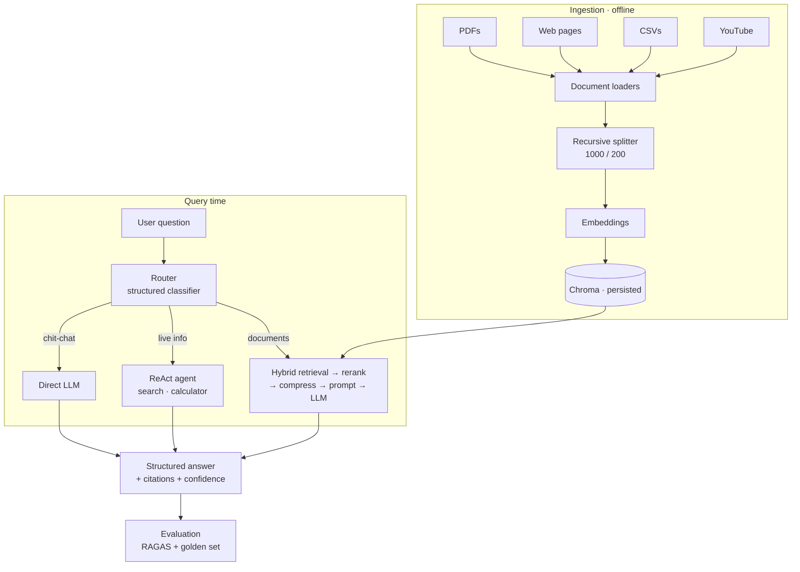

:::note Not from the playlist
This capstone is an **addition**, built to exercise every chapter of the course in one project. It leans on the improvement list the [RAG project video](/docs/genai/youtube-chatbot) gives at the end.
:::

**In one line.** Build a research copilot that ingests a document library, answers grounded questions with citations, reaches for live tools when the library falls short, and is **measured** rather than assumed to work.

## What you are building

**Research Copilot** — a knowledge assistant over a library of PDFs, web pages, CSVs and YouTube transcripts. It:

- answers questions **from your documents**, with citations
- **refuses** to answer when the documents do not support it
- **searches the web** when the library has nothing, and says that it did
- **computes** rather than guessing at arithmetic
- produces **structured output** for downstream systems
- reports **evaluated quality**, not vibes



## Prerequisites

```bash
pip install langchain langchain-openai langchain-community langchain-chroma \
            langchain-core pypdf beautifulsoup4 youtube-transcript-api \
            rank-bm25 pydantic python-dotenv streamlit ragas datasets
```

`.env`:

```bash
OPENAI_API_KEY="sk-..."
```

## Milestone 1 — Ingestion

**Goal.** One function that takes any source and returns chunks, with metadata rich enough to cite.

**Chapters:** [document loaders](/docs/genai/document-loaders), [text splitters](/docs/genai/text-splitters).

```python
from langchain_community.document_loaders import (
    PyPDFLoader, WebBaseLoader, CSVLoader, TextLoader
)
from langchain.text_splitter import RecursiveCharacterTextSplitter
from langchain_core.documents import Document
from youtube_transcript_api import YouTubeTranscriptApi


def load_source(kind: str, ref: str) -> list[Document]:
    """kind: pdf | web | csv | txt | youtube"""
    if kind == "pdf":
        return PyPDFLoader(ref).load()
    if kind == "web":
        return WebBaseLoader(ref).load()
    if kind == "csv":
        return CSVLoader(file_path=ref).load()
    if kind == "txt":
        return TextLoader(ref, encoding="utf-8").load()
    if kind == "youtube":
        parts = YouTubeTranscriptApi.get_transcript(ref, languages=["en"])
        text = " ".join(p["text"] for p in parts)
        return [Document(page_content=text,
                         metadata={"source": f"youtube:{ref}", "kind": "youtube"})]
    raise ValueError(f"unknown source kind: {kind}")


def chunk(docs: list[Document], kind: str) -> list[Document]:
    splitter = RecursiveCharacterTextSplitter(chunk_size=1000, chunk_overlap=200)
    chunks = splitter.split_documents(docs)
    for i, c in enumerate(chunks):
        c.metadata["kind"] = kind
        c.metadata["chunk_id"] = i
        c.metadata.setdefault("source", "unknown")
    return chunks
```

**Done when:** you can ingest all five source types and every chunk carries `source`, `kind` and `chunk_id`.

:::tip Metadata is the citation
You cannot cite what you did not record. Get this right now, or retrofit it painfully later.
:::

## Milestone 2 — Index

**Goal.** A persisted Chroma collection, built once and reused.

**Chapters:** [models](/docs/genai/models), [vector stores](/docs/genai/vector-stores).

```python
from langchain_openai import OpenAIEmbeddings
from langchain_chroma import Chroma
from dotenv import load_dotenv

load_dotenv()

EMBEDDINGS = OpenAIEmbeddings(model="text-embedding-3-small")


def get_store():
    return Chroma(
        embedding_function=EMBEDDINGS,
        persist_directory="copilot_db",
        collection_name="library",
    )


def ingest(sources: list[tuple[str, str]]):
    store = get_store()
    for kind, ref in sources:
        store.add_documents(chunk(load_source(kind, ref), kind))
    return store
```

**Done when:** you can restart Python and query without re-ingesting.

:::warning One embedding model, forever
Changing the embedding model invalidates the whole index — the [RAG chapter](/docs/genai/rag) makes the point that chunks and queries must be embedded by the same model. Pin it, and rebuild deliberately if you ever change it.
:::

## Milestone 3 — Baseline RAG

**Goal.** Grounded answers with citations, and honest refusal.

**Chapters:** [prompts](/docs/genai/prompts), [chains](/docs/genai/chains), [runnables part 2](/docs/genai/runnables-part-2), [RAG](/docs/genai/rag), [YouTube chatbot](/docs/genai/youtube-chatbot).

```python
from langchain_openai import ChatOpenAI
from langchain_core.prompts import ChatPromptTemplate
from langchain_core.output_parsers import StrOutputParser
from langchain_core.runnables import RunnableParallel, RunnablePassthrough, RunnableLambda

LLM = ChatOpenAI(model="gpt-4o", temperature=0.1)

ANSWER_PROMPT = ChatPromptTemplate([
    ("system",
     "You are a research assistant. Answer ONLY from the provided context.\n"
     "Cite every claim with its [source] marker.\n"
     "If the context does not contain the answer, reply exactly: INSUFFICIENT_CONTEXT"),
    ("human", "Context:\n{context}\n\nQuestion: {question}"),
])


def format_docs(docs):
    return "\n\n".join(
        f"[{d.metadata.get('source')}#{d.metadata.get('chunk_id')}]\n{d.page_content}"
        for d in docs
    )


def build_rag_chain(store):
    retriever = store.as_retriever(search_kwargs={"k": 5})
    return (
        RunnableParallel({
            "context":  retriever | RunnableLambda(format_docs),
            "question": RunnablePassthrough(),
        })
        | ANSWER_PROMPT
        | LLM
        | StrOutputParser()
    )
```

**Done when:** in-scope questions return cited answers, and an out-of-scope question returns `INSUFFICIENT_CONTEXT`.

**Test the refusal first.** A system that never refuses is not grounded, it is guessing politely.

## Milestone 4 — Structured answers

**Goal.** Return an object, not a blob.

**Chapters:** [structured output](/docs/genai/structured-output), [output parsers](/docs/genai/output-parsers).

```python
from pydantic import BaseModel, Field
from typing import Literal


class Citation(BaseModel):
    source: str = Field(description="Source identifier of the cited chunk")
    quote:  str = Field(description="The exact sentence supporting the claim")


class Answer(BaseModel):
    answer:     str = Field(description="The answer, or INSUFFICIENT_CONTEXT")
    citations:  list[Citation] = Field(default_factory=list)
    confidence: Literal["high", "medium", "low"]
    used_web:   bool = Field(default=False, description="Whether live web search was used")


structured_llm = LLM.with_structured_output(Answer)
```

**Done when:** every response validates against `Answer` and could be written to a database unchanged.

## Milestone 5 — Better retrieval

**Goal.** Measurably better context.

**Chapters:** [retrievers](/docs/genai/retrievers), [advanced concepts](/docs/genai/advanced-concepts).

Add these **in order**, measuring after each:

1. **Hybrid search** — BM25 alongside semantic, merged with `EnsembleRetriever`
2. **MMR** — `search_type="mmr"`, `lambda_mult=0.5`
3. **Re-ranking** — retrieve 20, re-score, keep 5
4. **Contextual compression** — trim noisy chunks

```python
from langchain.retrievers import EnsembleRetriever
from langchain_community.retrievers import BM25Retriever


def build_hybrid_retriever(store, chunks):
    semantic = store.as_retriever(
        search_type="mmr",
        search_kwargs={"k": 10, "lambda_mult": 0.5},
    )
    keyword = BM25Retriever.from_documents(chunks)
    keyword.k = 10
    return EnsembleRetriever(retrievers=[semantic, keyword], weights=[0.6, 0.4])
```

**Done when:** context recall on your golden set improves, and you can say **by how much**.

:::tip One change at a time
Add four techniques at once and you will not know which helped — or which hurt.
:::

## Milestone 6 — Tools

**Goal.** Capabilities the library cannot provide.

**Chapter:** [tools](/docs/genai/tools).

```python
from langchain_core.tools import tool
from langchain_community.tools import DuckDuckGoSearchRun


@tool
def calculator(expression: str) -> str:
    """Evaluate a simple arithmetic expression, e.g. '(120 * 3) / 4'."""
    allowed = set("0123456789+-*/(). ")
    if not set(expression) <= allowed:
        return "Error: unsupported characters in expression"
    try:
        return str(eval(expression, {"__builtins__": {}}, {}))
    except Exception as exc:
        return f"Error: {exc}"


@tool
def search_library(query: str) -> str:
    """Search the ingested document library and return the most relevant passages."""
    store = get_store()
    docs = store.as_retriever(search_kwargs={"k": 4}).invoke(query)
    return format_docs(docs)


web_search = DuckDuckGoSearchRun()

TOOLS = [search_library, web_search, calculator]
```

**Done when:** each tool works standalone, and each has a docstring that tells a model exactly when to use it — remember the model sees the **schema**, not your code.

:::danger That `eval`
The character whitelist blocks the obvious attacks and is **not** a sandbox. For anything real, use a proper expression parser. Never hand a model unrestricted `eval` — and recall the warning about the shell tool in the tools chapter.
:::

## Milestone 7 — The agent

**Goal.** Autonomous multi-step answering.

**Chapters:** [tool calling](/docs/genai/tool-calling), [building an AI agent](/docs/genai/ai-agent).

```python
from langchain.agents import create_react_agent, AgentExecutor
from langchain import hub


def build_agent():
    agent = create_react_agent(llm=LLM, tools=TOOLS, prompt=hub.pull("hwchase17/react"))
    return AgentExecutor(
        agent=agent,
        tools=TOOLS,
        verbose=True,
        max_iterations=6,
        handle_parsing_errors=True,
    )
```

**Done when:** a question needing library lookup *and* arithmetic resolves in one call, with a visible thought trace.

`max_iterations` is not optional. An agent without a cap can loop until your budget is gone.

## Milestone 8 — Routing

**Goal.** Send each question down the cheapest path that can answer it.

**Chapters:** [chains](/docs/genai/chains), [structured output](/docs/genai/structured-output).

```python
from langchain.schema.runnable import RunnableBranch, RunnableLambda


class Route(BaseModel):
    destination: Literal["documents", "live", "chitchat"] = Field(
        description="documents = answerable from the library; "
                    "live = needs current information or computation; "
                    "chitchat = greeting or small talk"
    )


router = (
    ChatPromptTemplate([
        ("system", "Classify the user's question into exactly one destination."),
        ("human", "{question}"),
    ])
    | LLM.with_structured_output(Route)
)
```

Then branch with `RunnableBranch` on `destination` — and remember from the chains chapter why the classifier **must** return a `Literal`.

**Done when:** "hello" never triggers a retrieval, and "what's the exchange rate today" never hits the document store.

## Milestone 9 — Evaluation

**Goal.** Numbers instead of impressions.

**Chapters:** [YouTube chatbot](/docs/genai/youtube-chatbot), [advanced concepts](/docs/genai/advanced-concepts).

Write **30 question / ground-truth pairs** by hand. Include **five that are deliberately unanswerable** — refusal is a behaviour you must test.

```python
from ragas import evaluate
from ragas.metrics import (
    faithfulness, answer_relevancy, context_precision, context_recall
)
from datasets import Dataset


def run_eval(chain, retriever, golden):
    rows = []
    for item in golden:
        ctx = [d.page_content for d in retriever.invoke(item["question"])]
        rows.append({
            "question":     item["question"],
            "answer":       chain.invoke(item["question"]),
            "contexts":     ctx,
            "ground_truth": item["ground_truth"],
        })
    return evaluate(
        Dataset.from_list(rows),
        metrics=[faithfulness, answer_relevancy, context_precision, context_recall],
    )
```

**Done when:** you have baseline numbers and can show the delta from each Milestone 5 change.

**Read them correctly.** Low context recall is a **retrieval** problem. Low faithfulness with good recall is a **prompt** problem. The metrics tell you where to look.

## Milestone 10 — Interface and hardening

**Goal.** Something a colleague can use.

```python
import streamlit as st

st.title("Research Copilot")

with st.sidebar:
    st.header("Library")
    kind = st.selectbox("Source type", ["pdf", "web", "csv", "txt", "youtube"])
    ref = st.text_input("Path / URL / video ID")
    if st.button("Ingest") and ref:
        ingest([(kind, ref)])
        st.success("Ingested")

question = st.text_input("Ask a question")
if st.button("Ask") and question:
    result = answer(question)          # your routed pipeline
    st.write(result.answer)
    st.caption(f"Confidence: {result.confidence}"
               + (" · used web search" if result.used_web else ""))
    with st.expander("Citations"):
        for c in result.citations:
            st.markdown(f"**{c.source}** — {c.quote}")
```

Then harden:

- **Guardrails** — treat retrieved content as untrusted; it may contain injected instructions
- **Caching** — semantic cache on the query embedding
- **Logging** — question, route, chunks retrieved, tokens, latency, cost
- **Feedback** — thumbs up/down stored with the trace. This becomes your next golden set

**Done when:** someone else can use it without you in the room.

## Grading rubric

| Band | Evidence |
|---|---|
| **Pass** | Ingests ≥ 2 source types; grounded answers with citations; refuses out of scope |
| **Good** | Adds structured output, hybrid retrieval, a working agent, routing |
| **Strong** | Adds RAGAS on a golden set, with before/after numbers for each retrieval change |
| **Excellent** | Adds guardrails, caching, cost logging, a feedback loop, and a written analysis of the failure cases that remain |

That last row matters most. **Knowing where your system fails is more valuable than a system that appears to work.**

## Extensions

- **Multimodal** — index figures and diagrams alongside text
- **LangGraph rewrite** — rebuild the agent as a state graph with human approval before web search, as the agents chapter recommends
- **Multi-agent** — a researcher and a critic that reviews every answer before it ships
- **Fine-tuning** — collect accepted answers, fine-tune a small model on the house format, route easy questions to it
- **MCP server** — expose the library so any client can query it

## Checklist

- [ ] All ten milestones complete
- [ ] Refusal verified on out-of-scope questions
- [ ] Every answer carries citations that resolve to real chunks
- [ ] Golden set of 30 questions, including 5 unanswerable
- [ ] Baseline and post-improvement RAGAS numbers recorded
- [ ] Agent capped with `max_iterations`
- [ ] Cost per query measured
- [ ] Remaining failure modes written down
