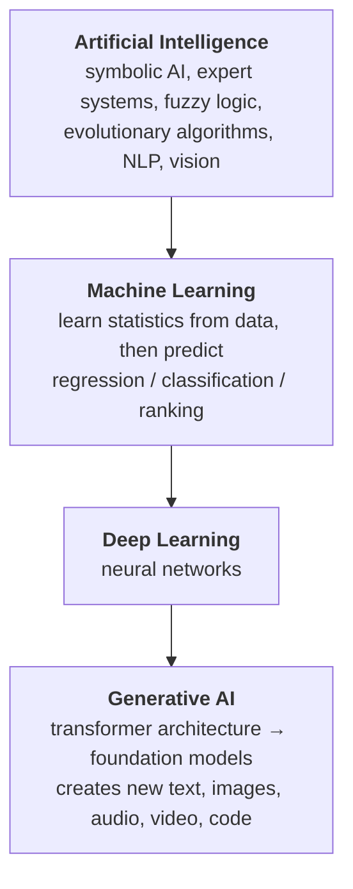
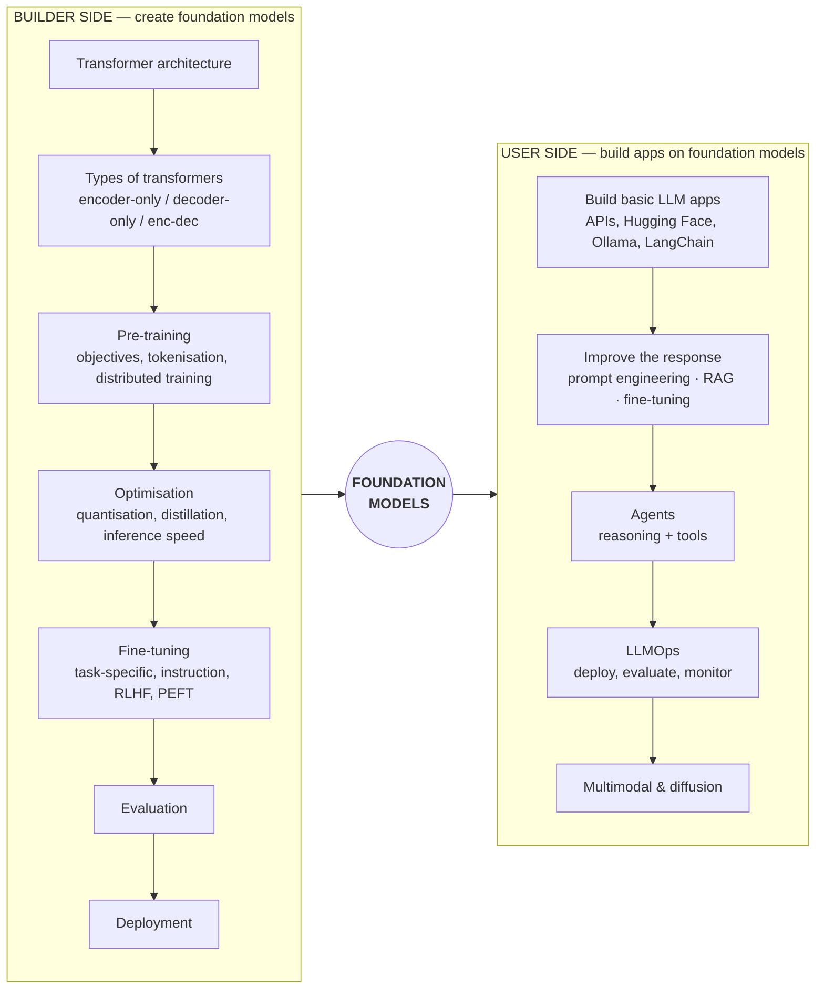

**In one line.** Generative AI moves too fast to memorise, so anchor it on one idea — the **foundation model** — and sort every new term into *building* one or *using* one.

## Why a mental model beats a reading list

The field ships a new model, paper or tool almost daily. A curriculum written as a flat list of topics is stale within weeks. What does not go stale is a **classification rule**: when you meet a new term, ask which side of the fence it lives on.

That rule needs a centre of gravity. The best candidate is the **foundation model**.

A foundation model is an AI model that is:

- **Huge** — billions of parameters, trained on internet-scale data at a cost measured in crores.
- **General, not task-specific** — unlike a classical ML model that predicts one thing, it does many things.

This is the break from classical ML. A regression model predicts a stock price and nothing else. A classifier separates cats from dogs and nothing else. A foundation model, trained to predict the next token over enough text, picks up summarisation, question answering, sentiment analysis, translation and code generation as side effects.

LLMs are the most familiar foundation models, but the category is wider — **LMMs** (large multimodal models) handle images, audio and video too. Say "foundation model" when you want the general case, "LLM" when you mean text.

## Where GenAI sits in the AI landscape

The outer rings are decades old. The inner ring is what changed: classical ML was never used where **human creativity** was required. Generative AI is.

## The mental model

**Play the sorting game.** Every time you meet a new term, place it:

| Term | Side | Why |
|---|---|---|
| Prompt engineering | User | You are shaping input to a model someone else trained |
| RLHF | Builder | It shapes model behaviour during training |
| RAG | User | You attach your own documents to a ready-made LLM |
| Pre-training | Builder | It *is* the process of creating the model |
| Quantisation | Builder | Compressing a trained model for cheaper inference |
| AI agents | User | Software built on top of an LLM |
| Vector databases | User | Infrastructure for RAG |
| Fine-tuning | **Both** | Deep fine-tuning is builder work; light adaptation is user work |

Fine-tuning straddling both sides is not a flaw in the model — it is the honest answer.

## Which side should you learn?

- **Builder side** is research scientist / ML engineer work. Prerequisites: ML fundamentals, deep learning fundamentals, and a framework (PyTorch preferred over TensorFlow).
- **User side** is more accessible. A competent software developer can be productive here quickly, and it is where most jobs currently are.

The honest advice: **learn the user side to build, and enough of the builder side to build well.** A developer who knows only the user side can ship. A developer who also understands how foundation models are made makes better choices — about context windows, about why a model hallucinates, about when fine-tuning beats RAG — and is paid accordingly. That combined role is what the market calls an **AI Engineer**.

## Is this technology worth the investment?

Worth asking before you spend a year on anything. A useful test is to compare against one clear success (the internet) and one technology that has not yet found its footing (crypto):

| Question | Internet | Crypto | Generative AI |
|---|---|---|---|
| Solves real-world problems? | Yes | Unclear | Yes — customer support, education, content, software |
| Used daily? | Yes | Rarely | Yes |
| Moves world economics? | Yes | Somewhat | Yes — model launches move trillion-dollar market caps |
| Creates new jobs? | Yes | Few | Yes — "AI Engineer" barely existed three years ago |
| Accessible to non-experts? | Yes | No | Yes — you operate it by typing plain English |

Five yeses. GenAI is tracking the internet, not crypto — and it has not yet reached its ceiling.

## The four biggest impact areas so far

1. **Customer support** — a chatbot handles tier one, humans handle escalation. Teams that needed ten people now need two or three.
2. **Content creation** — blogs, marketing copy, video scripts. You often cannot tell whether an article was written by a person.
3. **Education** — effectively a personal tutor available at all hours, which is quietly forcing schools to rethink assessment.
4. **Software development** — models write production-grade code, not just snippets.

## What this course covers

This course walks the **user side** in depth, using **LangChain** as the vehicle, because LangChain touches nearly every user-side topic at least once: closed and open-source models, prompting, structured output, RAG, agents, and a taste of LLMOps. Get through it and you will have a working map of the whole user-side landscape, plus a project that exercises all of it.

## Pitfalls

- **Chasing every new release.** Sort it with the mental model, then move on. Most releases do not change what you build.
- **Learning tools before concepts.** Frameworks churn; runnables, retrieval and tool calling do not.
- **Skipping the builder side entirely.** You do not need to train a model, but you should know what a context window is and why it exists.

## Checklist

- [ ] I can state the difference between a task-specific ML model and a foundation model
- [ ] I can sort a new term into builder side or user side
- [ ] I know which side I am optimising for, and why
- [ ] I can name the prerequisites for the side I picked
