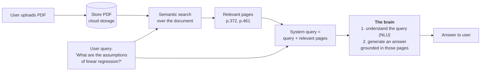
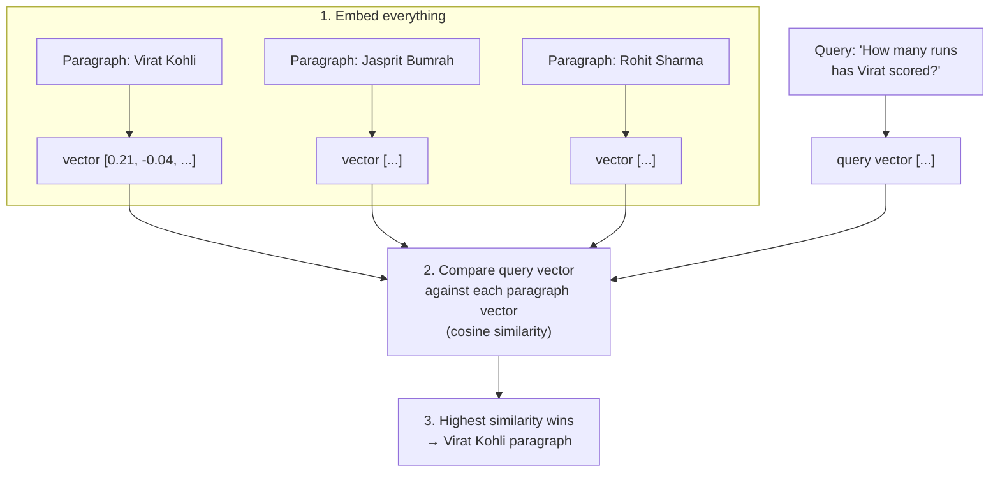
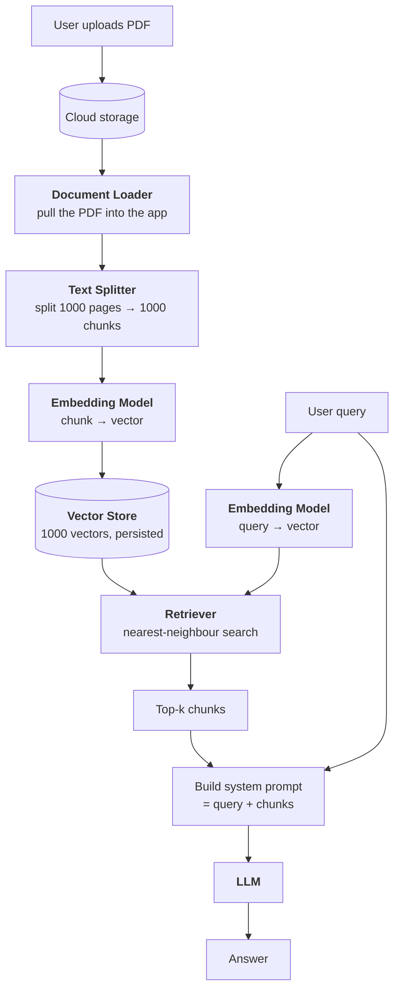

**In one line.** LangChain is an open-source framework for building LLM-powered applications; its real value is **orchestration** — wiring many moving parts together without writing mountains of glue code.

The one-sentence definition tells you almost nothing. The way to understand LangChain is to try to build something without it, hit the walls, and watch LangChain remove them one by one.

## The motivating problem: chat with your PDF

Imagine an app where a user uploads a PDF — say a 1000-page machine learning textbook — and can then *talk* to it:

- "Explain page 5 like I'm five."
- "Generate some true/false questions on linear regression."
- "Make notes on the decision tree chapter."

The user is not just reading the book. They are interrogating it.

## High-level design

### Why search first, instead of sending the whole book?

A fair objection: if the brain can read and answer, why not hand it all 1000 pages?

Think of a school analogy. You can walk up to your teacher and say *"Sir, I have a doubt in algebra, here is the whole textbook"* — or you can say *"Sir, I have a doubt on page 155."* The second gets a faster, sharper answer.

Same here. Narrowing to the relevant pages is **cheaper** (fewer tokens) and **more accurate** (less distraction). That is the entire case for retrieval.

### Keyword search is not good enough

Searching the literal words "assumptions" and "linear regression" across the book returns every page where either word appears — dozens of irrelevant hits. You want pages that are *about* the assumptions of linear regression, which is a question of **meaning**, not string matching.

## Semantic search, concretely

Suppose you have three paragraphs, one each about three cricketers, and the question *"How many runs has Virat scored?"* You know the answer lives in the first paragraph. How does code know?

An **embedding** turns a piece of text into a vector — a fixed-length list of numbers that encodes its meaning. Two texts about the same thing land close together in that space, regardless of which words they use. Once everything is a vector, "find the most relevant paragraph" becomes "find the nearest vector," which is arithmetic.

## The low-level design

## Three challenges — and how each was solved

### Challenge 1 — building the brain

You need a component that genuinely understands a query and then generates a grounded answer. Both are hard NLP problems that consumed decades of research.

**Solved in 2017 onwards.** The transformer paper, then BERT and GPT, then the LLM era. You do not build the brain any more; you use an LLM.

### Challenge 2 — running the brain

LLMs are enormous. Good open models exceed 100 GB. Hosting one on your own servers means serious engineering and a serious cloud bill — impossible for a small team.

**Solved by APIs.** OpenAI, Anthropic and Google host the models and expose HTTP endpoints. You send a prompt, you get a response, you pay per token. No GPUs to manage, and cost scales with usage.

### Challenge 3 — orchestration

This is the one still standing, and it is LangChain's reason to exist.

Count the moving parts in the diagram above: cloud storage, document loader, text splitter, embedding model, vector store, retriever, LLM. Count the tasks: load, split, embed, store, retrieve, assemble the prompt, call the model, parse the output. Each has its own API, its own data format, its own error modes.

Now suppose that next week OpenAI gets too expensive and you switch to Gemini. Or you migrate from S3 to GCS. Or you swap embedding models. Hand-written glue code means touching everything.

**LangChain's answer:** give every component a standard interface, so they snap together like Lego, and swapping one does not ripple through the rest.

## What LangChain gives you

**Chains.** Express your pipeline declaratively; the output of one step automatically becomes the input of the next. Sequential, parallel and conditional structures are all expressible.

**Model-agnostic development.** Switch between OpenAI, Anthropic, Google, Hugging Face or a local model by changing a line or two, not your architecture.

**A complete ecosystem.** Loaders for every source, dozens of splitters, every major embedding model, every major vector store — all behind common interfaces.

**Memory and state handling.** LLM API calls are stateless. Ask *"Who is Narendra Modi?"* then *"How old is he?"* and the second call has no idea who "he" is. Memory components carry conversation context forward.

## What people build with it

- **Conversational chatbots** — the first line of customer support at internet-scale companies.
- **AI knowledge assistants** — a chatbot that also knows *your* data: course material, internal docs, product manuals.
- **AI agents** — chatbots with hands. Not just "Goa is nice in December" but "booked, here's your confirmation."
- **Workflow automation** — personal, team or company scale.
- **Summarisation and research helpers** — process documents too large or too confidential for a public chat interface.

## Alternatives

LangChain is not the only option. **LlamaIndex** and **Haystack** are both mature and widely used. The choice usually comes down to pricing, ecosystem fit and which abstractions your team finds natural. Learn one properly and the concepts transfer.

## Pitfalls

- **Treating LangChain as the point.** The framework is glue. The concepts — retrieval, grounding, tool calling — are the durable part.
- **Reaching for it on trivial apps.** One prompt, one model, no retrieval? Call the provider SDK directly.
- **Version confusion.** LangChain has shipped three markedly different major versions. Code from v0.1 tutorials often will not run on v0.3. Check which version a snippet targets.

## Checklist

- [ ] I can explain why retrieval beats stuffing the whole document into the prompt
- [ ] I can explain semantic search in terms of embeddings and similarity
- [ ] I can name the three challenges and what solved each
- [ ] I can name the six pieces of the chat-with-PDF pipeline
