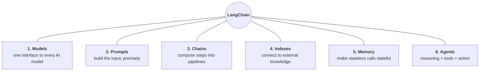
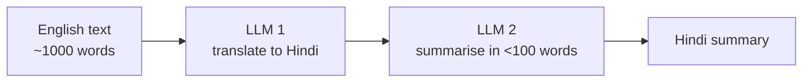
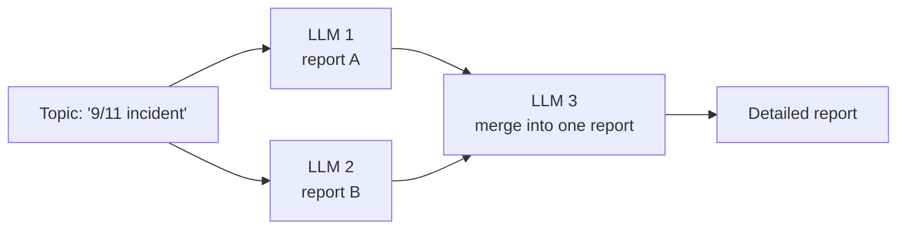
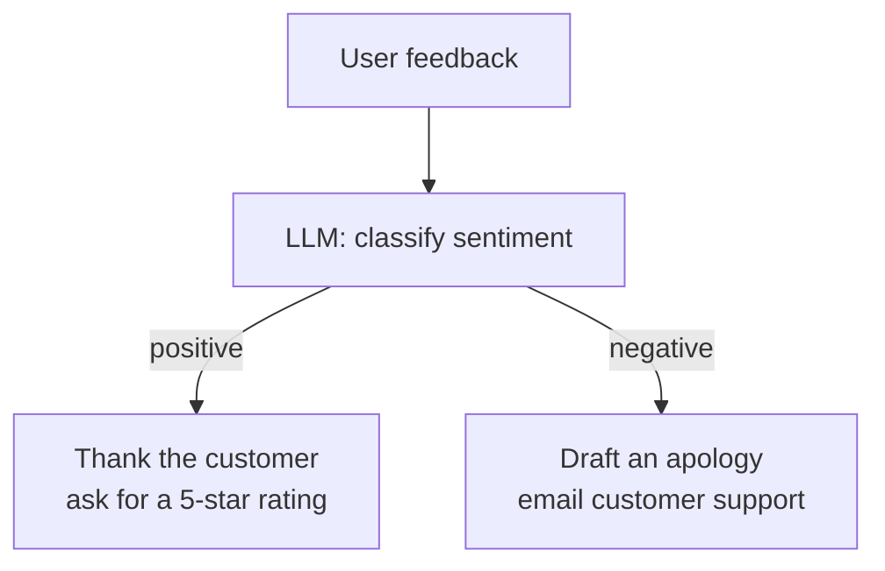
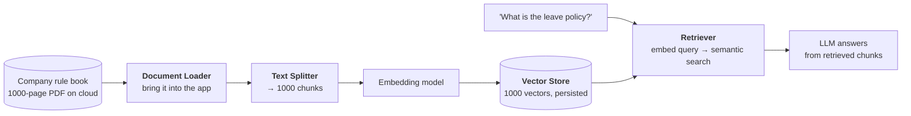
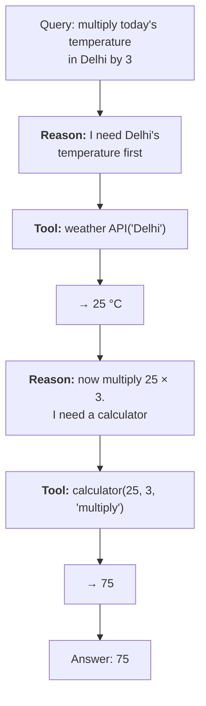

**In one line.** Learn these six boxes and you understand most of LangChain; everything else is detail hung off one of them.



## 1. Models — a common interface to every AI model

### The problem it solves

Three problems stacked on top of each other, each solved in turn:

1. **Understanding and generating language** — solved by LLMs.
2. **Running a 100 GB model** — solved by hosted APIs.
3. **Every provider's API being different** — *not* solved, until LangChain.

Problem three is the one that bites. OpenAI's SDK, Anthropic's SDK and Google's SDK have different call signatures, different parameter names, and return different response shapes. Use two providers in one app and you write two sets of code. Switch providers and you rewrite.

### What LangChain does

It standardises the interface. Swapping OpenAI for Anthropic is an import change and a class name — the `invoke` call and the response shape stay put.

```python
# OpenAI
from langchain_openai import ChatOpenAI
model = ChatOpenAI(model="gpt-4o")
print(model.invoke("What is the capital of India?").content)

# Anthropic - two lines differ, nothing else
from langchain_anthropic import ChatAnthropic
model = ChatAnthropic(model="claude-sonnet-4-5")
print(model.invoke("What is the capital of India?").content)
```

### Two kinds of model

| | Language models | Embedding models |
|---|---|---|
| Input | text | text |
| Output | **text** | **a vector of numbers** |
| Used for | chatbots, agents, generation | semantic search, RAG |

Both live under the Models component.

## 2. Prompts — the input is the product

A prompt is whatever you send to the model. LLM output is **extremely sensitive** to it: change "explain linear regression in an academic tone" to "…in a fun tone" and the response changes completely. One word.

That sensitivity is why prompt engineering became a discipline — and why LangChain gives prompts their own component rather than leaving you to f-strings.

### What you can build

**Dynamic prompts** — a template with placeholders filled at runtime:

```python
from langchain_core.prompts import PromptTemplate

template = PromptTemplate(
    template="Summarise {topic} in a {tone} tone.",
    input_variables=["topic", "tone"],
)
prompt = template.invoke({"topic": "cricket", "tone": "fun"})
```

**Role-based prompts** — a system message that sets persona, plus a user message:

```text
System: You are an experienced {profession}.
User:   Tell me about {topic}.
```

Fill in `doctor` and `viral fever`, and you have steered the model before it reads the question.

**Few-shot prompts** — show worked examples before asking. For a support-ticket classifier you would show three or four tickets with their correct category, then present the new one. The model infers the pattern.

## 3. Chains — pipelines where output feeds input

The component LangChain is named after.

Say you want: English text in → Hindi summary under 100 words out. You decide on two steps — translate to Hindi, then summarise.

Without chains you extract the output of step one and hand-feed it into step two. With chains you declare the pipeline and the plumbing is automatic.



Chains are not limited to straight lines:

**Parallel chains** — fan the same input to several models, then merge:



**Conditional chains** — branch on a value:



## 4. Indexes — connecting the model to knowledge it never saw

Ask ChatGPT about your company's leave policy and it cannot help. That policy was never in its training data. This is the single most common reason a stock LLM fails in a business context.

Indexes attach an **external knowledge source** — a PDF, a website, a database — to the model. Four sub-components do the work:



With that wired up, the model answers "Who is the Prime Minister of India?" from training data *and* "What is our notice period policy?" from your documents.

## 5. Memory — because API calls are stateless

Every LLM API call is independent. It remembers nothing.

```text
You:  Who is Narendra Modi?
LLM:  An Indian politician, the current Prime Minister of India.
You:  How old is he?
LLM:  As an AI, I don't have access to personal data about individuals...
```

The second call has no idea who "he" is. For a chatbot this is fatal — the user must re-state context every single turn.

### Memory strategies

| Type | What it stores | Trade-off |
|---|---|---|
| **Conversation buffer** | the entire history | perfect recall, cost grows without bound |
| **Buffer window** | the last *N* interactions | bounded cost, forgets older turns |
| **Summary** | an LLM-written summary of history | cheap, lossy |
| **Custom** | selected facts and user preferences | precise, needs design work |

The buffer approach is the default, and the reason it needs alternatives is simple: a long chat becomes a long prompt, and a long prompt is a large bill.

## 6. Agents — chatbots with hands

A chatbot understands and replies. An agent understands, replies **and acts**.

Ask a travel chatbot for the best summer destinations in India and it says Shimla, Manali. Ask an *agent* to book the cheapest flight to Shimla on the 24th, and it does.

Two capabilities make the difference:

1. **Reasoning** — breaking a request into steps (chain-of-thought and related techniques).
2. **Tools** — functions it can call to touch the outside world.

### A worked trace

Give an agent a calculator and a weather API, then ask: *"Multiply today's temperature in Delhi by 3."*



Neither step is magic. The model reasons about what it needs, picks a tool, reads the result, and reasons again.

## Pitfalls

- **Confusing Indexes with Memory.** Indexes bring in *external documents*. Memory carries *this conversation*. Different problems.
- **Assuming the model remembers.** It does not. Ever. If context matters, you send it.
- **Calling a tool-less chatbot an agent.** Without tools there is no action, and without action it is a chatbot.

## Checklist

- [ ] I can name all six components and the problem each solves
- [ ] I can explain why the Models component exists at all
- [ ] I can list the four sub-components of Indexes in order
- [ ] I can explain statelessness and name three memory strategies
- [ ] I can state the two things an agent has that a chatbot does not
