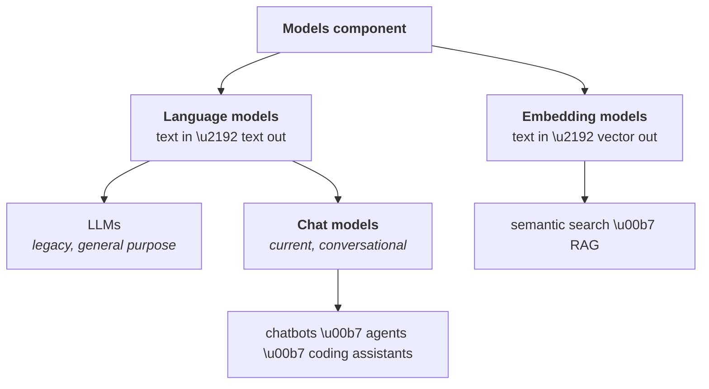

**In one line.** The Models component is a single interface to every AI model — language models that return text, and embedding models that return vectors.



## LLMs vs Chat models

Both are language models. The distinction matters because one is being retired.

| | LLM (legacy) | Chat model (current) |
|---|---|---|
| Purpose | free-form text generation | multi-turn conversation |
| Input | a plain string | a list of messages |
| Output | a plain string | a message object + metadata |
| Training | general text corpora | that, **plus** fine-tuning on chat data |
| Conversation history | not supported | supported |
| Role awareness (system/user/AI) | no | yes |
| LangChain class | `OpenAI` | `ChatOpenAI` |

**Use chat models.** LangChain's newer versions steer you away from the `LLM` classes, and support for them is quietly fading. Every example from here on uses chat models.

Internally the split is a class hierarchy: `OpenAI` inherits `BaseLLM`, while `ChatOpenAI` inherits `BaseChatModel`. That single fact explains all the behavioural differences above.

## Setup

```bash
python -m venv venv
source venv/bin/activate        # Windows: venv\Scripts\activate
pip install langchain langchain-openai langchain-anthropic \
            langchain-google-genai langchain-huggingface \
            python-dotenv scikit-learn numpy
```

Keep secrets out of source. Create a `.env`:

```bash
OPENAI_API_KEY="sk-..."
ANTHROPIC_API_KEY="sk-ant-..."
GOOGLE_API_KEY="..."
HUGGINGFACEHUB_ACCESS_TOKEN="hf_..."
```

:::warning Variable names are not arbitrary
Each integration looks for a specific environment variable name. Rename `OPENAI_API_KEY` to something else and `load_dotenv()` will load it fine, but the client will not find it. Use the exact names.
:::

## Closed-source chat models

The shape of the code never changes — only the import and the class.

```python
from dotenv import load_dotenv
load_dotenv()

# --- OpenAI ---
from langchain_openai import ChatOpenAI
model = ChatOpenAI(model="gpt-4o")

# --- Anthropic ---
# from langchain_anthropic import ChatAnthropic
# model = ChatAnthropic(model="claude-sonnet-4-5")

# --- Google ---
# from langchain_google_genai import ChatGoogleGenerativeAI
# model = ChatGoogleGenerativeAI(model="gemini-2.0-flash")

result = model.invoke("What is the capital of India?")
print(result.content)
```

`invoke` is the universal verb. You will meet it on prompts, parsers, retrievers, chains and tools — everything in LangChain answers to it. (Chapter [Runnables](/docs/genai/runnables) explains why.)

### Chat model responses carry metadata

An LLM returns a bare string. A chat model returns an object:

```python
result = model.invoke("What is the capital of India?")
print(result.content)          # 'The capital of India is New Delhi.'
print(result.response_metadata)  # token counts, model name, finish reason
```

Reach for `.content` when you want the answer; keep the rest when you want to track cost.

## The two parameters that matter most

### `temperature` — how deterministic the output is

Range roughly 0 to 2.

- **At 0**, the same input gives the same output every time.
- **As you raise it**, outputs vary and get more creative.

Test it yourself — ask for a five-line poem at 0, run it twice, and you get identical text. Do the same at 1.5 and you get two different poems.

| Use case | Suggested range |
|---|---|
| Factual answers, maths, code | 0.0 – 0.3 |
| General Q&A, explanation | 0.5 – 0.7 |
| Creative writing, jokes, stories | 0.9 – 1.2 |
| Deliberate brainstorming | 1.5+ |

```python
model = ChatOpenAI(model="gpt-4o", temperature=0)      # reproducible
model = ChatOpenAI(model="gpt-4o", temperature=1.5)    # varied
```

:::tip A common misconception
Temperature is not a "quality" or "intelligence" dial. It controls **randomness**. Low temperature is not smarter; it is more repeatable.
:::

### `max_completion_tokens` — capping the output

You pay per token. If you never need more than a short answer, cap it:

```python
model = ChatOpenAI(model="gpt-4o", max_completion_tokens=100)
```

A token is roughly a word — close enough for budgeting, not exactly true. Tokenisation is its own topic.

## Open-source models

Closed-source models are paid, and the weights sit on someone else's server. Open-source models are downloadable, free to run, and yours to modify.

| | Open source | Closed source |
|---|---|---|
| Cost | free to run locally | pay per API call |
| Control | fine-tune, modify, redeploy | none |
| Data privacy | data never leaves your machine | data goes to their servers |
| Customisation | full | limited or unavailable |
| Deployment | your servers or cloud | not applicable |

The privacy row is often the decisive one. If you cannot send confidential documents to a third party, open source is not a preference — it is the only option.

Popular families: **Llama** (Meta), **Mistral**, **Falcon**, **Qwen**, **DeepSeek**. They live on **Hugging Face**, the largest repository of open models.

### Option A — Hugging Face Inference API

The model stays on Hugging Face's servers; you call it.

```python
from langchain_huggingface import ChatHuggingFace, HuggingFaceEndpoint

llm = HuggingFaceEndpoint(
    repo_id="TinyLlama/TinyLlama-1.1B-Chat-v1.0",
    task="text-generation",
)
model = ChatHuggingFace(llm=llm)
print(model.invoke("What is the capital of India?").content)
```

### Option B — download and run locally

```python
from langchain_huggingface import ChatHuggingFace, HuggingFacePipeline

llm = HuggingFacePipeline.from_model_id(
    model_id="TinyLlama/TinyLlama-1.1B-Chat-v1.0",
    task="text-generation",
    pipeline_kwargs={"temperature": 0.5, "max_new_tokens": 100},
)
model = ChatHuggingFace(llm=llm)
print(model.invoke("What is the capital of India?").content)
```

First run downloads the weights and tokeniser — a few hundred MB even for a small model — and caches them. To put the cache somewhere other than the default:

```python
import os
os.environ["HF_HOME"] = "D:/huggingface_cache"
```

:::danger Local inference is heavy
On a machine with 8 GB RAM and no GPU, even a 1.1-billion-parameter model can take many minutes per response and make the machine unusable while it runs. Check your hardware before assuming local is the easy path.
:::

### Downsides of open-source models

- **Hardware.** Bigger models need serious GPUs.
- **Setup friction.** Downloading, configuring and serving takes real work.
- **Less polish.** Less RLHF means rougher, less aligned answers than a frontier closed model.
- **Limited multimodality.** Mostly text-only today.

## Embedding models

Same component, different output: text in, **vector** out.

### A single query

```python
from langchain_openai import OpenAIEmbeddings
from dotenv import load_dotenv
load_dotenv()

embedding = OpenAIEmbeddings(model="text-embedding-3-large", dimensions=32)
vector = embedding.embed_query("Delhi is the capital of India")
print(vector)   # 32 floats
```

`dimensions` trades accuracy for cost. A larger vector captures more nuance; a smaller one is cheaper to store and compare. Defaults are 1536 for the small model and 3072 for the large one.

### Multiple documents

```python
documents = [
    "Delhi is the capital of India",
    "Kolkata is the capital of West Bengal",
    "Paris is the capital of France",
]
vectors = embedding.embed_documents(documents)   # list of vectors
```

Note the two methods: `embed_query` for one string, `embed_documents` for a list.

### Open-source embeddings

```python
from langchain_huggingface import HuggingFaceEmbeddings

embedding = HuggingFaceEmbeddings(model_name="sentence-transformers/all-MiniLM-L6-v2")
vector = embedding.embed_query("Delhi is the capital of India")  # 384 dimensions
```

This model is about 90 MB — small enough to run comfortably on any laptop.

:::tip Embeddings are cheap
Paid embedding models cost a fraction of chat models — roughly the price of a coffee per million tokens. Unless privacy forbids it, the hosted embedding models are usually worth it for the quality gain.
:::

## Putting it together: document similarity search

A complete semantic search in thirty lines. This is RAG with the training wheels on.

```python
from langchain_openai import OpenAIEmbeddings
from sklearn.metrics.pairwise import cosine_similarity
from dotenv import load_dotenv
load_dotenv()

embedding = OpenAIEmbeddings(model="text-embedding-3-large", dimensions=300)

documents = [
    "Virat Kohli is an Indian cricketer known for his aggressive batting and leadership.",
    "MS Dhoni is a former Indian captain famous for his calm demeanour and finishing ability.",
    "Sachin Tendulkar, the Little Master, holds many batting records in international cricket.",
    "Rohit Sharma is known for his elegant batting and multiple double centuries.",
    "Jasprit Bumrah is an Indian fast bowler known for his unorthodox action and yorkers.",
]

query = "tell me about Bumrah"

doc_embeddings = embedding.embed_documents(documents)
query_embedding = embedding.embed_query(query)

# cosine_similarity expects 2-D inputs on both sides
scores = cosine_similarity([query_embedding], doc_embeddings)[0]

# keep the index while sorting, so we can map back to the document
index, score = sorted(enumerate(scores), key=lambda x: x[1])[-1]

print(query)
print(documents[index])
print("similarity:", round(float(score), 4))
```

Two details worth internalising, because they recur throughout RAG:

1. **`enumerate` before sorting.** Sorting destroys position, and position is how you find the original document. Pair each score with its index first.
2. **Both arguments to `cosine_similarity` must be 2-D.** Hence `[query_embedding]` rather than `query_embedding`.

### What is wrong with this code

Every run re-embeds all five documents. Embedding is a paid API call, and the documents have not changed. In production you embed once, **store** the vectors, and only embed the incoming query. That store is a [vector store](/docs/genai/vector-stores), and the search logic becomes a [retriever](/docs/genai/retrievers).

## Pitfalls

- **Using `OpenAI` instead of `ChatOpenAI`.** Legacy path, declining support.
- **Hard-coding API keys.** Use `.env` and add it to `.gitignore`.
- **Expecting free APIs to be reliable.** Hugging Face's free inference endpoints time out regularly. Fine for learning, not for demos.
- **Comparing embeddings from different models.** Vectors from different models live in different spaces. Similarity between them is meaningless.

## Checklist

- [ ] I can explain why chat models replaced LLMs
- [ ] I can switch providers by changing two lines
- [ ] I can predict what temperature 0 vs 1.5 does to repeated calls
- [ ] I can name three reasons to choose open source over closed source
- [ ] I can write a semantic search over a list of documents
- [ ] I can explain why re-embedding documents on every run is wrong
