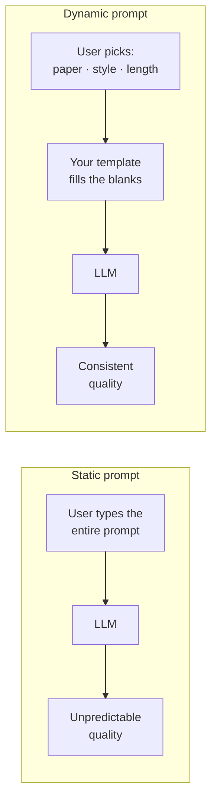
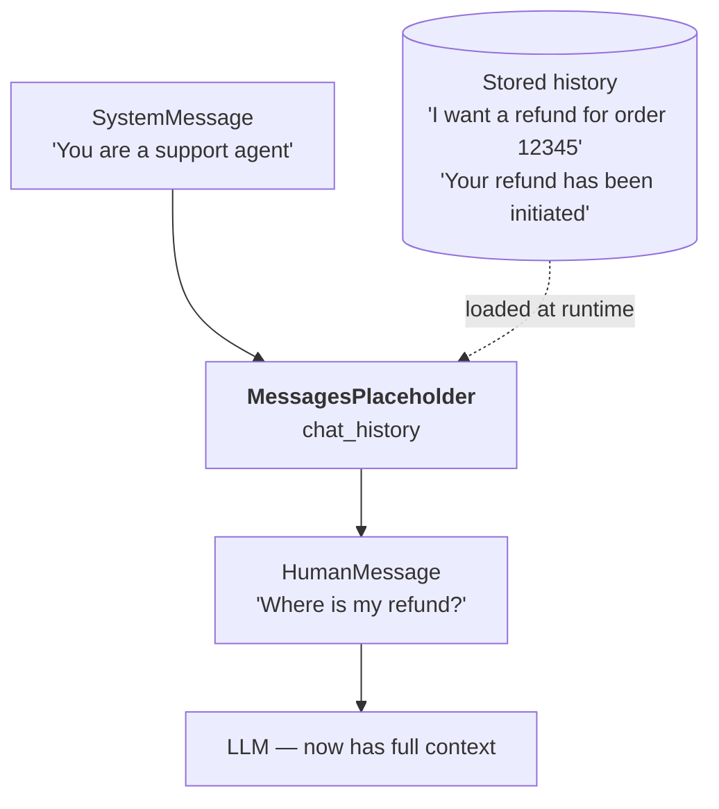

**In one line.** A prompt is the input to a model; LangChain's job is to make prompts **dynamic, validated, reusable and chainable** rather than strings glued together at call time.

## Static prompts and why they fail

The obvious design for a research-assistant app: give the user a text box, take whatever they type, send it to the model.

```python
import streamlit as st
from langchain_openai import ChatOpenAI
from dotenv import load_dotenv
load_dotenv()

model = ChatOpenAI(model="gpt-4o")

st.header("Research Tool")
user_input = st.text_input("Enter your prompt")

if st.button("Summarise"):
    result = model.invoke(user_input)
    st.write(result.content)
```

This is a **static prompt** — the user writes the whole thing. It works, and it is the wrong design.

The problem is that you have handed the user total control over an input the model is exquisitely sensitive to. They might misspell the paper title. They might ask for "maths heavy" where your app promised intuitive explanations. Two users get wildly different experiences from the same product. You cannot promise quality when you do not control the prompt.

## Dynamic prompts

Instead, you write the prompt and let the user fill in **specific blanks**, chosen from options you control.



```python
import streamlit as st
from langchain_openai import ChatOpenAI
from langchain_core.prompts import PromptTemplate
from dotenv import load_dotenv
load_dotenv()

model = ChatOpenAI(model="gpt-4o")

st.header("Research Tool")

paper_input = st.selectbox("Select a research paper", [
    "Attention Is All You Need",
    "BERT: Pre-training of Deep Bidirectional Transformers",
    "GPT-3: Language Models are Few-Shot Learners",
    "Diffusion Models Beat GANs on Image Synthesis",
])
style_input = st.selectbox("Explanation style",
                          ["Beginner-Friendly", "Technical", "Code-Oriented", "Mathematical"])
length_input = st.selectbox("Explanation length",
                            ["Short (1-2 paragraphs)", "Medium (3-5 paragraphs)", "Long (detailed)"])

template = PromptTemplate(
    template="""Summarise the research paper titled "{paper_input}" with the following specifications.

Explanation style: {style_input}
Explanation length: {length_input}

1. Include relevant mathematical equations if present in the paper.
2. Explain the mathematics using simple, intuitive code snippets where applicable.
3. Use analogies wherever they aid understanding.
4. If information on a point is unavailable, state "Insufficient information available"
   instead of inventing it.

Ensure the summary is clear, accurate and aligned with the requested style and length.""",
    input_variables=["paper_input", "style_input", "length_input"],
    validate_template=True,
)

if st.button("Summarise"):
    chain = template | model
    result = chain.invoke({
        "paper_input": paper_input,
        "style_input": style_input,
        "length_input": length_input,
    })
    st.write(result.content)
```

Note the anti-hallucination instruction in point 4. Telling the model what to do when it *does not know* is one of the highest-leverage lines you can put in a prompt.

## Why `PromptTemplate` instead of an f-string?

A fair question — an f-string interpolates just fine. Three reasons.

### 1. Validation at development time

With `validate_template=True`, a mismatch between placeholders and `input_variables` raises an error the moment you run the file — not at 2 a.m. in production when a user hits that code path.

```python
# Placeholder in the template but missing from input_variables -> error
# Name in input_variables but no matching placeholder -> error
```

### 2. Reusability

A template is an object. You can save it and load it anywhere:

```python
template.save("template.json")

from langchain_core.prompts import load_prompt
template = load_prompt("template.json")
```

Large prompts stop cluttering your application file, and the same prompt can back several pages or services.

### 3. It is a first-class citizen of the ecosystem

`PromptTemplate` is a Runnable, which means it composes with the pipe operator. Compare:

```python
# Without a chain - two invokes
prompt = template.invoke({...})
result = model.invoke(prompt)
print(result.content)

# With a chain - one invoke
chain = template | model
result = chain.invoke({...})
print(result.content)
```

An f-string cannot be piped. That alone settles it.

## Messages: the vocabulary of a conversation

Chat models do not take a string. They take a **list of messages**, each labelled with who said it.

| Message type | Sent by | Purpose |
|---|---|---|
| `SystemMessage` | you, the developer | set behaviour, role, constraints — always first |
| `HumanMessage` | the user | the actual question |
| `AIMessage` | the model | its reply |

```python
from langchain_core.messages import SystemMessage, HumanMessage, AIMessage
from langchain_openai import ChatOpenAI
from dotenv import load_dotenv
load_dotenv()

model = ChatOpenAI(model="gpt-4o")

messages = [
    SystemMessage(content="You are a helpful assistant."),
    HumanMessage(content="Tell me about LangChain."),
]

result = model.invoke(messages)
messages.append(AIMessage(content=result.content))

for m in messages:
    print(type(m).__name__, "->", m.content[:80])
```

## Building a chatbot, and fixing it twice

### Attempt 1 — no memory

```python
while True:
    user_input = input("You: ")
    if user_input.lower() == "exit":
        break
    result = model.invoke(user_input)
    print("AI:", result.content)
```

Try it:

```text
You: which is greater, 1 or 2?
AI:  2 is greater than 1.
You: multiply the bigger number by 10
AI:  If the bigger number is x, multiplying x by 10 gives 10x.
```

It should have said 20. Each call is independent, so the second turn has no idea what "the bigger number" was.

### Attempt 2 — send the history

```python
chat_history = []

while True:
    user_input = input("You: ")
    chat_history.append(user_input)
    if user_input.lower() == "exit":
        break
    result = model.invoke(chat_history)      # send everything
    chat_history.append(result.content)
    print("AI:", result.content)
```

Now it answers 20. But inspect `chat_history` and you find a flat list of strings with no indication of **who said what**. As the conversation grows, the model has to guess which lines were yours and which were its own — and it guesses wrong.

### Attempt 3 — labelled history

```python
from langchain_core.messages import SystemMessage, HumanMessage, AIMessage

chat_history = [SystemMessage(content="You are a helpful AI assistant.")]

while True:
    user_input = input("You: ")
    chat_history.append(HumanMessage(content=user_input))
    if user_input.lower() == "exit":
        break
    result = model.invoke(chat_history)
    chat_history.append(AIMessage(content=result.content))
    print("AI:", result.content)

print(chat_history)
```

Now every turn is labelled. This is the pattern every production chatbot uses.

## `ChatPromptTemplate` — dynamic *lists* of messages

`PromptTemplate` makes one dynamic string. `ChatPromptTemplate` makes a dynamic list of messages — the multi-turn equivalent.

```python
from langchain_core.prompts import ChatPromptTemplate

chat_template = ChatPromptTemplate([
    ("system", "You are a helpful {domain} expert."),
    ("human", "Explain in simple terms: what is {topic}?"),
])

prompt = chat_template.invoke({"domain": "cricket", "topic": "a googly"})
print(prompt)
```

:::warning Use tuples, not message objects
Passing `SystemMessage(content="You are a helpful {domain} expert.")` into `ChatPromptTemplate` looks natural and **does not substitute the placeholder** — the braces come out literally. The `("system", "...")` tuple form works. This is an inconsistency in the library, not a misunderstanding on your part.
:::

## `MessagesPlaceholder` — slotting in past history

Real chatbots resume conversations from days ago. You load history from a database and need somewhere in the template to put it.

Consider a support bot. Yesterday the customer requested a refund. Today they type *"Where is my refund?"* — meaningless without yesterday's context.

```python
from langchain_core.prompts import ChatPromptTemplate, MessagesPlaceholder

chat_template = ChatPromptTemplate([
    ("system", "You are a helpful customer support agent."),
    MessagesPlaceholder(variable_name="chat_history"),
    ("human", "{query}"),
])

# Load past turns from storage
chat_history = []
with open("chat_history.txt") as f:
    chat_history.extend(f.readlines())

prompt = chat_template.invoke({
    "chat_history": chat_history,
    "query": "Where is my refund?",
})
print(prompt)
```



## Few-shot prompting

Show examples before asking. Useful when the task is easier to demonstrate than to describe — classification especially.

```python
from langchain_core.prompts import FewShotChatMessagePromptTemplate, ChatPromptTemplate

examples = [
    {"ticket": "I was charged twice for my subscription this month", "category": "Billing Issue"},
    {"ticket": "The app crashes every time I try to log in",          "category": "Technical Problem"},
    {"ticket": "Can you explain how to upgrade my plan?",             "category": "General Enquiry"},
]

example_prompt = ChatPromptTemplate([
    ("human", "{ticket}"),
    ("ai", "{category}"),
])

few_shot = FewShotChatMessagePromptTemplate(
    example_prompt=example_prompt,
    examples=examples,
)

final_prompt = ChatPromptTemplate([
    ("system", "Classify each support ticket as Billing Issue, Technical Problem or General Enquiry."),
    few_shot,
    ("human", "{ticket}"),
])

chain = final_prompt | model
print(chain.invoke({"ticket": "My payment failed but money was deducted"}).content)
```

## Pitfalls

- **Letting users write the whole prompt.** Constrain them to the blanks that matter.
- **Forgetting `validate_template=True`.** It is free insurance.
- **Storing history as bare strings.** Always label with message types.
- **Assuming `SystemMessage` objects interpolate inside `ChatPromptTemplate`.** They do not.
- **Unbounded history.** Every past turn is re-sent and re-billed on every call.

## Checklist

- [ ] I can explain why static prompts are a product risk
- [ ] I can give three reasons `PromptTemplate` beats an f-string
- [ ] I can name the three message types and who sends each
- [ ] I can build a chatbot that answers follow-up questions correctly
- [ ] I know when to reach for `ChatPromptTemplate` vs `PromptTemplate`
- [ ] I can explain what `MessagesPlaceholder` is for
