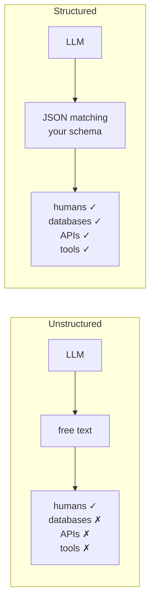

**In one line.** Text output lets an LLM talk to humans; **structured** output lets it talk to machines.

## The problem

Ask a model anything and you get prose. Prose is unstructured — you cannot insert it into a database column or pass it to a function that expects two integers.

Ask for a one-day Paris itinerary and you get:

> Here is a suggested itinerary. In the morning, visit the Eiffel Tower. In the afternoon, visit the Louvre. In the evening, have dinner at a bistro.

Useful to read, useless to a program. What you want is:

```json
[
  {"time": "morning",   "activity": "Visit the Eiffel Tower"},
  {"time": "afternoon", "activity": "Visit the Louvre"},
  {"time": "evening",   "activity": "Dinner at a bistro"}
]
```

Same information, now machine-readable. That is the entire idea.



## Three use cases worth knowing

**Data extraction.** A job portal takes uploaded résumés, extracts name, last company, education and skills as JSON, and writes rows to a database.

**API building.** An e-commerce site turns long free-text reviews into `{themes, summary, sentiment, pros, cons}` and exposes that as an endpoint.

**Agents.** This is the big one. An agent that wants to compute a square root cannot pass the sentence *"find the square root of two"* to a calculator — the calculator wants a number. Structured output is what converts the model's intent into arguments a tool can accept. Every tool call you will write later depends on this chapter.

## Two kinds of model

| | Can produce structured output natively | Cannot |
|---|---|---|
| Examples | GPT, Claude, Gemini | many small open-source models |
| LangChain approach | `with_structured_output()` | [Output parsers](/docs/genai/output-parsers) |

This chapter covers the first. The next chapter covers the second.

## `with_structured_output`

One extra call before `invoke`:

```python
structured_model = model.with_structured_output(Schema)
result = structured_model.invoke(text)
```

You can define `Schema` three ways. All three solve the same problem; they differ in what they guarantee.

## Way 1 — TypedDict

A `TypedDict` declares what keys a dictionary should have and what type each value should be.

```python
from typing import TypedDict

class Person(TypedDict):
    name: str
    age: int

new_person: Person = {"name": "Nitesh", "age": 35}
```

:::warning TypedDict does not validate
Write `{"name": 35}` and nothing stops you. The code runs. A `TypedDict` is a hint to your editor and to readers — never a runtime guarantee. Remember this; it is the reason Pydantic exists.
:::

### Using it for structured output

```python
from typing import TypedDict, Annotated, Optional, Literal
from langchain_openai import ChatOpenAI
from dotenv import load_dotenv
load_dotenv()

model = ChatOpenAI(model="gpt-4o")

class Review(TypedDict):
    key_themes: Annotated[list[str], "All key themes discussed in the review, as a list"]
    summary:    Annotated[str, "A brief summary of the review"]
    sentiment:  Annotated[Literal["pos", "neg"], "Overall sentiment: pos or neg"]
    pros:       Annotated[Optional[list[str]], "All pros, as a list"]
    cons:       Annotated[Optional[list[str]], "All cons, as a list"]
    name:       Annotated[Optional[str], "Name of the reviewer"]

structured_model = model.with_structured_output(Review)

review = """The Snapdragon processor is blazing fast and the 5000 mAh battery
easily lasts a full day. 45W charging is a genuine convenience. That said, the
bloatware is annoying and the phone heats up under sustained load.

Review by Nitesh Singh"""

result = structured_model.invoke(review)
print(result["summary"])
print(result["sentiment"])
print(result["pros"])
```

Three things to note:

- **`Annotated[type, "description"]`** attaches a description that reaches the model. Without it, the model infers meaning from the field name alone — usually fine, occasionally wrong. Descriptions are cheap insurance.
- **`Literal["pos", "neg"]`** restricts the model to those exact strings — handy when the value feeds a database column or a branch.
- **`Optional[...]`** marks a field that may be absent.

### What happens behind the scenes

There is no magic. LangChain constructs a system prompt from your schema — roughly *"You extract structured insights from text. Given a review, produce a summary and sentiment. Return JSON."* — appends your text, and asks a model that knows how to emit JSON. Engineering, not sorcery.

:::note `Optional` is a hint, not a guarantee
Remove the cons from a review and the model may still invent a `cons` field from anything faintly negative. If a field must genuinely be omitted when absent, say so explicitly in the prompt or the description.
:::

## Way 2 — Pydantic (the default choice)

Pydantic is a data validation library. Where `TypedDict` describes, Pydantic **enforces**.

```python
from pydantic import BaseModel, EmailStr, Field
from typing import Optional

class Student(BaseModel):
    name:  str = "Nitesh"                      # default value
    age:   Optional[int] = None                # optional
    email: EmailStr                            # validated as an email
    cgpa:  float = Field(gt=0, lt=10, default=5,
                         description="Decimal value representing the CGPA")

student = Student(name="Nitesh", age="32", email="abc@gmail.com", cgpa=8.5)
print(student)
print(student.model_dump())        # -> dict
print(student.model_dump_json())   # -> JSON string
```

What Pydantic gives you that `TypedDict` cannot:

- **Validation.** Pass an integer where a string is declared and it raises, rather than silently continuing.
- **Type coercion.** `age="32"` becomes the integer `32` automatically.
- **Built-in types.** `EmailStr` rejects `abc` and accepts `abc@gmail.com`.
- **Constraints.** `Field(gt=0, lt=10)` rejects a CGPA of 12.
- **Defaults and descriptions** in one place.
- **Conversion.** `model_dump()` for a dict, `model_dump_json()` for JSON.

### Using it for structured output

```python
from pydantic import BaseModel, Field
from typing import Optional, Literal
from langchain_openai import ChatOpenAI
from dotenv import load_dotenv
load_dotenv()

model = ChatOpenAI(model="gpt-4o")

class Review(BaseModel):
    key_themes: list[str] = Field(description="All key themes discussed in the review")
    summary:    str       = Field(description="A brief summary of the review")
    sentiment:  Literal["pos", "neg"] = Field(description="Overall sentiment")
    pros: Optional[list[str]] = Field(default=None, description="All pros")
    cons: Optional[list[str]] = Field(default=None, description="All cons")
    name: Optional[str]       = Field(default=None, description="Name of the reviewer")

structured_model = model.with_structured_output(Review)
result = structured_model.invoke(review)

print(result.summary)      # attribute access, not result["summary"]
print(result.model_dump()) # convert to a dict if you prefer
```

:::tip Attribute access, not subscript
`with_structured_output` returns a **Pydantic object**, so it is `result.summary`, not `result["summary"]`. Call `.model_dump()` first if you want dictionary syntax.
:::

## Way 3 — JSON Schema

Use this when the schema must be shared across languages — a Python backend and a JavaScript frontend, say. JSON is universal; Pydantic is not.

```python
json_schema = {
    "title": "Review",
    "type": "object",
    "properties": {
        "key_themes": {
            "type": "array",
            "items": {"type": "string"},
            "description": "All key themes discussed in the review",
        },
        "summary":   {"type": "string", "description": "A brief summary"},
        "sentiment": {"type": "string", "enum": ["pos", "neg"],
                      "description": "Overall sentiment"},
        "pros": {"type": ["array", "null"], "items": {"type": "string"},
                 "description": "All pros"},
        "cons": {"type": ["array", "null"], "items": {"type": "string"},
                 "description": "All cons"},
        "name": {"type": ["string", "null"], "description": "Reviewer name"},
    },
    "required": ["key_themes", "summary", "sentiment"],
}

structured_model = model.with_structured_output(json_schema)
result = structured_model.invoke(review)   # returns a plain dict
```

Note the vocabulary differences from Pydantic: `array` not `list`, `enum` not `Literal`, `"type": ["array", "null"]` for optional.

## Choosing between them

| | TypedDict | Pydantic | JSON Schema |
|---|---|---|---|
| Type hints | ✅ | ✅ | ✅ |
| Data validation | ❌ | ✅ | ❌ |
| Automatic type coercion | ❌ | ✅ | ❌ |
| Defaults | ❌ | ✅ | ✅ |
| Cross-language | ❌ | ❌ | ✅ |
| Extra dependency | no | yes | no |
| Returns | dict | object | dict |

**Default to Pydantic.** Validation is the reason structured output is trustworthy, and you are almost certainly working in Python. Reach for JSON Schema only when another language needs the same contract.

## `method`: JSON mode vs function calling

```python
model.with_structured_output(Review, method="json_mode")
model.with_structured_output(Review, method="function_calling")
```

- **`function_calling`** — the default for OpenAI, and what agents use under the hood.
- **`json_mode`** — works well with Claude and Gemini.

Rule of thumb: leave it alone for OpenAI; try `json_mode` if another provider misbehaves.

## When the model cannot do it at all

Swap `ChatOpenAI` for a small open-source model and the same code raises. A model like TinyLlama supports neither JSON mode nor function calling — it was never fine-tuned for it. That is exactly the gap [output parsers](/docs/genai/output-parsers) fill.

## Pitfalls

- **Using a dict subscript on a Pydantic result.** Use attributes, or `model_dump()`.
- **Trusting `TypedDict` to validate.** It does not. Ever.
- **Omitting descriptions.** Field names alone are ambiguous; descriptions reach the model.
- **Assuming `Optional` suppresses a field.** State it in the prompt if it matters.
- **Assuming every model supports this.** Most small open-source models do not.

## Checklist

- [ ] I can explain why unstructured output blocks database and tool integration
- [ ] I can write a schema three ways and say which I would ship
- [ ] I know what `Annotated`, `Literal` and `Optional` each contribute
- [ ] I know why Pydantic is the default and when JSON Schema wins
- [ ] I know what happens when a model cannot produce structured output
