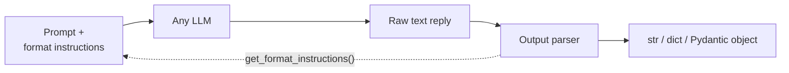

**In one line.** Output parsers turn raw model text into the shape your code wants — and unlike `with_structured_output`, they work with **any** model.

## Where they fit

The previous chapter used `with_structured_output`, which only works on models fine-tuned to emit JSON. Output parsers fill the gap by doing the work at the prompt-and-parse level instead:

1. Ask the parser for **format instructions** and append them to your prompt.
2. Let the model reply as text.
3. Hand that text back to the parser to convert.

Because everything happens in the prompt, it works everywhere — but note that parsers are useful with capable models too, mainly because they slot cleanly into chains.



LangChain ships many parsers — CSV, list, Markdown, datetime, enum, XML, and an output-fixing parser that retries on malformed output. Four cover most work.

## 1. StringOutputParser

The simplest one: take the model's response and give back the plain string.

```python
from langchain_core.output_parsers import StrOutputParser
parser = StrOutputParser()
```

"But I can just write `result.content`" — true, and that is the right objection. The value shows up in **chains**.

### The comparison that makes the case

Generate a detailed report on a topic, then summarise it in five lines. Two LLM calls.

**Without a parser:**

```python
prompt1 = template1.invoke({"topic": "black hole"})
result1 = model.invoke(prompt1)
prompt2 = template2.invoke({"text": result1.content})   # manual extraction
result2 = model.invoke(prompt2)
print(result2.content)                                   # manual extraction again
```

**With a parser:**

```python
from langchain_core.prompts import PromptTemplate
from langchain_core.output_parsers import StrOutputParser
from langchain_openai import ChatOpenAI
from dotenv import load_dotenv
load_dotenv()

model = ChatOpenAI(model="gpt-4o")
parser = StrOutputParser()

template1 = PromptTemplate(template="Write a detailed report on {topic}",
                           input_variables=["topic"])
template2 = PromptTemplate(template="Write a five-line summary of the following text.\n{text}",
                           input_variables=["text"])

chain = template1 | model | parser | template2 | model | parser
print(chain.invoke({"topic": "black hole"}))
```

One line. The parser is what lets the chain flow without a break — it converts the model's message object into the plain string the next template expects. Without it you cannot express this as a single chain at all.

## 2. JsonOutputParser

Forces JSON output. The fastest route to a dictionary.

```python
from langchain_core.output_parsers import JsonOutputParser
from langchain_core.prompts import PromptTemplate

parser = JsonOutputParser()

template = PromptTemplate(
    template="Give me five facts about {topic}.\n{format_instruction}",
    input_variables=["topic"],
    partial_variables={"format_instruction": parser.get_format_instructions()},
)

chain = template | model | parser
result = chain.invoke({"topic": "black holes"})
print(type(result))   # <class 'dict'>
```

Two ideas to absorb, because both recur in every parser below.

**`get_format_instructions()`** returns text the parser wants appended to your prompt — for this parser, roughly *"Return a JSON object."* You could write that yourself; letting the parser supply it keeps prompt and parser in sync.

**`partial_variables`** is for values filled *before* runtime. `topic` comes from the user at invoke time, so it is an `input_variable`. The format instruction comes from the parser at setup time, so it is a partial variable.

:::warning `invoke` always takes a dict
Even with no input variables, `chain.invoke({})` is required. `chain.invoke()` raises a missing-argument error.
:::

### The limitation

`JsonOutputParser` gives you JSON but **cannot enforce a schema**. Ask for five facts and you might get `{"facts_about_black_holes": [...]}` when you wanted `{"fact_1": ..., "fact_2": ...}`. The model decides the shape. That is what the next parser fixes.

## 3. StructuredOutputParser

Same as above, plus a schema you specify.

```python
from langchain.output_parsers import StructuredOutputParser, ResponseSchema

schema = [
    ResponseSchema(name="fact_1", description="Fact 1 about the topic"),
    ResponseSchema(name="fact_2", description="Fact 2 about the topic"),
    ResponseSchema(name="fact_3", description="Fact 3 about the topic"),
]

parser = StructuredOutputParser.from_response_schemas(schema)

template = PromptTemplate(
    template="Give three facts about {topic}.\n{format_instruction}",
    input_variables=["topic"],
    partial_variables={"format_instruction": parser.get_format_instructions()},
)

chain = template | model | parser
print(chain.invoke({"topic": "black holes"}))
# {'fact_1': '...', 'fact_2': '...', 'fact_3': '...'}
```

:::note Import path differs
This parser lives in `langchain`, not `langchain_core`. `langchain_core` holds the most-used components; less central ones live in the umbrella package. If an import fails, that split is usually why.
:::

### The limitation

It enforces **structure** but not **types**. Declare `age` and the model may return `"35 years"`. The shape is right, the value is unusable, and nothing stops it.

## 4. PydanticOutputParser

Structure *and* validation. The one you will use most.

```python
from langchain_core.output_parsers import PydanticOutputParser
from langchain_core.prompts import PromptTemplate
from pydantic import BaseModel, Field

class Person(BaseModel):
    name: str = Field(description="Name of the person")
    age:  int = Field(gt=18, description="Age of the person")
    city: str = Field(description="Name of the city the person belongs to")

parser = PydanticOutputParser(pydantic_object=Person)

template = PromptTemplate(
    template="Generate the name, age and city of a fictional {place} person.\n{format_instruction}",
    input_variables=["place"],
    partial_variables={"format_instruction": parser.get_format_instructions()},
)

chain = template | model | parser
result = chain.invoke({"place": "Sri Lankan"})
print(result.name, result.age, result.city)
```

Print the assembled prompt once and you will see what `get_format_instructions()` injects: a full JSON Schema derived from your Pydantic class, plus an example. That is how a model with no native JSON support still produces conforming output.

## Choosing a parser

| Parser | Gives you | Cannot |
|---|---|---|
| `StrOutputParser` | a plain string | anything structured |
| `JsonOutputParser` | a dict | enforce a schema |
| `StructuredOutputParser` | a dict matching your schema | validate types |
| `PydanticOutputParser` | a validated object | cross-language schemas |

## Parsers vs `with_structured_output`

| | `with_structured_output` | Output parsers |
|---|---|---|
| Model support | only models that can emit JSON | any model |
| Mechanism | provider-level JSON/function-calling mode | prompt instructions + parse |
| Composes in a chain | yes | yes |
| Reliability | higher (enforced by the provider) | depends on the model following instructions |

Use `with_structured_output` when the model supports it. Fall back to parsers when it does not — or when you want the parser as a chain step.

## Pitfalls

- **Forgetting `{format_instruction}`** in the template. The parser then has nothing to parse.
- **Calling `chain.invoke()` with no argument.** Pass `{}`.
- **Importing `StructuredOutputParser` from `langchain_core`.** It is in `langchain`.
- **Passing the whole result instead of `result.content`** when parsing manually. Chains hide this; manual code does not.
- **Expecting a small model to obey format instructions perfectly.** It often will not — consider the output-fixing parser.

## Checklist

- [ ] I can explain why `StrOutputParser` earns its keep despite `result.content`
- [ ] I can explain `get_format_instructions()` and `partial_variables`
- [ ] I can name each parser's limitation
- [ ] I can pick between `with_structured_output` and a parser
