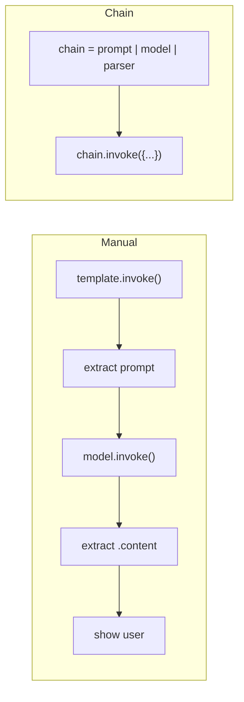
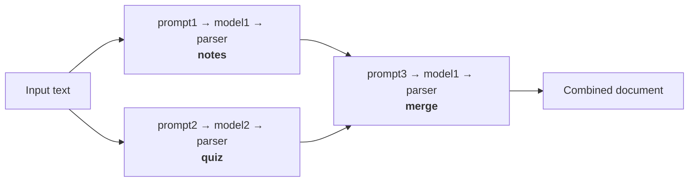
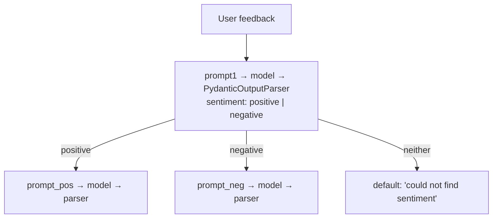

**In one line.** A chain is a pipeline where the output of one step automatically becomes the input of the next — and you declare it with `|`.

## Why chains

Every LLM app is a sequence of small steps: build a prompt, call the model, process the output. Do it manually and you invoke each piece and hand-carry results between them. That is tolerable for three steps and miserable for ten.



## A simple chain

```python
from langchain_openai import ChatOpenAI
from langchain_core.prompts import PromptTemplate
from langchain_core.output_parsers import StrOutputParser
from dotenv import load_dotenv
load_dotenv()

prompt = PromptTemplate(
    template="Generate five interesting facts about {topic}",
    input_variables=["topic"],
)
model = ChatOpenAI(model="gpt-4o")
parser = StrOutputParser()

chain = prompt | model | parser

print(chain.invoke({"topic": "cricket"}))
```

The `|` is the **pipe operator**, and this declarative style is called **LCEL** — LangChain Expression Language. It reads as a pipeline, which is exactly what it is.

You supply only the input the *first* step needs. Everything after is wired automatically.

### Visualising a chain

```python
chain.get_graph().print_ascii()
```

Prints the pipeline as a diagram. Useful for confirming a complex chain is shaped the way you think.

## Sequential chains

Same idea, more steps. Generate a detailed report, then summarise it:

```python
prompt1 = PromptTemplate(template="Generate a detailed report on {topic}",
                         input_variables=["topic"])
prompt2 = PromptTemplate(template="Generate a five-point summary from the following text.\n{text}",
                         input_variables=["text"])

chain = prompt1 | model | parser | prompt2 | model | parser
print(chain.invoke({"topic": "unemployment in India"}))
```

The parser between the two model calls is doing real work — it converts the message object into the string `prompt2` expects.

## Parallel chains

Run independent branches simultaneously, then merge. Take one document, generate notes *and* a quiz, then combine.



```python
from langchain_openai import ChatOpenAI
from langchain_anthropic import ChatAnthropic
from langchain_core.prompts import PromptTemplate
from langchain_core.output_parsers import StrOutputParser
from langchain.schema.runnable import RunnableParallel
from dotenv import load_dotenv
load_dotenv()

model1 = ChatOpenAI(model="gpt-4o")
model2 = ChatAnthropic(model="claude-sonnet-4-5")
parser = StrOutputParser()

prompt1 = PromptTemplate(template="Generate short and simple notes from the following text.\n{text}",
                         input_variables=["text"])
prompt2 = PromptTemplate(template="Generate five short question-answers from the following text.\n{text}",
                         input_variables=["text"])
prompt3 = PromptTemplate(template="Merge the provided notes and quiz into a single document.\nNotes: {notes}\nQuiz: {quiz}",
                         input_variables=["notes", "quiz"])

parallel_chain = RunnableParallel({
    "notes": prompt1 | model1 | parser,
    "quiz":  prompt2 | model2 | parser,
})

merge_chain = prompt3 | model1 | parser
chain = parallel_chain | merge_chain

print(chain.invoke({"text": "...your long document..."}))
```

`RunnableParallel` takes a dict. Every branch receives the **same input** and runs independently; the keys become the input variables of the next step. Note also that the two branches use different providers — perfectly fine.

## Conditional chains

Branch on a value. Classify feedback, then respond differently for positive and negative.



```python
from typing import Literal
from pydantic import BaseModel, Field
from langchain_core.output_parsers import PydanticOutputParser, StrOutputParser
from langchain_core.prompts import PromptTemplate
from langchain.schema.runnable import RunnableBranch, RunnableLambda
from langchain_openai import ChatOpenAI
from dotenv import load_dotenv
load_dotenv()

model = ChatOpenAI(model="gpt-4o")
parser = StrOutputParser()

class Feedback(BaseModel):
    sentiment: Literal["positive", "negative"] = Field(description="Sentiment of the feedback")

parser2 = PydanticOutputParser(pydantic_object=Feedback)

prompt1 = PromptTemplate(
    template="Classify the sentiment of the following feedback as positive or negative.\n{feedback}\n{format_instruction}",
    input_variables=["feedback"],
    partial_variables={"format_instruction": parser2.get_format_instructions()},
)

classifier_chain = prompt1 | model | parser2

prompt_pos = PromptTemplate(template="Write an appropriate response to this positive feedback.\n{feedback}",
                            input_variables=["feedback"])
prompt_neg = PromptTemplate(template="Write an appropriate response to this negative feedback.\n{feedback}",
                            input_variables=["feedback"])

branch_chain = RunnableBranch(
    (lambda x: x.sentiment == "positive", prompt_pos | model | parser),
    (lambda x: x.sentiment == "negative", prompt_neg | model | parser),
    RunnableLambda(lambda x: "Could not find sentiment"),   # default
)

chain = classifier_chain | branch_chain
print(chain.invoke({"feedback": "This is a terrible smartphone"}))
```

### Why the Pydantic parser is essential here

Without it, the classifier returns free text. It might say `negative`, or `Negative`, or `The sentiment is negative`. Your branch condition compares against `"positive"` and breaks on every variation.

`Literal["positive", "negative"]` forces exactly one of two strings. **Whenever a downstream branch depends on an LLM's answer, structure that answer first.** This is a general rule, not a detail of this example.

### `RunnableBranch` syntax

```python
RunnableBranch(
    (condition1, chain1),
    (condition2, chain2),
    default_chain,       # no condition - runs if nothing matched
)
```

If/elif/else for LangChain. Exactly one branch runs.

The default must be a **Runnable**, not a bare function — hence `RunnableLambda`, which wraps a plain Python callable so it can join a chain. More on that in [Runnables](/docs/genai/runnables).

## Pitfalls

- **Branching on unstructured output.** Force a `Literal` first.
- **Forgetting the parser between two prompts.** `prompt2` wants a string, not a message object.
- **Passing a bare lambda to `RunnableBranch`.** Wrap it in `RunnableLambda`.
- **Mismatched keys.** `RunnableParallel`'s dict keys must match the next prompt's input variables.

## Checklist

- [ ] I can build a sequential chain with `|`
- [ ] I can build a parallel chain with `RunnableParallel` and merge the branches
- [ ] I can build a conditional chain with `RunnableBranch`
- [ ] I can explain why conditional chains need structured output
- [ ] I can visualise a chain with `get_graph().print_ascii()`
