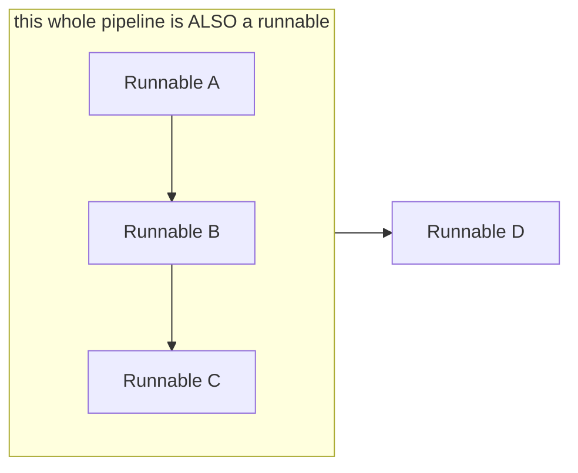
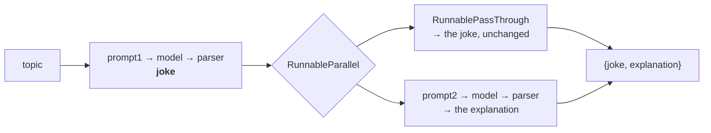

**In one line.** A runnable is a unit of work with a common interface; because every LangChain component is one, they snap together like Lego.

## How LangChain got here

Worth knowing, because it explains why the library looks the way it does.

**Phase 1 — components.** LangChain built a helper class for every part of an LLM app: prompt templates, model wrappers, document loaders, text splitters, vector stores, retrievers, output parsers, memory. Developers could plug them together instead of writing everything from scratch.

**Phase 2 — chains.** The team noticed that certain combinations appeared in every app — build a prompt, send it to a model. So they shipped built-in chains: `LLMChain` for prompt-plus-model, `RetrievalQAChain` for the whole RAG flow, and dozens more.

**Phase 3 — the problem.** Chains multiplied. That caused two failures:

- The codebase became large and hard to maintain.
- The learning curve got steep. With fifty chain classes, a newcomer has to know which chain fits which use case before writing anything.

In trying to help developers, the team made the library harder to learn.

**Phase 4 — the diagnosis.** The root cause was not too many chains. It was that **the components were never standardised**:

| Component | Method to call it |
|---|---|
| Prompt template | `format()` |
| LLM | `predict()` |
| Output parser | `parse()` |
| Retriever | `get_relevant_documents()` |

Four components, four names, four signatures. They were never designed to connect to each other, so connecting any two required custom glue — and every new pairing needed a new chain class. The chains were a symptom.

**Phase 5 — runnables.** Standardise everything behind one abstract interface. Then components connect directly, and the custom chain classes become unnecessary.

## What a runnable is

Four properties:

1. **A unit of work.** It takes an input, processes it, returns an output.
2. **A common interface.** Every runnable has `invoke`, `batch` and `stream`.
3. **Composable.** Connect two runnables and the first's output becomes the second's input, automatically.
4. **Closed under composition.** A chain of runnables **is itself a runnable** — so chains connect to chains.

Property 4 is the powerful one. It is why you can build arbitrarily complex workflows without new machinery.



Lego blocks follow the same four rules: each has a job, all share the same studs, they connect, and an assembly is itself connectable.

## Building it yourself

The fastest way to understand the design is to rebuild it in about sixty lines.

### Step 1 — unstandardised components

```python
import random
from abc import ABC, abstractmethod

class FakeLLM:
    def __init__(self):
        print("LLM created")

    def predict(self, prompt):                    # note: predict
        responses = ["Delhi is the capital of India",
                     "IPL is a cricket league",
                     "AI stands for Artificial Intelligence"]
        return {"response": random.choice(responses)}


class FakePromptTemplate:
    def __init__(self, template, input_variables):
        self.template = template
        self.input_variables = input_variables

    def format(self, input_dict):                 # note: format
        return self.template.format(**input_dict)
```

Using them means calling `format`, then `predict`, by hand. Worse, a chain class written for this pair cannot generalise — try writing one that supports *two* LLM calls and you will see the problem. The interfaces do not line up.

### Step 2 — introduce the abstraction

```python
class Runnable(ABC):
    @abstractmethod
    def invoke(self, input_data):
        pass
```

Now make every component inherit it. Python will refuse to instantiate any subclass that does not implement `invoke` — the enforcement mechanism.

```python
class FakeLLM(Runnable):
    def __init__(self):
        print("LLM created")

    def invoke(self, prompt):
        responses = ["Delhi is the capital of India",
                     "IPL is a cricket league",
                     "AI stands for Artificial Intelligence"]
        return {"response": random.choice(responses)}

    def predict(self, prompt):
        print("WARNING: predict is deprecated, use invoke instead")
        return self.invoke(prompt)


class FakePromptTemplate(Runnable):
    def __init__(self, template, input_variables):
        self.template = template
        self.input_variables = input_variables

    def invoke(self, input_dict):
        return self.template.format(**input_dict)

    def format(self, input_dict):
        print("WARNING: format is deprecated, use invoke instead")
        return self.invoke(input_dict)


class FakeStrOutputParser(Runnable):
    def invoke(self, input_data):
        return input_data["response"]
```

Keeping the old methods as deprecated shims is how real libraries migrate without breaking everyone's code overnight.

### Step 3 — one connector for all of them

```python
class RunnableConnector(Runnable):
    def __init__(self, runnable_list):
        self.runnable_list = runnable_list

    def invoke(self, input_data):
        for runnable in self.runnable_list:
            input_data = runnable.invoke(input_data)   # output becomes next input
        return input_data
```

That loop is the whole idea. Now chains of any length work:

```python
template = FakePromptTemplate(template="Write a {length} poem about {topic}",
                              input_variables=["length", "topic"])
llm = FakeLLM()
parser = FakeStrOutputParser()

chain = RunnableConnector([template, llm, parser])
print(chain.invoke({"length": "short", "topic": "India"}))
```

And because a `RunnableConnector` is itself a `Runnable`, chains nest:

```python
chain1 = RunnableConnector([template1, llm])
chain2 = RunnableConnector([template2, llm, parser])
final  = RunnableConnector([chain1, chain2])
print(final.invoke({"topic": "cricket"}))
```

Fifty chain classes replaced by one abstraction and one connector.

:::tip This is not a toy
Open `ChatOpenAI` in LangChain's source and follow the inheritance: `ChatOpenAI` → `BaseChatOpenAI` → `BaseChatModel` → `BaseLanguageModel` → `RunnableSerializable` → `Runnable`, which declares an abstract `invoke`. Exactly the structure above, with more layers.
:::

## Two kinds of runnable

**Task-specific runnables** are the components — `ChatOpenAI`, `PromptTemplate`, retrievers, parsers. Each has a purpose of its own, and was converted into a runnable so it composes.

**Runnable primitives** are the connectors — they orchestrate task-specific runnables into workflows. Five of them matter.

## The five primitives

### `RunnableSequence` — run in order

```python
from langchain.schema.runnable import RunnableSequence

chain = RunnableSequence(prompt, model, parser)
print(chain.invoke({"topic": "AI"}))
```

The `RunnableConnector` you just built, shipped.

### `RunnableParallel` — run branches simultaneously

Every branch receives the **same input** and runs independently; you get back a dict.

```python
from langchain.schema.runnable import RunnableParallel, RunnableSequence

parallel_chain = RunnableParallel({
    "tweet":    RunnableSequence(prompt1, model, parser),
    "linkedin": RunnableSequence(prompt2, model, parser),
})

result = parallel_chain.invoke({"topic": "AI"})
print(result["tweet"])
print(result["linkedin"])
```

### `RunnablePassThrough` — return the input unchanged

```python
from langchain.schema.runnable import RunnablePassthrough

passthrough = RunnablePassthrough()
print(passthrough.invoke(2))                    # 2
print(passthrough.invoke({"name": "Nitesh"}))   # {'name': 'Nitesh'}
```

A do-nothing runnable sounds useless. It is essential inside `RunnableParallel`, when you need to **carry a value forward** past a branch that transforms it.

Generate a joke, then explain it — and print both. A plain sequential chain only surfaces the last step's output, so the joke is lost. Pass it through on a parallel branch:



```python
joke_gen_chain = RunnableSequence(prompt1, model, parser)

parallel_chain = RunnableParallel({
    "joke":        RunnablePassthrough(),
    "explanation": RunnableSequence(prompt2, model, parser),
})

final_chain = RunnableSequence(joke_gen_chain, parallel_chain)
result = final_chain.invoke({"topic": "cricket"})
print(result["joke"])
print(result["explanation"])
```

### `RunnableLambda` — turn any Python function into a runnable

```python
from langchain.schema.runnable import RunnableLambda

def word_count(text):
    return len(text.split())

runnable_word_count = RunnableLambda(word_count)
print(runnable_word_count.invoke("hello how are you"))   # 4
```

This is how custom logic joins a chain. Preprocessing (strip HTML, lowercase, remove punctuation), post-processing, formatting, counting — anything.

```python
parallel_chain = RunnableParallel({
    "joke":       RunnablePassthrough(),
    "word_count": RunnableLambda(lambda x: len(x.split())),
})

final_chain = RunnableSequence(joke_gen_chain, parallel_chain)
result = final_chain.invoke({"topic": "AI"})
print(f'{result["joke"]}\n\nword count: {result["word_count"]}')
```

:::tip It takes lambdas or named functions
`RunnableLambda(word_count)` and `RunnableLambda(lambda x: len(x.split()))` are equivalent. Use a named function when the logic deserves a name.
:::

### `RunnableBranch` — if/else

```python
from langchain.schema.runnable import RunnableBranch

branch_chain = RunnableBranch(
    (lambda x: len(x.split()) > 300, RunnableSequence(prompt2, model, parser)),
    RunnablePassthrough(),     # default: short enough, pass through unchanged
)

final_chain = RunnableSequence(report_gen_chain, branch_chain)
print(final_chain.invoke({"topic": "Russia vs Ukraine"}))
```

Generate a report; summarise it only if it exceeds 300 words.

## LCEL

Of the five, `RunnableSequence` is everywhere — inside parallel branches, inside passthrough flows, inside branches. So LangChain gave it a shorthand:

```python
# Verbose
chain = RunnableSequence(prompt, model, parser)

# LCEL - identical
chain = prompt | model | parser
```

That is **LangChain Expression Language**: a declarative syntax for chains. Today the pipe operator covers sequences only; the other primitives still use their classes. Expect that to expand.

**Use LCEL.** You will rarely write `RunnableSequence` by hand again.

## Pitfalls

- **Forgetting primitives are runnables too.** That is exactly why they nest.
- **Passing a bare function into a chain.** Wrap it in `RunnableLambda`.
- **Expecting parallel branches to see different inputs.** They all see the same one.
- **Losing intermediate values.** Use `RunnablePassThrough` to carry them forward.

## Checklist

- [ ] I can explain why the chain explosion happened and what fixed it
- [ ] I can state the four properties of a runnable
- [ ] I can implement a minimal `Runnable` + connector from scratch
- [ ] I can name all five primitives and when to reach for each
- [ ] I can explain why `RunnablePassThrough` is not pointless
- [ ] I know what LCEL covers today
